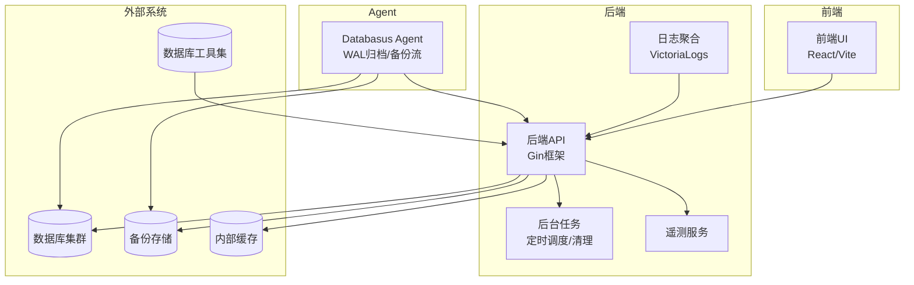
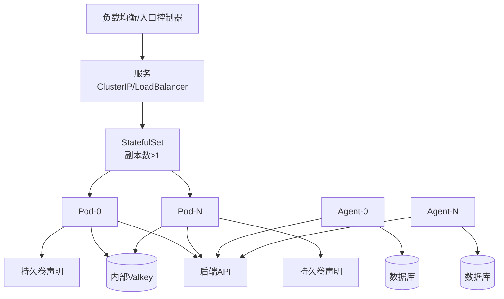
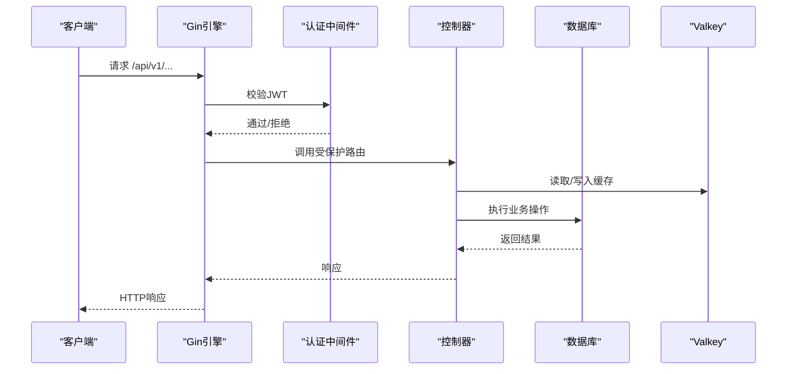
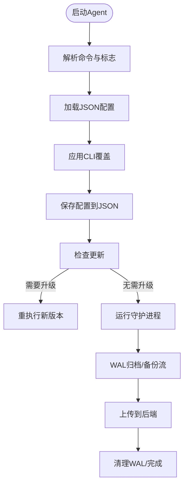
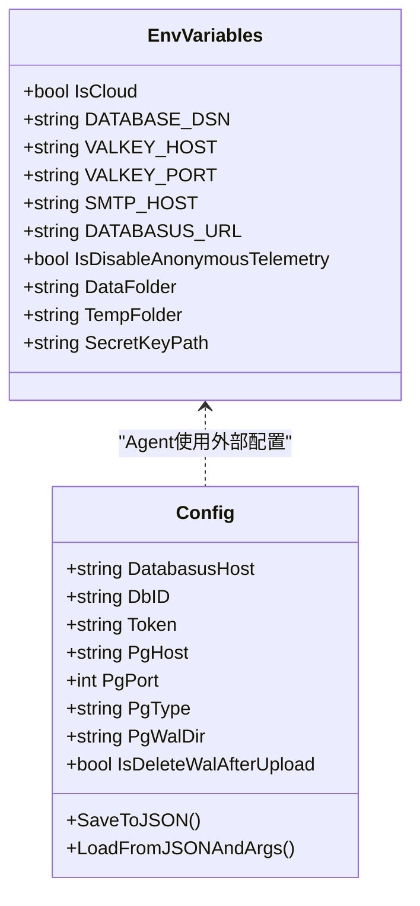
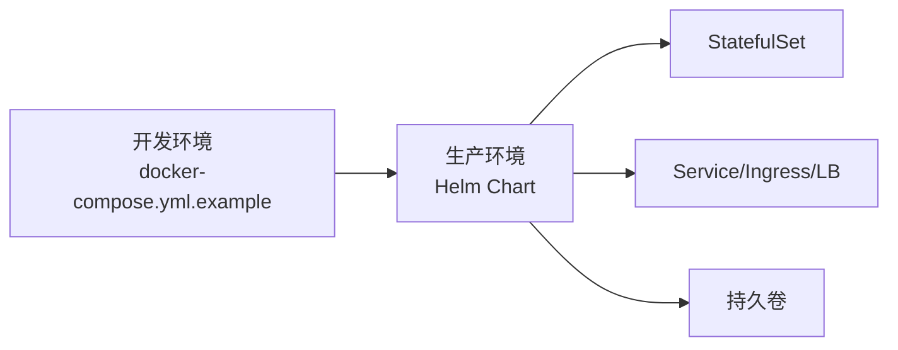
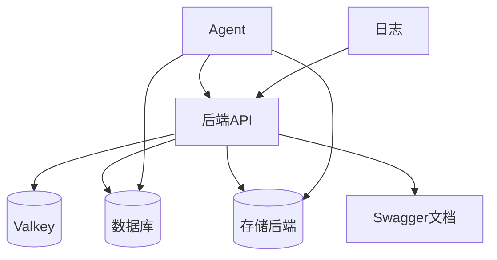

# 生产环境部署指南

<cite>
**本文档引用的文件**
- [README.md](file://README.md)
- [backend/cmd/main.go](file://backend/cmd/main.go)
- [agent/cmd/main.go](file://agent/cmd/main.go)
- [backend/internal/config/config.go](file://backend/internal/config/config.go)
- [agent/internal/config/config.go](file://agent/internal/config/config.go)
- [deploy/helm/values.yaml](file://deploy/helm/values.yaml)
- [deploy/helm/templates/statefulset.yaml](file://deploy/helm/templates/statefulset.yaml)
- [deploy/helm/Chart.yaml](file://deploy/helm/Chart.yaml)
- [docker-compose.yml.example](file://docker-compose.yml.example)
- [install-databasus.sh](file://install-databasus.sh)
- [backend/internal/util/logger/logger.go](file://backend/internal/util/logger/logger.go)
- [backend/internal/features/telemetry/service.go](file://backend/internal/features/telemetry/service.go)
</cite>

## 目录
1. [简介](#简介)
2. [项目结构](#项目结构)
3. [核心组件](#核心组件)
4. [架构概览](#架构概览)
5. [详细组件分析](#详细组件分析)
6. [依赖关系分析](#依赖关系分析)
7. [性能考虑](#性能考虑)
8. [故障排除指南](#故障排除指南)
9. [结论](#结论)
10. [附录](#附录)

## 简介
本指南面向生产环境的系统管理员与运维工程师，提供基于Databasus代码库的完整部署最佳实践。内容涵盖硬件与网络规划、安全配置、高可用架构、性能优化、监控告警、容量规划与扩展、合规与审计，以及运维手册与故障排除。

## 项目结构
Databasus采用前后端分离与多模块架构：
- 后端服务（Go）：提供REST API、调度器、备份/恢复引擎、审计与遥测
- 前端（React/Vite）：管理界面与用户交互
- Agent（Go）：数据库代理，负责WAL归档与物理备份流传输
- 部署：支持Docker Compose与Kubernetes Helm Chart
- 资源工具：内置多种数据库版本的客户端工具，便于本地测试与兼容性验证

**图表来源**
- [backend/cmd/main.go:213-276](file://backend/cmd/main.go#L213-L276)
- [agent/cmd/main.go:30-48](file://agent/cmd/main.go#L30-L48)
- [backend/internal/config/config.go:33-41](file://backend/internal/config/config.go#L33-L41)

**章节来源**
- [README.md:124-222](file://README.md#L124-L222)
- [backend/cmd/main.go:213-276](file://backend/cmd/main.go#L213-L276)
- [agent/cmd/main.go:30-48](file://agent/cmd/main.go#L30-L48)

## 核心组件
- 后端API服务：路由注册、认证中间件、GZIP压缩、优雅关闭、Swagger文档生成
- 数据库与存储：支持PostgreSQL、MySQL、MariaDB、MongoDB；多存储后端（S3、Google Drive、FTP、NAS、SFTP、Rclone等）
- 备份与恢复：逻辑备份、物理备份、增量备份（WAL）、PITR
- 审计与遥测：系统活动审计、匿名遥测收集
- Agent：轻量代理，支持主机与容器模式，负责WAL队列与备份流
- 部署方式：Docker单实例、Docker Compose、Kubernetes Helm Chart

**章节来源**
- [backend/cmd/main.go:112-137](file://backend/cmd/main.go#L112-L137)
- [backend/internal/config/config.go:25-146](file://backend/internal/config/config.go#L25-L146)
- [agent/internal/config/config.go:16-31](file://agent/internal/config/config.go#L16-L31)

## 架构概览
生产级部署推荐使用Kubernetes StatefulSet，结合Ingress或LoadBalancer暴露服务，并通过Helm Chart进行标准化配置。Agent可按需部署在数据库侧或容器内，实现零信任备份流。

**图表来源**
- [deploy/helm/templates/statefulset.yaml:1-106](file://deploy/helm/templates/statefulset.yaml#L1-L106)
- [deploy/helm/values.yaml:12-44](file://deploy/helm/values.yaml#L12-L44)

**章节来源**
- [deploy/helm/values.yaml:17-92](file://deploy/helm/values.yaml#L17-L92)
- [deploy/helm/templates/statefulset.yaml:42-83](file://deploy/helm/templates/statefulset.yaml#L42-L83)

## 详细组件分析

### 后端服务（API与后台任务）
- 路由与中间件：启用GZIP压缩、CORS（开发模式）、全局recover处理、Swagger文档
- 认证与授权：基于JWT的认证中间件，受保护路由按模块注册
- 后台任务：备份/恢复调度、健康检查尝试、审计日志清理、下载令牌清理、节点注册表、遥测上报
- 优雅关闭：信号处理、超时控制、VictoriaLogs写入器关闭

**图表来源**
- [backend/cmd/main.go:213-257](file://backend/cmd/main.go#L213-L257)
- [backend/cmd/main.go:293-374](file://backend/cmd/main.go#L293-L374)

**章节来源**
- [backend/cmd/main.go:112-137](file://backend/cmd/main.go#L112-L137)
- [backend/cmd/main.go:213-257](file://backend/cmd/main.go#L213-L257)
- [backend/cmd/main.go:293-374](file://backend/cmd/main.go#L293-L374)

### Agent组件（数据库代理）
- 命令模型：start、stop、status、restore、version
- 配置加载：优先从JSON配置文件读取，支持CLI覆盖；默认值与敏感信息掩码
- 运行模式：守护进程启动、升级检测与重执行、恢复流程
- 恢复参数：目标pgdata目录、备份ID、PITR时间点、类型（host/docker）

**图表来源**
- [agent/cmd/main.go:30-48](file://agent/cmd/main.go#L30-L48)
- [agent/cmd/main.go:77-97](file://agent/cmd/main.go#L77-L97)
- [agent/internal/config/config.go:33-64](file://agent/internal/config/config.go#L33-L64)

**章节来源**
- [agent/cmd/main.go:30-48](file://agent/cmd/main.go#L30-L48)
- [agent/cmd/main.go:77-97](file://agent/cmd/main.go#L77-L97)
- [agent/internal/config/config.go:33-64](file://agent/internal/config/config.go#L33-L64)

### 配置与环境变量
- 后端环境变量：数据库DSN、Valkey连接、云模式开关、测试端口、SMTP、应用URL、匿名遥测开关
- Agent配置：Databasus主机、数据库ID、令牌、PostgreSQL连接参数、WAL目录、删除策略
- 默认路径：数据目录、临时目录、密钥文件、遥测实例文件

**图表来源**
- [backend/internal/config/config.go:25-146](file://backend/internal/config/config.go#L25-L146)
- [agent/internal/config/config.go:16-31](file://agent/internal/config/config.go#L16-L31)

**章节来源**
- [backend/internal/config/config.go:25-146](file://backend/internal/config/config.go#L25-L146)
- [agent/internal/config/config.go:16-31](file://agent/internal/config/config.go#L16-L31)

### 部署方式与资源规划
- Docker单实例：端口映射4005，挂载数据目录，自动重启
- Docker Compose：示例文件用于本地开发，生产请参考Helm
- Kubernetes Helm：StatefulSet、Headless Service、持久卷、探针、滚动更新策略

**图表来源**
- [docker-compose.yml.example:1-19](file://docker-compose.yml.example#L1-L19)
- [deploy/helm/templates/statefulset.yaml:1-106](file://deploy/helm/templates/statefulset.yaml#L1-L106)
- [deploy/helm/values.yaml:17-92](file://deploy/helm/values.yaml#L17-L92)

**章节来源**
- [docker-compose.yml.example:1-19](file://docker-compose.yml.example#L1-L19)
- [deploy/helm/values.yaml:17-92](file://deploy/helm/values.yaml#L17-L92)
- [deploy/helm/templates/statefulset.yaml:1-106](file://deploy/helm/templates/statefulset.yaml#L1-L106)

## 依赖关系分析
- 组件耦合：后端API依赖Valkey缓存、数据库、存储后端；Agent依赖后端API与数据库
- 外部依赖：PostgreSQL/MySQL/MariaDB/MongoDB客户端工具；Helm Chart依赖Kubernetes API
- 配置契约：后端通过环境变量驱动行为；Agent通过JSON配置文件与CLI标志

**图表来源**
- [backend/cmd/main.go:213-276](file://backend/cmd/main.go#L213-L276)
- [agent/cmd/main.go:30-48](file://agent/cmd/main.go#L30-L48)

**章节来源**
- [backend/cmd/main.go:213-276](file://backend/cmd/main.go#L213-L276)
- [agent/cmd/main.go:30-48](file://agent/cmd/main.go#L30-L48)

## 性能考虑
- 网络吞吐：节点网络吞吐默认125MB/s（1Gbps），可根据实际带宽调整
- 并发与资源：Helm默认资源请求/限制均为1核CPU、1Gi内存，建议根据数据库规模与并发任务调整
- 缓存与I/O：Valkey作为内部缓存，建议独立部署以降低耦合；备份/恢复任务使用临时目录，注意磁盘I/O与空间
- 压缩与传输：GZIP中间件对静态资源生效，备份流采用无损压缩与流式传输

**章节来源**
- [backend/internal/config/config.go:282-284](file://backend/internal/config/config.go#L282-L284)
- [deploy/helm/values.yaml:27-33](file://deploy/helm/values.yaml#L27-L33)

## 故障排除指南
- 启动失败：检查.env配置、数据库DSN、Valkey连接；查看后端日志与VictoriaLogs
- 优雅关闭：确认信号处理与超时设置，避免长时间阻塞
- Agent状态：使用status命令检查运行状态，必要时stop并重新start
- 密钥与遥测：确认密钥文件存在与权限，遥测可通过环境变量禁用
- 升级与重执行：Agent升级后会自动重执行，若失败检查权限与路径

**章节来源**
- [backend/cmd/main.go:175-211](file://backend/cmd/main.go#L175-L211)
- [agent/cmd/main.go:99-115](file://agent/cmd/main.go#L99-L115)
- [backend/internal/util/logger/logger.go:57-62](file://backend/internal/util/logger/logger.go#L57-L62)

## 结论
Databasus提供了生产级的数据库备份与管理能力，结合Kubernetes与Helm可实现高可用与弹性扩展。通过合理的硬件与网络规划、严格的安全配置、完善的监控与告警体系，以及规范的运维流程，可满足企业级备份与恢复需求。

## 附录

### 硬件与网络规划建议
- CPU：每副本至少1核，高峰期建议2核以上
- 内存：每副本1-2Gi，根据并发任务与缓存需求调整
- 存储：持久卷建议SSD，容量按备份保留策略与增长预测预留冗余
- 网络：千兆以上带宽，WAL与备份流优先使用内网；启用TLS与访问控制

### 安全配置要点
- 网络安全：仅开放4005端口，使用Ingress/LB与WAF；启用TLS与证书校验
- 访问控制：JWT认证、最小权限原则、定期轮换密钥
- 机密管理：密钥文件权限限制，避免明文存储；审计所有敏感操作
- Agent集成：Agent与后端通信使用令牌，WAL目录权限最小化

### 高可用与容灾
- 集群部署：StatefulSet多副本，Headless Service与滚动更新
- 负载均衡：Ingress或LoadBalancer，健康检查路径/api/v1/system/health
- 备份策略：多存储后端冗余，启用加密与只读访问
- 灾难恢复：定期演练PITR与跨区域恢复，记录恢复时间目标

### 监控与告警
- 应用监控：后端API指标、备份成功率、任务耗时
- 基础设施监控：CPU/内存/磁盘/网络、Valkey健康、存储使用率
- 日志聚合：启用VictoriaLogs，集中采集后端与Agent日志
- 告警通知：阈值告警、失败重试、SLA监控

### 容量规划与扩展
- 水平扩展：增加StatefulSet副本数，配合负载均衡
- 垂直扩展：提升CPU/内存配额，优化备份并发
- 存储扩容：动态扩持久卷，监控备份增长趋势
- 网络带宽：根据备份窗口与并发任务调整带宽

### 合规与审计
- 数据保护：启用加密存储与传输，最小化日志中敏感信息
- 审计日志：开启系统审计，保留足够时间窗口
- 合规报告：定期生成备份完整性与访问日志报告

### 运维手册
- 日常维护：检查健康检查、清理过期备份、更新Agent与后端
- 紧急响应：快速定位失败任务、回滚变更、切换备用存储
- 性能诊断：分析慢查询、备份耗时、缓存命中率
- 问题解决：利用Swagger文档调试API、查看后端与Agent日志