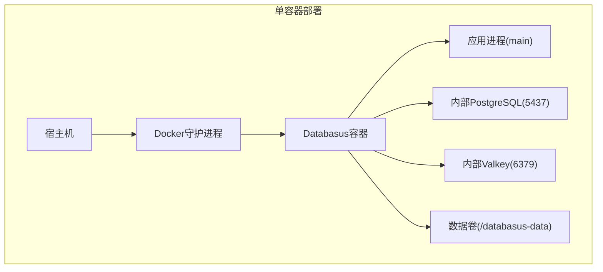
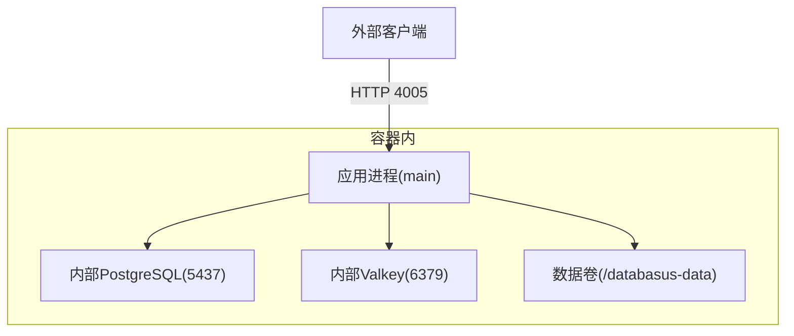
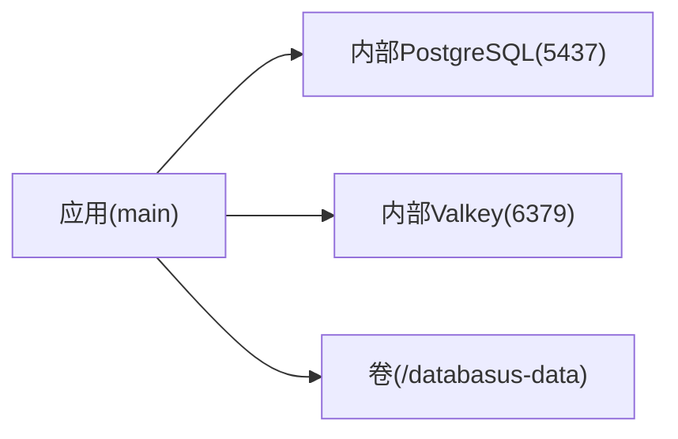

# 简单Docker运行

<cite>
**本文引用的文件**
- [Dockerfile](file://Dockerfile)
- [docker-compose.yml.example](file://docker-compose.yml.example)
- [install-databasus.sh](file://install-databasus.sh)
- [backend/cmd/main.go](file://backend/cmd/main.go)
- [backend/internal/config/config.go](file://backend/internal/config/config.go)
- [agent/cmd/main.go](file://agent/cmd/main.go)
- [agent/docker-compose.yml.example](file://agent/docker-compose.yml.example)
- [agent/e2e/docker-compose.yml](file://agent/e2e/docker-compose.yml)
</cite>

## 目录
1. [简介](#简介)
2. [项目结构](#项目结构)
3. [核心组件](#核心组件)
4. [架构总览](#架构总览)
5. [详细组件分析](#详细组件分析)
6. [依赖分析](#依赖分析)
7. [性能考虑](#性能考虑)
8. [故障排除指南](#故障排除指南)
9. [结论](#结论)
10. [附录](#附录)

## 简介
本章节面向希望快速通过单容器方式部署 Databasus 的用户，提供基于 docker run 的完整部署指南与最佳实践。文档涵盖端口映射、卷挂载、环境变量配置、数据持久化、网络配置、健康检查与监控、升级维护策略以及常见问题排查，帮助您在开发测试或小规模生产环境中实现“一键运行”。

## 项目结构
Databasus 提供了多层级的部署支持：单容器（docker run）、编排（docker-compose）与 Helm 部署。对于“简单Docker运行”，我们聚焦于单容器部署路径，并结合现有示例与镜像元数据，给出可直接使用的命令与配置建议。

图表来源
- [Dockerfile:539-545](file://Dockerfile#L539-L545)
- [backend/cmd/main.go:175-211](file://backend/cmd/main.go#L175-L211)

章节来源
- [Dockerfile:539-545](file://Dockerfile#L539-L545)
- [backend/cmd/main.go:175-211](file://backend/cmd/main.go#L175-L211)

## 核心组件
- 应用服务
  - 监听端口：4005
  - 启动入口：/app/start.sh，随后执行后端二进制 main
- 内部数据库与缓存
  - 内置 PostgreSQL 17（端口 5437），用于系统内部数据存储
  - 内置 Valkey（端口 6379），作为内部缓存
- 数据持久化
  - 卷挂载点：/databasus-data
  - 包含子目录：pgdata、temp、backups
- 外部连接覆盖
  - 可通过环境变量覆盖外部数据库与缓存连接（危险模式）

章节来源
- [Dockerfile:539-545](file://Dockerfile#L539-L545)
- [Dockerfile:410-490](file://Dockerfile#L410-L490)
- [Dockerfile:386-409](file://Dockerfile#L386-L409)
- [backend/internal/config/config.go:227-238](file://backend/internal/config/config.go#L227-L238)
- [backend/internal/config/config.go:305-324](file://backend/internal/config/config.go#L305-L324)

## 架构总览
下图展示了单容器部署时，容器内各组件之间的交互关系与对外暴露的服务。

图表来源
- [backend/cmd/main.go:175-211](file://backend/cmd/main.go#L175-L211)
- [Dockerfile:410-490](file://Dockerfile#L410-L490)
- [Dockerfile:386-409](file://Dockerfile#L386-L409)

## 详细组件分析

### 1) 单容器部署命令与参数
- 基本命令模板
  - 使用官方镜像并映射端口与卷
  - 示例命令路径：[install-databasus.sh:113-123](file://install-databasus.sh#L113-L123)
- 关键参数说明
  - 端口映射：-p 4005:4005（宿主:容器）
  - 卷挂载：-v ./databasus-data:/databasus-data（本地路径:容器内卷）
  - 重启策略：--restart unless-stopped
  - 容器名称：--name databasus（可选）
- 环境变量（按需添加）
  - DATABASE_DSN：内部数据库DSN（默认由内置PostgreSQL提供）
  - VALKEY_HOST/VALKEY_PORT/VALKEY_USERNAME/VALKEY_PASSWORD/VALKEY_IS_SSL：缓存连接
  - SMTP_* 与 DATABASUS_URL：邮件功能配置
  - IS_CLOUD、GITHUB_CLIENT_ID、GOOGLE_CLIENT_ID、CLOUDFLARE_TURNSTILE_SITE_KEY 等前端运行时配置
  - DANGEROUS_EXTERNAL_DATABASE_DSN / DANGEROUS_VALKEY_HOST：覆盖内部实例（危险模式）
  - PUID/PGID：调整容器内postgres用户UID/GID（见启动脚本）
- 健康检查
  - 容器启动后，应用会进行内部健康检查与数据库初始化
  - 建议通过访问应用根路径或Swagger接口确认服务可用

章节来源
- [install-databasus.sh:113-123](file://install-databasus.sh#L113-L123)
- [Dockerfile:539-545](file://Dockerfile#L539-L545)
- [Dockerfile:298-313](file://Dockerfile#L298-L313)
- [backend/internal/config/config.go:137-146](file://backend/internal/config/config.go#L137-L146)
- [backend/internal/config/config.go:227-238](file://backend/internal/config/config.go#L227-L238)
- [backend/internal/config/config.go:305-324](file://backend/internal/config/config.go#L305-L324)

### 2) 数据持久化方案
- 卷挂载点
  - /databasus-data：容器内统一数据根目录
  - 子目录：pgdata（PostgreSQL数据）、temp（临时文件）、backups（备份文件）
- 挂载方式
  - 本地卷：-v ./databasus-data:/databasus-data
  - 命名卷：docker volume create databasus-data && docker run -v databasus-data:/databasus-data
- 备份策略
  - 利用应用内置备份功能，备份文件写入 /databasus-data/backups
  - 支持多种存储后端（本地、S3、NAS、FTP、SFTP、Google Drive、Azure Blob、Rclone等）
- 迁移与恢复
  - 卷迁移：停止容器后更换卷位置，重新挂载即可
  - 恢复：通过应用界面或REST API触发恢复流程

章节来源
- [Dockerfile:541-542](file://Dockerfile#L541-L542)
- [Dockerfile:380-384](file://Dockerfile#L380-L384)
- [backend/internal/config/config.go:328-333](file://backend/internal/config/config.go#L328-L333)

### 3) 网络配置选项
- 主机网络模式
  - 使用宿主机网络 (--net=host) 可减少NAT开销，但会暴露容器内所有端口
- 桥接网络与端口映射
  - 默认使用桥接网络，仅映射必要端口（如4005）
  - 如需访问内部数据库（5437）或缓存（6379），可通过宿主机回环或自定义网络策略
- 端口冲突处理
  - 若4005被占用，修改宿主机映射端口（如 -p 8005:4005）
  - 如需同时运行多个实例，请确保端口不冲突

章节来源
- [Dockerfile:539](file://Dockerfile#L539)
- [backend/cmd/main.go:175-211](file://backend/cmd/main.go#L175-L211)

### 4) 环境变量配置
- 必填项
  - ENV_MODE：development 或 production
  - DATABASE_DSN：内部数据库DSN（默认由内置PostgreSQL提供）
  - VALKEY_HOST、VALKEY_PORT：缓存主机与端口
- 可选项
  - SMTP_*：SMTP服务器、端口、用户名、密码、发件人
  - DATABASUS_URL：应用URL，用于生成邮件链接
  - IS_CLOUD、第三方OAuth配置、Cloudflare Turnstile站点密钥
- 覆盖项（危险模式）
  - DANGEROUS_EXTERNAL_DATABASE_DSN：连接外部数据库
  - DANGEROUS_VALKEY_HOST/PORT/USERNAME/PASSWORD/IS_SSL：连接外部缓存

章节来源
- [backend/internal/config/config.go:25-41](file://backend/internal/config/config.go#L25-L41)
- [backend/internal/config/config.go:137-146](file://backend/internal/config/config.go#L137-L146)
- [backend/internal/config/config.go:227-238](file://backend/internal/config/config.go#L227-L238)
- [backend/internal/config/config.go:305-324](file://backend/internal/config/config.go#L305-L324)

### 5) 健康检查与监控
- 容器健康检查
  - 应用启动后会初始化内部数据库与缓存，并进行健康检查
  - 建议通过访问应用根路径或Swagger接口验证服务可用性
- 日志查看
  - docker logs <container-name> 查看应用输出
  - 应用内部日志会记录数据库初始化、缓存启动、迁移执行等关键步骤
- 性能监控
  - 应用内置后台任务与指标上报（匿名遥测）
  - 可结合外部监控工具采集容器资源与应用指标

章节来源
- [Dockerfile:401-409](file://Dockerfile#L401-L409)
- [Dockerfile:492-502](file://Dockerfile#L492-L502)
- [backend/cmd/main.go:278-291](file://backend/cmd/main.go#L278-L291)

### 6) 升级与维护策略
- 镜像更新
  - 拉取最新镜像后，停止旧容器并以相同卷与端口映射启动新容器
- 数据迁移
  - 卷保持不变，应用启动时自动执行数据库迁移
  - 如遇迁移失败，检查日志并根据错误提示修复
- 配置变更
  - 修改 .env 文件后重启容器以生效
  - 对于覆盖外部连接的危险模式变量，谨慎评估风险

章节来源
- [Dockerfile:410-490](file://Dockerfile#L410-L490)
- [backend/cmd/main.go:415-432](file://backend/cmd/main.go#L415-L432)

### 7) 故障排除指南
- 容器启动失败
  - 检查端口占用（4005）、卷权限与路径正确性
  - 查看容器日志定位初始化阶段错误
- 端口占用
  - 更改宿主机映射端口或释放占用端口
- 权限问题
  - 确保挂载目录对容器内postgres用户有读写权限
  - 使用PUID/PGID调整容器内用户UID/GID
- 数据库无法启动
  - 启动脚本包含WAL重置恢复逻辑；若失败，参考脚本中的恢复建议
- 外部连接异常
  - 检查危险模式覆盖变量是否正确设置
  - 确认外部数据库/缓存可达且凭据正确

章节来源
- [Dockerfile:446-490](file://Dockerfile#L446-L490)
- [Dockerfile:298-313](file://Dockerfile#L298-L313)
- [backend/internal/config/config.go:227-238](file://backend/internal/config/config.go#L227-L238)
- [backend/internal/config/config.go:305-324](file://backend/internal/config/config.go#L305-L324)

## 依赖分析
- 容器内组件依赖
  - 应用进程依赖内部PostgreSQL与Valkey
  - 数据持久化依赖 /databasus-data 卷
- 外部依赖
  - 可通过环境变量覆盖外部数据库与缓存
- 端口依赖
  - 应用监听4005；内部数据库监听5437；内部缓存监听6379

图表来源
- [backend/cmd/main.go:175-211](file://backend/cmd/main.go#L175-L211)
- [Dockerfile:410-490](file://Dockerfile#L410-L490)
- [Dockerfile:386-409](file://Dockerfile#L386-L409)

章节来源
- [backend/cmd/main.go:175-211](file://backend/cmd/main.go#L175-L211)
- [Dockerfile:410-490](file://Dockerfile#L410-L490)
- [Dockerfile:386-409](file://Dockerfile#L386-L409)

## 性能考虑
- 资源分配
  - 为容器设置合理的CPU与内存限制，避免与其他服务争抢资源
- 存储I/O
  - 将 /databasus-data 挂载到高性能磁盘或SSD
  - 备份与临时目录分离，避免I/O竞争
- 网络
  - 在同一宿主机上运行时，优先使用桥接网络并仅映射必要端口
- 缓存
  - 内部Valkey容量较小（256MB），适用于轻量场景；如需高并发，建议使用外部缓存

## 故障排除指南
- 启动失败
  - 检查端口占用与卷权限
  - 查看容器日志定位初始化阶段错误
- 端口冲突
  - 更改宿主机映射端口
- 权限问题
  - 使用PUID/PGID调整用户UID/GID
- 数据库异常
  - 启动脚本包含WAL重置恢复逻辑；若失败，按提示清理或检查数据目录
- 外部连接
  - 确认危险模式变量设置正确且外部服务可达

章节来源
- [Dockerfile:446-490](file://Dockerfile#L446-L490)
- [Dockerfile:298-313](file://Dockerfile#L298-L313)
- [backend/internal/config/config.go:227-238](file://backend/internal/config/config.go#L227-L238)
- [backend/internal/config/config.go:305-324](file://backend/internal/config/config.go#L305-L324)

## 结论
通过单容器部署，您可以快速在本地或小型环境中运行 Databasus。建议在生产环境中结合 docker-compose 或Kubernetes进行更精细的资源与网络管理，并定期备份 /databasus-data 卷以保障数据安全。遇到问题时，优先检查日志与端口/卷配置，必要时参考危险模式覆盖变量的使用场景与风险。

## 附录

### A. docker run 完整命令示例（路径引用）
- 基本命令（端口映射、卷挂载、重启策略）
  - 参考路径：[install-databasus.sh:113-123](file://install-databasus.sh#L113-L123)
- 环境变量注入（示例）
  - 参考路径：[backend/internal/config/config.go:25-41](file://backend/internal/config/config.go#L25-L41)
  - 参考路径：[backend/internal/config/config.go:137-146](file://backend/internal/config/config.go#L137-L146)
- 危险模式覆盖（外部数据库/缓存）
  - 参考路径：[backend/internal/config/config.go:227-238](file://backend/internal/config/config.go#L227-L238)
  - 参考路径：[backend/internal/config/config.go:305-324](file://backend/internal/config/config.go#L305-L324)

### B. 端口与卷说明
- 端口
  - 4005：应用HTTP服务
  - 5437：内部PostgreSQL（不对外暴露）
  - 6379：内部Valkey（不对外暴露）
- 卷
  - /databasus-data：包含pgdata、temp、backups

章节来源
- [Dockerfile:539](file://Dockerfile#L539)
- [Dockerfile:541-542](file://Dockerfile#L541-L542)
- [Dockerfile:410-490](file://Dockerfile#L410-L490)
- [Dockerfile:386-409](file://Dockerfile#L386-L409)