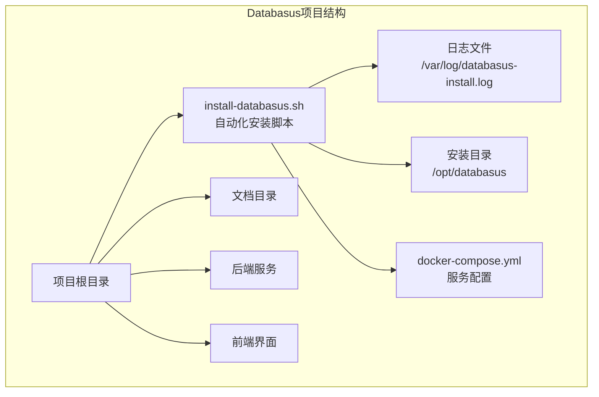
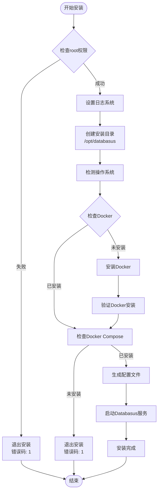
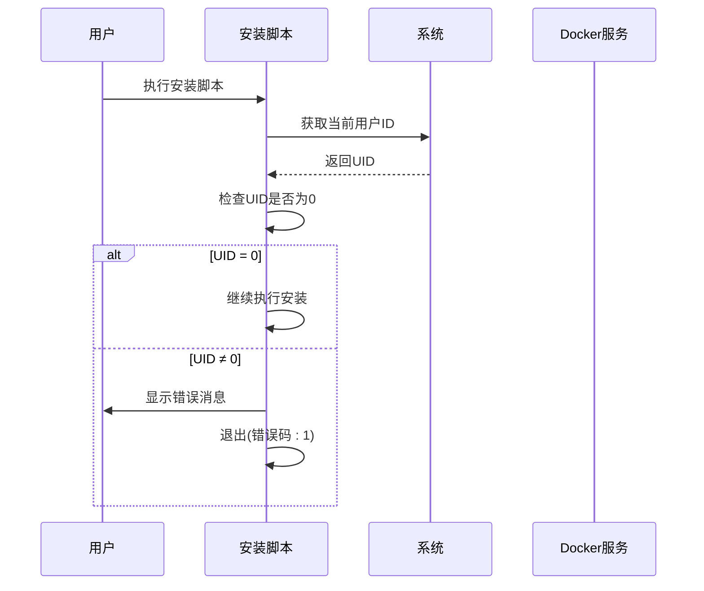
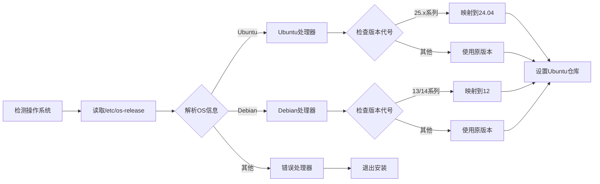
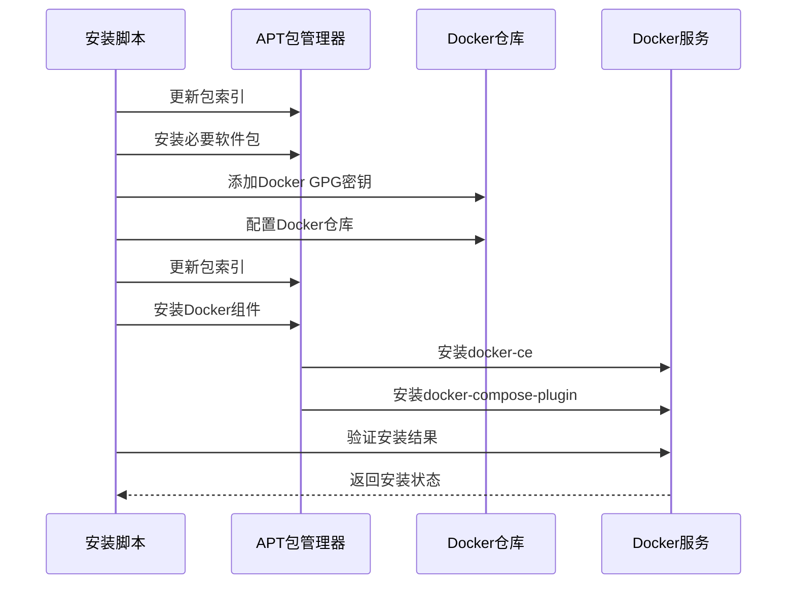
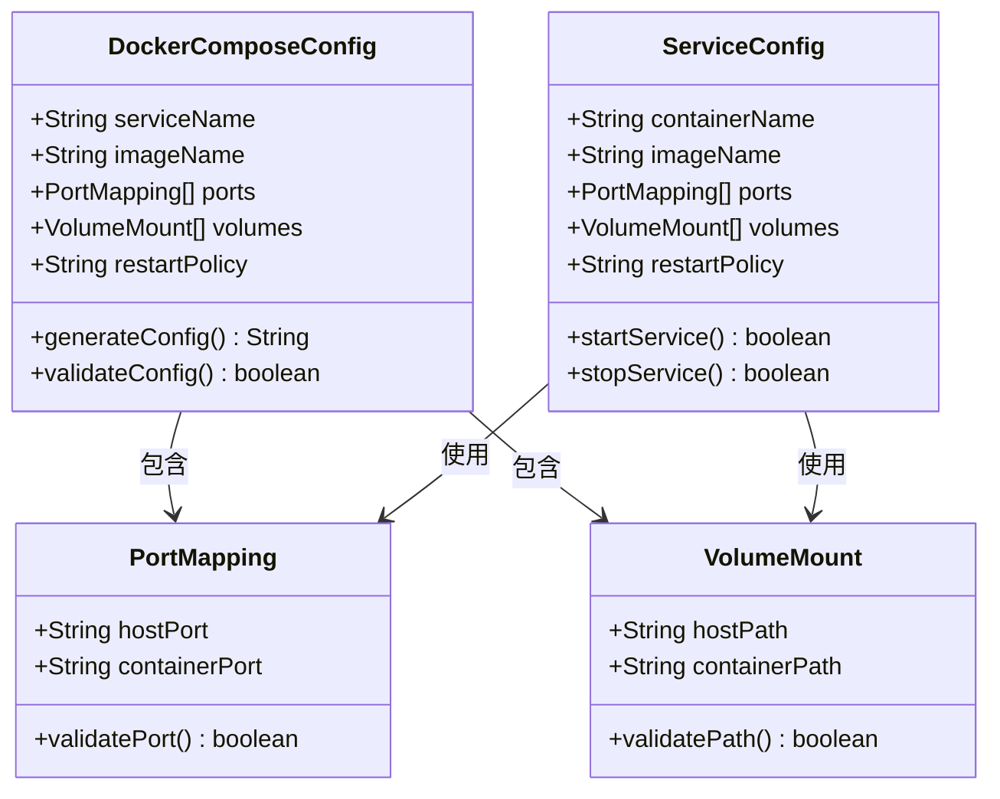
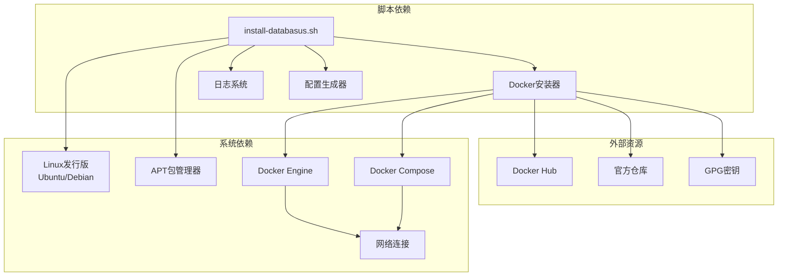

# 自动化脚本安装

<cite>
**本文档中引用的文件**
- [install-databasus.sh](file://install-databasus.sh)
- [README.md](file://README.md)
- [backend/tools/readme.md](file://backend/tools/readme.md)
</cite>

## 目录
1. [简介](#简介)
2. [项目结构](#项目结构)
3. [核心组件](#核心组件)
4. [架构概览](#架构概览)
5. [详细组件分析](#详细组件分析)
6. [依赖关系分析](#依赖关系分析)
7. [性能考虑](#性能考虑)
8. [故障排除指南](#故障排除指南)
9. [结论](#结论)

## 简介

Databasus自动化脚本安装是一个专为Linux系统设计的便捷部署工具，旨在简化Databasus数据库备份工具的安装和配置过程。该脚本通过一个统一的安装流程，自动完成Docker环境准备、Databasus服务部署以及初始配置，为Linux系统管理员和DevOps工程师提供了标准化的部署方案。

### 主要特性

- **Linux专用设计**：专门为Linux发行版优化，支持Ubuntu和Debian系列
- **自动化安装**：一键安装Docker和Databasus，无需手动配置
- **智能检测**：自动检测操作系统版本并适配相应的Docker仓库
- **完整日志记录**：详细的安装过程日志，便于故障诊断
- **容器化部署**：使用Docker Compose进行服务编排和管理

## 项目结构

Databasus项目采用模块化架构，自动化安装脚本位于项目根目录，专门用于Linux平台的快速部署。



**图表来源**
- [install-databasus.sh:1-141](file://install-databasus.sh#L1-L141)

**章节来源**
- [README.md:124-141](file://README.md#L124-L141)
- [install-databasus.sh:11-141](file://install-databasus.sh#L11-L141)

## 核心组件

### 安装脚本核心功能

Databasus自动化安装脚本包含以下关键组件：

#### 1. 权限管理系统
- **root权限检查**：确保脚本以root用户身份运行
- **权限验证**：防止非特权用户执行系统级操作

#### 2. 日志记录系统
- **集中日志管理**：所有安装操作记录到/var/log/databasus-install.log
- **时间戳标记**：每条日志包含精确的时间戳
- **实时输出**：安装过程同时显示在终端和日志文件中

#### 3. 操作系统检测引擎
- **/etc/os-release解析**：自动识别Linux发行版
- **版本兼容性处理**：针对新版本系统提供向后兼容
- **多发行版支持**：Ubuntu和Debian系列的智能适配

#### 4. Docker自动安装模块
- **包管理器集成**：使用apt包管理器安装Docker
- **仓库配置**：自动添加Docker官方GPG密钥和仓库
- **插件安装**：同时安装docker-compose-plugin等必需组件

#### 5. 配置文件生成器
- **docker-compose.yml自动生成**：创建标准的服务配置文件
- **端口映射配置**：默认暴露4005端口供Web界面访问
- **数据卷挂载**：配置持久化存储目录

**章节来源**
- [install-databasus.sh:5-17](file://install-databasus.sh#L5-L17)
- [install-databasus.sh:32-42](file://install-databasus.sh#L32-L42)
- [install-databasus.sh:44-101](file://install-databasus.sh#L44-L101)
- [install-databasus.sh:111-124](file://install-databasus.sh#L111-L124)

## 架构概览

Databasus自动化安装脚本采用分层架构设计，确保安装过程的可靠性和可维护性。



**图表来源**
- [install-databasus.sh:5-141](file://install-databasus.sh#L5-L141)

## 详细组件分析

### 权限检查机制

脚本通过`id -u`命令检查当前用户的UID，确保只有root用户能够执行安装操作。



**图表来源**
- [install-databasus.sh:6-9](file://install-databasus.sh#L6-L9)

### 操作系统检测与适配

脚本使用`/etc/os-release`文件进行智能操作系统检测，并针对新版本系统提供兼容性处理。



**图表来源**
- [install-databasus.sh:32-78](file://install-databasus.sh#L32-L78)

### Docker安装逻辑

脚本实现了完整的Docker安装流程，包括预处理、仓库配置和包安装。



**图表来源**
- [install-databasus.sh:44-98](file://install-databasus.sh#L44-L98)

### 配置文件生成与服务启动

脚本自动生成docker-compose.yml配置文件并启动Databasus服务。



**图表来源**
- [install-databasus.sh:111-134](file://install-databasus.sh#L111-L134)

**章节来源**
- [install-databasus.sh:111-141](file://install-databasus.sh#L111-L141)

## 依赖关系分析

Databasus自动化安装脚本依赖于多个系统组件和服务，形成了清晰的依赖层次结构。



**图表来源**
- [install-databasus.sh:44-109](file://install-databasus.sh#L44-L109)

### 关键依赖项

| 依赖项 | 类型 | 版本要求 | 用途 |
|--------|------|----------|------|
| Linux发行版 | 系统级 | Ubuntu 18.04+ / Debian 10+ | 运行环境 |
| APT包管理器 | 系统工具 | 最新版本 | 软件包安装 |
| Docker Engine | 容器引擎 | 20.10+ | 服务容器化 |
| Docker Compose | 编排工具 | 2.0+ | 多容器管理 |
| curl | 网络工具 | 最新版本 | 资源下载 |
| gnupg | 加密工具 | 最新版本 | GPG密钥管理 |

**章节来源**
- [install-databasus.sh:52-53](file://install-databasus.sh#L52-L53)
- [install-databasus.sh:89-90](file://install-databasus.sh#L89-L90)

## 性能考虑

### 安装性能优化

Databasus自动化安装脚本在设计时充分考虑了性能因素：

- **并行处理**：大部分操作按顺序执行，避免不必要的并发开销
- **缓存利用**：利用系统包管理器的缓存机制减少重复下载
- **最小化依赖**：只安装必要的Docker组件，避免冗余软件
- **网络优化**：使用官方仓库，确保最佳的下载速度

### 资源使用效率

- **内存占用**：安装过程中内存使用量保持在合理范围内
- **磁盘空间**：Docker镜像大小经过优化，适合服务器环境
- **CPU使用**：安装过程对CPU的占用时间较短

## 故障排除指南

### 常见问题及解决方案

#### 1. 权限相关问题

**问题症状**：
- 安装脚本提示需要root权限
- 执行过程中出现权限拒绝错误

**解决方案**：
```bash
# 使用sudo执行安装脚本
sudo ./install-databasus.sh

# 或者切换到root用户
su -
./install-databasus.sh
```

**章节来源**
- [install-databasus.sh:6-9](file://install-databasus.sh#L6-L9)

#### 2. 网络连接问题

**问题症状**：
- Docker仓库下载失败
- GPG密钥获取超时
- 网络连接不稳定

**解决方案**：
```bash
# 检查网络连接
ping download.docker.com

# 配置代理（如果需要）
export http_proxy=http://proxy.company.com:8080
export https_proxy=http://proxy.company.com:8080

# 清理APT缓存
sudo apt clean
sudo apt update

# 重新执行安装
sudo ./install-databasus.sh
```

**章节来源**
- [install-databasus.sh:82-84](file://install-databasus.sh#L82-L84)

#### 3. Docker服务状态问题

**问题症状**：
- Docker服务无法启动
- Docker命令执行失败
- 容器无法正常运行

**解决方案**：
```bash
# 检查Docker服务状态
sudo systemctl status docker

# 启动Docker服务
sudo systemctl start docker
sudo systemctl enable docker

# 验证Docker安装
docker --version

# 查看Docker日志
sudo journalctl -u docker.service
```

**章节来源**
- [install-databasus.sh:92-96](file://install-databasus.sh#L92-L96)

#### 4. 操作系统兼容性问题

**问题症状**：
- 脚本提示不支持的操作系统
- 版本检测失败
- 仓库配置错误

**解决方案**：
```bash
# 检查系统版本
cat /etc/os-release

# 手动安装Docker（参考官方文档）
curl -fsSL https://get.docker.com -o get-docker.sh
sudo sh get-docker.sh

# 安装Docker Compose插件
sudo apt-get install docker-compose-plugin

# 重新运行安装脚本
sudo ./install-databasus.sh
```

**章节来源**
- [install-databasus.sh:74-77](file://install-databasus.sh#L74-L77)

#### 5. 端口冲突问题

**问题症状**：
- Databasus服务启动失败
- 端口被其他进程占用
- Web界面无法访问

**解决方案**：
```bash
# 检查端口使用情况
sudo netstat -tlnp | grep :4005

# 停止占用端口的进程
sudo kill -9 PID

# 修改配置文件中的端口号
sudo nano /opt/databasus/docker-compose.yml

# 重启服务
cd /opt/databasus
sudo docker compose down
sudo docker compose up -d
```

**章节来源**
- [install-databasus.sh:118-119](file://install-databasus.sh#L118-L119)

#### 6. 存储空间不足问题

**问题症状**：
- Docker镜像下载失败
- 容器启动失败
- 系统磁盘空间不足

**解决方案**：
```bash
# 检查磁盘空间
df -h

# 清理Docker相关空间
sudo docker system prune -a
sudo docker volume prune

# 清理Docker缓存
sudo docker builder prune

# 释放系统空间
sudo apt autoremove
sudo apt autoclean

# 重新执行安装
sudo ./install-databasus.sh
```

**章节来源**
- [install-databasus.sh:129-134](file://install-databasus.sh#L129-L134)

### 日志分析与调试

#### 安装日志位置

所有安装操作都会记录到以下日志文件：
- **主日志文件**：`/var/log/databasus-install.log`
- **日志格式**：包含时间戳、操作描述和结果状态

#### 日志分析技巧

```bash
# 实时查看安装日志
tail -f /var/log/databasus-install.log

# 查看最近的错误信息
grep -i "error\|fail" /var/log/databasus-install.log

# 搜索特定操作
grep -i "docker\|compose" /var/log/databasus-install.log

# 分析安装时间线
cat /var/log/databasus-install.log | cut -d'[' -f1
```

**章节来源**
- [install-databasus.sh:12-17](file://install-databasus.sh#L12-L17)

## 结论

Databasus自动化脚本安装为Linux系统管理员和DevOps工程师提供了一个强大而可靠的部署解决方案。通过精心设计的安装流程、完善的错误处理机制和详细的日志记录系统，该脚本显著简化了Databasus的部署过程。

### 主要优势

1. **Linux专用优化**：针对Ubuntu和Debian系统进行了深度优化
2. **自动化程度高**：从Docker安装到服务启动实现完全自动化
3. **错误处理完善**：提供详细的错误信息和故障排除指导
4. **日志记录完整**：便于审计和问题诊断
5. **容器化部署**：确保服务的隔离性和可移植性

### 适用场景

- **生产环境部署**：适合在Linux服务器上进行标准化部署
- **开发测试环境**：快速搭建Databasus开发和测试环境
- **批量部署**：支持多台服务器的一致性部署
- **CI/CD集成**：可以集成到自动化部署流水线中

### 最佳实践建议

1. **定期更新**：保持Databasus和Docker组件的最新版本
2. **监控告警**：建立服务健康检查和告警机制
3. **备份策略**：制定数据备份和恢复计划
4. **安全加固**：根据实际需求调整安全配置
5. **性能调优**：根据业务负载调整资源配置

通过遵循本文档提供的指导和最佳实践，您可以在Linux环境中成功部署和维护Databasus数据库备份工具，为您的数据库基础设施提供可靠的保护。