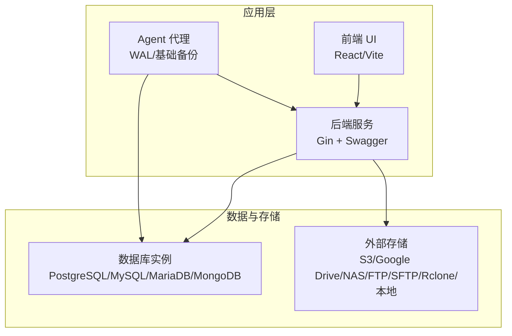
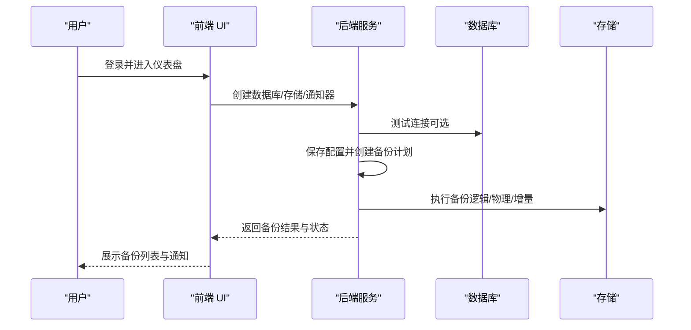
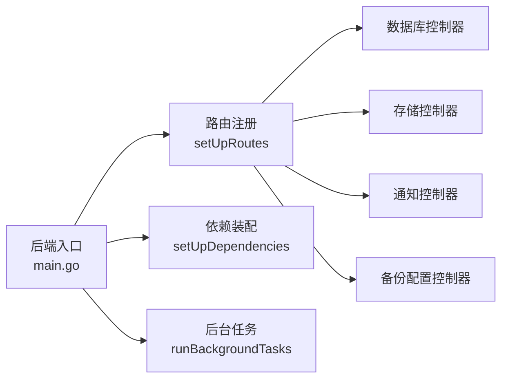

# 快速开始指南

<cite>
**本文引用的文件**
- [README.md](file://README.md)
- [install-databasus.sh](file://install-databasus.sh)
- [docker-compose.yml.example](file://docker-compose.yml.example)
- [backend/cmd/main.go](file://backend/cmd/main.go)
- [backend/README.md](file://backend/README.md)
- [backend/internal/config/config.go](file://backend/internal/config/config.go)
- [agent/cmd/main.go](file://agent/cmd/main.go)
- [agent/internal/config/config.go](file://agent/internal/config/config.go)
- [backend/internal/features/databases/controller.go](file://backend/internal/features/databases/controller.go)
- [backend/internal/features/storages/controller.go](file://backend/internal/features/storages/controller.go)
- [backend/internal/features/notifiers/controller.go](file://backend/internal/features/notifiers/controller.go)
- [backend/internal/features/backups/config/controller.go](file://backend/internal/features/backups/config/controller.go)
</cite>

## 目录
1. [简介](#简介)
2. [项目结构](#项目结构)
3. [核心组件](#核心组件)
4. [架构总览](#架构总览)
5. [详细组件分析](#详细组件分析)
6. [依赖关系分析](#依赖关系分析)
7. [性能与可用性](#性能与可用性)
8. [故障排查](#故障排查)
9. [结论](#结论)
10. [附录：从零到运行的完整流程](#附录从零到运行的完整流程)

## 简介
本指南面向首次接触 Databasus 的用户，目标是在约 30 分钟内完成从环境准备、安装部署、基础配置到首次备份运行的全流程。你将学会：
- 访问 Web 界面并登录
- 添加第一个数据库（支持 PostgreSQL、MySQL、MariaDB、MongoDB）
- 配置备份计划（频率、时间点、压缩）
- 选择存储目的地（本地、S3、Google Drive、NAS、FTP、SFTP、Rclone 等）
- 设置保留策略（按时间、数量、GFS、大小限制）
- 配置通知（邮件、Telegram、Slack、Discord、Webhook）
- 理解数据库连接类型（远程直连 vs 代理模式）的选择原则与配置方法
- 了解备份类型（逻辑备份、物理备份、增量备份）及其适用场景
- 排查常见配置问题并掌握最佳实践

## 项目结构
Databasus 采用前后端分离与多模块设计：
- 后端服务（Go）：提供 REST API、调度器、后台任务、UI 资源托管
- 前端（React/Vite）：管理数据库、存储、通知、备份配置等
- Agent（Go）：在数据库侧运行，负责 WAL 归档与基础备份流式传输
- 工具与资产：包含各数据库版本工具集与前端构建产物

图表来源
- [backend/cmd/main.go:213-257](file://backend/cmd/main.go#L213-L257)
- [agent/cmd/main.go:30-48](file://agent/cmd/main.go#L30-L48)

章节来源
- [README.md:124-222](file://README.md#L124-L222)
- [backend/README.md:1-69](file://backend/README.md#L1-L69)

## 核心组件
- 后端主程序：初始化路由、依赖注入、后台任务、Swagger 文档生成、静态资源托管
- 配置系统：读取 .env，解析数据库与缓存连接、节点角色、计费参数等
- 数据库控制器：提供数据库增删改查、连接测试、只读用户创建、代理令牌校验
- 存储控制器：保存/查询/删除存储配置，直接测试连接
- 通知控制器：保存/查询/删除通知器，发送测试通知
- 备份配置控制器：保存备份配置（含加密策略），查询存储使用情况，迁移数据库到工作区

章节来源
- [backend/cmd/main.go:1-137](file://backend/cmd/main.go#L1-L137)
- [backend/internal/config/config.go:1-146](file://backend/internal/config/config.go#L1-L146)
- [backend/internal/features/databases/controller.go:1-77](file://backend/internal/features/databases/controller.go#L1-L77)
- [backend/internal/features/storages/controller.go:1-71](file://backend/internal/features/storages/controller.go#L1-L71)
- [backend/internal/features/notifiers/controller.go:1-70](file://backend/internal/features/notifiers/controller.go#L1-L70)
- [backend/internal/features/backups/config/controller.go:1-60](file://backend/internal/features/backups/config/controller.go#L1-L60)

## 架构总览
Databasus 支持两种数据库连接方式：
- 远程直连：后端直接连接数据库（推荐只读模式），无需额外软件
- 代理模式：Agent 在数据库侧运行，负责 WAL 归档与基础备份流式上传，数据库可不暴露公网

备份类型：
- 逻辑备份：数据库引擎原生二进制格式，压缩后直传存储，无中间文件
- 物理备份：整库文件级复制，适合大体量数据的更快备份/恢复
- 增量备份：基于物理基线 + 持续 WAL 归档，支持点对点恢复（PITR）

图表来源
- [backend/internal/features/databases/controller.go:20-38](file://backend/internal/features/databases/controller.go#L20-L38)
- [backend/internal/features/storages/controller.go:19-27](file://backend/internal/features/storages/controller.go#L19-L27)
- [backend/internal/features/notifiers/controller.go:19-27](file://backend/internal/features/notifiers/controller.go#L19-L27)
- [backend/internal/features/backups/config/controller.go:17-23](file://backend/internal/features/backups/config/controller.go#L17-L23)

## 详细组件分析

### 安装与启动
- 自动化脚本安装（推荐，仅限 Linux）：自动安装 Docker 与 Compose，写入 docker-compose.yml 并启动
- Docker 单容器运行：映射 4005 端口，挂载数据目录
- Docker Compose：创建服务定义并启动
- Kubernetes（Helm）：OCI Chart 安装，支持 ClusterIP/LoadBalancer/Ingress

章节来源
- [README.md:124-222](file://README.md#L124-L222)
- [install-databasus.sh:111-141](file://install-databasus.sh#L111-L141)
- [docker-compose.yml.example:1-19](file://docker-compose.yml.example#L1-L19)

### 访问 Web 界面与初始登录
- 默认访问地址：http://localhost:4005
- 首次启动会创建初始管理员账户；如需重置密码，可通过命令行参数执行重置

章节来源
- [README.md:225-244](file://README.md#L225-L244)
- [backend/cmd/main.go:102-108](file://backend/cmd/main.go#L102-L108)

### 数据库连接类型与选择原则
- 远程直连（推荐只读模式）：无需 Agent，适用于云托管或自管数据库
- 代理模式（Agent）：Agent 与数据库同机或容器内运行，直接流式上传，数据库无需公网暴露

章节来源
- [README.md:94-98](file://README.md#L94-L98)
- [agent/cmd/main.go:30-48](file://agent/cmd/main.go#L30-L48)

### 备份类型与适用场景
- 逻辑备份：适合大多数场景，压缩后直传，无中间文件
- 物理备份：适合大体量数据，备份/恢复速度更快
- 增量备份：结合 WAL 归档，支持 PITR，满足近零丢失与灾难恢复需求

章节来源
- [README.md:99-104](file://README.md#L99-L104)

### 添加第一个数据库
- 在“数据库”页面点击“新建”，填写连接信息（主机、端口、用户名、密码、数据库名等）
- 可选择“远程直连”或“代理模式”
- 使用“测试连接”验证连通性
- 若使用代理模式，后端会生成代理令牌，Agent 使用该令牌与后端通信

章节来源
- [backend/internal/features/databases/controller.go:20-38](file://backend/internal/features/databases/controller.go#L20-L38)
- [backend/internal/features/databases/dto.go:1-16](file://backend/internal/features/databases/dto.go#L1-L16)

### 配置备份计划与加密策略
- 在“备份配置”中为数据库选择存储与保留策略
- 加密策略支持“无加密”或“AES-256-GCM 加密”
- 支持按时间、数量、GFS（祖父/父亲/儿子）层级、总大小限制控制存储占用

章节来源
- [backend/internal/features/backups/config/controller.go:25-60](file://backend/internal/features/backups/config/controller.go#L25-L60)
- [backend/internal/features/backups/config/dto.go:1-12](file://backend/internal/features/backups/config/dto.go#L1-L12)

### 选择存储目的地
- 支持本地、S3、Cloudflare R2、Google Drive、NAS、Dropbox、FTP、SFTP、Rclone 等
- 提供“直接测试连接”能力，便于验证凭据与网络可达性

章节来源
- [backend/internal/features/storages/controller.go:19-27](file://backend/internal/features/storages/controller.go#L19-L27)
- [backend/internal/features/storages/dto.go:1-8](file://backend/internal/features/storages/dto.go#L1-L8)

### 设置保留策略
- 时间期限：保留最近 N 天/月/年
- 数量上限：最多保留 N 个最新备份
- GFS：独立保留小时/日/周/月/年备份，满足企业长期归档
- 总大小限制：防止存储超支

章节来源
- [README.md:53-59](file://README.md#L53-L59)

### 配置通知
- 支持邮件、Telegram、Slack、Discord、Webhook 等
- 可发送成功/失败通知，便于 DevOps 团队协作

章节来源
- [backend/internal/features/notifiers/controller.go:19-27](file://backend/internal/features/notifiers/controller.go#L19-L27)
- [backend/internal/features/notifiers/dto.go:1-8](file://backend/internal/features/notifiers/dto.go#L1-L8)

### Agent 配置与启动
- Agent 需要配置 Databasus 主机地址、数据库 ID、令牌、PostgreSQL 主机/端口/用户/密码、类型（host 或 docker）、WAL 目录等
- 支持启动/停止/状态查询/恢复等子命令
- 可进行自动更新检查

章节来源
- [agent/internal/config/config.go:16-31](file://agent/internal/config/config.go#L16-L31)
- [agent/cmd/main.go:50-75](file://agent/cmd/main.go#L50-L75)

## 依赖关系分析
后端通过依赖注入装配各功能模块，并在启动时注册路由与后台任务。

图表来源
- [backend/cmd/main.go:259-276](file://backend/cmd/main.go#L259-L276)
- [backend/cmd/main.go:213-257](file://backend/cmd/main.go#L213-L257)

章节来源
- [backend/cmd/main.go:293-374](file://backend/cmd/main.go#L293-L374)

## 性能与可用性
- 压缩与传输：备份过程采用压缩与流式传输，减少中间文件与磁盘 IO
- 节点模式：支持单节点与多节点模式，主节点负责调度与清理，处理节点负责备份/恢复执行
- 健康检查与审计：内置健康检查与审计日志清理后台任务
- 前端静态资源：后端统一托管 UI 构建产物，简化部署

章节来源
- [README.md:47-59](file://README.md#L47-L59)
- [backend/cmd/main.go:313-374](file://backend/cmd/main.go#L313-L374)
- [backend/cmd/main.go:478-491](file://backend/cmd/main.go#L478-L491)

## 故障排查
- 端口冲突：确认 4005 端口未被占用
- 权限不足：确保挂载的数据目录具备读写权限
- 网络连通性：代理模式下，Agent 与后端之间网络必须互通
- 密码重置：若忘记管理员密码，使用命令行参数重置
- 日志定位：关注后端启动日志与 panic 恢复输出

章节来源
- [README.md:236-244](file://README.md#L236-L244)
- [backend/cmd/main.go:459-476](file://backend/cmd/main.go#L459-L476)

## 结论
通过本指南，你已掌握 Databasus 的安装、配置与使用要点。建议在生产环境中：
- 使用代理模式保护数据库免对外暴露
- 选择合适的备份类型（逻辑/物理/增量）与保留策略
- 启用通知与审计日志，完善监控与合规
- 定期验证备份与恢复流程

## 附录：从零到运行的完整流程

### 步骤 1：环境准备
- 准备一台 Linux/Windows/macOS 主机，确保可访问互联网
- 如使用自动化脚本安装，请以 root 权限运行

章节来源
- [install-databasus.sh:5-10](file://install-databasus.sh#L5-L10)

### 步骤 2：安装 Databasus
- 方式一：自动化脚本（推荐）
  - 下载并执行脚本，自动安装 Docker 与 Compose，并启动服务
- 方式二：Docker 单容器运行
  - 映射 4005 端口，挂载本地目录作为数据卷
- 方式三：Docker Compose
  - 编写 compose 文件并启动
- 方式四：Kubernetes（Helm）
  - 从 OCI Chart 安装，按需配置 Service/Ingress

章节来源
- [README.md:124-222](file://README.md#L124-L222)
- [install-databasus.sh:111-141](file://install-databasus.sh#L111-L141)
- [docker-compose.yml.example:1-19](file://docker-compose.yml.example#L1-L19)

### 步骤 3：访问 Web 界面
- 打开浏览器访问 http://localhost:4005
- 使用初始管理员账户登录（首次启动自动创建）

章节来源
- [README.md:225-228](file://README.md#L225-L228)
- [backend/cmd/main.go:102-108](file://backend/cmd/main.go#L102-L108)

### 步骤 4：添加第一个数据库
- 点击“新建数据库”，填写连接信息（主机、端口、用户名、密码、数据库名）
- 选择连接类型：远程直连（推荐只读）或代理模式
- 使用“测试连接”验证连通性
- 保存配置

章节来源
- [backend/internal/features/databases/controller.go:20-38](file://backend/internal/features/databases/controller.go#L20-L38)

### 步骤 5：配置备份计划
- 在“备份配置”中为数据库选择存储与保留策略
- 选择加密策略：无加密或 AES-256-GCM 加密
- 选择备份类型：逻辑/物理/增量，按需启用压缩与并发

章节来源
- [backend/internal/features/backups/config/controller.go:25-60](file://backend/internal/features/backups/config/controller.go#L25-L60)
- [README.md:99-104](file://README.md#L99-L104)

### 步骤 6：选择存储目的地
- 在“存储”页面新增存储，填写对应凭据与路径
- 使用“直接测试连接”验证连通性
- 将存储分配给数据库或工作区

章节来源
- [backend/internal/features/storages/controller.go:19-27](file://backend/internal/features/storages/controller.go#L19-L27)

### 步骤 7：设置保留策略
- 按时间：保留最近 N 天/月/年
- 按数量：最多保留 N 个最新备份
- GFS：独立保留小时/日/周/月/年备份
- 总大小限制：防止存储超支

章节来源
- [README.md:53-59](file://README.md#L53-L59)

### 步骤 8：配置通知
- 在“通知”页面新增通知器（邮件/Telegram/Slack/Discord/Webhook）
- 发送“测试通知”验证配置
- 将通知器绑定到数据库或工作区

章节来源
- [backend/internal/features/notifiers/controller.go:19-27](file://backend/internal/features/notifiers/controller.go#L19-L27)

### 步骤 9：启动与验证
- 保存所有配置后，系统将自动调度首次备份
- 在“备份”页面查看状态与日志
- 如使用代理模式，确保 Agent 正常运行并上传 WAL/基础备份

章节来源
- [agent/cmd/main.go:50-75](file://agent/cmd/main.go#L50-L75)

### 步骤 10：常见问题与最佳实践
- 端口冲突：修改映射端口或释放 4005
- 权限问题：检查数据卷目录权限
- 代理模式：确保 Agent 与后端网络互通，令牌正确
- 密码重置：使用命令行参数重置管理员密码
- 最佳实践：启用加密、定期验证恢复、设置合理保留策略与通知

章节来源
- [README.md:236-244](file://README.md#L236-L244)