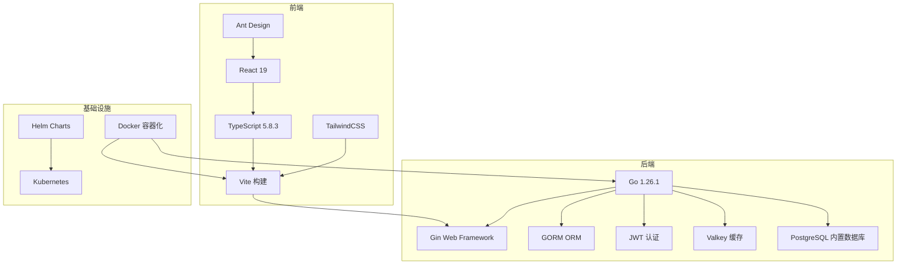
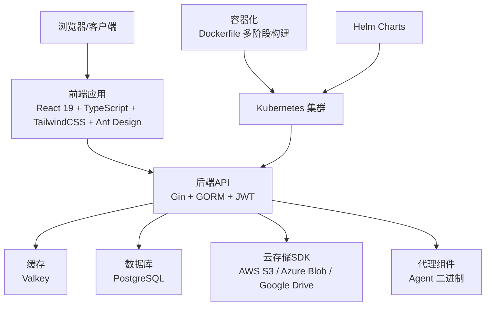
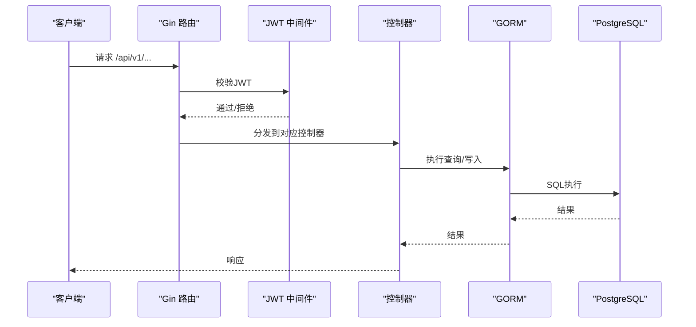
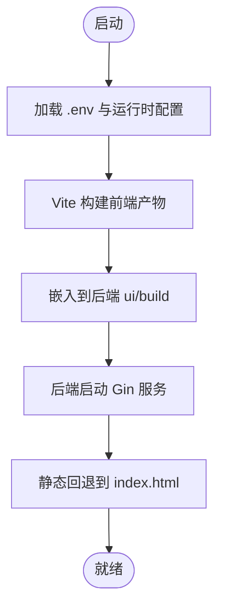
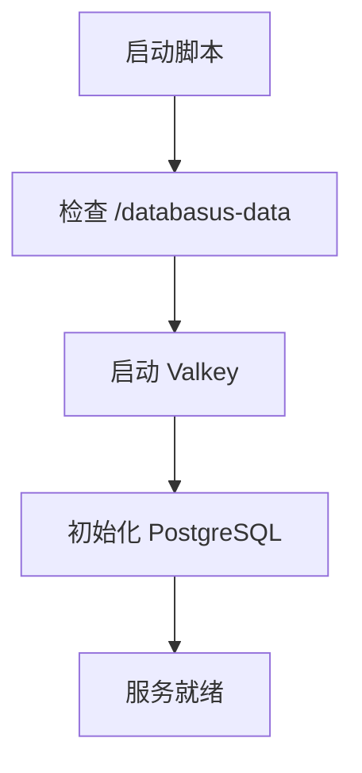
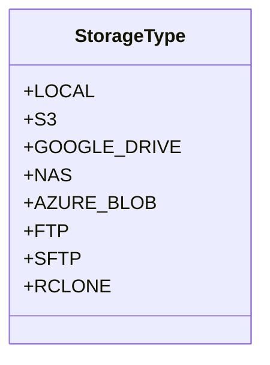
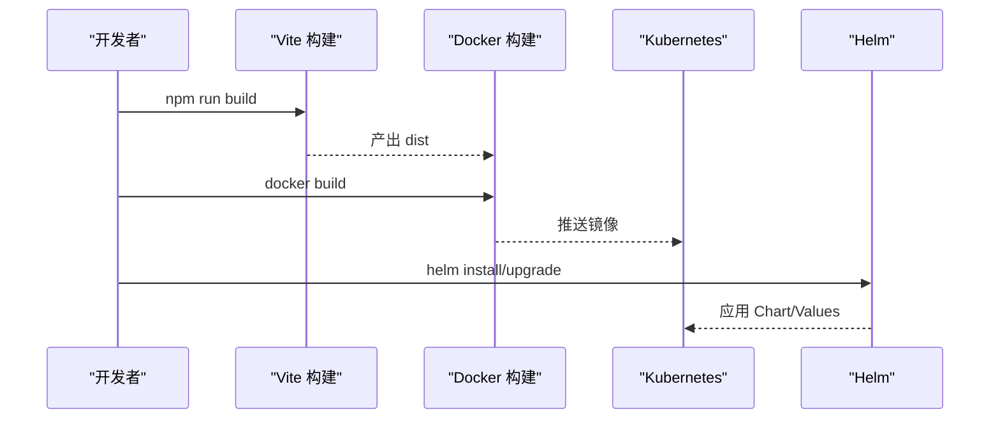
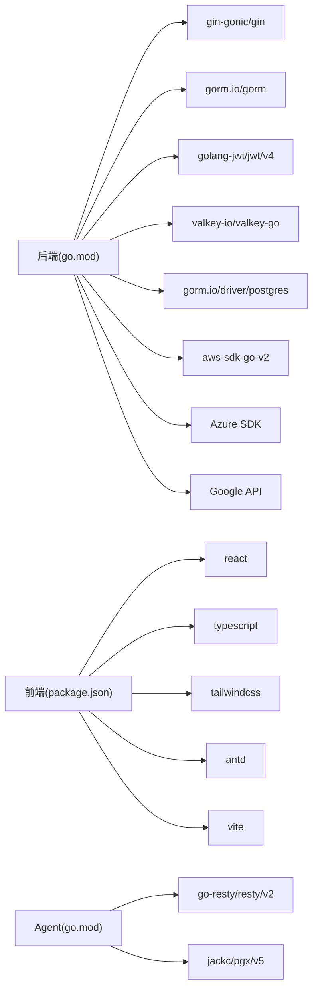

# 技术栈概览

<cite>
**本文档引用的文件**
- [backend/go.mod](file://backend/go.mod)
- [frontend/package.json](file://frontend/package.json)
- [agent/go.mod](file://agent/go.mod)
- [backend/cmd/main.go](file://backend/cmd/main.go)
- [backend/internal/config/config.go](file://backend/internal/config/config.go)
- [backend/internal/util/cache/cache.go](file://backend/internal/util/cache/cache.go)
- [Dockerfile](file://Dockerfile)
- [deploy/helm/values.yaml](file://deploy/helm/values.yaml)
- [deploy/helm/Chart.yaml](file://deploy/helm/Chart.yaml)
- [frontend/vite.config.ts](file://frontend/vite.config.ts)
- [frontend/src/main.tsx](file://frontend/src/main.tsx)
</cite>

## 目录
1. [引言](#引言)
2. [项目结构](#项目结构)
3. [核心组件](#核心组件)
4. [架构总览](#架构总览)
5. [详细组件分析](#详细组件分析)
6. [依赖关系分析](#依赖关系分析)
7. [性能考虑](#性能考虑)
8. [故障排除指南](#故障排除指南)
9. [结论](#结论)
10. [附录](#附录)

## 引言
本技术栈概览面向Databasus项目的后端、前端与基础设施团队，系统梳理并解释项目采用的核心技术与框架选择，涵盖后端技术栈（Go 1.26.1、Gin Web Framework、GORM ORM、JWT认证）、前端技术栈（React 19、TypeScript 5.8.3、TailwindCSS、Ant Design）、数据库技术（PostgreSQL、MongoDB、Valkey缓存）、云存储集成（AWS SDK、Azure SDK、Google Cloud SDK）、构建工具（Vite、Docker、Kubernetes Helm）。文档同时说明版本兼容性、性能与扩展性考量，并给出第三方依赖选择标准与安全建议，以及学习路径建议。

## 项目结构
Databasus采用多模块分层架构：后端服务（Go）、前端应用（React/Vite）、代理组件（Agent）、容器化与编排（Docker/Helm）。整体结构清晰，前后端分离，通过统一的后端API进行交互，支持本地与云端部署模式。

**图表来源**
- [Dockerfile:1-546](file://Dockerfile#L1-L546)
- [deploy/helm/Chart.yaml:1-23](file://deploy/helm/Chart.yaml#L1-L23)
- [backend/cmd/main.go:1-491](file://backend/cmd/main.go#L1-L491)
- [frontend/package.json:1-46](file://frontend/package.json#L1-L46)

**章节来源**
- [Dockerfile:1-546](file://Dockerfile#L1-L546)
- [deploy/helm/Chart.yaml:1-23](file://deploy/helm/Chart.yaml#L1-L23)

## 核心组件
- 后端运行时与框架
  - Go 1.26.1：稳定、高性能、跨平台，适合并发与云原生场景。
  - Gin Web Framework：轻量级HTTP框架，路由与中间件完善，适合REST API。
  - GORM ORM：现代化Go ORM，支持多种数据库，迁移与查询便捷。
  - JWT认证：基于golang-jwt/jwt/v4实现，配合Gin中间件完成鉴权。
- 前端运行时与框架
  - React 19：最新稳定版，具备良好生态与性能。
  - TypeScript 5.8.3：强类型保障，提升开发效率与可维护性。
  - TailwindCSS：原子化样式工具，快速构建UI。
  - Ant Design：企业级UI组件库，提供丰富的业务组件。
- 数据库与缓存
  - PostgreSQL：内置PostgreSQL 17作为内部数据库，用于应用元数据与状态管理；同时支持连接外部PostgreSQL实例。
  - MongoDB：通过MongoDB Database Tools支持备份与恢复。
  - Valkey：内置Valkey作为缓存与会话存储，支持TLS与密码认证。
- 云存储与SDK
  - AWS S3：使用aws-sdk-go-v2与minio-go/v7，支持S3兼容与对象存储。
  - Azure Blob：使用Azure SDK for Go，支持Azure Blob存储。
  - Google Drive：通过google.golang.org/api集成Google Drive能力。
- 构建与部署
  - Vite：现代前端构建工具，热更新与打包优化。
  - Docker：多阶段构建，包含前端、后端与代理二进制，内置数据库与客户端工具。
  - Kubernetes Helm：提供Chart与Values，支持Ingress/Gateway API、探针与持久化。

**章节来源**
- [backend/go.mod:1-34](file://backend/go.mod#L1-L34)
- [frontend/package.json:1-46](file://frontend/package.json#L1-L46)
- [agent/go.mod:1-23](file://agent/go.mod#L1-L23)
- [backend/cmd/main.go:1-491](file://backend/cmd/main.go#L1-L491)
- [backend/internal/config/config.go:1-422](file://backend/internal/config/config.go#L1-L422)
- [backend/internal/util/cache/cache.go:1-125](file://backend/internal/util/cache/cache.go#L1-L125)
- [Dockerfile:1-546](file://Dockerfile#L1-L546)
- [deploy/helm/values.yaml:1-107](file://deploy/helm/values.yaml#L1-L107)

## 架构总览
下图展示Databasus的整体架构：前端通过Vite构建并嵌入到后端，后端以Gin提供API，GORM访问PostgreSQL，Valkey提供缓存，支持多数据库与云存储后端，最终通过Docker容器化并在Kubernetes中以Helm部署。

**图表来源**
- [backend/cmd/main.go:213-257](file://backend/cmd/main.go#L213-L257)
- [backend/internal/util/cache/cache.go:13-41](file://backend/internal/util/cache/cache.go#L13-L41)
- [Dockerfile:1-546](file://Dockerfile#L1-L546)
- [deploy/helm/values.yaml:1-107](file://deploy/helm/values.yaml#L1-L107)

## 详细组件分析

### 后端技术栈（Go/Gin/GORM/JWT）
- 运行时与框架
  - Gin：全局中间件包括日志、GZIP压缩、CORS与自定义panic恢复处理；路由按功能模块划分，公开与受保护路由分离。
  - Swagger：通过swag生成API文档，开发环境自动初始化。
- ORM与数据库
  - GORM：PostgreSQL驱动gorm.io/driver/postgres，结合migrations目录进行数据库迁移。
  - 环境变量：DATABASE_DSN控制连接字符串，支持外部数据库覆盖。
- 认证与授权
  - JWT：使用github.com/golang-jwt/jwt/v4，配合用户中间件实现受保护路由。
- 缓存与会话
  - Valkey：valkey-io/valkey-go客户端，支持TLS与用户名密码认证，提供连接测试与清空缓存能力。
- 配置管理
  - .env加载与cleanenv读取，支持开发/生产模式切换与节点角色（主节点/处理节点）。

**图表来源**
- [backend/cmd/main.go:213-257](file://backend/cmd/main.go#L213-L257)
- [backend/internal/config/config.go:152-203](file://backend/internal/config/config.go#L152-L203)

**章节来源**
- [backend/cmd/main.go:1-491](file://backend/cmd/main.go#L1-L491)
- [backend/internal/config/config.go:1-422](file://backend/internal/config/config.go#L1-L422)
- [backend/internal/util/cache/cache.go:1-125](file://backend/internal/util/cache/cache.go#L1-L125)

### 前端技术栈（React 19/TypeScript/TailwindCSS/Ant Design）
- 构建与工具链
  - Vite：插件包含@vitejs/plugin-react与@tailwindcss/vite，支持TypeScript与热更新。
  - TypeScript：严格类型检查，配合ESLint/Prettier保证代码质量。
- UI与样式
  - Ant Design：提供表单、表格、模态框等常用组件。
  - TailwindCSS：原子化样式，快速定制主题与布局。
- 应用入口
  - dayjs扩展UTC与相对时间，统一时间处理；根节点渲染App组件。

**图表来源**
- [frontend/vite.config.ts:1-9](file://frontend/vite.config.ts#L1-L9)
- [frontend/src/main.tsx:1-14](file://frontend/src/main.tsx#L1-L14)
- [Dockerfile:52-57](file://Dockerfile#L52-L57)

**章节来源**
- [frontend/package.json:1-46](file://frontend/package.json#L1-L46)
- [frontend/vite.config.ts:1-9](file://frontend/vite.config.ts#L1-L9)
- [frontend/src/main.tsx:1-14](file://frontend/src/main.tsx#L1-L14)

### 数据库与缓存技术
- PostgreSQL
  - 内置PostgreSQL 17，通过gosu postgres初始化数据目录，配置本地监听与共享缓冲；支持外部数据库覆盖。
  - 使用goose进行迁移，支持多版本迁移脚本。
- MongoDB
  - 通过MongoDB Database Tools（mongodump/mongorestore）支持备份与恢复。
- Valkey
  - 内置Valkey服务，配置保护模式、内存策略与最大内存；支持TLS与用户名密码认证。

**图表来源**
- [Dockerfile:386-490](file://Dockerfile#L386-L490)
- [backend/internal/util/cache/cache.go:18-36](file://backend/internal/util/cache/cache.go#L18-L36)

**章节来源**
- [Dockerfile:125-240](file://Dockerfile#L125-L240)
- [backend/internal/util/cache/cache.go:1-125](file://backend/internal/util/cache/cache.go#L1-L125)

### 云存储集成（AWS/Azure/Google Cloud）
- AWS S3
  - 使用aws-sdk-go-v2与minio-go/v7，支持S3兼容与对象存储操作。
- Azure Blob
  - 使用Azure SDK for Go（azcore/azblob），支持账户密钥与令牌认证。
- Google Drive
  - 通过google.golang.org/api集成Google Drive能力，支持文件上传与下载。
- 存储类型枚举
  - 前端定义了多种存储类型（LOCAL、S3、GOOGLE_DRIVE、NAS、AZURE_BLOB、FTP、SFTP、RCLONE），便于统一管理与UI展示。

**图表来源**
- [frontend/src/entity/storages/models/StorageType.ts:1-10](file://frontend/src/entity/storages/models/StorageType.ts#L1-L10)

**章节来源**
- [backend/go.mod:6-33](file://backend/go.mod#L6-L33)
- [frontend/src/entity/storages/models/StorageType.ts:1-10](file://frontend/src/entity/storages/models/StorageType.ts#L1-L10)

### 构建工具（Vite/Docker/Kubernetes Helm）
- Vite
  - 开发与生产构建流程，支持TypeScript与TailwindCSS插件。
- Docker
  - 多阶段构建：前端构建（node:24-alpine）、后端构建（golang:1.26.1）、代理构建（纯Go静态二进制）、运行时（debian:bookworm-slim）。
  - 嵌入前端产物到后端，生成Swagger文档，内置数据库与客户端工具。
- Kubernetes Helm
  - 提供Chart与Values，支持Service、Ingress/Gateway API、探针、持久化卷与滚动更新策略。

**图表来源**
- [frontend/package.json:6-14](file://frontend/package.json#L6-L14)
- [Dockerfile:1-546](file://Dockerfile#L1-L546)
- [deploy/helm/values.yaml:1-107](file://deploy/helm/values.yaml#L1-L107)

**章节来源**
- [frontend/package.json:1-46](file://frontend/package.json#L1-L46)
- [Dockerfile:1-546](file://Dockerfile#L1-L546)
- [deploy/helm/values.yaml:1-107](file://deploy/helm/values.yaml#L1-L107)
- [deploy/helm/Chart.yaml:1-23](file://deploy/helm/Chart.yaml#L1-L23)

## 依赖关系分析
- 后端依赖
  - Gin、GORM、JWT、Valkey、PostgreSQL驱动、云SDK（AWS/Azure/Google）、cron调度、日志与监控等。
- 前端依赖
  - React、TypeScript、TailwindCSS、Ant Design、Vite、ESLint/Prettier等。
- 代理依赖
  - Resty HTTP客户端、pgx PostgreSQL驱动、压缩库等。

**图表来源**
- [backend/go.mod:5-34](file://backend/go.mod#L5-L34)
- [frontend/package.json:15-44](file://frontend/package.json#L15-L44)
- [agent/go.mod:5-10](file://agent/go.mod#L5-L10)

**章节来源**
- [backend/go.mod:1-34](file://backend/go.mod#L1-L34)
- [frontend/package.json:1-46](file://frontend/package.json#L1-L46)
- [agent/go.mod:1-23](file://agent/go.mod#L1-L23)

## 性能考虑
- 并发与响应
  - Gin默认ReleaseMode，启用GZIP压缩减少传输体积；CORS仅在开发模式启用，避免生产环境不必要的开销。
- 数据库与缓存
  - PostgreSQL配置本地监听与共享缓冲，Valkey设置保护模式与LRU淘汰策略，限制内存占用。
- 前端性能
  - Vite提供快速冷启动与热更新；TailwindCSS按需引入，避免冗余样式。
- 容器与编排
  - 多阶段构建减小镜像体积；Helm Values设置资源请求/限制与滚动更新策略，确保稳定性与弹性。

**章节来源**
- [backend/cmd/main.go:112-127](file://backend/cmd/main.go#L112-L127)
- [Dockerfile:386-490](file://Dockerfile#L386-L490)
- [deploy/helm/values.yaml:27-34](file://deploy/helm/values.yaml#L27-L34)

## 故障排除指南
- 启动失败与数据库初始化
  - 若PostgreSQL无法启动，启动脚本尝试pg_resetwal恢复；若仍失败，提示删除卷或手动检查数据目录。
- 缓存连接问题
  - 启动时进行Valkey连接测试，验证Set/Get/清理流程；如失败，检查Valkey主机、端口、认证与TLS配置。
- 环境变量与配置
  - .env加载失败或ENV_MODE无效时，后端会直接退出；请确认.env存在且ENV_MODE为development或production。
- 代理与外部资源
  - 支持外部数据库/Valkey覆盖（危险变量），若设置将优先连接外部实例；注意安全风险。

**章节来源**
- [Dockerfile:446-490](file://Dockerfile#L446-L490)
- [backend/internal/util/cache/cache.go:47-81](file://backend/internal/util/cache/cache.go#L47-L81)
- [backend/internal/config/config.go:157-203](file://backend/internal/config/config.go#L157-L203)

## 结论
Databasus采用成熟稳定的全栈技术栈：后端以Go/Gin/GORM/JWT为核心，前端以React 19/TypeScript/TailwindCSS/Ant Design为基础，数据库与缓存采用PostgreSQL与Valkey，云存储集成覆盖主流公有云，构建与部署通过Vite/Docker/Helm实现现代化交付。该技术栈在性能、可维护性与扩展性方面均具备良好表现，适合长期演进与规模化部署。

## 附录

### 版本兼容性与选择理由
- Go 1.26.1：稳定版本，支持CGO关闭的静态二进制，利于容器化与跨平台部署。
- Gin：高性能HTTP框架，生态完善，适合微服务与API网关场景。
- GORM：现代化ORM，迁移友好，支持多数据库与复杂查询。
- JWT：轻量鉴权方案，易于与OAuth/OIDC集成。
- React 19：最新稳定版，具备良好生态与性能。
- TypeScript 5.8.3：强类型保障，提升开发体验与代码质量。
- TailwindCSS：原子化样式，降低CSS复杂度。
- Ant Design：企业级组件库，覆盖常见业务场景。
- Valkey：高性能键值存储，支持TLS与密码认证。
- PostgreSQL：企业级关系型数据库，内置与外部均可支持。
- 云SDK：覆盖AWS、Azure、Google Cloud，满足多云需求。
- Vite：现代构建工具，开发体验优秀。
- Docker：多阶段构建，镜像体积小、启动快。
- Helm：标准化部署模板，便于CI/CD与多环境管理。

### 第三方依赖选择标准与安全考虑
- 选择标准
  - 社区活跃度与维护频率、文档完整性、性能与兼容性、与现有技术栈契合度。
- 安全考虑
  - Valkey/TLS与用户名密码认证；PostgreSQL本地监听与保护模式；外部数据库/Valkey覆盖为高风险选项，需谨慎使用。
  - 云SDK凭据通过环境变量注入，避免硬编码；生产环境建议使用密钥管理服务。

### 学习路径建议
- 后端（Go/Gin/GORM/JWT）
  - 掌握Go基础语法与并发模型；熟悉Gin路由与中间件；理解GORM模型与迁移；掌握JWT鉴权流程。
- 前端（React 19/TypeScript/TailwindCSS/Ant Design）
  - 熟练使用React Hooks与函数组件；掌握TypeScript类型系统；理解TailwindCSS原子化样式；熟悉Ant Design组件使用。
- 数据库与缓存
  - 理解PostgreSQL基本操作与索引优化；掌握Valkey键值操作与内存策略。
- 云存储与SDK
  - 了解各云厂商SDK的基本使用方式；掌握对象存储的上传/下载流程。
- 构建与部署
  - 熟悉Vite开发与构建流程；掌握Dockerfile编写与镜像优化；理解Helm Chart与Values配置。