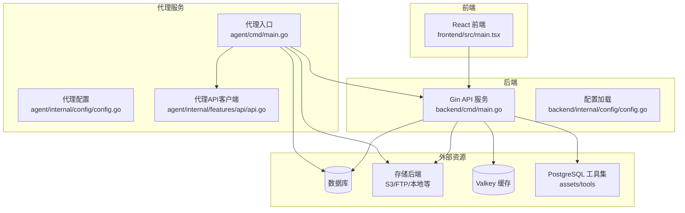
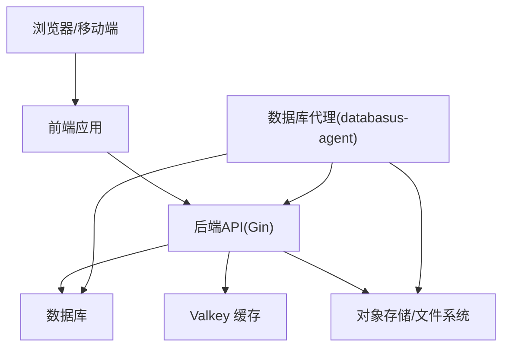
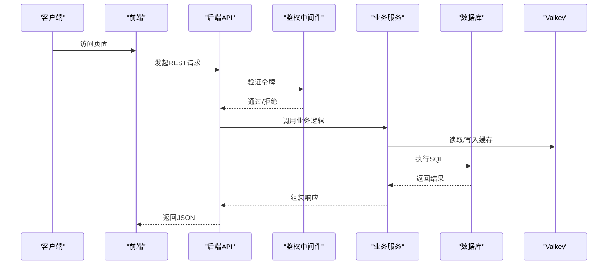
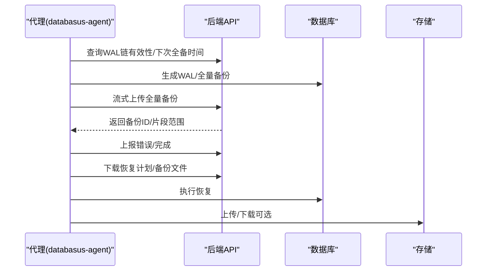
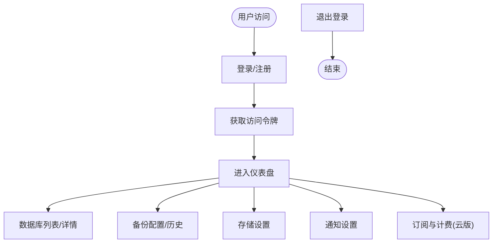
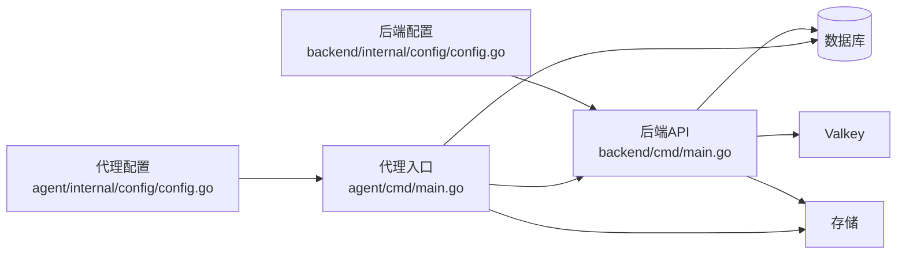

# 架构设计概览

<cite>
**本文引用的文件**
- [backend/cmd/main.go](file://backend/cmd/main.go)
- [agent/cmd/main.go](file://agent/cmd/main.go)
- [frontend/src/main.tsx](file://frontend/src/main.tsx)
- [backend/internal/config/config.go](file://backend/internal/config/config.go)
- [agent/internal/config/config.go](file://agent/internal/config/config.go)
- [deploy/helm/values.yaml](file://deploy/helm/values.yaml)
- [docker-compose.yml.example](file://docker-compose.yml.example)
- [README.md](file://README.md)
- [backend/internal/features/databases/controller.go](file://backend/internal/features/databases/controller.go)
- [agent/internal/features/api/api.go](file://agent/internal/features/api/api.go)
- [backend/internal/features/storages/models/ftp/model.go](file://backend/internal/features/storages/models/ftp/model.go)
- [frontend/src/entity/users/api/userApi.ts](file://frontend/src/entity/users/api/userApi.ts)
</cite>

## 目录
1. [简介](#简介)
2. [项目结构](#项目结构)
3. [核心组件](#核心组件)
4. [架构总览](#架构总览)
5. [详细组件分析](#详细组件分析)
6. [依赖关系分析](#依赖关系分析)
7. [性能考量](#性能考量)
8. [故障排查指南](#故障排查指南)
9. [结论](#结论)
10. [附录](#附录)

## 简介
本文件面向Databasus项目的架构设计概览，系统采用微服务与前后端分离架构，结合代理服务（Agent）实现数据库侧的备份与恢复能力。后端API服务负责业务逻辑与数据管理，前端用户界面提供可视化操作，数据库代理服务负责数据库连接、备份与恢复执行。系统支持RESTful API调用、文件传输协议（如FTP/S3等），并提供多种部署模式（单机、容器化、Kubernetes）。本文档还涵盖数据流、组件间通信机制、可扩展性与高可用设计以及性能优化策略。

## 项目结构
Databasus仓库包含以下主要模块：
- 后端API服务：基于Go语言，使用Gin框架提供REST API，负责认证、工作区、数据库、备份、存储、通知、健康检查、计费等业务功能。
- 数据库代理服务：轻量级Go程序，运行在数据库主机或容器内，负责WAL归档、全量备份上传、恢复计划与下载、版本与二进制工具管理等。
- 前端用户界面：基于React/Vite构建，提供数据库管理、备份配置、存储与通知设置、用户与工作区管理等UI。
- 部署与运维：提供Docker Compose示例与Helm Chart，支持单机、容器化与Kubernetes集群部署。

**图表来源**
- [backend/cmd/main.go:65-137](file://backend/cmd/main.go#L65-L137)
- [agent/cmd/main.go:24-75](file://agent/cmd/main.go#L24-L75)
- [frontend/src/main.tsx:1-14](file://frontend/src/main.tsx#L1-L14)
- [backend/internal/config/config.go:152-421](file://backend/internal/config/config.go#L152-L421)
- [agent/internal/config/config.go:16-115](file://agent/internal/config/config.go#L16-L115)

**章节来源**
- [README.md:124-222](file://README.md#L124-L222)
- [docker-compose.yml.example:1-19](file://docker-compose.yml.example#L1-L19)
- [deploy/helm/values.yaml:1-107](file://deploy/helm/values.yaml#L1-L107)

## 核心组件
- 后端API服务
  - 职责：提供REST API、路由注册、认证中间件、后台任务调度、静态资源托管（前端UI）、数据库迁移与初始化。
  - 关键点：Gin中间件链（日志、GZIP压缩、CORS、恢复）、Swagger文档生成、优雅关闭、多节点模式（主节点/处理节点）。
- 数据库代理服务
  - 职责：与后端API通信，协调WAL归档、全量备份上传、恢复计划与下载；根据配置选择host或docker模式；自动更新与状态管理。
  - 关键点：命令行子命令（start/stop/status/restore/version）、配置持久化、重试与超时控制、流式上传。
- 前端用户界面
  - 职责：用户认证、数据库与备份配置、存储与通知设置、工作区管理、订阅与计费（云版）。
  - 关键点：React应用入口、API封装、鉴权监听与访问令牌管理、主题与响应式布局。

**章节来源**
- [backend/cmd/main.go:213-276](file://backend/cmd/main.go#L213-L276)
- [agent/cmd/main.go:30-75](file://agent/cmd/main.go#L30-L75)
- [frontend/src/main.tsx:1-14](file://frontend/src/main.tsx#L1-L14)

## 架构总览
Databasus采用三层架构：
- 表现层：前端React应用通过REST API与后端交互。
- 应用层：后端Gin服务提供统一API网关，内部按功能域划分模块（数据库、备份、存储、通知、计费等）。
- 数据与代理层：数据库代理在数据库侧执行备份与恢复，通过HTTP与后端通信；后端将备份写入多种存储后端（S3、FTP、本地等）。

**图表来源**
- [backend/cmd/main.go:213-257](file://backend/cmd/main.go#L213-L257)
- [agent/cmd/main.go:108-160](file://agent/cmd/main.go#L108-L160)
- [backend/internal/config/config.go:33-41](file://backend/internal/config/config.go#L33-L41)

## 详细组件分析

### 后端API服务（Gin）
- 路由与中间件
  - 公共路由：健康检查、版本查询、代理端点、公开备份相关接口。
  - 受保护路由：需要认证的用户、工作区、数据库、备份、恢复、存储、通知、审计日志、计费等。
  - 中间件：GZIP压缩、CORS（开发环境）、全局恢复记录、鉴权中间件。
- 后台任务
  - 主节点任务：备份调度、清理、恢复调度、健康检查尝试、审计日志清理、下载令牌清理、节点注册、计费（云版）、遥测。
  - 处理节点任务：备份节点与恢复节点运行。
- 部署集成
  - 挂载前端静态资源，未命中路由回退到index.html。
  - 开发模式下启用CORS，生产模式下通过反向代理处理跨域。

**图表来源**
- [backend/cmd/main.go:213-257](file://backend/cmd/main.go#L213-L257)
- [backend/cmd/main.go:293-374](file://backend/cmd/main.go#L293-L374)

**章节来源**
- [backend/cmd/main.go:112-137](file://backend/cmd/main.go#L112-L137)
- [backend/cmd/main.go:478-491](file://backend/cmd/main.go#L478-L491)

### 数据库代理服务（Agent）
- 命令与流程
  - start：启动代理，加载配置，检查更新，进入守护进程模式。
  - _run：实际守护进程运行，处理WAL与全量备份。
  - stop/status：停止与查询状态。
  - restore：从备份恢复数据库，支持目标时间点恢复（PITR）。
- 与后端通信
  - 使用REST客户端调用后端API，包含重试与超时控制。
  - 流式上传：basebackup与WAL段使用标准HTTP客户端避免内存缓冲。
- 配置管理
  - 优先从JSON配置文件加载，支持CLI参数覆盖，记录各字段来源便于调试。

**图表来源**
- [agent/cmd/main.go:50-97](file://agent/cmd/main.go#L50-L97)
- [agent/cmd/main.go:117-160](file://agent/cmd/main.go#L117-L160)
- [agent/internal/features/api/api.go:72-200](file://agent/internal/features/api/api.go#L72-L200)

**章节来源**
- [agent/cmd/main.go:24-75](file://agent/cmd/main.go#L24-L75)
- [agent/internal/config/config.go:35-115](file://agent/internal/config/config.go#L35-L115)

### 前端用户界面（React）
- 初始化与路由
  - React根节点挂载，Day.js国际化与时长格式化。
  - 通过API封装发起REST请求，处理登录、登出、密码重置等。
- 与后端交互
  - 用户认证：登录、发送重置码、重置密码。
  - 订阅与计费（云版）：通过事件监听Paddle回调，轮询支付确认。
- 实时性与状态
  - 访问令牌存储与鉴权监听，确保UI状态与登录态一致。

**图表来源**
- [frontend/src/main.tsx:1-14](file://frontend/src/main.tsx#L1-L14)
- [frontend/src/entity/users/api/userApi.ts:148-188](file://frontend/src/entity/users/api/userApi.ts#L148-L188)

**章节来源**
- [frontend/src/main.tsx:1-14](file://frontend/src/main.tsx#L1-L14)
- [frontend/src/entity/users/api/userApi.ts:1-188](file://frontend/src/entity/users/api/userApi.ts#L1-L188)

### 数据流与组件通信机制
- RESTful API
  - 后端通过Gin注册公共与受保护路由，前端通过封装的API模块调用。
- 文件传输协议
  - 存储后端支持S3、FTP、本地等；代理与后端通过HTTP进行流式上传/下载。
- WebSocket
  - 在当前代码中未发现WebSocket实现；系统以REST API与定时/后台任务为主。

**章节来源**
- [backend/internal/features/storages/models/ftp/model.go:115-149](file://backend/internal/features/storages/models/ftp/model.go#L115-L149)
- [agent/internal/features/api/api.go:120-150](file://agent/internal/features/api/api.go#L120-L150)

## 依赖关系分析
- 组件耦合
  - 后端API对数据库、缓存、存储与工具集存在直接依赖；代理服务对后端API与数据库存在直接依赖。
- 配置与环境
  - 后端通过环境变量控制模式（开发/生产）、节点角色（主/处理）、存储路径、Valkey连接等。
  - 代理通过JSON配置文件与CLI参数组合，支持host/docker两种数据库接入方式。

**图表来源**
- [backend/internal/config/config.go:152-421](file://backend/internal/config/config.go#L152-L421)
- [agent/internal/config/config.go:16-115](file://agent/internal/config/config.go#L16-L115)

**章节来源**
- [backend/internal/config/config.go:25-146](file://backend/internal/config/config.go#L25-L146)
- [agent/internal/config/config.go:16-115](file://agent/internal/config/config.go#L16-L115)

## 性能考量
- 网络与吞吐
  - 多节点模式允许通过节点网络吞吐限制（MB/s）控制带宽，避免备份/恢复过程影响其他流量。
- 压缩与传输
  - Gin启用GZIP压缩（排除图片/PDF等已压缩格式），减少API响应体积。
  - 代理对大文件采用流式上传，避免内存峰值。
- 缓存与并发
  - 使用Valkey作为缓存层，降低数据库压力；后台任务采用上下文取消实现优雅退出。
- 存储与I/O
  - 支持多种存储后端，可根据场景选择本地SSD、云对象存储等；FTP等协议提供TLS选项提升安全性。

**章节来源**
- [backend/internal/config/config.go:48-51](file://backend/internal/config/config.go#L48-L51)
- [backend/cmd/main.go:117-124](file://backend/cmd/main.go#L117-L124)
- [agent/internal/features/api/api.go:120-150](file://agent/internal/features/api/api.go#L120-L150)

## 故障排查指南
- 后端启动与迁移
  - 若迁移失败或目录创建失败，后端会记录错误并退出；检查DATABASE_DSN与数据卷权限。
- 代理状态与恢复
  - 使用status查看代理状态，使用restore进行恢复；若报错需检查databasus-host/token与pg-type配置。
- 存储连接问题
  - FTP等存储上传/下载失败时，检查连接参数、证书验证与网络连通性。
- 前端鉴权问题
  - 登录失败或令牌无效时，检查后端健康状态与CORS配置（开发环境）。

**章节来源**
- [backend/cmd/main.go:86-106](file://backend/cmd/main.go#L86-L106)
- [agent/cmd/main.go:108-160](file://agent/cmd/main.go#L108-L160)
- [backend/internal/features/storages/models/ftp/model.go:115-149](file://backend/internal/features/storages/models/ftp/model.go#L115-L149)

## 结论
Databasus通过清晰的分层架构与代理服务，实现了数据库备份与恢复的自动化与可扩展性。后端API提供统一的业务能力与安全控制，前端提供直观的操作体验，代理在数据库侧高效完成备份与恢复任务。系统支持多种部署模式，并通过配置与后台任务实现高可用与性能优化。未来可在现有基础上引入监控告警、限流与更丰富的实时通信能力，进一步增强可观测性与用户体验。

## 附录
- 部署模式
  - 单机部署：Docker单容器运行，端口映射4005，数据卷映射至databasus-data。
  - 容器化部署：Docker Compose示例，便于本地开发与测试。
  - Kubernetes部署：Helm Chart支持ClusterIP/LoadBalancer/Ingress/HTTPRoute等多种暴露方式。
- 连接类型
  - 远程：后端直连数据库（推荐只读）。
  - Agent：代理在数据库主机/容器内运行，支持host与docker两种模式。

**章节来源**
- [README.md:124-222](file://README.md#L124-L222)
- [docker-compose.yml.example:1-19](file://docker-compose.yml.example#L1-L19)
- [deploy/helm/values.yaml:17-91](file://deploy/helm/values.yaml#L17-L91)