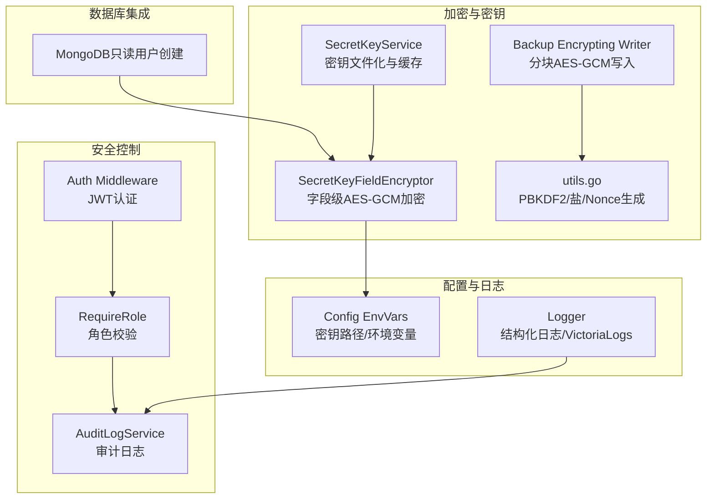
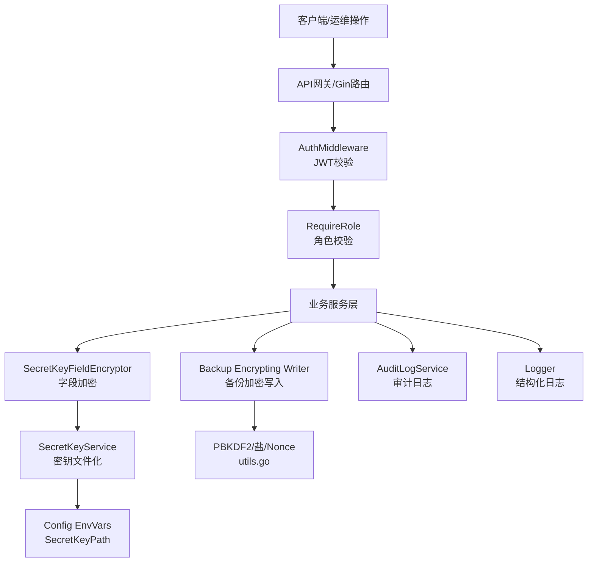
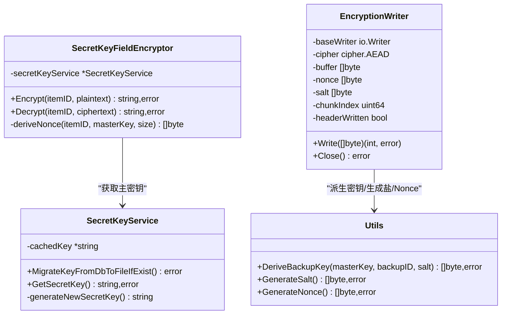
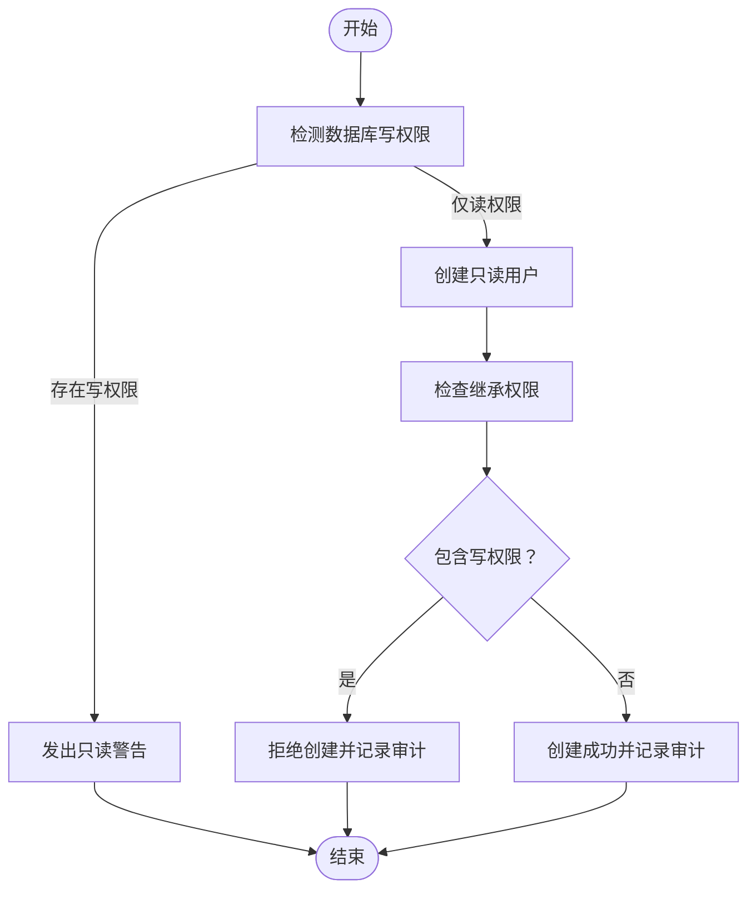
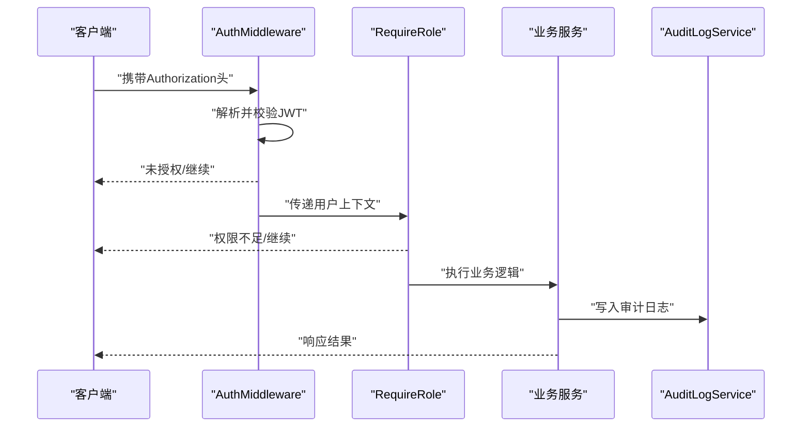
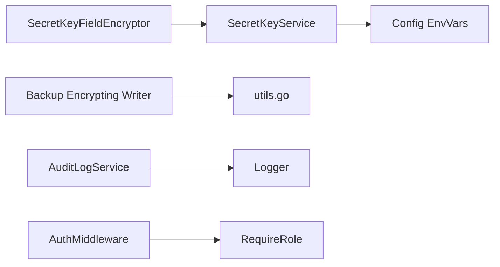

# 企业级安全保护

<cite>
**本文引用的文件**   
- [backend/internal/util/encryption/secret_key_field_encryptor.go](file://backend/internal/util/encryption/secret_key_field_encryptor.go)
- [backend/internal/features/backups/backups/encryption/utils.go](file://backend/internal/features/backups/backups/encryption/utils.go)
- [backend/internal/features/backups/backups/encryption/encrypting_writer.go](file://backend/internal/features/backups/backups/encryption/encrypting_writer.go)
- [backend/internal/features/backups/backups/encryption/encryption_test.go](file://backend/internal/features/backups/backups/encryption/encryption_test.go)
- [backend/internal/features/encryption/secrets/service.go](file://backend/internal/features/encryption/secrets/service.go)
- [backend/internal/config/config.go](file://backend/internal/config/config.go)
- [backend/internal/features/audit_logs/service.go](file://backend/internal/features/audit_logs/service.go)
- [backend/internal/features/users/middleware/middleware.go](file://backend/internal/features/users/middleware/middleware.go)
- [backend/internal/features/databases/databases/mongodb/model.go](file://backend/internal/features/databases/databases/mongodb/model.go)
- [.github/SECURITY.md](file://.github/SECURITY.md)
- [backend/internal/util/logger/logger.go](file://backend/internal/util/logger/logger.go)
</cite>

## 目录
1. [简介](#简介)
2. [项目结构](#项目结构)
3. [核心组件](#核心组件)
4. [架构总览](#架构总览)
5. [详细组件分析](#详细组件分析)
6. [依赖分析](#依赖分析)
7. [性能考虑](#性能考虑)
8. [故障排查指南](#故障排查指南)
9. [结论](#结论)
10. [附录](#附录)

## 简介
本文件系统化阐述 Databasus 的企业级安全保护能力，重点覆盖以下方面：
- AES-256-GCM 加密算法的实现原理与安全优势：密钥派生、随机盐与随机 nonce、分块加密与认证、抗篡改与完整性校验。
- 零信任存储架构：备份与敏感字段在传输与静态时的端到端加密，密钥与数据分离，密钥文件化与缓存策略。
- 敏感数据保护：凭据加密（如数据库连接密码）、日志脱敏与最小化记录、内存安全与密钥生命周期管理。
- 只读用户机制：最小权限原则、数据库权限控制、操作审计与告警。
- 安全配置最佳实践：密钥管理策略、访问控制、合规性要求。
- 威胁分析与防护：篡改检测、重放与越权、日志与审计的完整性。

## 项目结构
围绕安全主题的关键模块分布如下：
- 加密与密钥管理：后端工具层与加密服务，负责对敏感字段与备份进行 AES-256-GCM 加密，并通过 PBKDF2 派生密钥。
- 备份加密：备份写入器采用分块加密并携带头部信息，确保完整性与可验证性。
- 访问控制与审计：基于 JWT 的认证中间件、角色权限控制、全局与工作区审计日志。
- 数据库只读用户：针对 MongoDB 的只读用户创建流程，避免写权限风险。
- 日志与可观测性：结构化日志与可选的 VictoriaLogs 输出，支持安全事件记录与检索。

**图表来源**
- [backend/internal/features/encryption/secrets/service.go:16-74](file://backend/internal/features/encryption/secrets/service.go#L16-L74)
- [backend/internal/util/encryption/secret_key_field_encryptor.go:20-122](file://backend/internal/util/encryption/secret_key_field_encryptor.go#L20-L122)
- [backend/internal/features/backups/backups/encryption/encrypting_writer.go:13-148](file://backend/internal/features/backups/backups/encryption/encrypting_writer.go#L13-L148)
- [backend/internal/features/backups/backups/encryption/utils.go:12-52](file://backend/internal/features/backups/backups/encryption/utils.go#L12-L52)
- [backend/internal/features/users/middleware/middleware.go:14-77](file://backend/internal/features/users/middleware/middleware.go#L14-L77)
- [backend/internal/features/audit_logs/service.go:13-153](file://backend/internal/features/audit_logs/service.go#L13-L153)
- [backend/internal/features/databases/databases/mongodb/model.go:388-419](file://backend/internal/features/databases/databases/mongodb/model.go#L388-L419)
- [backend/internal/config/config.go:55-56](file://backend/internal/config/config.go#L55-L56)
- [backend/internal/util/logger/logger.go:14-62](file://backend/internal/util/logger/logger.go#L14-L62)

**章节来源**
- [backend/internal/util/encryption/secret_key_field_encryptor.go:1-122](file://backend/internal/util/encryption/secret_key_field_encryptor.go#L1-L122)
- [backend/internal/features/backups/backups/encryption/encrypting_writer.go:1-148](file://backend/internal/features/backups/backups/encryption/encrypting_writer.go#L1-L148)
- [backend/internal/features/backups/backups/encryption/utils.go:1-52](file://backend/internal/features/backups/backups/encryption/utils.go#L1-L52)
- [backend/internal/features/encryption/secrets/service.go:1-74](file://backend/internal/features/encryption/secrets/service.go#L1-L74)
- [backend/internal/config/config.go:1-422](file://backend/internal/config/config.go#L1-L422)
- [backend/internal/features/audit_logs/service.go:1-153](file://backend/internal/features/audit_logs/service.go#L1-L153)
- [backend/internal/features/users/middleware/middleware.go:1-77](file://backend/internal/features/users/middleware/middleware.go#L1-L77)
- [backend/internal/features/databases/databases/mongodb/model.go:1-419](file://backend/internal/features/databases/databases/mongodb/model.go#L1-L419)
- [backend/internal/util/logger/logger.go:1-131](file://backend/internal/util/logger/logger.go#L1-L131)

## 核心组件
- 字段级 AES-256-GCM 加密器：对敏感字符串（如凭据）进行加密，使用 HMAC-SHA256 派生 nonce，结合主密钥与 itemID 保证唯一性与不可预测性。
- 备份 AES-256-GCM 写入器：以固定分块大小进行流式加密，写入头部包含魔数、盐、nonce 与保留字段，支持完整性与认证失败检测。
- 密钥服务：密钥文件化存储于受控目录，首次运行自动生成，支持从数据库迁移至文件；提供缓存以降低 IO 开销。
- 认证与授权：JWT 中间件与角色中间件，限制管理员操作范围与最小权限访问。
- 审计日志：统一写入审计日志表，支持全局、用户与工作区维度查询与清理。
- MongoDB 只读用户：自动创建具备最小权限的只读账号，避免写操作风险。

**章节来源**
- [backend/internal/util/encryption/secret_key_field_encryptor.go:24-121](file://backend/internal/util/encryption/secret_key_field_encryptor.go#L24-L121)
- [backend/internal/features/backups/backups/encryption/encrypting_writer.go:23-148](file://backend/internal/features/backups/backups/encryption/encrypting_writer.go#L23-L148)
- [backend/internal/features/encryption/secrets/service.go:47-74](file://backend/internal/features/encryption/secrets/service.go#L47-L74)
- [backend/internal/features/users/middleware/middleware.go:14-77](file://backend/internal/features/users/middleware/middleware.go#L14-L77)
- [backend/internal/features/audit_logs/service.go:18-153](file://backend/internal/features/audit_logs/service.go#L18-L153)
- [backend/internal/features/databases/databases/mongodb/model.go:388-419](file://backend/internal/features/databases/databases/mongodb/model.go#L388-L419)

## 架构总览
下图展示“零信任存储”与“最小权限”的整体安全架构：备份与敏感字段均以 AES-256-GCM 加密，密钥文件化存储，访问控制通过中间件与角色约束，审计日志贯穿关键操作。

**图表来源**
- [backend/internal/features/users/middleware/middleware.go:14-77](file://backend/internal/features/users/middleware/middleware.go#L14-L77)
- [backend/internal/util/encryption/secret_key_field_encryptor.go:24-121](file://backend/internal/util/encryption/secret_key_field_encryptor.go#L24-L121)
- [backend/internal/features/backups/backups/encryption/encrypting_writer.go:23-148](file://backend/internal/features/backups/backups/encryption/encrypting_writer.go#L23-L148)
- [backend/internal/features/backups/backups/encryption/utils.go:23-52](file://backend/internal/features/backups/backups/encryption/utils.go#L23-L52)
- [backend/internal/features/encryption/secrets/service.go:47-74](file://backend/internal/features/encryption/secrets/service.go#L47-L74)
- [backend/internal/config/config.go:55-56](file://backend/internal/config/config.go#L55-L56)
- [backend/internal/features/audit_logs/service.go:18-35](file://backend/internal/features/audit_logs/service.go#L18-L35)
- [backend/internal/util/logger/logger.go:19-49](file://backend/internal/util/logger/logger.go#L19-L49)

## 详细组件分析

### AES-256-GCM 加密与密钥管理
- 密钥生成与存储
  - 首次运行自动生成主密钥并写入受控文件路径，后续启动从文件缓存加载，避免重复 IO。
  - 支持从数据库迁移密钥至文件，完成迁移后删除数据库中的密钥记录，实现密钥与数据分离。
- 字段级加密
  - 使用 AES-256-GCM 对敏感字符串进行加密，nonce 由 HMAC-SHA256 基于主密钥与 itemID 派生，确保唯一性与不可预测性。
  - 密文前缀标识已加密值，解密时先解析 nonce 与密文，再执行认证解密。
- 备份加密
  - 分块加密，每块使用派生 nonce，头部包含魔数、盐、nonce 与保留字段，便于后续验证与恢复。
  - PBKDF2 使用固定迭代次数与 SHA-256，盐长度与 nonce 长度固定，确保跨版本兼容与安全性。
- 测试与抗篡改
  - 单元测试覆盖了错误密钥、篡改密文导致认证失败等场景，验证完整性与认证失败行为。

**图表来源**
- [backend/internal/features/encryption/secrets/service.go:16-74](file://backend/internal/features/encryption/secrets/service.go#L16-L74)
- [backend/internal/util/encryption/secret_key_field_encryptor.go:20-122](file://backend/internal/util/encryption/secret_key_field_encryptor.go#L20-L122)
- [backend/internal/features/backups/backups/encryption/encrypting_writer.go:13-63](file://backend/internal/features/backups/backups/encryption/encrypting_writer.go#L13-L63)
- [backend/internal/features/backups/backups/encryption/utils.go:23-52](file://backend/internal/features/backups/backups/encryption/utils.go#L23-L52)

**章节来源**
- [backend/internal/features/encryption/secrets/service.go:20-74](file://backend/internal/features/encryption/secrets/service.go#L20-L74)
- [backend/internal/util/encryption/secret_key_field_encryptor.go:24-121](file://backend/internal/util/encryption/secret_key_field_encryptor.go#L24-L121)
- [backend/internal/features/backups/backups/encryption/encrypting_writer.go:23-148](file://backend/internal/features/backups/backups/encryption/encrypting_writer.go#L23-L148)
- [backend/internal/features/backups/backups/encryption/utils.go:12-52](file://backend/internal/features/backups/backups/encryption/utils.go#L12-L52)
- [backend/internal/features/backups/backups/encryption/encryption_test.go:132-180](file://backend/internal/features/backups/backups/encryption/encryption_test.go#L132-L180)

### 零信任存储与密钥分离
- 零信任原则
  - 备份与敏感字段在传输与静态时均被加密，即使存储介质或云对象存储被共享，也无法解密。
  - 密钥文件化存储于受控目录，不与业务数据同库存放，降低泄露面。
- 密钥路径与默认位置
  - 配置中定义密钥文件路径，应用启动时加载 .env 并设置数据与密钥文件的默认位置，确保密钥与数据分离。
- 运行期安全
  - 密钥服务缓存主密钥，减少磁盘 IO；仅在必要时重新读取或生成新密钥。

**章节来源**
- [backend/internal/config/config.go:330-333](file://backend/internal/config/config.go#L330-L333)
- [backend/internal/features/encryption/secrets/service.go:47-74](file://backend/internal/features/encryption/secrets/service.go#L47-L74)

### 敏感数据保护
- 凭据加密
  - 对数据库连接密码等敏感字符串进行字段级 AES-GCM 加密，解密仅在需要连接时进行，避免明文常驻内存。
- 日志脱敏与最小化
  - 结构化日志输出，时间与级别等字段按需替换；可选 VictoriaLogs 输出，便于集中采集与检索。
  - 审计日志记录关键操作，避免记录敏感字段明文。
- 内存安全
  - 解密后及时释放明文，避免在内存中长期留存；字段加密器对输入为空或已加密的情况进行快速分支处理。

**章节来源**
- [backend/internal/util/encryption/secret_key_field_encryptor.go:58-106](file://backend/internal/util/encryption/secret_key_field_encryptor.go#L58-L106)
- [backend/internal/util/logger/logger.go:19-49](file://backend/internal/util/logger/logger.go#L19-L49)
- [backend/internal/features/audit_logs/service.go:18-35](file://backend/internal/features/audit_logs/service.go#L18-L35)

### 只读用户机制与最小权限
- 最小权限原则
  - 默认使用只读访问，若检测到写权限，系统会发出警告，提示潜在风险。
- 数据库权限控制
  - MongoDB 只读用户创建流程中，检查继承权限集合，若发现写操作相关权限则拒绝创建，确保最小权限。
- 操作审计
  - 关键数据库操作（如创建只读用户）纳入审计日志，便于追踪与合规审查。

**图表来源**
- [.github/SECURITY.md:59-61](file://.github/SECURITY.md#L59-L61)
- [backend/internal/features/databases/databases/mongodb/model.go:366-385](file://backend/internal/features/databases/databases/mongodb/model.go#L366-L385)

**章节来源**
- [.github/SECURITY.md:56-62](file://.github/SECURITY.md#L56-L62)
- [backend/internal/features/databases/databases/mongodb/model.go:388-419](file://backend/internal/features/databases/databases/mongodb/model.go#L388-L419)

### 访问控制与审计
- 认证中间件
  - 从请求头提取 JWT，校验失败返回未授权；通过后将用户上下文注入路由。
- 角色中间件
  - 限定特定资源仅管理员可访问，其他角色返回禁止访问。
- 审计日志
  - 统一写入审计日志表，支持全局、用户与工作区查询；后台任务定期清理过期日志，避免无限增长。

**图表来源**
- [backend/internal/features/users/middleware/middleware.go:14-77](file://backend/internal/features/users/middleware/middleware.go#L14-L77)
- [backend/internal/features/audit_logs/service.go:18-35](file://backend/internal/features/audit_logs/service.go#L18-L35)

**章节来源**
- [backend/internal/features/users/middleware/middleware.go:14-77](file://backend/internal/features/users/middleware/middleware.go#L14-L77)
- [backend/internal/features/audit_logs/service.go:18-153](file://backend/internal/features/audit_logs/service.go#L18-L153)

## 依赖分析
- 组件耦合
  - 字段加密器依赖密钥服务；备份写入器依赖工具函数进行密钥派生与随机参数生成。
  - 审计日志与日志模块相互独立，但可通过统一的日志接口记录安全事件。
- 外部依赖
  - 使用标准库 crypto/aes、crypto/cipher、crypto/hmac、crypto/sha256、crypto/rand 与 PBKDF2。
  - 配置加载依赖 dotenv 与 cleanenv，密钥文件路径与数据目录通过环境变量与默认路径组合确定。

**图表来源**
- [backend/internal/util/encryption/secret_key_field_encryptor.go:33-85](file://backend/internal/util/encryption/secret_key_field_encryptor.go#L33-L85)
- [backend/internal/features/encryption/secrets/service.go:47-69](file://backend/internal/features/encryption/secrets/service.go#L47-L69)
- [backend/internal/features/backups/backups/encryption/encrypting_writer.go:37-50](file://backend/internal/features/backups/backups/encryption/encrypting_writer.go#L37-L50)
- [backend/internal/features/backups/backups/encryption/utils.go:23-36](file://backend/internal/features/backups/backups/encryption/utils.go#L23-L36)
- [backend/internal/config/config.go:330-333](file://backend/internal/config/config.go#L330-L333)
- [backend/internal/features/audit_logs/service.go:18-35](file://backend/internal/features/audit_logs/service.go#L18-L35)
- [backend/internal/util/logger/logger.go:19-49](file://backend/internal/util/logger/logger.go#L19-L49)
- [backend/internal/features/users/middleware/middleware.go:14-77](file://backend/internal/features/users/middleware/middleware.go#L14-L77)

**章节来源**
- [backend/internal/util/encryption/secret_key_field_encryptor.go:1-122](file://backend/internal/util/encryption/secret_key_field_encryptor.go#L1-L122)
- [backend/internal/features/backups/backups/encryption/encrypting_writer.go:1-148](file://backend/internal/features/backups/backups/encryption/encrypting_writer.go#L1-L148)
- [backend/internal/features/encryption/secrets/service.go:1-74](file://backend/internal/features/encryption/secrets/service.go#L1-L74)
- [backend/internal/config/config.go:1-422](file://backend/internal/config/config.go#L1-L422)
- [backend/internal/features/audit_logs/service.go:1-153](file://backend/internal/features/audit_logs/service.go#L1-L153)
- [backend/internal/features/users/middleware/middleware.go:1-77](file://backend/internal/features/users/middleware/middleware.go#L1-L77)
- [backend/internal/util/logger/logger.go:1-131](file://backend/internal/util/logger/logger.go#L1-L131)

## 性能考虑
- 分块加密与流式写入：备份写入器以固定分块大小进行加密，减少一次性内存占用，提升大文件处理效率。
- 密钥缓存：密钥服务缓存主密钥，避免频繁磁盘 IO；仅在密钥变更或首次访问时触发读取。
- PBKDF2 迭代：固定迭代次数与哈希算法，平衡安全性与性能；盐与 nonce 的随机性确保不同块使用不同密文。
- 日志与审计：结构化日志与可选的远程日志输出，建议在生产环境启用异步写入与批量上报，降低对业务影响。

## 故障排查指南
- 认证失败
  - 检查 Authorization 头是否正确携带 Bearer Token；确认中间件是否正确解析并校验。
- 权限不足
  - 确认用户角色是否满足 RequireRole 要求；管理员可查看全局审计日志，普通用户仅能查看自身日志。
- 解密失败
  - 核对密钥文件是否存在且权限正确；确认主密钥未被外部修改；检查字段加密器的 nonce 与密文格式。
- 备份认证失败
  - 若备份文件被篡改，解密阶段会因认证失败报错；请核对备份来源与完整性校验。
- 只读用户创建失败
  - 检查数据库写权限检测逻辑与继承权限集合；确保未授予写权限。

**章节来源**
- [backend/internal/features/users/middleware/middleware.go:14-77](file://backend/internal/features/users/middleware/middleware.go#L14-L77)
- [backend/internal/features/audit_logs/service.go:74-107](file://backend/internal/features/audit_logs/service.go#L74-L107)
- [backend/internal/util/encryption/secret_key_field_encryptor.go:58-106](file://backend/internal/util/encryption/secret_key_field_encryptor.go#L58-L106)
- [backend/internal/features/backups/backups/encryption/encryption_test.go:132-180](file://backend/internal/features/backups/backups/encryption/encryption_test.go#L132-L180)
- [backend/internal/features/databases/databases/mongodb/model.go:366-385](file://backend/internal/features/databases/databases/mongodb/model.go#L366-L385)

## 结论
Databasus 在企业级安全方面构建了“零信任存储 + 最小权限 + 完整审计”的闭环：
- 以 AES-256-GCM 为核心，结合 PBKDF2、盐与 nonce 实现强加密与抗篡改；
- 密钥文件化与缓存策略，确保密钥与数据分离与高效访问；
- 基于 JWT 与角色的访问控制，配合审计日志与只读用户机制，实现最小权限与可追溯；
- 通过结构化日志与可选远程日志输出，支撑安全事件的收集与分析。

## 附录
- 安全特性概览（来自项目安全政策）
  - AES-256-GCM 加密、只读数据库访问、基于角色的访问控制、审计日志、零信任存储。
- 威胁与缓解要点
  - 篡改检测：AES-GCM 认证失败即刻暴露篡改。
  - 越权与最小权限：JWT 校验 + 角色中间件 + 只读用户创建流程。
  - 合规与审计：统一审计日志与日志输出，支持历史清理与合规检索。

**章节来源**
- [.github/SECURITY.md:52-66](file://.github/SECURITY.md#L52-L66)