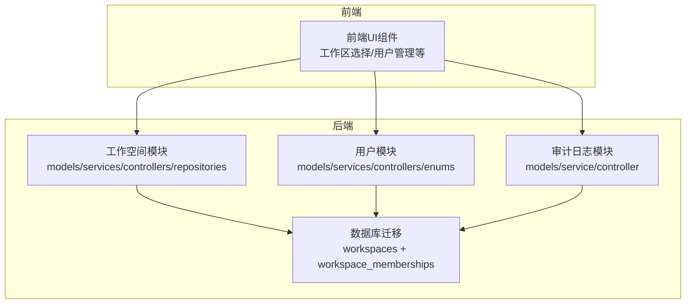
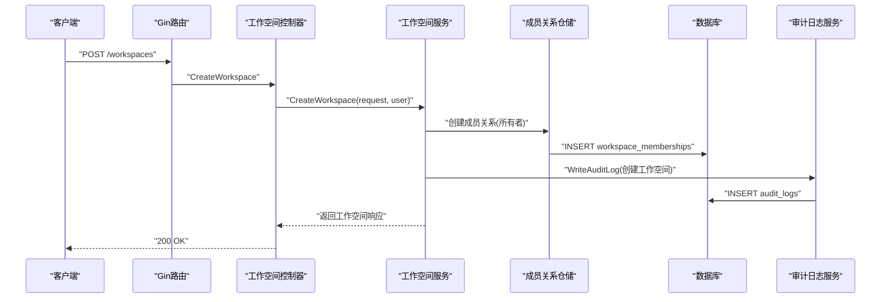
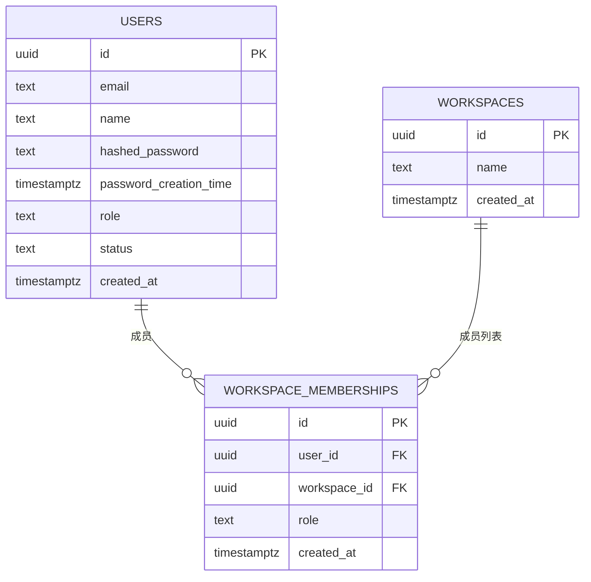
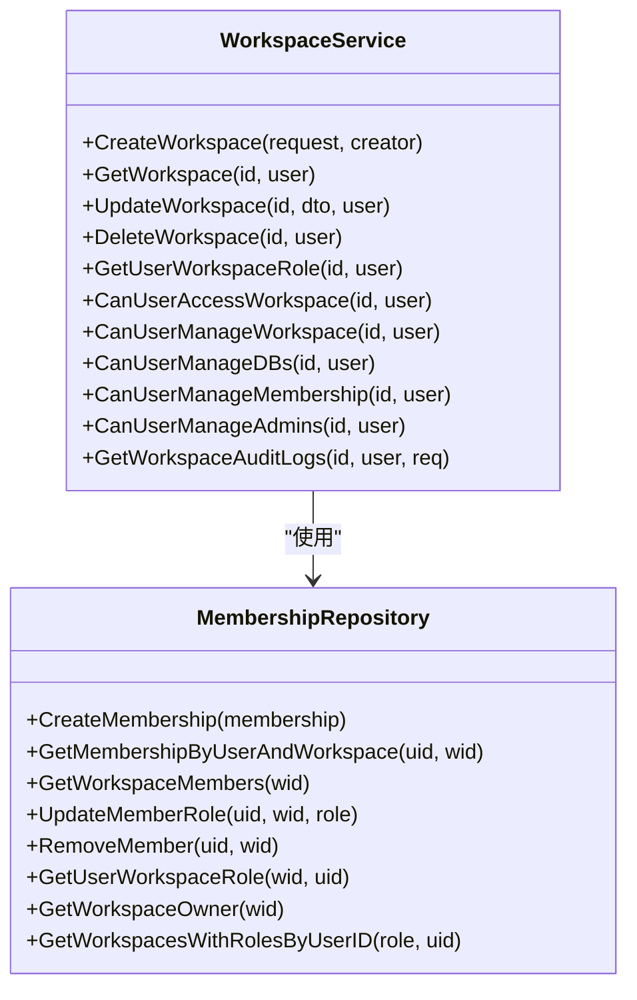
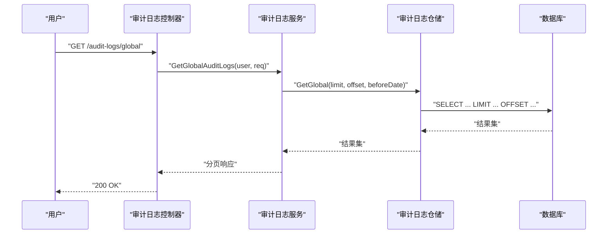
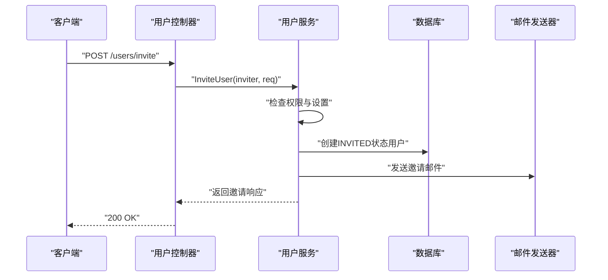
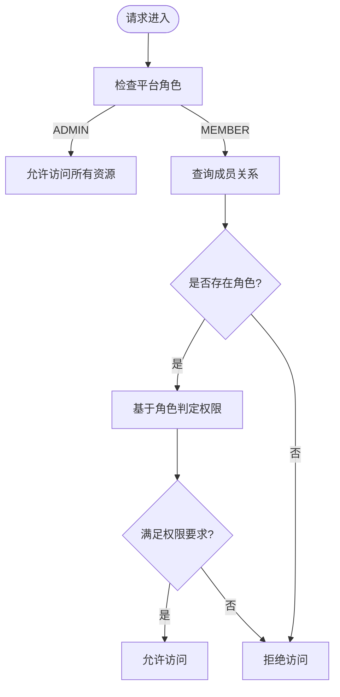
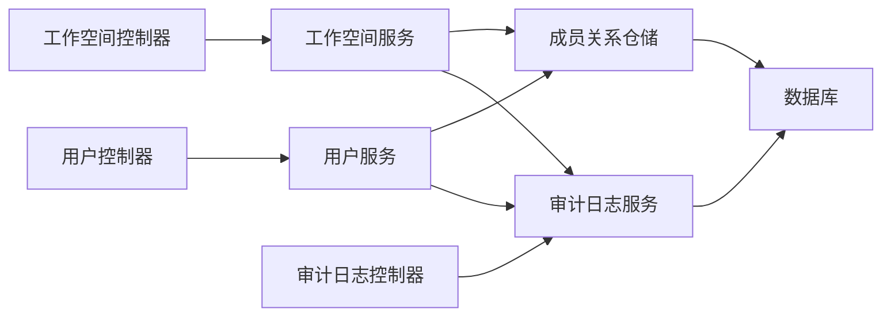

# 团队协作功能

<cite>
**本文档引用的文件**
- [workspace.go](file://backend/internal/features/workspaces/models/workspace.go)
- [workspace_membership.go](file://backend/internal/features/workspaces/models/workspace_membership.go)
- [workspace_service.go](file://backend/internal/features/workspaces/services/workspace_service.go)
- [membership_repository.go](file://backend/internal/features/workspaces/repositories/membership_repository.go)
- [workspace_controller.go](file://backend/internal/features/workspaces/controllers/workspace_controller.go)
- [workspace_role.go](file://backend/internal/features/users/enums/workspace_role.go)
- [user_role.go](file://backend/internal/features/users/enums/user_role.go)
- [user.go](file://backend/internal/features/users/models/user.go)
- [users_settings.go](file://backend/internal/features/users/models/users_settings.go)
- [user_services.go](file://backend/internal/features/users/services/user_services.go)
- [management_controller.go](file://backend/internal/features/users/controllers/management_controller.go)
- [models.go](file://backend/internal/features/audit_logs/models.go)
- [service.go](file://backend/internal/features/audit_logs/service.go)
- [controller.go](file://backend/internal/features/audit_logs/controller.go)
- [20251031155004_add_workspaces.sql](file://backend/migrations/20251031155004_add_workspaces.sql)
</cite>

## 目录
1. [简介](#简介)
2. [项目结构](#项目结构)
3. [核心组件](#核心组件)
4. [架构总览](#架构总览)
5. [详细组件分析](#详细组件分析)
6. [依赖关系分析](#依赖关系分析)
7. [性能考量](#性能考量)
8. [故障排查指南](#故障排查指南)
9. [结论](#结论)
10. [附录](#附录)

## 简介
本文件面向Databasus的团队协作功能，围绕工作空间（Workspace）的设计与实现进行系统化说明。内容涵盖：
- 工作空间的概念与组织结构、权限边界、资源共享机制
- 访问管理系统：用户角色（查看者、成员、管理员、所有者）、权限继承、动态权限调整
- 审计日志系统：操作记录、变更追踪、合规性报告
- 用户管理功能：注册、邀请机制、密码策略、OAuth集成
- 多租户架构的技术实现与扩展性考虑
- 最佳实践：权限分配原则、工作流程设计、安全策略制定

## 项目结构
团队协作功能主要分布在后端的workspaces、users、audit_logs三大特性模块中，并通过Gin路由控制器对外提供REST接口；数据库层面通过迁移脚本建立工作空间与成员关系表。

**图表来源**
- [workspace_controller.go:22-31](file://backend/internal/features/workspaces/controllers/workspace_controller.go#L22-L31)
- [management_controller.go:20-38](file://backend/internal/features/users/controllers/management_controller.go#L20-L38)
- [controller.go:17-23](file://backend/internal/features/audit_logs/controller.go#L17-L23)
- [20251031155004_add_workspaces.sql:4-38](file://backend/migrations/20251031155004_add_workspaces.sql#L4-L38)

**章节来源**
- [workspace_controller.go:22-31](file://backend/internal/features/workspaces/controllers/workspace_controller.go#L22-L31)
- [management_controller.go:20-38](file://backend/internal/features/users/controllers/management_controller.go#L20-L38)
- [controller.go:17-23](file://backend/internal/features/audit_logs/controller.go#L17-L23)
- [20251031155004_add_workspaces.sql:4-38](file://backend/migrations/20251031155004_add_workspaces.sql#L4-L38)

## 核心组件
- 工作空间模型：定义工作空间实体及其表映射、更新方法
- 成员关系模型：定义用户在工作空间中的角色与时间戳
- 工作空间服务：封装工作空间生命周期、权限判定、审计日志写入
- 成员关系仓储：提供成员查询、角色更新、移除成员、获取拥有者等能力
- 控制器：暴露REST接口，绑定请求参数并调用服务层
- 用户模型与设置：用户状态、角色、权限判定逻辑、全局设置
- 审计日志模型与服务：统一记录用户、工作空间级操作，支持清理过期日志

**章节来源**
- [workspace.go:9-21](file://backend/internal/features/workspaces/models/workspace.go#L9-L21)
- [workspace_membership.go:11-21](file://backend/internal/features/workspaces/models/workspace_membership.go#L11-L21)
- [workspace_service.go:20-27](file://backend/internal/features/workspaces/services/workspace_service.go#L20-L27)
- [membership_repository.go:16-131](file://backend/internal/features/workspaces/repositories/membership_repository.go#L16-L131)
- [workspace_controller.go:18-31](file://backend/internal/features/workspaces/controllers/workspace_controller.go#L18-L31)
- [user.go:11-58](file://backend/internal/features/users/models/user.go#L11-L58)
- [users_settings.go:5-17](file://backend/internal/features/users/models/users_settings.go#L5-L17)
- [models.go:9-19](file://backend/internal/features/audit_logs/models.go#L9-L19)
- [service.go:13-152](file://backend/internal/features/audit_logs/service.go#L13-L152)

## 架构总览
下图展示了从HTTP请求到数据持久化的整体流程，以及各模块间的交互关系。

**图表来源**
- [workspace_controller.go:46-71](file://backend/internal/features/workspaces/controllers/workspace_controller.go#L46-L71)
- [workspace_service.go:35-82](file://backend/internal/features/workspaces/services/workspace_service.go#L35-L82)
- [membership_repository.go:18-30](file://backend/internal/features/workspaces/repositories/membership_repository.go#L18-L30)
- [service.go:18-35](file://backend/internal/features/audit_logs/service.go#L18-L35)

**章节来源**
- [workspace_controller.go:46-71](file://backend/internal/features/workspaces/controllers/workspace_controller.go#L46-L71)
- [workspace_service.go:35-82](file://backend/internal/features/workspaces/services/workspace_service.go#L35-L82)
- [membership_repository.go:18-30](file://backend/internal/features/workspaces/repositories/membership_repository.go#L18-L30)
- [service.go:18-35](file://backend/internal/features/audit_logs/service.go#L18-L35)

## 详细组件分析

### 工作空间模型与成员关系
- 工作空间模型包含唯一标识、名称与创建时间，提供从DTO更新字段的能力
- 成员关系模型将用户与工作空间关联，并记录其角色与加入时间
- 数据库迁移脚本定义了工作空间表与成员关系表，外键约束保证级联删除，索引优化查询

**图表来源**
- [workspace.go:9-17](file://backend/internal/features/workspaces/models/workspace.go#L9-L17)
- [workspace_membership.go:11-21](file://backend/internal/features/workspaces/models/workspace_membership.go#L11-L21)
- [20251031155004_add_workspaces.sql:4-38](file://backend/migrations/20251031155004_add_workspaces.sql#L4-L38)

**章节来源**
- [workspace.go:9-21](file://backend/internal/features/workspaces/models/workspace.go#L9-L21)
- [workspace_membership.go:11-21](file://backend/internal/features/workspaces/models/workspace_membership.go#L11-L21)
- [20251031155004_add_workspaces.sql:4-38](file://backend/migrations/20251031155004_add_workspaces.sql#L4-L38)

### 访问管理系统
- 用户角色：平台级角色（管理员、成员），工作空间角色（所有者、管理员、成员、查看者）
- 权限继承：平台管理员可直接访问任意工作空间；普通用户需通过成员关系获得相应权限
- 动态权限调整：通过成员关系仓储更新角色，服务层即时生效；支持获取用户在特定工作空间的角色与权限判定

**图表来源**
- [workspace_service.go:20-27](file://backend/internal/features/workspaces/services/workspace_service.go#L20-L27)
- [membership_repository.go:16-131](file://backend/internal/features/workspaces/repositories/membership_repository.go#L16-L131)

**章节来源**
- [workspace_service.go:201-298](file://backend/internal/features/workspaces/services/workspace_service.go#L201-L298)
- [membership_repository.go:78-131](file://backend/internal/features/workspaces/repositories/membership_repository.go#L78-L131)
- [workspace_role.go:3-20](file://backend/internal/features/users/enums/workspace_role.go#L3-L20)
- [user_role.go:3-17](file://backend/internal/features/users/enums/user_role.go#L3-L17)

### 审计日志系统
- 审计日志模型包含用户ID、工作空间ID、消息与时间戳
- 审计日志服务负责写入、分页查询（全局、用户、工作空间）、清理过期日志（默认一年）
- 控制器提供全局与用户维度的审计日志查询接口

**图表来源**
- [controller.go:39-62](file://backend/internal/features/audit_logs/controller.go#L39-L62)
- [service.go:41-72](file://backend/internal/features/audit_logs/service.go#L41-L72)

**章节来源**
- [models.go:9-19](file://backend/internal/features/audit_logs/models.go#L9-L19)
- [service.go:13-152](file://backend/internal/features/audit_logs/service.go#L13-L152)
- [controller.go:17-112](file://backend/internal/features/audit_logs/controller.go#L17-L112)

### 用户管理功能
- 注册与登录：支持邮箱+密码注册、OAuth（GitHub/Google）登录、JWT令牌签发与校验
- 邀请机制：根据全局设置判断是否允许成员邀请，创建受邀用户并记录审计日志
- 密码策略：bcrypt哈希、重置码生成与校验、速率限制、过期控制
- 全局设置：外部注册开关、成员邀请开关、成员创建工作空间开关

**图表来源**
- [management_controller.go:20-38](file://backend/internal/features/users/controllers/management_controller.go#L20-L38)
- [user_services.go:350-406](file://backend/internal/features/users/services/user_services.go#L350-L406)

**章节来源**
- [user_services.go:47-133](file://backend/internal/features/users/services/user_services.go#L47-L133)
- [user_services.go:350-406](file://backend/internal/features/users/services/user_services.go#L350-L406)
- [user_services.go:484-504](file://backend/internal/features/users/services/user_services.go#L484-L504)
- [user_services.go:506-621](file://backend/internal/features/users/services/user_services.go#L506-L621)
- [users_settings.go:5-17](file://backend/internal/features/users/models/users_settings.go#L5-L17)

### 多租户架构与扩展性
- 多租户边界：以工作空间为租户边界，成员关系决定访问范围
- 资源隔离：审计日志明确记录工作空间维度的操作，便于合规与追踪
- 扩展性：通过枚举扩展角色体系、通过设置项灵活控制策略、通过仓储抽象支持不同存储后端

**图表来源**
- [workspace_service.go:201-237](file://backend/internal/features/workspaces/services/workspace_service.go#L201-L237)

**章节来源**
- [workspace_service.go:201-237](file://backend/internal/features/workspaces/services/workspace_service.go#L201-L237)
- [membership_repository.go:78-94](file://backend/internal/features/workspaces/repositories/membership_repository.go#L78-L94)

## 依赖关系分析
- 控制器依赖服务层；服务层依赖仓储与审计日志服务；仓储依赖数据库连接
- 工作空间服务与用户服务相互独立，但通过审计日志服务共享审计能力
- 角色枚举在用户与工作空间模块中复用，确保权限语义一致

**图表来源**
- [workspace_controller.go:18-21](file://backend/internal/features/workspaces/controllers/workspace_controller.go#L18-L21)
- [management_controller.go:16-18](file://backend/internal/features/users/controllers/management_controller.go#L16-L18)
- [controller.go:13-15](file://backend/internal/features/audit_logs/controller.go#L13-L15)
- [workspace_service.go:20-27](file://backend/internal/features/workspaces/services/workspace_service.go#L20-L27)
- [membership_repository.go:16-30](file://backend/internal/features/workspaces/repositories/membership_repository.go#L16-L30)
- [service.go:13-16](file://backend/internal/features/audit_logs/service.go#L13-L16)

**章节来源**
- [workspace_controller.go:18-21](file://backend/internal/features/workspaces/controllers/workspace_controller.go#L18-L21)
- [management_controller.go:16-18](file://backend/internal/features/users/controllers/management_controller.go#L16-L18)
- [controller.go:13-15](file://backend/internal/features/audit_logs/controller.go#L13-L15)
- [workspace_service.go:20-27](file://backend/internal/features/workspaces/services/workspace_service.go#L20-L27)

## 性能考量
- 查询优化：成员关系表建立复合索引，按工作空间与用户维度查询，减少全表扫描
- 分页与限额：审计日志查询对limit与offset进行边界控制，避免超大结果集
- 缓存与清理：审计日志定期清理过期记录，降低存储压力
- 并发安全：成员关系唯一约束防止重复加入，外键级联删除保障数据一致性

**章节来源**
- [20251031155004_add_workspaces.sql:30-38](file://backend/migrations/20251031155004_add_workspaces.sql#L30-L38)
- [service.go:138-152](file://backend/internal/features/audit_logs/service.go#L138-L152)

## 故障排查指南
- 权限不足
  - 现象：创建/更新/删除工作空间或查看审计日志返回403
  - 排查：确认当前用户平台角色与工作空间角色；检查全局设置对成员权限的限制
- 登录失败
  - 现象：登录提示账户未注册或密码错误
  - 排查：确认用户状态（已邀请/已激活）、密码哈希匹配、JWT声明中的密码创建时间
- 审计日志为空
  - 现象：查询审计日志返回空结果
  - 排查：确认查询范围（全局/用户/工作空间）、分页参数、beforeDate过滤条件
- 邀请失败
  - 现象：邀请用户时报“无权限”或“用户已存在”
  - 排查：确认邀请人具备邀请权限、目标邮箱未被占用

**章节来源**
- [workspace_service.go:44-46](file://backend/internal/features/workspaces/services/workspace_service.go#L44-L46)
- [user_services.go:135-182](file://backend/internal/features/users/services/user_services.go#L135-L182)
- [service.go:41-72](file://backend/internal/features/audit_logs/service.go#L41-L72)
- [user_services.go:350-406](file://backend/internal/features/users/services/user_services.go#L350-L406)

## 结论
Databasus的团队协作功能以工作空间为核心租户边界，结合平台级与工作空间级角色体系，实现了清晰的权限继承与动态权限调整。通过统一的审计日志系统，满足合规与追踪需求；用户管理模块提供了完善的注册、邀请、密码与OAuth能力。数据库层面通过迁移脚本与索引设计保障了性能与一致性。建议在生产环境中配合严格的权限策略与定期审计，持续优化角色与策略配置。

## 附录
- 最佳实践
  - 权限分配：最小权限原则，优先使用成员与查看者角色，必要时授予管理员
  - 工作流程：创建→邀请→角色调整→定期审计，形成闭环
  - 安全策略：启用强密码策略、限制重置码频率、定期清理审计日志
- 扩展建议
  - 增加工作空间级配额与资源限制
  - 引入更细粒度的资源权限（如只读备份下载）
  - 支持组织层级与继承链