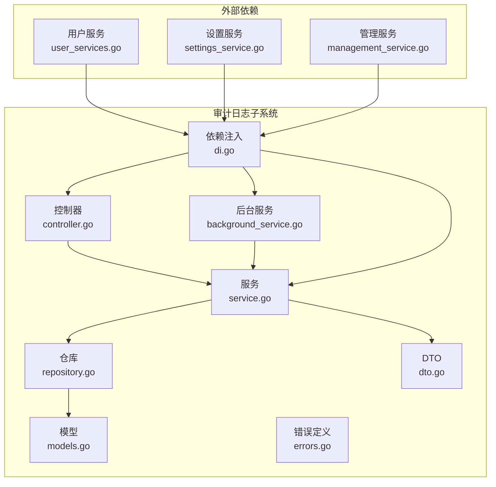
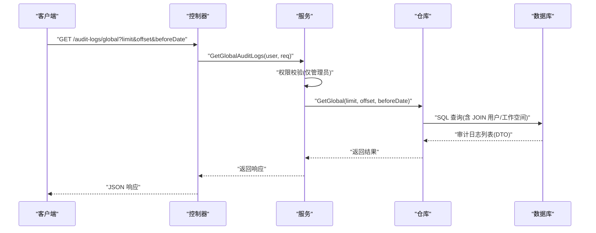
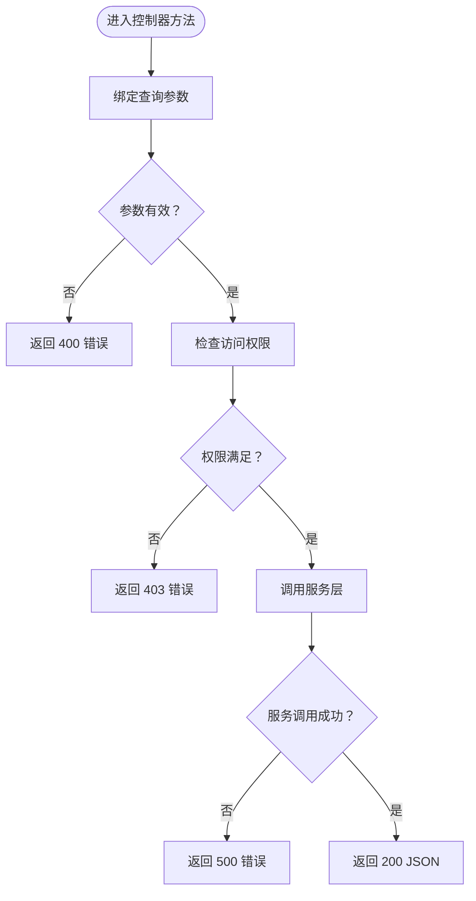
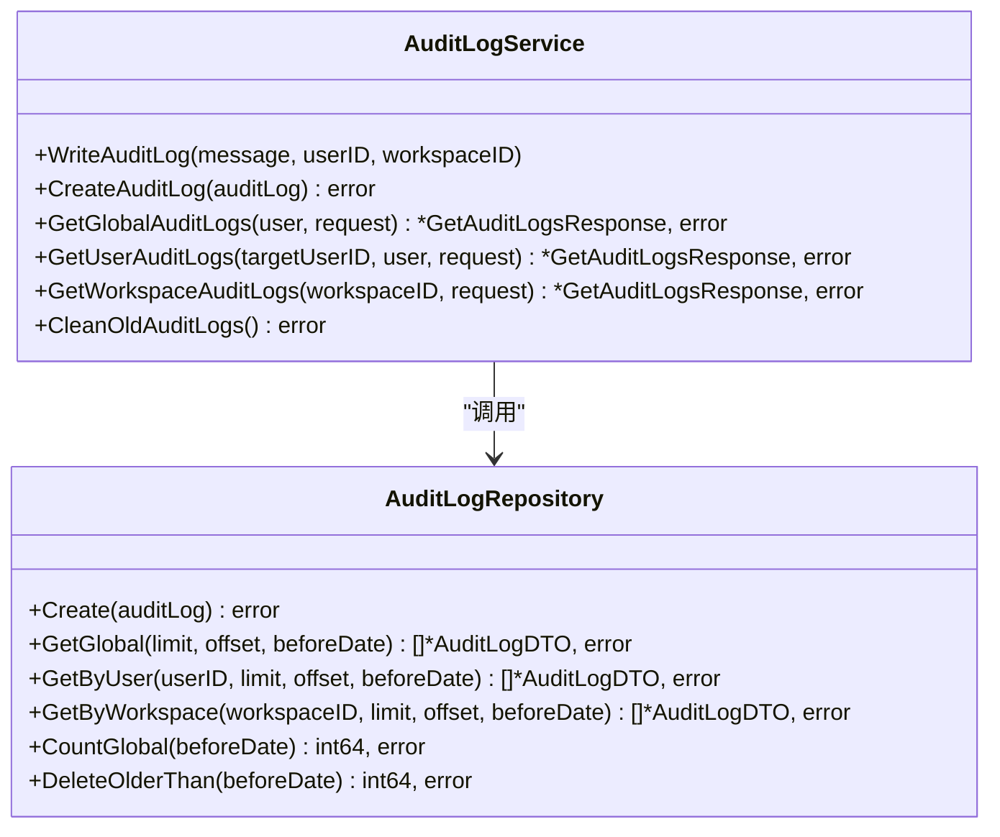
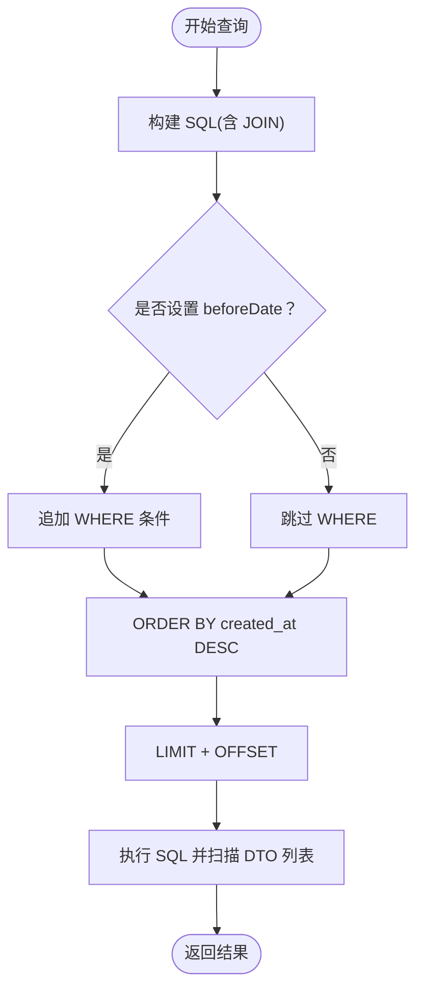
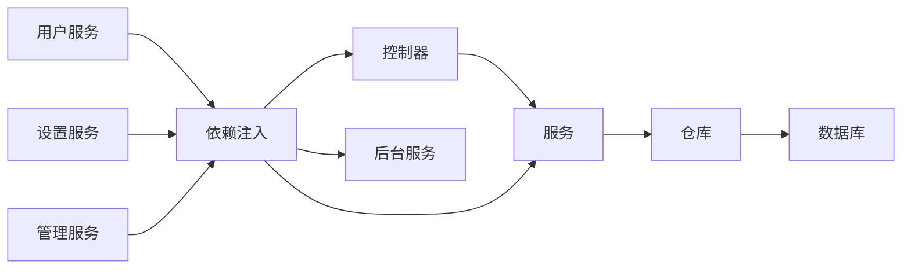

# 审计日志系统

<cite>
**本文引用的文件**
- [backend/internal/features/audit_logs/di.go](file://backend/internal/features/audit_logs/di.go)
- [backend/internal/features/audit_logs/controller.go](file://backend/internal/features/audit_logs/controller.go)
- [backend/internal/features/audit_logs/service.go](file://backend/internal/features/audit_logs/service.go)
- [backend/internal/features/audit_logs/repository.go](file://backend/internal/features/audit_logs/repository.go)
- [backend/internal/features/audit_logs/models.go](file://backend/internal/features/audit_logs/models.go)
- [backend/internal/features/audit_logs/dto.go](file://backend/internal/features/audit_logs/dto.go)
- [backend/internal/features/audit_logs/background_service.go](file://backend/internal/features/audit_logs/background_service.go)
- [backend/internal/features/audit_logs/errors.go](file://backend/internal/features/audit_logs/errors.go)
- [backend/migrations/20251031145001_add_system_audit_logs.sql](file://backend/migrations/20251031145001_add_system_audit_logs.sql)
- [backend/internal/features/users/services/user_services.go](file://backend/internal/features/users/services/user_services.go)
- [backend/internal/features/users/services/settings_service.go](file://backend/internal/features/users/services/settings_service.go)
- [backend/internal/features/users/services/management_service.go](file://backend/internal/features/users/services/management_service.go)
</cite>

## 目录
1. [简介](#简介)
2. [项目结构](#项目结构)
3. [核心组件](#核心组件)
4. [架构总览](#架构总览)
5. [详细组件分析](#详细组件分析)
6. [依赖关系分析](#依赖关系分析)
7. [性能考虑](#性能考虑)
8. [故障排查指南](#故障排查指南)
9. [结论](#结论)
10. [附录](#附录)

## 简介
本文件为 Databasus 的审计日志系统提供系统化、可操作的技术文档。内容覆盖设计理念与实现架构，包括日志采集、存储、查询、分析机制；明确审计日志的内容范围（用户操作、系统事件、配置变更、权限变更）与记录格式；解释查询与过滤能力（时间范围、用户筛选、工作空间筛选等）；介绍存储策略（数据保留期、归档机制、性能优化）；并给出审计合规最佳实践（完整性保证、防篡改、合规报告生成），以及审计日志 API 接口说明与典型应用场景。

## 项目结构
审计日志子系统位于后端模块的 features 子目录下，采用典型的分层架构：控制器（Controller）负责 HTTP 路由与参数绑定；服务（Service）封装业务逻辑与权限控制；仓库（Repository）负责数据库访问；模型（Model/DTO）定义数据结构；DI 文件集中初始化依赖并注入到其他服务；后台服务负责周期性清理过期日志；迁移脚本定义数据库表结构与索引。

图表来源
- [backend/internal/features/audit_logs/controller.go:17-23](file://backend/internal/features/audit_logs/controller.go#L17-L23)
- [backend/internal/features/audit_logs/service.go:13-16](file://backend/internal/features/audit_logs/service.go#L13-L16)
- [backend/internal/features/audit_logs/repository.go](file://backend/internal/features/audit_logs/repository.go#L11)
- [backend/internal/features/audit_logs/models.go:9-19](file://backend/internal/features/audit_logs/models.go#L9-L19)
- [backend/internal/features/audit_logs/dto.go:22-31](file://backend/internal/features/audit_logs/dto.go#L22-L31)
- [backend/internal/features/audit_logs/background_service.go:11-16](file://backend/internal/features/audit_logs/background_service.go#L11-L16)
- [backend/internal/features/audit_logs/di.go:10-25](file://backend/internal/features/audit_logs/di.go#L10-L25)
- [backend/internal/features/users/services/user_services.go](file://backend/internal/features/users/services/user_services.go)
- [backend/internal/features/users/services/settings_service.go](file://backend/internal/features/users/services/settings_service.go)
- [backend/internal/features/users/services/management_service.go](file://backend/internal/features/users/services/management_service.go)

章节来源
- [backend/internal/features/audit_logs/di.go:1-44](file://backend/internal/features/audit_logs/di.go#L1-L44)
- [backend/internal/features/audit_logs/controller.go:1-113](file://backend/internal/features/audit_logs/controller.go#L1-L113)
- [backend/internal/features/audit_logs/service.go:1-153](file://backend/internal/features/audit_logs/service.go#L1-L153)
- [backend/internal/features/audit_logs/repository.go:1-153](file://backend/internal/features/audit_logs/repository.go#L1-L153)
- [backend/internal/features/audit_logs/models.go:1-20](file://backend/internal/features/audit_logs/models.go#L1-L20)
- [backend/internal/features/audit_logs/dto.go:1-32](file://backend/internal/features/audit_logs/dto.go#L1-L32)
- [backend/internal/features/audit_logs/background_service.go:1-47](file://backend/internal/features/audit_logs/background_service.go#L1-L47)
- [backend/internal/features/audit_logs/errors.go:1-13](file://backend/internal/features/audit_logs/errors.go#L1-L13)

## 核心组件
- 控制器（AuditLogController）
  - 提供全局审计日志与指定用户的审计日志查询接口，支持分页与截止时间过滤。
  - 全局接口仅管理员可见；用户接口支持本人与管理员查看。
- 服务（AuditLogService）
  - 写入审计日志（WriteAuditLog）、按全局/用户/工作空间查询、统计总数、清理过期日志。
  - 对外暴露统一的审计日志写入入口，并在内部进行权限校验与参数规范化。
- 仓库（AuditLogRepository）
  - 基于 SQL 查询审计日志，支持 JOIN 用户与工作空间信息，返回 DTO。
  - 提供按用户、按工作空间、全局查询与计数、删除过期记录等方法。
- 模型与 DTO
  - 模型用于持久化（AuditLog），DTO 用于对外响应（AuditLogDTO），包含关联字段如用户邮箱、姓名与工作空间名称。
- 后台服务（AuditLogBackgroundService）
  - 每小时运行一次，调用服务执行清理过期日志任务。
- 错误定义
  - 全局日志访问权限错误与用户日志访问权限错误。
- 依赖注入（DI）
  - 初始化服务、控制器与后台服务，并将审计日志写入器注入到用户相关服务（用户、设置、管理）。

章节来源
- [backend/internal/features/audit_logs/controller.go:13-23](file://backend/internal/features/audit_logs/controller.go#L13-L23)
- [backend/internal/features/audit_logs/service.go:13-16](file://backend/internal/features/audit_logs/service.go#L13-L16)
- [backend/internal/features/audit_logs/repository.go](file://backend/internal/features/audit_logs/repository.go#L11)
- [backend/internal/features/audit_logs/models.go:9-19](file://backend/internal/features/audit_logs/models.go#L9-L19)
- [backend/internal/features/audit_logs/dto.go:22-31](file://backend/internal/features/audit_logs/dto.go#L22-L31)
- [backend/internal/features/audit_logs/background_service.go:11-16](file://backend/internal/features/audit_logs/background_service.go#L11-L16)
- [backend/internal/features/audit_logs/errors.go:5-12](file://backend/internal/features/audit_logs/errors.go#L5-L12)
- [backend/internal/features/audit_logs/di.go:10-25](file://backend/internal/features/audit_logs/di.go#L10-L25)

## 架构总览
审计日志系统遵循清晰的分层与职责分离原则：
- 表层：HTTP 控制器接收请求，绑定查询参数，调用服务。
- 业务层：服务进行权限校验、参数规范化、调用仓库查询或写入。
- 数据访问层：仓库封装 SQL 查询与更新，返回 DTO 列表或影响行数。
- 外部集成：通过 DI 将审计日志写入器注入到用户相关服务，确保关键操作自动落库。
- 运维层：后台服务定时清理过期日志，保障存储容量与性能。

图表来源
- [backend/internal/features/audit_logs/controller.go:39-63](file://backend/internal/features/audit_logs/controller.go#L39-L63)
- [backend/internal/features/audit_logs/service.go:41-72](file://backend/internal/features/audit_logs/service.go#L41-L72)
- [backend/internal/features/audit_logs/repository.go:21-54](file://backend/internal/features/audit_logs/repository.go#L21-L54)

## 详细组件分析

### 控制器（路由与权限）
- 全局审计日志接口：仅管理员可访问，支持 limit、offset、beforeDate 参数。
- 用户审计日志接口：普通用户仅能查看自身日志，管理员可查看任意用户日志。
- 参数绑定与错误处理：对无效参数返回 400，权限不足返回 403，内部错误返回 500。

图表来源
- [backend/internal/features/audit_logs/controller.go:39-112](file://backend/internal/features/audit_logs/controller.go#L39-L112)

章节来源
- [backend/internal/features/audit_logs/controller.go:17-112](file://backend/internal/features/audit_logs/controller.go#L17-L112)

### 服务（业务逻辑与权限）
- 写入审计日志：统一入口，自动填充 ID 与 UTC 时间，异常时记录日志但不中断流程。
- 查询与统计：
  - 全局：限制最大 limit，支持截止时间过滤。
  - 用户：支持本人与管理员查看，限制最大 limit。
  - 工作空间：支持按工作空间查询，限制最大 limit。
- 清理过期日志：默认保留一年，到期自动删除并记录日志。

图表来源
- [backend/internal/features/audit_logs/service.go:13-16](file://backend/internal/features/audit_logs/service.go#L13-L16)
- [backend/internal/features/audit_logs/repository.go](file://backend/internal/features/audit_logs/repository.go#L11)

章节来源
- [backend/internal/features/audit_logs/service.go:18-152](file://backend/internal/features/audit_logs/service.go#L18-L152)

### 仓库（数据访问）
- SQL 查询：统一使用 LEFT JOIN 获取用户与工作空间信息，返回 DTO。
- 分页与过滤：支持 limit、offset、beforeDate 截止时间过滤。
- 统计与删除：提供全局计数与按截止时间删除旧记录。

图表来源
- [backend/internal/features/audit_logs/repository.go:21-128](file://backend/internal/features/audit_logs/repository.go#L21-L128)

章节来源
- [backend/internal/features/audit_logs/repository.go:13-152](file://backend/internal/features/audit_logs/repository.go#L13-L152)

### 模型与 DTO
- 模型（AuditLog）：持久化实体，包含主键、用户与工作空间外键、消息体与创建时间。
- DTO（AuditLogDTO）：对外响应结构，包含关联的用户邮箱、姓名与工作空间名称，便于前端展示。

章节来源
- [backend/internal/features/audit_logs/models.go:9-19](file://backend/internal/features/audit_logs/models.go#L9-L19)
- [backend/internal/features/audit_logs/dto.go:22-31](file://backend/internal/features/audit_logs/dto.go#L22-L31)

### 后台服务（定期清理）
- 每小时触发一次，调用服务执行清理过期日志任务。
- 若删除发生，记录 Info 日志；若失败，记录 Error 日志。

章节来源
- [backend/internal/features/audit_logs/background_service.go:18-46](file://backend/internal/features/audit_logs/background_service.go#L18-L46)

### 依赖注入与外部集成
- DI 初始化审计日志服务、控制器与后台服务，并将审计日志写入器注入到用户、设置、管理服务，确保关键操作自动记录。

章节来源
- [backend/internal/features/audit_logs/di.go:10-25](file://backend/internal/features/audit_logs/di.go#L10-L25)
- [backend/internal/features/audit_logs/di.go:39-43](file://backend/internal/features/audit_logs/di.go#L39-L43)

## 依赖关系分析
- 组件耦合度：控制器依赖服务，服务依赖仓库，仓库依赖数据库；耦合清晰，职责单一。
- 外部依赖：用户相关服务通过 DI 注入审计日志写入器，形成横切关注点，避免重复代码。
- 数据库依赖：仓库直接使用存储层访问数据库，SQL 查询与索引设计支撑高效查询。

图表来源
- [backend/internal/features/audit_logs/di.go:10-25](file://backend/internal/features/audit_logs/di.go#L10-L25)
- [backend/internal/features/audit_logs/controller.go:17-23](file://backend/internal/features/audit_logs/controller.go#L17-L23)
- [backend/internal/features/audit_logs/service.go:13-16](file://backend/internal/features/audit_logs/service.go#L13-L16)
- [backend/internal/features/audit_logs/repository.go](file://backend/internal/features/audit_logs/repository.go#L11)

章节来源
- [backend/internal/features/audit_logs/di.go:1-44](file://backend/internal/features/audit_logs/di.go#L1-L44)
- [backend/internal/features/audit_logs/controller.go:1-113](file://backend/internal/features/audit_logs/controller.go#L1-L113)
- [backend/internal/features/audit_logs/service.go:1-153](file://backend/internal/features/audit_logs/service.go#L1-L153)
- [backend/internal/features/audit_logs/repository.go:1-153](file://backend/internal/features/audit_logs/repository.go#L1-L153)

## 性能考虑
- 查询性能
  - 索引：审计日志表已建立 user_id、workspace_id、created_at 索引，有利于按用户、工作空间与时间排序查询。
  - SQL 设计：JOIN 用户与工作空间信息，减少多次往返；使用 LIMIT/OFFSET 实现分页。
- 写入性能
  - 写入路径简单，单条插入，建议在高并发场景结合批量写入策略（当前未实现批量写入）。
- 存储与清理
  - 默认保留一年，每小时清理一次，避免历史数据无限增长。
- 建议
  - 引入只读副本或物化视图以减轻主库压力。
  - 对高频查询增加缓存层（如 Redis）以降低数据库负载。
  - 在大数据量场景下，考虑分区表或冷热分离策略。

章节来源
- [backend/migrations/20251031145001_add_system_audit_logs.sql:20-23](file://backend/migrations/20251031145001_add_system_audit_logs.sql#L20-L23)
- [backend/internal/features/audit_logs/background_service.go:29-41](file://backend/internal/features/audit_logs/background_service.go#L29-L41)
- [backend/internal/features/audit_logs/service.go:138-152](file://backend/internal/features/audit_logs/service.go#L138-L152)

## 故障排查指南
- 常见错误
  - 访问全局审计日志被拒绝：仅管理员可访问。
  - 查看他人日志被拒绝：非管理员只能查看自身日志。
  - 查询参数无效：检查 limit、offset、beforeDate 是否符合要求。
  - 写入失败：服务会记录错误日志，检查数据库连接与表结构。
- 排查步骤
  - 确认用户角色与权限。
  - 检查 beforeDate 格式（RFC3339）与取值范围。
  - 查看后台服务日志，确认清理任务是否正常执行。
  - 检查数据库索引是否存在，必要时重建索引。

章节来源
- [backend/internal/features/audit_logs/errors.go:5-12](file://backend/internal/features/audit_logs/errors.go#L5-L12)
- [backend/internal/features/audit_logs/controller.go:47-62](file://backend/internal/features/audit_logs/controller.go#L47-L62)
- [backend/internal/features/audit_logs/service.go:41-107](file://backend/internal/features/audit_logs/service.go#L41-L107)
- [backend/internal/features/audit_logs/background_service.go:34-41](file://backend/internal/features/audit_logs/background_service.go#L34-L41)

## 结论
Databasus 的审计日志系统以清晰的分层架构实现了日志采集、存储、查询与清理的完整闭环。通过 DI 将审计日志写入器集成到用户相关服务，确保关键操作可追溯；通过合理的索引与 SQL 设计，满足常见查询场景；通过后台服务实现自动化清理，保障长期稳定运行。建议在高并发与海量数据场景下引入缓存与分区策略，进一步提升性能与可维护性。

## 附录

### 审计日志内容范围与记录格式
- 内容范围
  - 用户操作：用户登录、修改密码、更新资料等。
  - 系统事件：系统启动、版本升级、健康检查等。
  - 配置变更：工作空间配置、备份策略、通知配置等。
  - 权限变更：成员加入/移除、角色调整等。
- 记录格式
  - 字段：日志 ID、用户 ID、工作空间 ID、消息体、创建时间；响应 DTO 包含用户邮箱、用户名、工作空间名称等关联信息。

章节来源
- [backend/internal/features/audit_logs/models.go:9-19](file://backend/internal/features/audit_logs/models.go#L9-L19)
- [backend/internal/features/audit_logs/dto.go:22-31](file://backend/internal/features/audit_logs/dto.go#L22-L31)

### 查询与过滤功能
- 支持的查询维度
  - 全局：按时间截止点过滤，分页显示。
  - 用户：按用户 ID 过滤，分页显示。
  - 工作空间：按工作空间 ID 过滤，分页显示。
- 查询参数
  - limit：每页数量，默认 100，最大 1000。
  - offset：偏移量，默认 0。
  - beforeDate：截止时间（RFC3339），用于过滤更早的日志。

章节来源
- [backend/internal/features/audit_logs/dto.go:9-13](file://backend/internal/features/audit_logs/dto.go#L9-L13)
- [backend/internal/features/audit_logs/service.go:41-136](file://backend/internal/features/audit_logs/service.go#L41-L136)
- [backend/internal/features/audit_logs/repository.go:21-128](file://backend/internal/features/audit_logs/repository.go#L21-L128)

### 存储策略
- 表结构与索引
  - 审计日志表包含主键、用户与工作空间外键、消息体与创建时间；已建立 user_id、workspace_id、created_at 索引。
- 数据保留期
  - 默认保留一年，到期自动清理。
- 归档机制
  - 当前未实现专用归档接口，建议后续引入按月/季度归档与压缩策略。
- 性能优化
  - 使用索引与分页；在高负载场景下引入只读副本与缓存。

章节来源
- [backend/migrations/20251031145001_add_system_audit_logs.sql:4-23](file://backend/migrations/20251031145001_add_system_audit_logs.sql#L4-L23)
- [backend/internal/features/audit_logs/service.go:138-152](file://backend/internal/features/audit_logs/service.go#L138-L152)

### 审计合规最佳实践
- 完整性保证
  - 使用只读数据库账号与审计日志专用账号，避免写入与删除权限滥用。
  - 对关键日志表启用数据库级审计（如审计日志表的 DDL/DML 审计）。
- 防篡改机制
  - 采用数字签名或哈希链对日志进行完整性校验；在传输与存储阶段启用 TLS。
  - 限制日志表的访问范围，仅授权人员可读取。
- 合规报告
  - 定期导出审计日志并生成合规报告，保留至少一年以上。
  - 对敏感操作（如权限变更、配置修改）单独标记并纳入专项报告。

### 审计日志 API 接口说明
- 全局审计日志
  - 方法：GET
  - 路径：/audit-logs/global
  - 权限：管理员
  - 查询参数：limit、offset、beforeDate
  - 返回：审计日志列表、总数、分页参数
- 用户审计日志
  - 方法：GET
  - 路径：/audit-logs/users/{userId}
  - 权限：本人或管理员
  - 查询参数：limit、offset、beforeDate
  - 返回：审计日志列表、总数、分页参数

章节来源
- [backend/internal/features/audit_logs/controller.go:17-23](file://backend/internal/features/audit_logs/controller.go#L17-L23)
- [backend/internal/features/audit_logs/controller.go:39-63](file://backend/internal/features/audit_logs/controller.go#L39-L63)
- [backend/internal/features/audit_logs/controller.go:81-112](file://backend/internal/features/audit_logs/controller.go#L81-L112)

### 实际应用场景
- 安全审计
  - 追踪管理员操作与敏感配置变更，生成合规报告。
- 运维排障
  - 通过用户维度日志快速定位问题来源，结合时间截断缩小排查范围。
- 合规检查
  - 面向监管要求提供日志导出与证据链证明，确保不可抵赖性。