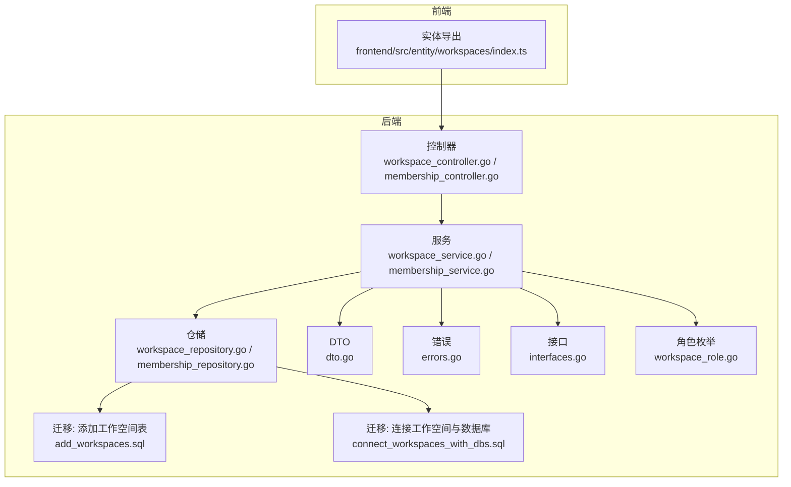
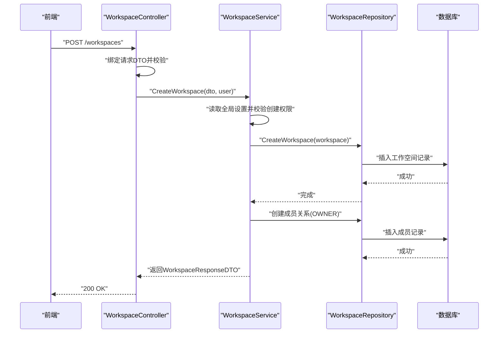
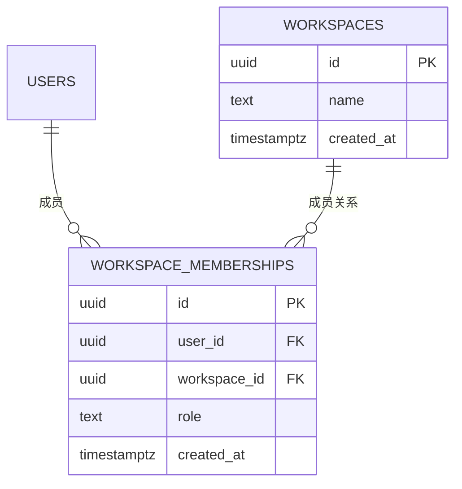
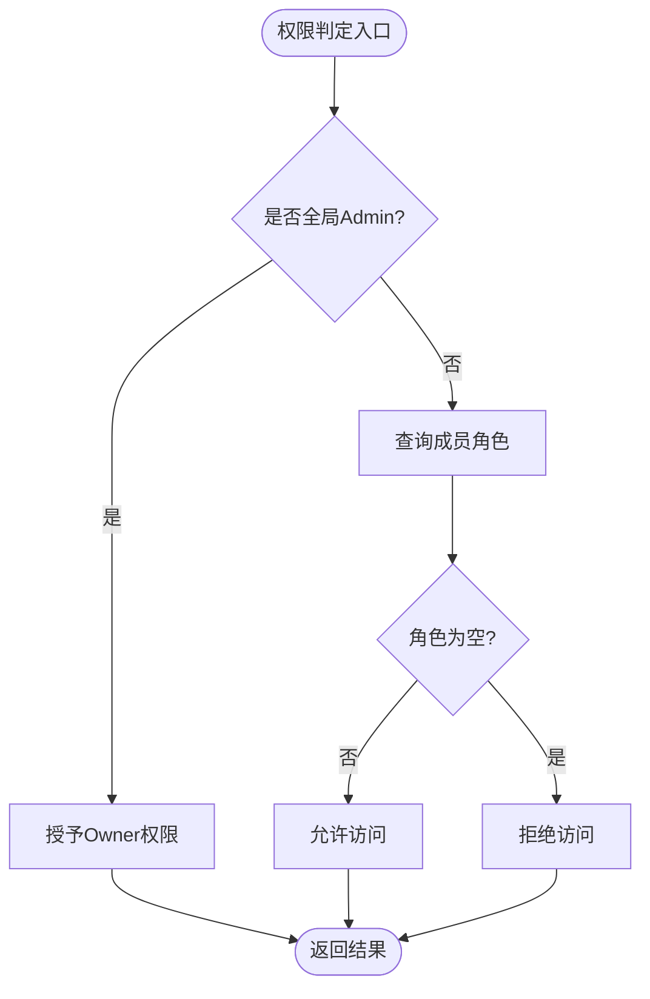
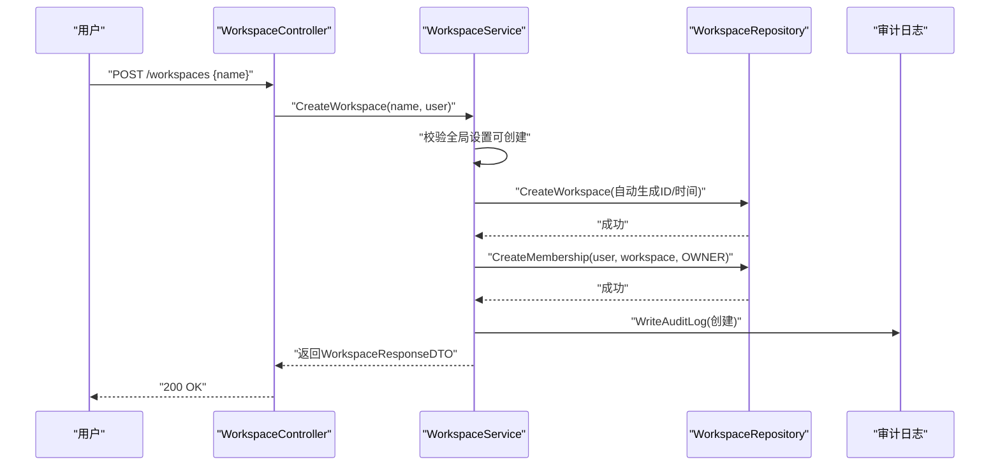
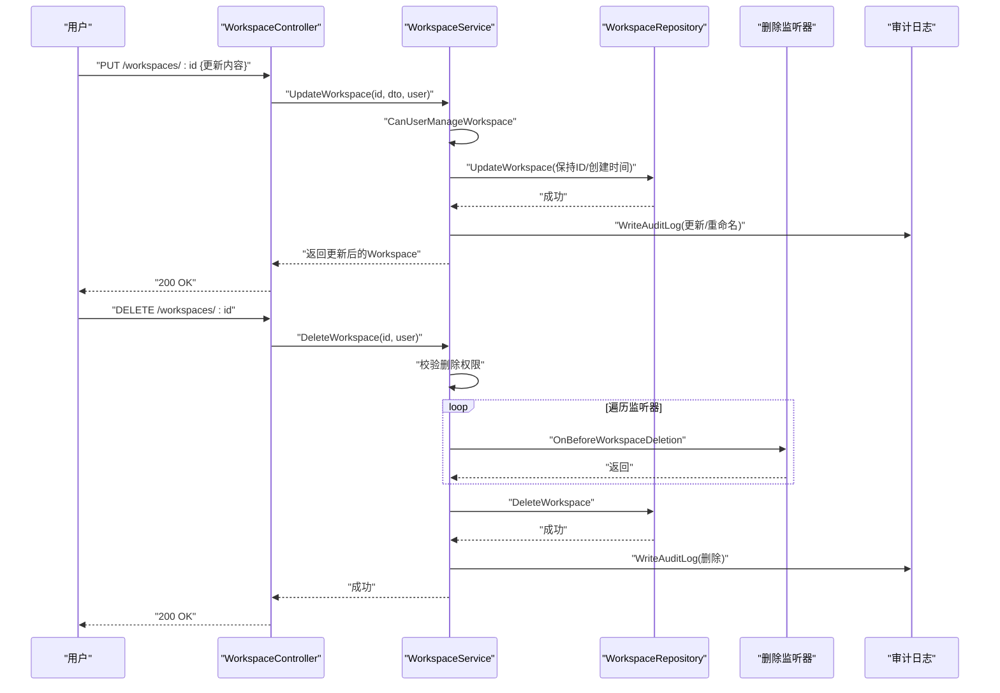
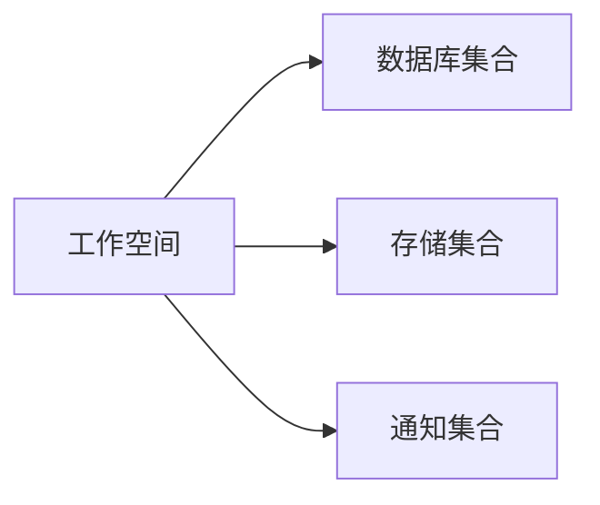
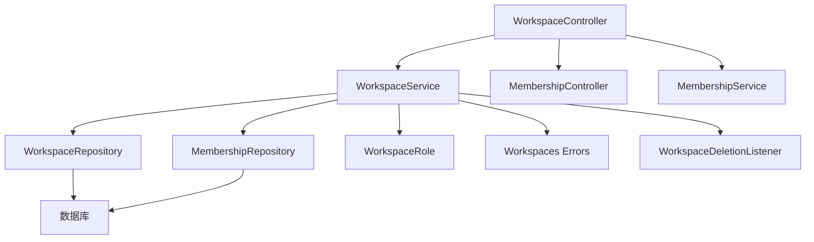

# 工作空间管理

<cite>
**本文引用的文件**
- [dto.go](file://backend/internal/features/workspaces/dto/dto.go)
- [workspace_controller.go](file://backend/internal/features/workspaces/controllers/workspace_controller.go)
- [membership_controller.go](file://backend/internal/features/workspaces/controllers/membership_controller.go)
- [workspace_service.go](file://backend/internal/features/workspaces/services/workspace_service.go)
- [membership_service.go](file://backend/internal/features/workspaces/services/membership_service.go)
- [workspace_repository.go](file://backend/internal/features/workspaces/repositories/workspace_repository.go)
- [membership_repository.go](file://backend/internal/features/workspaces/repositories/membership_repository.go)
- [interfaces.go](file://backend/internal/features/workspaces/interfaces/interfaces.go)
- [errors.go](file://backend/internal/features/workspaces/errors/errors.go)
- [workspace_role.go](file://backend/internal/features/users/enums/workspace_role.go)
- [di.go](file://backend/internal/features/workspaces/controllers/di.go)
- [add_workspaces.sql](file://backend/migrations/20251031155004_add_workspaces.sql)
- [connect_workspaces_with_dbs.sql](file://backend/migrations/20251031155005_connect_workspaces_with_dbs.sql)
- [index.ts](file://frontend/src/entity/workspaces/index.ts)
</cite>

## 目录
1. [简介](#简介)
2. [项目结构](#项目结构)
3. [核心组件](#核心组件)
4. [架构总览](#架构总览)
5. [详细组件分析](#详细组件分析)
6. [依赖关系分析](#依赖关系分析)
7. [性能考量](#性能考量)
8. [故障排查指南](#故障排查指南)
9. [结论](#结论)
10. [附录](#附录)

## 简介
本文件系统性阐述 Databasus 的工作空间（Workspace）管理能力，覆盖以下主题：
- 工作空间的概念与作用域边界：以数据库为中心的资源隔离单元，成员按角色拥有不同权限。
- 创建流程：创建条件、默认配置、初始化设置。
- 生命周期管理：更新、删除、权限继承规则。
- 关系映射：工作空间与数据库、存储、通知等资源的关联。
- 最佳实践：命名规范、资源配置原则、安全策略。
- API 接口：端点、请求/响应结构、鉴权与错误处理。

## 项目结构
后端采用分层与特性模块化组织，工作空间相关代码位于 backend/internal/features/workspaces 下，包含控制器、服务、仓储、DTO、错误与接口定义；数据库迁移脚本在 backend/migrations 中；前端实体导出位于 frontend/src/entity/workspaces。

图表来源
- [workspace_controller.go:1-269](file://backend/internal/features/workspaces/controllers/workspace_controller.go#L1-L269)
- [membership_controller.go](file://backend/internal/features/workspaces/controllers/membership_controller.go)
- [workspace_service.go:1-325](file://backend/internal/features/workspaces/services/workspace_service.go#L1-L325)
- [membership_service.go](file://backend/internal/features/workspaces/services/membership_service.go)
- [workspace_repository.go:1-53](file://backend/internal/features/workspaces/repositories/workspace_repository.go#L1-L53)
- [membership_repository.go](file://backend/internal/features/workspaces/repositories/membership_repository.go)
- [dto.go:1-66](file://backend/internal/features/workspaces/dto/dto.go#L1-L66)
- [errors.go:1-57](file://backend/internal/features/workspaces/errors/errors.go#L1-L57)
- [interfaces.go:1-12](file://backend/internal/features/workspaces/interfaces/interfaces.go#L1-L12)
- [workspace_role.go:1-21](file://backend/internal/features/users/enums/workspace_role.go#L1-L21)
- [add_workspaces.sql:1-60](file://backend/migrations/20251031155004_add_workspaces.sql#L1-L60)
- [connect_workspaces_with_dbs.sql:1-57](file://backend/migrations/20251031155005_connect_workspaces_with_dbs.sql#L1-L57)
- [index.ts:1-18](file://frontend/src/entity/workspaces/index.ts#L1-L18)

章节来源
- [workspace_controller.go:1-269](file://backend/internal/features/workspaces/controllers/workspace_controller.go#L1-L269)
- [workspace_service.go:1-325](file://backend/internal/features/workspaces/services/workspace_service.go#L1-L325)
- [workspace_repository.go:1-53](file://backend/internal/features/workspaces/repositories/workspace_repository.go#L1-L53)
- [dto.go:1-66](file://backend/internal/features/workspaces/dto/dto.go#L1-L66)
- [errors.go:1-57](file://backend/internal/features/workspaces/errors/errors.go#L1-L57)
- [workspace_role.go:1-21](file://backend/internal/features/users/enums/workspace_role.go#L1-L21)
- [add_workspaces.sql:1-60](file://backend/migrations/20251031155004_add_workspaces.sql#L1-L60)
- [connect_workspaces_with_dbs.sql:1-57](file://backend/migrations/20251031155005_connect_workspaces_with_dbs.sql#L1-L57)
- [index.ts:1-18](file://frontend/src/entity/workspaces/index.ts#L1-L18)

## 核心组件
- 控制器层：负责路由注册与请求校验，调用服务层执行业务逻辑，并返回标准化响应。
- 服务层：实现权限判定、工作空间与成员管理、审计日志写入、删除前监听器回调。
- 仓储层：封装数据库访问，基于 GORM 对工作空间与成员关系进行 CRUD。
- DTO 层：定义请求/响应数据结构，含工作空间与成员相关字段及校验约束。
- 错误与接口：统一错误码与删除前监听器接口，便于扩展。
- 角色枚举：定义 WORKSPACE_OWNER/ADMIN/MEMBER/VIEWER 四种角色及其有效性校验。

章节来源
- [workspace_controller.go:18-31](file://backend/internal/features/workspaces/controllers/workspace_controller.go#L18-L31)
- [workspace_service.go:20-27](file://backend/internal/features/workspaces/services/workspace_service.go#L20-L27)
- [workspace_repository.go:12-24](file://backend/internal/features/workspaces/repositories/workspace_repository.go#L12-L24)
- [dto.go:18-65](file://backend/internal/features/workspaces/dto/dto.go#L18-L65)
- [errors.go:5-56](file://backend/internal/features/workspaces/errors/errors.go#L5-L56)
- [workspace_role.go:3-20](file://backend/internal/features/users/enums/workspace_role.go#L3-L20)

## 架构总览
工作空间管理遵循典型的 MVC 分层与领域驱动设计：
- 控制器接收请求并绑定 DTO，进行基础参数校验。
- 服务层执行业务规则与权限检查，协调仓储与外部服务（如审计日志）。
- 仓储层通过数据库迁移脚本建立工作空间与成员关系的持久化结构。
- 前端通过实体导出对接后端 API。

图表来源
- [workspace_controller.go:46-71](file://backend/internal/features/workspaces/controllers/workspace_controller.go#L46-L71)
- [workspace_service.go:35-82](file://backend/internal/features/workspaces/services/workspace_service.go#L35-L82)
- [workspace_repository.go:14-24](file://backend/internal/features/workspaces/repositories/workspace_repository.go#L14-L24)

## 详细组件分析

### 工作空间模型与数据流
- 工作空间模型包含标识、名称与创建时间；成员关系模型包含用户、工作空间与角色、创建时间。
- 数据库层面通过迁移脚本创建工作空间表与成员关系表，并建立外键与唯一索引，确保成员唯一性与级联删除。

图表来源
- [add_workspaces.sql:4-38](file://backend/migrations/20251031155004_add_workspaces.sql#L4-L38)
- [connect_workspaces_with_dbs.sql:4-36](file://backend/migrations/20251031155005_connect_workspaces_with_dbs.sql#L4-L36)

章节来源
- [add_workspaces.sql:1-60](file://backend/migrations/20251031155004_add_workspaces.sql#L1-L60)
- [connect_workspaces_with_dbs.sql:1-57](file://backend/migrations/20251031155005_connect_workspaces_with_dbs.sql#L1-L57)

### 权限模型与继承规则
- 角色层级：WORKSPACE_OWNER > WORKSPACE_ADMIN > WORKSPACE_MEMBER > WORKSPACE_VIEWER。
- 超级管理员（Admin）对所有工作空间具有 OWNER 权限。
- 成员管理权限：仅 OWNER 或 ADMIN 可变更成员角色；OWNER 可添加/移除 ADMIN，但 ADMIN 不能相互变更角色或移除 OWNER。
- 删除限制：仅 OWNER 或 Admin 可删除工作空间；删除前触发删除监听器回调。

图表来源
- [workspace_service.go:201-216](file://backend/internal/features/workspaces/services/workspace_service.go#L201-L216)
- [workspace_role.go:5-10](file://backend/internal/features/users/enums/workspace_role.go#L5-L10)

章节来源
- [workspace_service.go:201-298](file://backend/internal/features/workspaces/services/workspace_service.go#L201-L298)
- [workspace_role.go:1-21](file://backend/internal/features/users/enums/workspace_role.go#L1-L21)

### 创建流程与初始化
- 创建条件：调用方需具备创建工作空间的全局设置许可；否则返回“权限不足”。
- 默认配置：创建时生成唯一 ID 与 UTC 时间戳；自动成为创建者为 OWNER。
- 初始化设置：同时创建一条成员关系记录，角色为 OWNER。

图表来源
- [workspace_controller.go:46-71](file://backend/internal/features/workspaces/controllers/workspace_controller.go#L46-L71)
- [workspace_service.go:35-82](file://backend/internal/features/workspaces/services/workspace_service.go#L35-L82)
- [workspace_repository.go:14-24](file://backend/internal/features/workspaces/repositories/workspace_repository.go#L14-L24)

章节来源
- [workspace_controller.go:33-71](file://backend/internal/features/workspaces/controllers/workspace_controller.go#L33-L71)
- [workspace_service.go:35-82](file://backend/internal/features/workspaces/services/workspace_service.go#L35-L82)

### 生命周期管理：更新、删除与审计
- 更新：仅 OWNER 或 ADMIN 可更新；保留原 ID 与创建时间；重命名会写入审计日志。
- 删除：仅 OWNER 或 Admin 可删除；删除前依次调用删除监听器；成功后写入审计日志。
- 审计：所有变更均通过审计日志服务记录，支持按工作空间查询。

图表来源
- [workspace_controller.go:137-219](file://backend/internal/features/workspaces/controllers/workspace_controller.go#L137-L219)
- [workspace_service.go:112-192](file://backend/internal/features/workspaces/services/workspace_service.go#L112-L192)
- [interfaces.go:5-7](file://backend/internal/features/workspaces/interfaces/interfaces.go#L5-L7)

章节来源
- [workspace_controller.go:137-219](file://backend/internal/features/workspaces/controllers/workspace_controller.go#L137-L219)
- [workspace_service.go:112-192](file://backend/internal/features/workspaces/services/workspace_service.go#L112-L192)
- [interfaces.go:1-12](file://backend/internal/features/workspaces/interfaces/interfaces.go#L1-L12)

### 与数据库、存储、通知的关系映射
- 数据库：迁移脚本将 databases 表的 user_id 替换为 workspace_id，并建立外键约束，实现数据库资源归属工作空间。
- 存储与通知：迁移脚本中存在针对 storages 与 notifiers 的约束，表明工作空间同样作用于这些资源的作用域边界（具体实现由对应模块承担）。

图表来源
- [connect_workspaces_with_dbs.sql:4-36](file://backend/migrations/20251031155005_connect_workspaces_with_dbs.sql#L4-L36)
- [add_workspaces.sql:18-38](file://backend/migrations/20251031155004_add_workspaces.sql#L18-L38)

章节来源
- [connect_workspaces_with_dbs.sql:1-57](file://backend/migrations/20251031155005_connect_workspaces_with_dbs.sql#L1-L57)
- [add_workspaces.sql:1-60](file://backend/migrations/20251031155004_add_workspaces.sql#L1-L60)

### API 接口定义与使用示例
- 路由注册：控制器在路由组 /workspaces 下注册创建、列表、详情、更新、删除与审计日志查询接口。
- 认证与授权：所有接口均依赖 BearerAuth；控制器从上下文提取用户信息并传递给服务层进行权限判定。
- 请求/响应结构：使用 DTO 定义请求体与响应体，包含工作空间基本信息与成员信息。
- 查询参数：审计日志接口支持 limit、offset、beforeDate 等分页与过滤参数。

章节来源
- [workspace_controller.go:22-31](file://backend/internal/features/workspaces/controllers/workspace_controller.go#L22-L31)
- [workspace_controller.go:33-268](file://backend/internal/features/workspaces/controllers/workspace_controller.go#L33-L268)
- [dto.go:18-65](file://backend/internal/features/workspaces/dto/dto.go#L18-L65)
- [index.ts:1-18](file://frontend/src/entity/workspaces/index.ts#L1-L18)

## 依赖关系分析
- 控制器依赖服务层；服务层依赖仓储层、用户服务、审计日志服务与设置服务；仓储层依赖数据库存储。
- 角色枚举被服务层用于权限判定；错误常量集中定义，便于统一处理。
- DI 模块通过工厂函数注入服务实例到控制器。

图表来源
- [workspace_controller.go:18-21](file://backend/internal/features/workspaces/controllers/workspace_controller.go#L18-L21)
- [membership_controller.go](file://backend/internal/features/workspaces/controllers/membership_controller.go)
- [workspace_service.go:20-27](file://backend/internal/features/workspaces/services/workspace_service.go#L20-L27)
- [membership_service.go](file://backend/internal/features/workspaces/services/membership_service.go)
- [workspace_repository.go:12-24](file://backend/internal/features/workspaces/repositories/workspace_repository.go#L12-L24)
- [membership_repository.go](file://backend/internal/features/workspaces/repositories/membership_repository.go)
- [workspace_role.go:3-20](file://backend/internal/features/users/enums/workspace_role.go#L3-L20)
- [errors.go:5-56](file://backend/internal/features/workspaces/errors/errors.go#L5-L56)
- [interfaces.go:5-7](file://backend/internal/features/workspaces/interfaces/interfaces.go#L5-L7)

章节来源
- [di.go:1-22](file://backend/internal/features/workspaces/controllers/di.go#L1-L22)
- [workspace_service.go:1-325](file://backend/internal/features/workspaces/services/workspace_service.go#L1-L325)

## 性能考量
- 索引优化：工作空间与成员关系表均建立复合索引，提升查询效率（如按用户/工作空间维度检索）。
- 批量操作：建议在批量导入成员或迁移历史数据时使用事务与批量插入，减少往返次数。
- 缓存策略：对常用查询（如用户所属工作空间列表）可引入缓存，降低数据库压力。
- 审计日志：审计写入应异步化或批量化，避免阻塞主流程。

## 故障排查指南
- 权限相关错误
  - 创建失败：检查全局设置是否允许创建；确认用户角色与权限。
  - 查看/更新/删除失败：确认当前用户在目标工作空间的角色是否满足要求。
- 成员管理异常
  - 无法邀请/变更角色：确认当前用户是否为 OWNER 或 ADMIN；避免修改自身角色或 OWNER 角色。
  - 无法移除 OWNER：需先转移所有权。
- 删除失败
  - 仅 OWNER 或 Admin 可删除；若存在删除监听器，需确保其回调未返回错误。
- 审计日志查询
  - 确认查询参数格式正确；检查用户对目标工作空间的访问权限。

章节来源
- [errors.go:5-56](file://backend/internal/features/workspaces/errors/errors.go#L5-L56)
- [workspace_service.go:158-192](file://backend/internal/features/workspaces/services/workspace_service.go#L158-L192)

## 结论
Databasus 的工作空间管理以清晰的权限模型与数据结构为基础，通过控制器-服务-仓储三层解耦实现了稳定的创建、更新、删除与审计能力。配合数据库迁移脚本，工作空间成为数据库、存储与通知等资源的统一作用域边界，便于精细化权限控制与资源隔离。建议在生产环境中结合缓存与异步审计策略进一步提升性能与稳定性。

## 附录
- 命名规范
  - 工作空间名称长度限制为 1~255 字符；建议使用语义明确、可区分的名称。
- 资源配置原则
  - 将相关数据库、存储与通知资源归属至同一工作空间，便于统一管理与审计。
- 安全策略
  - 严格限制 OWNER 与 ADMIN 的变更范围；启用审计日志并定期审查；对删除操作增加二次确认与监听器校验。