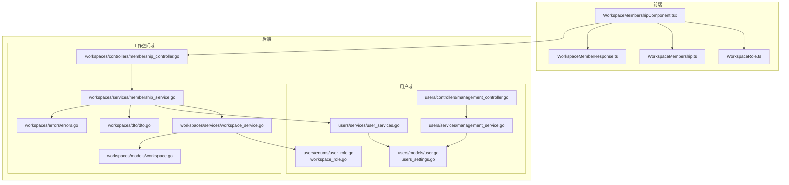
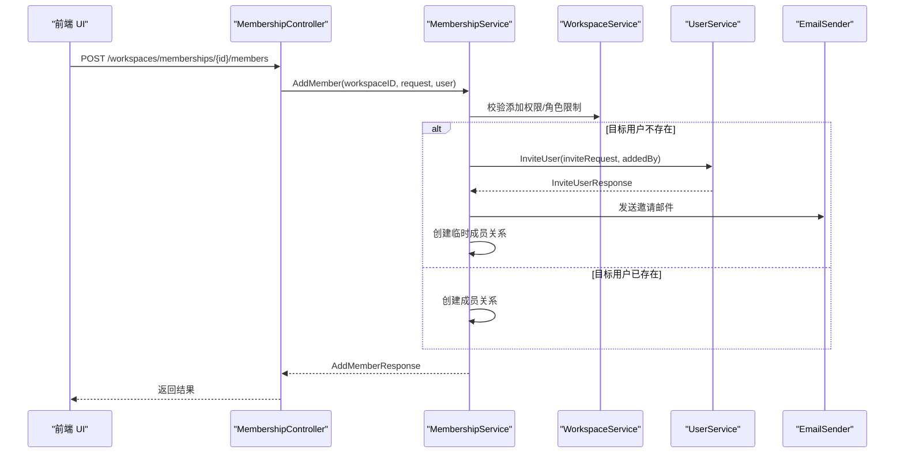
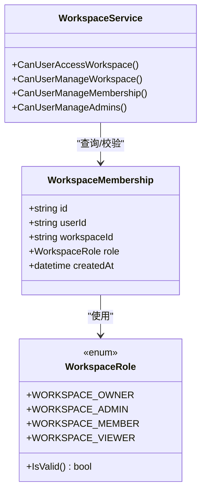
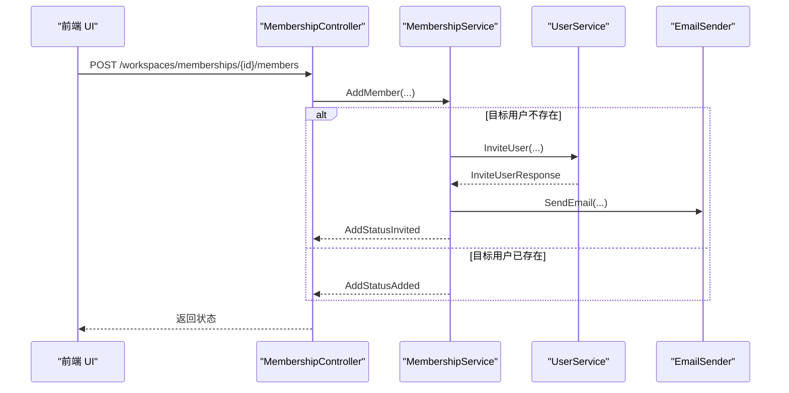
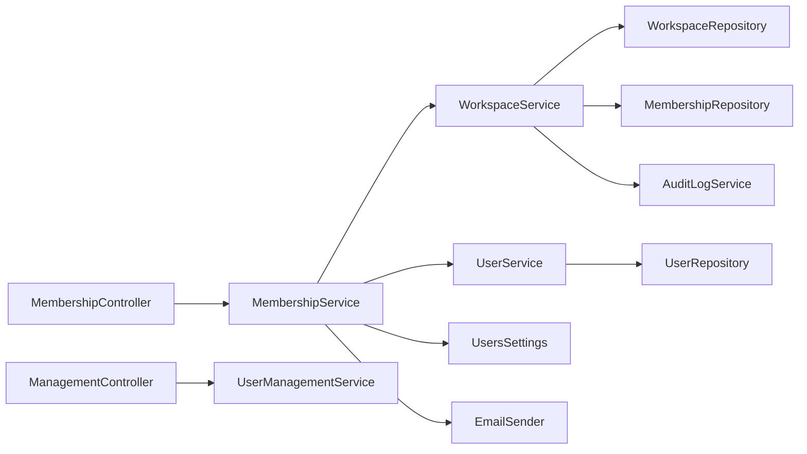

# 成员管理

<cite>
**本文引用的文件**
- [backend/internal/features/users/models/user.go](file://backend/internal/features/users/models/user.go)
- [backend/internal/features/users/enums/workspace_role.go](file://backend/internal/features/users/enums/workspace_role.go)
- [backend/internal/features/users/enums/user_role.go](file://backend/internal/features/users/enums/user_role.go)
- [backend/internal/features/users/models/users_settings.go](file://backend/internal/features/users/models/users_settings.go)
- [backend/internal/features/users/controllers/management_controller.go](file://backend/internal/features/users/controllers/management_controller.go)
- [backend/internal/features/users/services/management_service.go](file://backend/internal/features/users/services/management_service.go)
- [backend/internal/features/users/services/user_services.go](file://backend/internal/features/users/services/user_services.go)
- [backend/internal/features/workspaces/models/workspace.go](file://backend/internal/features/workspaces/models/workspace.go)
- [backend/internal/features/workspaces/controllers/membership_controller.go](file://backend/internal/features/workspaces/controllers/membership_controller.go)
- [backend/internal/features/workspaces/services/membership_service.go](file://backend/internal/features/workspaces/services/membership_service.go)
- [backend/internal/features/workspaces/services/workspace_service.go](file://backend/internal/features/workspaces/services/workspace_service.go)
- [backend/internal/features/workspaces/dto/dto.go](file://backend/internal/features/workspaces/dto/dto.go)
- [backend/internal/features/workspaces/errors/errors.go](file://backend/internal/features/workspaces/errors/errors.go)
- [frontend/src/entity/users/model/WorkspaceRole.ts](file://frontend/src/entity/users/model/WorkspaceRole.ts)
- [frontend/src/entity/workspaces/model/WorkspaceMembership.ts](file://frontend/src/entity/workspaces/model/WorkspaceMembership.ts)
- [frontend/src/entity/workspaces/model/WorkspaceMemberResponse.ts](file://frontend/src/entity/workspaces/model/WorkspaceMemberResponse.ts)
- [frontend/src/features/workspaces/ui/WorkspaceMembershipComponent.tsx](file://frontend/src/features/workspaces/ui/WorkspaceMembershipComponent.tsx)
</cite>

## 目录
1. [简介](#简介)
2. [项目结构](#项目结构)
3. [核心组件](#核心组件)
4. [架构总览](#架构总览)
5. [详细组件分析](#详细组件分析)
6. [依赖分析](#依赖分析)
7. [性能考虑](#性能考虑)
8. [故障排查指南](#故障排查指南)
9. [结论](#结论)
10. [附录：API 接口与最佳实践](#附录api-接口与最佳实践)

## 简介
本文件面向 Databasus 的成员管理能力，系统性阐述成员关系模型、权限继承与动态调整机制、邀请流程（邀请方式、邮件通知、接受流程、权限设置）、角色体系（查看者、成员、管理员、所有者）以及权限管理（授予、撤销、批量操作、继承规则）。同时提供前端交互组件与后端控制流的可视化说明，并给出可操作的 API 使用示例与最佳实践建议。

## 项目结构
成员管理涉及后端用户域与工作空间域的协作：
- 用户域负责全局用户状态、角色与邀请策略（含用户设置项）
- 工作空间域负责工作空间内成员关系、角色变更与所有权转移
- 前端提供成员列表、邀请、角色变更等交互界面

图表来源
- [frontend/src/features/workspaces/ui/WorkspaceMembershipComponent.tsx:1-346](file://frontend/src/features/workspaces/ui/WorkspaceMembershipComponent.tsx#L1-L346)
- [backend/internal/features/workspaces/controllers/membership_controller.go:1-273](file://backend/internal/features/workspaces/controllers/membership_controller.go#L1-L273)
- [backend/internal/features/workspaces/services/membership_service.go:1-406](file://backend/internal/features/workspaces/services/membership_service.go#L1-L406)
- [backend/internal/features/workspaces/services/workspace_service.go:1-325](file://backend/internal/features/workspaces/services/workspace_service.go#L1-L325)
- [backend/internal/features/users/controllers/management_controller.go:1-261](file://backend/internal/features/users/controllers/management_controller.go#L1-L261)
- [backend/internal/features/users/services/management_service.go:1-167](file://backend/internal/features/users/services/management_service.go#L1-L167)
- [backend/internal/features/users/services/user_services.go:1-800](file://backend/internal/features/users/services/user_services.go#L1-L800)

章节来源
- [frontend/src/features/workspaces/ui/WorkspaceMembershipComponent.tsx:1-346](file://frontend/src/features/workspaces/ui/WorkspaceMembershipComponent.tsx#L1-L346)
- [backend/internal/features/workspaces/controllers/membership_controller.go:1-273](file://backend/internal/features/workspaces/controllers/membership_controller.go#L1-L273)
- [backend/internal/features/workspaces/services/membership_service.go:1-406](file://backend/internal/features/workspaces/services/membership_service.go#L1-L406)
- [backend/internal/features/workspaces/services/workspace_service.go:1-325](file://backend/internal/features/workspaces/services/workspace_service.go#L1-L325)
- [backend/internal/features/users/controllers/management_controller.go:1-261](file://backend/internal/features/users/controllers/management_controller.go#L1-L261)
- [backend/internal/features/users/services/management_service.go:1-167](file://backend/internal/features/users/services/management_service.go#L1-L167)
- [backend/internal/features/users/services/user_services.go:1-800](file://backend/internal/features/users/services/user_services.go#L1-L800)

## 核心组件
- 用户模型与权限判定
  - 用户具备全局角色（ADMIN/MEMBER）与状态（激活/非激活），并支持基于设置项的邀请与创建工作空间能力
- 工作空间成员关系
  - 成员在工作空间内拥有角色（OWNER/ADMIN/MEMBER/VIEWER），通过工作空间服务进行访问与管理权限校验
- 邀请与邮件通知
  - 新用户邀请由用户服务完成，工作空间成员服务负责发送邀请邮件并记录审计日志
- 前端交互
  - 提供成员列表、邀请、角色变更、所有权转移等 UI 能力

章节来源
- [backend/internal/features/users/models/user.go:1-59](file://backend/internal/features/users/models/user.go#L1-L59)
- [backend/internal/features/users/models/users_settings.go:1-18](file://backend/internal/features/users/models/users_settings.go#L1-L18)
- [backend/internal/features/users/enums/user_role.go:1-18](file://backend/internal/features/users/enums/user_role.go#L1-L18)
- [backend/internal/features/users/enums/workspace_role.go:1-21](file://backend/internal/features/users/enums/workspace_role.go#L1-L21)
- [backend/internal/features/workspaces/models/workspace.go:1-22](file://backend/internal/features/workspaces/models/workspace.go#L1-L22)
- [frontend/src/entity/users/model/WorkspaceRole.ts:1-6](file://frontend/src/entity/users/model/WorkspaceRole.ts#L1-L6)
- [frontend/src/entity/workspaces/model/WorkspaceMembership.ts:1-9](file://frontend/src/entity/workspaces/model/WorkspaceMembership.ts#L1-L9)
- [frontend/src/entity/workspaces/model/WorkspaceMemberResponse.ts:1-10](file://frontend/src/entity/workspaces/model/WorkspaceMemberResponse.ts#L1-L10)

## 架构总览
成员管理遵循“前端 UI -> 控制器 -> 服务 -> 仓库/外部组件”的分层架构。工作空间域的服务承担主要业务逻辑：成员添加/移除/角色变更、所有权转移、权限校验；用户域的服务负责邀请、注册、登录等用户生命周期管理。

图表来源
- [backend/internal/features/workspaces/controllers/membership_controller.go:69-120](file://backend/internal/features/workspaces/controllers/membership_controller.go#L69-L120)
- [backend/internal/features/workspaces/services/membership_service.go:60-162](file://backend/internal/features/workspaces/services/membership_service.go#L60-L162)
- [backend/internal/features/users/services/user_services.go:350-406](file://backend/internal/features/users/services/user_services.go#L350-L406)

章节来源
- [backend/internal/features/workspaces/controllers/membership_controller.go:1-273](file://backend/internal/features/workspaces/controllers/membership_controller.go#L1-L273)
- [backend/internal/features/workspaces/services/membership_service.go:1-406](file://backend/internal/features/workspaces/services/membership_service.go#L1-L406)
- [backend/internal/features/users/services/user_services.go:1-800](file://backend/internal/features/users/services/user_services.go#L1-L800)

## 详细组件分析

### 成员关系模型与权限继承
- 工作空间成员模型
  - 包含成员 ID、工作空间 ID、角色与加入时间
- 角色枚举
  - 支持 OWNER、ADMIN、MEMBER、VIEWER 四种角色
- 权限继承与校验
  - 全局 ADMIN 可绕过工作空间权限直接管理
  - 否则依据成员在工作空间内的角色判断：OWNER/ADMIN 拥有更高管理权限，普通成员仅能执行有限操作
  - 对管理员角色的增删改需额外校验仅 OWNER 可行

图表来源
- [frontend/src/entity/workspaces/model/WorkspaceMembership.ts:1-9](file://frontend/src/entity/workspaces/model/WorkspaceMembership.ts#L1-L9)
- [frontend/src/entity/users/model/WorkspaceRole.ts:1-6](file://frontend/src/entity/users/model/WorkspaceRole.ts#L1-L6)
- [backend/internal/features/users/enums/workspace_role.go:1-21](file://backend/internal/features/users/enums/workspace_role.go#L1-L21)
- [backend/internal/features/workspaces/services/workspace_service.go:201-298](file://backend/internal/features/workspaces/services/workspace_service.go#L201-L298)

章节来源
- [frontend/src/entity/workspaces/model/WorkspaceMembership.ts:1-9](file://frontend/src/entity/workspaces/model/WorkspaceMembership.ts#L1-L9)
- [frontend/src/entity/users/model/WorkspaceRole.ts:1-6](file://frontend/src/entity/users/model/WorkspaceRole.ts#L1-L6)
- [backend/internal/features/users/enums/workspace_role.go:1-21](file://backend/internal/features/users/enums/workspace_role.go#L1-L21)
- [backend/internal/features/workspaces/services/workspace_service.go:201-298](file://backend/internal/features/workspaces/services/workspace_service.go#L201-L298)

### 邀请流程（方式、邮件、接受、权限）
- 邀请发起
  - 调用 /workspaces/memberships/{id}/members，请求体包含邮箱与目标角色
  - 若目标邮箱未注册，调用用户服务创建 INVITED 状态用户，并记录审计日志
- 邮件通知
  - 通过 EmailSender 发送 HTML 邀请邮件，包含工作空间名称、邀请人与角色信息
- 接受流程
  - 被邀请用户通过前端或后端注册流程完成密码设置与激活，随后自动成为工作空间成员
- 权限设置
  - 邀请时指定的角色即为初始成员角色；后续可通过角色变更接口调整

图表来源
- [backend/internal/features/workspaces/controllers/membership_controller.go:69-120](file://backend/internal/features/workspaces/controllers/membership_controller.go#L69-L120)
- [backend/internal/features/workspaces/services/membership_service.go:60-162](file://backend/internal/features/workspaces/services/membership_service.go#L60-L162)
- [backend/internal/features/users/services/user_services.go:350-406](file://backend/internal/features/users/services/user_services.go#L350-L406)

章节来源
- [backend/internal/features/workspaces/controllers/membership_controller.go:69-120](file://backend/internal/features/workspaces/controllers/membership_controller.go#L69-L120)
- [backend/internal/features/workspaces/services/membership_service.go:60-162](file://backend/internal/features/workspaces/services/membership_service.go#L60-L162)
- [backend/internal/features/users/services/user_services.go:350-406](file://backend/internal/features/users/services/user_services.go#L350-L406)

### 角色系统与权限差异
- 角色定义
  - OWNER：工作空间最高权限，可管理成员、删除工作空间、转移所有权
  - ADMIN：可管理成员与数据库相关操作，但不能转移所有权
  - MEMBER：可参与数据库管理相关操作
  - VIEWER：只读访问
- 权限差异与应用场景
  - OWNER/ADMIN：用于需要变更成员与资源管理的场景
  - MEMBER：日常协作与操作场景
  - VIEWER：审计、只读观察场景

章节来源
- [frontend/src/entity/users/model/WorkspaceRole.ts:1-6](file://frontend/src/entity/users/model/WorkspaceRole.ts#L1-L6)
- [backend/internal/features/users/enums/workspace_role.go:1-21](file://backend/internal/features/users/enums/workspace_role.go#L1-L21)
- [backend/internal/features/workspaces/services/workspace_service.go:218-298](file://backend/internal/features/workspaces/services/workspace_service.go#L218-L298)

### 权限管理（授予、撤销、批量、继承）
- 授予
  - 通过 AddMember 接口授予成员角色；对 ADMIN 角色授予需 OWNER 权限
- 撤销
  - 通过 RemoveMember 接口移除成员；OWNER 不可被移除，需先转移所有权
- 批量操作
  - 当前控制器未提供批量接口；可在前端循环调用单个接口实现批量效果
- 继承规则
  - 全局 ADMIN 直接拥有 OWNER 权限；否则按工作空间内角色继承管理权限

章节来源
- [backend/internal/features/workspaces/controllers/membership_controller.go:182-226](file://backend/internal/features/workspaces/controllers/membership_controller.go#L182-L226)
- [backend/internal/features/workspaces/services/membership_service.go:217-269](file://backend/internal/features/workspaces/services/membership_service.go#L217-L269)
- [backend/internal/features/workspaces/services/workspace_service.go:260-298](file://backend/internal/features/workspaces/services/workspace_service.go#L260-L298)

### 前端交互组件
- WorkspaceMembershipComponent
  - 展示成员列表、角色下拉选择、邀请按钮、转移所有权等
  - 根据当前用户权限显示/隐藏操作项
  - 调用 workspaceMembershipApi 与 userManagementApi 完成交互

章节来源
- [frontend/src/features/workspaces/ui/WorkspaceMembershipComponent.tsx:1-346](file://frontend/src/features/workspaces/ui/WorkspaceMembershipComponent.tsx#L1-L346)

## 依赖分析
- 控制器到服务
  - MembershipController 依赖 MembershipService；ManagementController 依赖 UserManagementService
- 服务到模型/枚举
  - MembershipService 依赖 WorkspaceService、UserService、UsersSettings、EmailSender
  - WorkspaceService 依赖 MembershipRepository、WorkspaceRepository、AuditLogService、SettingsService
- 前后端数据契约
  - 前端 WorkspaceMemberResponse.ts 与后端 DTO 对齐，确保字段一致

图表来源
- [backend/internal/features/workspaces/controllers/membership_controller.go:16-28](file://backend/internal/features/workspaces/controllers/membership_controller.go#L16-L28)
- [backend/internal/features/users/controllers/management_controller.go:16-38](file://backend/internal/features/users/controllers/management_controller.go#L16-L38)
- [backend/internal/features/workspaces/services/membership_service.go:22-31](file://backend/internal/features/workspaces/services/membership_service.go#L22-L31)
- [backend/internal/features/workspaces/services/workspace_service.go:20-27](file://backend/internal/features/workspaces/services/workspace_service.go#L20-L27)

章节来源
- [backend/internal/features/workspaces/controllers/membership_controller.go:1-273](file://backend/internal/features/workspaces/controllers/membership_controller.go#L1-L273)
- [backend/internal/features/users/controllers/management_controller.go:1-261](file://backend/internal/features/users/controllers/management_controller.go#L1-L261)
- [backend/internal/features/workspaces/services/membership_service.go:1-406](file://backend/internal/features/workspaces/services/membership_service.go#L1-L406)
- [backend/internal/features/workspaces/services/workspace_service.go:1-325](file://backend/internal/features/workspaces/services/workspace_service.go#L1-L325)

## 性能考虑
- 分页与过滤
  - 列表接口支持 limit/offset 与日期过滤，避免一次性返回大量数据
- 审计日志
  - 关键操作均写入审计日志，便于追踪但需注意日志存储与查询性能
- 邮件发送
  - 邀请邮件异步发送，避免阻塞主流程

[本节为通用指导，无需列出具体文件来源]

## 故障排查指南
- 权限不足
  - 添加/移除成员、变更角色、转移所有权等操作若提示权限不足，检查当前用户是否为 OWNER/ADMIN 或是否满足特定角色限制
- 用户状态异常
  - 被邀请用户需完成注册与激活；若提示账户未完成注册，请引导其完善注册流程
- 重复成员
  - 已为成员再次添加会返回“已是成员”错误
- OWNER 不可移除
  - 需先转移所有权再执行移除操作

章节来源
- [backend/internal/features/workspaces/errors/errors.go:1-57](file://backend/internal/features/workspaces/errors/errors.go#L1-L57)
- [backend/internal/features/workspaces/services/membership_service.go:217-269](file://backend/internal/features/workspaces/services/membership_service.go#L217-L269)

## 结论
Databasus 的成员管理以清晰的角色模型与严格的权限继承规则为基础，结合工作空间域与用户域的协同，实现了从邀请、邮件通知到权限变更与所有权转移的完整闭环。前端提供直观的交互体验，后端通过服务层统一处理业务规则与审计日志，整体架构清晰、扩展性强。

[本节为总结性内容，无需列出具体文件来源]

## 附录：API 接口与最佳实践

### API 接口清单
- 获取工作空间成员
  - 方法与路径：GET /api/v1/workspaces/memberships/{id}/members
  - 权限：至少为工作空间成员
  - 响应：成员列表（含邮箱、姓名、角色、加入时间）
- 添加成员/邀请新用户
  - 方法与路径：POST /api/v1/workspaces/memberships/{id}/members
  - 请求体：{ email, role }
  - 权限：具备管理成员权限（OWNER/ADMIN）
  - 响应：{ status: "INVITED"|"ADDED" }
- 变更成员角色
  - 方法与路径：PUT /api/v1/workspaces/memberships/{id}/members/{userId}/role
  - 请求体：{ role }
  - 权限：仅 OWNER 可授予/撤销 ADMIN；其他变更需具备管理成员权限
- 移除成员
  - 方法与路径：DELETE /api/v1/workspaces/memberships/{id}/members/{userId}
  - 权限：具备管理成员权限；OWNER 不可移除；ADMIN 移除需 OWNER
- 转移所有权
  - 方法与路径：POST /api/v1/workspaces/memberships/{id}/transfer-ownership
  - 请求体：{ newOwnerEmail }
  - 权限：仅 OWNER 或全局 ADMIN 可执行

章节来源
- [backend/internal/features/workspaces/controllers/membership_controller.go:30-273](file://backend/internal/features/workspaces/controllers/membership_controller.go#L30-L273)
- [backend/internal/features/workspaces/dto/dto.go:36-65](file://backend/internal/features/workspaces/dto/dto.go#L36-L65)

### 实际使用示例（步骤化）
- 邀请新成员
  1) 登录后进入工作空间成员管理页面
  2) 输入受邀者邮箱与目标角色（如 MEMBER/VIEWER）
  3) 点击邀请，系统发送邮件并记录审计日志
  4) 被邀者完成注册后自动成为成员
- 变更成员角色
  1) 在成员列表中选择目标成员
  2) 从下拉菜单选择新角色（如从 MEMBER 升级为 ADMIN）
  3) 确认操作，系统记录审计日志
- 转移所有权
  1) 选择现有 OWNER 作为新所有者（必须为当前成员）
  2) 确认转移，系统更新双方角色并记录审计日志

章节来源
- [frontend/src/features/workspaces/ui/WorkspaceMembershipComponent.tsx:1-346](file://frontend/src/features/workspaces/ui/WorkspaceMembershipComponent.tsx#L1-L346)
- [backend/internal/features/workspaces/services/membership_service.go:271-332](file://backend/internal/features/workspaces/services/membership_service.go#L271-L332)

### 最佳实践
- 权限分配原则
  - 采用最小权限原则：仅授予完成任务所需的最低角色
  - ADMIN 与 OWNER 的授予应严格限制，优先使用 OWNER 进行所有权管理
- 定期审查策略
  - 定期核对成员角色与活跃度，清理长期不活跃成员
  - 审计日志可用于追踪权限变更历史
- 动态权限调整
  - 项目未提供“批量角色调整”接口，建议前端逐项确认后批量调用变更接口
- 邀请与邮件
  - 邀请邮件包含明确的 Databasus 实例入口链接，便于受邀者快速注册

[本节为通用指导，无需列出具体文件来源]