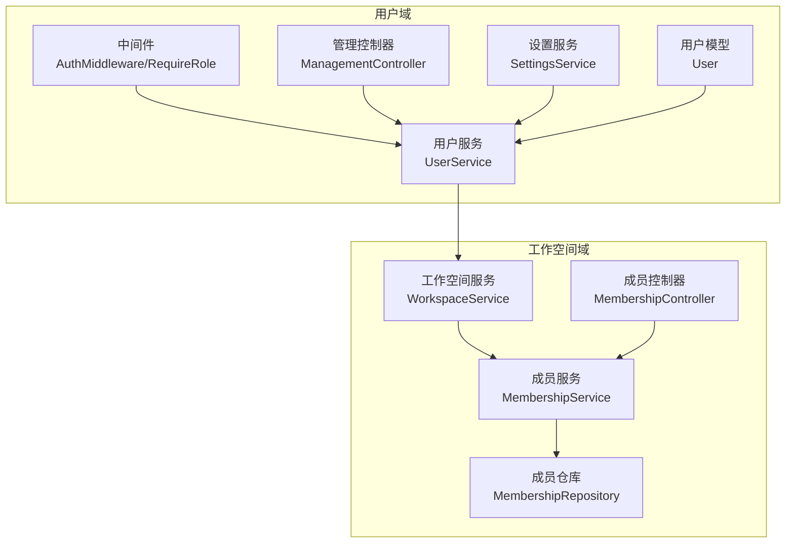
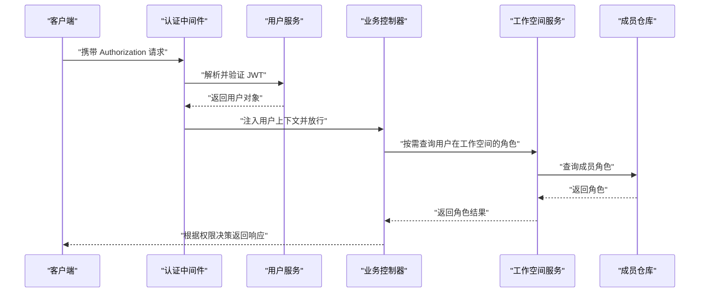
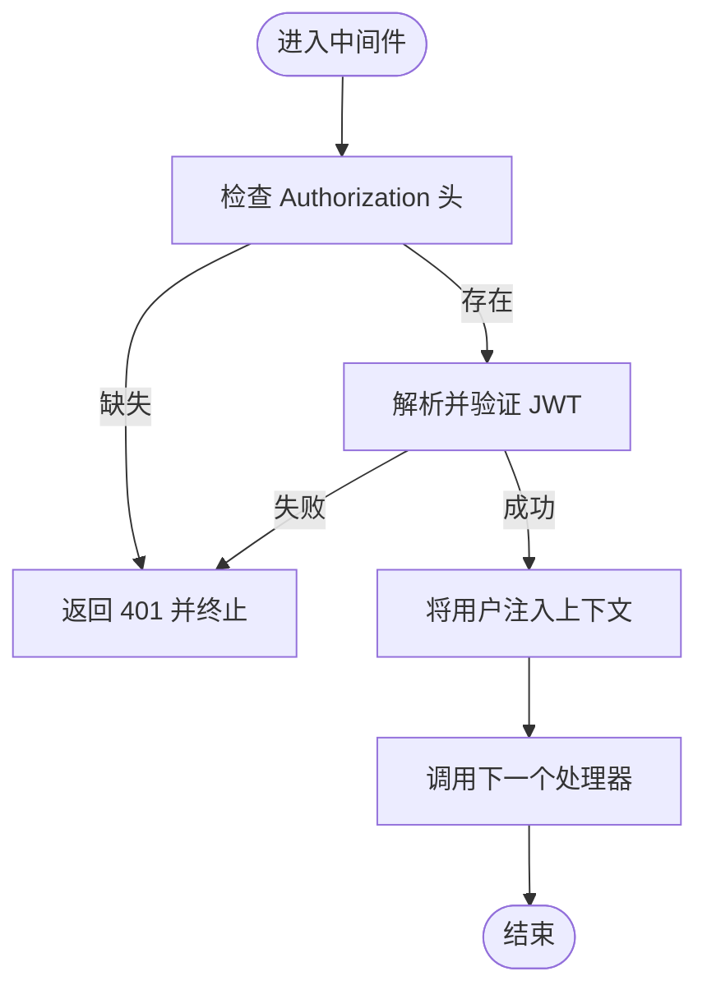
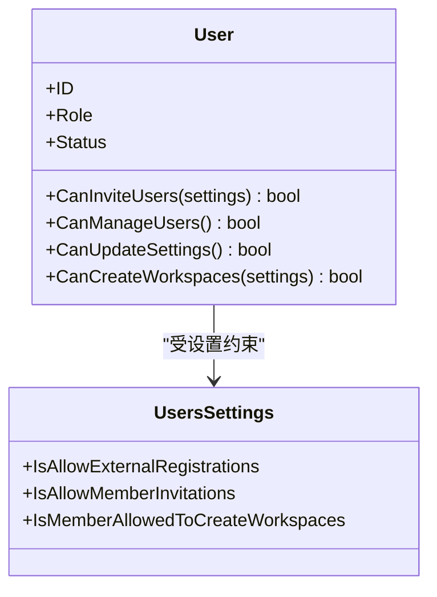
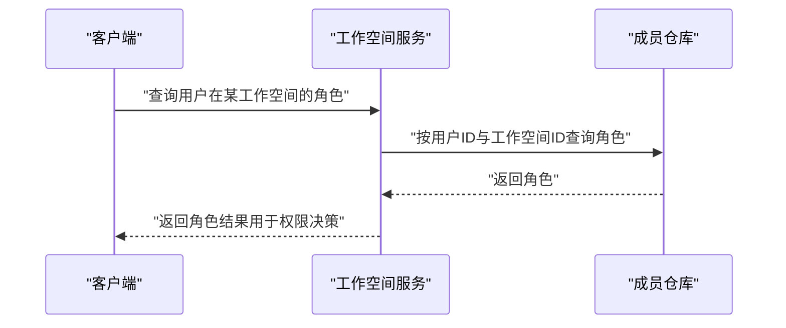
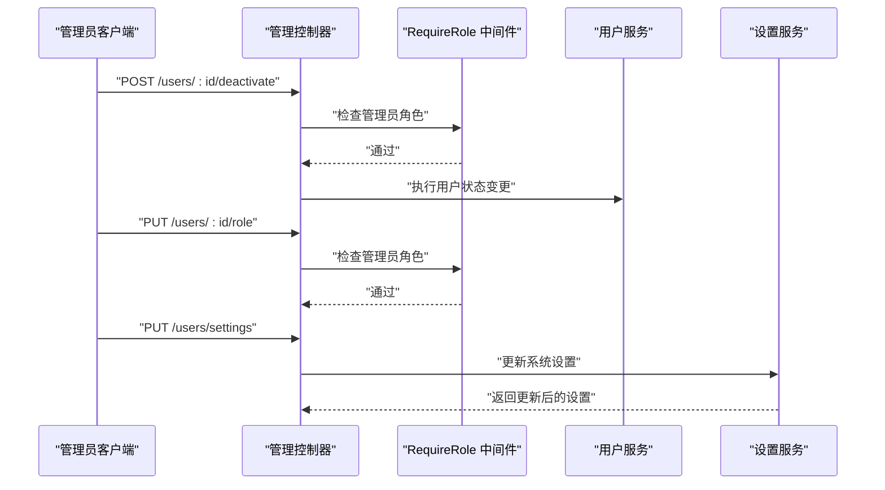
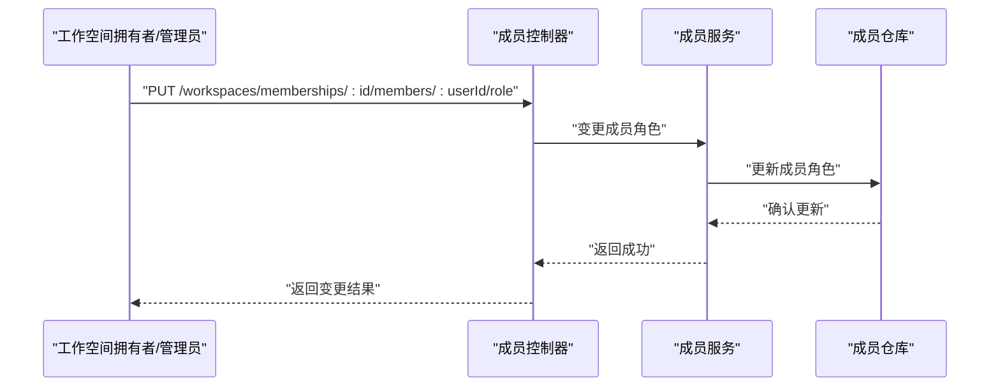
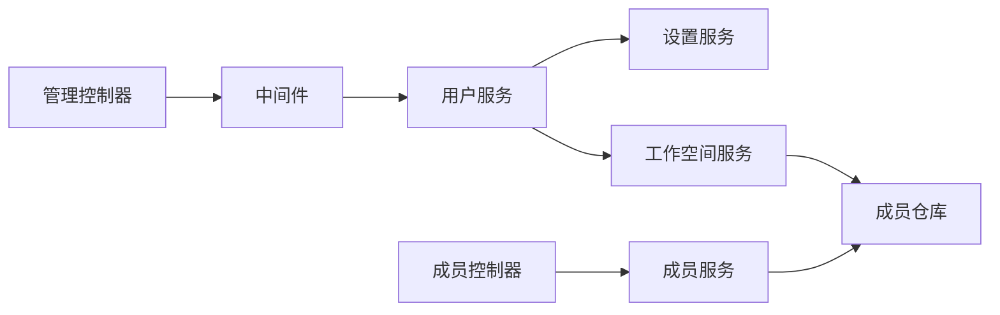

# 权限控制系统

<cite>
**本文档引用的文件**
- [middleware.go](file://backend/internal/features/users/middleware/middleware.go)
- [user_role.go](file://backend/internal/features/users/enums/user_role.go)
- [workspace_role.go](file://backend/internal/features/users/enums/workspace_role.go)
- [user.go](file://backend/internal/features/users/models/user.go)
- [users_settings.go](file://backend/internal/features/users/models/users_settings.go)
- [settings_service.go](file://backend/internal/features/users/services/settings_service.go)
- [user_services.go](file://backend/internal/features/users/services/user_services.go)
- [management_controller.go](file://backend/internal/features/users/controllers/management_controller.go)
- [membership_controller.go](file://backend/internal/features/workspaces/controllers/membership_controller.go)
- [membership_service.go](file://backend/internal/features/workspaces/services/membership_service.go)
- [membership_repository.go](file://backend/internal/features/workspaces/repositories/membership_repository.go)
- [workspace_service.go](file://backend/internal/features/workspaces/services/workspace_service.go)
- [dto.go](file://backend/internal/features/workspaces/dto/dto.go)
- [testing.go](file://backend/internal/features/workspaces/testing/testing.go)
</cite>

## 目录
1. [引言](#引言)
2. [项目结构](#项目结构)
3. [核心组件](#核心组件)
4. [架构总览](#架构总览)
5. [详细组件分析](#详细组件分析)
6. [依赖关系分析](#依赖关系分析)
7. [性能考虑](#性能考虑)
8. [故障排除指南](#故障排除指南)
9. [结论](#结论)
10. [附录](#附录)

## 引言
本文件系统性阐述 Databasus 的权限控制系统，涵盖全局用户权限与工作空间级权限模型、基于角色的访问控制（RBAC）机制、权限继承与动态评估流程，并提供最佳实践与扩展建议。读者可据此理解从认证到授权再到审计的完整链路。

## 项目结构
权限控制相关代码主要分布在后端模块的用户与工作空间两个领域内：
- 用户域：认证中间件、用户模型与权限判定、用户设置与策略、用户管理控制器等
- 工作空间域：工作空间成员角色、成员管理服务与仓库、工作空间服务中的角色查询与权限判断

图表来源
- [middleware.go:14-38](file://backend/internal/features/users/middleware/middleware.go#L14-L38)
- [user_services.go:185-239](file://backend/internal/features/users/services/user_services.go#L185-L239)
- [settings_service.go:20-31](file://backend/internal/features/users/services/settings_service.go#L20-L31)
- [user.go:28-50](file://backend/internal/features/users/models/user.go#L28-L50)
- [workspace_service.go:209-287](file://backend/internal/features/workspaces/services/workspace_service.go#L209-L287)
- [membership_service.go:362-403](file://backend/internal/features/workspaces/services/membership_service.go#L362-L403)
- [membership_repository.go:101-101](file://backend/internal/features/workspaces/repositories/membership_repository.go#L101-L101)
- [membership_controller.go:24-24](file://backend/internal/features/workspaces/controllers/membership_controller.go#L24-L24)

章节来源
- [middleware.go:1-77](file://backend/internal/features/users/middleware/middleware.go#L1-L77)
- [user_services.go:1-1010](file://backend/internal/features/users/services/user_services.go#L1-L1010)
- [settings_service.go:1-81](file://backend/internal/features/users/services/settings_service.go#L1-L81)
- [user.go:1-59](file://backend/internal/features/users/models/user.go#L1-L59)
- [workspace_service.go:209-287](file://backend/internal/features/workspaces/services/workspace_service.go#L209-L287)
- [membership_service.go:362-403](file://backend/internal/features/workspaces/services/membership_service.go#L362-L403)
- [membership_repository.go:101-101](file://backend/internal/features/workspaces/repositories/membership_repository.go#L101-L101)
- [membership_controller.go:24-24](file://backend/internal/features/workspaces/controllers/membership_controller.go#L24-L24)

## 核心组件
- 认证中间件：负责提取并校验 Authorization 头中的 JWT，解析用户信息并注入上下文
- 角色枚举：定义全局用户角色（管理员/成员）与工作空间角色（拥有者/管理员/成员/观察者）
- 用户模型：提供基于用户角色与系统设置的权限判定方法
- 设置服务：集中管理影响权限的系统策略（如是否允许外部注册、成员邀请、成员创建工作空间等）
- 用户服务：实现令牌签发、解析与失效校验；封装用户管理操作
- 管理控制器：对用户列表、状态变更、角色变更等进行 RBAC 控制
- 工作空间服务与成员服务：在工作空间范围内查询用户角色并执行权限判断

章节来源
- [middleware.go:14-64](file://backend/internal/features/users/middleware/middleware.go#L14-L64)
- [user_role.go:5-17](file://backend/internal/features/users/enums/user_role.go#L5-L17)
- [workspace_role.go:5-20](file://backend/internal/features/users/enums/workspace_role.go#L5-L20)
- [user.go:28-50](file://backend/internal/features/users/models/user.go#L28-L50)
- [users_settings.go:5-13](file://backend/internal/features/users/models/users_settings.go#L5-L13)
- [settings_service.go:20-80](file://backend/internal/features/users/services/settings_service.go#L20-L80)
- [user_services.go:185-269](file://backend/internal/features/users/services/user_services.go#L185-L269)
- [management_controller.go:20-38](file://backend/internal/features/users/controllers/management_controller.go#L20-L38)

## 架构总览
Databasus 的权限控制采用“认证 + 授权 + 审计”的分层架构：
- 认证层：通过 JWT 进行身份识别，中间件负责拦截与解析
- 授权层：结合全局角色与工作空间角色，动态评估用户对资源的操作权限
- 策略层：系统设置决定部分权限的边界（如成员邀请、成员创建工作空间）
- 审计层：记录关键操作，便于追踪与合规

图表来源
- [middleware.go:14-38](file://backend/internal/features/users/middleware/middleware.go#L14-L38)
- [user_services.go:185-239](file://backend/internal/features/users/services/user_services.go#L185-L239)
- [workspace_service.go:209-287](file://backend/internal/features/workspaces/services/workspace_service.go#L209-L287)
- [membership_repository.go:101-101](file://backend/internal/features/workspaces/repositories/membership_repository.go#L101-L101)

## 详细组件分析

### 认证与授权中间件
- 认证中间件负责从请求头中提取令牌，去除前缀后调用用户服务解析 JWT，校验失败则直接返回未授权
- 授权中间件从上下文中取出用户对象，比较其角色与所需角色，不满足则返回禁止访问
- 提供辅助函数从上下文安全提取用户对象，避免类型断言错误

图表来源
- [middleware.go:14-38](file://backend/internal/features/users/middleware/middleware.go#L14-L38)

章节来源
- [middleware.go:14-64](file://backend/internal/features/users/middleware/middleware.go#L14-L64)

### 全局用户权限模型
- 全局角色
  - 管理员：拥有最高权限，可执行用户管理、系统设置更新等敏感操作
  - 成员：基础权限，受系统设置约束
- 权限判定方法
  - 邀请用户：管理员无条件允许；成员需开启“允许成员邀请”
  - 管理用户：仅管理员可执行
  - 更新设置：仅管理员可执行
  - 创建工作空间：管理员无条件允许；成员需开启“成员可创建工作空间”

图表来源
- [user.go:28-50](file://backend/internal/features/users/models/user.go#L28-L50)
- [users_settings.go:5-13](file://backend/internal/features/users/models/users_settings.go#L5-L13)

章节来源
- [user_role.go:5-17](file://backend/internal/features/users/enums/user_role.go#L5-L17)
- [user.go:28-50](file://backend/internal/features/users/models/user.go#L28-L50)
- [users_settings.go:5-13](file://backend/internal/features/users/models/users_settings.go#L5-L13)
- [settings_service.go:20-80](file://backend/internal/features/users/services/settings_service.go#L20-L80)

### 工作空间权限模型
- 工作空间角色
  - 拥有者：最高权限，可转移所有权
  - 管理员：可管理成员与资源
  - 成员：可使用资源
  - 观察者：只读权限
- 角色查询与权限评估
  - 通过工作空间服务查询用户在特定工作空间内的角色
  - 在控制器或服务中依据角色进行权限判断（如成员角色变更、资源访问等）

图表来源
- [workspace_service.go:209-287](file://backend/internal/features/workspaces/services/workspace_service.go#L209-L287)
- [membership_repository.go:101-101](file://backend/internal/features/workspaces/repositories/membership_repository.go#L101-L101)

章节来源
- [workspace_role.go:5-20](file://backend/internal/features/users/enums/workspace_role.go#L5-L20)
- [workspace_service.go:209-287](file://backend/internal/features/workspaces/services/workspace_service.go#L209-L287)
- [membership_repository.go:101-101](file://backend/internal/features/workspaces/repositories/membership_repository.go#L101-L101)
- [dto.go:27-27](file://backend/internal/features/workspaces/dto/dto.go#L27-L27)

### 用户管理与权限验证流程
- 管理控制器对用户列表、状态变更、角色变更等接口应用 RequireRole 中间件，确保只有管理员可执行
- 用户服务在签发与解析 JWT 时，会校验用户状态与密码修改时间，防止旧令牌继续生效
- 设置服务在更新系统策略时进行权限校验，并记录审计日志

图表来源
- [management_controller.go:20-38](file://backend/internal/features/users/controllers/management_controller.go#L20-L38)
- [middleware.go:40-64](file://backend/internal/features/users/middleware/middleware.go#L40-L64)
- [user_services.go:185-239](file://backend/internal/features/users/services/user_services.go#L185-L239)
- [settings_service.go:24-80](file://backend/internal/features/users/services/settings_service.go#L24-L80)

章节来源
- [management_controller.go:20-38](file://backend/internal/features/users/controllers/management_controller.go#L20-L38)
- [middleware.go:40-64](file://backend/internal/features/users/middleware/middleware.go#L40-L64)
- [user_services.go:185-239](file://backend/internal/features/users/services/user_services.go#L185-L239)
- [settings_service.go:24-80](file://backend/internal/features/users/services/settings_service.go#L24-L80)

### 成员角色变更与权限继承
- 成员控制器提供变更成员角色的接口，配合工作空间服务与成员服务完成角色变更
- 前端组件展示不同角色并支持在具备权限时进行角色调整
- 测试用例覆盖了工作空间拥有者与管理员可变更角色、成员与观察者不可变更等场景

图表来源
- [membership_controller.go:24-24](file://backend/internal/features/workspaces/controllers/membership_controller.go#L24-L24)
- [membership_service.go:362-403](file://backend/internal/features/workspaces/services/membership_service.go#L362-L403)
- [testing.go:219-269](file://backend/internal/features/workspaces/testing/testing.go#L219-L269)

章节来源
- [membership_controller.go:24-24](file://backend/internal/features/workspaces/controllers/membership_controller.go#L24-L24)
- [membership_service.go:362-403](file://backend/internal/features/workspaces/services/membership_service.go#L362-L403)
- [testing.go:219-269](file://backend/internal/features/workspaces/testing/testing.go#L219-L269)

## 依赖关系分析
- 中间件依赖用户服务进行令牌解析
- 用户服务依赖设置服务与仓库进行策略与数据访问
- 管理控制器依赖中间件进行角色校验
- 工作空间服务依赖成员仓库查询角色
- 成员服务依赖成员仓库进行角色变更持久化

图表来源
- [middleware.go:14-38](file://backend/internal/features/users/middleware/middleware.go#L14-L38)
- [user_services.go:185-239](file://backend/internal/features/users/services/user_services.go#L185-L239)
- [settings_service.go:20-31](file://backend/internal/features/users/services/settings_service.go#L20-L31)
- [workspace_service.go:209-287](file://backend/internal/features/workspaces/services/workspace_service.go#L209-L287)
- [membership_service.go:362-403](file://backend/internal/features/workspaces/services/membership_service.go#L362-L403)
- [membership_controller.go:24-24](file://backend/internal/features/workspaces/controllers/membership_controller.go#L24-L24)

章节来源
- [middleware.go:14-38](file://backend/internal/features/users/middleware/middleware.go#L14-L38)
- [user_services.go:185-239](file://backend/internal/features/users/services/user_services.go#L185-L239)
- [settings_service.go:20-31](file://backend/internal/features/users/services/settings_service.go#L20-L31)
- [workspace_service.go:209-287](file://backend/internal/features/workspaces/services/workspace_service.go#L209-L287)
- [membership_service.go:362-403](file://backend/internal/features/workspaces/services/membership_service.go#L362-L403)
- [membership_controller.go:24-24](file://backend/internal/features/workspaces/controllers/membership_controller.go#L24-L24)

## 性能考虑
- 令牌解析与用户查询：尽量复用已解析用户对象，避免重复查询数据库
- 角色查询缓存：对工作空间角色查询结果进行短期缓存，减少重复查询
- 批量操作：在用户管理与成员变更场景中，优先使用批量接口以降低网络往返
- 审计日志异步化：将审计写入异步化，避免阻塞主业务流程

## 故障排除指南
- 401 未授权
  - 检查请求头是否包含有效的 Authorization 令牌
  - 确认令牌未过期且签名正确
- 403 禁止访问
  - 确认当前用户具备所需角色
  - 检查系统设置是否限制了相关能力（如成员邀请、成员创建工作空间）
- 令牌失效
  - 若用户修改过密码，旧令牌会被强制失效
  - 密码修改时间与令牌中的时间戳不一致会导致校验失败
- 成员角色变更失败
  - 确认当前用户在目标工作空间的角色具备变更权限
  - 检查目标成员是否存在以及角色参数是否有效

章节来源
- [middleware.go:17-33](file://backend/internal/features/users/middleware/middleware.go#L17-L33)
- [user_services.go:217-238](file://backend/internal/features/users/services/user_services.go#L217-L238)
- [settings_service.go:28-30](file://backend/internal/features/users/services/settings_service.go#L28-L30)
- [membership_controller.go:24-24](file://backend/internal/features/workspaces/controllers/membership_controller.go#L24-L24)

## 结论
Databasus 的权限控制以 JWT 认证为基础，结合全局角色与工作空间角色实现细粒度授权，并通过系统设置灵活控制部分权限边界。整体架构清晰、职责分明，具备良好的可扩展性与可观测性。建议在生产环境中强化令牌刷新策略、引入更细粒度的资源级权限与定期审计机制。

## 附录
- 最佳实践
  - 权限最小化：默认拒绝，仅授予必要权限
  - 权限分离：管理员与操作权限分离，避免单点风险
  - 定期审计：对关键操作进行审计日志记录与周期性审查
  - 令牌安全：严格控制令牌有效期与刷新策略，防止泄露
  - 可观测性：完善指标与告警，监控异常登录与权限滥用行为
- 扩展建议
  - 资源级权限：在工作空间角色之上增加资源级权限矩阵
  - 动态权限：引入权限规则引擎，支持基于属性的访问控制（ABAC）
  - 多租户隔离：在工作空间基础上进一步细化多租户权限边界
  - 审计增强：支持审计日志的导出与合规报告生成