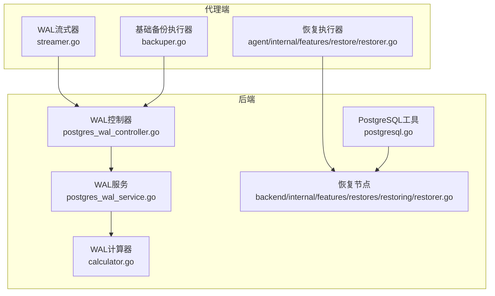
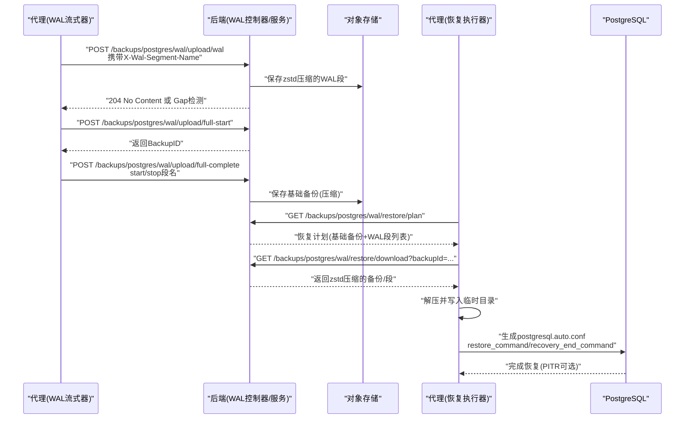
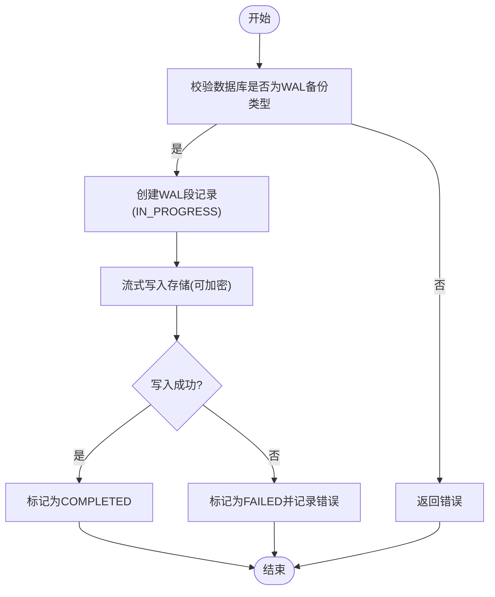
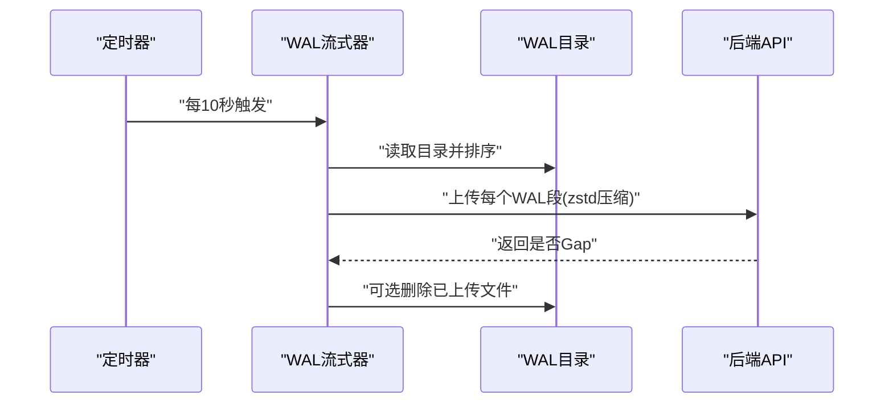
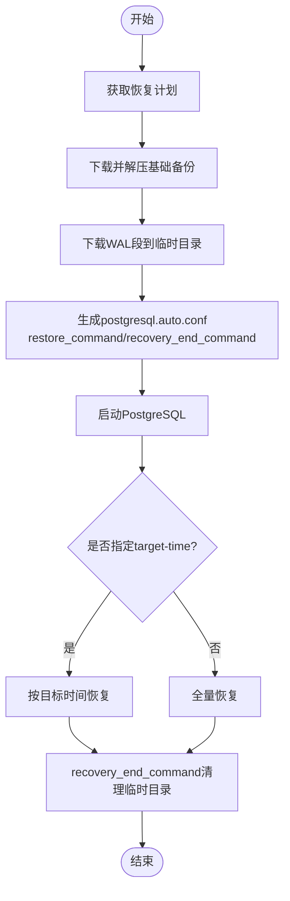
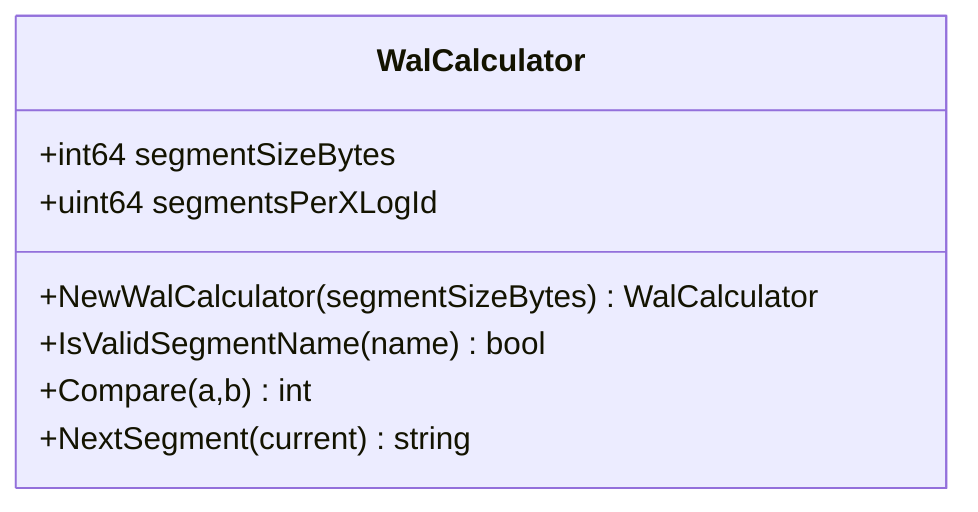
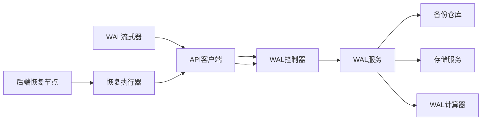

# 增量备份

<cite>
**本文引用的文件**
- [postgres_wal_controller.go](file://backend/internal/features/backups/backups/controllers/postgres_wal_controller.go)
- [postgres_wal_service.go](file://backend/internal/features/backups/backups/services/postgres_wal_service.go)
- [streamer.go](file://agent/internal/features/wal/streamer.go)
- [restorer.go](file://agent/internal/features/restore/restorer.go)
- [restorer.go](file://backend/internal/features/restores/restoring/restorer.go)
- [calculator.go](file://backend/internal/util/wal/calculator.go)
- [postgresql.go](file://backend/internal/util/tools/postgresql.go)
- [add_wal_properties.sql](file://backend/migrations/20260306045548_add_wal_properties.sql)
- [AgentRestoreComponent.tsx](file://frontend/src/features/backups/ui/AgentRestoreComponent.tsx)
- [backuper.go](file://agent/internal/features/full_backup/backuper.go)
</cite>

## 目录
1. [简介](#简介)
2. [项目结构](#项目结构)
3. [核心组件](#核心组件)
4. [架构总览](#架构总览)
5. [详细组件分析](#详细组件分析)
6. [依赖关系分析](#依赖关系分析)
7. [性能考量](#性能考量)
8. [故障排除指南](#故障排除指南)
9. [结论](#结论)
10. [附录](#附录)

## 简介
本文件面向Databasus的增量备份能力，系统性阐述其基于物理基础备份的增量备份策略与WAL（Write-Ahead Logging）连续归档机制。内容涵盖：
- 增量备份的理论基础与实现路径：以物理基础备份为锚点，通过WAL段的连续归档实现持续增量。
- PostgreSQL WAL归档工作原理：wal_level配置、archive_command设置、归档策略选择。
- 恢复流程：基础备份恢复、WAL重放、点目标时间恢复（PITR）的完整过程。
- WAL管理最佳实践：归档空间规划、WAL清理策略、故障恢复预案。
- 配置示例、性能监控指标与故障排除指南。

## 项目结构
Databasus在后端与代理两端分别实现了增量备份的关键能力：
- 后端负责接收与编排：WAL段上传、基础备份上传、恢复计划生成、恢复文件下载、WAL链校验与清理。
- 代理负责采集与传输：WAL目录扫描、zstd压缩、流式上传、基础备份执行与上传、恢复时的WAL下载与PostgreSQL恢复配置。
- 工具与迁移：WAL段算术工具、PostgreSQL工具验证、数据库与备份表结构扩展。

**图表来源**
- [streamer.go:1-205](file://agent/internal/features/wal/streamer.go#L1-L205)
- [backuper.go:1-143](file://agent/internal/features/full_backup/backuper.go#L1-L143)
- [restorer.go:1-445](file://agent/internal/features/restore/restorer.go#L1-L445)
- [postgres_wal_controller.go:1-340](file://backend/internal/features/backups/backups/controllers/postgres_wal_controller.go#L1-L340)
- [postgres_wal_service.go:1-746](file://backend/internal/features/backups/backups/services/postgres_wal_service.go#L1-L746)
- [calculator.go:1-126](file://backend/internal/util/wal/calculator.go#L1-L126)
- [postgresql.go:1-208](file://backend/internal/util/tools/postgresql.go#L1-L208)
- [restorer.go:1-302](file://backend/internal/features/restores/restoring/restorer.go#L1-L302)

**章节来源**
- [postgres_wal_controller.go:1-340](file://backend/internal/features/backups/backups/controllers/postgres_wal_controller.go#L1-L340)
- [postgres_wal_service.go:1-746](file://backend/internal/features/backups/backups/services/postgres_wal_service.go#L1-L746)
- [streamer.go:1-205](file://agent/internal/features/wal/streamer.go#L1-L205)
- [restorer.go:1-445](file://agent/internal/features/restore/restorer.go#L1-L445)
- [calculator.go:1-126](file://backend/internal/util/wal/calculator.go#L1-L126)
- [postgresql.go:1-208](file://backend/internal/util/tools/postgresql.go#L1-L208)
- [restorer.go:1-302](file://backend/internal/features/restores/restoring/restorer.go#L1-L302)

## 核心组件
- WAL控制器与服务
  - 控制器暴露REST接口，处理WAL段上传、基础备份上传、恢复计划查询与恢复文件下载等。
  - 服务负责业务逻辑：记录WAL段、基础备份、生成恢复计划、校验WAL链连续性、加密存储与进度跟踪。
- WAL流式器（代理）
  - 扫描PostgreSQL WAL目录，按正则匹配WAL段名，zstd压缩后流式上传；支持空闲超时与断点续传。
- 恢复执行器（代理）
  - 下载基础备份与所需WAL段，写入临时目录，生成postgresql.auto.conf中的restore_command与recovery_end_command，触发PostgreSQL恢复。
- WAL计算器（后端）
  - 提供WAL段名算术：比较、下一个段名计算，确保恢复链连续性校验。
- PostgreSQL工具（后端）
  - 提供PostgreSQL版本与可执行工具验证，支撑恢复侧的工具链准备。
- 数据库迁移
  - 新增数据库与备份表的WAL相关字段，建立索引，支撑WAL段名与范围记录。

**章节来源**
- [postgres_wal_controller.go:1-340](file://backend/internal/features/backups/backups/controllers/postgres_wal_controller.go#L1-L340)
- [postgres_wal_service.go:1-746](file://backend/internal/features/backups/backups/services/postgres_wal_service.go#L1-L746)
- [streamer.go:1-205](file://agent/internal/features/wal/streamer.go#L1-L205)
- [restorer.go:1-445](file://agent/internal/features/restore/restorer.go#L1-L445)
- [calculator.go:1-126](file://backend/internal/util/wal/calculator.go#L1-L126)
- [postgresql.go:1-208](file://backend/internal/util/tools/postgresql.go#L1-L208)
- [add_wal_properties.sql:1-73](file://backend/migrations/20260306045548_add_wal_properties.sql#L1-L73)

## 架构总览
下图展示从WAL段采集到恢复执行的端到端流程，以及后端对WAL链连续性的校验与清理策略。

**图表来源**
- [streamer.go:123-173](file://agent/internal/features/wal/streamer.go#L123-L173)
- [postgres_wal_controller.go:134-163](file://backend/internal/features/backups/backups/controllers/postgres_wal_controller.go#L134-L163)
- [postgres_wal_controller.go:177-198](file://backend/internal/features/backups/backups/controllers/postgres_wal_controller.go#L177-L198)
- [postgres_wal_controller.go:212-245](file://backend/internal/features/backups/backups/controllers/postgres_wal_controller.go#L212-L245)
- [postgres_wal_controller.go:259-289](file://backend/internal/features/backups/backups/controllers/postgres_wal_controller.go#L259-L289)
- [postgres_wal_controller.go:302-332](file://backend/internal/features/backups/backups/controllers/postgres_wal_controller.go#L302-L332)
- [postgres_wal_service.go:203-286](file://backend/internal/features/backups/backups/services/postgres_wal_service.go#L203-L286)
- [restorer.go:130-146](file://agent/internal/features/restore/restorer.go#L130-L146)
- [restorer.go:329-363](file://agent/internal/features/restore/restorer.go#L329-L363)

## 详细组件分析

### 组件A：WAL控制器与服务
- 职责
  - 接收WAL段流式上传，记录段名与状态；接收基础备份流式上传并标记“上传完成”；生成恢复计划并校验WAL链连续性；下载备份文件用于恢复。
- 关键流程
  - 上传WAL段：校验类型、检查重复、创建记录、流式写入存储、进度上报、成功/失败标记。
  - 完成基础备份：回填起止WAL段名，标记完成。
  - 恢复计划：解析最近一次已完成的基础备份，列出其后的WAL段，并用WAL计算器验证连续性。
- 错误处理
  - Gap检测：若发现不连续，返回错误与最后连续段，限制恢复范围。
  - 失败回滚：上传失败或完成阶段错误均标记失败并保留失败信息。

**图表来源**
- [postgres_wal_service.go:34-97](file://backend/internal/features/backups/backups/services/postgres_wal_service.go#L34-L97)
- [postgres_wal_service.go:482-569](file://backend/internal/features/backups/backups/services/postgres_wal_service.go#L482-L569)

**章节来源**
- [postgres_wal_controller.go:1-340](file://backend/internal/features/backups/backups/controllers/postgres_wal_controller.go#L1-L340)
- [postgres_wal_service.go:1-746](file://backend/internal/features/backups/backups/services/postgres_wal_service.go#L1-L746)

### 组件B：WAL流式器（代理）
- 职责
  - 周期性扫描WAL目录，过滤出合法的WAL段名，zstd压缩后通过API上传；支持空闲超时与断点续传；可选删除已上传文件。
- 关键流程
  - 列表扫描：读取目录、正则匹配、排序。
  - 逐个上传：管道压缩、带超时的上传、空闲读取器、Gap检测。
- 性能与可靠性
  - 轮询间隔与超时参数可调；重试策略由后端恢复流程控制；上传完成后可本地删除以节省空间。

**图表来源**
- [streamer.go:44-61](file://agent/internal/features/wal/streamer.go#L44-L61)
- [streamer.go:92-121](file://agent/internal/features/wal/streamer.go#L92-L121)
- [streamer.go:123-173](file://agent/internal/features/wal/streamer.go#L123-L173)

**章节来源**
- [streamer.go:1-205](file://agent/internal/features/wal/streamer.go#L1-L205)

### 组件C：恢复执行器（代理）
- 职责
  - 获取恢复计划，下载基础备份与所需WAL段，写入临时目录；生成postgresql.auto.conf中的restore_command与recovery_end_command；启动PostgreSQL进入恢复模式。
- 关键流程
  - 下载与解压：zstd解压并解包到PGDATA。
  - WAL下载：逐段下载并写入临时目录，带重试。
  - 配置恢复：写入recovery.signal、restore_command、recovery_end_command、可选recovery_target_time。
- 支持PITR
  - 通过命令行参数target-time传递RFC3339时间戳，恢复至指定时刻。

**图表来源**
- [restorer.go:58-102](file://agent/internal/features/restore/restorer.go#L58-L102)
- [restorer.go:165-181](file://agent/internal/features/restore/restorer.go#L165-L181)
- [restorer.go:245-258](file://agent/internal/features/restore/restorer.go#L245-L258)
- [restorer.go:329-363](file://agent/internal/features/restore/restorer.go#L329-L363)

**章节来源**
- [restorer.go:1-445](file://agent/internal/features/restore/restorer.go#L1-L445)
- [AgentRestoreComponent.tsx:195-253](file://frontend/src/features/backups/ui/AgentRestoreComponent.tsx#L195-L253)

### 组件D：WAL计算器（后端）
- 职责
  - 对WAL段名进行合法性校验、比较与“下一个段名”计算，保证恢复链连续性。
- 关键算法
  - 段名格式：时间线+日志ID+段号（各8字符十六进制），字典序即数值序。
  - 计算下一WAL段：段号自增，溢出则日志ID递增；时间线独立增长。
- 应用场景
  - 恢复计划生成时，从基础备份的stop段名推导期望的下一个段名，遍历WAL段列表验证连续性。

**图表来源**
- [calculator.go:18-43](file://backend/internal/util/wal/calculator.go#L18-L43)
- [calculator.go:75-112](file://backend/internal/util/wal/calculator.go#L75-L112)
- [calculator.go:45-73](file://backend/internal/util/wal/calculator.go#L45-L73)

**章节来源**
- [calculator.go:1-126](file://backend/internal/util/wal/calculator.go#L1-L126)
- [postgres_wal_service.go:652-725](file://backend/internal/features/backups/backups/services/postgres_wal_service.go#L652-L725)

### 组件E：PostgreSQL工具与恢复节点（后端）
- 职责
  - 验证PostgreSQL版本与客户端工具可用性，支撑恢复侧工具链准备。
  - 恢复节点注册、心跳、任务分发与完成上报，保障恢复任务的可靠执行。

**章节来源**
- [postgresql.go:1-208](file://backend/internal/util/tools/postgresql.go#L1-L208)
- [restorer.go:1-302](file://backend/internal/features/restores/restoring/restorer.go#L1-L302)

## 依赖关系分析
- 组件耦合
  - WAL控制器依赖数据库服务与备份服务；WAL服务依赖备份仓库、存储服务、加密工具与WAL计算器。
  - 代理端WAL流式器依赖配置、API客户端；恢复执行器依赖API客户端与PostgreSQL工具。
- 外部依赖
  - 对象存储：保存基础备份与WAL段。
  - PostgreSQL：作为恢复目标与工具链来源。
- 可能的循环依赖
  - 当前模块间采用单向依赖，未见循环。

**图表来源**
- [streamer.go:30-42](file://agent/internal/features/wal/streamer.go#L30-L42)
- [postgres_wal_controller.go:17-20](file://backend/internal/features/backups/backups/controllers/postgres_wal_controller.go#L17-L20)
- [postgres_wal_service.go:24-32](file://backend/internal/features/backups/backups/services/postgres_wal_service.go#L24-L32)
- [restorer.go:31-38](file://agent/internal/features/restore/restorer.go#L31-L38)
- [restorer.go:30-48](file://backend/internal/features/restores/restoring/restorer.go#L30-L48)

**章节来源**
- [postgres_wal_service.go:1-746](file://backend/internal/features/backups/backups/services/postgres_wal_service.go#L1-L746)
- [streamer.go:1-205](file://agent/internal/features/wal/streamer.go#L1-L205)
- [restorer.go:1-445](file://agent/internal/features/restore/restorer.go#L1-L445)
- [restorer.go:1-302](file://backend/internal/features/restores/restoring/restorer.go#L1-L302)

## 性能考量
- 传输效率
  - 使用zstd压缩减少网络与存储开销；流式上传避免大文件内存占用。
- 并发与吞吐
  - 上传超时与空闲超时参数可调；恢复侧支持重试与指数退避。
- 存储成本
  - WAL段按需下载，恢复完成后自动清理临时目录；基础备份定期清理策略可结合GFS保留策略。
- 监控指标建议
  - 上传速率（MB/s）、WAL段大小分布、恢复下载耗时、重试次数、Gap检测频率、恢复完成时间。

[本节为通用指导，无需特定文件引用]

## 故障排除指南
- WAL链断点
  - 现象：恢复计划返回“WAL链断裂”，并给出最后连续段。
  - 处理：仅能恢复到该段为止；修复后重新触发基础备份，补齐后续WAL段。
- 上传失败
  - 现象：上传返回错误或被标记为FAILED。
  - 处理：检查网络、存储权限、压缩与超时参数；必要时重试或人工补传。
- 恢复失败
  - 现象：恢复执行器报错或PostgreSQL无法进入恢复模式。
  - 处理：确认PGDATA为空且路径正确；检查postgresql.auto.conf中路径与权限；验证restore_command与recovery_end_command路径一致性。
- PITR目标无效
  - 现象：指定target-time导致恢复失败。
  - 处理：确认时间格式为RFC3339；确保对应WAL段存在且链路连续。

**章节来源**
- [postgres_wal_service.go:652-725](file://backend/internal/features/backups/backups/services/postgres_wal_service.go#L652-L725)
- [restorer.go:130-146](file://agent/internal/features/restore/restorer.go#L130-L146)
- [restorer.go:329-363](file://agent/internal/features/restore/restorer.go#L329-L363)

## 结论
Databasus的增量备份以物理基础备份为核心，通过WAL段的连续归档与严格的链路校验，实现了高可靠、可恢复到任意时间点的增量备份方案。代理端负责高效采集与传输，后端负责编排与治理，配合完善的恢复流程与监控告警，满足生产环境对数据保护与快速恢复的需求。

[本节为总结，无需特定文件引用]

## 附录

### PostgreSQL WAL归档工作原理与配置要点
- wal_level
  - 建议使用logical或replica级别以启用WAL归档与复制。
- archive_mode
  - 开启归档模式，使WAL段在切换后进入归档队列。
- archive_command
  - 将WAL段写入对象存储或共享存储；在恢复后需根据实际部署调整。
- 归档策略
  - 基于时间窗口与空间配额的GFS策略，结合业务RPO/RTO目标设定保留周期。

[本节为概念性说明，无需特定文件引用]

### 增量备份恢复流程（基础备份+WAL重放+PITR）
- 步骤
  - 生成恢复计划：定位最近一次已完成的基础备份及其WAL段范围。
  - 下载基础备份与所需WAL段：按顺序下载并写入临时目录。
  - 配置恢复参数：生成postgresql.auto.conf，设置restore_command、recovery_end_command、recovery_target_time（可选）。
  - 启动PostgreSQL：自动进入恢复模式，重放WAL直至目标或全部WAL完成。
- 注意事项
  - 恢复后需处理archive_command，确保PostgreSQL不再尝试归档已恢复实例的WAL。

**章节来源**
- [postgres_wal_service.go:203-286](file://backend/internal/features/backups/backups/services/postgres_wal_service.go#L203-L286)
- [restorer.go:329-363](file://agent/internal/features/restore/restorer.go#L329-L363)
- [AgentRestoreComponent.tsx:195-253](file://frontend/src/features/backups/ui/AgentRestoreComponent.tsx#L195-L253)

### WAL管理最佳实践
- 归档空间规划
  - 评估WAL产生速率与保留周期，预留充足对象存储空间。
- 清理策略
  - 定期清理过期WAL段与失败上传的基础备份；结合GFS策略保留关键时间点。
- 故障恢复预案
  - WAL链断点时优先补齐缺失段；上传失败时进行重试与人工补传；恢复失败时检查PGDATA与配置文件。

**章节来源**
- [add_wal_properties.sql:1-73](file://backend/migrations/20260306045548_add_wal_properties.sql#L1-L73)
- [restorer.go:245-258](file://agent/internal/features/restore/restorer.go#L245-L258)

### 配置示例与参考路径
- 代理端WAL流式器
  - WAL目录扫描、zstd压缩、上传超时与空闲超时参数可调。
  - 参考路径：[streamer.go:1-205](file://agent/internal/features/wal/streamer.go#L1-L205)
- 后端WAL控制器
  - 接口定义：WAL段上传、基础备份上传、恢复计划、恢复文件下载。
  - 参考路径：[postgres_wal_controller.go:1-340](file://backend/internal/features/backups/backups/controllers/postgres_wal_controller.go#L1-L340)
- 恢复执行器
  - 恢复计划获取、WAL段下载、配置恢复参数。
  - 参考路径：[restorer.go:130-146](file://agent/internal/features/restore/restorer.go#L130-L146), [restorer.go:245-258](file://agent/internal/features/restore/restorer.go#L245-L258), [restorer.go:329-363](file://agent/internal/features/restore/restorer.go#L329-L363)
- 数据库迁移
  - 新增WAL相关字段与索引。
  - 参考路径：[add_wal_properties.sql:1-73](file://backend/migrations/20260306045548_add_wal_properties.sql#L1-L73)