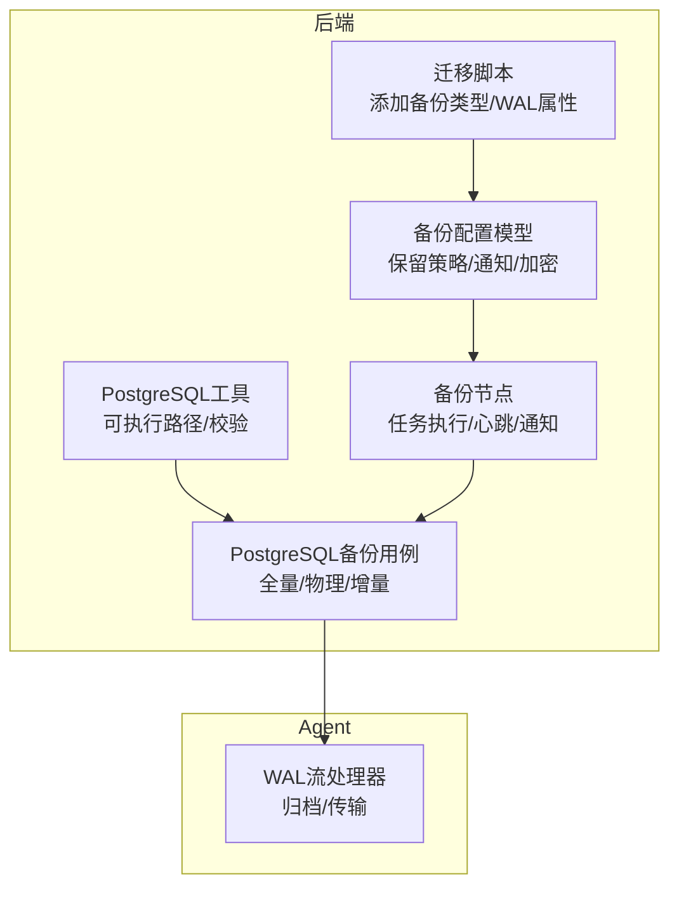
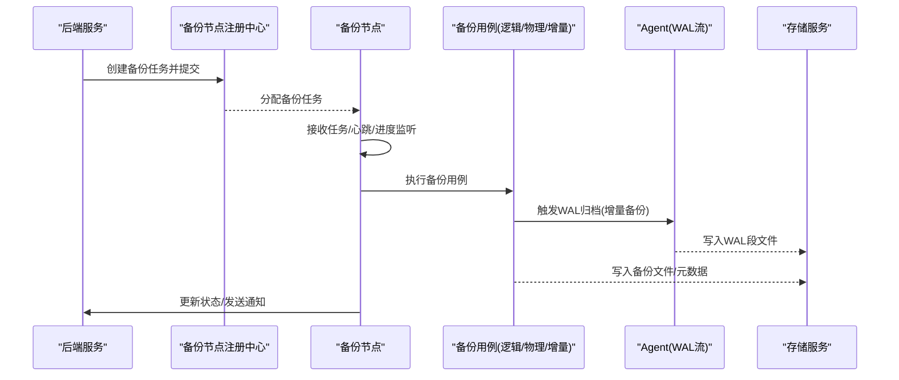
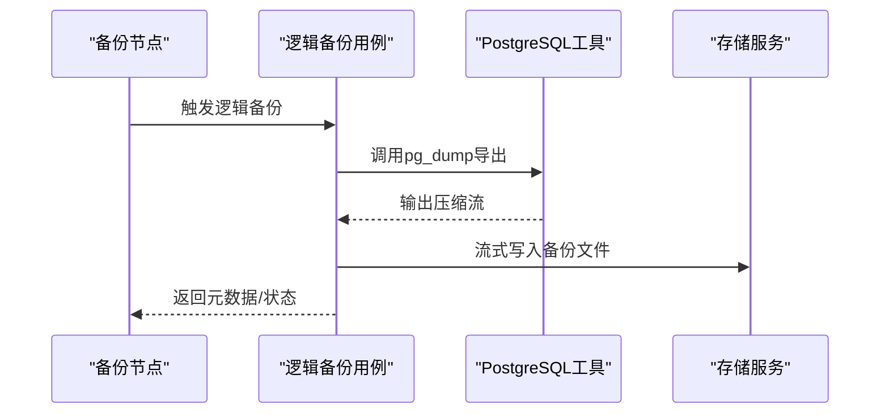
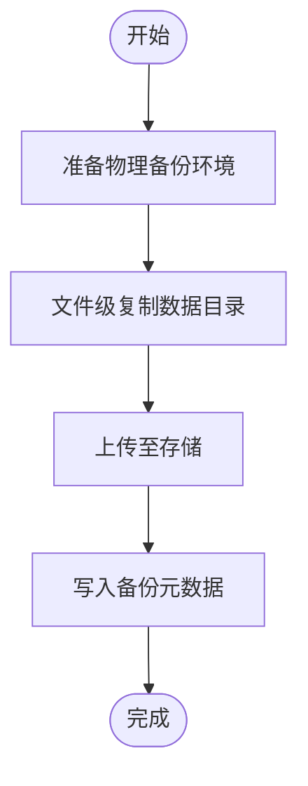
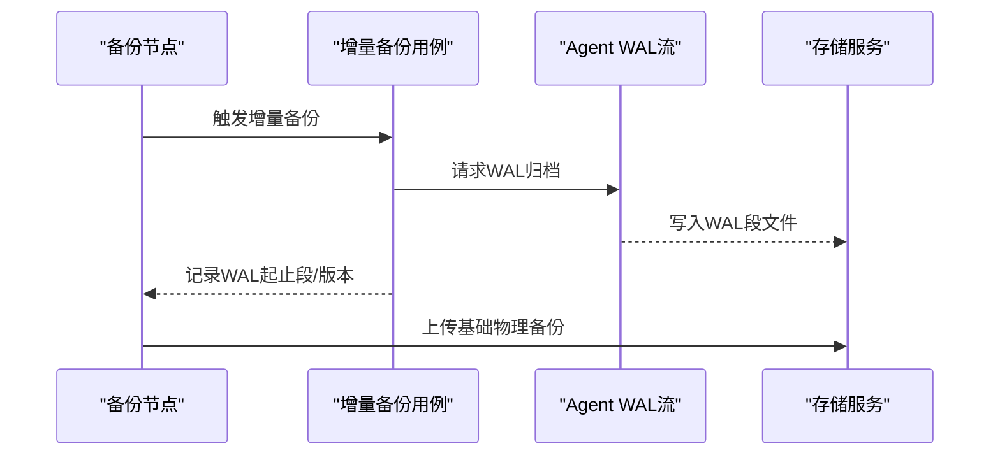
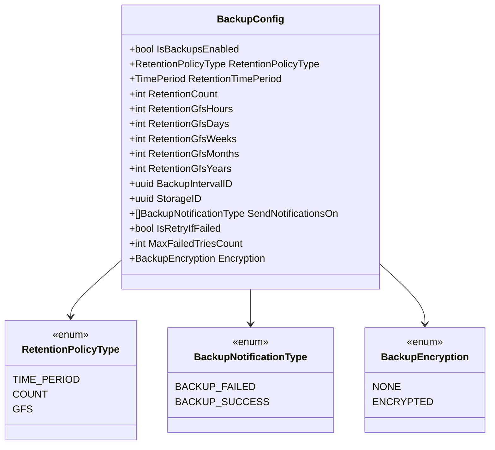
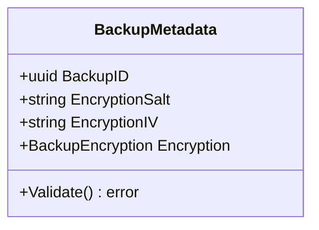
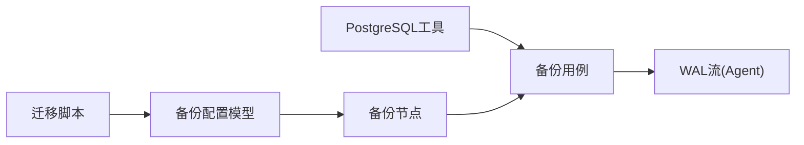

# 备份类型支持

<cite>
**本文引用的文件**
- [20260101200438_add_backup_format.sql](file://backend/migrations/20260101200438_add_backup_format.sql)
- [20260306045548_add_wal_properties.sql](file://backend/migrations/20260306045548_add_wal_properties.sql)
- [postgresql.go](file://backend/internal/util/tools/postgresql.go)
- [backuper.go](file://backend/internal/features/backups/backups/backuping/backuper.go)
- [dto.go](file://backend/internal/features/backups/backups/common/dto.go)
- [model.go](file://backend/internal/features/backups/config/model.go)
- [enums.go](file://backend/internal/features/backups/config/enums.go)
- [postgres_db_model.go](file://backend/internal/features/databases/databases/postgresql/postgres_db_model.go)
- [pg_full_backup_uc.go](file://backend/internal/features/backups/usecases/postgresql/pg_full_backup_uc.go)
- [pg_physical_backup_uc.go](file://backend/internal/features/backups/usecases/postgresql/pg_physical_backup_uc.go)
- [pg_incremental_backup_uc.go](file://backend/internal/features/backups/usecases/postgresql/pg_incremental_backup_uc.go)
- [pg_wal_streamer.go](file://agent/internal/features/wal/streamer.go)
- [pg_wal_streamer_test.go](file://agent/internal/features/wal/streamer_test.go)
- [pg_full_backup_uc_test.go](file://backend/internal/features/backups/test/postgresql/pg_full_backup_uc_test.go)
- [pg_physical_backup_uc_test.go](file://backend/internal/features/backups/test/postgresql/pg_physical_backup_uc_test.go)
- [pg_incremental_backup_uc_test.go](file://backend/internal/features/backups/test/postgresql/pg_incremental_backup_uc_test.go)
</cite>

## 目录
1. [引言](#引言)
2. [项目结构](#项目结构)
3. [核心组件](#核心组件)
4. [架构总览](#架构总览)
5. [详细组件分析](#详细组件分析)
6. [依赖关系分析](#依赖关系分析)
7. [性能考量](#性能考量)
8. [故障排查指南](#故障排查指南)
9. [结论](#结论)
10. [附录](#附录)

## 引言
本文件系统性阐述 Databasus 的备份类型支持能力，覆盖三类备份模式及其技术原理与适用场景：
- 逻辑备份：基于数据库引擎的原生转储（如 PostgreSQL 的 pg_dump），压缩后以流式方式直接写入存储，适合中等规模数据、可移植性强、便于跨版本迁移。
- 物理备份：对数据库集群进行文件级复制，适合大规模数据集的快速备份与恢复，通常具备更快的恢复速度与更低的 CPU 开销。
- 增量备份：以物理基础备份为起点，结合连续 WAL 段归档，支持点-in-time 恢复（PITR），兼顾恢复时间与存储空间。

同时，本文深入解析 PostgreSQL 的 WAL 归档机制在 Databasus 中的实现，包括归档策略、存储位置、恢复流程；并给出备份格式选择的原则与配置示例，以及性能对比分析与最佳实践建议。

## 项目结构
围绕备份类型支持的关键代码分布在以下模块：
- 后端迁移与模型：定义备份类型字段、PostgreSQL 数据库备份类型、WAL 相关属性及索引。
- 工具层：PostgreSQL 可执行工具路径解析与安装验证。
- 备份节点与调度：后端备份节点运行、任务分配、心跳、进度上报与通知。
- 配置与策略：备份配置模型、保留策略、通知开关、加密选项。
- 使用用例：针对 PostgreSQL 的全量、物理、增量备份用例实现。
- Agent WAL 流：WAL 段归档流处理与测试。

**图表来源**
- [20260101200438_add_backup_format.sql:1-10](file://backend/migrations/20260101200438_add_backup_format.sql#L1-L10)
- [20260306045548_add_wal_properties.sql:1-73](file://backend/migrations/20260306045548_add_wal_properties.sql#L1-L73)
- [postgresql.go:1-208](file://backend/internal/util/tools/postgresql.go#L1-L208)
- [backuper.go:1-442](file://backend/internal/features/backups/backups/backuping/backuper.go#L1-L442)
- [model.go:1-156](file://backend/internal/features/backups/config/model.go#L1-L156)
- [pg_full_backup_uc.go](file://backend/internal/features/backups/usecases/postgresql/pg_full_backup_uc.go)
- [pg_physical_backup_uc.go](file://backend/internal/features/backups/usecases/postgresql/pg_physical_backup_uc.go)
- [pg_incremental_backup_uc.go](file://backend/internal/features/backups/usecases/postgresql/pg_incremental_backup_uc.go)
- [pg_wal_streamer.go](file://agent/internal/features/wal/streamer.go)

**章节来源**
- [20260101200438_add_backup_format.sql:1-10](file://backend/migrations/20260101200438_add_backup_format.sql#L1-L10)
- [20260306045548_add_wal_properties.sql:1-73](file://backend/migrations/20260306045548_add_wal_properties.sql#L1-L73)
- [postgresql.go:1-208](file://backend/internal/util/tools/postgresql.go#L1-L208)
- [backuper.go:1-442](file://backend/internal/features/backups/backups/backuping/backuper.go#L1-L442)
- [model.go:1-156](file://backend/internal/features/backups/config/model.go#L1-L156)

## 核心组件
- 备份类型字段与 PostgreSQL 备份类型
  - 在 backups 表新增 type 字段用于标识备份类型（默认 DEFAULT）。
  - 在 postgresql_databases 表新增 backup_type 字段，默认 PG_DUMP（对应逻辑备份）。
- WAL 相关属性
  - 在 backups 表新增 pg_wal_backup_type、pg_wal_start_segment、pg_wal_stop_segment、pg_version、pg_wal_segment_name 等字段，并建立相应索引，支撑 WAL 归档与增量备份追踪。
- 备份配置模型
  - 支持保留策略类型（时间周期、数量、GFS）、通知开关（成功/失败）、重试策略、加密选项（NONE/ENCRYPTED）。
- 备份节点与通知
  - 节点负责接收任务、执行备份、更新进度、保存元数据、发送通知；支持取消与清理残留文件。

**章节来源**
- [20260101200438_add_backup_format.sql:1-10](file://backend/migrations/20260101200438_add_backup_format.sql#L1-L10)
- [20260306045548_add_wal_properties.sql:1-73](file://backend/migrations/20260306045548_add_wal_properties.sql#L1-L73)
- [model.go:1-156](file://backend/internal/features/backups/config/model.go#L1-L156)
- [enums.go:1-24](file://backend/internal/features/backups/config/enums.go#L1-L24)
- [backuper.go:1-442](file://backend/internal/features/backups/backups/backuping/backuper.go#L1-L442)

## 架构总览
Databasus 的备份体系由“后端调度 + Agent 执行 + 存储服务”构成。后端根据备份配置生成备份任务，通过注册中心分发给备份节点；节点调用数据库引擎工具或物理复制工具执行备份，并将结果写入存储；对于 PostgreSQL 增量备份，Agent 负责 WAL 段归档流处理。

**图表来源**
- [backuper.go:51-116](file://backend/internal/features/backups/backups/backuping/backuper.go#L51-L116)
- [pg_wal_streamer.go](file://agent/internal/features/wal/streamer.go)
- [pg_full_backup_uc.go](file://backend/internal/features/backups/usecases/postgresql/pg_full_backup_uc.go)
- [pg_physical_backup_uc.go](file://backend/internal/features/backups/usecases/postgresql/pg_physical_backup_uc.go)
- [pg_incremental_backup_uc.go](file://backend/internal/features/backups/usecases/postgresql/pg_incremental_backup_uc.go)

## 详细组件分析

### PostgreSQL 逻辑备份（pg_dump）
- 技术原理
  - 使用数据库引擎提供的原生转储工具（如 pg_dump）导出 SQL 或自定义二进制格式，配合压缩算法减少体积，再以流式方式写入存储。
  - 优点：可移植性强、跨版本兼容、便于审计与小范围恢复；缺点：恢复时需解析与回放，CPU 开销较高。
- 实现要点
  - 通过工具层定位不同版本的客户端工具路径，确保可用性。
  - 备份节点在执行过程中持续上报进度，完成后写入元数据文件并更新状态。
- 典型应用场景
  - 中小型数据库、需要跨版本迁移、频繁变更表结构的环境。

**图表来源**
- [postgresql.go:14-32](file://backend/internal/util/tools/postgresql.go#L14-L32)
- [pg_full_backup_uc.go](file://backend/internal/features/backups/usecases/postgresql/pg_full_backup_uc.go)
- [backuper.go:171-178](file://backend/internal/features/backups/backups/backuping/backuper.go#L171-L178)

**章节来源**
- [postgresql.go:1-208](file://backend/internal/util/tools/postgresql.go#L1-L208)
- [pg_full_backup_uc.go](file://backend/internal/features/backups/usecases/postgresql/pg_full_backup_uc.go)
- [backuper.go:171-178](file://backend/internal/features/backups/backups/backuping/backuper.go#L171-L178)

### PostgreSQL 物理备份
- 技术原理
  - 对数据库数据目录进行文件级复制，通常使用 rsync、cp 或数据库自带的物理复制接口，实现快速备份与恢复。
  - 优点：恢复速度快、CPU 开销低；缺点：仅在同一实例或兼容环境中使用，可移植性差。
- 实现要点
  - 通过物理备份用例封装复制流程，结合存储服务完成文件上传。
  - 与 WAL 归档配合可形成增量备份基线。
- 典型应用场景
  - 大规模数据集、追求最短 RTO 的生产环境。

**图表来源**
- [pg_physical_backup_uc.go](file://backend/internal/features/backups/usecases/postgresql/pg_physical_backup_uc.go)
- [backuper.go:329-336](file://backend/internal/features/backups/backups/backuping/backuper.go#L329-L336)

**章节来源**
- [pg_physical_backup_uc.go](file://backend/internal/features/backups/usecases/postgresql/pg_physical_backup_uc.go)
- [backuper.go:329-336](file://backend/internal/features/backups/backups/backuping/backuper.go#L329-L336)

### PostgreSQL 增量备份与 WAL 归档
- 技术原理
  - 以一次物理基础备份作为起点，后续通过持续归档 WAL 段实现增量备份；支持基于时间点的精确恢复（PITR）。
  - WAL 归档通过 Agent 的 WAL 流处理器完成，将 WAL 段按命名规则写入指定存储位置。
- 实现要点
  - 迁移脚本新增 WAL 相关字段与索引，便于追踪归档段与备份类型。
  - 备份节点在执行过程中记录 WAL 起止段号、版本信息，便于恢复时定位。
- 典型应用场景
  - 大数据量、高可用需求、需要细粒度恢复窗口的场景。

**图表来源**
- [20260306045548_add_wal_properties.sql:18-31](file://backend/migrations/20260306045548_add_wal_properties.sql#L18-L31)
- [pg_wal_streamer.go](file://agent/internal/features/wal/streamer.go)
- [pg_incremental_backup_uc.go](file://backend/internal/features/backups/usecases/postgresql/pg_incremental_backup_uc.go)
- [backuper.go:285-297](file://backend/internal/features/backups/backups/backuping/backuper.go#L285-L297)

**章节来源**
- [20260306045548_add_wal_properties.sql:1-73](file://backend/migrations/20260306045548_add_wal_properties.sql#L1-L73)
- [pg_wal_streamer.go](file://agent/internal/features/wal/streamer.go)
- [pg_incremental_backup_uc.go](file://backend/internal/features/backups/usecases/postgresql/pg_incremental_backup_uc.go)
- [backuper.go:285-297](file://backend/internal/features/backups/backups/backuping/backuper.go#L285-L297)

### 备份配置与策略
- 配置模型
  - 包含启用开关、保留策略（时间周期/数量/GFS）、通知开关（成功/失败）、重试次数、加密选项等。
- 保留策略
  - 时间周期：按时间窗口保留；
  - 数量：按最近 N 个备份；
  - GFS：按层级保留（小时/天/周/月/年）。
- 加密与云存储
  - 云存储场景强制加密；本地存储可选 NONE 或 ENCRYPTED。

**图表来源**
- [model.go:16-44](file://backend/internal/features/backups/config/model.go#L16-L44)
- [enums.go:3-23](file://backend/internal/features/backups/config/enums.go#L3-L23)

**章节来源**
- [model.go:1-156](file://backend/internal/features/backups/config/model.go#L1-L156)
- [enums.go:1-24](file://backend/internal/features/backups/config/enums.go#L1-L24)

### 备份元数据与通知
- 元数据结构
  - 包含备份 ID、加密盐值、初始化向量、加密方式等，用于解密与完整性校验。
- 通知机制
  - 成功/失败分别触发通知，消息包含耗时与压缩后大小等指标。

**图表来源**
- [dto.go:11-38](file://backend/internal/features/backups/backups/common/dto.go#L11-L38)

**章节来源**
- [dto.go:1-39](file://backend/internal/features/backups/backups/common/dto.go#L1-L39)
- [backuper.go:362-434](file://backend/internal/features/backups/backups/backuping/backuper.go#L362-L434)

## 依赖关系分析
- 后端迁移脚本为备份类型与 WAL 属性提供数据库层面的支撑，是上层用例与节点执行的基础。
- 工具层负责 PostgreSQL 客户端工具的路径解析与安装校验，保障逻辑备份用例的可用性。
- 备份节点协调用例执行、存储交互与通知发送，形成闭环。
- Agent 的 WAL 流处理器独立于后端，专注于 WAL 段归档，与后端通过备份记录字段关联。

**图表来源**
- [20260101200438_add_backup_format.sql:1-10](file://backend/migrations/20260101200438_add_backup_format.sql#L1-L10)
- [20260306045548_add_wal_properties.sql:1-73](file://backend/migrations/20260306045548_add_wal_properties.sql#L1-L73)
- [postgresql.go:1-208](file://backend/internal/util/tools/postgresql.go#L1-L208)
- [backuper.go:1-442](file://backend/internal/features/backups/backups/backuping/backuper.go#L1-L442)
- [pg_wal_streamer.go](file://agent/internal/features/wal/streamer.go)

**章节来源**
- [20260101200438_add_backup_format.sql:1-10](file://backend/migrations/20260101200438_add_backup_format.sql#L1-L10)
- [20260306045548_add_wal_properties.sql:1-73](file://backend/migrations/20260306045548_add_wal_properties.sql#L1-L73)
- [postgresql.go:1-208](file://backend/internal/util/tools/postgresql.go#L1-L208)
- [backuper.go:1-442](file://backend/internal/features/backups/backups/backuping/backuper.go#L1-L442)
- [pg_wal_streamer.go](file://agent/internal/features/wal/streamer.go)

## 性能考量
- 逻辑备份
  - 优势：可移植、跨版本兼容、适合中小规模数据；劣势：恢复时需解析与回放，CPU 开销较高。
  - 优化：合理设置压缩级别与并发度；选择合适的导出格式；避免在高峰期执行。
- 物理备份
  - 优势：恢复速度快、CPU 开销低；劣势：仅在同一实例或兼容环境中使用。
  - 优化：使用高效文件系统与高速存储；在维护窗口执行；结合快照或在线复制。
- 增量备份与 WAL 归档
  - 优势：兼顾恢复时间与存储空间；支持 PITR。
  - 优化：定期进行物理基础备份；确保 WAL 存储容量充足；监控归档延迟与传输带宽。

[本节为通用性能讨论，不直接分析具体文件]

## 故障排查指南
- 备份失败
  - 检查后端日志中的错误信息与上下文（数据库类型、存储类型）；确认是否被用户或系统取消；必要时删除部分残留文件。
- 存储连接问题
  - 校验存储凭据与网络连通性；确认存储服务可用性与权限。
- WAL 归档异常
  - 检查 WAL 流处理器状态与日志；核对 WAL 段命名与存储路径；确认备份记录中的 WAL 起止段与版本信息是否正确。
- 配置错误
  - 校验备份配置模型的必填项与约束（间隔、保留策略、加密选项）；确保云存储场景启用加密。

**章节来源**
- [backuper.go:179-281](file://backend/internal/features/backups/backups/backuping/backuper.go#L179-L281)
- [20260306045548_add_wal_properties.sql:18-31](file://backend/migrations/20260306045548_add_wal_properties.sql#L18-L31)

## 结论
Databasus 通过迁移脚本、配置模型、备份节点与 Agent 协作，实现了对逻辑备份、物理备份与基于 WAL 的增量备份的完整支持。PostgreSQL 场景下，逻辑备份适合中小规模与跨版本迁移，物理备份适合大规模数据的快速恢复，而增量备份结合 WAL 归档则提供了更灵活的 PITR 能力。结合合理的保留策略、通知与加密配置，可在保证安全性的同时优化存储成本与恢复效率。

[本节为总结性内容，不直接分析具体文件]

## 附录

### 备份类型选择原则
- 数据量大小
  - 小/中：优先逻辑备份；
  - 大规模：优先物理备份，辅以 WAL 增量。
- 恢复时间要求
  - 极短 RTO：物理备份；
  - 可接受一定恢复时间：逻辑备份；
  - 需要细粒度恢复：物理+WAL 增量。
- 存储成本
  - 逻辑备份：压缩后体积通常较小，但恢复较慢；
  - 物理备份：初始成本高，恢复快；
  - 增量备份：长期成本低，需预留 WAL 存储。

[本节为通用指导，不直接分析具体文件]

### 配置示例（步骤说明）
- 启用备份与设置间隔
  - 在备份配置中开启备份并设置周期性间隔。
- 选择保留策略
  - 时间周期：按月/季度/年保留；
  - 数量：保留最近 N 个；
  - GFS：按层级保留（小时/天/周/月/年）。
- 通知与重试
  - 配置成功/失败通知；设置失败重试次数。
- 加密
  - 云存储场景强制加密；本地存储可按需开启。

[本节为操作指引，不直接分析具体文件]

### 测试参考
- PostgreSQL 备份用例测试
  - 提供逻辑、物理、增量备份用例的单元测试样例，可作为集成测试与回归测试的参考。

**章节来源**
- [pg_full_backup_uc_test.go](file://backend/internal/features/backups/test/postgresql/pg_full_backup_uc_test.go)
- [pg_physical_backup_uc_test.go](file://backend/internal/features/backups/test/postgresql/pg_physical_backup_uc_test.go)
- [pg_incremental_backup_uc_test.go](file://backend/internal/features/backups/test/postgresql/pg_incremental_backup_uc_test.go)