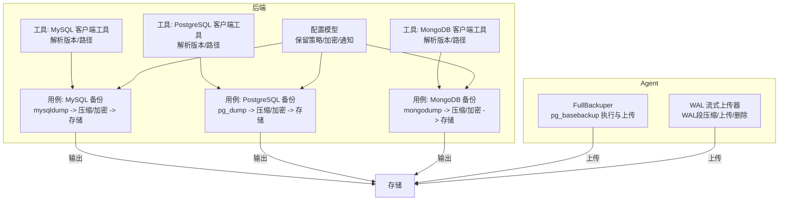
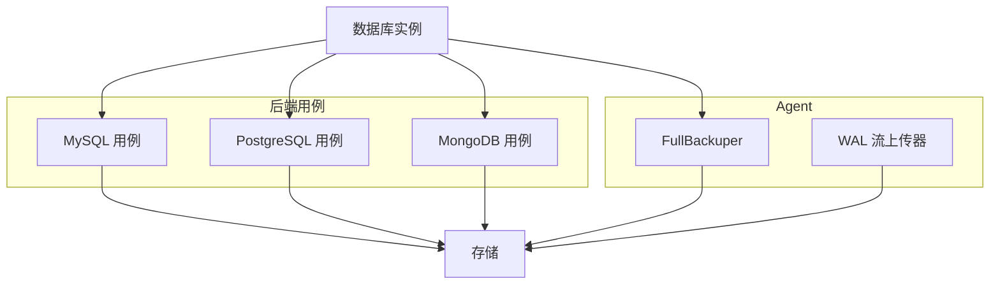
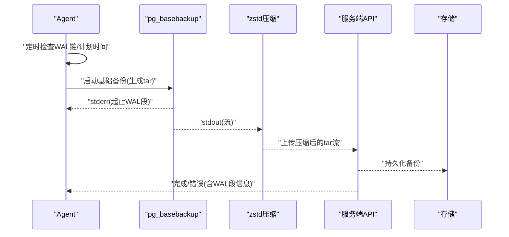
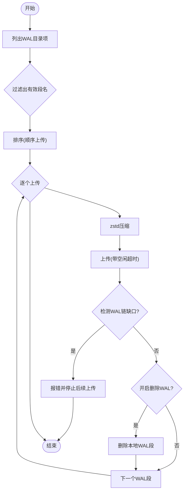
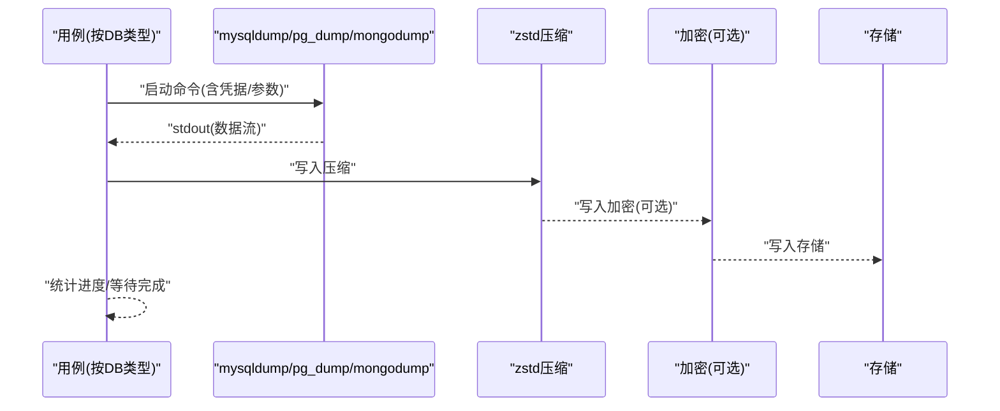
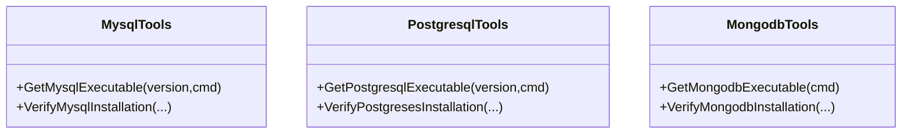
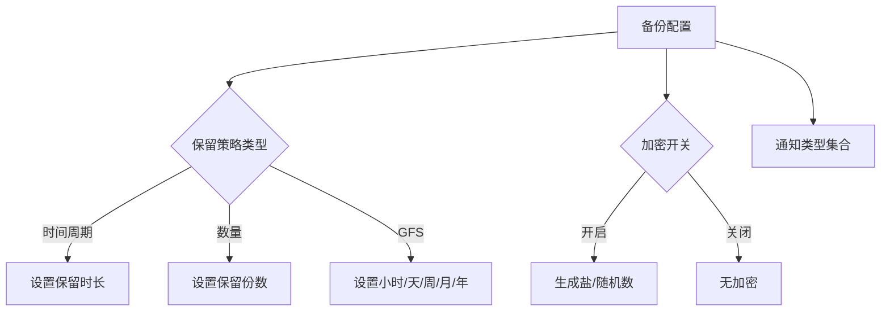
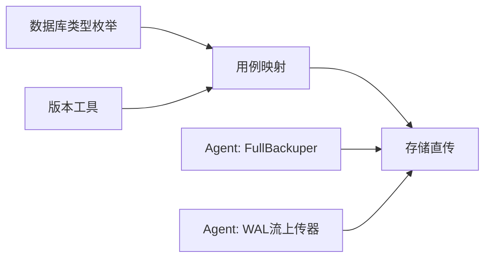

# 物理备份

<cite>
**本文引用的文件**
- [agent\internal\features\full_backup\backuper.go](file://agent\internal\features\full_backup\backuper.go)
- [agent\internal\features\wal\streamer.go](file://agent\internal\features\wal\streamer.go)
- [backend\internal\util\tools\mysql.go](file://backend\internal\util\tools\mysql.go)
- [backend\internal\util\tools\postgresql.go](file://backend\internal\util\tools\postgresql.go)
- [backend\internal\util\tools\mongodb.go](file://backend\internal\util\tools\mongodb.go)
- [backend\internal\features\backups\backups\usecases\mysql\create_backup_uc.go](file://backend\internal\features\backups\backups\usecases\mysql\create_backup_uc.go)
- [backend\internal\features\backups\backups\usecases\postgresql\create_backup_uc.go](file://backend\internal\features\backups\backups\usecases\postgresql\create_backup_uc.go)
- [backend\internal\features\backups\backups\usecases\mariadb\create_backup_uc.go](file://backend\internal\features\backups\backups\usecases\mariadb\create_backup_uc.go)
- [backend\internal\features\backups\backups\usecases\mongodb\create_backup_uc.go](file://backend\internal\features\backups\backups\usecases\mongodb\create_backup_uc.go)
- [backend\internal\features\backups\config\model.go](file://backend\internal\features\backups\config\model.go)
- [backend\internal\features\databases\enums.go](file://backend\internal\features\databases\enums.go)
- [backend\migrations\20260101200438_add_backup_format.sql](file://backend\migrations\20260101200438_add_backup_format.sql)
</cite>

## 目录
1. [简介](#简介)
2. [项目结构](#项目结构)
3. [核心组件](#核心组件)
4. [架构总览](#架构总览)
5. [详细组件分析](#详细组件分析)
6. [依赖分析](#依赖分析)
7. [性能考量](#性能考量)
8. [故障排查指南](#故障排查指南)
9. [结论](#结论)
10. [附录](#附录)

## 简介
本章节面向Databasus的“物理备份”能力，系统性阐述其核心理念与实现方式：对整个数据库集群进行文件级复制，覆盖数据目录、配置文件与WAL日志的完整打包与上传。文档同时对比物理备份与逻辑备份在恢复速度、数据一致性与存储占用方面的差异，并给出针对MySQL（mysqldump/pg_dump）、PostgreSQL（基础备份）与MongoDB（mongodump）的实现要点、在线备份策略、锁机制与增量备份的可行性说明，以及配置示例与最佳实践。

## 项目结构
围绕物理备份，后端与Agent侧的关键模块如下：
- 后端工具层：封装各数据库客户端工具路径解析与版本校验（MySQL、PostgreSQL、MongoDB）
- 后端用例层：按数据库类型执行逻辑备份（mysqldump/pg_dump/mongodump），并统一进行zstd压缩与加密、直传存储
- Agent侧：负责PostgreSQL的物理基础备份（pg_basebackup）与WAL流式上传，保障WAL链连续性
- 配置与模型：备份配置、保留策略、加密开关等

图表来源
- [backend\internal\util\tools\mysql.go:1-231](file://backend\internal\util\tools\mysql.go#L1-L231)
- [backend\internal\util\tools\postgresql.go:1-208](file://backend\internal\util\tools\postgresql.go#L1-L208)
- [backend\internal\util\tools\mongodb.go:1-179](file://backend\internal\util\tools\mongodb.go#L1-L179)
- [backend\internal\features\backups\backups\usecases\mysql\create_backup_uc.go:1-200](file://backend\internal\features\backups\backups\usecases\mysql\create_backup_uc.go#L1-L200)
- [backend\internal\features\backups\backups\usecases\postgresql\create_backup_uc.go:1-200](file://backend\internal\features\backups\backups\usecases\postgresql\create_backup_uc.go#L1-L200)
- [backend\internal\features\backups\backups\usecases\mongodb\create_backup_uc.go:1-200](file://backend\internal\features\backups\backups\usecases\mongodb\create_backup_uc.go#L1-L200)
- [agent\internal\features\full_backup\backuper.go:1-317](file://agent\internal\features\full_backup\backuper.go#L1-L317)
- [agent\internal\features\wal\streamer.go:1-205](file://agent\internal\features\wal\streamer.go#L1-L205)

章节来源
- [backend\internal\util\tools\mysql.go:1-231](file://backend\internal\util\tools\mysql.go#L1-L231)
- [backend\internal\util\tools\postgresql.go:1-208](file://backend\internal\util\tools\postgresql.go#L1-L208)
- [backend\internal\util\tools\mongodb.go:1-179](file://backend\internal\util\tools\mongodb.go#L1-L179)
- [backend\internal\features\backups\backups\usecases\mysql\create_backup_uc.go:1-200](file://backend\internal\features\backups\backups\usecases\mysql\create_backup_uc.go#L1-L200)
- [backend\internal\features\backups\backups\usecases\postgresql\create_backup_uc.go:1-200](file://backend\internal\features\backups\backups\usecases\postgresql\create_backup_uc.go#L1-L200)
- [backend\internal\features\backups\backups\usecases\mongodb\create_backup_uc.go:1-200](file://backend\internal\features\backups\backups\usecases\mongodb\create_backup_uc.go#L1-L200)
- [agent\internal\features\full_backup\backuper.go:1-317](file://agent\internal\features\full_backup\backuper.go#L1-L317)
- [agent\internal\features\wal\streamer.go:1-205](file://agent\internal\features\wal\streamer.go#L1-L205)

## 核心组件
- 工具层（后端）：提供各数据库客户端工具的版本检测与路径解析，确保mysqldump/pg_dump/mongodump可用
- 用例层（后端）：按数据库类型构建命令参数，启动子进程，将标准输出通过管道直传至存储；同时进行zstd压缩与可选加密
- Agent侧（PostgreSQL）：周期检查WAL链有效性与计划任务，触发pg_basebackup生成物理全备；并发上传压缩后的tar流；独立于全备运行的WAL流上传器持续推送WAL段
- 配置模型：定义备份配置、保留策略、通知与加密开关，支撑不同数据库类型的备份策略

章节来源
- [backend\internal\util\tools\mysql.go:1-231](file://backend\internal\util\tools\mysql.go#L1-L231)
- [backend\internal\util\tools\postgresql.go:1-208](file://backend\internal\util\tools\postgresql.go#L1-L208)
- [backend\internal\util\tools\mongodb.go:1-179](file://backend\internal\util\tools\mongodb.go#L1-L179)
- [backend\internal\features\backups\backups\usecases\mysql\create_backup_uc.go:1-200](file://backend\internal\features\backups\backups\usecases\mysql\create_backup_uc.go#L1-L200)
- [backend\internal\features\backups\backups\usecases\postgresql\create_backup_uc.go:1-200](file://backend\internal\features\backups\backups\usecases\postgresql\create_backup_uc.go#L1-L200)
- [backend\internal\features\backups\backups\usecases\mongodb\create_backup_uc.go:1-200](file://backend\internal\features\backups\backups\usecases\mongodb\create_backup_uc.go#L1-L200)
- [agent\internal\features\full_backup\backuper.go:1-317](file://agent\internal\features\full_backup\backuper.go#L1-L317)
- [agent\internal\features\wal\streamer.go:1-205](file://agent\internal\features\wal\streamer.go#L1-L205)
- [backend\internal\features\backups\config\model.go:1-156](file://backend\internal\features\backups\config\model.go#L1-L156)

## 架构总览
下图展示从数据库到存储的两条路径：逻辑备份（后端用例）与物理备份（Agent侧）。两者均支持zstd压缩与可选加密，并最终写入存储。

图表来源
- [backend\internal\features\backups\backups\usecases\mysql\create_backup_uc.go:1-200](file://backend\internal\features\backups\backups\usecases\mysql\create_backup_uc.go#L1-L200)
- [backend\internal\features\backups\backups\usecases\postgresql\create_backup_uc.go:1-200](file://backend\internal\features\backups\backups\usecases\postgresql\create_backup_uc.go#L1-L200)
- [backend\internal\features\backups\backups\usecases\mongodb\create_backup_uc.go:1-200](file://backend\internal\features\backups\backups\usecases\mongodb\create_backup_uc.go#L1-L200)
- [agent\internal\features\full_backup\backuper.go:1-317](file://agent\internal\features\full_backup\backuper.go#L1-L317)
- [agent\internal\features\wal\streamer.go:1-205](file://agent\internal\features\wal\streamer.go#L1-L205)

## 详细组件分析

### 组件A：PostgreSQL 物理全备（Agent）
- 触发条件：定期检查WAL链有效性或到达计划时间点
- 执行流程：调用pg_basebackup生成tar格式输出，标准错误解析起止WAL段，标准输出经zstd压缩后直传服务器接口
- 并发特性：全备期间WAL上传不中断，保持WAL链连续性
- 错误处理：失败时上报错误并按固定间隔重试，直到成功或上下文取消

图表来源
- [agent\internal\features\full_backup\backuper.go:66-245](file://agent\internal\features\full_backup\backuper.go#L66-L245)

章节来源
- [agent\internal\features\full_backup\backuper.go:1-317](file://agent\internal\features\full_backup\backuper.go#L1-L317)

### 组件B：WAL流上传器（Agent）
- 轮询扫描WAL目录，识别合法段名并按序上传
- 对每个WAL段进行zstd压缩后上传，支持上传空闲超时与断流检测
- 可选上传后删除本地WAL段以节省空间

图表来源
- [agent\internal\features\wal\streamer.go:63-173](file://agent\internal\features\wal\streamer.go#L63-L173)

章节来源
- [agent\internal\features\wal\streamer.go:1-205](file://agent\internal\features\wal\streamer.go#L1-L205)

### 组件C：MySQL/PostgreSQL/MongoDB 逻辑备份（后端用例）
- 参数构建：根据数据库类型与权限动态拼接mysqldump/pg_dump/mongodump参数
- 执行与直传：启动子进程，标准输出经zstd压缩与可选加密后直接写入存储
- 进度上报：基于计数写入器统计MB级进度
- 错误处理：捕获stderr与子进程退出码，统一构造错误消息

图表来源
- [backend\internal\features\backups\backups\usecases\mysql\create_backup_uc.go:144-278](file://backend\internal\features\backups\backups\usecases\mysql\create_backup_uc.go#L144-L278)
- [backend\internal\features\backups\backups\usecases\postgresql\create_backup_uc.go:108-200](file://backend\internal\features\backups\backups\usecases\postgresql\create_backup_uc.go#L108-L200)
- [backend\internal\features\backups\backups\usecases\mongodb\create_backup_uc.go:115-200](file://backend\internal\features\backups\backups\usecases\mongodb\create_backup_uc.go#L115-L200)

章节来源
- [backend\internal\features\backups\backups\usecases\mysql\create_backup_uc.go:1-200](file://backend\internal\features\backups\backups\usecases\mysql\create_backup_uc.go#L1-L200)
- [backend\internal\features\backups\backups\usecases\postgresql\create_backup_uc.go:1-200](file://backend\internal\features\backups\backups\usecases\postgresql\create_backup_uc.go#L1-L200)
- [backend\internal\features\backups\backups\usecases\mongodb\create_backup_uc.go:1-200](file://backend\internal\features\backups\backups\usecases\mongodb\create_backup_uc.go#L1-L200)

### 组件D：工具层（版本与路径解析）
- MySQL：支持5.7/8.0/8.4/9，自动拼接可执行文件路径，Windows附加.exe扩展
- PostgreSQL：支持12-18版本，自动拼接pg_dump等工具路径
- MongoDB：使用单套数据库工具，兼容多版本服务器

图表来源
- [backend\internal\util\tools\mysql.go:30-47](file://backend\internal\util\tools\mysql.go#L30-L47)
- [backend\internal\util\tools\postgresql.go:14-32](file://backend\internal\util\tools\postgresql.go#L14-L32)
- [backend\internal\util\tools\mongodb.go:31-47](file://backend\internal\util\tools\mongodb.go#L31-L47)

章节来源
- [backend\internal\util\tools\mysql.go:1-231](file://backend\internal\util\tools\mysql.go#L1-L231)
- [backend\internal\util\tools\postgresql.go:1-208](file://backend\internal\util\tools\postgresql.go#L1-L208)
- [backend\internal\util\tools\mongodb.go:1-179](file://backend\internal\util\tools\mongodb.go#L1-L179)

### 组件E：备份配置与保留策略
- 支持按时间周期、数量、GFS等多种保留策略
- 加密开关与通知类型字符串化存储
- 在云环境强制加密

图表来源
- [backend\internal\features\backups\config\model.go:16-108](file://backend\internal\features\backups\config\model.go#L16-L108)

章节来源
- [backend\internal\features\backups\config\model.go:1-156](file://backend\internal\features\backups\config\model.go#L1-L156)

## 依赖分析
- 数据库类型枚举：统一标识POSTGRES/MYSQL/MARIADB/MONGODB，便于路由到对应用例与工具
- 版本工具：按环境模式与安装目录解析客户端工具路径，避免硬编码
- 用例依赖：统一的zstd压缩、可选加密、进度统计与存储直传流程
- Agent依赖：PostgreSQL专用的物理备份与WAL流上传，二者相互独立但共同维护WAL链完整性

图表来源
- [backend\internal\features\databases\enums.go:1-18](file://backend\internal\features\databases\enums.go#L1-L18)
- [backend\internal\util\tools\mysql.go:30-47](file://backend\internal\util\tools\mysql.go#L30-L47)
- [backend\internal\util\tools\postgresql.go:14-32](file://backend\internal\util\tools\postgresql.go#L14-L32)
- [backend\internal\util\tools\mongodb.go:31-47](file://backend\internal\util\tools\mongodb.go#L31-L47)
- [agent\internal\features\full_backup\backuper.go:1-317](file://agent\internal\features\full_backup\backuper.go#L1-L317)
- [agent\internal\features\wal\streamer.go:1-205](file://agent\internal\features\wal\streamer.go#L1-L205)

章节来源
- [backend\internal\features\databases\enums.go:1-18](file://backend\internal\features\databases\enums.go#L1-L18)
- [backend\internal\util\tools\mysql.go:1-231](file://backend\internal\util\tools\mysql.go#L1-L231)
- [backend\internal\util\tools\postgresql.go:1-208](file://backend\internal\util\tools\postgresql.go#L1-L208)
- [backend\internal\util\tools\mongodb.go:1-179](file://backend\internal\util\tools\mongodb.go#L1-L179)
- [agent\internal\features\full_backup\backuper.go:1-317](file://agent\internal\features\full_backup\backuper.go#L1-L317)
- [agent\internal\features\wal\streamer.go:1-205](file://agent\internal\features\wal\streamer.go#L1-L205)

## 性能考量
- 压缩级别：统一采用中等压缩等级，平衡CPU与带宽占用
- 管道直传：避免落盘，减少I/O放大
- 并发与资源：PostgreSQL用例依据CPU核数调整并行集合数（上限16），平衡吞吐与资源
- WAL链连续性：Agent侧WAL上传与全备互不影响，降低停机窗口

## 故障排查指南
- 全备失败重试：Agent侧全备失败会上报错误并按分钟级延迟重试，直至成功或取消
- WAL链缺口：WAL上传器检测到缺口会返回错误并停止后续上传，需先修复链路再继续
- 子进程与stderr：后端用例捕获stderr与退出码，结合命令行安全脱敏记录，便于定位问题
- 凭据与环境变量：MySQL使用临时配置文件，PostgreSQL使用.pgpass文件，注意权限与清理

章节来源
- [agent\internal\features\full_backup\backuper.go:126-162](file://agent\internal\features\full_backup\backuper.go#L126-L162)
- [agent\internal\features\wal\streamer.go:123-173](file://agent\internal\features\wal\streamer.go#L123-L173)
- [backend\internal\features\backups\backups\usecases\mysql\create_backup_uc.go:144-278](file://backend\internal\features\backups\backups\usecases\mysql\create_backup_uc.go#L144-L278)
- [backend\internal\features\backups\backups\usecases\postgresql\create_backup_uc.go:108-200](file://backend\internal\features\backups\backups\usecases\postgresql\create_backup_uc.go#L108-L200)
- [backend\internal\features\backups\backups\usecases\mongodb\create_backup_uc.go:115-200](file://backend\internal\features\backups\backups\usecases\mongodb\create_backup_uc.go#L115-L200)

## 结论
Databasus通过“逻辑备份+物理备份”的双轨方案，兼顾易用性与可靠性。逻辑备份覆盖MySQL/PostgreSQL/MongoDB，具备灵活的参数与加密能力；物理备份聚焦PostgreSQL，结合WAL流上传保障链路连续性。两者均采用zstd压缩与可选加密，配合完善的配置与保留策略，满足不同场景下的备份需求。

## 附录

### 物理备份与逻辑备份对比
- 恢复速度：物理备份通常更快，因为直接复制数据页与WAL，无需重建索引与解析SQL
- 一致性：物理备份在一致的时间点（如pg_basebackup）抓取，结合WAL链保证一致性；逻辑备份依赖事务隔离级别与导出参数
- 存储占用：物理备份更接近原生数据大小，逻辑备份受压缩与格式影响，通常更小

### 支持的数据库类型与实现要点
- MySQL：使用mysqldump，按版本选择zstd或传统压缩，支持权限触发器/事件导出
- PostgreSQL：使用pg_dump自定义格式，支持并行集合与连接超时控制
- MongoDB：使用mongodump归档输出，支持并行集合数与gzip压缩

章节来源
- [backend\internal\features\backups\backups\usecases\mysql\create_backup_uc.go:101-161](file://backend\internal\features\backups\backups\usecases\mysql\create_backup_uc.go#L101-L161)
- [backend\internal\features\backups\backups\usecases\postgresql\create_backup_uc.go:107-147](file://backend\internal\features\backups\backups\usecases\postgresql\create_backup_uc.go#L107-L147)
- [backend\internal\features\backups\backups\usecases\mongodb\create_backup_uc.go:92-113](file://backend\internal\features\backups\backups\usecases\mongodb\create_backup_uc.go#L92-L113)

### 锁机制与在线备份策略
- MySQL：使用单事务导出，避免DDL锁；可选跳过锁表参数
- PostgreSQL：pg_dump自定义格式为只读导出，不影响写入；可通过连接超时与并行参数平衡性能
- MongoDB：mongodump默认不阻塞写入，支持并行集合提升吞吐

章节来源
- [backend\internal\features\backups\backups\usecases\mysql\create_backup_uc.go:101-139](file://backend\internal\features\backups\backups\usecases\mysql\create_backup_uc.go#L101-L139)
- [backend\internal\features\backups\backups\usecases\postgresql\create_backup_uc.go:107-147](file://backend\internal\features\backups\backups\usecases\postgresql\create_backup_uc.go#L107-L147)
- [backend\internal\features\backups\backups\usecases\mongodb\create_backup_uc.go:92-113](file://backend\internal\features\backups\backups\usecases\mongodb\create_backup_uc.go#L92-L113)

### 增量物理备份的实现思路
- PostgreSQL：结合WAL流上传器，将WAL段作为增量载体；当WAL链连续时可实现近似物理增量
- MySQL/PostgreSQL：当前实现以逻辑备份为主，物理增量可通过外部工具（如Percona XtraBackup）集成，需评估锁与一致性策略
- MongoDB：逻辑备份已支持并行集合，物理增量可通过快照卷管理实现，需结合存储后端能力

章节来源
- [agent\internal\features\wal\streamer.go:1-205](file://agent\internal\features\wal\streamer.go#L1-L205)
- [backend\internal\features\backups\backups\usecases\mysql\create_backup_uc.go:101-161](file://backend\internal\features\backups\backups\usecases\mysql\create_backup_uc.go#L101-L161)
- [backend\internal\features\backups\backups\usecases\postgresql\create_backup_uc.go:107-147](file://backend\internal\features\backups\backups\usecases\postgresql\create_backup_uc.go#L107-L147)

### 配置示例与最佳实践
- 备份配置
  - 启用备份、设置保留策略（时间/数量/GFS）、通知类型、失败重试次数与加密开关
  - 云环境强制加密
- 最佳实践
  - 使用zstd压缩与可选加密，平衡传输效率与安全性
  - PostgreSQL并行集合数不超过16，避免过度竞争
  - WAL链连续性优先，出现缺口需先修复再继续
  - 逻辑备份前评估锁策略与网络压缩参数

章节来源
- [backend\internal\features\backups\config\model.go:16-108](file://backend\internal\features\backups\config\model.go#L16-L108)
- [backend\migrations\20260101200438_add_backup_format.sql:1-9](file://backend\migrations\20260101200438_add_backup_format.sql#L1-L9)