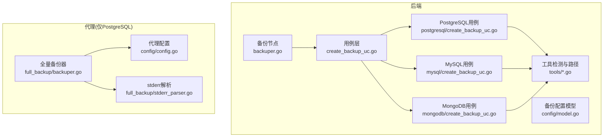
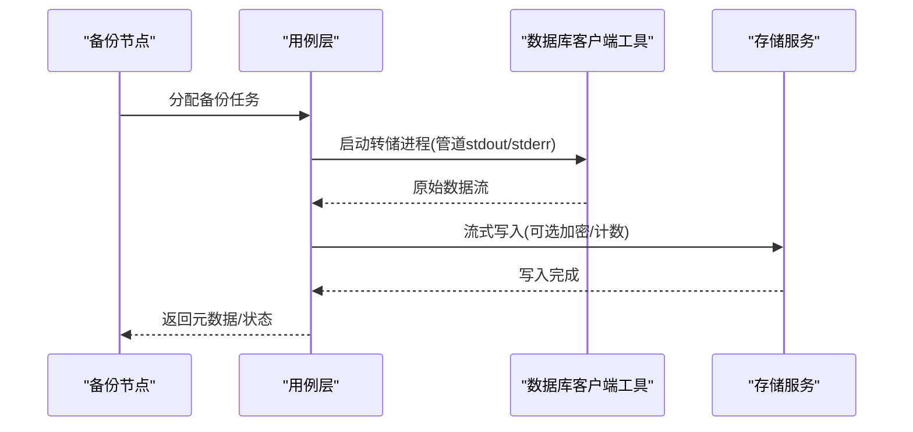
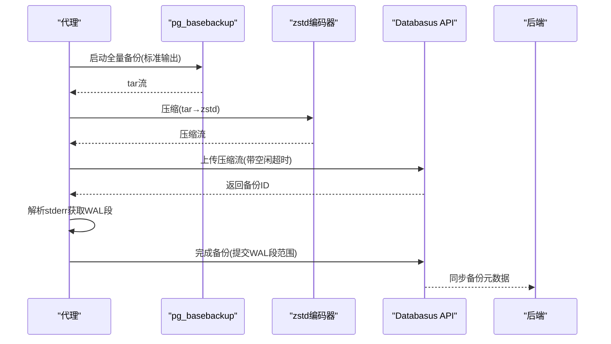
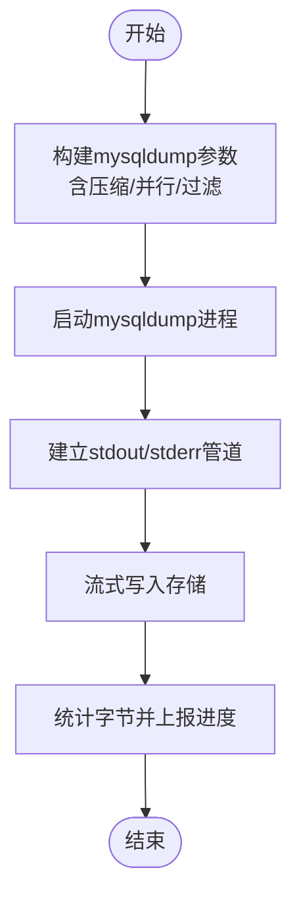
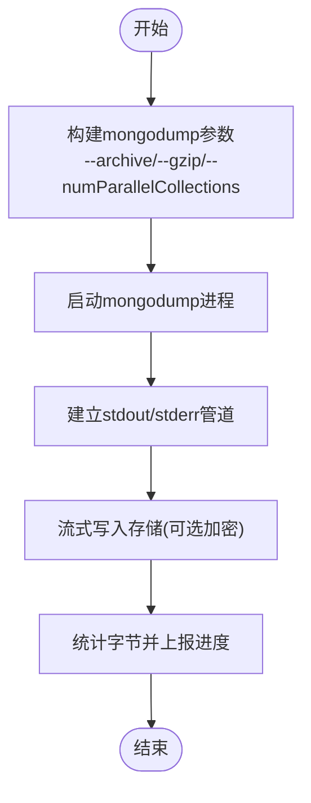
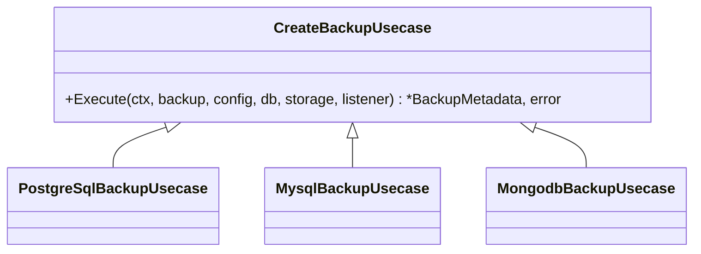
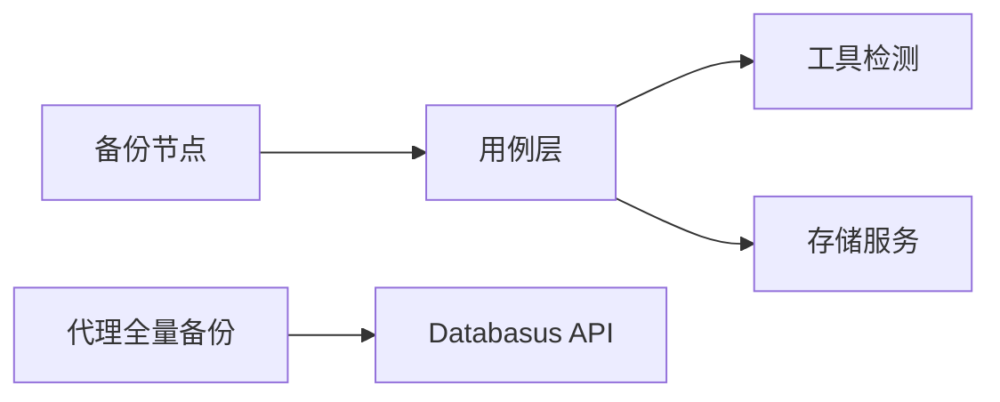

# 逻辑备份

<cite>
**本文引用的文件**
- [agent/internal/features/full_backup/backuper.go](file://agent/internal/features/full_backup/backuper.go)
- [agent/internal/features/full_backup/stderr_parser.go](file://agent/internal/features/full_backup/stderr_parser.go)
- [agent/internal/config/config.go](file://agent/internal/config/config.go)
- [backend/internal/features/backups/backups/backuping/backuper.go](file://backend/internal/features/backups/backups/backuping/backuper.go)
- [backend/internal/features/backups/backups/usecases/mongodb/create_backup_uc.go](file://backend/internal/features/backups/backups/usecases/mongodb/create_backup_uc.go)
- [backend/internal/features/backups/backups/usecases/mysql/create_backup_uc.go](file://backend/internal/features/backups/backups/usecases/mysql/create_backup_uc.go)
- [backend/internal/features/backups/backups/usecases/postgresql/create_backup_uc.go](file://backend/internal/features/backups/backups/usecases/postgresql/create_backup_uc.go)
- [backend/internal/util/tools/mysql.go](file://backend/internal/util/tools/mysql.go)
- [backend/internal/util/tools/postgresql.go](file://backend/internal/util/tools/postgresql.go)
- [backend/internal/util/tools/mongodb.go](file://backend/internal/util/tools/mongodb.go)
- [backend/internal/util/tools/mariadb.go](file://backend/internal/util/tools/mariadb.go)
- [backend/internal/features/backups/config/model.go](file://backend/internal/features/backups/config/model.go)
- [backend/internal/features/backups/backups/usecases/create_backup_uc.go](file://backend/internal/features/backups/backups/usecases/create_backup_uc.go)
</cite>

## 目录
1. [简介](#简介)
2. [项目结构](#项目结构)
3. [核心组件](#核心组件)
4. [架构总览](#架构总览)
5. [详细组件分析](#详细组件分析)
6. [依赖分析](#依赖分析)
7. [性能考虑](#性能考虑)
8. [故障排查指南](#故障排查指南)
9. [结论](#结论)
10. [附录](#附录)

## 简介
本文件面向Databasus的“逻辑备份”能力，系统性阐述其工作原理与实现细节，覆盖以下方面：
- 数据库引擎特定的原生转储流程：PostgreSQL（pg_dump）、MySQL（mysqldump）、MongoDB（mongodump）等
- 压缩与流式传输：压缩算法选择、编码器配置、流式上传与空闲超时控制
- 大型数据库的内存与带宽管理：管道分层、进度上报、取消与重试
- 不同数据库类型的逻辑备份特点与差异
- 配置参数详解：并发度、超时、重试、加密与保留策略
- 实际执行示例与性能优化建议

## 项目结构
逻辑备份在后端由“调度节点”驱动，按数据库类型调用对应客户端工具进行原生转储；在代理侧（PostgreSQL场景）负责全量备份的触发、压缩与上传。

图表来源
- [backend/internal/features/backups/backups/backuping/backuper.go:51-116](file://backend/internal/features/backups/backups/backuping/backuper.go#L51-L116)
- [backend/internal/features/backups/backups/usecases/create_backup_uc.go](file://backend/internal/features/backups/backups/usecases/create_backup_uc.go)
- [backend/internal/features/backups/backups/usecases/postgresql/create_backup_uc.go](file://backend/internal/features/backups/backups/usecases/postgresql/create_backup_uc.go)
- [backend/internal/features/backups/backups/usecases/mysql/create_backup_uc.go:163-196](file://backend/internal/features/backups/backups/usecases/mysql/create_backup_uc.go#L163-L196)
- [backend/internal/features/backups/backups/usecases/mongodb/create_backup_uc.go:115-197](file://backend/internal/features/backups/backups/usecases/mongodb/create_backup_uc.go#L115-L197)
- [backend/internal/util/tools/mysql.go:30-47](file://backend/internal/util/tools/mysql.go#L30-L47)
- [backend/internal/util/tools/postgresql.go:17-32](file://backend/internal/util/tools/postgresql.go#L17-L32)
- [backend/internal/util/tools/mongodb.go:31-47](file://backend/internal/util/tools/mongodb.go#L31-L47)
- [agent/internal/features/full_backup/backuper.go:164-245](file://agent/internal/features/full_backup/backuper.go#L164-L245)
- [agent/internal/features/full_backup/stderr_parser.go](file://agent/internal/features/full_backup/stderr_parser.go)
- [agent/internal/config/config.go:16-31](file://agent/internal/config/config.go#L16-L31)

章节来源
- [backend/internal/features/backups/backups/backuping/backuper.go:51-116](file://backend/internal/features/backups/backups/backuping/backuper.go#L51-L116)
- [agent/internal/features/full_backup/backuper.go:164-245](file://agent/internal/features/full_backup/backuper.go#L164-L245)

## 核心组件
- 后端备份节点：接收分配到的备份任务，拉取数据库与存储配置，调用对应数据库的用例执行转储与上传，更新进度与状态，发送通知。
- 数据库用例：根据数据库类型构建命令行参数，启动子进程，通过管道将原始输出直接流式写入存储；对PostgreSQL还进行zstd压缩。
- 工具检测：按版本定位pg_dump/mysqldump/mongodump等可执行文件，确保环境可用。
- 代理（PostgreSQL全量备份）：周期检查WAL链有效性或计划时间，触发pg_basebackup，将tar输出经zstd压缩后流式上传，解析stderr中的WAL段信息完成收尾。

章节来源
- [backend/internal/features/backups/backups/backuping/backuper.go:122-360](file://backend/internal/features/backups/backups/backuping/backuper.go#L122-L360)
- [backend/internal/features/backups/backups/usecases/create_backup_uc.go](file://backend/internal/features/backups/backups/usecases/create_backup_uc.go)
- [backend/internal/util/tools/mysql.go:30-47](file://backend/internal/util/tools/mysql.go#L30-L47)
- [backend/internal/util/tools/postgresql.go:17-32](file://backend/internal/util/tools/postgresql.go#L17-L32)
- [backend/internal/util/tools/mongodb.go:31-47](file://backend/internal/util/tools/mongodb.go#L31-L47)
- [agent/internal/features/full_backup/backuper.go:164-245](file://agent/internal/features/full_backup/backuper.go#L164-L245)

## 架构总览
下图展示从“备份节点”到“数据库用例”再到“外部工具”的调用链路，以及PostgreSQL在代理侧的全量备份流程。

图表来源
- [backend/internal/features/backups/backups/backuping/backuper.go:171-178](file://backend/internal/features/backups/backups/backuping/backuper.go#L171-L178)
- [backend/internal/features/backups/backups/usecases/create_backup_uc.go](file://backend/internal/features/backups/backups/usecases/create_backup_uc.go)

## 详细组件分析

### PostgreSQL逻辑备份（pg_dump）
- 转储方式：使用pg_dump生成自定义格式（custom format），该格式支持并行化与压缩，适合大规模数据库的高效备份与恢复。
- 并行与压缩：在后端用例中，通过参数启用并行度与压缩算法，提升吞吐与减小体积。
- 代理侧全量备份：若为PostgreSQL且采用代理模式，使用pg_basebackup以物理全量方式导出，再以tar打包并通过zstd压缩流式上传，stderr中记录WAL起止段号用于后续校验与归档。

图表来源
- [agent/internal/features/full_backup/backuper.go:164-245](file://agent/internal/features/full_backup/backuper.go#L164-L245)
- [agent/internal/features/full_backup/stderr_parser.go](file://agent/internal/features/full_backup/stderr_parser.go)
- [agent/internal/config/config.go:16-31](file://agent/internal/config/config.go#L16-L31)

章节来源
- [agent/internal/features/full_backup/backuper.go:164-245](file://agent/internal/features/full_backup/backuper.go#L164-L245)
- [agent/internal/features/full_backup/stderr_parser.go](file://agent/internal/features/full_backup/stderr_parser.go)
- [agent/internal/config/config.go:16-31](file://agent/internal/config/config.go#L16-L31)

### MySQL逻辑备份（mysqldump）
- 压缩算法选择：优先使用zstd（当服务器版本支持）以获得更高压缩比与更快速度；否则回退到传统压缩。
- 参数构建：根据数据库配置与版本动态拼接mysqldump参数，包含连接信息、数据库名、表过滤、并行集合等。
- 流式上传：通过管道将mysqldump输出直接写入存储，同时统计字节数用于进度上报。

图表来源
- [backend/internal/features/backups/backups/usecases/mysql/create_backup_uc.go:148-161](file://backend/internal/features/backups/backups/usecases/mysql/create_backup_uc.go#L148-L161)
- [backend/internal/features/backups/backups/usecases/mysql/create_backup_uc.go:163-196](file://backend/internal/features/backups/backups/usecases/mysql/create_backup_uc.go#L163-L196)

章节来源
- [backend/internal/features/backups/backups/usecases/mysql/create_backup_uc.go:148-161](file://backend/internal/features/backups/backups/usecases/mysql/create_backup_uc.go#L148-L161)
- [backend/internal/features/backups/backups/usecases/mysql/create_backup_uc.go:163-196](file://backend/internal/features/backups/backups/usecases/mysql/create_backup_uc.go#L163-L196)

### MongoDB逻辑备份（mongodump）
- 输出格式：使用--archive与--gzip生成BSON归档并压缩，便于流式传输与快速恢复。
- 并发度控制：基于CPU核数动态设置并行集合数，上限16，兼顾性能与资源占用。
- 流式上传：通过管道将mongodump输出直接写入存储，支持加密与进度统计。

图表来源
- [backend/internal/features/backups/backups/usecases/mongodb/create_backup_uc.go:92-113](file://backend/internal/features/backups/backups/usecases/mongodb/create_backup_uc.go#L92-L113)
- [backend/internal/features/backups/backups/usecases/mongodb/create_backup_uc.go:115-197](file://backend/internal/features/backups/backups/usecases/mongodb/create_backup_uc.go#L115-L197)

章节来源
- [backend/internal/features/backups/backups/usecases/mongodb/create_backup_uc.go:92-113](file://backend/internal/features/backups/backups/usecases/mongodb/create_backup_uc.go#L92-L113)
- [backend/internal/features/backups/backups/usecases/mongodb/create_backup_uc.go:115-197](file://backend/internal/features/backups/backups/usecases/mongodb/create_backup_uc.go#L115-L197)

### 通用用例与工具检测
- 用例抽象：统一的CreateBackupUsecase接口，各数据库类型实现具体参数构建与流式写入逻辑。
- 工具检测：按版本定位pg_dump/mysqldump/mongodump等可执行文件，开发与生产环境路径不同，Windows自动追加.exe扩展名。

图表来源
- [backend/internal/features/backups/backups/usecases/create_backup_uc.go](file://backend/internal/features/backups/backups/usecases/create_backup_uc.go)
- [backend/internal/util/tools/postgresql.go:17-32](file://backend/internal/util/tools/postgresql.go#L17-L32)
- [backend/internal/util/tools/mysql.go:30-47](file://backend/internal/util/tools/mysql.go#L30-L47)
- [backend/internal/util/tools/mongodb.go:31-47](file://backend/internal/util/tools/mongodb.go#L31-L47)

章节来源
- [backend/internal/features/backups/backups/usecases/create_backup_uc.go](file://backend/internal/features/backups/backups/usecases/create_backup_uc.go)
- [backend/internal/util/tools/postgresql.go:17-32](file://backend/internal/util/tools/postgresql.go#L17-L32)
- [backend/internal/util/tools/mysql.go:30-47](file://backend/internal/util/tools/mysql.go#L30-L47)
- [backend/internal/util/tools/mongodb.go:31-47](file://backend/internal/util/tools/mongodb.go#L31-L47)

## 依赖分析
- 组件耦合
  - 备份节点与用例层：通过统一接口解耦，便于新增数据库类型。
  - 用例层与工具检测：用例层依赖工具模块定位可执行文件，确保运行时可用。
  - 代理与API：代理负责PostgreSQL全量备份的触发、压缩与上传，依赖API完成元数据同步。
- 外部依赖
  - 数据库客户端工具：PostgreSQL/pg_dump、MySQL/mysqldump、MongoDB/mongodump。
  - 存储服务：抽象接口，支持多种后端（本地、S3、NAS等）。
- 潜在循环依赖：当前结构清晰，未发现循环导入。

图表来源
- [backend/internal/features/backups/backups/backuping/backuper.go:171-178](file://backend/internal/features/backups/backups/backuping/backuper.go#L171-L178)
- [backend/internal/util/tools/mysql.go:30-47](file://backend/internal/util/tools/mysql.go#L30-L47)
- [backend/internal/util/tools/postgresql.go:17-32](file://backend/internal/util/tools/postgresql.go#L17-L32)
- [backend/internal/util/tools/mongodb.go:31-47](file://backend/internal/util/tools/mongodb.go#L31-L47)
- [agent/internal/features/full_backup/backuper.go:164-245](file://agent/internal/features/full_backup/backuper.go#L164-L245)

章节来源
- [backend/internal/features/backups/backups/backuping/backuper.go:171-178](file://backend/internal/features/backups/backups/backuping/backuper.go#L171-L178)
- [agent/internal/features/full_backup/backuper.go:164-245](file://agent/internal/features/full_backup/backuper.go#L164-L245)

## 性能考虑
- 压缩算法与级别
  - PostgreSQL代理侧：使用zstd编码器，指定压缩级别与CRC校验，平衡压缩比与CPU开销。
  - MySQL：优先zstd（若服务器支持），否则回退到传统压缩；可通过参数调整zstd压缩级别。
  - MongoDB：使用--gzip，配合--numParallelCollections提升并行度。
- 并发度设置
  - MongoDB：基于CPU核数动态设置并行集合数，上限16。
  - MySQL：根据版本特性选择合适的压缩与并行参数。
- 流式传输与内存管理
  - 使用io.Pipe建立管道，避免将大体量备份数据加载至内存；结合进度监听与存储写入的异步协程，降低峰值内存占用。
- 超时与空闲控制
  - 上传阶段设置超时与空闲超时，防止长时间无数据导致连接僵死；代理侧对压缩流也设置了空闲超时回调。
- 取消与重试
  - 支持上下文取消；失败时按配置进行重试，避免单点故障导致备份中断。

章节来源
- [agent/internal/features/full_backup/backuper.go:247-269](file://agent/internal/features/full_backup/backuper.go#L247-L269)
- [backend/internal/features/backups/backups/usecases/mysql/create_backup_uc.go:148-161](file://backend/internal/features/backups/backups/usecases/mysql/create_backup_uc.go#L148-L161)
- [backend/internal/features/backups/backups/usecases/mongodb/create_backup_uc.go:105-110](file://backend/internal/features/backups/backups/usecases/mongodb/create_backup_uc.go#L105-L110)
- [backend/internal/features/backups/backups/backuping/backuper.go:156-158](file://backend/internal/features/backups/backups/backuping/backuper.go#L156-L158)

## 故障排查指南
- 常见问题
  - 工具不可用：确认对应版本的客户端工具已安装且路径正确；开发与生产环境路径不同。
  - 连接失败：检查数据库凭据、网络连通性与防火墙策略。
  - 上传中断：关注空闲超时与网络抖动；必要时增大超时阈值。
  - 失败重试：查看备份配置中的重试次数与通知开关，确保异常被正确上报。
- 排查步骤
  - 查看后端备份节点日志与进度；确认存储写入是否成功。
  - 对PostgreSQL代理侧，检查stderr解析结果与WAL段范围是否一致。
  - 对MySQL/MongoDB，确认命令行参数与环境变量（如LC_ALL/LANG）是否正确设置。
- 相关实现参考
  - 工具路径与版本检测：[GetPostgresqlExecutable:17-32](file://backend/internal/util/tools/postgresql.go#L17-L32)、[GetMysqlExecutable:30-47](file://backend/internal/util/tools/mysql.go#L30-L47)、[GetMongodbExecutable:31-47](file://backend/internal/util/tools/mongodb.go#L31-L47)
  - 上传与空闲超时：[executeAndUploadBasebackup:164-245](file://agent/internal/features/full_backup/backuper.go#L164-245)
  - 失败处理与重试：[MakeBackup:179-281](file://backend/internal/features/backups/backups/backuping/backuper.go#L179-L281)

章节来源
- [backend/internal/util/tools/postgresql.go:17-32](file://backend/internal/util/tools/postgresql.go#L17-L32)
- [backend/internal/util/tools/mysql.go:30-47](file://backend/internal/util/tools/mysql.go#L30-L47)
- [backend/internal/util/tools/mongodb.go:31-47](file://backend/internal/util/tools/mongodb.go#L31-L47)
- [agent/internal/features/full_backup/backuper.go:164-245](file://agent/internal/features/full_backup/backuper.go#L164-L245)
- [backend/internal/features/backups/backups/backuping/backuper.go:179-281](file://backend/internal/features/backups/backups/backuping/backuper.go#L179-L281)

## 结论
Databasus的逻辑备份体系以“用例层抽象 + 引擎特定工具 + 流式传输 + 压缩优化”为核心，既保证了对多数据库类型的兼容，又兼顾了大体量数据的性能与稳定性。通过合理的并发度、压缩策略与超时/重试机制，能够在复杂环境中可靠地完成备份任务，并提供可观测的进度与通知。

## 附录

### 配置参数详解（后端）
- 备份配置模型字段
  - 保留策略：时间周期、数量、GFS（小时/天/周/月/年）三者之一或组合
  - 通知开关：可按“成功/失败”分别配置
  - 重试机制：开启后需设置最大失败尝试次数
  - 加密：云存储场景强制加密，本地可选
- 关键字段与约束
  - 间隔ID必填；保留策略类型与对应字段必须满足约束
  - 加密字段仅允许“NONE/ENCRYPTED”
  - 云环境强制加密

章节来源
- [backend/internal/features/backups/config/model.go:16-44](file://backend/internal/features/backups/config/model.go#L16-L44)
- [backend/internal/features/backups/config/model.go:83-108](file://backend/internal/features/backups/config/model.go#L83-L108)
- [backend/internal/features/backups/config/model.go:132-155](file://backend/internal/features/backups/config/model.go#L132-L155)

### 配置参数详解（代理，PostgreSQL）
- 代理配置项
  - 服务器地址、数据库ID、令牌
  - PostgreSQL主机、端口、用户、密码
  - 运行模式：host或docker
  - 主机模式下可指定PG bin目录；docker模式下指定容器名
  - WAL队列目录与上传后删除策略
- 默认值与来源
  - 端口默认5432；运行模式默认host；删除WAL默认true
  - 配置来源支持JSON与命令行参数，命令行优先级更高

章节来源
- [agent/internal/config/config.go:16-31](file://agent/internal/config/config.go#L16-L31)
- [agent/internal/config/config.go:103-115](file://agent/internal/config/config.go#L103-L115)
- [agent/internal/config/config.go:179-234](file://agent/internal/config/config.go#L179-L234)

### 实际执行示例（步骤说明）
- PostgreSQL（代理全量）
  - 代理周期检查WAL链与计划时间，触发pg_basebackup
  - 将tar输出经zstd压缩后流式上传，解析stderr中的WAL段范围
  - 完成后向后端上报元数据
- MySQL
  - 根据版本选择zstd或传统压缩，构建mysqldump参数
  - 启动进程并通过管道流式写入存储，统计字节并上报进度
- MongoDB
  - 使用--archive与--gzip生成BSON归档，设置并行集合数
  - 通过管道流式写入存储，支持加密与进度统计

章节来源
- [agent/internal/features/full_backup/backuper.go:164-245](file://agent/internal/features/full_backup/backuper.go#L164-L245)
- [backend/internal/features/backups/backups/usecases/mysql/create_backup_uc.go:148-161](file://backend/internal/features/backups/backups/usecases/mysql/create_backup_uc.go#L148-L161)
- [backend/internal/features/backups/backups/usecases/mongodb/create_backup_uc.go:92-113](file://backend/internal/features/backups/backups/usecases/mongodb/create_backup_uc.go#L92-L113)