# Azure Blob存储

<cite>
**本文档引用的文件**
- [model.go](file://backend/internal/features/storages/models/azure_blob/model.go)
- [20251116195618_add_azure_blob_storage.sql](file://backend/migrations/20251116195618_add_azure_blob_storage.sql)
- [AzureBlobStorage.ts](file://frontend/src/entity/storages/models/AzureBlobStorage.ts)
- [model.go](file://backend/internal/features/storages/model.go)
- [service.go](file://backend/internal/features/storages/service.go)
- [controller.go](file://backend/internal/features/storages/controller.go)
- [di.go](file://backend/internal/features/storages/di.go)
- [field_encryptor.go](file://backend/internal/util/encryption/field_encryptor.go)
</cite>

## 目录
1. [简介](#简介)
2. [项目结构](#项目结构)
3. [核心组件](#核心组件)
4. [架构概览](#架构概览)
5. [详细组件分析](#详细组件分析)
6. [依赖关系分析](#依赖关系分析)
7. [性能考虑](#性能考虑)
8. [故障排除指南](#故障排除指南)
9. [结论](#结论)

## 简介

Databasus的Azure Blob存储功能提供了企业级的备份和归档解决方案。该系统支持两种主要的认证方式：连接字符串认证和账户密钥认证，确保了灵活的安全配置选项。

Azure Blob存储作为Databasus多云存储架构的核心组件，提供了以下关键特性：
- 支持多种认证方式（连接字符串和账户密钥）
- 前缀路径管理功能
- 加密敏感数据存储
- 容器级别的权限控制
- 高性能的分块上传机制

## 项目结构

Databasus的Azure Blob存储功能采用模块化设计，分布在后端和前端两个主要部分：

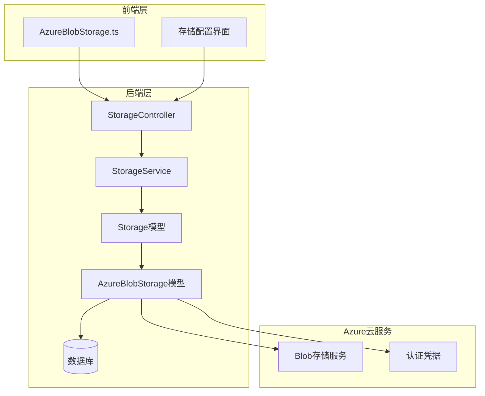

**图表来源**
- [model.go:1-420](file://backend/internal/features/storages/models/azure_blob/model.go#L1-L420)
- [controller.go:1-340](file://backend/internal/features/storages/controller.go#L1-L340)
- [service.go:1-409](file://backend/internal/features/storages/service.go#L1-L409)

**章节来源**
- [model.go:1-66](file://backend/internal/features/storages/models/azure_blob/model.go#L1-L66)
- [controller.go:19-27](file://backend/internal/features/storages/controller.go#L19-L27)

## 核心组件

### AzureBlobStorage模型

AzureBlobStorage模型是整个Azure存储功能的核心，定义了完整的存储配置结构：

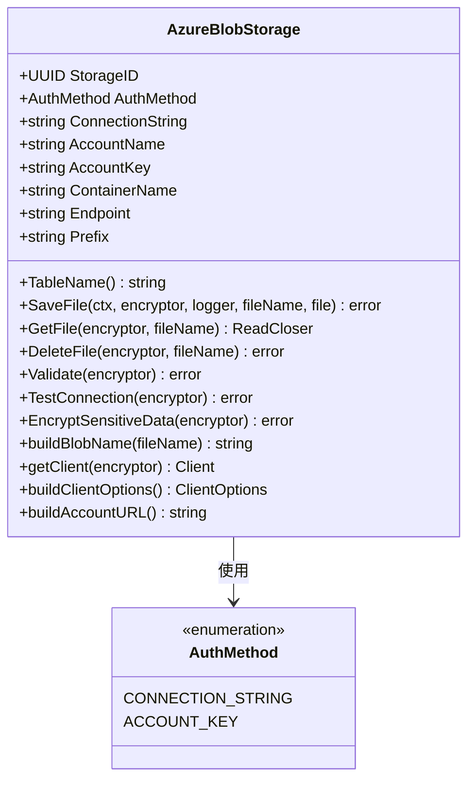

**图表来源**
- [model.go:46-62](file://backend/internal/features/storages/models/azure_blob/model.go#L46-L62)
- [model.go:346-387](file://backend/internal/features/storages/models/azure_blob/model.go#L346-L387)

### 存储类型枚举

系统支持多种存储类型，Azure Blob存储是其中之一：

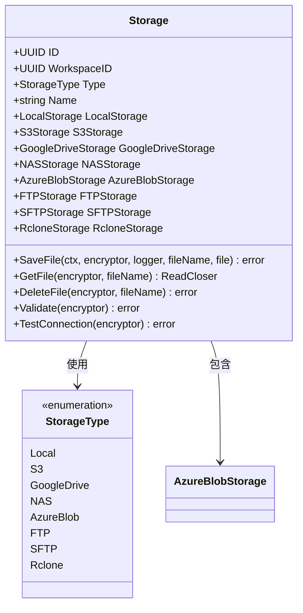

**图表来源**
- [model.go:22-39](file://backend/internal/features/storages/model.go#L22-L39)
- [model.go:163-184](file://backend/internal/features/storages/model.go#L163-L184)

**章节来源**
- [model.go:53-62](file://backend/internal/features/storages/models/azure_blob/model.go#L53-L62)
- [model.go:22-39](file://backend/internal/features/storages/model.go#L22-L39)

## 架构概览

Databasus的Azure Blob存储采用分层架构设计，确保了良好的可维护性和扩展性：

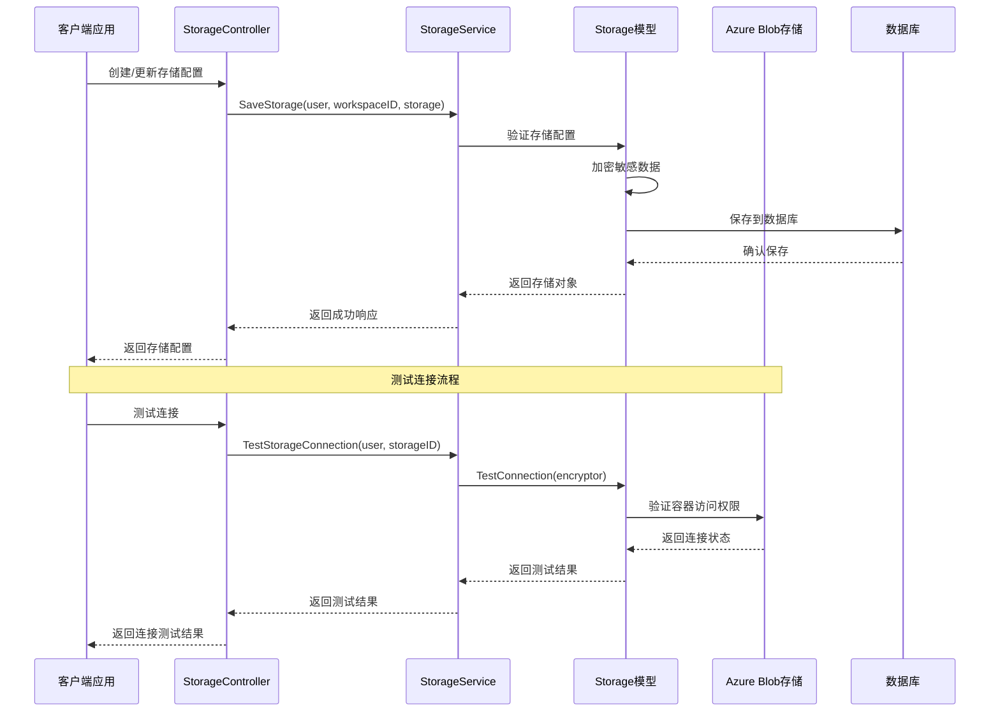

**图表来源**
- [controller.go:42-71](file://backend/internal/features/storages/controller.go#L42-L71)
- [service.go:54-147](file://backend/internal/features/storages/service.go#L54-L147)
- [model.go:41-85](file://backend/internal/features/storages/model.go#L41-L85)

## 详细组件分析

### 认证机制

Databasus支持两种主要的Azure Blob存储认证方式：

#### 连接字符串认证

连接字符串认证是最简单的方式，适用于开发和测试环境：

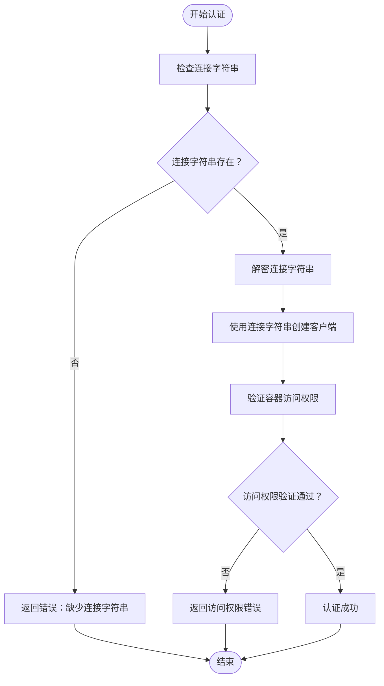

**图表来源**
- [model.go:352-365](file://backend/internal/features/storages/models/azure_blob/model.go#L352-L365)
- [model.go:216-222](file://backend/internal/features/storages/models/azure_blob/model.go#L216-L222)

#### 账户密钥认证

账户密钥认证提供了更细粒度的权限控制：

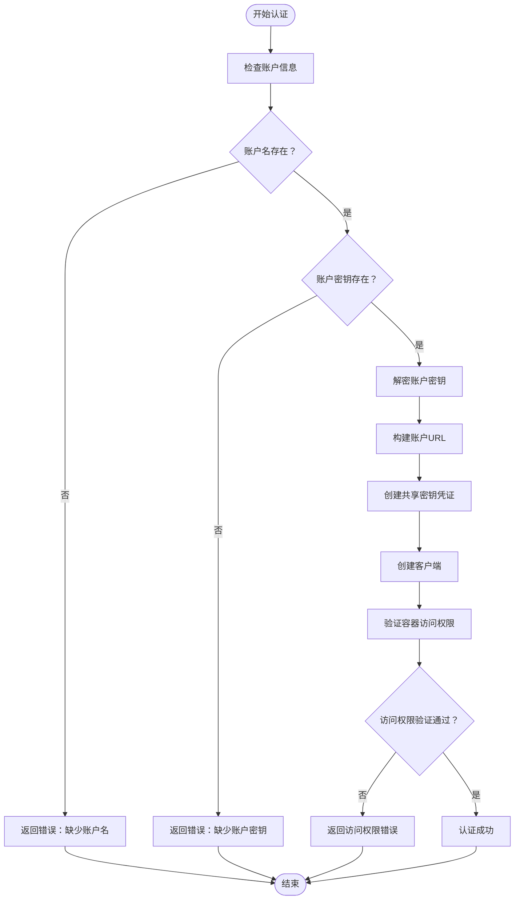

**图表来源**
- [model.go:366-384](file://backend/internal/features/storages/models/azure_blob/model.go#L366-L384)
- [model.go:223-229](file://backend/internal/features/storages/models/azure_blob/model.go#L223-L229)

**章节来源**
- [model.go:211-235](file://backend/internal/features/storages/models/azure_blob/model.go#L211-L235)
- [model.go:346-387](file://backend/internal/features/storages/models/azure_blob/model.go#L346-L387)

### 数据传输机制

Databasus实现了高效的分块上传机制，支持大文件的可靠传输：

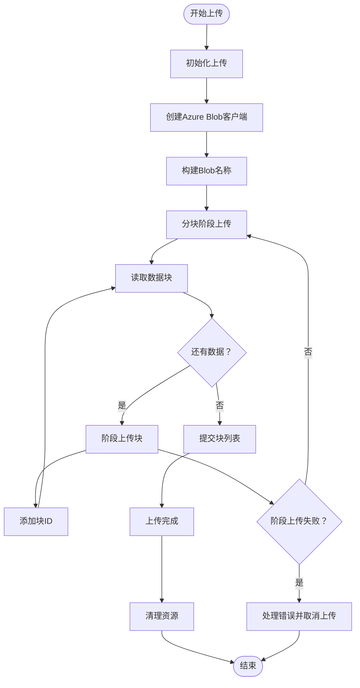

**图表来源**
- [model.go:68-157](file://backend/internal/features/storages/models/azure_blob/model.go#L68-L157)
- [model.go:95-135](file://backend/internal/features/storages/models/azure_blob/model.go#L95-L135)

### 前缀管理功能

前缀功能允许用户在容器内组织备份文件：

| 前缀配置 | 文件路径示例 |
|---------|-------------|
| `backups/` | `container/backups/backup_001.sql` |
| `prod/2024/` | `container/prod/2024/backup_001.sql` |
| `db1/` | `container/db1/backup_001.sql` |
| 空前缀 | `container/backup_001.sql` |

**章节来源**
- [model.go:331-344](file://backend/internal/features/storages/models/azure_blob/model.go#L331-L344)

### 数据库集成

Azure Blob存储配置与数据库的集成通过迁移脚本实现：

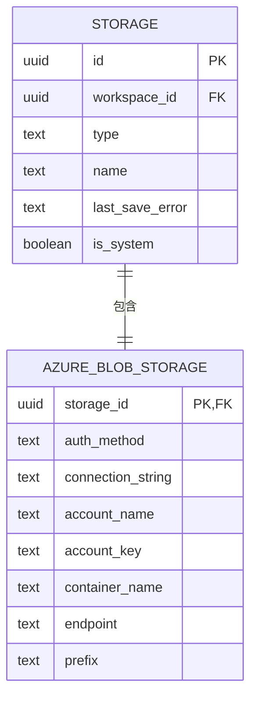

**图表来源**
- [20251116195618_add_azure_blob_storage.sql:4-13](file://backend/migrations/20251116195618_add_azure_blob_storage.sql#L4-L13)

**章节来源**
- [20251116195618_add_azure_blob_storage.sql:1-29](file://backend/migrations/20251116195618_add_azure_blob_storage.sql#L1-L29)

## 依赖关系分析

Databasus的Azure Blob存储功能具有清晰的依赖层次结构：

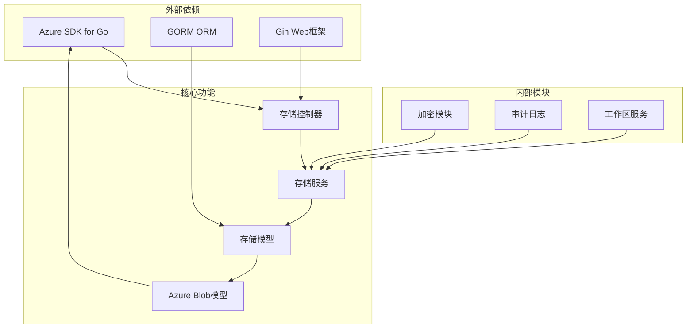

**图表来源**
- [di.go:11-25](file://backend/internal/features/storages/di.go#L11-L25)
- [service.go:16-22](file://backend/internal/features/storages/service.go#L16-L22)

**章节来源**
- [di.go:1-38](file://backend/internal/features/storages/di.go#L1-L38)
- [service.go:1-22](file://backend/internal/features/storages/service.go#L1-L22)

## 性能考虑

### 连接超时配置

系统为Azure Blob存储设置了合理的超时参数以确保稳定连接：

| 参数 | 值 | 用途 |
|------|-----|------|
| 连接超时 | 30秒 | 建立网络连接的最大时间 |
| 响应超时 | 30秒 | 等待服务器响应的时间 |
| TLS握手超时 | 30秒 | 完成SSL/TLS握手的时间 |
| 空闲连接超时 | 90秒 | 保持空闲连接的时间 |
| 删除操作超时 | 30秒 | 删除Blob操作的超时时间 |

### 分块上传优化

系统采用16MB的分块大小平衡内存使用和上传效率：

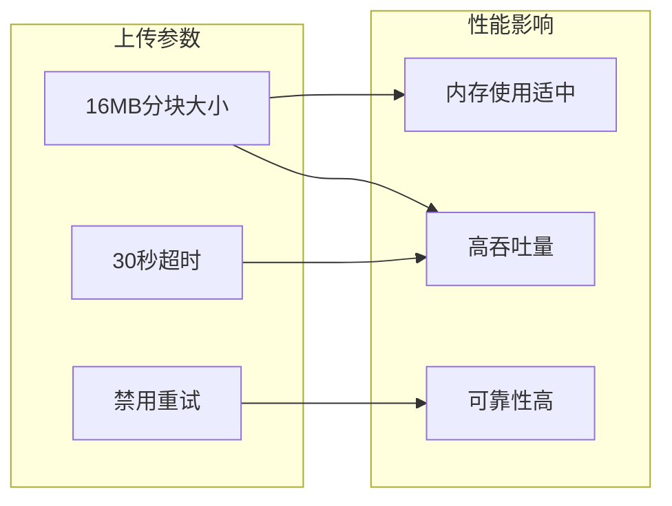

**图表来源**
- [model.go:25-36](file://backend/internal/features/storages/models/azure_blob/model.go#L25-L36)
- [model.go:389-407](file://backend/internal/features/storages/models/azure_blob/model.go#L389-L407)

### 加密性能

敏感数据加密采用异步处理，避免阻塞主上传流程：

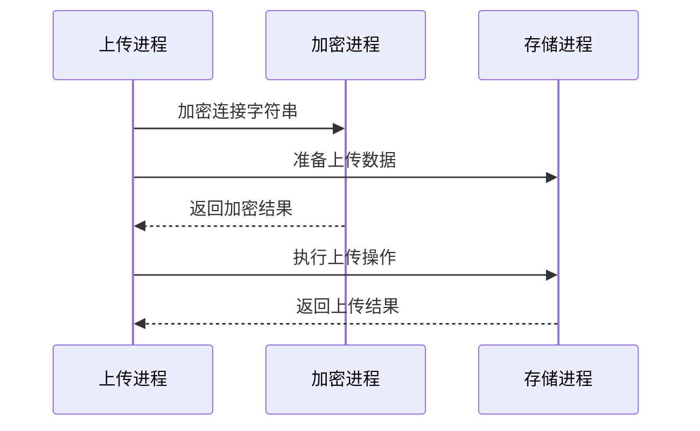

**图表来源**
- [model.go:293-311](file://backend/internal/features/storages/models/azure_blob/model.go#L293-L311)
- [field_encryptor.go:5-15](file://backend/internal/util/encryption/field_encryptor.go#L5-L15)

**章节来源**
- [model.go:25-407](file://backend/internal/features/storages/models/azure_blob/model.go#L25-L407)
- [field_encryptor.go:1-16](file://backend/internal/util/encryption/field_encryptor.go#L1-L16)

## 故障排除指南

### 常见认证问题

| 问题类型 | 错误信息 | 解决方案 |
|---------|---------|---------|
| 连接字符串无效 | "failed to create Azure Blob client from connection string" | 检查连接字符串格式和有效性 |
| 账户密钥错误 | "failed to decrypt Azure account key" | 验证账户密钥是否正确且已加密 |
| 权限不足 | "container does not exist" | 确认账户对容器有读写权限 |
| 网络超时 | "failed to connect to Azure Blob Storage" | 检查网络连接和防火墙设置 |

### 连接测试流程

系统提供了完整的连接测试机制：

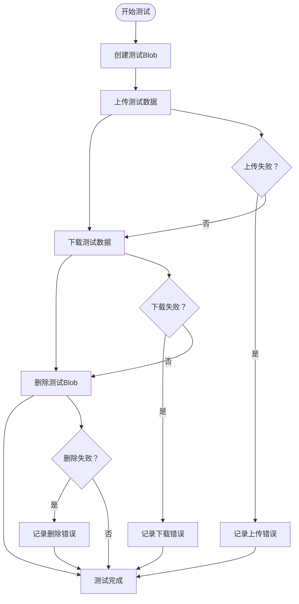

**图表来源**
- [model.go:237-286](file://backend/internal/features/storages/models/azure_blob/model.go#L237-L286)

### 日志记录和监控

系统自动记录所有存储操作的详细信息，便于故障诊断：

- **成功操作**：记录操作类型、文件名、执行时间
- **失败操作**：记录错误详情、重试次数、最终状态
- **安全事件**：记录认证尝试、权限变更、敏感操作

**章节来源**
- [model.go:237-286](file://backend/internal/features/storages/models/azure_blob/model.go#L237-L286)
- [service.go:111-144](file://backend/internal/features/storages/service.go#L111-L144)

## 结论

Databasus的Azure Blob存储功能提供了企业级的备份和归档解决方案，具有以下优势：

### 技术优势
- **灵活的认证机制**：支持连接字符串和账户密钥两种认证方式
- **高效的数据传输**：采用分块上传机制，支持大文件可靠传输
- **安全的数据保护**：敏感信息自动加密存储，防止泄露
- **完善的错误处理**：提供详细的错误信息和故障恢复机制

### 最佳实践建议
1. **生产环境优先使用账户密钥认证**，提供更好的权限控制
2. **合理设置前缀结构**，便于备份文件的组织和管理
3. **定期进行连接测试**，确保存储配置的有效性
4. **监控存储使用情况**，及时发现和解决潜在问题
5. **备份重要配置**，防止意外删除或修改

### 扩展性考虑
系统的设计充分考虑了未来的扩展需求，可以轻松添加新的存储类型和认证方式，为企业提供更加灵活的备份解决方案。

通过以上分析可以看出，Databasus的Azure Blob存储功能不仅技术实现成熟，而且在安全性、性能和易用性方面都达到了企业级标准，是值得信赖的备份存储解决方案。