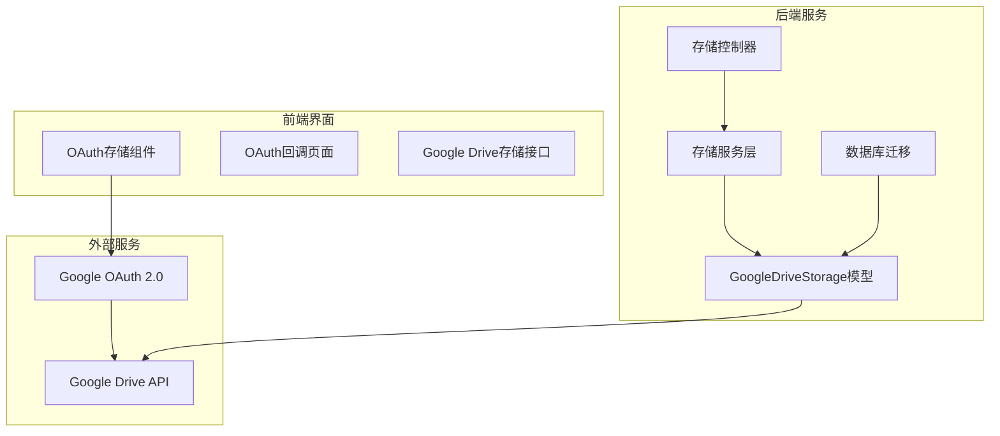
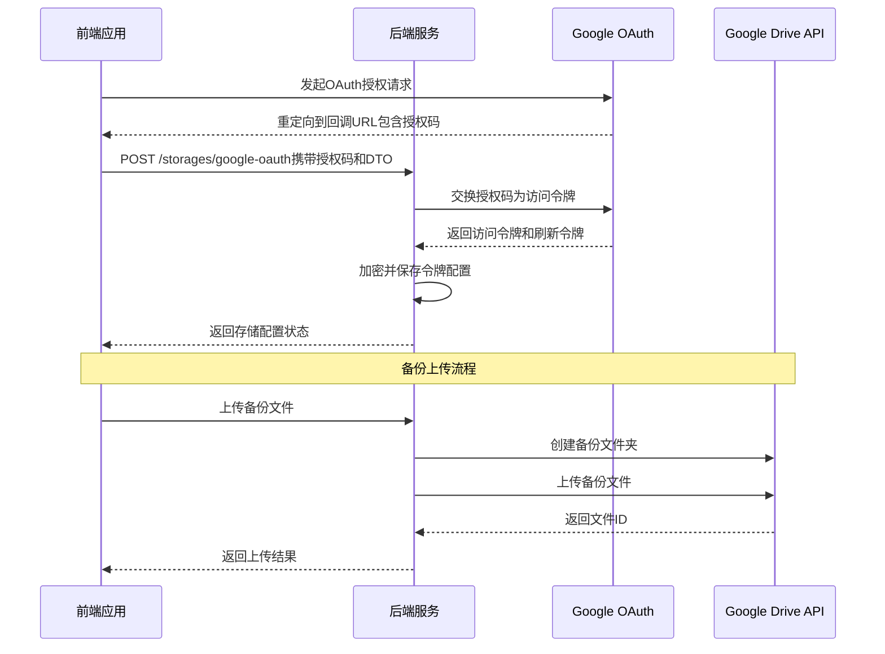
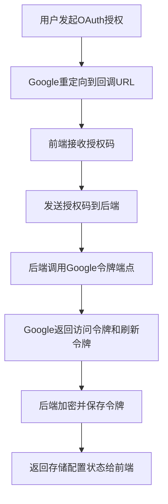
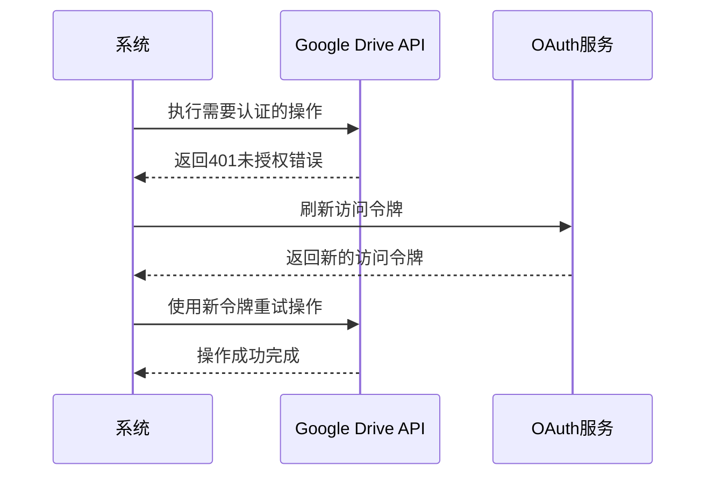
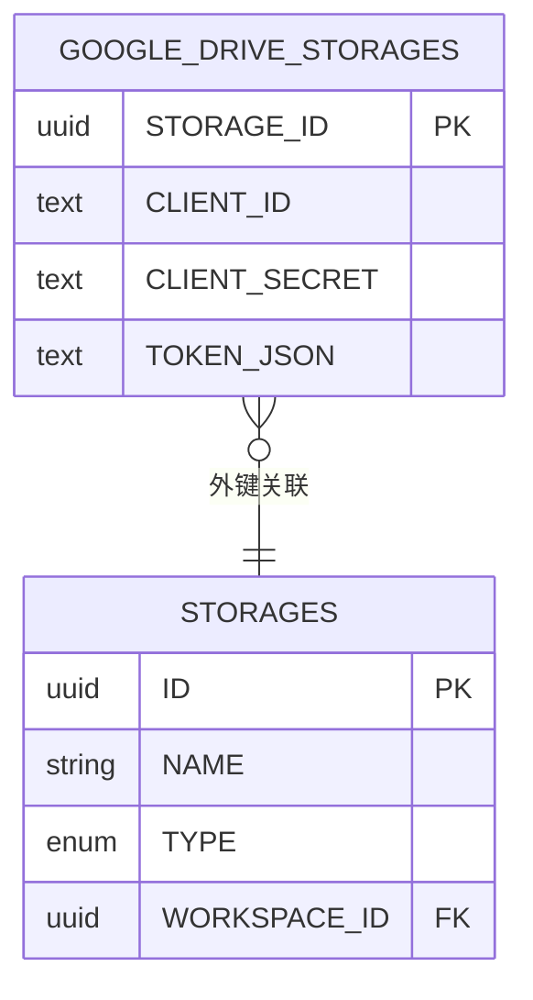
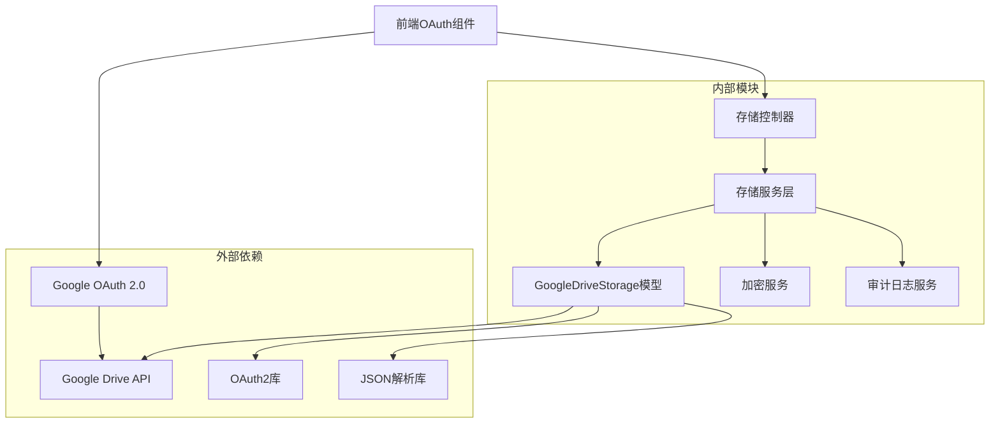

# Google Drive存储

<cite>
**本文档引用的文件**
- [model.go](file://backend/internal/features/storages/models/google_drive/model.go)
- [20250629143714_add_google_drive_storage.sql](file://backend/migrations/20250629143714_add_google_drive_storage.sql)
- [service.go](file://backend/internal/features/storages/service.go)
- [controller.go](file://backend/internal/features/storages/controller.go)
- [OauthStorageComponent.tsx](file://frontend/src/pages/OauthStorageComponent.tsx)
- [OAuthCallbackPage.tsx](file://frontend/src/pages/OAuthCallbackPage.tsx)
- [GoogleDriveStorage.ts](file://frontend/src/entity/storages/models/GoogleDriveStorage.ts)
- [how-extrnal-oauth-works.md](file://docs/how-extrnal-oauth-works.md)
</cite>

## 目录
1. [简介](#简介)
2. [项目结构](#项目结构)
3. [核心组件](#核心组件)
4. [架构概览](#架构概览)
5. [详细组件分析](#详细组件分析)
6. [依赖关系分析](#依赖关系分析)
7. [性能考虑](#性能考虑)
8. [故障排除指南](#故障排除指南)
9. [结论](#结论)

## 简介

Databasus的Google Drive存储功能提供了云端备份解决方案，允许用户将数据库备份文件存储在Google Drive中。该功能实现了完整的OAuth 2.0认证流程，包括客户端ID和密钥的获取、授权码交换、访问令牌刷新机制，以及Google Drive API的使用限制、配额管理和缓存策略。

本系统支持自动化的备份上传、下载和删除操作，通过加密存储敏感的OAuth凭据，并提供完善的错误处理和重试机制。

## 项目结构

Google Drive存储功能在Databasus项目中的组织结构如下：

**图表来源**
- [model.go:1-690](file://backend/internal/features/storages/models/google_drive/model.go#L1-L690)
- [service.go:1-409](file://backend/internal/features/storages/service.go#L1-L409)
- [controller.go:1-340](file://backend/internal/features/storages/controller.go#L1-L340)

**章节来源**
- [model.go:1-690](file://backend/internal/features/storages/models/google_drive/model.go#L1-L690)
- [20250629143714_add_google_drive_storage.sql:1-26](file://backend/migrations/20250629143714_add_google_drive_storage.sql#L1-L26)

## 核心组件

### GoogleDriveStorage模型

GoogleDriveStorage是核心的数据模型，负责管理Google Drive存储的所有配置信息和操作逻辑。

**关键特性：**
- OAuth 2.0凭据管理（客户端ID、客户端密钥、令牌JSON）
- 文件操作（上传、下载、删除）
- 自动连接测试
- 加密敏感数据存储
- 认证错误自动重试

**数据结构：**
- `StorageID`: 唯一标识符
- `ClientID`: Google OAuth客户端ID
- `ClientSecret`: Google OAuth客户端密钥
- `TokenJSON`: 包含访问令牌和刷新令牌的JSON

**章节来源**
- [model.go:38-47](file://backend/internal/features/storages/models/google_drive/model.go#L38-L47)
- [model.go:296-326](file://backend/internal/features/storages/models/google_drive/model.go#L296-L326)

### 存储服务层

存储服务层提供了业务逻辑处理，包括存储配置的验证、加密、权限检查等。

**主要功能：**
- 存储配置的创建和更新
- 权限验证和工作空间管理
- 连接测试和错误处理
- 审计日志记录

**章节来源**
- [service.go:54-147](file://backend/internal/features/storages/service.go#L54-L147)
- [service.go:249-280](file://backend/internal/features/storages/service.go#L249-L280)

### 存储控制器

存储控制器处理HTTP请求，提供RESTful API接口来管理Google Drive存储配置。

**API端点：**
- `POST /storages`: 创建或更新存储配置
- `GET /storages`: 获取工作空间内的所有存储
- `GET /storages/:id`: 获取特定存储配置
- `DELETE /storages/:id`: 删除存储配置
- `POST /storages/:id/test`: 测试存储连接
- `POST /storages/:id/transfer`: 转移存储到其他工作空间

**章节来源**
- [controller.go:19-27](file://backend/internal/features/storages/controller.go#L19-L27)
- [controller.go:29-71](file://backend/internal/features/storages/controller.go#L29-L71)

## 架构概览

Google Drive存储系统的整体架构采用分层设计，确保了清晰的关注点分离和可维护性。

**图表来源**
- [OauthStorageComponent.tsx:14-59](file://frontend/src/pages/OauthStorageComponent.tsx#L14-L59)
- [how-extrnal-oauth-works.md:7-27](file://docs/how-extrnal-oauth-works.md#L7-L27)

## 详细组件分析

### OAuth 2.0认证流程

#### 授权码交换机制

Google Drive存储实现了完整的OAuth 2.0授权码交换流程：

**图表来源**
- [OauthStorageComponent.tsx:26-49](file://frontend/src/pages/OauthStorageComponent.tsx#L26-L49)
- [how-extrnal-oauth-works.md:15-24](file://docs/how-extrnal-oauth-works.md#L15-L24)

#### 令牌刷新机制

系统实现了智能的令牌刷新机制，能够自动处理过期的访问令牌：

**图表来源**
- [model.go:328-388](file://backend/internal/features/storages/models/google_drive/model.go#L328-L388)

**章节来源**
- [model.go:403-486](file://backend/internal/features/storages/models/google_drive/model.go#L403-L486)

### 文件操作实现

#### 备份文件上传

Google Drive存储支持大文件的分块上传，采用16MB的块大小以平衡内存使用和上传效率：

**上传流程：**
1. 确保备份文件夹存在
2. 删除同名的旧文件
3. 创建文件元数据（包含父文件夹ID）
4. 使用分块上传器上传文件内容
5. 设置适当的超时和背压机制

**章节来源**
- [model.go:49-98](file://backend/internal/features/storages/models/google_drive/model.go#L49-L98)

#### 文件查找和管理

系统提供了完整的文件管理功能：

**文件查找：**
- 支持精确文件名匹配
- 查询条件包含文件夹约束
- 避免回收站中的文件

**文件删除：**
- 支持批量删除
- 分页处理大量文件
- 错误处理和事务回滚

**章节来源**
- [model.go:583-641](file://backend/internal/features/storages/models/google_drive/model.go#L583-L641)

### 数据库集成

#### 表结构设计

Google Drive存储配置使用独立的数据库表进行管理：

**图表来源**
- [20250629143714_add_google_drive_storage.sql:5-16](file://backend/migrations/20250629143714_add_google_drive_storage.sql#L5-L16)

**章节来源**
- [20250629143714_add_google_drive_storage.sql:1-26](file://backend/migrations/20250629143714_add_google_drive_storage.sql#L1-L26)

### 前端集成

#### OAuth存储组件

前端实现了完整的OAuth存储配置流程：

**组件功能：**
- 接收授权码参数
- 与后端交换访问令牌
- 显示存储配置状态
- 处理错误和重定向

**章节来源**
- [OauthStorageComponent.tsx:1-145](file://frontend/src/pages/OauthStorageComponent.tsx#L1-L145)

#### OAuth回调处理

系统支持多种OAuth提供商的回调处理：

**支持的提供商：**
- Google OAuth
- GitHub OAuth

**回调流程：**
1. 提取授权码和状态参数
2. 验证状态参数的有效性
3. 调用相应的OAuth回调API
4. 保存认证令牌和用户信息

**章节来源**
- [OAuthCallbackPage.tsx:1-77](file://frontend/src/pages/OAuthCallbackPage.tsx#L1-L77)

## 依赖关系分析

Google Drive存储功能的依赖关系图展示了各组件之间的交互：

**图表来源**
- [model.go:3-23](file://backend/internal/features/storages/models/google_drive/model.go#L3-L23)
- [service.go:3-14](file://backend/internal/features/storages/service.go#L3-L14)

**章节来源**
- [model.go:1-23](file://backend/internal/features/storages/models/google_drive/model.go#L1-L23)
- [service.go:16-22](file://backend/internal/features/storages/service.go#L16-L22)

## 性能考虑

### 上传性能优化

Google Drive存储实现了多项性能优化措施：

**分块上传策略：**
- 16MB块大小提供最佳的内存使用和上传效率平衡
- Google Drive要求块大小必须是256KB的倍数
- 实现了背压机制防止内存溢出

**HTTP连接优化：**
- 连接超时：30秒
- TLS握手超时：30秒  
- 响应头超时：30秒
- 空闲连接超时：90秒

**章节来源**
- [model.go:25-36](file://backend/internal/features/storages/models/google_drive/model.go#L25-L36)
- [model.go:565-581](file://backend/internal/features/storages/models/google_drive/model.go#L565-L581)

### 错误处理和重试机制

系统实现了智能的错误处理和重试机制：

**认证错误检测：**
- 检测401未授权错误
- 识别无效凭据错误
- 处理认证失败场景

**自动重试：**
- 在认证错误发生时自动刷新令牌
- 单次重试机会
- 提供清晰的错误信息

**章节来源**
- [model.go:390-401](file://backend/internal/features/storages/models/google_drive/model.go#L390-L401)
- [model.go:328-388](file://backend/internal/features/storages/models/google_drive/model.go#L328-L388)

## 故障排除指南

### 常见问题和解决方案

#### OAuth认证问题

**问题：** 授权码交换失败
**解决方案：**
1. 验证客户端ID和客户端密钥是否正确
2. 检查重定向URI配置
3. 确认授权码未过期（10分钟有效期）

**问题：** 刷新令牌过期
**解决方案：**
1. 重新执行完整的OAuth授权流程
2. 更新存储配置中的令牌信息
3. 验证Google Cloud Console中的OAuth客户端配置

#### 文件操作问题

**问题：** 文件上传失败
**解决方案：**
1. 检查网络连接和防火墙设置
2. 验证Google Drive API配额限制
3. 确认目标文件夹权限设置

**问题：** 文件下载失败
**解决方案：**
1. 验证文件ID的有效性
2. 检查文件是否存在于回收站
3. 确认用户具有文件访问权限

#### 连接测试问题

**问题：** 连接测试失败
**解决方案：**
1. 运行测试连接功能验证配置
2. 检查加密的凭据是否正确解密
3. 验证Google Drive API权限范围

**章节来源**
- [model.go:228-289](file://backend/internal/features/storages/models/google_drive/model.go#L228-L289)
- [model.go:200-226](file://backend/internal/features/storages/models/google_drive/model.go#L200-L226)

### 调试技巧

**启用详细日志：**
- 查看后端服务的日志输出
- 监控OAuth令牌的刷新过程
- 跟踪文件操作的完整生命周期

**令牌调试：**
- 使用maskSensitiveData函数查看令牌结构
- 检查访问令牌和刷新令牌的状态
- 验证令牌JSON格式的有效性

**章节来源**
- [model.go:488-505](file://backend/internal/features/storages/models/google_drive/model.go#L488-L505)
- [model.go:430-437](file://backend/internal/features/storages/models/google_drive/model.go#L430-L437)

## 结论

Databasus的Google Drive存储功能提供了企业级的云端备份解决方案。通过实现完整的OAuth 2.0认证流程、智能的令牌管理机制、以及优化的文件操作功能，该系统确保了数据的安全性和可靠性。

**主要优势：**
- 完整的OAuth 2.0实现，支持现代安全标准
- 智能的令牌刷新和错误处理机制
- 优化的分块上传策略，支持大文件备份
- 加密存储敏感凭据，确保安全性
- 清晰的API接口和完整的前端集成

**未来改进方向：**
- 添加更多云存储提供商的支持
- 实现更精细的配额监控和告警
- 增强并发上传和下载的性能
- 提供更详细的备份恢复功能

该Google Drive存储功能为Databasus用户提供了可靠的云端备份解决方案，满足了现代企业对数据安全和可用性的需求。