# S3兼容存储

<cite>
**本文档引用的文件**
- [model.go](file://backend/internal/features/storages/models/s3/model.go)
- [enums.go](file://backend/internal/features/storages/models/s3/enums.go)
- [interfaces.go](file://backend/internal/features/storages/interfaces.go)
- [service.go](file://backend/internal/features/storages/service.go)
- [S3Storage.ts](file://frontend/src/entity/storages/models/S3Storage.ts)
- [ShowS3StorageComponent.tsx](file://frontend/src/features/storages/ui/show/storages/ShowS3StorageComponent.tsx)
- [20251116075135_add_virtual_host_and_prefix_to_s3.sql](file://backend/migrations/20251116075135_add_virtual_host_and_prefix_to_s3.sql)
- [20251211164424_add_skip_tls_verify_to_s3.sql](file://backend/migrations/20251211164424_add_skip_tls_verify_to_s3.sql)
- [20260402055223_add_storage_class_to_s3.sql](file://backend/migrations/20260402055223_add_storage_class_to_s3.sql)
</cite>

## 目录
1. [简介](#简介)
2. [项目结构](#项目结构)
3. [核心组件](#核心组件)
4. [架构概览](#架构概览)
5. [详细组件分析](#详细组件分析)
6. [依赖关系分析](#依赖关系分析)
7. [性能考虑](#性能考虑)
8. [故障排除指南](#故障排除指南)
9. [结论](#结论)
10. [附录](#附录)

## 简介

Databasus提供了对S3兼容存储的完整支持，包括Amazon S3、Cloudflare R2、MinIO等服务。该系统实现了企业级的备份和归档解决方案，支持多种存储后端和高级功能。

本系统的核心特性包括：
- 支持多种S3兼容服务（Amazon S3、Cloudflare R2、MinIO）
- 虚拟主机样式与路径样式的灵活切换
- 分片上传机制确保大文件传输的可靠性
- TLS验证选项的安全配置
- 存储类配置的优化选择
- 前缀隔离的数据组织方式

## 项目结构

Databasus的S3存储功能采用模块化设计，主要分布在以下目录：

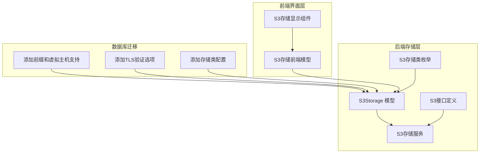

**图表来源**
- [model.go:1-50](file://backend/internal/features/storages/models/s3/model.go#L1-L50)
- [enums.go:1-14](file://backend/internal/features/storages/models/s3/enums.go#L1-L14)
- [interfaces.go:1-38](file://backend/internal/features/storages/interfaces.go#L1-L38)

**章节来源**
- [model.go:1-50](file://backend/internal/features/storages/models/s3/model.go#L1-L50)
- [interfaces.go:1-38](file://backend/internal/features/storages/interfaces.go#L1-L38)

## 核心组件

### S3Storage 数据模型

S3Storage是系统的核心数据模型，负责管理所有S3兼容存储的配置和操作。

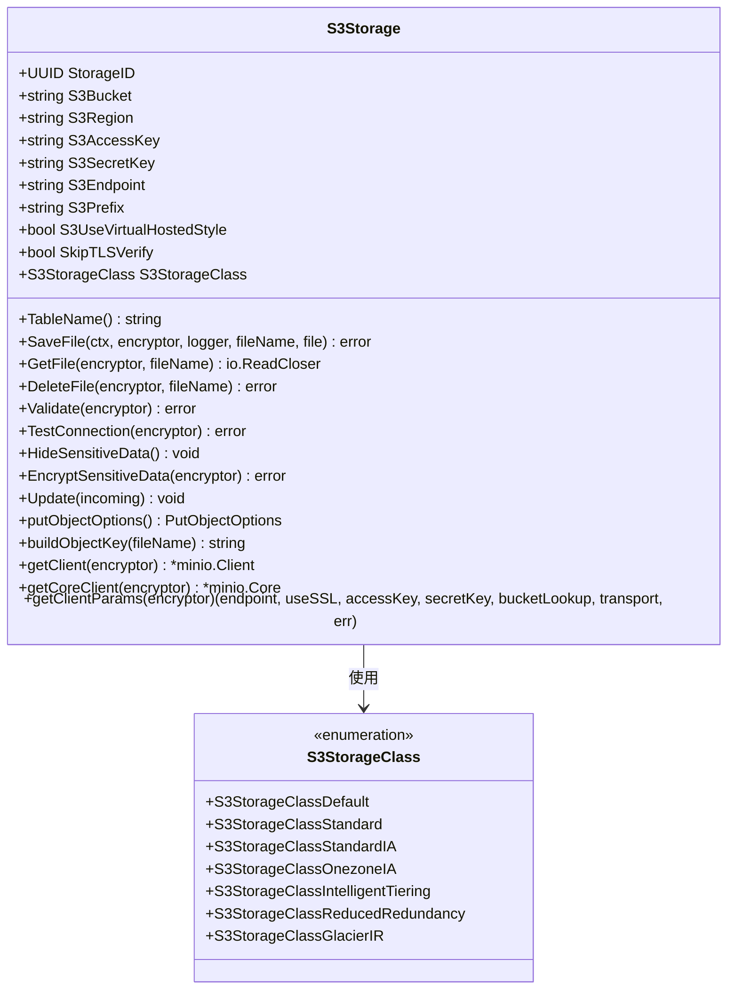

**图表来源**
- [model.go:38-50](file://backend/internal/features/storages/models/s3/model.go#L38-L50)
- [enums.go:3-13](file://backend/internal/features/storages/models/s3/enums.go#L3-L13)

### 存储接口定义

系统定义了统一的存储接口，确保不同存储后端的一致性：

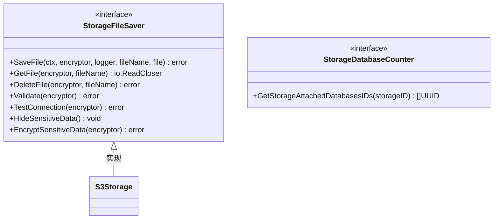

**图表来源**
- [interfaces.go:13-33](file://backend/internal/features/storages/interfaces.go#L13-L33)

**章节来源**
- [model.go:38-480](file://backend/internal/features/storages/models/s3/model.go#L38-L480)
- [enums.go:1-14](file://backend/internal/features/storages/models/s3/enums.go#L1-L14)
- [interfaces.go:1-38](file://backend/internal/features/storages/interfaces.go#L1-L38)

## 架构概览

Databasus的S3存储架构采用了分层设计，确保了可扩展性和安全性：

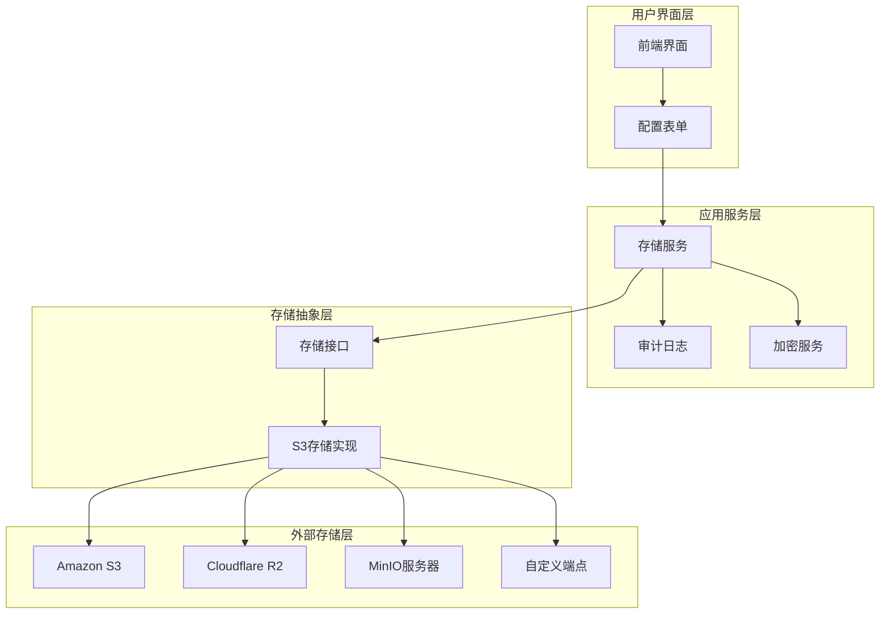

**图表来源**
- [service.go:16-22](file://backend/internal/features/storages/service.go#L16-L22)
- [model.go:390-479](file://backend/internal/features/storages/models/s3/model.go#L390-L479)

## 详细组件分析

### 分片上传机制

Databasus实现了高效的分片上传机制，支持大文件的可靠传输：

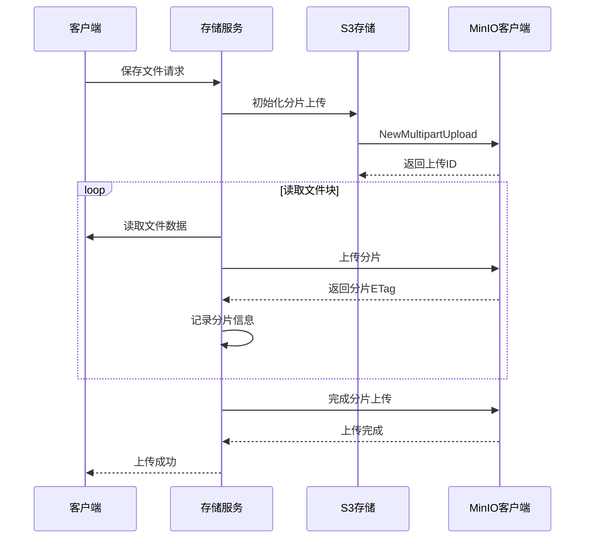

**图表来源**
- [model.go:56-186](file://backend/internal/features/storages/models/s3/model.go#L56-L186)

#### 分片上传算法流程

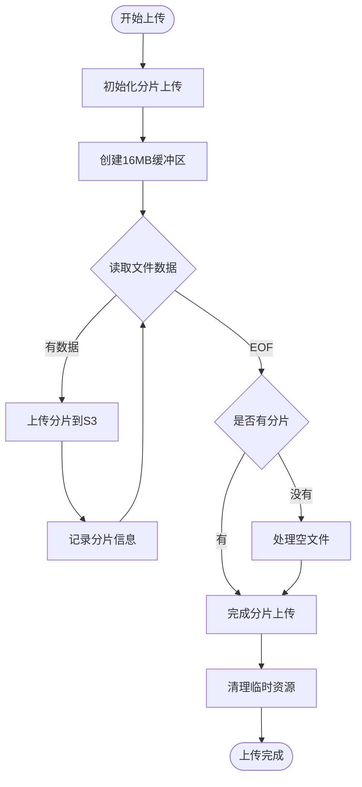

**图表来源**
- [model.go:86-186](file://backend/internal/features/storages/models/s3/model.go#L86-L186)

**章节来源**
- [model.go:25-36](file://backend/internal/features/storages/models/s3/model.go#L25-L36)
- [model.go:56-186](file://backend/internal/features/storages/models/s3/model.go#L56-L186)

### 虚拟主机样式与路径样式访问

系统支持两种S3访问模式，每种都有其特定的使用场景：

#### 虚拟主机样式访问

虚拟主机样式使用桶名作为子域名的一部分：
- 格式：`https://bucket-name.s3.region.amazonaws.com/key`
- 优点：更好的CDN支持，更直观的URL结构
- 适用：公共桶访问，需要CDN加速的场景

#### 路径样式访问

路径样式将桶名包含在URL路径中：
- 格式：`https://s3.region.amazonaws.com/bucket-name/key`
- 优点：兼容性更好，适用于自定义域名
- 适用：私有桶，自定义域名配置

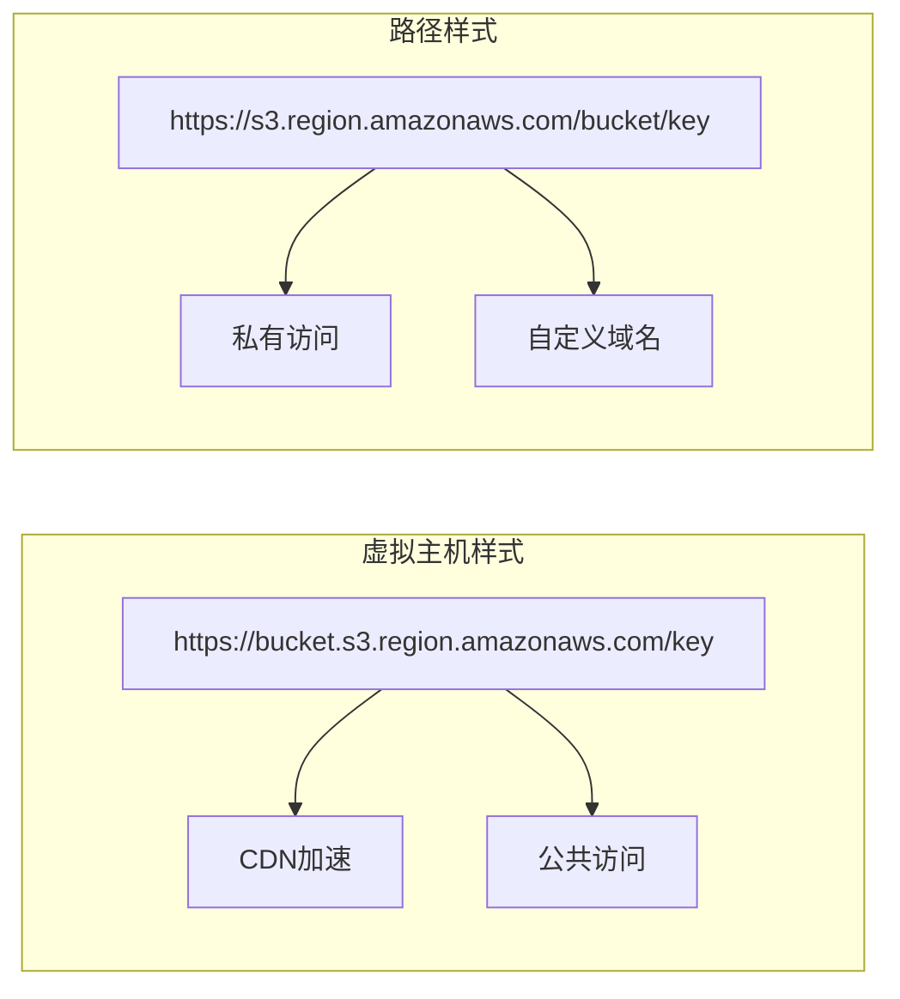

**图表来源**
- [model.go:462-464](file://backend/internal/features/storages/models/s3/model.go#L462-L464)

**章节来源**
- [model.go:434-479](file://backend/internal/features/storages/models/s3/model.go#L434-L479)

### TLS验证与安全配置

系统提供了灵活的TLS验证选项，平衡了安全性与兼容性：

| 配置选项 | 默认值 | 描述 | 使用场景 |
|---------|--------|------|----------|
| `skipTLSVerify` | false | 跳过TLS证书验证 | 自签名证书，开发环境 |
| `InsecureSkipVerify` | false | Go标准库TLS跳过验证 | 特殊网络环境 |
| `TLSClientConfig` | 标准配置 | 客户端TLS配置 | 生产环境推荐 |

**章节来源**
- [model.go:473-476](file://backend/internal/features/storages/models/s3/model.go#L473-L476)

### 存储类配置

Databasus支持多种AWS S3存储类，可根据成本和性能需求进行选择：

| 存储类 | 描述 | 适用场景 | 成本特征 |
|--------|------|----------|----------|
| `STANDARD` | 标准存储 | 高频访问，低延迟 | 最高 |
| `STANDARD_IA` | 标准低频 | 中等频率，较长保留期 | 中等 |
| `ONEZONE_IA` | 单区低频 | 不需要跨区冗余 | 较低 |
| `INTELLIGENT_TIERING` | 智能分层 | 变化不定的访问模式 | 自动优化 |
| `REDUCED_REDUNDANCY` | 减少冗余 | 可用替代的非关键数据 | 最低 |
| `GLACIER_IR` | Glacier即时检索 | 归档存储，快速检索 | 介于两者之间 |

**章节来源**
- [enums.go:5-13](file://backend/internal/features/storages/models/s3/enums.go#L5-L13)

### 连接参数配置

#### Amazon S3配置示例

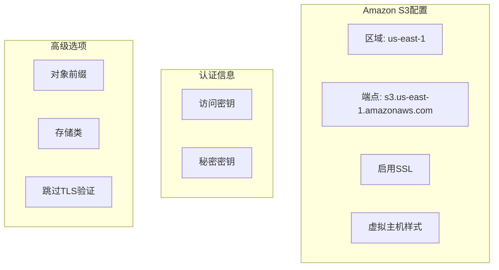

#### Cloudflare R2配置示例

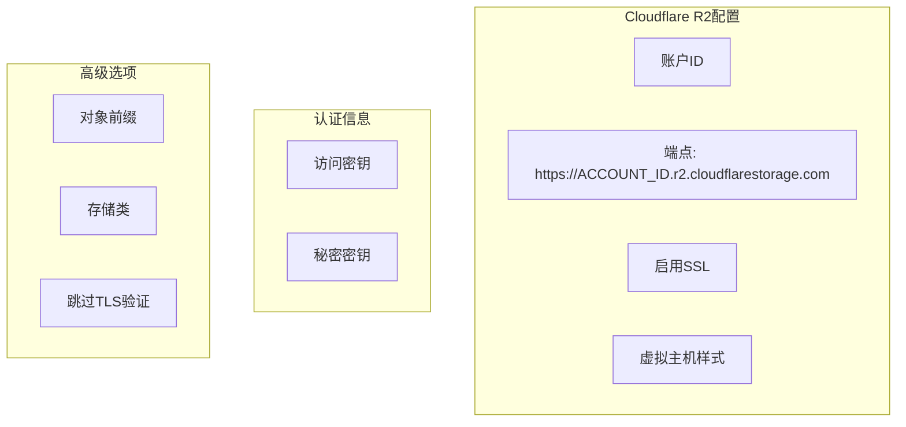

#### MinIO配置示例

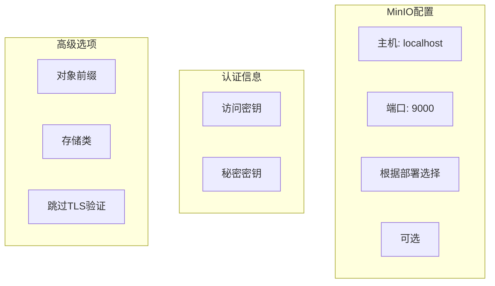

**图表来源**
- [S3Storage.ts:1-11](file://frontend/src/entity/storages/models/S3Storage.ts#L1-L11)

**章节来源**
- [S3Storage.ts:1-11](file://frontend/src/entity/storages/models/S3Storage.ts#L1-L11)
- [ShowS3StorageComponent.tsx:1-43](file://frontend/src/features/storages/ui/show/storages/ShowS3StorageComponent.tsx#L1-L43)

## 依赖关系分析

Databasus的S3存储系统具有清晰的依赖层次结构：

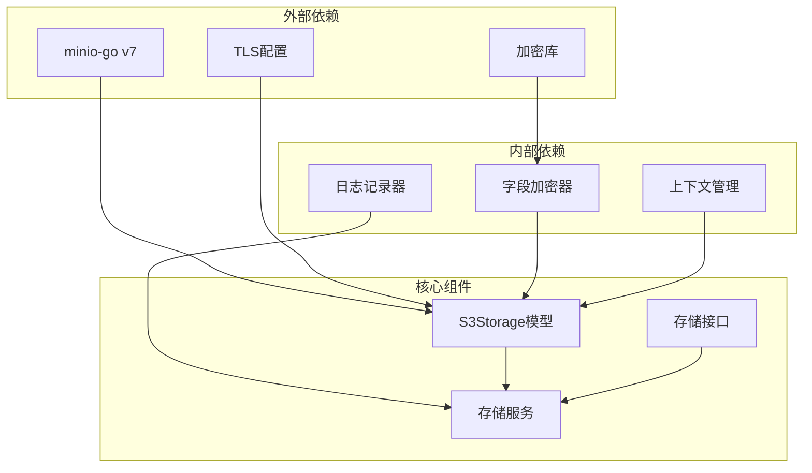

**图表来源**
- [model.go:3-23](file://backend/internal/features/storages/models/s3/model.go#L3-L23)
- [service.go:3-14](file://backend/internal/features/storages/service.go#L3-L14)

**章节来源**
- [model.go:3-23](file://backend/internal/features/storages/models/s3/model.go#L3-L23)
- [service.go:3-14](file://backend/internal/features/storages/service.go#L3-L14)

## 性能考虑

### 连接池和超时配置

系统针对S3连接进行了专门的性能优化：

| 参数 | 默认值 | 用途 | 优化建议 |
|------|--------|------|----------|
| `s3ConnectTimeout` | 30秒 | 连接建立超时 | 根据网络状况调整 |
| `s3ResponseTimeout` | 30秒 | 响应等待超时 | 大文件传输可增加 |
| `s3IdleConnTimeout` | 90秒 | 空闲连接超时 | 生产环境建议 |
| `s3TLSHandshakeTimeout` | 30秒 | TLS握手超时 | 内网环境可减少 |
| `s3DeleteTimeout` | 30秒 | 删除操作超时 | 根据文件大小调整 |

### 分片大小优化

系统使用16MB作为默认分片大小，这是内存使用与上传效率的最佳平衡点：

- **内存占用**：每个分片占用16MB内存
- **并发控制**：只允许一个分片在传输中，提供背压控制
- **错误恢复**：支持部分分片失败重试
- **大文件支持**：适合PostgreSQL备份文件的传输

**章节来源**
- [model.go:25-36](file://backend/internal/features/storages/models/s3/model.go#L25-L36)

## 故障排除指南

### 常见连接问题

#### 1. 认证失败

**症状**：连接测试失败，返回认证错误
**排查步骤**：
1. 验证访问密钥和秘密密钥格式正确
2. 检查IAM权限是否包含必要的S3权限
3. 确认区域设置与实际桶位置一致

#### 2. 网络连接超时

**症状**：连接超时，无法建立S3连接
**排查步骤**：
1. 检查防火墙设置和网络访问权限
2. 验证端点URL格式正确
3. 测试代理服务器连接（如使用）

#### 3. TLS证书验证失败

**症状**：TLS握手失败，证书验证错误
**排查步骤**：
1. 确认使用正确的SSL/TLS设置
2. 检查自签名证书配置
3. 考虑临时启用跳过TLS验证进行诊断

### 存储类配置问题

#### 1. 不支持的存储类

**症状**：上传时返回存储类不支持错误
**解决方法**：
1. 检查目标S3服务支持的存储类列表
2. 使用标准存储类作为默认选项
3. 参考服务提供商的官方文档

#### 2. 存储类转换问题

**症状**：更改存储类后数据不可访问
**解决方法**：
1. 确保新旧存储类都支持所需操作
2. 考虑重新上传数据以匹配新的存储类
3. 检查数据生命周期规则配置

### 分片上传问题

#### 1. 分片上传中断

**症状**：上传过程中断，部分分片未完成
**解决方法**：
1. 检查网络连接稳定性
2. 增加超时时间设置
3. 重新启动上传进程

#### 2. 分片大小不合适

**症状**：内存使用过高或上传效率低下
**解决方法**：
1. 调整分片大小参数
2. 根据可用内存和网络带宽优化
3. 考虑使用更大的分片以提高效率

**章节来源**
- [model.go:265-322](file://backend/internal/features/storages/models/s3/model.go#L265-L322)

## 结论

Databasus的S3兼容存储系统提供了企业级的备份和归档解决方案。通过模块化设计、灵活的配置选项和完善的错误处理机制，系统能够适应各种S3兼容服务的需求。

关键优势包括：
- **多服务支持**：统一接口支持Amazon S3、Cloudflare R2、MinIO等
- **高性能传输**：智能分片上传机制确保大文件稳定传输
- **安全可靠**：完整的TLS验证和敏感数据加密
- **灵活配置**：支持虚拟主机样式、路径样式等多种访问模式
- **监控审计**：完整的操作日志和状态跟踪

对于生产环境部署，建议：
1. 使用标准存储类并定期评估成本效益
2. 启用TLS验证确保数据传输安全
3. 根据网络条件调整超时参数
4. 定期测试连接和权限配置
5. 监控存储使用情况和成本变化

## 附录

### 数据库迁移历史

系统通过数据库迁移管理S3存储配置的演进：

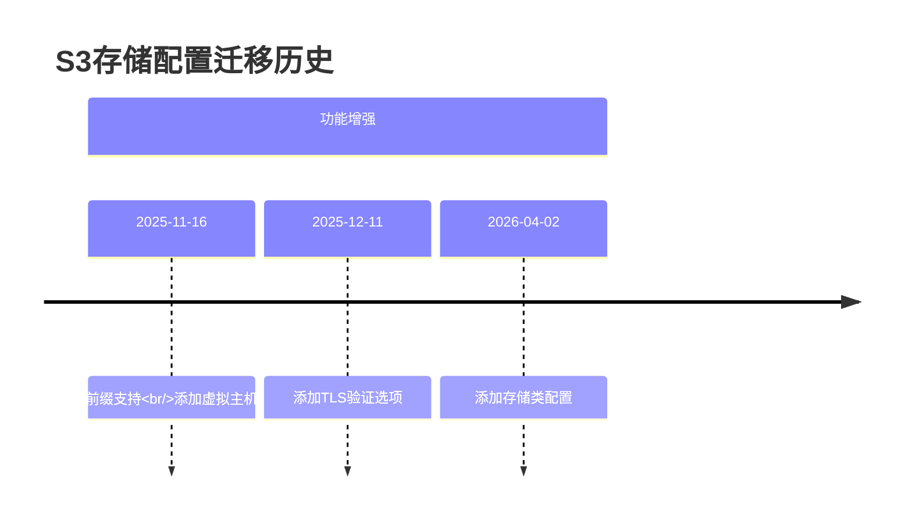

**图表来源**
- [20251116075135_add_virtual_host_and_prefix_to_s3.sql:1-18](file://backend/migrations/20251116075135_add_virtual_host_and_prefix_to_s3.sql#L1-L18)
- [20251211164424_add_skip_tls_verify_to_s3.sql:1-12](file://backend/migrations/20251211164424_add_skip_tls_verify_to_s3.sql#L1-L12)
- [20260402055223_add_storage_class_to_s3.sql:1-12](file://backend/migrations/20260402055223_add_storage_class_to_s3.sql#L1-L12)

### 前端配置映射

前端S3存储配置与后端模型的对应关系：

| 前端字段 | 后端字段 | 必填 | 描述 |
|----------|----------|------|------|
| `s3Bucket` | `S3Bucket` | 是 | 存储桶名称 |
| `s3Region` | `S3Region` | 是 | AWS区域标识 |
| `s3AccessKey` | `S3AccessKey` | 是 | 访问密钥 |
| `s3SecretKey` | `S3SecretKey` | 是 | 秘密密钥 |
| `s3Endpoint` | `S3Endpoint` | 否 | 自定义端点URL |
| `s3Prefix` | `S3Prefix` | 否 | 对象前缀 |
| `s3UseVirtualHostedStyle` | `S3UseVirtualHostedStyle` | 否 | 虚拟主机样式 |
| `skipTLSVerify` | `SkipTLSVerify` | 否 | 跳过TLS验证 |
| `s3StorageClass` | `S3StorageClass` | 否 | 存储类配置 |

**章节来源**
- [S3Storage.ts:1-11](file://frontend/src/entity/storages/models/S3Storage.ts#L1-L11)
- [model.go:38-50](file://backend/internal/features/storages/models/s3/model.go#L38-L50)