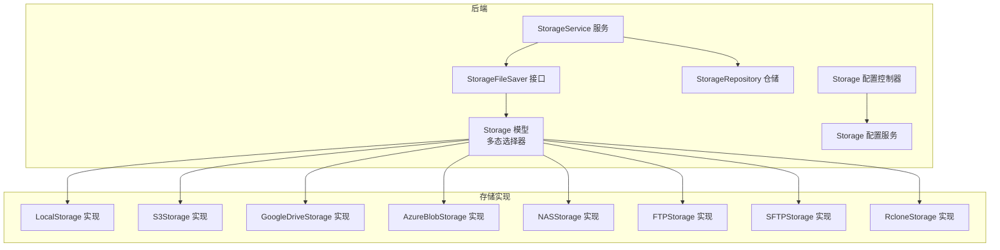
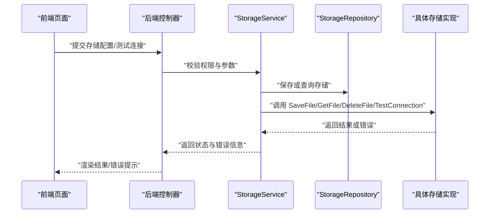
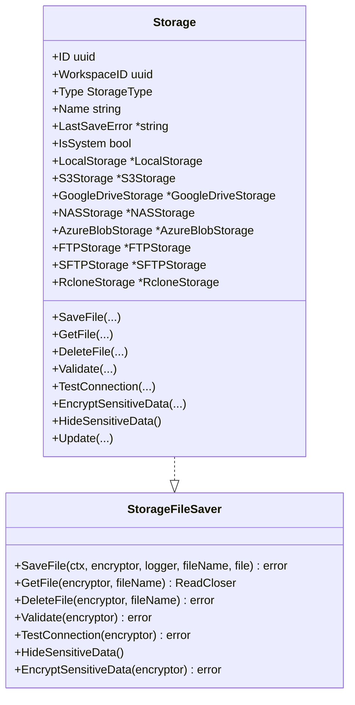
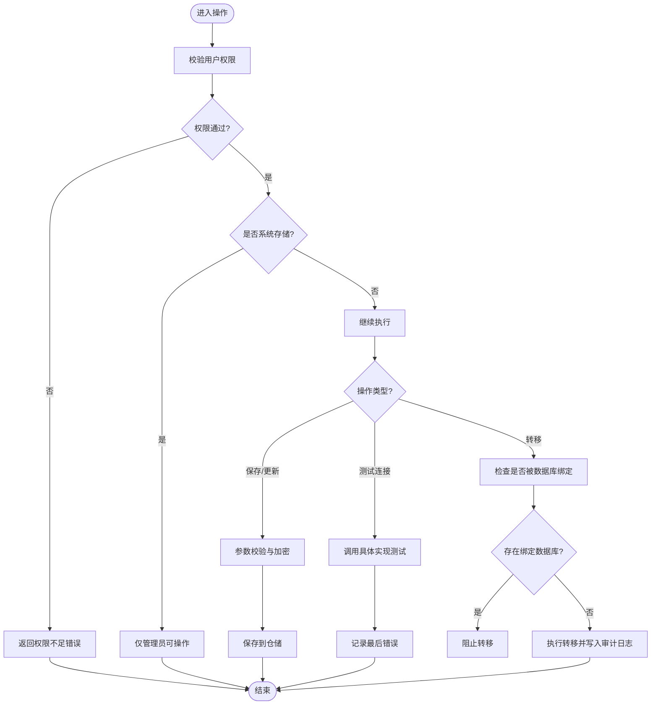
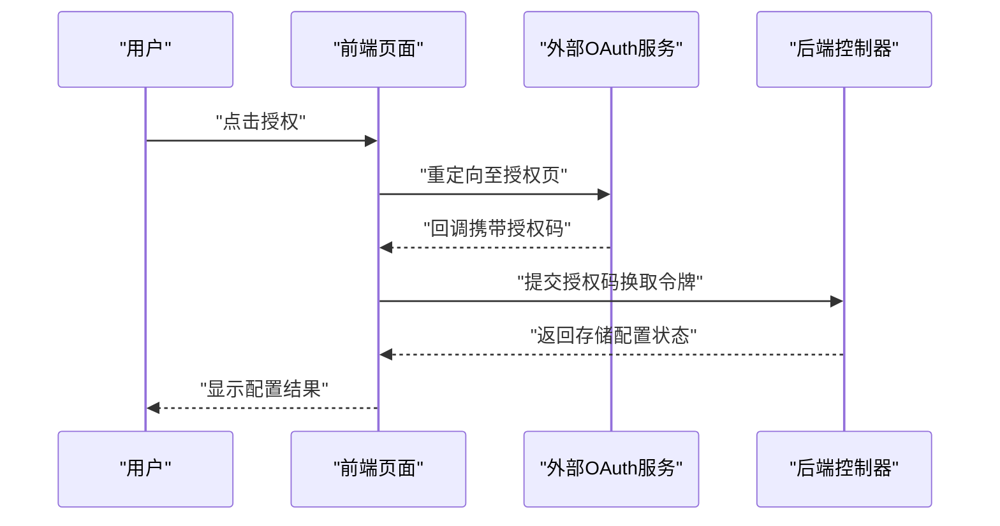
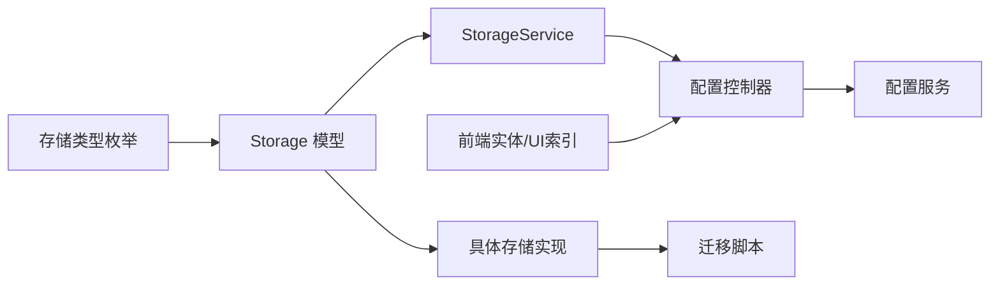

# 云存储

<cite>
**本文引用的文件**
- [model.go](file://backend/internal/features/storages/model.go)
- [interfaces.go](file://backend/internal/features/storages/interfaces.go)
- [service.go](file://backend/internal/features/storages/service.go)
- [enums.go](file://backend/internal/features/storages/enums.go)
- [controller.go](file://backend/internal/features/storages/config/controller.go)
- [dto.go](file://backend/internal/features/storages/config/dto.go)
- [repository.go](file://backend/internal/features/storages/config/repository.go)
- [service.go](file://backend/internal/features/storages/config/service.go)
- [storages_test.go](file://backend/internal/features/storages/config/storages_test.go)
- [20251116075135_add_google_drive_storage.sql](file://backend/migrations/20251116075135_add_google_drive_storage.sql)
- [20251116195618_add_azure_blob_storage.sql](file://backend/migrations/20251116195618_add_azure_blob_storage.sql)
- [20251117064849_add_backup_encryption_fields.sql](file://backend/migrations/20251117064849_add_backup_encryption_fields.sql)
- [20251211164424_add_skip_tls_verify_to_s3.sql](file://backend/migrations/20251211164424_add_skip_tls_verify_to_s3.sql)
- [20260402055223_add_storage_class_to_s3.sql](file://backend/migrations/20260402055223_add_storage_class_to_s3.sql)
- [frontend/src/entity/storages/index.ts](file://frontend/src/entity/storages/index.ts)
- [frontend/src/features/storages/ui/index.ts](file://frontend/src/features/storages/ui/index.ts)
- [frontend/src/pages/OAuthCallbackPage.tsx](file://frontend/src/pages/OAuthCallbackPage.tsx)
- [frontend/src/pages/OauthStorageComponent.tsx](file://frontend/src/pages/OauthStorageComponent.tsx)
- [frontend/src/shared/api/index.ts](file://frontend/src/shared/api/index.ts)
- [docs/how-extrnal-oauth-works.md](file://docs/how-extrnal-oauth-works.md)
</cite>

## 目录
1. [简介](#简介)
2. [项目结构](#项目结构)
3. [核心组件](#核心组件)
4. [架构总览](#架构总览)
5. [详细组件分析](#详细组件分析)
6. [依赖分析](#依赖分析)
7. [性能考虑](#性能考虑)
8. [故障排除指南](#故障排除指南)
9. [结论](#结论)
10. [附录](#附录)

## 简介
本文件面向Databasus的云存储集成，系统性梳理后端存储抽象与前端配置界面，覆盖以下能力：
- 存储类型：本地、S3兼容（含Amazon S3、Cloudflare R2、MinIO）、Azure Blob、Google Drive、NAS、FTP、SFTP、Rclone
- 配置与验证：通过统一的存储模型与接口，对不同类型的存储进行参数校验、连接测试、敏感信息加密与隐藏
- 前端交互：支持OAuth回调页面与通用存储配置UI，便于用户完成外部服务授权与参数输入
- 运维与成本：基于迁移脚本与字段设计，提供TLS跳过、存储类别等运维选项，支撑成本控制与合规

## 项目结构
后端采用“统一模型 + 多实现”的分层设计：
- 统一接口与模型：定义存储文件操作、连接测试、参数校验、敏感数据处理等契约
- 具体存储实现：按类型拆分，通过模型的多态选择器调用具体实现
- 配置与服务：提供存储的增删改查、权限控制、连接测试、工作区转移等业务逻辑
- 前端实体与UI：提供存储配置实体与页面组件，支持OAuth回调与通用配置

图表来源
- [interfaces.go:13-33](file://backend/internal/features/storages/interfaces.go#L13-L33)
- [model.go:22-184](file://backend/internal/features/storages/model.go#L22-L184)
- [service.go:16-409](file://backend/internal/features/storages/service.go#L16-L409)

章节来源
- [model.go:1-185](file://backend/internal/features/storages/model.go#L1-L185)
- [interfaces.go:1-38](file://backend/internal/features/storages/interfaces.go#L1-L38)
- [enums.go:1-15](file://backend/internal/features/storages/enums.go#L1-L15)

## 核心组件
- 统一接口 StorageFileSaver：定义保存、读取、删除、校验、连接测试、敏感数据处理等方法，屏蔽不同存储实现差异
- 统一模型 Storage：包含通用字段（名称、类型、工作区、系统标记、最后错误）与各类型的具体配置指针；通过多态选择器在运行时委派到具体实现
- 服务层 StorageService：负责权限校验、连接测试、敏感数据加密/隐藏、工作区转移、与审计日志集成
- 配置层：控制器、仓储、服务与DTO构成完整的配置与CRUD流程

章节来源
- [interfaces.go:13-33](file://backend/internal/features/storages/interfaces.go#L13-L33)
- [model.go:22-184](file://backend/internal/features/storages/model.go#L22-L184)
- [service.go:54-315](file://backend/internal/features/storages/service.go#L54-L315)
- [enums.go:5-14](file://backend/internal/features/storages/enums.go#L5-L14)

## 架构总览
下图展示从请求到具体存储实现的调用链路，以及前后端交互的关键节点。

图表来源
- [service.go:54-315](file://backend/internal/features/storages/service.go#L54-L315)
- [interfaces.go:13-33](file://backend/internal/features/storages/interfaces.go#L13-L33)
- [model.go:41-85](file://backend/internal/features/storages/model.go#L41-L85)

## 详细组件分析

### 统一接口与模型
- 接口职责：封装所有存储操作的公共契约，确保新增存储类型只需实现该接口
- 模型职责：持有通用元数据与各类型配置指针；通过类型字段与多态选择器动态委派到具体实现
- 敏感数据：提供加密与隐藏机制，避免明文泄露；系统存储在非管理员视角下完全隐藏

图表来源
- [interfaces.go:13-33](file://backend/internal/features/storages/interfaces.go#L13-L33)
- [model.go:22-184](file://backend/internal/features/storages/model.go#L22-L184)

章节来源
- [interfaces.go:13-33](file://backend/internal/features/storages/interfaces.go#L13-L33)
- [model.go:22-184](file://backend/internal/features/storages/model.go#L22-L184)

### 服务层：权限、测试与转移
- 权限控制：仅具备工作区管理权限的用户可操作存储；系统存储仅管理员可管理
- 连接测试：统一入口调用具体实现的连接测试，失败时记录最后错误
- 转移逻辑：跨工作区转移前检查是否被数据库绑定，避免破坏备份配置

图表来源
- [service.go:54-315](file://backend/internal/features/storages/service.go#L54-L315)

章节来源
- [service.go:28-191](file://backend/internal/features/storages/service.go#L28-L191)
- [service.go:327-408](file://backend/internal/features/storages/service.go#L327-L408)

### 前端：OAuth回调与通用配置
- OAuth回调页：处理外部服务授权后的回调，完成令牌交换与存储配置
- 通用存储UI：提供存储配置表单与测试连接按钮，支持不同存储类型的差异化字段
- API封装：统一的前端API模块，便于控制器与服务层对接

图表来源
- [frontend/src/pages/OAuthCallbackPage.tsx](file://frontend/src/pages/OAuthCallbackPage.tsx)
- [frontend/src/pages/OauthStorageComponent.tsx](file://frontend/src/pages/OauthStorageComponent.tsx)
- [frontend/src/shared/api/index.ts](file://frontend/src/shared/api/index.ts)
- [docs/how-extrnal-oauth-works.md](file://docs/how-extrnal-oauth-works.md)

章节来源
- [frontend/src/pages/OAuthCallbackPage.tsx](file://frontend/src/pages/OAuthCallbackPage.tsx)
- [frontend/src/pages/OauthStorageComponent.tsx](file://frontend/src/pages/OauthStorageComponent.tsx)
- [frontend/src/shared/api/index.ts](file://frontend/src/shared/api/index.ts)
- [docs/how-extrnal-oauth-works.md](file://docs/how-extrnal-oauth-works.md)

## 依赖分析
- 类型枚举：集中定义存储类型常量，保证前后端一致性
- 迁移脚本：为Google Drive、Azure Blob、加密字段、S3 TLS跳过、存储类别等提供数据库层面的扩展
- 前后端映射：前端实体与UI索引导出，控制器与服务层提供配置与CRUD能力

图表来源
- [enums.go:5-14](file://backend/internal/features/storages/enums.go#L5-L14)
- [model.go:22-184](file://backend/internal/features/storages/model.go#L22-L184)
- [service.go:16-409](file://backend/internal/features/storages/service.go#L16-L409)
- [frontend/src/entity/storages/index.ts](file://frontend/src/entity/storages/index.ts)
- [frontend/src/features/storages/ui/index.ts](file://frontend/src/features/storages/ui/index.ts)

章节来源
- [enums.go:5-14](file://backend/internal/features/storages/enums.go#L5-L14)
- [20251116075135_add_google_drive_storage.sql](file://backend/migrations/20251116075135_add_google_drive_storage.sql)
- [20251116195618_add_azure_blob_storage.sql](file://backend/migrations/20251116195618_add_azure_blob_storage.sql)
- [20251117064849_add_backup_encryption_fields.sql](file://backend/migrations/20251117064849_add_backup_encryption_fields.sql)
- [20251211164424_add_skip_tls_verify_to_s3.sql](file://backend/migrations/20251211164424_add_skip_tls_verify_to_s3.sql)
- [20260402055223_add_storage_class_to_s3.sql](file://backend/migrations/20260402055223_add_storage_class_to_s3.sql)

## 性能考虑
- 并发上传：建议在上层备份流程中结合分片与并发策略，以提升大文件传输效率
- 断点续传：当前模型未内置断点续传逻辑，可在具体实现层（如S3、Azure Blob）利用其原生能力实现
- 压缩配置：结合备份格式与压缩算法，在上层流程中启用压缩以降低带宽与存储成本
- 连接复用：在具体实现中使用长连接与连接池，减少握手开销
- TLS跳过：仅在受控环境使用迁移脚本提供的TLS跳过选项，生产环境建议保持严格验证

章节来源
- [20251211164424_add_skip_tls_verify_to_s3.sql](file://backend/migrations/20251211164424_add_skip_tls_verify_to_s3.sql)
- [20260402055223_add_storage_class_to_s3.sql](file://backend/migrations/20260402055223_add_storage_class_to_s3.sql)

## 故障排除指南
- 权限不足：确认当前用户是否具备工作区管理权限；系统存储仅管理员可操作
- 参数校验失败：检查存储类型对应的必填字段；必要时先进行连接测试
- 连接失败：查看最后错误记录；若为TLS问题，参考TLS跳过迁移脚本进行临时处理
- 转移受限：若存储已被数据库绑定，需先解除绑定或转移相关数据库后再尝试

章节来源
- [service.go:54-191](file://backend/internal/features/storages/service.go#L54-L191)
- [service.go:327-408](file://backend/internal/features/storages/service.go#L327-L408)

## 结论
Databasus通过统一接口与模型实现了对多种云存储的抽象与扩展，配合完善的权限控制、连接测试与审计日志，能够安全高效地管理各类外部存储。结合迁移脚本提供的TLS与存储类别等能力，可在满足合规要求的同时优化成本与性能。

## 附录

### 支持的存储类型与关键字段
- 本地存储：适用于非云模式或特定场景
- S3兼容：支持访问密钥、区域、端点、虚拟主机前缀、TLS跳过、存储类别等
- Azure Blob：容器与连接字符串等参数
- Google Drive：OAuth授权与文件夹管理
- NAS/FTP/SFTP/Rclone：网络共享与协议级参数

章节来源
- [enums.go:5-14](file://backend/internal/features/storages/enums.go#L5-L14)
- [20251116075135_add_google_drive_storage.sql](file://backend/migrations/20251116075135_add_google_drive_storage.sql)
- [20251116195618_add_azure_blob_storage.sql](file://backend/migrations/20251116195618_add_azure_blob_storage.sql)
- [20251211164424_add_skip_tls_verify_to_s3.sql](file://backend/migrations/20251211164424_add_skip_tls_verify_to_s3.sql)
- [20260402055223_add_storage_class_to_s3.sql](file://backend/migrations/20260402055223_add_storage_class_to_s3.sql)