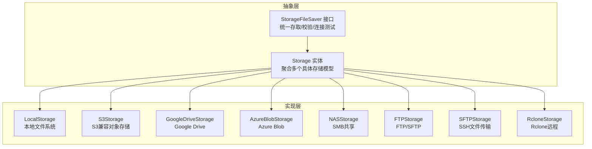
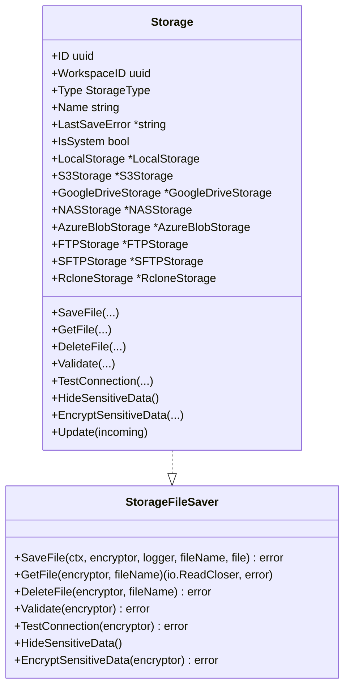
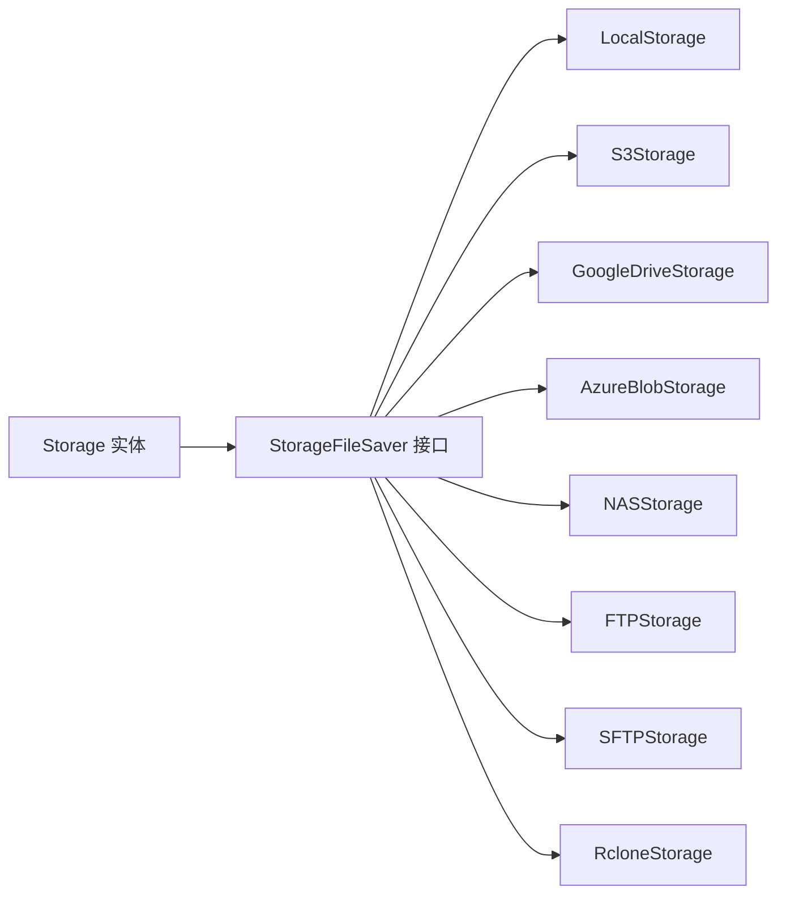
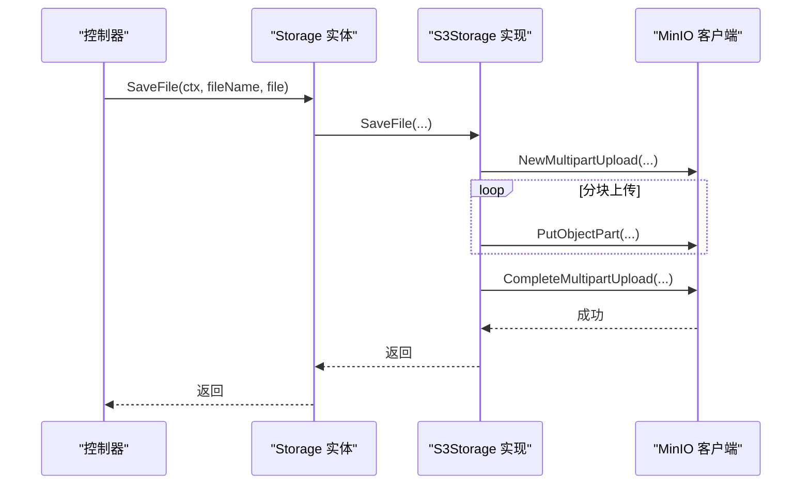

# 多存储目的地集成

<cite>
**本文档引用的文件**
- [interfaces.go](file://backend/internal/features/storages/interfaces.go)
- [model.go](file://backend/internal/features/storages/model.go)
- [enums.go](file://backend/internal/features/storages/enums.go)
- [dto.go](file://backend/internal/features/storages/dto.go)
- [local/model.go](file://backend/internal/features/storages/models/local/model.go)
- [s3/model.go](file://backend/internal/features/storages/models/s3/model.go)
- [google_drive/model.go](file://backend/internal/features/storages/models/google_drive/model.go)
- [azure_blob/model.go](file://backend/internal/features/storages/models/azure_blob/model.go)
- [nas/model.go](file://backend/internal/features/storages/models/nas/model.go)
- [ftp/model.go](file://backend/internal/features/storages/models/ftp/model.go)
- [sftp/model.go](file://backend/internal/features/storages/models/sftp/model.go)
- [rclone/model.go](file://backend/internal/features/storages/models/rclone/model.go)
</cite>

## 目录
1. [简介](#简介)
2. [项目结构](#项目结构)
3. [核心组件](#核心组件)
4. [架构总览](#架构总览)
5. [详细组件分析](#详细组件分析)
6. [依赖关系分析](#依赖关系分析)
7. [性能考虑](#性能考虑)
8. [故障排除指南](#故障排除指南)
9. [结论](#结论)
10. [附录](#附录)

## 简介
本文件面向Databasus的多存储目的地集成功能，系统性阐述支持的存储类型、配置方法、认证机制与连接参数，并重点解析零信任存储的安全实现（包含密钥管理与数据完整性保护）。同时提供各存储类型的配置示例与最佳实践，涵盖性能优化、故障转移与成本控制策略，并解释存储抽象层的设计原理及扩展新存储类型的方法。

## 项目结构
多存储目的地功能位于后端模块的`features/storages`目录下，采用“抽象接口 + 具体实现”的分层设计：
- 抽象层：定义统一的存储接口与通用存储实体，负责路由到具体存储实现
- 实现层：针对不同存储类型（本地、S3、Google Drive、Azure Blob、NAS、FTP、SFTP、Rclone）提供独立的模型与适配器
- 控制层：通过控制器与DTO进行外部交互，调用抽象层完成保存、读取、删除、校验与连接测试等操作

图表来源
- [interfaces.go:13-33](file://backend/internal/features/storages/interfaces.go#L13-L33)
- [model.go:22-39](file://backend/internal/features/storages/model.go#L22-L39)

章节来源
- [interfaces.go:1-38](file://backend/internal/features/storages/interfaces.go#L1-L38)
- [model.go:1-185](file://backend/internal/features/storages/model.go#L1-L185)
- [enums.go:1-15](file://backend/internal/features/storages/enums.go#L1-L15)

## 核心组件
- 存储接口（StorageFileSaver）
  - 统一能力：保存文件、读取文件、删除文件、验证配置、测试连接、隐藏敏感信息、加密敏感信息
  - 设计要点：通过上下文控制取消与超时；对敏感字段进行加密存储；在失败时记录最后一次错误
- 通用存储实体（Storage）
  - 聚合多种具体存储模型，按类型动态路由到对应实现
  - 提供更新、隐藏与加密敏感数据的能力
- 存储类型枚举（StorageType）
  - 支持：LOCAL、S3、GOOGLE_DRIVE、NAS、AZURE_BLOB、FTP、SFTP、RCLONE

章节来源
- [interfaces.go:13-33](file://backend/internal/features/storages/interfaces.go#L13-L33)
- [model.go:22-185](file://backend/internal/features/storages/model.go#L22-L185)
- [enums.go:3-14](file://backend/internal/features/storages/enums.go#L3-L14)

## 架构总览
多存储目的地采用“策略模式 + 聚合模型”实现：
- 抽象接口定义统一行为
- 具体存储模型实现各自协议与认证
- 通用实体根据类型选择具体实现
- 加密器贯穿所有敏感字段的解密与加密过程

图表来源
- [interfaces.go:13-33](file://backend/internal/features/storages/interfaces.go#L13-L33)
- [model.go:22-185](file://backend/internal/features/storages/model.go#L22-L185)

## 详细组件分析

### 本地存储（LOCAL）
- 功能特性
  - 使用临时目录写入，再移动到最终备份目录，确保原子性
  - 跨设备移动失败时自动回退为复制+删除
  - 写入使用带背压的缓冲区，避免内存峰值过高
- 配置要点
  - 无需额外参数，依赖环境变量中的数据与临时目录路径
- 安全与可靠性
  - 无外部认证；通过文件系统权限与目录隔离保障安全
  - 移动前显式关闭文件以兼容Windows
- 性能建议
  - 将临时目录与备份目录置于同一磁盘，减少跨设备移动开销
  - 合理设置数据库导出缓冲，避免与本地写入形成竞争

章节来源
- [local/model.go:38-137](file://backend/internal/features/storages/models/local/model.go#L38-L137)
- [local/model.go:202-246](file://backend/internal/features/storages/models/local/model.go#L202-L246)

### 对象存储（S3）
- 功能特性
  - 支持虚拟主机样式与路径样式的桶查找策略
  - 分块上传（默认16MB），MD5校验，断点续传友好
  - 可选跳过TLS校验与存储类别设置
- 认证与连接
  - 必填：桶名、访问密钥、私有密钥
  - 可选：自定义端点、区域、前缀、是否使用虚拟主机样式、TLS校验开关
- 安全与完整性
  - 上传时计算MD5并以Base64形式提交，结合内容MD5校验
  - 连接测试通过上传/删除测试文件验证读写权限
- 性能与成本
  - 合理设置分块大小与并发度，平衡吞吐与内存占用
  - 利用存储类别（如标准/低频/归档）控制成本

章节来源
- [s3/model.go:38-50](file://backend/internal/features/storages/models/s3/model.go#L38-L50)
- [s3/model.go:251-322](file://backend/internal/features/storages/models/s3/model.go#L251-L322)
- [s3/model.go:390-479](file://backend/internal/features/storages/models/s3/model.go#L390-L479)

### 云存储（Google Drive）
- 功能特性
  - 自动创建名为“databasus_backups”的根目录
  - 断点续传上传，带背压读取器防止内存峰值
  - 自动刷新OAuth令牌，处理401类鉴权错误
- 认证与连接
  - 必填：客户端ID、客户端密钥、包含刷新令牌的Token JSON
  - 连接测试：创建/读取/删除测试文件
- 安全与完整性
  - 敏感信息（密钥、令牌）加密存储；日志中掩码输出
  - 通过OAuth 2.0授权，支持刷新令牌轮换
- 性能与成本
  - 使用分块上传，结合数据库导出背压，避免网络拥塞
  - 合理设置分块大小，平衡上传速度与内存占用

章节来源
- [google_drive/model.go:38-43](file://backend/internal/features/storages/models/google_drive/model.go#L38-L43)
- [google_drive/model.go:228-289](file://backend/internal/features/storages/models/google_drive/model.go#L228-L289)
- [google_drive/model.go:328-388](file://backend/internal/features/storages/models/google_drive/model.go#L328-L388)

### 云存储（Azure Blob）
- 功能特性
  - 支持连接字符串与账户密钥两种认证方式
  - 分块上传（块列表），MD5校验，断点续传友好
  - 可配置前缀与自定义终结点
- 认证与连接
  - 连接字符串或账户名+密钥二选一
  - 连接测试：检查容器属性，上传/删除测试块
- 安全与完整性
  - 敏感信息加密存储；日志中掩码输出
  - TLS握手与空闲连接超时可配置
- 性能与成本
  - 块大小与并发度需与网络带宽匹配
  - 使用合适的存储层级与热/冷层降低长期存储成本

章节来源
- [azure_blob/model.go:53-62](file://backend/internal/features/storages/models/azure_blob/model.go#L53-L62)
- [azure_blob/model.go:237-286](file://backend/internal/features/storages/models/azure_blob/model.go#L237-L286)
- [azure_blob/model.go:346-420](file://backend/internal/features/storages/models/azure_blob/model.go#L346-L420)

### 网络存储（NAS）
- 功能特性
  - 通过SMB/CIFS协议连接共享，支持域用户
  - 自动创建目标路径（递归创建）
  - 写入带背压，资源清理封装
- 认证与连接
  - 必填：主机、共享名、用户名、密码、端口
  - 可选：启用SSL/TLS、域、路径前缀
- 安全与可靠性
  - 密码加密存储；可选择跳过主机证书校验（不推荐）
  - 文件读取器封装资源释放，避免句柄泄漏
- 性能与成本
  - 合理设置块大小，避免网络拥塞
  - 将备份路径与主数据分离，减少锁争用

章节来源
- [nas/model.go:30-40](file://backend/internal/features/storages/models/nas/model.go#L30-L40)
- [nas/model.go:253-279](file://backend/internal/features/storages/models/nas/model.go#L253-L279)
- [nas/model.go:311-371](file://backend/internal/features/storages/models/nas/model.go#L311-L371)

### 网络存储（FTP）
- 功能特性
  - 支持明文与显式TLS两种模式
  - 自动创建目标路径
  - 写入带上下文控制，支持取消
- 认证与连接
  - 必填：主机、用户名、密码、端口
  - 可选：启用TLS、跳过证书校验、路径前缀
- 安全与可靠性
  - 明文FTP存在风险，建议优先使用FTPS
  - 密码加密存储
- 性能与成本
  - 合理设置块大小与并发度
  - 与NAS类似，路径规划影响I/O性能

章节来源
- [ftp/model.go:26-35](file://backend/internal/features/storages/models/ftp/model.go#L26-L35)
- [ftp/model.go:182-201](file://backend/internal/features/storages/models/ftp/model.go#L182-L201)
- [ftp/model.go:232-278](file://backend/internal/features/storages/models/ftp/model.go#L232-L278)

### 网络存储（SFTP）
- 功能特性
  - 支持密码与私钥两种认证方式
  - 自动创建目标路径
  - 写入带上下文控制，支持取消
- 认证与连接
  - 必填：主机、用户名、端口
  - 至少提供密码或私钥其一
  - 可选：跳过主机密钥校验（不推荐）、路径前缀
- 安全与可靠性
  - 私钥认证更安全；密码与私钥均加密存储
  - 可配置跳过主机密钥校验仅用于特殊场景
- 性能与成本
  - 合理设置块大小与并发度
  - 与NAS/FTP类似，路径规划影响I/O性能

章节来源
- [sftp/model.go:26-35](file://backend/internal/features/storages/models/sftp/model.go#L26-L35)
- [sftp/model.go:203-223](file://backend/internal/features/storages/models/sftp/model.go#L203-L223)
- [sftp/model.go:266-333](file://backend/internal/features/storages/models/sftp/model.go#L266-L333)

### 第三方服务（Rclone）
- 功能特性
  - 通过Rclone配置内容驱动任意后端（如S3、Google Drive、OneDrive等）
  - 单个存储实例仅支持一个远端配置
  - 支持远程路径前缀
- 认证与连接
  - 必填：配置内容（含远端配置）
  - 连接测试：上传/下载/删除测试文件
- 安全与可靠性
  - 配置内容加密存储；解析时加互斥锁避免并发污染
- 性能与成本
  - 由底层后端决定；合理设置Rclone参数提升性能
  - 按后端特性选择合适的缓存与并发策略

章节来源
- [rclone/model.go:30-34](file://backend/internal/features/storages/models/rclone/model.go#L30-L34)
- [rclone/model.go:171-207](file://backend/internal/features/storages/models/rclone/model.go#L171-L207)
- [rclone/model.go:233-284](file://backend/internal/features/storages/models/rclone/model.go#L233-L284)

### 零信任存储的安全实现
- 数据在传输与静态层面的安全
  - S3/Azure Blob/FTP/FTPS/NAS/SFTP/Rclone均支持TLS/SSL配置
  - Google Drive使用OAuth 2.0，支持令牌刷新
- 密钥管理
  - 所有敏感字段（密钥、令牌、密码）在持久化前加密，运行时解密
  - 提供隐藏敏感数据与加密敏感数据的统一接口
- 数据完整性保护
  - S3上传时计算MD5并提交；Azure Blob分块上传后提交块列表
  - 连接测试包含上传/读取/删除流程，确保端到端可用性
- 最佳实践
  - 优先使用加密传输与最小权限原则
  - 定期轮换密钥与令牌，启用自动刷新
  - 对于公网访问的存储，开启TLS校验与严格主机密钥校验

章节来源
- [s3/model.go:109-146](file://backend/internal/features/storages/models/s3/model.go#L109-L146)
- [azure_blob/model.go:112-154](file://backend/internal/features/storages/models/azure_blob/model.go#L112-L154)
- [google_drive/model.go:328-388](file://backend/internal/features/storages/models/google_drive/model.go#L328-L388)
- [nas/model.go:354-371](file://backend/internal/features/storages/models/nas/model.go#L354-L371)
- [ftp/model.go:255-278](file://backend/internal/features/storages/models/ftp/model.go#L255-L278)
- [sftp/model.go:303-333](file://backend/internal/features/storages/models/sftp/model.go#L303-L333)

### 配置示例与最佳实践
- 本地存储
  - 无需配置项；确保临时目录与备份目录在同一文件系统上
  - 建议：将临时目录映射到内存盘以提升写入性能
- S3
  - 必填：桶名、访问密钥、私有密钥
  - 建议：启用虚拟主机样式以提升DNS解析效率；根据数据生命周期选择存储类别
- Google Drive
  - 必填：客户端ID、客户端密钥、包含刷新令牌的Token JSON
  - 建议：定期检查令牌有效性，避免因过期导致上传失败
- Azure Blob
  - 必填：容器名；连接字符串或账户名+密钥
  - 建议：使用连接字符串简化部署；合理设置前缀隔离不同工作空间
- NAS
  - 必填：主机、共享名、用户名、密码、端口
  - 建议：启用SSL/TLS；将备份路径与业务数据分离
- FTP
  - 必填：主机、用户名、密码、端口
  - 建议：优先使用FTPS；合理设置块大小与并发度
- SFTP
  - 必填：主机、用户名、端口；至少提供密码或私钥
  - 建议：优先使用私钥认证；谨慎使用跳过主机密钥校验
- Rclone
  - 必填：配置内容（包含单个远端）
  - 建议：为每个远端单独创建一个存储实例；合理设置Rclone参数

章节来源
- [local/model.go:38-137](file://backend/internal/features/storages/models/local/model.go#L38-L137)
- [s3/model.go:251-322](file://backend/internal/features/storages/models/s3/model.go#L251-L322)
- [google_drive/model.go:228-289](file://backend/internal/features/storages/models/google_drive/model.go#L228-L289)
- [azure_blob/model.go:237-286](file://backend/internal/features/storages/models/azure_blob/model.go#L237-L286)
- [nas/model.go:253-279](file://backend/internal/features/storages/models/nas/model.go#L253-L279)
- [ftp/model.go:182-201](file://backend/internal/features/storages/models/ftp/model.go#L182-L201)
- [sftp/model.go:203-223](file://backend/internal/features/storages/models/sftp/model.go#L203-L223)
- [rclone/model.go:171-207](file://backend/internal/features/storages/models/rclone/model.go#L171-L207)

### 扩展新存储类型的方法
- 新建模型文件
  - 在`models/<new>/model.go`中实现`StorageFileSaver`接口的所有方法
  - 定义模型结构体，包含必要的认证与连接参数
- 注册到通用实体
  - 在`Storage`聚合中添加新模型字段
  - 在`getSpecificStorage()`与`Update()`中增加类型分支
- 添加枚举值
  - 在`enums.go`中新增存储类型常量
- 控制器与DTO
  - 在控制器与DTO中增加新类型的请求/响应定义
- 测试与验证
  - 编写单元测试覆盖保存、读取、删除、验证与连接测试
  - 提供配置示例与最佳实践文档

章节来源
- [model.go:163-184](file://backend/internal/features/storages/model.go#L163-L184)
- [enums.go:5-14](file://backend/internal/features/storages/enums.go#L5-L14)

## 依赖关系分析
- 抽象接口与实现解耦
  - 通过接口隔离具体存储差异，便于扩展与替换
- 加密器贯穿始终
  - 所有敏感字段在持久化前加密，在使用时解密
- 外部依赖
  - S3：MinIO SDK
  - Google Drive：OAuth2与Google API
  - Azure Blob：Azure SDK
  - NAS：SMB2库
  - FTP/SFTP：标准库与第三方库
  - Rclone：Rclone框架

图表来源
- [interfaces.go:13-33](file://backend/internal/features/storages/interfaces.go#L13-L33)
- [model.go:22-39](file://backend/internal/features/storages/model.go#L22-L39)

章节来源
- [interfaces.go:1-38](file://backend/internal/features/storages/interfaces.go#L1-L38)
- [model.go:1-185](file://backend/internal/features/storages/model.go#L1-L185)

## 性能考虑
- 背压与缓冲
  - 多数实现采用固定大小缓冲与上下文控制，避免内存峰值
- 并发与超时
  - 为HTTP/TLS/网络操作设置明确超时，防止阻塞
- 存储类别与分层
  - S3/Azure支持存储类别/层级，按数据访问频率选择合适层级
- 网络与I/O
  - NAS/FTP/SFTP/Rclone的块大小与并发度需与网络带宽匹配
  - 路径规划与目录隔离可减少锁争用与I/O抖动

## 故障排除指南
- 常见问题定位
  - 连接失败：检查主机、端口、TLS配置与网络连通性
  - 权限不足：确认凭据正确性与最小权限策略
  - 上传中断：检查上下文取消信号与背压设置
  - 文件不存在：确认路径前缀与目标文件名
- 日志与诊断
  - 使用测试连接功能快速验证配置
  - 对Google Drive启用自动令牌刷新与错误重试
- 回滚与恢复
  - 本地存储支持原子移动，失败时保留临时文件便于排查
  - 对象存储与Rclone支持断点续传与重试

章节来源
- [s3/model.go:265-322](file://backend/internal/features/storages/models/s3/model.go#L265-L322)
- [google_drive/model.go:328-388](file://backend/internal/features/storages/models/google_drive/model.go#L328-L388)
- [azure_blob/model.go:237-286](file://backend/internal/features/storages/models/azure_blob/model.go#L237-L286)
- [nas/model.go:253-279](file://backend/internal/features/storages/models/nas/model.go#L253-L279)
- [ftp/model.go:182-201](file://backend/internal/features/storages/models/ftp/model.go#L182-L201)
- [sftp/model.go:203-223](file://backend/internal/features/storages/models/sftp/model.go#L203-L223)
- [rclone/model.go:171-207](file://backend/internal/features/storages/models/rclone/model.go#L171-L207)

## 结论
Databasus的多存储目的地集成功能通过统一抽象接口与加密器贯穿的零信任设计，实现了对本地、云、网络与第三方服务的统一接入。各存储类型在认证、连接、安全与性能方面各有侧重，配合测试连接与配置示例，可满足从开发到生产的多样化需求。通过扩展新存储类型的方法，团队可快速适配新的存储后端，保持系统的可演进性与安全性。

## 附录
- 数据流概览（以S3为例）

图表来源
- [model.go:41-58](file://backend/internal/features/storages/model.go#L41-L58)
- [s3/model.go:56-186](file://backend/internal/features/storages/models/s3/model.go#L56-L186)