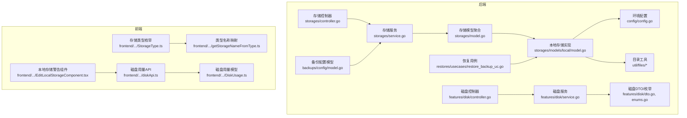
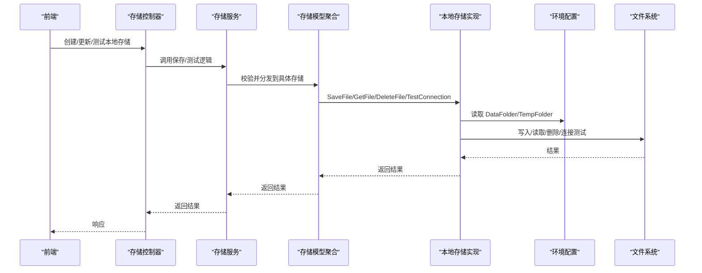
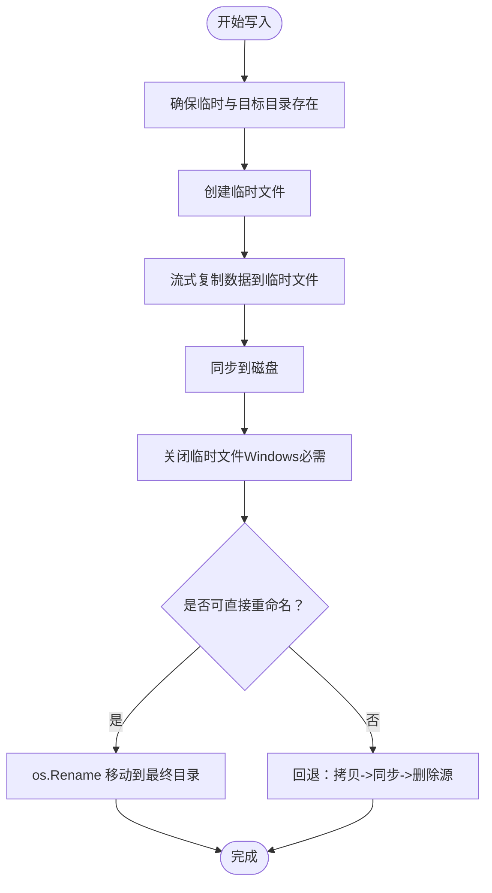
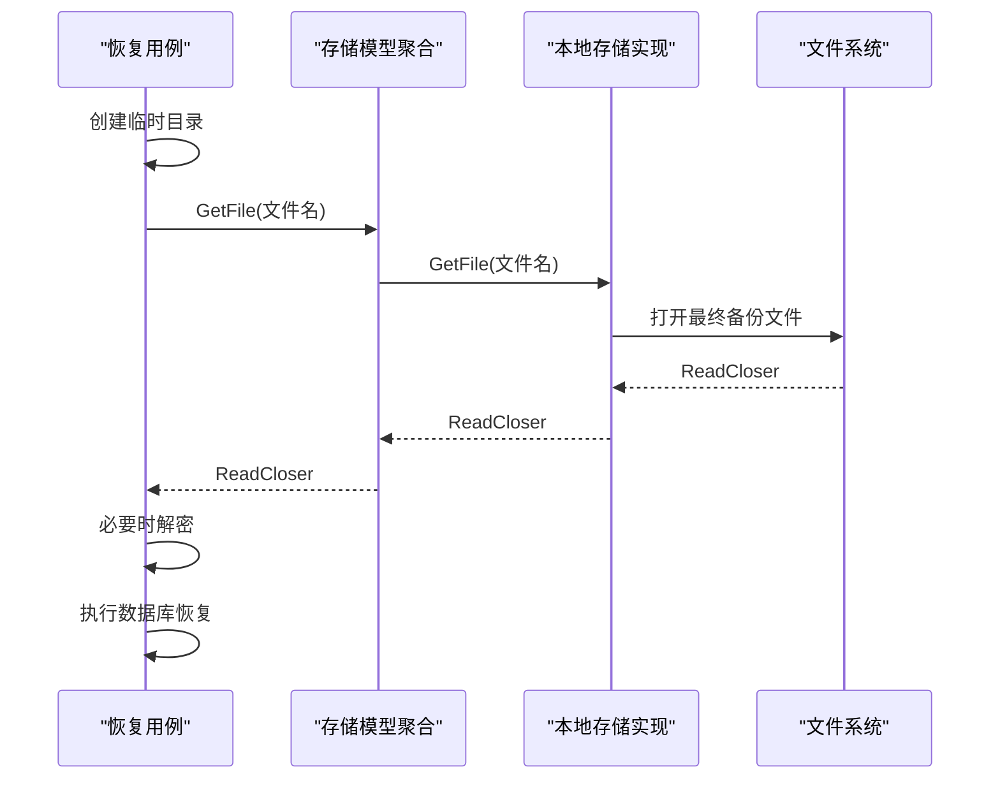
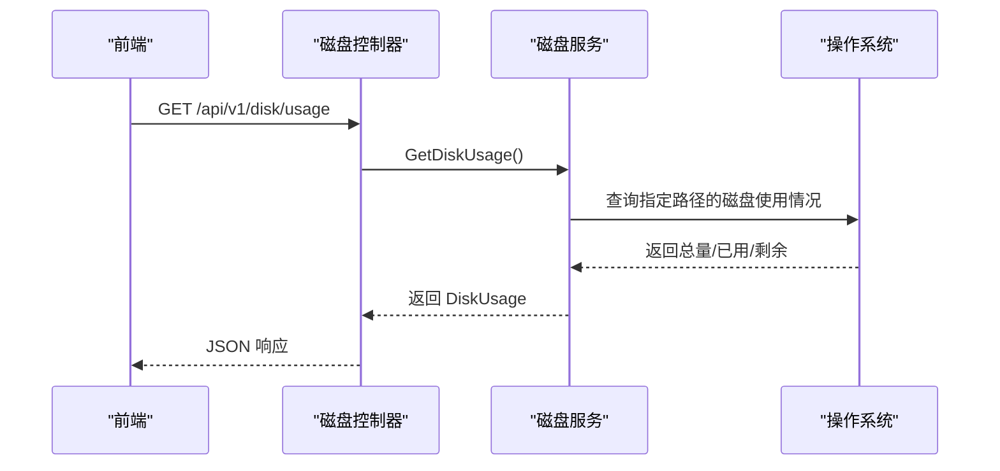
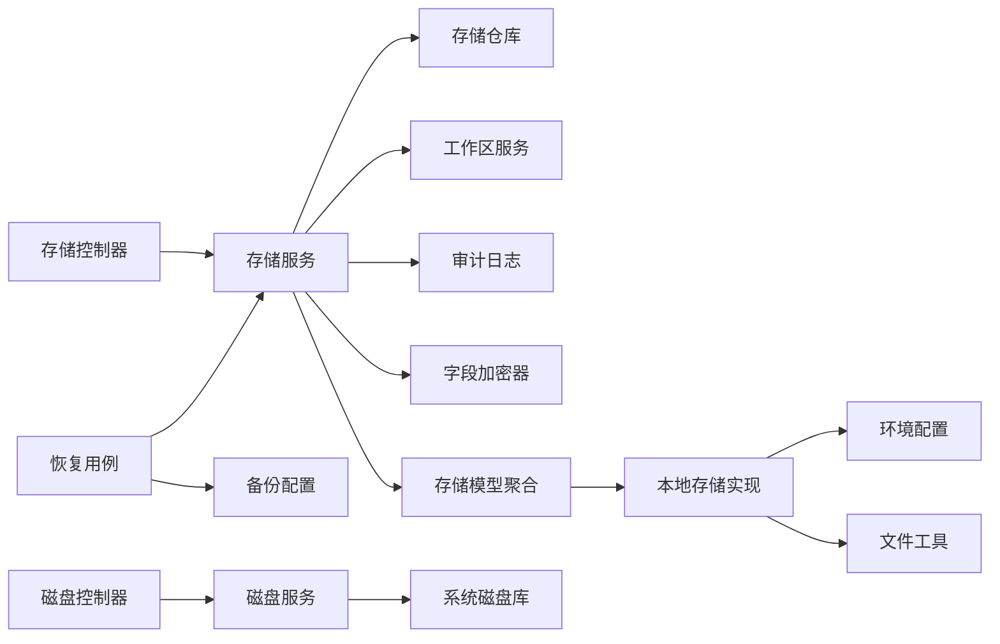

# 本地存储

<cite>
**本文引用的文件**
- [backend/internal/features/storages/controller.go](file://backend/internal/features/storages/controller.go)
- [backend/internal/features/storages/service.go](file://backend/internal/features/storages/service.go)
- [backend/internal/features/storages/model.go](file://backend/internal/features/storages/model.go)
- [backend/internal/features/storages/models/local/model.go](file://backend/internal/features/storages/models/local/model.go)
- [backend/internal/config/config.go](file://backend/internal/config/config.go)
- [backend/internal/util/files/creator.go](file://backend/internal/util/files/creator.go)
- [backend/internal/util/files/sanitizer.go](file://backend/internal/util/files/sanitizer.go)
- [backend/internal/features/disk/controller.go](file://backend/internal/features/disk/controller.go)
- [backend/internal/features/disk/service.go](file://backend/internal/features/disk/service.go)
- [backend/internal/features/disk/dto.go](file://backend/internal/features/disk/dto.go)
- [backend/internal/features/disk/enums.go](file://backend/internal/features/disk/enums.go)
- [backend/internal/features/restores/usecases/restore_backup_uc.go](file://backend/internal/features/restores/usecases/restore_backup_uc.go)
- [backend/internal/features/backups/config/model.go](file://backend/internal/features/backups/config/model.go)
- [frontend/src/entity/storages/models/StorageType.ts](file://frontend/src/entity/storages/models/StorageType.ts)
- [frontend/src/entity/storages/models/getStorageNameFromType.ts](file://frontend/src/entity/storages/models/getStorageNameFromType.ts)
- [frontend/src/features/storages/ui/edit/storages/EditLocalStorageComponent.tsx](file://frontend/src/features/storages/ui/edit/storages/EditLocalStorageComponent.tsx)
- [frontend/src/entity/disk/api/diskApi.ts](file://frontend/src/entity/disk/api/diskApi.ts)
- [frontend/src/entity/disk/model/DiskUsage.ts](file://frontend/src/entity/disk/model/DiskUsage.ts)
- [frontend/src/entity/disk/index.ts](file://frontend/src/entity/disk/index.ts)
- [.github/SECURITY.md](file://.github/SECURITY.md)
</cite>

## 目录
1. [简介](#简介)
2. [项目结构](#项目结构)
3. [核心组件](#核心组件)
4. [架构总览](#架构总览)
5. [详细组件分析](#详细组件分析)
6. [依赖分析](#依赖分析)
7. [性能考量](#性能考量)
8. [故障排查指南](#故障排查指南)
9. [结论](#结论)
10. [附录](#附录)

## 简介
本章节面向运维与开发人员，系统性阐述 Databasus 的“本地存储”能力：如何在后端以文件系统形式保存备份数据，如何进行配置、安全与权限管理，以及在不同操作系统（Linux、Windows、macOS）上的差异与注意事项。同时提供容量规划、性能优化、备份与恢复流程、故障恢复与最佳实践。

## 项目结构
本地存储由后端存储服务与控制器、本地存储实现、环境变量与目录管理、磁盘使用查询等模块共同组成；前端提供类型定义与提示信息，帮助用户正确选择与配置本地存储。

**图表来源**
- [backend/internal/features/storages/controller.go:1-340](file://backend/internal/features/storages/controller.go#L1-L340)
- [backend/internal/features/storages/service.go:1-409](file://backend/internal/features/storages/service.go#L1-L409)
- [backend/internal/features/storages/model.go:1-185](file://backend/internal/features/storages/model.go#L1-L185)
- [backend/internal/features/storages/models/local/model.go:1-279](file://backend/internal/features/storages/models/local/model.go#L1-L279)
- [backend/internal/config/config.go:326-334](file://backend/internal/config/config.go#L326-L334)
- [backend/internal/util/files/creator.go:8-22](file://backend/internal/util/files/creator.go#L8-L22)
- [backend/internal/features/disk/controller.go:1-34](file://backend/internal/features/disk/controller.go#L1-L34)
- [backend/internal/features/disk/service.go:1-57](file://backend/internal/features/disk/service.go#L1-L57)
- [backend/internal/features/disk/dto.go:1-8](file://backend/internal/features/disk/dto.go#L1-L8)
- [backend/internal/features/disk/enums.go:1-8](file://backend/internal/features/disk/enums.go#L1-L8)
- [backend/internal/features/restores/usecases/restore_backup_uc.go:519-563](file://backend/internal/features/restores/usecases/restore_backup_uc.go#L519-L563)
- [backend/internal/features/backups/config/model.go:101-108](file://backend/internal/features/backups/config/model.go#L101-L108)
- [frontend/src/entity/storages/models/StorageType.ts:1-10](file://frontend/src/entity/storages/models/StorageType.ts#L1-L10)
- [frontend/src/entity/storages/models/getStorageNameFromType.ts:1-24](file://frontend/src/entity/storages/models/getStorageNameFromType.ts#L1-L24)
- [frontend/src/features/storages/ui/edit/storages/EditLocalStorageComponent.tsx:1-14](file://frontend/src/features/storages/ui/edit/storages/EditLocalStorageComponent.tsx#L1-L14)
- [frontend/src/entity/disk/api/diskApi.ts:1-15](file://frontend/src/entity/disk/api/diskApi.ts#L1-L15)
- [frontend/src/entity/disk/model/DiskUsage.ts:1-8](file://frontend/src/entity/disk/model/DiskUsage.ts#L1-L8)

**章节来源**
- [backend/internal/features/storages/controller.go:1-340](file://backend/internal/features/storages/controller.go#L1-L340)
- [backend/internal/features/storages/service.go:1-409](file://backend/internal/features/storages/service.go#L1-L409)
- [backend/internal/features/storages/model.go:1-185](file://backend/internal/features/storages/model.go#L1-L185)
- [backend/internal/features/storages/models/local/model.go:1-279](file://backend/internal/features/storages/models/local/model.go#L1-L279)
- [backend/internal/config/config.go:326-334](file://backend/internal/config/config.go#L326-L334)
- [backend/internal/util/files/creator.go:8-22](file://backend/internal/util/files/creator.go#L8-L22)
- [backend/internal/features/disk/controller.go:1-34](file://backend/internal/features/disk/controller.go#L1-L34)
- [backend/internal/features/disk/service.go:1-57](file://backend/internal/features/disk/service.go#L1-L57)
- [backend/internal/features/disk/dto.go:1-8](file://backend/internal/features/disk/dto.go#L1-L8)
- [backend/internal/features/disk/enums.go:1-8](file://backend/internal/features/disk/enums.go#L1-L8)
- [backend/internal/features/restores/usecases/restore_backup_uc.go:519-563](file://backend/internal/features/restores/usecases/restore_backup_uc.go#L519-L563)
- [backend/internal/features/backups/config/model.go:101-108](file://backend/internal/features/backups/config/model.go#L101-L108)
- [frontend/src/entity/storages/models/StorageType.ts:1-10](file://frontend/src/entity/storages/models/StorageType.ts#L1-L10)
- [frontend/src/entity/storages/models/getStorageNameFromType.ts:1-24](file://frontend/src/entity/storages/models/getStorageNameFromType.ts#L1-L24)
- [frontend/src/features/storages/ui/edit/storages/EditLocalStorageComponent.tsx:1-14](file://frontend/src/features/storages/ui/edit/storages/EditLocalStorageComponent.tsx#L1-L14)
- [frontend/src/entity/disk/api/diskApi.ts:1-15](file://frontend/src/entity/disk/api/diskApi.ts#L1-L15)
- [frontend/src/entity/disk/model/DiskUsage.ts:1-8](file://frontend/src/entity/disk/model/DiskUsage.ts#L1-L8)

## 核心组件
- 存储控制器与服务：负责本地存储的创建、更新、连接测试、删除、迁移等生命周期管理，并在云模式下对本地存储进行访问限制。
- 存储模型聚合：统一对外暴露 SaveFile/GetFile/DeleteFile/TestConnection 等接口，内部根据类型分发到具体存储实现。
- 本地存储实现：基于文件系统，使用临时目录写入、落盘移动、跨设备重命名回退、同步落盘等机制保障可靠性。
- 环境与目录：集中管理 DataFolder（最终备份目录）、TempFolder（临时目录）、密钥文件路径等。
- 磁盘用量：按平台获取可用空间，Linux 下针对容器场景定位到 /databasus-data 目录。
- 恢复流程：从本地存储下载备份文件，必要时解密，再执行数据库恢复。
- 备份配置：在云模式强制加密，确保本地存储安全性。

**章节来源**
- [backend/internal/features/storages/controller.go:29-71](file://backend/internal/features/storages/controller.go#L29-L71)
- [backend/internal/features/storages/service.go:54-147](file://backend/internal/features/storages/service.go#L54-L147)
- [backend/internal/features/storages/model.go:41-85](file://backend/internal/features/storages/model.go#L41-L85)
- [backend/internal/features/storages/models/local/model.go:38-137](file://backend/internal/features/storages/models/local/model.go#L38-L137)
- [backend/internal/config/config.go:326-334](file://backend/internal/config/config.go#L326-L334)
- [backend/internal/features/disk/service.go:15-48](file://backend/internal/features/disk/service.go#L15-L48)
- [backend/internal/features/restores/usecases/restore_backup_uc.go:519-563](file://backend/internal/features/restores/usecases/restore_backup_uc.go#L519-L563)
- [backend/internal/features/backups/config/model.go:101-108](file://backend/internal/features/backups/config/model.go#L101-L108)

## 架构总览
本地存储在后端采用“控制器-服务-模型-实现”的分层设计，前端通过类型枚举与名称映射辅助用户选择与提示。磁盘用量查询用于容量监控与告警。

**图表来源**
- [backend/internal/features/storages/controller.go:42-71](file://backend/internal/features/storages/controller.go#L42-L71)
- [backend/internal/features/storages/service.go:54-147](file://backend/internal/features/storages/service.go#L54-L147)
- [backend/internal/features/storages/model.go:41-85](file://backend/internal/features/storages/model.go#L41-L85)
- [backend/internal/features/storages/models/local/model.go:38-137](file://backend/internal/features/storages/models/local/model.go#L38-L137)
- [backend/internal/config/config.go:326-334](file://backend/internal/config/config.go#L326-L334)

## 详细组件分析

### 本地存储实现（文件系统）
- 目录与路径
  - 临时目录：TempFolder，用于写入临时文件，随后移动至最终位置。
  - 最终目录：DataFolder/backups，存放最终备份文件。
  - 目录权限：创建目录时使用统一权限掩码，确保可读可执行。
- 写入流程
  - 使用带上下文的复制函数，支持取消与流式写入。
  - 写入完成后显式同步，保证数据落盘。
  - 移动文件前关闭句柄（Windows 需要），避免跨设备移动失败。
- 跨设备移动回退
  - 当 os.Rename 报 EXDEV（跨设备链接）时，回退为拷贝+同步+删除源文件。
- 连接测试
  - 在 TempFolder 创建/删除一个测试文件，验证写入与删除能力。
- 文件名清理
  - 对文件名进行跨平台清理，替换非法字符，避免不同系统与云存储兼容问题。

**图表来源**
- [backend/internal/features/storages/models/local/model.go:38-137](file://backend/internal/features/storages/models/local/model.go#L38-L137)
- [backend/internal/features/storages/models/local/model.go:202-246](file://backend/internal/features/storages/models/local/model.go#L202-L246)
- [backend/internal/util/files/creator.go:8-22](file://backend/internal/util/files/creator.go#L8-L22)

**章节来源**
- [backend/internal/features/storages/models/local/model.go:38-137](file://backend/internal/features/storages/models/local/model.go#L38-L137)
- [backend/internal/features/storages/models/local/model.go:175-190](file://backend/internal/features/storages/models/local/model.go#L175-L190)
- [backend/internal/util/files/creator.go:8-22](file://backend/internal/util/files/creator.go#L8-L22)
- [backend/internal/util/files/sanitizer.go:24-48](file://backend/internal/util/files/sanitizer.go#L24-L48)

### 环境与目录管理
- DataFolder：最终备份目录，位于项目根目录下的 databasus-data/backups。
- TempFolder：临时目录，位于项目根目录下的 databasus-data/temp。
- SecretKeyPath/TelemetryInstancePath：其他关键文件路径也位于同一父目录，便于统一管理与备份。
- 容器场景：Linux 容器中，DataFolder 的父目录即 /databasus-data，用于磁盘用量查询与容量规划。

**章节来源**
- [backend/internal/config/config.go:326-334](file://backend/internal/config/config.go#L326-L334)
- [backend/internal/features/disk/service.go:29-35](file://backend/internal/features/disk/service.go#L29-L35)

### 存储服务与控制器
- 控制器路由：提供保存、查询、删除、连接测试、工作区转移等接口。
- 服务逻辑：
  - 保存存储时进行权限校验与类型校验；在云模式下限制非管理员使用本地存储。
  - 测试连接：调用具体存储实现的 TestConnection。
  - 删除与转移：检查关联数据库数量、系统存储限制等。

**章节来源**
- [backend/internal/features/storages/controller.go:19-340](file://backend/internal/features/storages/controller.go#L19-L340)
- [backend/internal/features/storages/service.go:54-147](file://backend/internal/features/storages/service.go#L54-L147)
- [backend/internal/features/storages/service.go:249-280](file://backend/internal/features/storages/service.go#L249-L280)
- [backend/internal/features/storages/service.go:282-315](file://backend/internal/features/storages/service.go#L282-L315)

### 恢复流程（从本地存储）
- 恢复用例会先创建临时目录，下载备份文件到临时文件，必要时进行解密处理，最后执行数据库恢复。
- 该流程与本地存储实现配合，确保从 DataFolder 正确读取备份文件。

**图表来源**
- [backend/internal/features/restores/usecases/restore_backup_uc.go:519-563](file://backend/internal/features/restores/usecases/restore_backup_uc.go#L519-L563)
- [backend/internal/features/storages/model.go:60-65](file://backend/internal/features/storages/model.go#L60-L65)
- [backend/internal/features/storages/models/local/model.go:139-155](file://backend/internal/features/storages/models/local/model.go#L139-L155)

**章节来源**
- [backend/internal/features/restores/usecases/restore_backup_uc.go:519-563](file://backend/internal/features/restores/usecases/restore_backup_uc.go#L519-L563)
- [backend/internal/features/storages/model.go:60-65](file://backend/internal/features/storages/model.go#L60-L65)
- [backend/internal/features/storages/models/local/model.go:139-155](file://backend/internal/features/storages/models/local/model.go#L139-L155)

### 磁盘用量与容量监控
- 后端提供 /api/v1/disk/usage 接口，返回平台、总空间、已用空间、剩余空间。
- Linux 场景下，路径指向 /databasus-data（即 DataFolder 的父目录），容器部署时尤为关键。
- 前端提供 diskApi 与 DiskUsage 类型，便于在 UI 中展示与告警。

**图表来源**
- [backend/internal/features/disk/controller.go:25-32](file://backend/internal/features/disk/controller.go#L25-L32)
- [backend/internal/features/disk/service.go:15-48](file://backend/internal/features/disk/service.go#L15-L48)
- [frontend/src/entity/disk/api/diskApi.ts:7-14](file://frontend/src/entity/disk/api/diskApi.ts#L7-L14)
- [frontend/src/entity/disk/model/DiskUsage.ts:3-8](file://frontend/src/entity/disk/model/DiskUsage.ts#L3-L8)

**章节来源**
- [backend/internal/features/disk/controller.go:1-34](file://backend/internal/features/disk/controller.go#L1-L34)
- [backend/internal/features/disk/service.go:15-48](file://backend/internal/features/disk/service.go#L15-L48)
- [backend/internal/features/disk/dto.go:3-8](file://backend/internal/features/disk/dto.go#L3-L8)
- [backend/internal/features/disk/enums.go:5-8](file://backend/internal/features/disk/enums.go#L5-L8)
- [frontend/src/entity/disk/api/diskApi.ts:1-15](file://frontend/src/entity/disk/api/diskApi.ts#L1-L15)
- [frontend/src/entity/disk/model/DiskUsage.ts:1-8](file://frontend/src/entity/disk/model/DiskUsage.ts#L1-L8)

### 前端交互与类型
- 存储类型枚举包含 LOCAL，便于在 UI 中识别本地存储。
- 类型名称映射用于显示“local storage”等友好文案。
- 本地存储编辑组件包含容量风险提示，提醒用户注意本地存储容量限制。

**章节来源**
- [frontend/src/entity/storages/models/StorageType.ts:1-10](file://frontend/src/entity/storages/models/StorageType.ts#L1-L10)
- [frontend/src/entity/storages/models/getStorageNameFromType.ts:3-6](file://frontend/src/entity/storages/models/getStorageNameFromType.ts#L3-L6)
- [frontend/src/features/storages/ui/edit/storages/EditLocalStorageComponent.tsx:6-9](file://frontend/src/features/storages/ui/edit/storages/EditLocalStorageComponent.tsx#L6-L9)

## 依赖分析
- 组件耦合
  - 存储控制器依赖存储服务；存储服务依赖存储仓库、工作区服务、审计日志与字段加密器。
  - 存储模型聚合根据类型分发到具体存储实现，降低上层复杂度。
  - 本地存储实现依赖环境配置与文件工具，确保目录与文件操作一致。
  - 恢复用例依赖存储服务与备份配置，形成“读取备份->解密->恢复”的闭环。
- 外部依赖
  - 磁盘用量查询依赖系统库，容器场景需确保挂载路径正确。
  - 备份配置在云模式强制加密，影响本地存储的安全策略。

**图表来源**
- [backend/internal/features/storages/controller.go:14-17](file://backend/internal/features/storages/controller.go#L14-L17)
- [backend/internal/features/storages/service.go:16-22](file://backend/internal/features/storages/service.go#L16-L22)
- [backend/internal/features/storages/model.go:22-39](file://backend/internal/features/storages/model.go#L22-L39)
- [backend/internal/features/storages/models/local/model.go:30-36](file://backend/internal/features/storages/models/local/model.go#L30-L36)
- [backend/internal/features/restores/usecases/restore_backup_uc.go:1-35](file://backend/internal/features/restores/usecases/restore_backup_uc.go#L1-L35)
- [backend/internal/features/backups/config/model.go:16-44](file://backend/internal/features/backups/config/model.go#L16-L44)
- [backend/internal/features/disk/controller.go:9-11](file://backend/internal/features/disk/controller.go#L9-L11)
- [backend/internal/features/disk/service.go:13-13](file://backend/internal/features/disk/service.go#L13-L13)

**章节来源**
- [backend/internal/features/storages/controller.go:14-17](file://backend/internal/features/storages/controller.go#L14-L17)
- [backend/internal/features/storages/service.go:16-22](file://backend/internal/features/storages/service.go#L16-L22)
- [backend/internal/features/storages/model.go:22-39](file://backend/internal/features/storages/model.go#L22-L39)
- [backend/internal/features/storages/models/local/model.go:30-36](file://backend/internal/features/storages/models/local/model.go#L30-L36)
- [backend/internal/features/restores/usecases/restore_backup_uc.go:1-35](file://backend/internal/features/restores/usecases/restore_backup_uc.go#L1-L35)
- [backend/internal/features/backups/config/model.go:16-44](file://backend/internal/features/backups/config/model.go#L16-L44)
- [backend/internal/features/disk/controller.go:9-11](file://backend/internal/features/disk/controller.go#L9-L11)
- [backend/internal/features/disk/service.go:13-13](file://backend/internal/features/disk/service.go#L13-L13)

## 性能考量
- I/O 缓冲与内存占用
  - 本地存储写入采用固定块大小的流式复制，双缓冲策略允许重叠 I/O，整体内存占用受控。
- 落盘可靠性
  - 写入后显式同步，减少断电或异常导致的数据丢失风险。
- 跨设备移动回退
  - 避免因 Docker 卷分离导致的跨设备重命名失败，自动回退为拷贝+删除，保证一致性。
- 并发与取消
  - 写入过程支持上下文取消，便于在长时间任务中优雅中断。
- 恢复阶段
  - 恢复流程先下载到临时文件，再进行解密与导入，避免直接对生产数据库进行大文件操作。

**章节来源**
- [backend/internal/features/storages/models/local/model.go:20-25](file://backend/internal/features/storages/models/local/model.go#L20-L25)
- [backend/internal/features/storages/models/local/model.go:82-91](file://backend/internal/features/storages/models/local/model.go#L82-L91)
- [backend/internal/features/storages/models/local/model.go:202-246](file://backend/internal/features/storages/models/local/model.go#L202-L246)
- [backend/internal/features/restores/usecases/restore_backup_uc.go:519-563](file://backend/internal/features/restores/usecases/restore_backup_uc.go#L519-L563)

## 故障排查指南
- 无法创建/写入临时文件
  - 检查 TempFolder 权限与可用空间；确认进程对目录具有写权限。
- 移动文件失败（跨设备错误）
  - 确认临时目录与备份目录在同一文件系统内；若使用 Docker，请将两个卷合并到同一挂载点。
- 读取备份文件失败
  - 确认 DataFolder 下存在对应文件名；文件名可能被清理工具替换非法字符。
- 连接测试失败
  - 在 TempFolder 创建/删除测试文件失败通常意味着权限或磁盘只读。
- 磁盘空间不足
  - 通过 /api/v1/disk/usage 获取当前可用空间，结合备份保留策略调整保留周期或启用压缩。
- 云模式限制
  - 在云模式下，非管理员用户无法使用本地存储；请升级为管理员或改用 S3 等云存储。

**章节来源**
- [backend/internal/util/files/creator.go:8-22](file://backend/internal/util/files/creator.go#L8-L22)
- [backend/internal/features/storages/models/local/model.go:202-246](file://backend/internal/features/storages/models/local/model.go#L202-L246)
- [backend/internal/features/storages/models/local/model.go:139-155](file://backend/internal/features/storages/models/local/model.go#L139-L155)
- [backend/internal/features/storages/models/local/model.go:175-190](file://backend/internal/features/storages/models/local/model.go#L175-L190)
- [backend/internal/features/disk/controller.go:25-32](file://backend/internal/features/disk/controller.go#L25-L32)
- [backend/internal/features/storages/service.go:67-70](file://backend/internal/features/storages/service.go#L67-L70)
- [backend/internal/features/storages/service.go:282-289](file://backend/internal/features/storages/service.go#L282-L289)

## 结论
本地存储为 Databasus 提供了简单可靠的备份落地方式，具备良好的跨平台兼容性与容错机制。通过严格的目录管理、权限控制与磁盘监控，可在多种部署环境下稳定运行。建议在生产环境中结合加密、容量规划与定期演练，确保备份与恢复的可靠性。

## 附录

### 配置方法与最佳实践
- 路径规划
  - 将 databasus-data 挂载到独立磁盘分区，避免与系统盘争用。
  - 保持 TempFolder 与 DataFolder 在同一文件系统，避免跨设备移动失败。
- 权限配置
  - 仅授予运行用户对 databasus-data 及其子目录的读写权限。
  - 避免将备份目录暴露给 Web 服务器或外部网络。
- 磁盘空间监控
  - 定期调用 /api/v1/disk/usage 获取可用空间，结合备份保留策略设定阈值告警。
- 备份策略
  - 在云模式下强制开启加密；本地存储同样建议启用加密，防止介质丢失造成数据泄露。
  - 合理设置保留策略（时间/数量/GFS），平衡存储成本与恢复需求。
- 故障恢复
  - 定期进行恢复演练，验证备份文件完整性与恢复流程。
  - 使用临时目录进行下载与解密，避免对生产数据库直接操作。

**章节来源**
- [backend/internal/config/config.go:326-334](file://backend/internal/config/config.go#L326-L334)
- [backend/internal/features/disk/service.go:15-48](file://backend/internal/features/disk/service.go#L15-L48)
- [backend/internal/features/backups/config/model.go:101-108](file://backend/internal/features/backups/config/model.go#L101-L108)
- [backend/internal/features/storages/service.go:67-70](file://backend/internal/features/storages/service.go#L67-L70)

### 不同操作系统差异与注意事项
- Linux（容器）
  - 磁盘用量查询路径为 /databasus-data；确保该目录挂载持久化存储。
  - 文件系统权限与 SELinux/AppArmor 可能影响写入，需适当放宽或使用特权模式。
- Windows
  - 移动文件前必须关闭临时文件句柄；否则重命名会失败。
  - 避免在只读卷上写入临时文件；确保 TempFolder 与 DataFolder 均可写。
- macOS
  - 文件名清理规则适用于所有平台，避免使用保留字符。
  - 注意 APFS 的快照与权限继承，必要时手动调整。

**章节来源**
- [backend/internal/features/disk/service.go:29-35](file://backend/internal/features/disk/service.go#L29-L35)
- [backend/internal/features/storages/models/local/model.go:93-97](file://backend/internal/features/storages/models/local/model.go#L93-L97)
- [backend/internal/util/files/sanitizer.go:24-48](file://backend/internal/util/files/sanitizer.go#L24-L48)

### 安全考虑
- 文件权限管理
  - 仅授予最小必要权限；避免组与其他用户访问备份目录。
- 访问控制
  - 云模式下限制本地存储使用；非管理员不可配置本地存储。
- 数据隔离
  - 备份文件与敏感凭据分离存放；使用加密保护备份文件。
- 企业级安全特性
  - 支持 AES-256-GCM 加密与零信任存储，即使在共享云存储中也能保障安全。

**章节来源**
- [backend/internal/features/storages/service.go:67-70](file://backend/internal/features/storages/service.go#L67-L70)
- [backend/internal/features/storages/service.go:282-289](file://backend/internal/features/storages/service.go#L282-L289)
- [.github/SECURITY.md:56-62](file://.github/SECURITY.md#L56-L62)