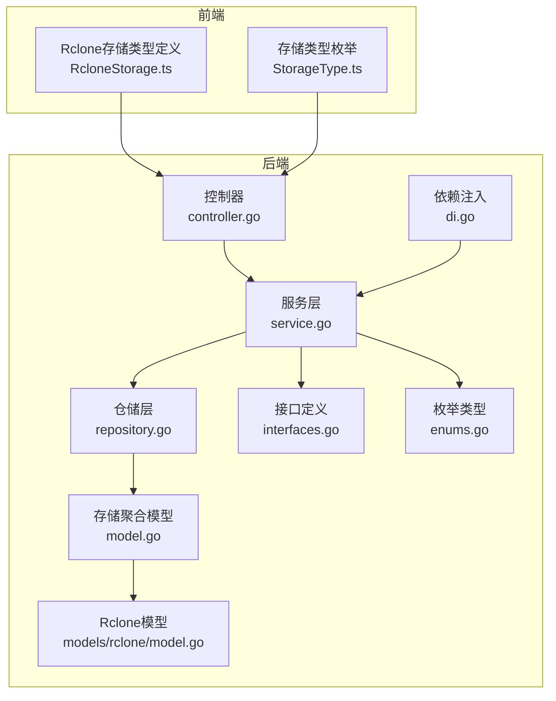
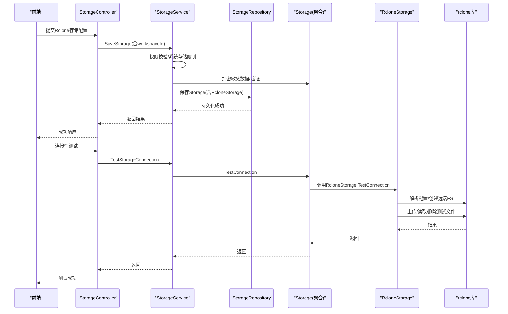
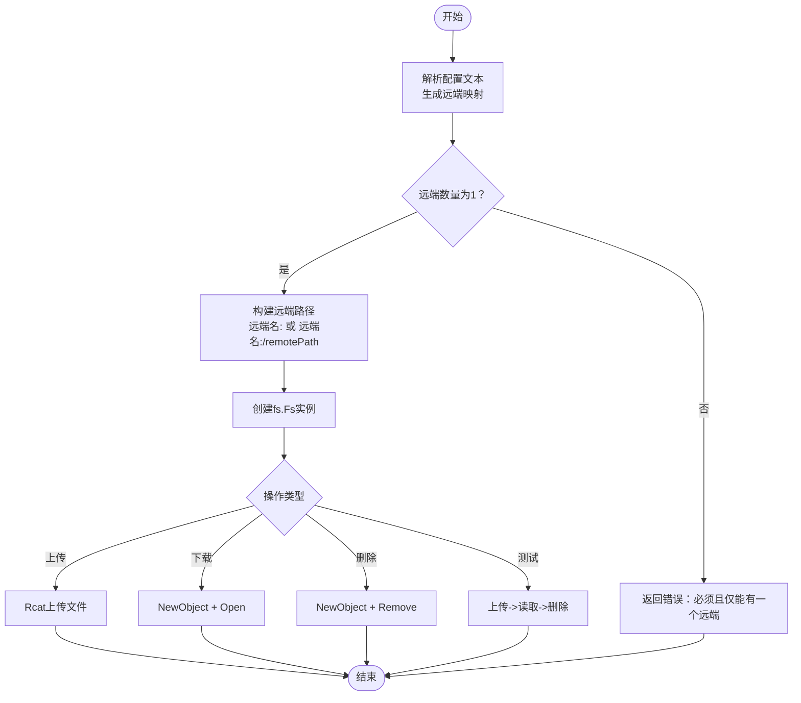
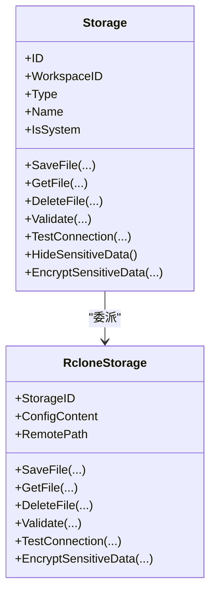
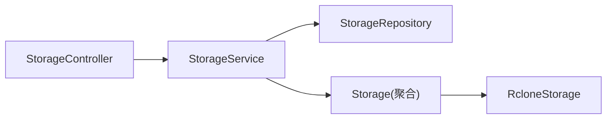
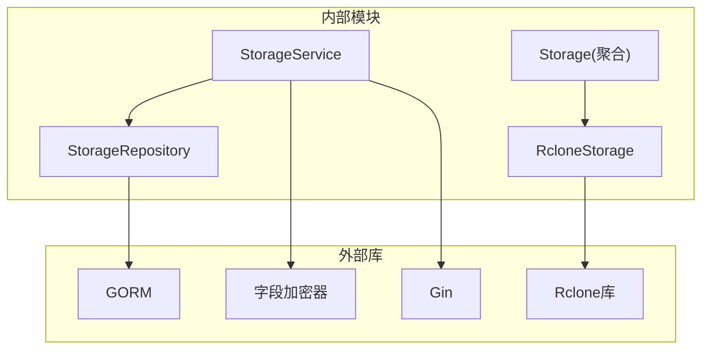

# 第三方存储服务

<cite>
**本文引用的文件**
- [backend/internal/features/storages/controller.go](file://backend/internal/features/storages/controller.go)
- [backend/internal/features/storages/service.go](file://backend/internal/features/storages/service.go)
- [backend/internal/features/storages/model.go](file://backend/internal/features/storages/model.go)
- [backend/internal/features/storages/interfaces.go](file://backend/internal/features/storages/interfaces.go)
- [backend/internal/features/storages/enums.go](file://backend/internal/features/storages/enums.go)
- [backend/internal/features/storages/repository.go](file://backend/internal/features/storages/repository.go)
- [backend/internal/features/storages/di.go](file://backend/internal/features/storages/di.go)
- [backend/internal/features/storages/models/rclone/model.go](file://backend/internal/features/storages/models/rclone/model.go)
- [backend/internal/features/storages/models/rclone/model_test.go](file://backend/internal/features/storages/models/rclone/model_test.go)
- [frontend/src/entity/storages/models/RcloneStorage.ts](file://frontend/src/entity/storages/models/RcloneStorage.ts)
- [frontend/src/entity/storages/models/StorageType.ts](file://frontend/src/entity/storages/models/StorageType.ts)
</cite>

## 目录
1. [简介](#简介)
2. [项目结构](#项目结构)
3. [核心组件](#核心组件)
4. [架构总览](#架构总览)
5. [详细组件分析](#详细组件分析)
6. [依赖关系分析](#依赖关系分析)
7. [性能考虑](#性能考虑)
8. [故障排除指南](#故障排除指南)
9. [结论](#结论)
10. [附录](#附录)

## 简介
本章节面向Databasus的第三方存储服务集成，重点围绕Rclone存储后端展开，涵盖配置方法、认证设置、同步选项、支持的云服务后端、高级配置（传输优化、缓存策略、错误重试）、在系统中的作用与优势，以及故障排除与性能调优建议。读者可据此完成Rclone存储的配置与运维。

## 项目结构
Databasus采用分层与按功能域划分的组织方式：后端以“特性域”组织（storages、backups、restores等），前端以“实体+特性”组织。Rclone存储能力位于后端的storages特性域内，并通过统一的Storage抽象对外提供一致的保存/读取/删除/连接性测试能力。

**图表来源**
- [backend/internal/features/storages/controller.go:19-27](file://backend/internal/features/storages/controller.go#L19-L27)
- [backend/internal/features/storages/service.go:16-22](file://backend/internal/features/storages/service.go#L16-L22)
- [backend/internal/features/storages/repository.go:12-131](file://backend/internal/features/storages/repository.go#L12-L131)
- [backend/internal/features/storages/model.go:22-39](file://backend/internal/features/storages/model.go#L22-L39)
- [backend/internal/features/storages/interfaces.go:13-33](file://backend/internal/features/storages/interfaces.go#L13-L33)
- [backend/internal/features/storages/enums.go:5-14](file://backend/internal/features/storages/enums.go#L5-L14)
- [backend/internal/features/storages/di.go:11-37](file://backend/internal/features/storages/di.go#L11-L37)
- [backend/internal/features/storages/models/rclone/model.go:30-38](file://backend/internal/features/storages/models/rclone/model.go#L30-L38)
- [frontend/src/entity/storages/models/RcloneStorage.ts:1-5](file://frontend/src/entity/storages/models/RcloneStorage.ts#L1-L5)
- [frontend/src/entity/storages/models/StorageType.ts:1-10](file://frontend/src/entity/storages/models/StorageType.ts#L1-L10)

**章节来源**
- [backend/internal/features/storages/controller.go:19-27](file://backend/internal/features/storages/controller.go#L19-L27)
- [backend/internal/features/storages/service.go:16-22](file://backend/internal/features/storages/service.go#L16-L22)
- [backend/internal/features/storages/model.go:22-39](file://backend/internal/features/storages/model.go#L22-L39)
- [backend/internal/features/storages/repository.go:12-131](file://backend/internal/features/storages/repository.go#L12-L131)
- [backend/internal/features/storages/interfaces.go:13-33](file://backend/internal/features/storages/interfaces.go#L13-L33)
- [backend/internal/features/storages/enums.go:5-14](file://backend/internal/features/storages/enums.go#L5-L14)
- [backend/internal/features/storages/di.go:11-37](file://backend/internal/features/storages/di.go#L11-L37)
- [backend/internal/features/storages/models/rclone/model.go:30-38](file://backend/internal/features/storages/models/rclone/model.go#L30-L38)
- [frontend/src/entity/storages/models/RcloneStorage.ts:1-5](file://frontend/src/entity/storages/models/RcloneStorage.ts#L1-L5)
- [frontend/src/entity/storages/models/StorageType.ts:1-10](file://frontend/src/entity/storages/models/StorageType.ts#L1-L10)

## 核心组件
- 统一存储抽象：Storage聚合模型根据类型委派到具体存储实现（含RcloneStorage），提供统一的保存/读取/删除/校验/连接性测试等操作。
- Rclone存储实现：RcloneStorage基于rclone库，解析用户提供的配置内容，动态构建远端文件系统，执行上传/下载/删除/连接性测试。
- 控制器与服务：提供REST接口用于保存、查询、删除、连接性测试、工作区转移等；服务层负责权限校验、加密/解密敏感数据、审计日志记录。
- 前端类型定义：前端对Rclone存储的字段进行建模，确保与后端一致。

**章节来源**
- [backend/internal/features/storages/model.go:41-85](file://backend/internal/features/storages/model.go#L41-L85)
- [backend/internal/features/storages/models/rclone/model.go:40-90](file://backend/internal/features/storages/models/rclone/model.go#L40-L90)
- [backend/internal/features/storages/controller.go:42-71](file://backend/internal/features/storages/controller.go#L42-L71)
- [backend/internal/features/storages/service.go:54-147](file://backend/internal/features/storages/service.go#L54-L147)
- [frontend/src/entity/storages/models/RcloneStorage.ts:1-5](file://frontend/src/entity/storages/models/RcloneStorage.ts#L1-L5)

## 架构总览
下图展示Rclone存储在Databasus中的端到端流程：前端提交Rclone配置，后端服务层进行权限与加密校验，仓储层持久化，Rclone模型解析配置并调用rclone库与远端交互。

**图表来源**
- [backend/internal/features/storages/controller.go:42-71](file://backend/internal/features/storages/controller.go#L42-L71)
- [backend/internal/features/storages/controller.go:204-227](file://backend/internal/features/storages/controller.go#L204-L227)
- [backend/internal/features/storages/service.go:54-147](file://backend/internal/features/storages/service.go#L54-L147)
- [backend/internal/features/storages/service.go:249-280](file://backend/internal/features/storages/service.go#L249-L280)
- [backend/internal/features/storages/model.go:41-85](file://backend/internal/features/storages/model.go#L41-L85)
- [backend/internal/features/storages/models/rclone/model.go:171-207](file://backend/internal/features/storages/models/rclone/model.go#L171-L207)

## 详细组件分析

### Rclone存储模型与配置解析
- 配置内容：RcloneStorage包含配置文本与可选的远端路径前缀。配置文本在保存前会被加密存储，读取时再解密。
- 配置解析：实现自定义解析器，支持注释行、空行、键值对、等号右侧值包含等号等场景，最终生成“远端名 -> 键值映射”的结构。
- 远端FS构建：在受控的全局互斥锁保护下，解析配置并写入rclone配置，随后构造远端路径（远端名:或远端名:/前缀），创建fs.Fs实例。
- 文件操作：使用rclone operations.Rcat进行上传；对象打开与删除分别对应GetFile与DeleteFile。
- 连接性测试：上传一个临时测试文件，立即读取并删除，作为连通性与写入权限的验证。

**图表来源**
- [backend/internal/features/storages/models/rclone/model.go:290-323](file://backend/internal/features/storages/models/rclone/model.go#L290-L323)
- [backend/internal/features/storages/models/rclone/model.go:233-284](file://backend/internal/features/storages/models/rclone/model.go#L233-L284)
- [backend/internal/features/storages/models/rclone/model.go:40-90](file://backend/internal/features/storages/models/rclone/model.go#L40-L90)
- [backend/internal/features/storages/models/rclone/model.go:171-207](file://backend/internal/features/storages/models/rclone/model.go#L171-L207)

**章节来源**
- [backend/internal/features/storages/models/rclone/model.go:30-38](file://backend/internal/features/storages/models/rclone/model.go#L30-L38)
- [backend/internal/features/storages/models/rclone/model.go:142-169](file://backend/internal/features/storages/models/rclone/model.go#L142-L169)
- [backend/internal/features/storages/models/rclone/model.go:290-323](file://backend/internal/features/storages/models/rclone/model.go#L290-L323)
- [backend/internal/features/storages/models/rclone/model.go:233-284](file://backend/internal/features/storages/models/rclone/model.go#L233-L284)
- [backend/internal/features/storages/models/rclone/model.go:40-90](file://backend/internal/features/storages/models/rclone/model.go#L40-L90)
- [backend/internal/features/storages/models/rclone/model.go:171-207](file://backend/internal/features/storages/models/rclone/model.go#L171-L207)
- [backend/internal/features/storages/models/rclone/model_test.go:10-46](file://backend/internal/features/storages/models/rclone/model_test.go#L10-L46)

### 存储聚合与委派机制
- Storage聚合模型根据类型委派到具体存储实现（LOCAL/S3/GOOGLE_DRIVE/NAS/AZURE_BLOB/FTP/SFTP/RCLONE），统一暴露SaveFile/GetFile/DeleteFile/Validate/TestConnection等接口。
- 更新逻辑：根据新旧对象类型选择性更新具体存储子对象，避免误覆盖。
- 敏感信息处理：统一隐藏与加密，确保数据库中不泄露原始配置。

**图表来源**
- [backend/internal/features/storages/model.go:22-39](file://backend/internal/features/storages/model.go#L22-L39)
- [backend/internal/features/storages/model.go:163-184](file://backend/internal/features/storages/model.go#L163-L184)
- [backend/internal/features/storages/models/rclone/model.go:30-38](file://backend/internal/features/storages/models/rclone/model.go#L30-L38)

**章节来源**
- [backend/internal/features/storages/model.go:22-39](file://backend/internal/features/storages/model.go#L22-L39)
- [backend/internal/features/storages/model.go:106-161](file://backend/internal/features/storages/model.go#L106-L161)
- [backend/internal/features/storages/model.go:163-184](file://backend/internal/features/storages/model.go#L163-L184)

### 控制器与服务层职责
- 控制器：注册路由，接收请求，鉴权，调用服务层，返回结果。
- 服务层：权限检查、系统存储限制、加密/解密、审计日志、连接性测试、工作区转移等。
- 仓储层：事务性保存/删除，按类型分别持久化具体存储子对象。

**图表来源**
- [backend/internal/features/storages/controller.go:19-27](file://backend/internal/features/storages/controller.go#L19-L27)
- [backend/internal/features/storages/service.go:16-22](file://backend/internal/features/storages/service.go#L16-L22)
- [backend/internal/features/storages/repository.go:12-131](file://backend/internal/features/storages/repository.go#L12-L131)
- [backend/internal/features/storages/model.go:41-85](file://backend/internal/features/storages/model.go#L41-L85)

**章节来源**
- [backend/internal/features/storages/controller.go:42-71](file://backend/internal/features/storages/controller.go#L42-L71)
- [backend/internal/features/storages/service.go:54-147](file://backend/internal/features/storages/service.go#L54-L147)
- [backend/internal/features/storages/repository.go:12-131](file://backend/internal/features/storages/repository.go#L12-L131)

### 前端类型与集成
- 前端Rclone存储类型定义包含配置内容与可选远端路径，与后端保持一致。
- 存储类型枚举包含RCLONE，便于UI侧渲染与选择。

**章节来源**
- [frontend/src/entity/storages/models/RcloneStorage.ts:1-5](file://frontend/src/entity/storages/models/RcloneStorage.ts#L1-L5)
- [frontend/src/entity/storages/models/StorageType.ts:1-10](file://frontend/src/entity/storages/models/StorageType.ts#L1-L10)

## 依赖关系分析
- 外部依赖：Rclone库（fs、fs/config、fs/operations），GORM（仓储层），Gin（控制器路由）。
- 内部依赖：StorageService依赖StorageRepository、工作区服务、审计日志服务、字段加密器；Storage聚合模型依赖各具体存储实现（含RcloneStorage）。
- 互斥与并发：Rclone配置加载使用全局互斥锁，避免并发初始化导致的配置冲突。

**图表来源**
- [backend/internal/features/storages/service.go:16-22](file://backend/internal/features/storages/service.go#L16-L22)
- [backend/internal/features/storages/repository.go:12-131](file://backend/internal/features/storages/repository.go#L12-L131)
- [backend/internal/features/storages/model.go:22-39](file://backend/internal/features/storages/model.go#L22-L39)
- [backend/internal/features/storages/models/rclone/model.go:14-21](file://backend/internal/features/storages/models/rclone/model.go#L14-L21)

**章节来源**
- [backend/internal/features/storages/service.go:16-22](file://backend/internal/features/storages/service.go#L16-L22)
- [backend/internal/features/storages/repository.go:12-131](file://backend/internal/features/storages/repository.go#L12-L131)
- [backend/internal/features/storages/model.go:22-39](file://backend/internal/features/storages/model.go#L22-L39)
- [backend/internal/features/storages/models/rclone/model.go:14-21](file://backend/internal/features/storages/models/rclone/model.go#L14-L21)

## 性能考虑
- 传输超时控制：Rclone操作默认超时约30秒，避免长时间阻塞；删除操作也有独立超时。
- 并发与配置加载：全局互斥锁保护rclone配置加载过程，避免竞态；建议在高并发场景下合理拆分存储（每个远端单独配置），减少锁竞争。
- 日志与可观测性：上传/下载/删除均记录详细日志，便于定位性能瓶颈与异常。
- 建议
  - 将不同业务线或不同远端的Rclone配置拆分为多个存储实例，降低锁竞争。
  - 在网络抖动环境下适当增大超时时间，但需结合业务SLA权衡。
  - 使用稳定带宽与低延迟网络，避免大文件多次重传导致的性能下降。

**章节来源**
- [backend/internal/features/storages/models/rclone/model.go:23-26](file://backend/internal/features/storages/models/rclone/model.go#L23-L26)
- [backend/internal/features/storages/models/rclone/model.go:242-243](file://backend/internal/features/storages/models/rclone/model.go#L242-L243)
- [backend/internal/features/storages/models/rclone/model.go:40-90](file://backend/internal/features/storages/models/rclone/model.go#L40-L90)

## 故障排除指南
- 配置格式错误
  - 现象：保存或校验时报错，提示配置必须包含且仅包含一个远端。
  - 排查：确认配置文本中仅存在一个远端节，且键值对格式正确；注释与空行会被忽略。
- 远端数量异常
  - 现象：报错提示远端数量不是1。
  - 排查：每个Rclone存储应仅配置一个远端；多远端请拆分为多个存储实例。
- 连接性测试失败
  - 现象：测试上传/读取/删除任一步骤失败。
  - 排查：检查远端凭据、网络连通性、远端路径权限；确认未触发配额限制或速率限制。
- 加密/解密失败
  - 现象：保存或测试时报错，提示无法解密配置内容。
  - 排查：确认加密器可用且存储ID与配置内容匹配；避免手动篡改加密字段。
- 权限不足
  - 现象：保存/删除/测试返回403。
  - 排查：确认当前用户具备相应工作区的管理权限；系统存储仅管理员可管理。

**章节来源**
- [backend/internal/features/storages/models/rclone/model.go:142-169](file://backend/internal/features/storages/models/rclone/model.go#L142-L169)
- [backend/internal/features/storages/models/rclone/model.go:171-207](file://backend/internal/features/storages/models/rclone/model.go#L171-L207)
- [backend/internal/features/storages/service.go:58-70](file://backend/internal/features/storages/service.go#L58-L70)
- [backend/internal/features/storages/controller.go:60-68](file://backend/internal/features/storages/controller.go#L60-L68)

## 结论
Databasus通过统一的Storage抽象与Rclone存储实现，实现了对多种云存储后端的统一接入与管理。其优势在于：
- 统一接口：所有存储类型遵循相同的保存/读取/删除/校验/测试协议，便于上层业务复用。
- 灵活配置：Rclone支持广泛的云服务后端，用户可通过标准配置文件灵活组合认证与路径。
- 安全可控：敏感配置加密存储，权限与审计严格管控，系统存储限制进一步保障安全。
- 可扩展性强：新增存储类型只需实现统一接口并纳入聚合模型委派即可。

## 附录

### Rclone配置要点与最佳实践
- 远端数量：每个Rclone存储仅允许配置一个远端；多远端请拆分为多个存储实例。
- 认证设置：根据所选后端填写对应凭据（如访问密钥、客户端ID/密钥、令牌等），确保最小权限原则。
- 同步选项：Rclone支持多种同步策略与参数（如跳过大小相同、断点续传、压缩等），可在配置中按需启用。
- 传输优化：合理设置并发数、缓冲区大小与超时时间；在网络不稳定时适当提高超时与重试次数。
- 缓存策略：可利用本地缓存提升小文件读写性能；注意缓存一致性与清理策略。
- 错误重试：结合业务场景设置合理的重试次数与退避策略，避免雪崩效应。

**章节来源**
- [backend/internal/features/storages/models/rclone/model.go:142-169](file://backend/internal/features/storages/models/rclone/model.go#L142-L169)
- [backend/internal/features/storages/models/rclone/model.go:290-323](file://backend/internal/features/storages/models/rclone/model.go#L290-L323)