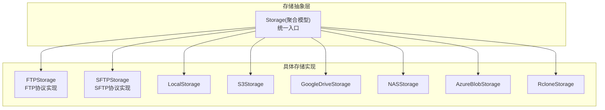
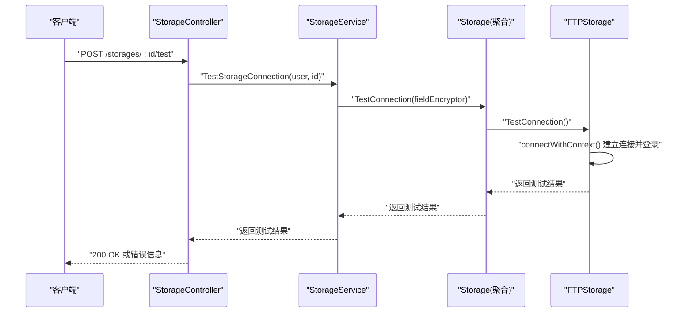
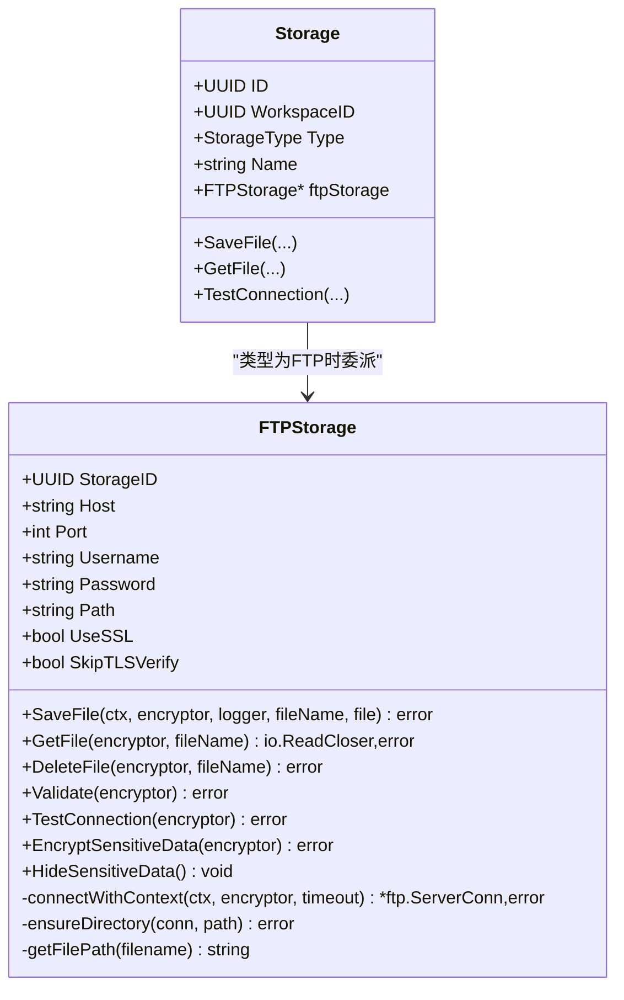
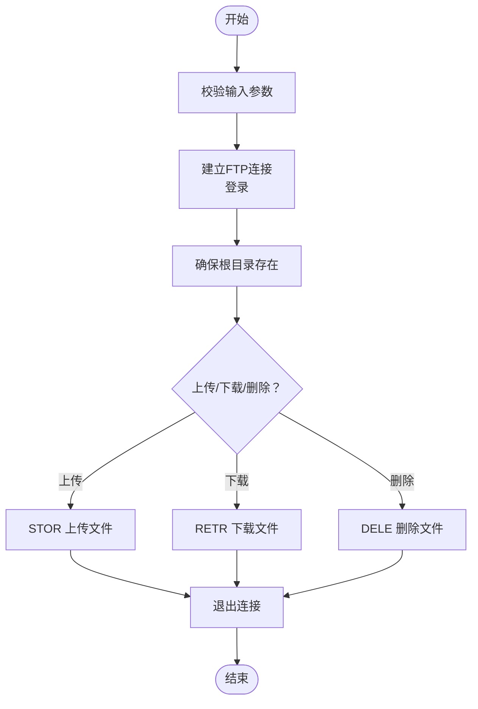
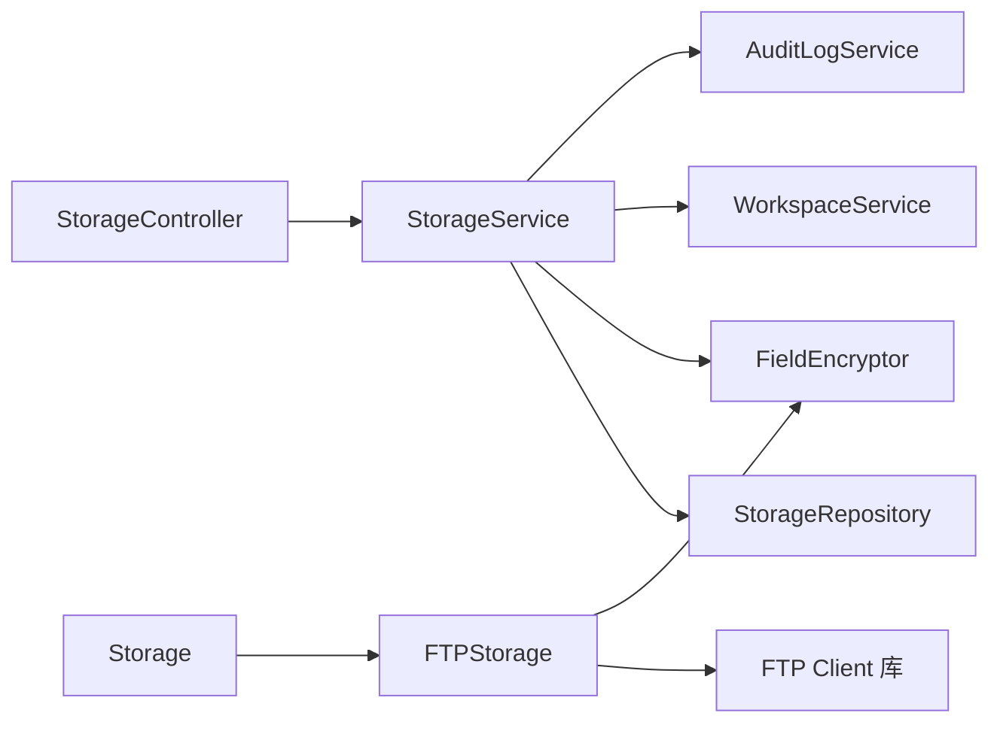

# FTP存储

<cite>
**本文引用的文件**
- [backend/internal/features/storages/models/ftp/model.go](file://backend/internal/features/storages/models/ftp/model.go)
- [backend/internal/features/storages/model.go](file://backend/internal/features/storages/model.go)
- [backend/internal/features/storages/controller.go](file://backend/internal/features/storages/controller.go)
- [backend/internal/features/storages/service.go](file://backend/internal/features/storages/service.go)
- [backend/internal/features/storages/enums.go](file://backend/internal/features/storages/enums.go)
- [backend/migrations/20251213180403_add_ftp_storages.sql](file://backend/migrations/20251213180403_add_ftp_storages.sql)
- [backend/migrations/20251213204730_remove_ftp_passive_mode.sql](file://backend/migrations/20251213204730_remove_ftp_passive_mode.sql)
- [backend/internal/config/config.go](file://backend/internal/config/config.go)
- [backend/internal/features/storages/controller_test.go](file://backend/internal/features/storages/controller_test.go)
</cite>

## 目录
1. [简介](#简介)
2. [项目结构](#项目结构)
3. [核心组件](#核心组件)
4. [架构总览](#架构总览)
5. [详细组件分析](#详细组件分析)
6. [依赖分析](#依赖分析)
7. [性能考量](#性能考量)
8. [故障排除指南](#故障排除指南)
9. [结论](#结论)
10. [附录](#附录)

## 简介
本文件面向Databasus的FTP存储功能，提供从协议实现到运维实践的完整说明。重点涵盖：
- FTP协议实现细节：主动/被动模式的差异与当前实现策略（移除显式被动列）
- 配置参数：服务器地址、端口、用户名/密码、根目录路径、SSL/TLS开关与跳过校验选项
- 安全考虑：明文传输风险、FTPS加密支持、TLS配置项
- 使用示例：文件上传/下载/删除、目录准备、权限控制
- 性能优化：连接超时、分块大小、上下文取消
- 故障排除：防火墙穿透、权限验证失败、连接超时等问题定位

## 项目结构
FTP存储位于后端模块的“storages”子系统中，采用多态聚合设计：统一的Storage模型根据类型委托给具体存储实现（如FTP、SFTP等）。FTP实现封装在独立包内，包含连接、文件操作、路径处理、敏感信息加密与脱敏等功能。

图表来源
- [backend/internal/features/storages/model.go:22-39](file://backend/internal/features/storages/model.go#L22-L39)
- [backend/internal/features/storages/model.go:163-184](file://backend/internal/features/storages/model.go#L163-L184)

章节来源
- [backend/internal/features/storages/model.go:22-39](file://backend/internal/features/storages/model.go#L22-L39)
- [backend/internal/features/storages/enums.go:5-14](file://backend/internal/features/storages/enums.go#L5-L14)

## 核心组件
- FTPStorage：封装FTP/SFTP连接、文件上传/下载/删除、路径准备、连接测试、敏感数据加密与脱敏
- Storage：统一的存储聚合模型，按类型路由到具体实现
- StorageService/StorageController：对外暴露保存、查询、测试连接、删除等接口
- 数据库迁移：定义ftp_storages表结构及字段含义

章节来源
- [backend/internal/features/storages/models/ftp/model.go:26-35](file://backend/internal/features/storages/models/ftp/model.go#L26-L35)
- [backend/internal/features/storages/model.go:41-85](file://backend/internal/features/storages/model.go#L41-L85)
- [backend/internal/features/storages/service.go:249-280](file://backend/internal/features/storages/service.go#L249-L280)
- [backend/internal/features/storages/controller.go:19-27](file://backend/internal/features/storages/controller.go#L19-L27)

## 架构总览
FTP存储的调用链路如下：前端或上层业务通过控制器/服务发起请求，服务层对Storage进行校验与加密，再由Storage根据类型委派到FTPStorage执行实际的FTP操作；FTPStorage内部负责建立连接、登录、文件传输与资源释放。

图表来源
- [backend/internal/features/storages/controller.go:204-227](file://backend/internal/features/storages/controller.go#L204-L227)
- [backend/internal/features/storages/service.go:249-280](file://backend/internal/features/storages/service.go#L249-L280)
- [backend/internal/features/storages/model.go:83-85](file://backend/internal/features/storages/model.go#L83-L85)
- [backend/internal/features/storages/models/ftp/model.go:182-201](file://backend/internal/features/storages/models/ftp/model.go#L182-L201)

## 详细组件分析

### FTPStorage类与协议实现
- 连接建立：支持明文FTP与FTPS（显式TLS），可配置跳过TLS证书校验
- 文件操作：上传（STOR）、下载（RETR）、删除（DELE），均在单次会话内完成
- 路径管理：自动确保根目录存在，支持相对路径拼接
- 超时与取消：连接、测试、删除均有超时控制，上传使用带上下文的Reader以响应取消
- 加密与脱敏：密码入库前加密，查询/列表时脱敏，直接测试接口可临时解密用于验证

图表来源
- [backend/internal/features/storages/models/ftp/model.go:26-35](file://backend/internal/features/storages/models/ftp/model.go#L26-L35)
- [backend/internal/features/storages/models/ftp/model.go:41-113](file://backend/internal/features/storages/models/ftp/model.go#L41-L113)
- [backend/internal/features/storages/models/ftp/model.go:115-136](file://backend/internal/features/storages/models/ftp/model.go#L115-L136)
- [backend/internal/features/storages/models/ftp/model.go:138-163](file://backend/internal/features/storages/models/ftp/model.go#L138-L163)
- [backend/internal/features/storages/model.go:22-39](file://backend/internal/features/storages/model.go#L22-L39)
- [backend/internal/features/storages/model.go:41-85](file://backend/internal/features/storages/model.go#L41-L85)

章节来源
- [backend/internal/features/storages/models/ftp/model.go:26-35](file://backend/internal/features/storages/models/ftp/model.go#L26-L35)
- [backend/internal/features/storages/models/ftp/model.go:41-113](file://backend/internal/features/storages/models/ftp/model.go#L41-L113)
- [backend/internal/features/storages/models/ftp/model.go:115-136](file://backend/internal/features/storages/models/ftp/model.go#L115-L136)
- [backend/internal/features/storages/models/ftp/model.go:138-163](file://backend/internal/features/storages/models/ftp/model.go#L138-L163)
- [backend/internal/features/storages/models/ftp/model.go:182-201](file://backend/internal/features/storages/models/ftp/model.go#L182-L201)
- [backend/internal/features/storages/models/ftp/model.go:239-278](file://backend/internal/features/storages/models/ftp/model.go#L239-L278)
- [backend/internal/features/storages/models/ftp/model.go:280-317](file://backend/internal/features/storages/models/ftp/model.go#L280-L317)
- [backend/internal/features/storages/models/ftp/model.go:319-328](file://backend/internal/features/storages/models/ftp/model.go#L319-L328)

### 主动模式与被动模式
- 历史字段：数据库中曾包含passive_mode布尔字段
- 当前实现：代码未显式构造PASV/LIST等命令，而是使用标准库ftp.Client的默认行为；迁移已移除passive_mode列
- 实践建议：若遇到防火墙/NAT场景导致数据通道无法建立，优先检查网络ACL、NAT映射与服务器端FTP服务配置；必要时调整服务器端策略或使用代理/隧道

章节来源
- [backend/migrations/20251213180403_add_ftp_storages.sql:13](file://backend/migrations/20251213180403_add_ftp_storages.sql#L13)
- [backend/migrations/20251213204730_remove_ftp_passive_mode.sql:4-5](file://backend/migrations/20251213204730_remove_ftp_passive_mode.sql#L4-L5)
- [backend/internal/features/storages/models/ftp/model.go:239-278](file://backend/internal/features/storages/models/ftp/model.go#L239-L278)

### 配置参数与数据库结构
- 表结构字段（来自迁移）：storage_id、host、port、username、password、path、use_ssl、skip_tls_verify、passive_mode（已移除）
- 默认值：port默认21；use_ssl默认false；skip_tls_verify默认false
- 业务约束：FTPStorage.Validate要求host、username、password非空，port范围合法

章节来源
- [backend/migrations/20251213180403_add_ftp_storages.sql:4-14](file://backend/migrations/20251213180403_add_ftp_storages.sql#L4-L14)
- [backend/internal/features/storages/models/ftp/model.go:165-180](file://backend/internal/features/storages/models/ftp/model.go#L165-L180)

### 安全考虑与TLS配置
- 明文传输风险：默认不启用SSL/TLS时，用户名、密码与数据均以明文传输
- FTPS支持：UseSSL=true时使用显式TLS（Explicit TLS），可配置ServerName与InsecureSkipVerify
- 密码加密：入库前加密，查询/列表时脱敏；测试连接时临时解密用于验证
- 最佳实践：生产环境务必启用UseSSL并正确配置证书校验；仅在调试环境使用SkipTLSVerify

章节来源
- [backend/internal/features/storages/models/ftp/model.go:255-266](file://backend/internal/features/storages/models/ftp/model.go#L255-L266)
- [backend/internal/features/storages/models/ftp/model.go:207-217](file://backend/internal/features/storages/models/ftp/model.go#L207-L217)
- [backend/internal/features/storages/models/ftp/model.go:203-205](file://backend/internal/features/storages/models/ftp/model.go#L203-L205)

### 使用示例与流程
- 文件上传
  - 控制器/服务接收请求，Storage.Validate校验
  - FTPStorage.SaveFile建立连接、准备根目录、上传文件、关闭连接
- 文件下载
  - FTPStorage.GetFile建立连接、RETR获取响应、返回ReadCloser
- 文件删除
  - FTPStorage.DeleteFile建立连接、确认文件存在、执行DELE
- 目录遍历
  - 代码未提供LIST/MLSD等目录列举接口；如需目录浏览，请结合外部工具或扩展实现
- 权限设置
  - 通过工作区权限控制：保存/测试/删除均需相应权限；系统存储仅管理员可管理

图表来源
- [backend/internal/features/storages/models/ftp/model.go:41-113](file://backend/internal/features/storages/models/ftp/model.go#L41-L113)
- [backend/internal/features/storages/models/ftp/model.go:115-136](file://backend/internal/features/storages/models/ftp/model.go#L115-L136)
- [backend/internal/features/storages/models/ftp/model.go:138-163](file://backend/internal/features/storages/models/ftp/model.go#L138-L163)
- [backend/internal/features/storages/model.go:41-85](file://backend/internal/features/storages/model.go#L41-L85)

章节来源
- [backend/internal/features/storages/controller.go:19-27](file://backend/internal/features/storages/controller.go#L19-L27)
- [backend/internal/features/storages/service.go:249-280](file://backend/internal/features/storages/service.go#L249-L280)
- [backend/internal/features/storages/models/ftp/model.go:41-113](file://backend/internal/features/storages/models/ftp/model.go#L41-L113)
- [backend/internal/features/storages/models/ftp/model.go:115-136](file://backend/internal/features/storages/models/ftp/model.go#L115-L136)
- [backend/internal/features/storages/models/ftp/model.go:138-163](file://backend/internal/features/storages/models/ftp/model.go#L138-L163)

## 依赖分析
- Storage聚合模型根据类型委派到具体实现，避免在上层感知协议细节
- FTPStorage依赖外部FTP库与字段加密器，连接阶段进行密码解密
- 控制器/服务层负责鉴权、工作区权限校验与审计日志

图表来源
- [backend/internal/features/storages/controller.go:19-27](file://backend/internal/features/storages/controller.go#L19-L27)
- [backend/internal/features/storages/service.go:16-26](file://backend/internal/features/storages/service.go#L16-L26)
- [backend/internal/features/storages/model.go:163-184](file://backend/internal/features/storages/model.go#L163-L184)
- [backend/internal/features/storages/models/ftp/model.go:3-17](file://backend/internal/features/storages/models/ftp/model.go#L3-L17)

章节来源
- [backend/internal/features/storages/controller.go:19-27](file://backend/internal/features/storages/controller.go#L19-L27)
- [backend/internal/features/storages/service.go:16-26](file://backend/internal/features/storages/service.go#L16-L26)
- [backend/internal/features/storages/model.go:163-184](file://backend/internal/features/storages/model.go#L163-L184)
- [backend/internal/features/storages/models/ftp/model.go:3-17](file://backend/internal/features/storages/models/ftp/model.go#L3-L17)

## 性能考量
- 连接超时
  - 一般连接：30秒
  - 测试连接：10秒
  - 删除操作：30秒
- 分块大小：上传采用约16MB分块，平衡吞吐与内存占用
- 取消与并发：上传使用带上下文的Reader，可在取消时中断传输
- 建议
  - 在高延迟/低带宽网络适当增大超时
  - 大文件备份建议配合断点续传或压缩策略（当前实现未提供）

章节来源
- [backend/internal/features/storages/models/ftp/model.go:19-24](file://backend/internal/features/storages/models/ftp/model.go#L19-L24)
- [backend/internal/features/storages/models/ftp/model.go:41-113](file://backend/internal/features/storages/models/ftp/model.go#L41-L113)

## 故障排除指南
- 连接超时
  - 检查网络连通性与端口可达性
  - 调整超时阈值或在服务端优化网络
- 权限验证失败
  - 确认用户名/密码正确且账户有访问权限
  - 若启用FTPS，检查证书域名与跳过校验配置
- 被动模式/防火墙穿透
  - 当前实现未显式设置被动模式，若服务器强制PASV或NAT复杂，建议在服务器端调整策略或使用支持PASV/LIST的替代方案
- 密码安全
  - 入库前已加密；查询/列表时自动脱敏；测试连接时临时解密用于验证
- 单元测试参考
  - 可参考控制器测试中的FTP存储用例，验证保存、更新、密码加密与可见性控制

章节来源
- [backend/internal/features/storages/models/ftp/model.go:182-201](file://backend/internal/features/storages/models/ftp/model.go#L182-L201)
- [backend/internal/features/storages/models/ftp/model.go:207-217](file://backend/internal/features/storages/models/ftp/model.go#L207-L217)
- [backend/internal/features/storages/controller_test.go:1421-1468](file://backend/internal/features/storages/controller_test.go#L1421-L1468)

## 结论
Databasus的FTP存储通过清晰的抽象与严格的生命周期管理，提供了稳定可靠的文件上传/下载/删除能力。当前实现未显式区分主动/被动模式，而是依赖标准库默认行为；生产部署应优先启用FTPS并正确配置证书校验，同时结合合理的超时与分块策略提升稳定性与性能。

## 附录
- 存储类型枚举：包含FTP、SFTP等类型常量
- 环境变量：测试端口相关配置（用于开发/测试）
- 数据库迁移：ftp_storages表结构与字段说明

章节来源
- [backend/internal/features/storages/enums.go:5-14](file://backend/internal/features/storages/enums.go#L5-L14)
- [backend/internal/config/config.go:91-92](file://backend/internal/config/config.go#L91-L92)
- [backend/migrations/20251213180403_add_ftp_storages.sql:4-14](file://backend/migrations/20251213180403_add_ftp_storages.sql#L4-L14)