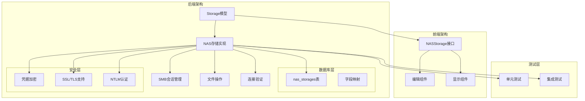
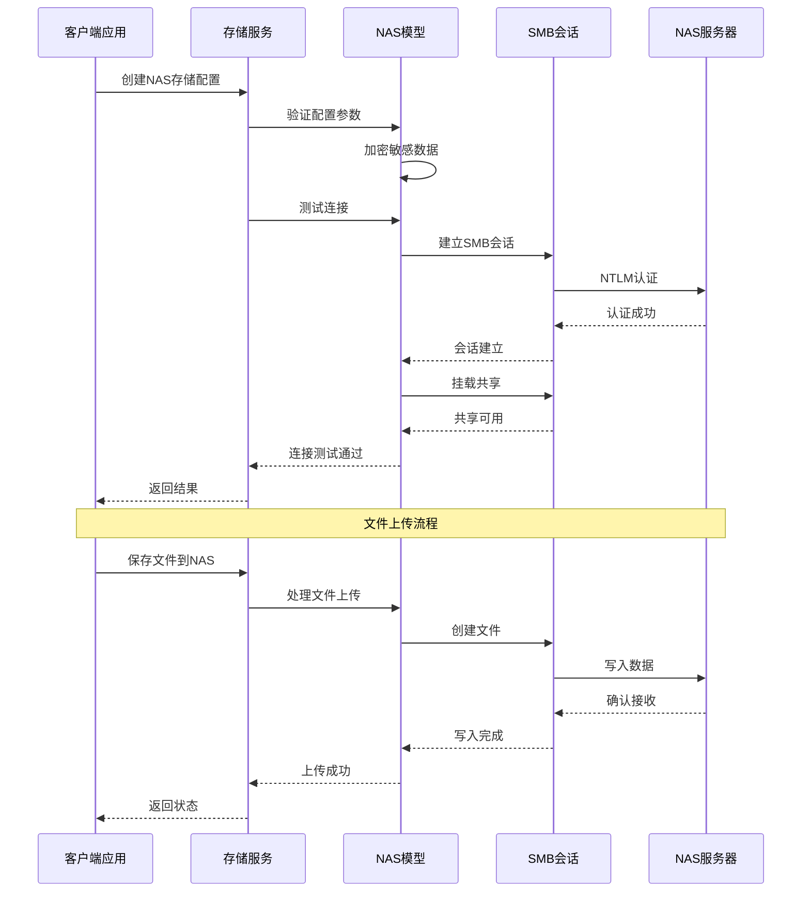
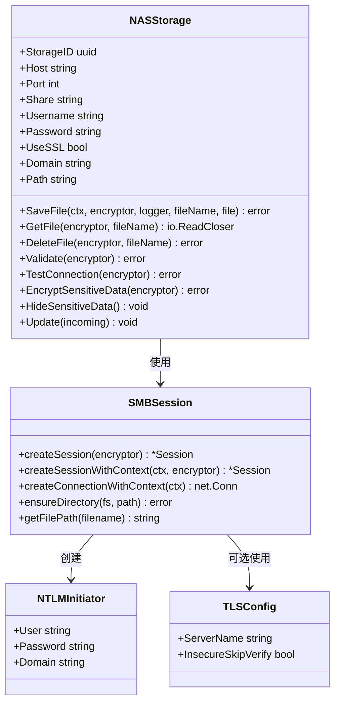
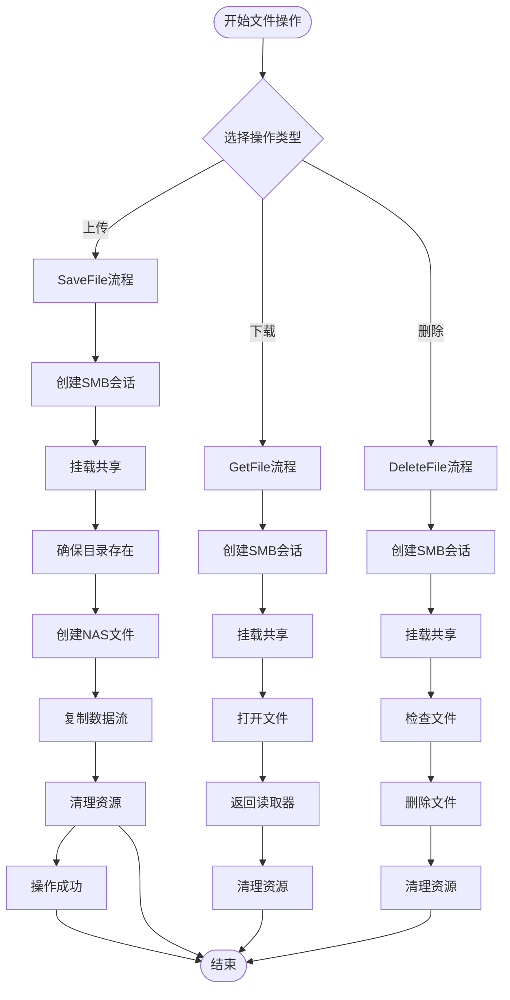
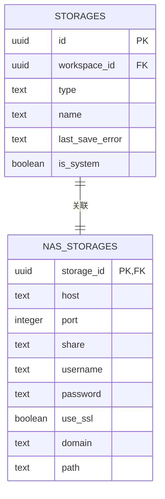
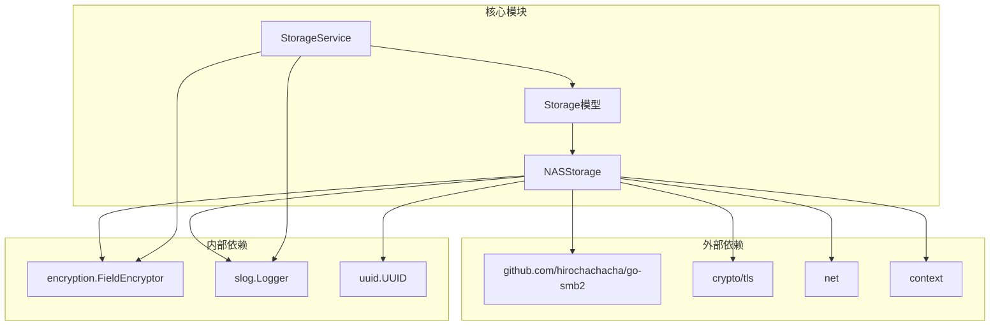
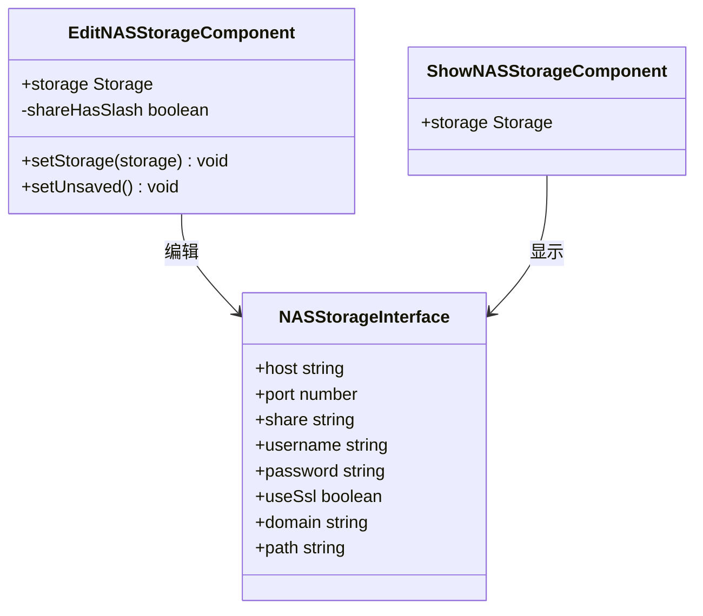
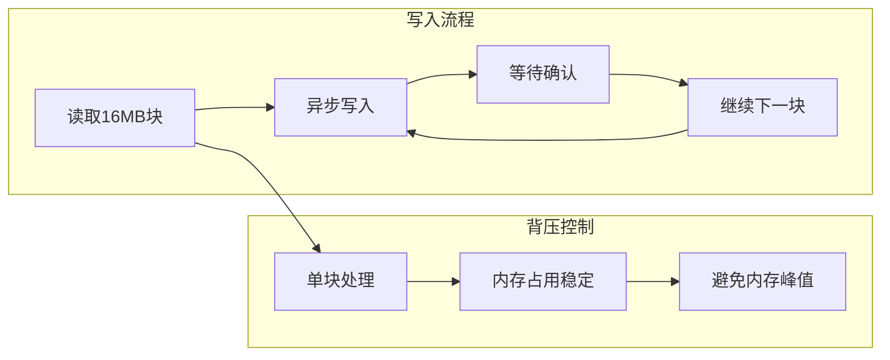
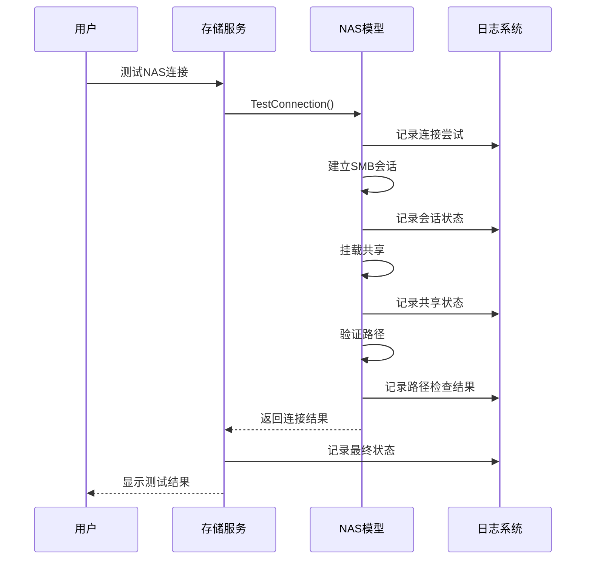

# NAS存储

<cite>
**本文档引用的文件**
- [model.go](file://backend/internal/features/storages/models/nas/model.go)
- [model.go](file://backend/internal/features/storages/model.go)
- [service.go](file://backend/internal/features/storages/service.go)
- [20250723135644_add_nas_storages.sql](file://backend/migrations/20250723135644_add_nas_storages.sql)
- [NASStorage.ts](file://frontend/src/entity/storages/models/NASStorage.ts)
- [EditNASStorageComponent.tsx](file://frontend/src/features/storages/ui/edit/storages/EditNASStorageComponent.tsx)
- [ShowNASStorageComponent.tsx](file://frontend/src/features/storages/ui/show/storages/ShowNASStorageComponent.tsx)
- [controller_test.go](file://backend/internal/feature/storages/controller_test.go)
</cite>

## 目录
1. [简介](#简介)
2. [项目结构](#项目结构)
3. [核心组件](#核心组件)
4. [架构概览](#架构概览)
5. [详细组件分析](#详细组件分析)
6. [依赖关系分析](#依赖关系分析)
7. [性能考虑](#性能考虑)
8. [故障排除指南](#故障排除指南)
9. [结论](#结论)
10. [附录](#附录)

## 简介

Databasus的NAS存储功能提供了基于SMB/CIFS协议的企业级备份存储解决方案。该功能实现了完整的NAS存储配置、连接管理和数据传输能力，支持多种安全特性和性能优化。

本功能的核心特性包括：
- **SMB/CIFS协议实现**：基于go-smb2库的完整SMBv3实现
- **安全认证机制**：NTLM认证、可选SSL/TLS加密
- **数据加密存储**：敏感凭据的安全存储和传输
- **智能路径管理**：自动目录创建和路径规范化
- **性能优化**：16MB分块大小和背压控制
- **全面的错误处理**：资源清理和连接管理

## 项目结构

NAS存储功能在Databasus项目中的组织结构如下：



**图表来源**
- [model.go:1-533](file://backend/internal/features/storages/models/nas/model.go#L1-L533)
- [model.go:1-185](file://backend/internal/features/storages/model.go#L1-L185)

**章节来源**
- [model.go:1-50](file://backend/internal/features/storages/models/nas/model.go#L1-L50)
- [model.go:1-40](file://backend/internal/features/storages/model.go#L1-L40)

## 核心组件

### NAS存储模型

NASStorage结构体定义了完整的NAS存储配置信息：

| 字段名 | 类型 | 必需性 | 默认值 | 描述 |
|--------|------|--------|--------|------|
| host | string | 必需 | - | NAS服务器主机名或IP地址 |
| port | int | 可选 | 445 | SMB服务端口（默认445） |
| share | string | 必需 | - | 共享名称 |
| username | string | 必需 | - | 访问用户名 |
| password | string | 必需 | - | 访问密码（加密存储） |
| useSsl | bool | 可选 | false | 是否启用SSL/TLS加密 |
| domain | string | 可选 | - | Windows域名称 |
| path | string | 可选 | - | 子目录路径 |

### 前端数据模型

前端NASStorage接口提供了用户界面的数据结构：

```typescript
interface NASStorage {
  host: string;
  port: number;
  share: string;
  username: string;
  password: string;
  useSsl: boolean;
  domain?: string;
  path?: string;
}
```

**章节来源**
- [model.go:30-44](file://backend/internal/features/storages/models/nas/model.go#L30-L44)
- [NASStorage.ts:1-11](file://frontend/src/entity/storages/models/NASStorage.ts#L1-L11)

## 架构概览

NAS存储功能采用分层架构设计，确保了良好的可维护性和扩展性：



**图表来源**
- [service.go:54-147](file://backend/internal/features/storages/service.go#L54-L147)
- [model.go:46-156](file://backend/internal/features/storages/models/nas/model.go#L46-L156)

## 详细组件分析

### SMB会话管理

NAS存储实现了完整的SMB会话生命周期管理：



**图表来源**
- [model.go:30-44](file://backend/internal/features/storages/models/nas/model.go#L30-L44)
- [model.go:315-345](file://backend/internal/features/storages/models/nas/model.go#L315-L345)

### 文件操作流程

NAS存储提供了完整的文件操作能力，包括上传、下载和删除：



**图表来源**
- [model.go:46-156](file://backend/internal/features/storages/models/nas/model.go#L46-L156)
- [model.go:158-196](file://backend/internal/features/storages/models/nas/model.go#L158-L196)
- [model.go:198-231](file://backend/internal/features/storages/models/nas/model.go#L198-L231)

### 数据库模型设计

NAS存储的数据库模型采用了关联表的设计模式：



**图表来源**
- [20250723135644_add_nas_storages.sql:4-21](file://backend/migrations/20250723135644_add_nas_storages.sql#L4-L21)

**章节来源**
- [20250723135644_add_nas_storages.sql:1-30](file://backend/migrations/20250723135644_add_nas_storages.sql#L1-L30)
- [model.go:22-39](file://backend/internal/features/storages/model.go#L22-L39)

## 依赖关系分析

NAS存储功能的依赖关系展现了清晰的分层架构：



**图表来源**
- [model.go:3-19](file://backend/internal/features/storages/models/nas/model.go#L3-L19)
- [service.go:3-14](file://backend/internal/features/storages/service.go#L3-L14)

### 前端组件集成

前端NAS存储组件提供了完整的用户交互体验：



**图表来源**
- [EditNASStorageComponent.tsx:1-238](file://frontend/src/features/storages/ui/edit/storages/EditNASStorageComponent.tsx#L1-L238)
- [ShowNASStorageComponent.tsx:1-51](file://frontend/src/features/storages/ui/show/storages/ShowNASStorageComponent.tsx#L1-L51)

**章节来源**
- [EditNASStorageComponent.tsx:1-238](file://frontend/src/features/storages/ui/edit/storages/EditNASStorageComponent.tsx#L1-L238)
- [ShowNASStorageComponent.tsx:1-51](file://frontend/src/features/storages/ui/show/storages/ShowNASStorageComponent.tsx#L1-L51)

## 性能考虑

### 分块传输优化

NAS存储实现了高效的分块传输机制，平衡了内存使用和传输效率：

| 特性 | 参数 | 值 | 说明 |
|------|------|-----|------|
| 分块大小 | nasChunkSize | 16MB | 内存使用与效率的最佳平衡 |
| 背压控制 | 实现方式 | 单线程读取 | 防止pg_dump产生过大数据量 |
| 连接超时 | Dialer.Timeout | 30秒 | 网络连接超时设置 |
| 删除超时 | nasDeleteTimeout | 30秒 | 文件删除操作超时 |
| 目录权限 | Mkdir权限 | 0755 | 标准Unix权限设置 |

### 并发处理机制



**图表来源**
- [model.go:21-28](file://backend/internal/features/storages/models/nas/model.go#L21-L28)
- [model.go:471-532](file://backend/internal/features/storages/models/nas/model.go#L471-L532)

**章节来源**
- [model.go:21-28](file://backend/internal/features/storages/models/nas/model.go#L21-L28)
- [model.go:471-532](file://backend/internal/features/storages/models/nas/model.go#L471-L532)

## 故障排除指南

### 常见连接问题及解决方案

| 问题类型 | 症状 | 可能原因 | 解决方案 |
|----------|------|----------|----------|
| 网络连接失败 | "failed to create connection" | 端口不可达、防火墙阻拦 | 检查端口连通性、配置防火墙规则 |
| 认证失败 | "failed to create SMB session" | 用户名密码错误、域配置不当 | 验证凭据正确性、检查域设置 |
| 共享访问拒绝 | "failed to mount share" | 权限不足、共享不存在 | 确认共享名称、检查用户权限 |
| 路径不存在 | "failed to ensure directory" | 目录创建失败 | 手动创建目录、检查父目录权限 |
| SSL连接失败 | "failed to create SSL connection" | 证书验证失败、端口错误 | 检查SSL配置、确认端口445 |

### 调试和监控



**图表来源**
- [service.go:249-280](file://backend/internal/features/storages/service.go#L249-L280)
- [model.go:253-279](file://backend/internal/features/storages/models/nas/model.go#L253-L279)

### 最佳实践建议

1. **网络配置**
   - 确保NAS服务器端口445开放
   - 配置防火墙允许SMB流量
   - 测试网络连通性（ping、telnet）

2. **安全配置**
   - 使用强密码策略
   - 启用SSL/TLS加密传输
   - 定期轮换访问凭据

3. **性能优化**
   - 监控磁盘空间使用情况
   - 调整分块大小适应网络环境
   - 实施适当的备份调度策略

**章节来源**
- [service.go:249-280](file://backend/internal/features/storages/service.go#L249-L280)
- [model.go:253-279](file://backend/internal/features/storages/models/nas/model.go#L253-L279)

## 结论

Databasus的NAS存储功能提供了企业级的备份存储解决方案，具有以下优势：

1. **完整的SMB/CIFS支持**：基于标准协议的可靠实现
2. **多层次安全保护**：从传输加密到凭据加密的全方位保护
3. **高性能设计**：优化的分块传输和背压控制机制
4. **用户友好界面**：直观的配置和管理界面
5. **完善的错误处理**：全面的异常处理和资源清理机制

该功能为企业提供了可靠的NAS存储能力，支持各种规模的备份需求，同时保持了良好的性能和安全性。

## 附录

### 配置参数参考

| 参数名称 | 类型 | 必需性 | 默认值 | 说明 |
|----------|------|--------|--------|------|
| host | string | 必需 | - | NAS服务器地址 |
| port | number | 可选 | 445 | SMB端口号 |
| share | string | 必需 | - | 共享名称 |
| username | string | 必需 | - | 访问用户名 |
| password | string | 必需 | - | 访问密码 |
| useSsl | boolean | 可选 | false | 启用SSL加密 |
| domain | string | 可选 | - | Windows域名称 |
| path | string | 可选 | - | 子目录路径 |

### 支持的操作

- **文件上传**：支持大文件的分块上传
- **文件下载**：支持流式文件下载
- **文件删除**：安全的文件删除操作
- **连接测试**：完整的连接验证功能
- **权限管理**：基于用户角色的访问控制