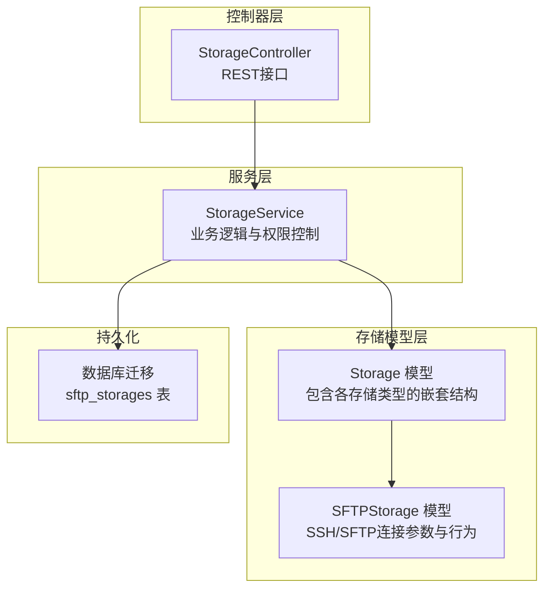
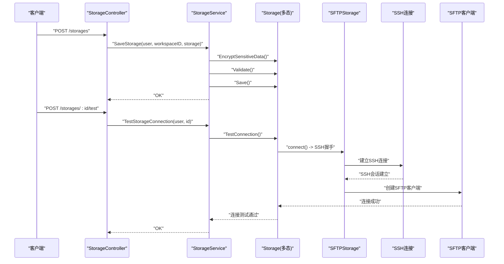
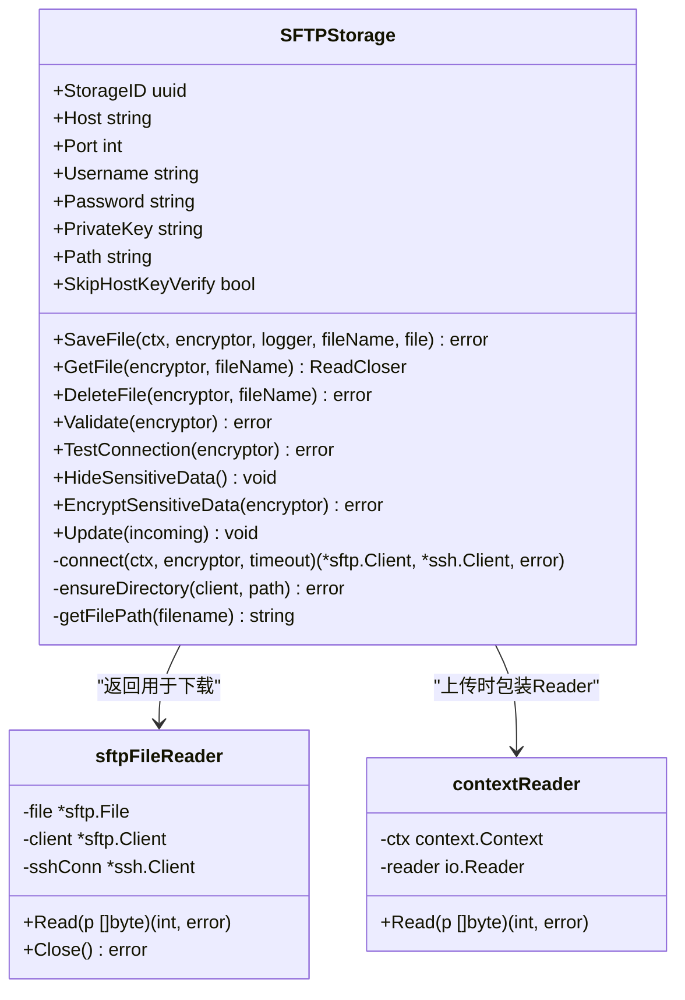
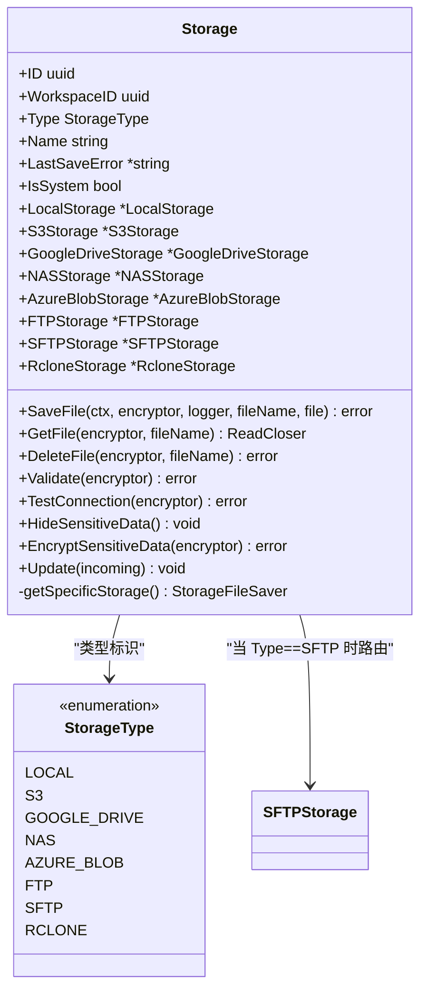
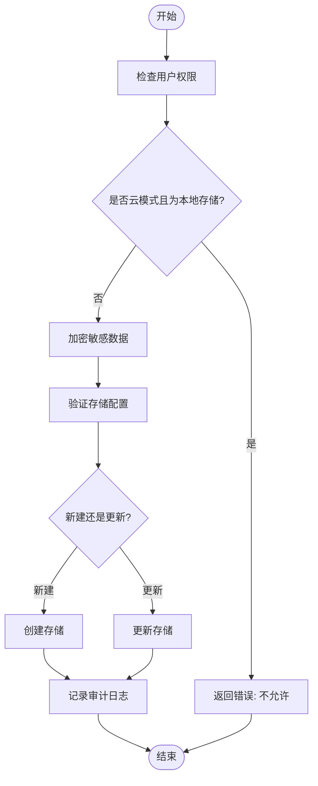
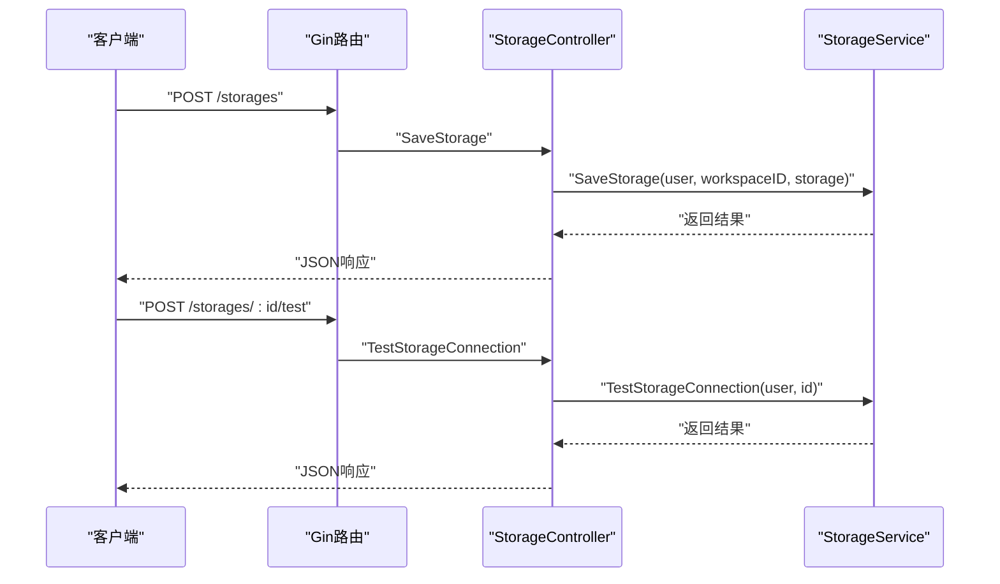
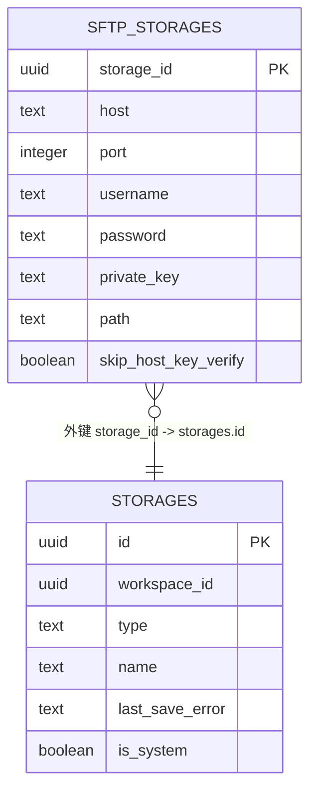
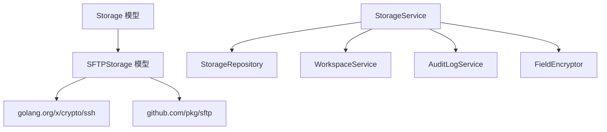

# SFTP存储

<cite>
**本文档引用的文件**
- [model.go](file://backend/internal/features/storages/models/sftp/model.go)
- [model.go](file://backend/internal/features/storages/model.go)
- [enums.go](file://backend/internal/features/storages/enums.go)
- [service.go](file://backend/internal/features/storages/service.go)
- [controller.go](file://backend/internal/features/storages/controller.go)
- [20251219220027_add_sftp_storages.sql](file://backend/migrations/20251219220027_add_sftp_storages.sql)
- [controller_test.go](file://backend/internal/feature/storages/controller_test.go)
</cite>

## 目录
1. [简介](#简介)
2. [项目结构](#项目结构)
3. [核心组件](#核心组件)
4. [架构概览](#架构概览)
5. [详细组件分析](#详细组件分析)
6. [依赖关系分析](#依赖关系分析)
7. [性能考虑](#性能考虑)
8. [故障排除指南](#故障排除指南)
9. [结论](#结论)
10. [附录](#附录)

## 简介
本文件详细介绍Databasus项目中的SFTP（SSH文件传输协议）存储功能。SFTP作为基于SSH的安全文件传输方案，在备份与恢复场景中提供了端到端加密、强身份认证和完整性保障。本文档从系统架构、组件设计、数据流、安全特性、配置参数、使用示例到性能优化与故障排除进行全面阐述，帮助开发者与运维人员正确部署与维护SFTP存储。

## 项目结构
SFTP存储功能位于后端模块的存储子系统中，采用分层架构：
- 存储模型层：定义通用存储结构与具体存储类型（含SFTP）
- SFTP专用模型：封装SSH/SFTP连接、认证、文件操作
- 服务层：提供存储的创建、更新、测试连接、权限控制等业务逻辑
- 控制器层：暴露REST接口供前端或外部系统调用
- 数据库迁移：定义SFTP存储在数据库中的表结构

**图表来源**
- [model.go:22-39](file://backend/internal/features/storages/model.go#L22-L39)
- [model.go:26-39](file://backend/internal/features/storages/models/sftp/model.go#L26-L39)
- [service.go:16-22](file://backend/internal/features/storages/service.go#L16-L22)
- [controller.go:14-17](file://backend/internal/features/storages/controller.go#L14-L17)
- [20251219220027_add_sftp_storages.sql:4-13](file://backend/migrations/20251219220027_add_sftp_storages.sql#L4-L13)

**章节来源**
- [model.go:1-185](file://backend/internal/features/storages/model.go#L1-L185)
- [model.go:1-431](file://backend/internal/features/storages/models/sftp/model.go#L1-L431)
- [enums.go:1-15](file://backend/internal/features/storages/enums.go#L1-L15)
- [service.go:1-409](file://backend/internal/features/storages/service.go#L1-L409)
- [controller.go:1-340](file://backend/internal/features/storages/controller.go#L1-L340)
- [20251219220027_add_sftp_storages.sql:1-29](file://backend/migrations/20251219220027_add_sftp_storages.sql#L1-L29)

## 核心组件
- SFTPStorage模型：封装SFTP连接所需的核心参数（主机、端口、用户名、密码或私钥、远程路径、主机密钥验证策略），并提供文件上传、下载、删除、连接测试、目录确保等能力。
- Storage模型：统一管理所有存储类型，根据类型动态路由到具体存储实现（含SFTP）。
- StorageService：负责存储的创建/更新、权限校验、连接测试、敏感信息隐藏与加密。
- StorageController：提供REST接口，支持保存、查询、删除、测试连接、工作区转移等操作。
- 数据库迁移：定义sftp_storages表结构及外键约束。

**章节来源**
- [model.go:26-39](file://backend/internal/features/storages/models/sftp/model.go#L26-L39)
- [model.go:22-39](file://backend/internal/features/storages/model.go#L22-L39)
- [service.go:54-147](file://backend/internal/features/storages/service.go#L54-L147)
- [controller.go:19-27](file://backend/internal/features/storages/controller.go#L19-L27)
- [20251219220027_add_sftp_storages.sql:4-19](file://backend/migrations/20251219220027_add_sftp_storages.sql#L4-L19)

## 架构概览
SFTP存储的调用链路如下：
- 前端/客户端通过控制器接口提交存储配置
- 控制器调用服务层进行权限校验与业务处理
- 服务层根据存储类型委托给具体存储实现（SFTP）
- SFTP实现建立SSH连接，创建SFTP客户端，执行文件操作
- 所有敏感信息（密码、私钥）在数据库中加密存储，并在对外返回时隐藏

**图表来源**
- [controller.go:42-71](file://backend/internal/features/storages/controller.go#L42-L71)
- [service.go:54-147](file://backend/internal/features/storages/service.go#L54-L147)
- [model.go:41-85](file://backend/internal/features/storages/model.go#L41-L85)
- [model.go:203-223](file://backend/internal/features/storages/models/sftp/model.go#L203-L223)

## 详细组件分析

### SFTPStorage模型与实现
SFTPStorage是SFTP存储的核心实现，负责：
- 连接建立：解析用户提供的凭据（密码或私钥），构造SSH配置，建立TCP连接并完成SSH握手，再创建SFTP客户端
- 文件操作：上传（保存）、下载（打开）、删除；支持上下文取消与超时控制
- 路径管理：确保远程路径存在，自动创建缺失的目录层级
- 安全处理：敏感字段加密存储、对外响应时隐藏敏感内容、可选择跳过主机密钥验证（不推荐）

**图表来源**
- [model.go:26-39](file://backend/internal/features/storages/models/sftp/model.go#L26-L39)
- [model.go:380-416](file://backend/internal/features/storages/models/sftp/model.go#L380-L416)
- [model.go:418-430](file://backend/internal/features/storages/models/sftp/model.go#L418-L430)

**章节来源**
- [model.go:41-131](file://backend/internal/features/storages/models/sftp/model.go#L41-L131)
- [model.go:133-156](file://backend/internal/features/storages/models/sftp/model.go#L133-L156)
- [model.go:158-184](file://backend/internal/features/storages/models/sftp/model.go#L158-L184)
- [model.go:186-223](file://backend/internal/features/storages/models/sftp/model.go#L186-L223)
- [model.go:225-264](file://backend/internal/features/storages/models/sftp/model.go#L225-L264)
- [model.go:266-333](file://backend/internal/features/storages/models/sftp/model.go#L266-L333)
- [model.go:335-367](file://backend/internal/features/storages/models/sftp/model.go#L335-L367)
- [model.go:369-378](file://backend/internal/features/storages/models/sftp/model.go#L369-L378)

### Storage模型与多态路由
Storage模型通过枚举类型区分不同存储类型，并在运行时根据类型将操作路由到具体存储实现（如SFTP）。该设计实现了“统一入口、按类型分发”的解耦架构。

**图表来源**
- [model.go:22-39](file://backend/internal/features/storages/model.go#L22-L39)
- [enums.go:5-14](file://backend/internal/features/storages/enums.go#L5-L14)
- [model.go:163-184](file://backend/internal/features/storages/model.go#L163-L184)

**章节来源**
- [model.go:163-184](file://backend/internal/features/storages/model.go#L163-L184)
- [enums.go:1-15](file://backend/internal/features/storages/enums.go#L1-L15)

### StorageService业务逻辑
StorageService负责：
- 权限校验：确保用户对工作区具有管理/查看权限
- 敏感信息处理：在保存前加密敏感字段，在返回前隐藏敏感字段
- 连接测试：调用具体存储实现的TestConnection，更新LastSaveError
- 存储生命周期管理：创建、更新、删除、转移存储

**图表来源**
- [service.go:54-147](file://backend/internal/features/storages/service.go#L54-L147)
- [service.go:249-280](file://backend/internal/features/storages/service.go#L249-L280)

**章节来源**
- [service.go:54-147](file://backend/internal/features/storages/service.go#L54-L147)
- [service.go:249-280](file://backend/internal/features/storages/service.go#L249-L280)

### StorageController接口
StorageController提供REST接口：
- 创建/更新存储：POST /storages
- 查询存储列表：GET /storages?workspace_id=...
- 查询单个存储：GET /storages/:id
- 删除存储：DELETE /storages/:id
- 测试连接：POST /storages/:id/test
- 直接测试连接（无需持久化）：POST /storages/direct-test
- 工作区转移：POST /storages/:id/transfer

**图表来源**
- [controller.go:19-27](file://backend/internal/features/storages/controller.go#L19-L27)
- [controller.go:42-71](file://backend/internal/features/storages/controller.go#L42-L71)
- [controller.go:204-227](file://backend/internal/features/storages/controller.go#L204-L227)

**章节来源**
- [controller.go:19-27](file://backend/internal/features/storages/controller.go#L19-L27)
- [controller.go:42-71](file://backend/internal/features/storages/controller.go#L42-L71)
- [controller.go:204-227](file://backend/internal/features/storages/controller.go#L204-L227)
- [controller.go:298-339](file://backend/internal/features/storages/controller.go#L298-L339)

### 数据库表结构
SFTP存储的数据库表为sftp_storages，包含以下关键字段：
- storage_id：主键，关联storages表
- host/port/username：连接参数
- password/private_key：凭据（加密存储）
- path：远程根路径
- skip_host_key_verify：是否跳过主机密钥验证

**图表来源**
- [20251219220027_add_sftp_storages.sql:4-19](file://backend/migrations/20251219220027_add_sftp_storages.sql#L4-L19)

**章节来源**
- [20251219220027_add_sftp_storages.sql:1-29](file://backend/migrations/20251219220027_add_sftp_storages.sql#L1-L29)

## 依赖关系分析
- 外部依赖：使用github.com/pkg/sftp与golang.org/x/crypto/ssh进行SFTP与SSH通信
- 内部依赖：StorageService依赖StorageRepository、工作区服务、审计日志服务与字段加密器
- 类型依赖：Storage模型通过枚举类型StorageType在运行时分发到具体存储实现

**图表来源**
- [model.go:3-18](file://backend/internal/features/storages/models/sftp/model.go#L3-L18)
- [service.go:16-22](file://backend/internal/features/storages/service.go#L16-L22)
- [model.go:3-19](file://backend/internal/features/storages/model.go#L3-L19)

**章节来源**
- [model.go:3-18](file://backend/internal/features/storages/models/sftp/model.go#L3-L18)
- [service.go:16-22](file://backend/internal/features/storages/service.go#L16-L22)
- [model.go:3-19](file://backend/internal/features/storages/model.go#L3-L19)

## 性能考虑
- 连接复用：当前实现每次操作均建立新连接。对于高并发场景，建议引入连接池（在上层业务或SFTP客户端层面缓存连接），减少SSH握手开销
- 并发传输：通过并发任务调度多个文件上传/下载，结合上下文取消机制提升吞吐量
- 压缩选项：可在应用层对大文件进行压缩后再传输，降低带宽占用；注意CPU与I/O平衡
- 超时与重试：合理设置连接超时、操作超时与指数退避重试策略，提高网络波动下的稳定性
- 目录预创建：ensureDirectory在首次使用时批量创建路径，避免频繁Stat/Mkdir

[本节为通用性能建议，不直接分析具体文件]

## 故障排除指南
常见问题与排查步骤：

- 密钥认证失败
  - 检查私钥格式是否为标准PEM格式，且能被解析
  - 确认私钥与公钥匹配，服务器端公钥已正确配置
  - 若使用密码认证，请确认密码正确且账户未被锁定
  - 参考实现中的解密与解析流程定位问题

- 主机密钥不匹配
  - 当前实现支持跳过主机密钥验证（skip_host_key_verify），但不推荐生产使用
  - 正确做法是获取服务器主机指纹并与配置比对，或在受信环境中预先接受主机密钥
  - 建议在测试环境临时开启，生产环境关闭

- 权限拒绝
  - 检查用户名对应的系统用户权限，确保对目标路径具备写入权限
  - 确认远程路径存在且可写；若不存在，确保ensureDirectory能正确创建
  - 验证防火墙与SELinux/AppArmor策略未阻断访问

- 连接超时/网络不稳定
  - 调整连接超时时间，增加网络重试次数
  - 使用更稳定的网络或专线
  - 在上层引入连接池与断线重连机制

- 敏感信息泄露
  - 对外响应中敏感字段应被隐藏（服务层已实现）
  - 确保数据库中敏感信息已加密存储，避免明文落盘

**章节来源**
- [model.go:280-300](file://backend/internal/features/storages/models/sftp/model.go#L280-L300)
- [model.go:335-367](file://backend/internal/features/storages/models/sftp/model.go#L335-L367)
- [service.go:212-218](file://backend/internal/features/storages/service.go#L212-L218)

## 结论
Databasus的SFTP存储通过清晰的分层架构与严格的敏感信息处理机制，提供了安全可靠的文件传输能力。其核心优势在于：
- 强认证与加密：支持密码与私钥双认证，凭据加密存储
- 统一抽象：通过Storage模型实现多存储类型统一管理
- 易于扩展：新增存储类型仅需实现对应接口与模型
- 可观测性：提供连接测试与审计日志，便于运维排障

建议在生产环境中：
- 关闭跳过主机密钥验证选项
- 引入连接池与并发控制
- 对大文件启用压缩与分块传输
- 建立完善的监控与告警体系

[本节为总结性内容，不直接分析具体文件]

## 附录

### SFTP存储配置参数说明
- host：SFTP服务器地址
- port：SFTP服务器端口（默认22）
- username：登录用户名
- password：密码（可选，与私钥二选一）
- private_key：私钥内容（可选，与密码二选一）
- path：远程根路径（可选）
- skip_host_key_verify：是否跳过主机密钥验证（不推荐）

**章节来源**
- [model.go:26-35](file://backend/internal/features/storages/models/sftp/model.go#L26-L35)
- [20251219220027_add_sftp_storages.sql:6-12](file://backend/migrations/20251219220027_add_sftp_storages.sql#L6-L12)

### SFTP安全特性
- 端到端加密：SFTP在SSH隧道内传输，保证数据在传输过程中的保密性与完整性
- 认证方式：支持密码认证与公钥认证，推荐使用公钥认证
- 主机密钥验证：默认启用主机密钥验证，防止中间人攻击
- 凭据保护：敏感信息在数据库中加密存储，对外响应时隐藏敏感字段

**章节来源**
- [model.go:280-300](file://backend/internal/features/storages/models/sftp/model.go#L280-L300)
- [model.go:230-248](file://backend/internal/features/storages/models/sftp/model.go#L230-L248)
- [service.go:212-218](file://backend/internal/features/storages/service.go#L212-L218)

### 使用示例（操作流程）
- 密钥生成：在客户端生成RSA/ED25519私钥对，将公钥放置于服务器授权文件中
- 配置存储：通过控制器接口提交SFTP配置（host/port/username/password或private_key/path）
- 连接测试：调用测试连接接口验证配置正确性
- 文件传输：调用保存/下载接口进行备份文件的上传与下载
- 目录操作：ensureDirectory会在远程路径不存在时自动创建

**章节来源**
- [controller.go:42-71](file://backend/internal/features/storages/controller.go#L42-L71)
- [controller.go:204-227](file://backend/internal/features/storages/controller.go#L204-L227)
- [model.go:335-367](file://backend/internal/features/storages/models/sftp/model.go#L335-L367)