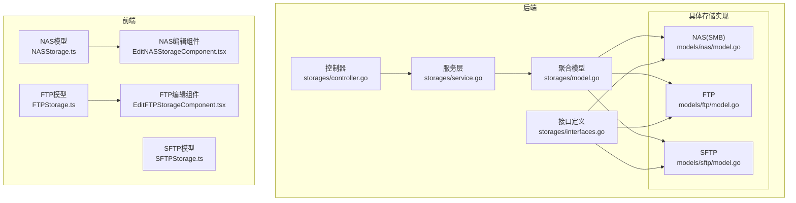
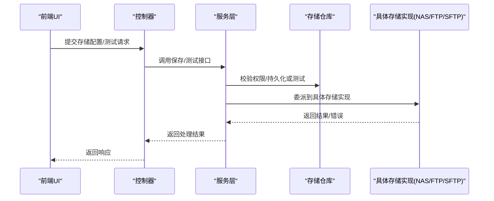
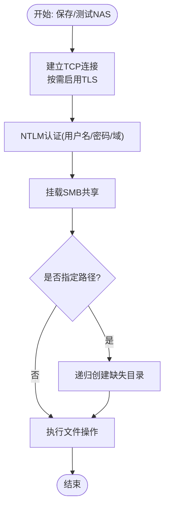
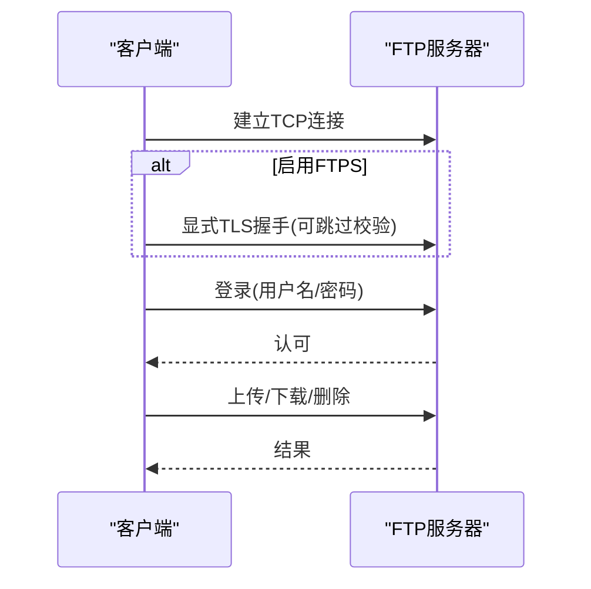
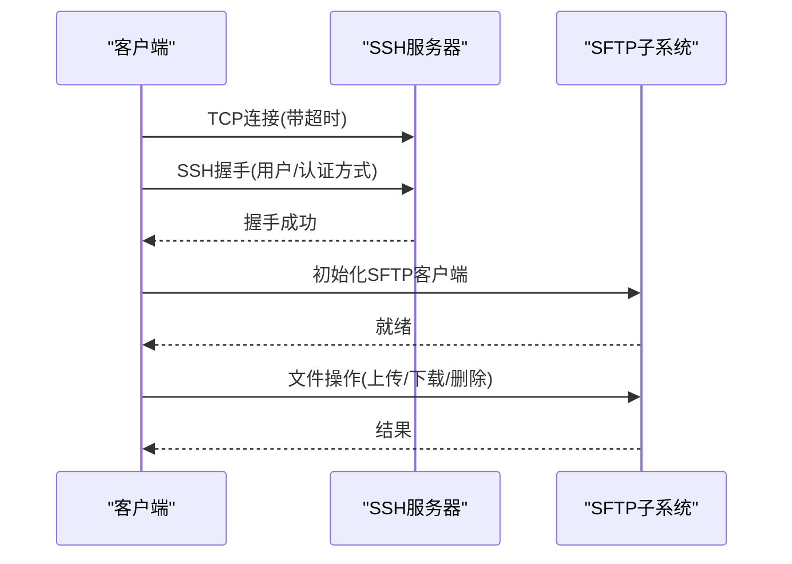
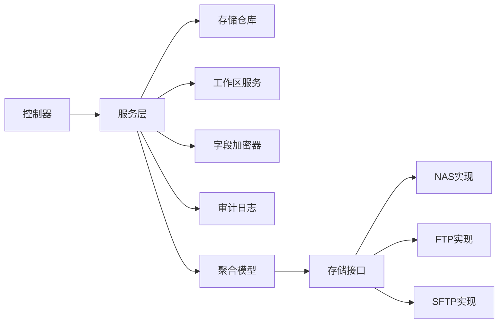

# 网络存储

<cite>
**本文引用的文件**
- [backend/internal/features/storages/controller.go](file://backend/internal/features/storages/controller.go)
- [backend/internal/features/storages/service.go](file://backend/internal/features/storages/service.go)
- [backend/internal/features/storages/interfaces.go](file://backend/internal/features/storages/interfaces.go)
- [backend/internal/features/storages/model.go](file://backend/internal/features/storages/model.go)
- [backend/internal/features/storages/models/nas/model.go](file://backend/internal/features/storages/models/nas/model.go)
- [backend/internal/features/storages/models/ftp/model.go](file://backend/internal/features/storages/models/ftp/model.go)
- [backend/internal/features/storages/models/sftp/model.go](file://backend/internal/features/storages/models/sftp/model.go)
- [backend/migrations/20251213204730_remove_ftp_passive_mode.sql](file://backend/migrations/20251213204730_remove_ftp_passive_mode.sql)
- [frontend/src/entity/storages/models/NASStorage.ts](file://frontend/src/entity/storages/models/NASStorage.ts)
- [frontend/src/entity/storages/models/FTPStorage.ts](file://frontend/src/entity/storages/models/FTPStorage.ts)
- [frontend/src/entity/storages/models/SFTPStorage.ts](file://frontend/src/entity/storages/models/SFTPStorage.ts)
- [frontend/src/features/storages/ui/edit/storages/EditNASStorageComponent.tsx](file://frontend/src/features/storages/ui/edit/storages/EditNASStorageComponent.tsx)
- [frontend/src/features/storages/ui/edit/storages/EditFTPStorageComponent.tsx](file://frontend/src/features/storages/ui/edit/storages/EditFTPStorageComponent.tsx)
</cite>

## 目录
1. [简介](#简介)
2. [项目结构](#项目结构)
3. [核心组件](#核心组件)
4. [架构总览](#架构总览)
5. [详细组件分析](#详细组件分析)
6. [依赖分析](#依赖分析)
7. [性能考虑](#性能考虑)
8. [故障排查指南](#故障排查指南)
9. [结论](#结论)

## 简介
本文件面向Databasus的网络存储能力，聚焦NAS（SMB/CIFS）、FTP与SFTP三类网络存储的配置与使用。内容涵盖：
- NAS存储：SMB/CIFS挂载、网络路径设置、认证凭据（用户名、密码、域）
- FTP存储：连接参数（服务器地址、端口、用户名密码、FTPS/TLS）
- SFTP存储：安全特性（密码与私钥认证、加密传输、主机密钥验证）
- 性能优化：超时控制、分块上传、取消与上下文传播
- 安全与防火墙：端口开放、证书校验、跳过校验的风险提示

## 项目结构
后端采用“统一存储抽象 + 具体存储实现”的设计，通过控制器与服务层协调工作空间权限、加密与连接测试；前端提供直观的表单字段映射。

**图表来源**
- [backend/internal/features/storages/controller.go:19-27](file://backend/internal/features/storages/controller.go#L19-L27)
- [backend/internal/features/storages/service.go:16-22](file://backend/internal/features/storages/service.go#L16-L22)
- [backend/internal/features/storages/interfaces.go:13-33](file://backend/internal/features/storages/interfaces.go#L13-L33)
- [backend/internal/features/storages/model.go:22-39](file://backend/internal/features/storages/model.go#L22-L39)
- [backend/internal/features/storages/models/nas/model.go:30-40](file://backend/internal/features/storages/models/nas/model.go#L30-L40)
- [backend/internal/features/storages/models/ftp/model.go:26-35](file://backend/internal/features/storages/models/ftp/model.go#L26-L35)
- [backend/internal/features/storages/models/sftp/model.go:26-35](file://backend/internal/features/storages/models/sftp/model.go#L26-L35)
- [frontend/src/entity/storages/models/NASStorage.ts:1-10](file://frontend/src/entity/storages/models/NASStorage.ts#L1-L10)
- [frontend/src/entity/storages/models/FTPStorage.ts:1-9](file://frontend/src/entity/storages/models/FTPStorage.ts#L1-L9)
- [frontend/src/entity/storages/models/SFTPStorage.ts:1-9](file://frontend/src/entity/storages/models/SFTPStorage.ts#L1-L9)
- [frontend/src/features/storages/ui/edit/storages/EditNASStorageComponent.tsx:159-202](file://frontend/src/features/storages/ui/edit/storages/EditNASStorageComponent.tsx#L159-L202)
- [frontend/src/features/storages/ui/edit/storages/EditFTPStorageComponent.tsx:155-233](file://frontend/src/features/storages/ui/edit/storages/EditFTPStorageComponent.tsx#L155-L233)

**章节来源**
- [backend/internal/features/storages/controller.go:19-27](file://backend/internal/features/storages/controller.go#L19-L27)
- [backend/internal/features/storages/service.go:16-22](file://backend/internal/features/storages/service.go#L16-L22)
- [backend/internal/features/storages/interfaces.go:13-33](file://backend/internal/features/storages/interfaces.go#L13-L33)
- [backend/internal/features/storages/model.go:22-39](file://backend/internal/features/storages/model.go#L22-L39)

## 核心组件
- 统一存储接口：定义保存、读取、删除、校验、连接测试、敏感信息隐藏与加密等能力，确保不同存储类型的一致行为契约。
- 存储聚合模型：根据类型动态委派到具体实现（NAS/FTP/SFTP等），并在更新时按类型合并字段。
- 服务层：负责工作区权限校验、系统存储限制、审计日志、连接测试与持久化错误回写。
- 控制器：暴露REST接口，支持保存、查询、删除、连接测试、直接测试、工作区转移等操作。

**章节来源**
- [backend/internal/features/storages/interfaces.go:13-33](file://backend/internal/features/storages/interfaces.go#L13-L33)
- [backend/internal/features/storages/model.go:41-85](file://backend/internal/features/storages/model.go#L41-L85)
- [backend/internal/features/storages/service.go:54-147](file://backend/internal/features/storages/service.go#L54-L147)
- [backend/internal/features/storages/controller.go:42-71](file://backend/internal/features/storages/controller.go#L42-L71)

## 架构总览
下图展示从控制器到服务再到具体存储实现的调用链路，以及前端表单与后端模型的对应关系。

**图表来源**
- [backend/internal/features/storages/controller.go:19-27](file://backend/internal/features/storages/controller.go#L19-L27)
- [backend/internal/features/storages/service.go:249-280](file://backend/internal/features/storages/service.go#L249-L280)
- [backend/internal/features/storages/model.go:163-184](file://backend/internal/features/storages/model.go#L163-L184)

## 详细组件分析

### NAS（SMB/CIFS）存储
- 配置要点
  - 主机与端口：默认端口由实现指定，需确保网络可达
  - 共享名：目标SMB共享名称
  - 认证：用户名、密码、可选域（域环境）
  - 加密：支持SSL/TLS封装（FTPS风格的TLS握手）
  - 路径：可选的子目录，实现会自动创建不存在的层级
- 连接与生命周期
  - 建立TCP连接，按需启用TLS
  - 使用NTLM发起者进行身份协商
  - 挂载共享、创建/检查目标路径、上传/下载/删除
- 错误处理
  - 解密失败、连接失败、挂载失败、路径创建失败、文件操作失败均会被包装并返回
- 前端映射
  - 字段：host、port、share、username、password、useSsl、domain、path
  - UI组件提供SSL提示与域说明

**图表来源**
- [backend/internal/features/storages/models/nas/model.go:347-371](file://backend/internal/features/storages/models/nas/model.go#L347-L371)
- [backend/internal/features/storages/models/nas/model.go:315-345](file://backend/internal/features/storages/models/nas/model.go#L315-L345)
- [backend/internal/features/storages/models/nas/model.go:373-411](file://backend/internal/features/storages/models/nas/model.go#L373-L411)

**章节来源**
- [backend/internal/features/storages/models/nas/model.go:30-40](file://backend/internal/features/storages/models/nas/model.go#L30-L40)
- [backend/internal/features/storages/models/nas/model.go:253-279](file://backend/internal/features/storages/models/nas/model.go#L253-L279)
- [backend/internal/features/storages/models/nas/model.go:347-371](file://backend/internal/features/storages/models/nas/model.go#L347-L371)
- [frontend/src/entity/storages/models/NASStorage.ts:1-10](file://frontend/src/entity/storages/models/NASStorage.ts#L1-L10)
- [frontend/src/features/storages/ui/edit/storages/EditNASStorageComponent.tsx:159-202](file://frontend/src/features/storages/ui/edit/storages/EditNASStorageComponent.tsx#L159-L202)

### FTP存储
- 连接参数
  - 主机、端口、用户名、密码
  - FTPS：显式TLS（FTPS），可选择跳过证书校验（仅在自签场景谨慎使用）
  - 路径：可选子目录，实现会自动创建
- 连接流程
  - 建立TCP连接，按需启用TLS
  - 登录后进行文件操作
- 被动模式变更
  - 数据库迁移移除了“被动模式”字段，当前实现不使用被动模式

**图表来源**
- [backend/internal/features/storages/models/ftp/model.go:239-278](file://backend/internal/features/storages/models/ftp/model.go#L239-L278)
- [backend/internal/features/storages/models/ftp/model.go:182-201](file://backend/internal/features/storages/models/ftp/model.go#L182-L201)
- [backend/migrations/20251213204730_remove_ftp_passive_mode.sql:1-15](file://backend/migrations/20251213204730_remove_ftp_passive_mode.sql#L1-L15)

**章节来源**
- [backend/internal/features/storages/models/ftp/model.go:26-35](file://backend/internal/features/storages/models/ftp/model.go#L26-L35)
- [backend/internal/features/storages/models/ftp/model.go:182-201](file://backend/internal/features/storages/models/ftp/model.go#L182-L201)
- [backend/internal/features/storages/models/ftp/model.go:239-278](file://backend/internal/features/storages/models/ftp/model.go#L239-L278)
- [frontend/src/entity/storages/models/FTPStorage.ts:1-9](file://frontend/src/entity/storages/models/FTPStorage.ts#L1-L9)
- [frontend/src/features/storages/ui/edit/storages/EditFTPStorageComponent.tsx:155-233](file://frontend/src/features/storages/ui/edit/storages/EditFTPStorageComponent.tsx#L155-L233)

### SFTP存储
- 安全特性
  - 支持密码与私钥两种认证方式（可同时存在，优先级取决于实现）
  - 加密传输：基于SSH隧道的SFTP通道
  - 主机密钥验证：当前实现采用宽松回调（允许跳过校验），生产环境建议保持默认严格校验
- 连接与生命周期
  - 建立TCP连接，SSH握手，创建SFTP客户端
  - 可选路径自动创建，随后进行文件操作
- 前端映射
  - 字段：host、port、username、password、privateKey、path、skipHostKeyVerify

**图表来源**
- [backend/internal/features/storages/models/sftp/model.go:266-333](file://backend/internal/features/storages/models/sftp/model.go#L266-L333)
- [backend/internal/features/storages/models/sftp/model.go:203-223](file://backend/internal/features/storages/models/sftp/model.go#L203-L223)

**章节来源**
- [backend/internal/features/storages/models/sftp/model.go:26-35](file://backend/internal/features/storages/models/sftp/model.go#L26-L35)
- [backend/internal/features/storages/models/sftp/model.go:203-223](file://backend/internal/features/storages/models/sftp/model.go#L203-L223)
- [backend/internal/features/storages/models/sftp/model.go:266-333](file://backend/internal/features/storages/models/sftp/model.go#L266-L333)
- [frontend/src/entity/storages/models/SFTPStorage.ts:1-9](file://frontend/src/entity/storages/models/SFTPStorage.ts#L1-L9)

## 依赖分析
- 控制器依赖服务层；服务层依赖存储仓库、工作区服务、审计日志与字段加密器
- 存储聚合模型通过类型委派到具体实现
- 接口统一了所有存储类型的公共行为

**图表来源**
- [backend/internal/features/storages/controller.go:14-17](file://backend/internal/features/storages/controller.go#L14-L17)
- [backend/internal/features/storages/service.go:16-22](file://backend/internal/features/storages/service.go#L16-L22)
- [backend/internal/features/storages/interfaces.go:13-33](file://backend/internal/features/storages/interfaces.go#L13-L33)
- [backend/internal/features/storages/model.go:163-184](file://backend/internal/features/storages/model.go#L163-L184)

**章节来源**
- [backend/internal/features/storages/controller.go:14-17](file://backend/internal/features/storages/controller.go#L14-L17)
- [backend/internal/features/storages/service.go:16-22](file://backend/internal/features/storages/service.go#L16-L22)
- [backend/internal/features/storages/interfaces.go:13-33](file://backend/internal/features/storages/interfaces.go#L13-L33)
- [backend/internal/features/storages/model.go:163-184](file://backend/internal/features/storages/model.go#L163-L184)

## 性能考虑
- 超时控制
  - 各存储实现均内置连接与测试超时，避免长时间阻塞
  - NAS/SFTP使用统一的连接超时常量；FTP使用独立常量族
- 分块与背压
  - NAS上传采用固定分块大小，逐块写入并等待确认，形成天然背压，平衡内存占用与吞吐
- 取消与上下文
  - 所有写入操作均接收上下文，支持取消与超时传播
- 建议
  - 在高延迟网络中适当增大连接超时
  - 对大文件备份建议结合数据库侧的并发与分块策略
  - 合理设置路径以减少深层目录创建开销

**章节来源**
- [backend/internal/features/storages/models/nas/model.go:21-28](file://backend/internal/features/storages/models/nas/model.go#L21-L28)
- [backend/internal/features/storages/models/nas/model.go:471-532](file://backend/internal/features/storages/models/nas/model.go#L471-L532)
- [backend/internal/features/storages/models/ftp/model.go:19-24](file://backend/internal/features/storages/models/ftp/model.go#L19-L24)
- [backend/internal/features/storages/models/sftp/model.go:20-24](file://backend/internal/features/storages/models/sftp/model.go#L20-L24)

## 故障排查指南
- 权限不足
  - 保存/删除/测试需要相应工作区管理权限；系统存储仅管理员可管理
- 连接失败
  - 检查主机、端口、网络连通性与防火墙放行
  - NAS：确认共享名、域、SSL/TLS配置
  - FTP：确认是否启用FTPS、证书校验策略
  - SFTP：确认认证方式（密码/私钥）、主机密钥校验
- 路径问题
  - 若配置了子目录，实现会尝试创建；若创建失败，检查权限与路径格式
- 错误回显
  - 服务层在连接测试失败时会记录最近一次保存错误，并持久化到存储记录中，便于定位

**章节来源**
- [backend/internal/features/storages/service.go:249-280](file://backend/internal/features/storages/service.go#L249-L280)
- [backend/internal/features/storages/service.go:282-315](file://backend/internal/features/storages/service.go#L282-L315)
- [backend/internal/features/storages/model.go:41-58](file://backend/internal/features/storages/model.go#L41-L58)

## 结论
Databasus对NAS（SMB/CIFS）、FTP与SFTP提供了统一的抽象与一致的API体验。通过严格的权限控制、加密存储敏感信息、完善的连接测试与错误回显机制，保障了网络存储的可用性与安全性。生产部署中建议：
- 开启必要的加密（FTPS/SFTP），避免跳过证书校验
- 合理设置超时与路径，提升稳定性
- 结合网络环境与数据规模优化分块与并发策略