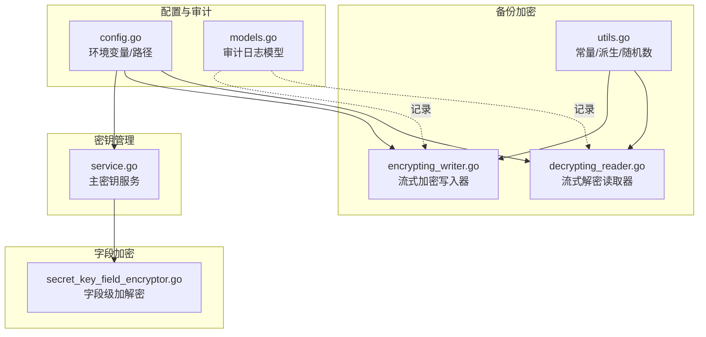
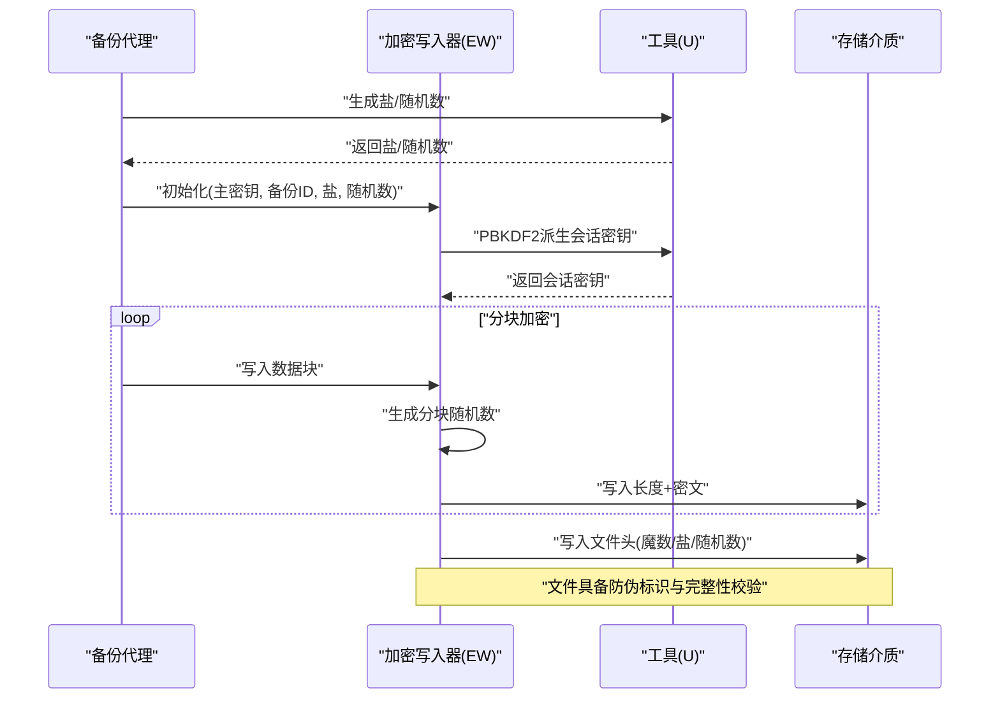
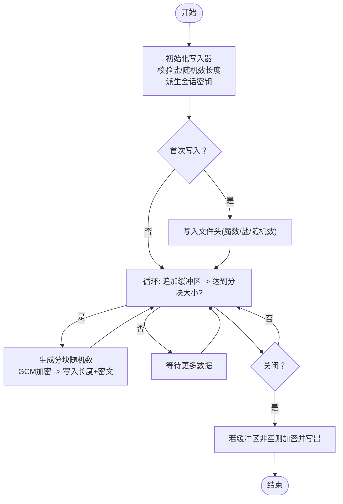
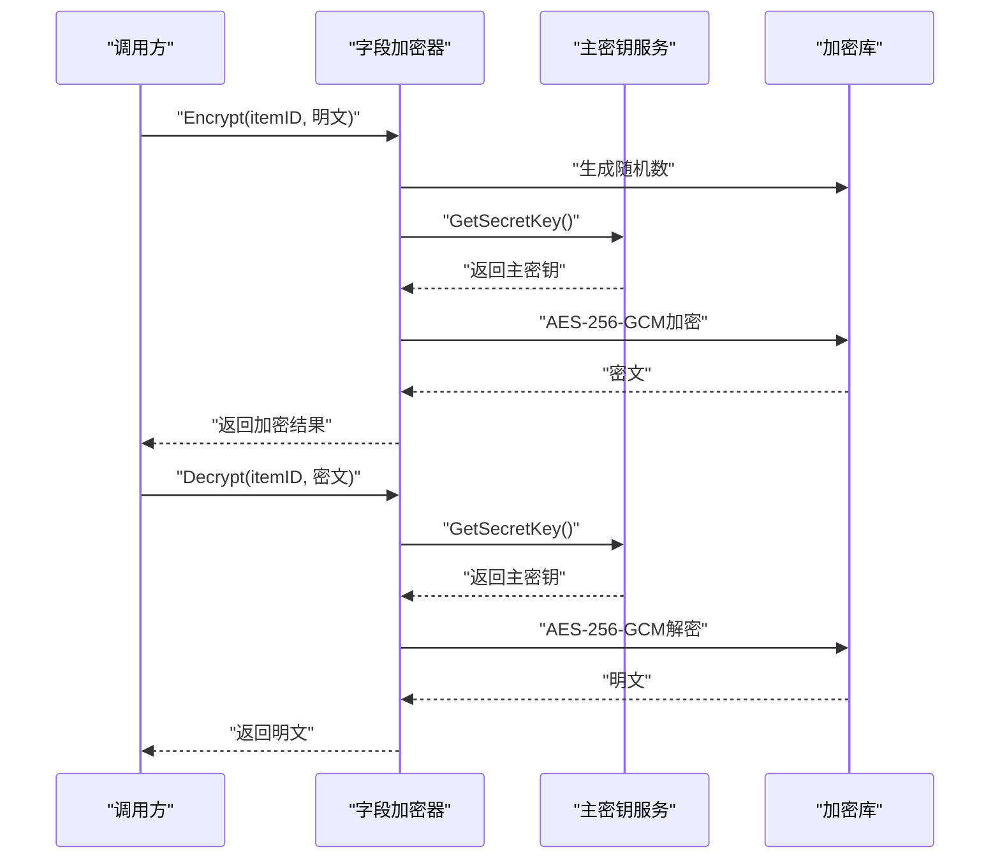
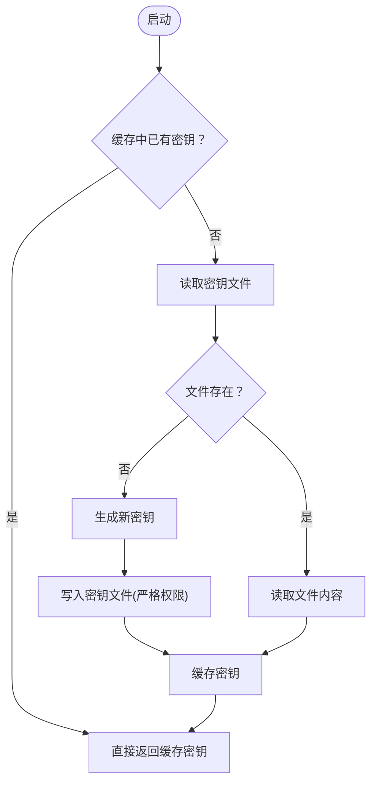
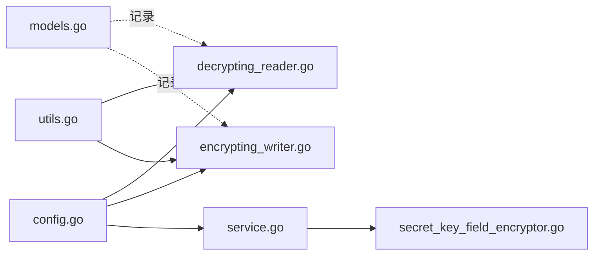

# 零信任存储安全

<cite>
**本文引用的文件**
- [backend/internal/features/backups/backups/encryption/utils.go](file://backend/internal/features/backups/backups/encryption/utils.go)
- [backend/internal/features/backups/backups/encryption/encrypting_writer.go](file://backend/internal/features/backups/backups/encryption/encrypting_writer.go)
- [backend/internal/features/backups/backups/encryption/decrypting_reader.go](file://backend/internal/features/backups/backups/encryption/decrypting_reader.go)
- [backend/internal/features/backups/backups/encryption/encryption_test.go](file://backend/internal/features/backups/backups/encryption/encryption_test.go)
- [backend/internal/util/encryption/secret_key_field_encryptor.go](file://backend/internal/util/encryption/secret_key_field_encryptor.go)
- [backend/internal/features/encryption/secrets/service.go](file://backend/internal/features/encryption/secrets/service.go)
- [backend/internal/config/config.go](file://backend/internal/config/config.go)
- [backend/internal/features/audit_logs/models.go](file://backend/internal/features/audit_logs/models.go)
- [.github/SECURITY.md](file://.github/SECURITY.md)
</cite>

## 目录
1. [引言](#引言)
2. [项目结构](#项目结构)
3. [核心组件](#核心组件)
4. [架构总览](#架构总览)
5. [详细组件分析](#详细组件分析)
6. [依赖分析](#依赖分析)
7. [性能考虑](#性能考虑)
8. [故障排查指南](#故障排查指南)
9. [结论](#结论)
10. [附录](#附录)

## 引言
本文件面向Databasus的零信任存储安全机制，系统化阐述以下内容：
- AES-256-GCM加密的实现原理与配置要点
- 密钥管理（生成、轮换、销毁）的全生命周期
- 数据完整性保护（哈希校验、篡改检测、防伪验证）
- 零信任架构原则（最小权限、动态验证、持续监控）
- 安全配置最佳实践（密钥存储、传输加密、访问审计）
- 威胁分析与防护策略

## 项目结构
围绕“零信任存储安全”，后端关键代码分布在如下模块：
- 备份加密：实现文件级AES-256-GCM流式加解密、盐值与随机数生成、PBKDF2派生密钥
- 字段级加密：对敏感字段（如密钥串）进行基于主密钥的对称加密
- 密钥服务：集中管理主密钥（文件持久化、缓存、迁移）
- 配置：统一加载环境变量与路径（含密钥文件路径）
- 审计日志：记录用户与系统活动，支撑持续监控与合规审计

图表来源
- [backend/internal/features/backups/backups/encryption/utils.go:1-52](file://backend/internal/features/backups/backups/encryption/utils.go#L1-L52)
- [backend/internal/features/backups/backups/encryption/encrypting_writer.go:1-148](file://backend/internal/features/backups/backups/encryption/encrypting_writer.go#L1-L148)
- [backend/internal/features/backups/backups/encryption/decrypting_reader.go:1-158](file://backend/internal/features/backups/backups/encryption/decrypting_reader.go#L1-L158)
- [backend/internal/util/encryption/secret_key_field_encryptor.go:54-106](file://backend/internal/util/encryption/secret_key_field_encryptor.go#L54-L106)
- [backend/internal/features/encryption/secrets/service.go:1-74](file://backend/internal/features/encryption/secrets/service.go#L1-L74)
- [backend/internal/config/config.go:326-334](file://backend/internal/config/config.go#L326-L334)
- [backend/internal/features/audit_logs/models.go:9-20](file://backend/internal/features/audit_logs/models.go#L9-L20)

章节来源
- [backend/internal/features/backups/backups/encryption/utils.go:1-52](file://backend/internal/features/backups/backups/encryption/utils.go#L1-L52)
- [backend/internal/features/backups/backups/encryption/encrypting_writer.go:1-148](file://backend/internal/features/backups/backups/encryption/encrypting_writer.go#L1-L148)
- [backend/internal/features/backups/backups/encryption/decrypting_reader.go:1-158](file://backend/internal/features/backups/backups/encryption/decrypting_reader.go#L1-L158)
- [backend/internal/util/encryption/secret_key_field_encryptor.go:54-106](file://backend/internal/util/encryption/secret_key_field_encryptor.go#L54-L106)
- [backend/internal/features/encryption/secrets/service.go:1-74](file://backend/internal/features/encryption/secrets/service.go#L1-L74)
- [backend/internal/config/config.go:326-334](file://backend/internal/config/config.go#L326-L334)
- [backend/internal/features/audit_logs/models.go:9-20](file://backend/internal/features/audit_logs/models.go#L9-L20)

## 核心组件
- 备份文件加密子系统：以AES-256-GCM实现带认证加密，支持大文件分块流式处理；通过PBKDF2从主密钥+备份ID+盐值派生会话密钥；使用魔数、盐、随机数作为文件头，确保文件可识别与防伪。
- 字段级加密子系统：对数据库连接密码等敏感字段进行对称加密，解密时从主密钥服务获取主密钥并使用GCM模式解密。
- 主密钥服务：负责主密钥的生成、缓存、持久化到文件、首次运行自动创建、以及从数据库向文件迁移。
- 配置与路径：集中定义密钥文件路径、数据目录、临时目录等，确保密钥文件受控存放。
- 审计日志：记录用户与系统行为，为持续监控与事件回溯提供依据。

章节来源
- [backend/internal/features/backups/backups/encryption/utils.go:12-36](file://backend/internal/features/backups/backups/encryption/utils.go#L12-L36)
- [backend/internal/features/backups/backups/encryption/encrypting_writer.go:23-63](file://backend/internal/features/backups/backups/encryption/encrypting_writer.go#L23-L63)
- [backend/internal/features/backups/backups/encryption/decrypting_reader.go:24-68](file://backend/internal/features/backups/backups/encryption/decrypting_reader.go#L24-L68)
- [backend/internal/util/encryption/secret_key_field_encryptor.go:58-106](file://backend/internal/util/encryption/secret_key_field_encryptor.go#L58-L106)
- [backend/internal/features/encryption/secrets/service.go:47-73](file://backend/internal/features/encryption/secrets/service.go#L47-L73)
- [backend/internal/config/config.go:326-334](file://backend/internal/config/config.go#L326-L334)
- [backend/internal/features/audit_logs/models.go:9-20](file://backend/internal/features/audit_logs/models.go#L9-L20)

## 架构总览
下图展示零信任存储安全的关键交互：备份写入端在本地对数据进行流式加密，使用主密钥派生会话密钥；恢复端在解密前严格校验文件头（魔数、盐、随机数），任何篡改或错误参数都会导致认证失败；字段级加密用于保护存储于数据库中的敏感字符串；主密钥由专用服务集中管理并持久化至受控文件；审计日志贯穿所有关键操作。

图表来源
- [backend/internal/features/backups/backups/encryption/encrypting_writer.go:23-63](file://backend/internal/features/backups/backups/encryption/encrypting_writer.go#L23-L63)
- [backend/internal/features/backups/backups/encryption/utils.go:23-52](file://backend/internal/features/backups/backups/encryption/utils.go#L23-L52)
- [backend/internal/features/backups/backups/encryption/encrypting_writer.go:104-148](file://backend/internal/features/backups/backups/encryption/encrypting_writer.go#L104-L148)

章节来源
- [backend/internal/features/backups/backups/encryption/encrypting_writer.go:23-63](file://backend/internal/features/backups/backups/encryption/encrypting_writer.go#L23-L63)
- [backend/internal/features/backups/backups/encryption/utils.go:23-52](file://backend/internal/features/backups/backups/encryption/utils.go#L23-L52)

## 详细组件分析

### 备份文件加密子系统（AES-256-GCM）
- 设计要点
  - 使用AES-256-GCM进行带认证加密，确保保密性与完整性
  - 文件头包含魔数、盐、随机数，用于文件识别与防伪
  - 分块大小固定，每块使用基于随机数扩展的分块随机数，避免重用
  - 采用PBKDF2（迭代次数可配置）从主密钥、备份ID与盐值派生会话密钥
- 关键流程
  - 初始化：校验盐与随机数长度，派生会话密钥，准备写入器
  - 写入：首次写入时延迟写入文件头；按块加密并写入长度与密文
  - 关闭：若未写入则先写入文件头，再处理剩余缓冲区
  - 解密：读取并校验文件头；逐块读取密文，使用对应分块随机数解密并拼接输出
- 完整性与篡改检测
  - GCM模式在解密阶段执行认证，任何篡改或参数不匹配均导致解密失败
  - 单元测试覆盖了篡改场景与错误参数场景，验证“认证失败”行为

图表来源
- [backend/internal/features/backups/backups/encryption/encrypting_writer.go:65-102](file://backend/internal/features/backups/backups/encryption/encrypting_writer.go#L65-L102)
- [backend/internal/features/backups/backups/encryption/encrypting_writer.go:120-148](file://backend/internal/features/backups/backups/encryption/encrypting_writer.go#L120-L148)

章节来源
- [backend/internal/features/backups/backups/encryption/encrypting_writer.go:23-63](file://backend/internal/features/backups/backups/encryption/encrypting_writer.go#L23-L63)
- [backend/internal/features/backups/backups/encryption/decrypting_reader.go:24-68](file://backend/internal/features/backups/backups/encryption/decrypting_reader.go#L24-L68)
- [backend/internal/features/backups/backups/encryption/encryption_test.go:131-164](file://backend/internal/features/backups/backups/encryption/encryption_test.go#L131-L164)

### 字段级加密（SecretKeyFieldEncryptor）
- 设计要点
  - 对数据库连接密码等敏感字段进行对称加密，防止明文落库
  - 加密格式包含前缀、随机数与密文，便于识别与解析
  - 解密时从主密钥服务获取主密钥，使用AES-256-GCM解密
- 流程
  - 加密：生成随机数，使用主密钥派生会话密钥，GCM加密，编码后组合成最终密文
  - 解密：解析密文格式，解码随机数与密文，使用相同流程解密还原明文

图表来源
- [backend/internal/util/encryption/secret_key_field_encryptor.go:58-106](file://backend/internal/util/encryption/secret_key_field_encryptor.go#L58-L106)
- [backend/internal/features/encryption/secrets/service.go:47-69](file://backend/internal/features/encryption/secrets/service.go#L47-L69)

章节来源
- [backend/internal/util/encryption/secret_key_field_encryptor.go:58-106](file://backend/internal/util/encryption/secret_key_field_encryptor.go#L58-L106)
- [backend/internal/features/encryption/secrets/service.go:47-69](file://backend/internal/features/encryption/secrets/service.go#L47-L69)

### 主密钥服务（SecretKeyService）
- 职责
  - 首次运行自动生成主密钥并写入受控文件
  - 提供主密钥缓存，减少文件IO
  - 支持从数据库迁移主密钥到文件，完成迁移后清理数据库记录
- 安全要点
  - 密钥文件权限严格控制（仅限运行用户读写）
  - 密钥路径由配置模块集中定义，便于审计与变更

图表来源
- [backend/internal/features/encryption/secrets/service.go:47-69](file://backend/internal/features/encryption/secrets/service.go#L47-L69)

章节来源
- [backend/internal/features/encryption/secrets/service.go:20-45](file://backend/internal/features/encryption/secrets/service.go#L20-L45)
- [backend/internal/features/encryption/secrets/service.go:47-73](file://backend/internal/features/encryption/secrets/service.go#L47-L73)
- [backend/internal/config/config.go:326-334](file://backend/internal/config/config.go#L326-L334)

### 审计日志与持续监控
- 审计日志模型包含用户ID、工作空间ID、消息与时间戳，便于追踪与取证
- 建议在关键节点（如备份任务开始/结束、解密尝试、密钥轮换）记录审计事件
- 结合外部监控平台，实现告警与自动化处置

章节来源
- [backend/internal/features/audit_logs/models.go:9-20](file://backend/internal/features/audit_logs/models.go#L9-L20)

## 依赖分析
- 组件耦合
  - 加密写入器/读取器依赖工具模块提供的常量、派生函数与随机数生成
  - 字段加密器依赖主密钥服务获取主密钥
  - 配置模块为密钥文件路径与数据目录提供统一入口
- 外部依赖
  - Go标准库crypto/aes、crypto/cipher、crypto/rand、golang.org/x/crypto/pbkdf2
  - UUID库用于备份ID与审计ID
- 潜在风险
  - 若主密钥文件权限不当，可能导致泄露
  - 若PBKDF2迭代次数过低，可能降低抗暴力破解能力
  - 若文件头被截断或篡改，会导致解密失败

图表来源
- [backend/internal/features/backups/backups/encryption/utils.go:1-52](file://backend/internal/features/backups/backups/encryption/utils.go#L1-L52)
- [backend/internal/features/backups/backups/encryption/encrypting_writer.go:1-148](file://backend/internal/features/backups/backups/encryption/encrypting_writer.go#L1-L148)
- [backend/internal/features/backups/backups/encryption/decrypting_reader.go:1-158](file://backend/internal/features/backups/backups/encryption/decrypting_reader.go#L1-L158)
- [backend/internal/util/encryption/secret_key_field_encryptor.go:54-106](file://backend/internal/util/encryption/secret_key_field_encryptor.go#L54-L106)
- [backend/internal/features/encryption/secrets/service.go:1-74](file://backend/internal/features/encryption/secrets/service.go#L1-L74)
- [backend/internal/config/config.go:326-334](file://backend/internal/config/config.go#L326-L334)
- [backend/internal/features/audit_logs/models.go:9-20](file://backend/internal/features/audit_logs/models.go#L9-L20)

章节来源
- [backend/internal/features/backups/backups/encryption/utils.go:1-52](file://backend/internal/features/backups/backups/encryption/utils.go#L1-L52)
- [backend/internal/features/backups/backups/encryption/encrypting_writer.go:1-148](file://backend/internal/features/backups/backups/encryption/encrypting_writer.go#L1-L148)
- [backend/internal/features/backups/backups/encryption/decrypting_reader.go:1-158](file://backend/internal/features/backups/backups/encryption/decrypting_reader.go#L1-L158)
- [backend/internal/util/encryption/secret_key_field_encryptor.go:54-106](file://backend/internal/util/encryption/secret_key_field_encryptor.go#L54-L106)
- [backend/internal/features/encryption/secrets/service.go:1-74](file://backend/internal/features/encryption/secrets/service.go#L1-L74)
- [backend/internal/config/config.go:326-334](file://backend/internal/config/config.go#L326-L334)
- [backend/internal/features/audit_logs/models.go:9-20](file://backend/internal/features/audit_logs/models.go#L9-L20)

## 性能考虑
- 分块加密与流式处理：单块默认1MB，兼顾内存占用与吞吐
- PBKDF2迭代次数：影响派生密钥速度与安全性平衡，建议结合硬件能力评估
- 缓存主密钥：减少频繁IO，提升字段加密/解密性能
- 磁盘写入：顺序写入文件头与分块密文，有利于大文件备份的稳定性

## 故障排查指南
- 认证失败（解密报错）
  - 检查主密钥是否正确（主密钥服务返回值）
  - 确认备份ID、盐、随机数与加密时一致
  - 排查文件头是否被截断或篡改
- 空数据或部分数据
  - 确认写入器Close是否被调用
  - 检查缓冲区是否完整写出
- 单元测试参考
  - 篡改测试：对密文特定位置进行异或，验证解密报“认证失败”
  - 错误参数测试：错误主密钥、错误盐/随机数导致解密失败
  - 大数据与多块写入测试：验证分块边界与顺序一致性

章节来源
- [backend/internal/features/backups/backups/encryption/encryption_test.go:131-164](file://backend/internal/features/backups/backups/encryption/encryption_test.go#L131-L164)
- [backend/internal/features/backups/backups/encryption/encryption_test.go:267-294](file://backend/internal/features/backups/backups/encryption/encryption_test.go#L267-L294)
- [backend/internal/features/backups/backups/encryption/encryption_test.go:47-76](file://backend/internal/features/backups/backups/encryption/encryption_test.go#L47-L76)

## 结论
Databasus通过AES-256-GCM实现备份文件的机密性与完整性保护，并以PBKDF2派生会话密钥、严格的文件头防伪与GCM认证失败机制，有效抵御篡改与伪造。主密钥服务集中管理密钥并提供迁移能力，配合审计日志与零信任原则（最小权限、动态验证、持续监控），构建了面向云存储的可信备份体系。

## 附录

### 零信任架构原则与落地
- 最小权限：默认只读访问数据库，限制备份账户权限集合
- 动态验证：每次解密均进行文件头校验与GCM认证
- 持续监控：审计日志记录关键事件，支持告警与回溯

章节来源
- [.github/SECURITY.md:56-66](file://.github/SECURITY.md#L56-L66)

### 安全配置最佳实践
- 密钥存储
  - 将密钥文件置于受控目录，严格限制文件权限
  - 启动时检查密钥文件是否存在，不存在则自动生成并写入
- 传输加密
  - 使用TLS/SSL连接数据库与对象存储
  - 在连接字符串中启用严格SSL模式
- 访问审计
  - 记录备份任务、解密尝试、密钥轮换等关键事件
  - 定期审查审计日志，建立告警机制

章节来源
- [backend/internal/config/config.go:326-334](file://backend/internal/config/config.go#L326-L334)
- [backend/internal/features/encryption/secrets/service.go:47-69](file://backend/internal/features/encryption/secrets/service.go#L47-L69)
- [backend/internal/features/audit_logs/models.go:9-20](file://backend/internal/features/audit_logs/models.go#L9-L20)