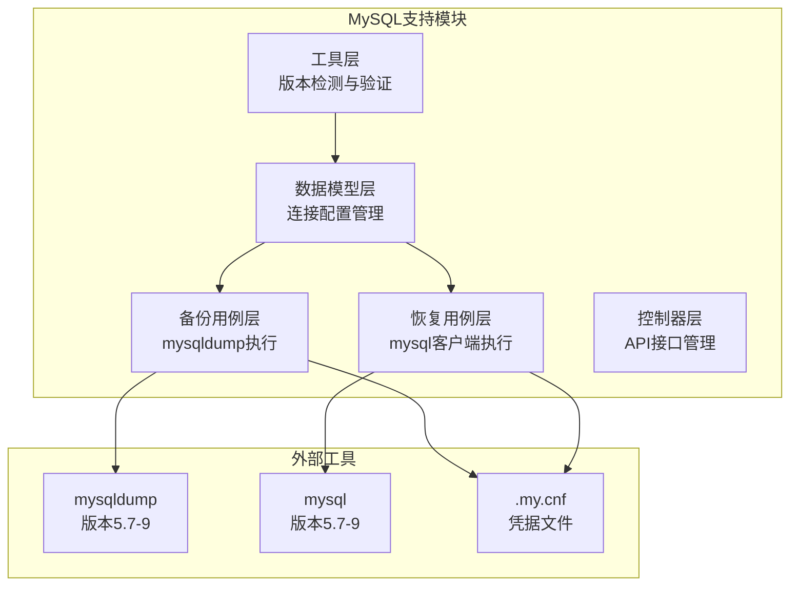
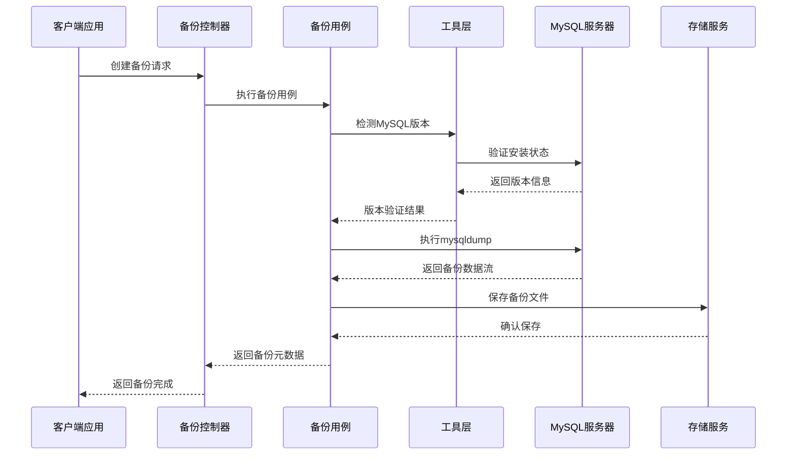
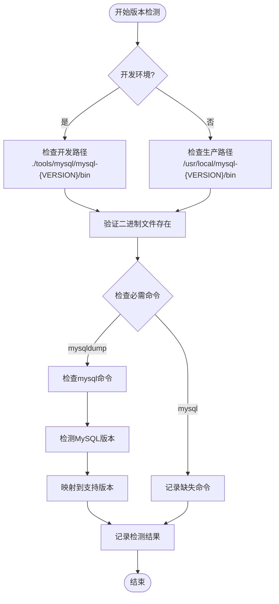
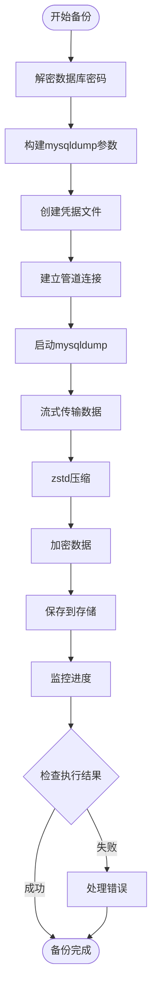
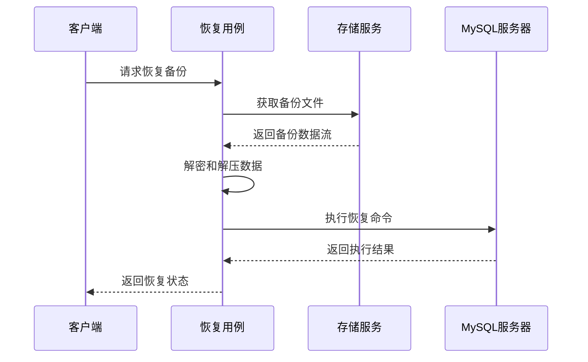
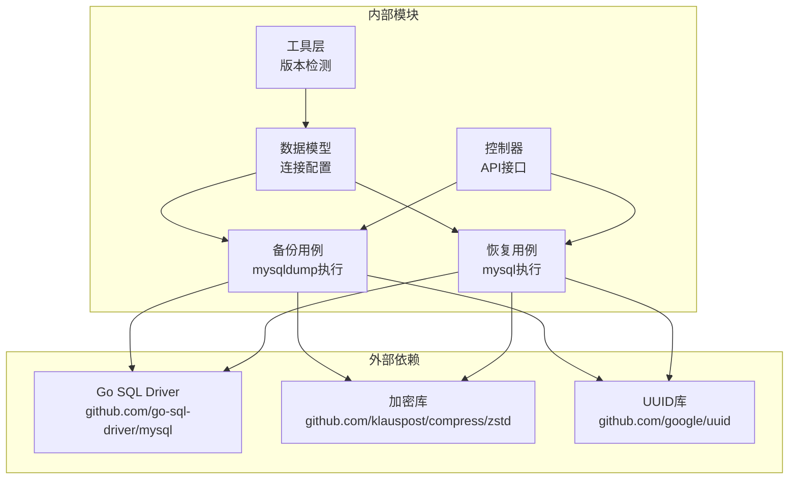

# MySQL数据库支持

<cite>
**本文档引用的文件**
- [mysql.go](file://backend/internal/util/tools/mysql.go)
- [model.go](file://backend/internal/features/databases/databases/mysql/model.go)
- [create_backup_uc.go](file://backend/internal/features/backups/backups/usecases/mysql/create_backup_uc.go)
- [restore_backup_uc.go](file://backend/internal/features/restores/usecases/mysql/restore_backup_uc.go)
- [controller.go](file://backend/internal/features/backups/backups/controllers/controller.go)
- [README.md](file://assets/tools/README.md)
</cite>

## 目录
1. [简介](#简介)
2. [项目结构](#项目结构)
3. [核心组件](#核心组件)
4. [架构概览](#架构概览)
5. [详细组件分析](#详细组件分析)
6. [依赖关系分析](#依赖关系分析)
7. [性能考虑](#性能考虑)
8. [故障排除指南](#故障排除指南)
9. [结论](#结论)

## 简介

Databasus提供了对MySQL数据库的完整支持，涵盖从5.7到9版本的广泛兼容性。该系统通过原生mysqldump和mysql客户端工具实现备份和恢复功能，支持多种网络压缩算法和加密选项。

本系统的核心优势在于其灵活的版本管理机制，能够自动检测和适配不同版本的MySQL服务器特性，同时提供统一的备份和恢复接口。

## 项目结构

Databasus的MySQL支持功能分布在以下关键模块中：

**图表来源**
- [mysql.go:1-231](file://backend/internal/util/tools/mysql.go#L1-L231)
- [model.go:1-609](file://backend/internal/features/databases/databases/mysql/model.go#L1-L609)

**章节来源**
- [mysql.go:1-231](file://backend/internal/util/tools/mysql.go#L1-L231)
- [model.go:1-609](file://backend/internal/features/databases/databases/mysql/model.go#L1-L609)

## 核心组件

### 版本管理系统

Databasus支持以下MySQL版本：
- MySQL 5.7.x
- MySQL 8.0.x  
- MySQL 8.4.x
- MySQL 9.x

每个版本都配备了完整的客户端工具链，包括mysqldump和mysql命令行工具。

### 连接配置管理

系统通过MysqlDatabase结构体管理所有连接参数：
- 主机地址和端口
- 用户名和密码（支持加密存储）
- 数据库名称
- SSL/TLS配置
- 权限检测和验证

### 备份执行引擎

基于mysqldump的备份流程支持：
- 单事务一致性备份
- 触发器和事件备份
- 网络压缩优化
- 流式传输到存储
- 加密备份支持

**章节来源**
- [mysql.go:14-21](file://backend/internal/util/tools/mysql.go#L14-L21)
- [model.go:22-36](file://backend/internal/features/databases/databases/mysql/model.go#L22-L36)
- [create_backup_uc.go:101-139](file://backend/internal/features/backups/backups/usecases/mysql/create_backup_uc.go#L101-L139)

## 架构概览

Databasus的MySQL支持采用分层架构设计，确保了良好的可维护性和扩展性：

**图表来源**
- [controller.go:99-118](file://backend/internal/features/backups/backups/controllers/controller.go#L99-L118)
- [create_backup_uc.go:53-99](file://backend/internal/features/backups/backups/usecases/mysql/create_backup_uc.go#L53-L99)
- [mysql.go:54-176](file://backend/internal/util/tools/mysql.go#L54-L176)

## 详细组件分析

### 版本检测与验证系统

系统实现了智能的MySQL版本检测机制：

**图表来源**
- [mysql.go:54-176](file://backend/internal/util/tools/mysql.go#L54-L176)
- [mysql.go:182-189](file://backend/internal/util/tools/mysql.go#L182-L189)

### 连接配置与安全

MySQL连接配置支持多种安全选项：

#### DSN构建逻辑
系统根据配置动态生成连接字符串，支持：
- SSL/TLS连接（可跳过证书验证）
- 字符集设置（utf8mb4）
- 超时控制
- 清文密码传输（仅在SSL启用时）

#### 凭据管理
- 支持加密存储密码
- 自动解密处理
- 临时凭据文件（.my.cnf）管理
- 文件权限严格控制（0600）

**章节来源**
- [model.go:406-433](file://backend/internal/features/databases/databases/mysql/model.go#L406-L433)
- [model.go:299-391](file://backend/internal/features/databases/databases/mysql/model.go#L299-L391)

### 备份执行流程

备份系统采用流式处理架构，确保大容量数据的高效处理：

**图表来源**
- [create_backup_uc.go:53-99](file://backend/internal/features/backups/backups/usecases/mysql/create_backup_uc.go#L53-L99)
- [create_backup_uc.go:163-297](file://backend/internal/features/backups/backups/usecases/mysql/create_backup_uc.go#L163-L297)

### 恢复执行流程

恢复过程同样采用流式架构，支持断点续传和错误恢复：

**图表来源**
- [restore_backup_uc.go:38-102](file://backend/internal/features/restores/usecases/mysql/restore_backup_uc.go#L38-L102)
- [restore_backup_uc.go:104-160](file://backend/internal/features/restores/usecases/mysql/restore_backup_uc.go#L104-L160)

**章节来源**
- [create_backup_uc.go:101-161](file://backend/internal/features/backups/backups/usecases/mysql/create_backup_uc.go#L101-L161)
- [restore_backup_uc.go:66-101](file://backend/internal/features/restores/usecases/mysql/restore_backup_uc.go#L66-L101)

### 权限检测与管理

系统具备完善的权限检测机制：

#### 备份权限要求
- SELECT权限：必须具备
- SHOW VIEW权限：必须具备
- LOCK TABLES权限：提升备份一致性
- TRIGGER权限：备份触发器（如有）
- EVENT权限：备份事件（如有）

#### 只读用户管理
系统可以自动创建专用的只读用户用于备份操作：
- 自动生成唯一用户名
- 授予最小必要权限
- 支持事务完整性保证
- 自动清理机制

**章节来源**
- [model.go:482-581](file://backend/internal/features/databases/databases/mysql/model.go#L482-L581)
- [model.go:301-391](file://backend/internal/features/databases/databases/mysql/model.go#L301-L391)

## 依赖关系分析

Databasus的MySQL支持模块间存在清晰的依赖关系：

**图表来源**
- [model.go:15-20](file://backend/internal/features/databases/databases/mysql/model.go#L15-L20)
- [create_backup_uc.go:3-30](file://backend/internal/features/backups/backups/usecases/mysql/create_backup_uc.go#L3-L30)

### 版本兼容性矩阵

| 功能特性 | MySQL 5.7 | MySQL 8.0 | MySQL 8.4 | MySQL 9 |
|---------|-----------|-----------|-----------|---------|
| 基础备份 | ✅ 完全支持 | ✅ 完全支持 | ✅ 完全支持 | ✅ 完全支持 |
| 触发器备份 | ✅ 支持 | ✅ 支持 | ✅ 支持 | ✅ 支持 |
| 事件备份 | ✅ 支持 | ✅ 支持 | ✅ 支持 | ✅ 支持 |
| zstd压缩 | ❌ 不支持 | ✅ 支持 | ✅ 支持 | ✅ 支持 |
| 网络压缩 | ✅ 支持 | ✅ 支持 | ✅ 支持 | ✅ 支持 |
| SSL连接 | ✅ 支持 | ✅ 支持 | ✅ 支持 | ✅ 支持 |
| GTID支持 | ❌ 不支持 | ✅ 支持 | ✅ 支持 | ✅ 支持 |

**章节来源**
- [mysql.go:16-21](file://backend/internal/util/tools/mysql.go#L16-L21)
- [create_backup_uc.go:146-161](file://backend/internal/features/backups/backups/usecases/mysql/create_backup_uc.go#L146-L161)

## 性能考虑

### 网络压缩优化

系统根据MySQL版本自动选择最优的压缩方案：

#### 8.0+版本优化
- 优先使用zstd压缩算法
- 支持可配置压缩级别（默认5级）
- 自动检测服务器压缩算法支持

#### 5.7版本兼容
- 使用传统压缩方法
- 确保向后兼容性

### 内存使用优化

备份过程中采用流式处理：
- 固定大小缓冲区（8MB）
- 实时进度报告
- 内存使用量可控

### 并发控制

系统实现多层并发保护：
- 下载令牌机制
- 用户级下载锁
- 心跳保持机制

**章节来源**
- [create_backup_uc.go:32-40](file://backend/internal/features/backups/backups/usecases/mysql/create_backup_uc.go#L32-L40)
- [create_backup_uc.go:339-414](file://backend/internal/features/backups/backups/usecases/mysql/create_backup_uc.go#L339-L414)

## 故障排除指南

### 常见连接问题

#### 访问被拒绝
**症状**：mysqldump执行时报错"Access denied"
**解决方案**：
- 验证用户名和密码正确性
- 检查用户权限配置
- 确认主机访问限制

#### 连接被拒绝
**症状**：无法连接到MySQL服务器
**解决方案**：
- 检查服务器是否运行
- 验证网络连通性
- 确认防火墙设置

#### SSL连接失败
**症状**：SSL握手失败或证书验证错误
**解决方案**：
- 检查SSL证书配置
- 验证SSL模式设置
- 确认客户端SSL支持

### 备份执行问题

#### 压缩算法不支持
**症状**：出现"compression algorithm"相关错误
**解决方案**：
- 重新保存数据库连接以重新检测
- 检查MySQL服务器压缩算法配置
- 验证网络环境支持

#### 权限不足
**症状**：备份失败且提示权限不足
**解决方案**：
- 授予必要的数据库权限
- 检查用户角色配置
- 验证全局权限设置

### 恢复执行问题

#### 目标数据库不存在
**症状**：恢复时报"Unknown database"错误
**解决方案**：
- 在目标服务器创建数据库
- 验证数据库名称正确性
- 检查字符集和排序规则

#### 恢复超时
**症状**：恢复过程长时间无响应
**解决方案**：
- 增加超时时间设置
- 检查服务器资源使用情况
- 优化网络连接质量

**章节来源**
- [create_backup_uc.go:581-628](file://backend/internal/features/backups/backups/usecases/mysql/create_backup_uc.go#L581-L628)
- [restore_backup_uc.go:317-374](file://backend/internal/features/restores/usecases/mysql/restore_backup_uc.go#L317-L374)

## 结论

Databasus的MySQL支持功能提供了企业级的数据库备份和恢复解决方案。通过智能版本检测、灵活的配置管理和高效的流式处理架构，系统能够在各种环境中稳定运行。

主要优势包括：
- 全面的版本兼容性（5.7-9）
- 安全的凭据管理和传输
- 高效的压缩和加密机制
- 完善的错误处理和恢复能力
- 用户友好的API接口

对于需要在Databasus中使用MySQL的用户，建议重点关注连接配置的安全性、备份策略的选择，以及监控和告警机制的设置。