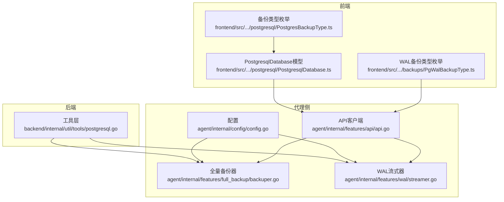
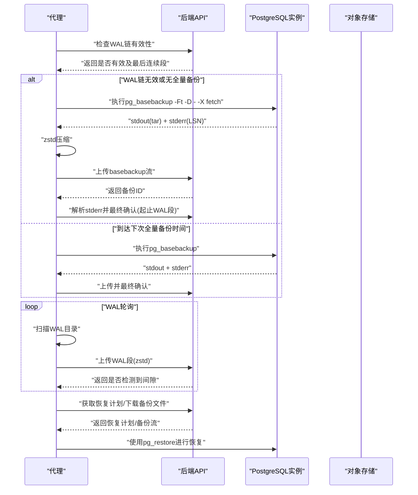
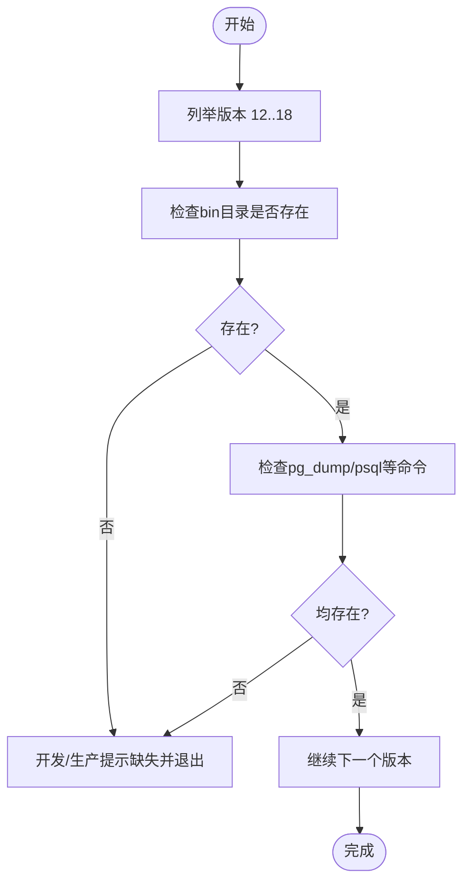
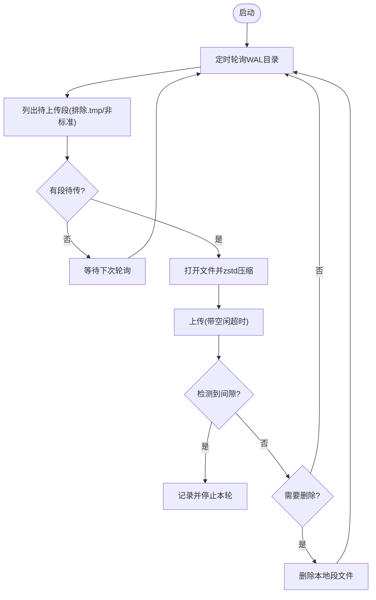
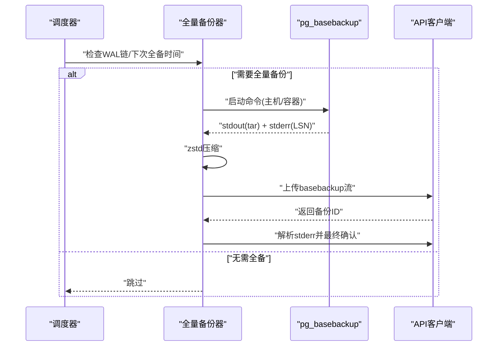
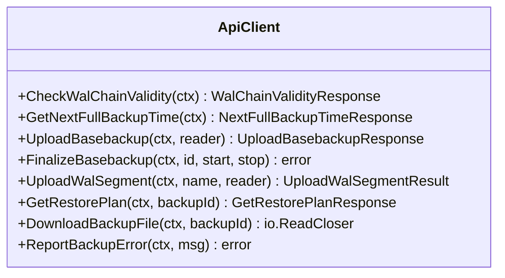
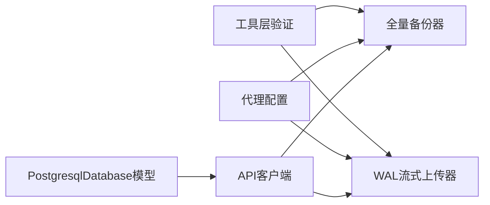

# PostgreSQL数据库支持

<cite>
**本文引用的文件**
- [agent/internal/features/api/api.go](file://agent/internal/features/api/api.go)
- [agent/internal/features/full_backup/backuper.go](file://agent/internal/features/full_backup/backuper.go)
- [agent/internal/features/wal/streamer.go](file://agent/internal/features/wal/streamer.go)
- [agent/internal/config/config.go](file://agent/internal/config/config.go)
- [backend/internal/util/tools/postgresql.go](file://backend/internal/util/tools/postgresql.go)
- [backend/internal/features/databases/databases/postgresql/model.go](file://backend/internal/features/databases/databases/postgresql/model.go)
- [frontend/src/entity/databases/model/postgresql/PostgresqlDatabase.ts](file://frontend/src/entity/databases/model/postgresql/PostgresqlDatabase.ts)
- [frontend/src/entity/databases/model/postgresql/PostgresBackupType.ts](file://frontend/src/entity/databases/model/postgresql/PostgresBackupType.ts)
- [frontend/src/entity/backups/model/PgWalBackupType.ts](file://frontend/src/entity/backups/model/PgWalBackupType.ts)
- [agent/e2e/mock-server/main.go](file://agent/e2e/mock-server/main.go)
- [assets/tools/README.md](file://assets/tools/README.md)
</cite>

## 目录
1. [简介](#简介)
2. [项目结构](#项目结构)
3. [核心组件](#核心组件)
4. [架构总览](#架构总览)
5. [详细组件分析](#详细组件分析)
6. [依赖分析](#依赖分析)
7. [性能考虑](#性能考虑)
8. [故障排除指南](#故障排除指南)
9. [结论](#结论)
10. [附录](#附录)

## 简介
本文件面向Databasus中PostgreSQL数据库支持功能，系统性阐述从PostgreSQL 12到18版本的支持范围、连接与认证配置、WAL归档与流式传输、物理备份与恢复流程、以及代理模式与直接连接模式的适用场景。文档同时提供版本差异影响、配置要点、性能调优建议与常见问题排查方法，帮助用户在不同环境中稳定运行PostgreSQL备份与恢复。

## 项目结构
围绕PostgreSQL支持的关键代码分布在后端工具层、代理侧备份组件与前端数据模型三部分：
- 后端工具层：负责PostgreSQL版本与客户端工具验证、Windows平台兼容处理、pgpass字段转义等。
- 代理侧组件：实现WAL流式上传、全量备份（基于pg_basebackup）触发与上传、错误上报与恢复计划获取。
- 前端数据模型：定义PostgreSQL数据库实体、备份类型枚举、WAL备份类型枚举。

图表来源
- [backend/internal/util/tools/postgresql.go:34-166](file://backend/internal/util/tools/postgresql.go#L34-L166)
- [agent/internal/config/config.go:46-50](file://agent/internal/config/config.go#L46-L50)
- [agent/internal/features/api/api.go:17-28](file://agent/internal/features/api/api.go#L17-L28)
- [agent/internal/features/full_backup/backuper.go:277-316](file://agent/internal/features/full_backup/backuper.go#L277-L316)
- [agent/internal/features/wal/streamer.go:92-121](file://agent/internal/features/wal/streamer.go#L92-L121)
- [frontend/src/entity/databases/model/postgresql/PostgresqlDatabase.ts:1-23](file://frontend/src/entity/databases/model/postgresql/PostgresqlDatabase.ts#L1-L23)
- [frontend/src/entity/databases/model/postgresql/PostgresBackupType.ts:1-4](file://frontend/src/entity/databases/model/postgresql/PostgresBackupType.ts#L1-L4)
- [frontend/src/entity/backups/model/PgWalBackupType.ts:1-4](file://frontend/src/entity/backups/model/PgWalBackupType.ts#L1-L4)

章节来源
- [backend/internal/util/tools/postgresql.go:34-166](file://backend/internal/util/tools/postgresql.go#L34-L166)
- [agent/internal/config/config.go:46-50](file://agent/internal/config/config.go#L46-L50)
- [agent/internal/features/api/api.go:17-28](file://agent/internal/features/api/api.go#L17-L28)
- [agent/internal/features/full_backup/backuper.go:277-316](file://agent/internal/features/full_backup/backuper.go#L277-L316)
- [agent/internal/features/wal/streamer.go:92-121](file://agent/internal/features/wal/streamer.go#L92-L121)
- [frontend/src/entity/databases/model/postgresql/PostgresqlDatabase.ts:1-23](file://frontend/src/entity/databases/model/postgresql/PostgresqlDatabase.ts#L1-L23)
- [frontend/src/entity/databases/model/postgresql/PostgresBackupType.ts:1-4](file://frontend/src/entity/databases/model/postgresql/PostgresBackupType.ts#L1-L4)
- [frontend/src/entity/backups/model/PgWalBackupType.ts:1-4](file://frontend/src/entity/backups/model/PgWalBackupType.ts#L1-L4)

## 核心组件
- 版本与工具验证：确保PostgreSQL 12-18各版本客户端工具可用，并在开发环境按约定路径定位工具。
- 配置项：代理侧通过命令行标志或环境变量注入PostgreSQL主机、端口、用户、密码、类型（主机/容器）、WAL目录等。
- 备份类型：支持PG_DUMP与WAL_V1两种备份类型；WAL_V1依赖WAL流式上传与全量备份配合。
- WAL流式上传：扫描WAL目录，按段名排序上传，支持zstd压缩与空闲超时检测。
- 全量备份：周期性检查WAL链有效性或到达下次全备时间时触发pg_basebackup，输出tar并通过管道zstd压缩后上传，解析stderr获取WAL起止段并最终确认。
- 恢复流程：通过API获取恢复计划与下载备份文件，结合pg_restore进行恢复。

章节来源
- [backend/internal/util/tools/postgresql.go:34-166](file://backend/internal/util/tools/postgresql.go#L34-L166)
- [agent/internal/config/config.go:46-50](file://agent/internal/config/config.go#L46-L50)
- [agent/internal/features/api/api.go:17-28](file://agent/internal/features/api/api.go#L17-L28)
- [agent/internal/features/wal/streamer.go:92-121](file://agent/internal/features/wal/streamer.go#L92-L121)
- [agent/internal/features/full_backup/backuper.go:164-245](file://agent/internal/features/full_backup/backuper.go#L164-L245)
- [frontend/src/entity/databases/model/postgresql/PostgresqlDatabase.ts:1-23](file://frontend/src/entity/databases/model/postgresql/PostgresqlDatabase.ts#L1-L23)

## 架构总览
下图展示PostgreSQL备份与恢复在Databasus中的整体交互：代理侧负责WAL流式上传与全量备份，后端提供REST API用于状态查询、错误上报、恢复计划与二进制下载。

图表来源
- [agent/internal/features/full_backup/backuper.go:85-124](file://agent/internal/features/full_backup/backuper.go#L85-L124)
- [agent/internal/features/full_backup/backuper.go:164-245](file://agent/internal/features/full_backup/backuper.go#L164-L245)
- [agent/internal/features/wal/streamer.go:63-90](file://agent/internal/features/wal/streamer.go#L63-L90)
- [agent/internal/features/api/api.go:72-106](file://agent/internal/features/api/api.go#L72-L106)
- [agent/internal/features/api/api.go:200-242](file://agent/internal/features/api/api.go#L200-L242)
- [agent/internal/features/api/api.go:244-280](file://agent/internal/features/api/api.go#L244-L280)
- [agent/internal/features/api/api.go:282-309](file://agent/internal/features/api/api.go#L282-L309)

## 详细组件分析

### 组件一：PostgreSQL版本与工具验证
- 支持版本：PostgreSQL 12至18。
- 验证内容：bin目录存在性与pg_dump、psql等必要可执行文件存在性。
- 开发环境路径：assets/tools中按版本组织的bin目录。
- 生产环境路径：/usr/lib/postgresql/{version}/bin。
- Windows兼容：开发环境下对Windows的12/13版本做特殊映射以规避管道问题。

图表来源
- [backend/internal/util/tools/postgresql.go:34-166](file://backend/internal/util/tools/postgresql.go#L34-L166)

章节来源
- [backend/internal/util/tools/postgresql.go:34-166](file://backend/internal/util/tools/postgresql.go#L34-L166)

### 组件二：WAL流式上传器
- 功能：定期扫描WAL目录，过滤临时文件与非标准段名，按字典序上传每个WAL段。
- 压缩：使用zstd压缩，编码级别与CRC校验启用。
- 超时：单段上传超时与空闲超时控制，避免长时间阻塞。
- 错误处理：检测到WAL链间隙时记录期望与实际段名并终止当前循环。
- 删除策略：上传完成后可选删除已上传段文件。

图表来源
- [agent/internal/features/wal/streamer.go:44-61](file://agent/internal/features/wal/streamer.go#L44-L61)
- [agent/internal/features/wal/streamer.go:92-121](file://agent/internal/features/wal/streamer.go#L92-L121)
- [agent/internal/features/wal/streamer.go:123-173](file://agent/internal/features/wal/streamer.go#L123-L173)

章节来源
- [agent/internal/features/wal/streamer.go:44-61](file://agent/internal/features/wal/streamer.go#L44-L61)
- [agent/internal/features/wal/streamer.go:92-121](file://agent/internal/features/wal/streamer.go#L92-L121)
- [agent/internal/features/wal/streamer.go:123-173](file://agent/internal/features/wal/streamer.go#L123-L173)

### 组件三：全量备份器
- 触发条件：WAL链无效或到达下次全量备份时间。
- 执行流程：构建pg_basebackup命令（主机/容器两种模式），捕获stderr解析WAL起止段，上传stdout输出并通过管道zstd压缩。
- 错误上报：上传失败或进程退出时上报错误并按指数退避重试。
- 最终确认：成功后调用API完成备份并提交WAL段范围。

图表来源
- [agent/internal/features/full_backup/backuper.go:85-124](file://agent/internal/features/full_backup/backuper.go#L85-L124)
- [agent/internal/features/full_backup/backuper.go:164-245](file://agent/internal/features/full_backup/backuper.go#L164-L245)
- [agent/internal/features/full_backup/backuper.go:277-316](file://agent/internal/features/full_backup/backuper.go#L277-L316)

章节来源
- [agent/internal/features/full_backup/backuper.go:85-124](file://agent/internal/features/full_backup/backuper.go#L85-L124)
- [agent/internal/features/full_backup/backuper.go:164-245](file://agent/internal/features/full_backup/backuper.go#L164-L245)
- [agent/internal/features/full_backup/backuper.go:277-316](file://agent/internal/features/full_backup/backuper.go#L277-L316)

### 组件四：API客户端与端点
- 端点覆盖：WAL链有效性检查、下次全备时间、WAL段上传、全量备份开始/结束、错误上报、恢复计划、备份文件下载。
- 传输策略：JSON请求使用resty客户端；流式上传/下载使用原生http客户端，避免内存缓冲。
- 认证：统一在请求头设置Authorization令牌。
- 错误处理：根据响应状态码区分成功、参数错误与服务端错误。

图表来源
- [agent/internal/features/api/api.go:72-106](file://agent/internal/features/api/api.go#L72-L106)
- [agent/internal/features/api/api.go:120-175](file://agent/internal/features/api/api.go#L120-L175)
- [agent/internal/features/api/api.go:200-242](file://agent/internal/features/api/api.go#L200-L242)
- [agent/internal/features/api/api.go:244-280](file://agent/internal/features/api/api.go#L244-L280)
- [agent/internal/features/api/api.go:282-309](file://agent/internal/features/api/api.go#L282-L309)
- [agent/internal/features/api/api.go:108-118](file://agent/internal/features/api/api.go#L108-L118)

章节来源
- [agent/internal/features/api/api.go:72-106](file://agent/internal/features/api/api.go#L72-L106)
- [agent/internal/features/api/api.go:120-175](file://agent/internal/features/api/api.go#L120-L175)
- [agent/internal/features/api/api.go:200-242](file://agent/internal/features/api/api.go#L200-L242)
- [agent/internal/features/api/api.go:244-280](file://agent/internal/features/api/api.go#L244-L280)
- [agent/internal/features/api/api.go:282-309](file://agent/internal/features/api/api.go#L282-L309)
- [agent/internal/features/api/api.go:108-118](file://agent/internal/features/api/api.go#L108-L118)

### 组件五：配置与连接
- 代理侧配置：通过命令行标志设置PostgreSQL主机、端口、用户、密码、类型（host/docker）、WAL目录、删除策略等。
- 连接参数：pg_basebackup使用“-Ft -D - -X fetch --verbose --checkpoint=fast”等参数组合。
- Windows兼容：开发环境对12/13版本做特殊映射，避免管道问题。
- pgpass转义：提供对pgpass文件格式的转义规则，防止特殊字符破坏格式。

章节来源
- [agent/internal/config/config.go:46-50](file://agent/internal/config/config.go#L46-L50)
- [agent/internal/features/full_backup/backuper.go:277-316](file://agent/internal/features/full_backup/backuper.go#L277-L316)
- [backend/internal/util/tools/postgresql.go:168-184](file://backend/internal/util/tools/postgresql.go#L168-L184)
- [backend/internal/util/tools/postgresql.go:186-207](file://backend/internal/util/tools/postgresql.go#L186-L207)

### 组件六：前端数据模型与备份类型
- 数据库模型：包含版本、备份类型、连接信息（主机、端口、用户名、密码、数据库、HTTPS）、CPU核数、可选的模式包含列表等。
- 备份类型：PG_DUMP与WAL_V1。
- WAL备份类型：PG_FULL_BACKUP与PG_WAL_SEGMENT。

章节来源
- [frontend/src/entity/databases/model/postgresql/PostgresqlDatabase.ts:1-23](file://frontend/src/entity/databases/model/postgresql/PostgresqlDatabase.ts#L1-L23)
- [frontend/src/entity/databases/model/postgresql/PostgresBackupType.ts:1-4](file://frontend/src/entity/databases/model/postgresql/PostgresBackupType.ts#L1-L4)
- [frontend/src/entity/backups/model/PgWalBackupType.ts:1-4](file://frontend/src/entity/backups/model/PgWalBackupType.ts#L1-L4)

## 依赖分析
- 版本与工具验证依赖于运行时环境（开发/生产）与操作系统（Windows/Linux）差异处理。
- 代理侧组件依赖API客户端提供的REST端点，且对WAL目录与pg_basebackup可执行文件有外部依赖。
- 前端模型与后端数据库模型保持一致的备份类型枚举，保证前后端一致性。

图表来源
- [backend/internal/util/tools/postgresql.go:34-166](file://backend/internal/util/tools/postgresql.go#L34-L166)
- [agent/internal/config/config.go:46-50](file://agent/internal/config/config.go#L46-L50)
- [agent/internal/features/api/api.go:17-28](file://agent/internal/features/api/api.go#L17-L28)
- [agent/internal/features/full_backup/backuper.go:277-316](file://agent/internal/features/full_backup/backuper.go#L277-L316)
- [agent/internal/features/wal/streamer.go:92-121](file://agent/internal/features/wal/streamer.go#L92-L121)
- [frontend/src/entity/databases/model/postgresql/PostgresqlDatabase.ts:1-23](file://frontend/src/entity/databases/model/postgresql/PostgresqlDatabase.ts#L1-L23)

章节来源
- [backend/internal/util/tools/postgresql.go:34-166](file://backend/internal/util/tools/postgresql.go#L34-L166)
- [agent/internal/config/config.go:46-50](file://agent/internal/config/config.go#L46-L50)
- [agent/internal/features/api/api.go:17-28](file://agent/internal/features/api/api.go#L17-L28)
- [agent/internal/features/full_backup/backuper.go:277-316](file://agent/internal/features/full_backup/backuper.go#L277-L316)
- [agent/internal/features/wal/streamer.go:92-121](file://agent/internal/features/wal/streamer.go#L92-L121)
- [frontend/src/entity/databases/model/postgresql/PostgresqlDatabase.ts:1-23](file://frontend/src/entity/databases/model/postgresql/PostgresqlDatabase.ts#L1-L23)

## 性能考虑
- 压缩级别：全量备份与WAL上传均采用zstd压缩，编码级别与CRC校验已在实现中启用，兼顾压缩比与CPU开销。
- 上传超时与空闲超时：针对大体积basebackup与WAL段设置合理超时，避免长时间占用资源。
- 并发控制：全量备份过程通过原子布尔值串行化，避免并发冲突。
- 轮询间隔：WAL上传轮询间隔与超时参数已内建，可根据网络与磁盘I/O调优。
- CPU核数：数据库模型包含CPU核数字段，可用于指导备份任务的并发度设置。

章节来源
- [agent/internal/features/full_backup/backuper.go:21-27](file://agent/internal/features/full_backup/backuper.go#L21-L27)
- [agent/internal/features/full_backup/backuper.go:247-269](file://agent/internal/features/full_backup/backuper.go#L247-L269)
- [agent/internal/features/wal/streamer.go:21-26](file://agent/internal/features/wal/streamer.go#L21-L26)
- [agent/internal/features/wal/streamer.go:175-204](file://agent/internal/features/wal/streamer.go#L175-L204)
- [frontend/src/entity/databases/model/postgresql/PostgresqlDatabase.ts:18-19](file://frontend/src/entity/databases/model/postgresql/PostgresqlDatabase.ts#L18-L19)

## 故障排除指南
- WAL链无效或无全量备份：代理会自动触发全量备份；若多次失败，检查PostgreSQL连接参数、权限与WAL目录可写性。
- 上传超时或空闲超时：检查网络稳定性、磁盘IO性能与代理日志中的超时原因；适当增大超时阈值。
- 检测到WAL链间隙：根据API返回的期望与实际段名定位问题；确认WAL目录完整性与顺序。
- pg_basebackup失败：查看stderr输出与API错误上报；确认pg_basebackup可执行文件路径与参数正确。
- Windows开发环境问题：12/13版本在管道方面存在限制，建议使用14及以上版本或调整备份策略。
- pgpass格式问题：确保pgpass字段转义符合规范，避免因特殊字符导致认证失败。

章节来源
- [agent/internal/features/full_backup/backuper.go:85-124](file://agent/internal/features/full_backup/backuper.go#L85-L124)
- [agent/internal/features/full_backup/backuper.go:164-245](file://agent/internal/features/full_backup/backuper.go#L164-L245)
- [agent/internal/features/wal/streamer.go:123-173](file://agent/internal/features/wal/streamer.go#L123-L173)
- [agent/internal/features/api/api.go:108-118](file://agent/internal/features/api/api.go#L108-L118)
- [backend/internal/util/tools/postgresql.go:168-184](file://backend/internal/util/tools/postgresql.go#L168-L184)

## 结论
Databasus对PostgreSQL 12-18提供了完善的备份与恢复能力：通过WAL流式上传与全量备份（pg_basebackup）实现高可靠的数据保护；借助API客户端与代理侧组件，实现自动化触发、错误上报与恢复计划获取。在不同版本与平台（尤其是Windows）上，通过工具验证与兼容处理保障了部署的一致性与稳定性。

## 附录

### PostgreSQL版本差异与功能影响
- 12-18版本均支持：WAL流式上传、全量备份（pg_basebackup）、pg_dump/pg_restore生态。
- Windows开发环境：12/13版本在管道方面存在限制，工具层已做版本映射以规避问题。
- 客户端工具：pg_dump、psql等必须在对应版本bin目录可用。

章节来源
- [backend/internal/util/tools/postgresql.go:34-166](file://backend/internal/util/tools/postgresql.go#L34-L166)
- [backend/internal/util/tools/postgresql.go:186-207](file://backend/internal/util/tools/postgresql.go#L186-L207)

### 连接与认证配置要点
- 连接参数：pg_basebackup使用“-Ft -D - -X fetch --verbose --checkpoint=fast”，并指定主机、端口、用户。
- 认证方式：通过环境变量PGPASSWORD传递密码；pgpass文件字段需按规范转义。
- 代理配置：通过命令行标志设置PostgreSQL主机、端口、用户、密码、类型（host/docker）、WAL目录等。

章节来源
- [agent/internal/features/full_backup/backuper.go:277-316](file://agent/internal/features/full_backup/backuper.go#L277-L316)
- [agent/internal/config/config.go:46-50](file://agent/internal/config/config.go#L46-L50)
- [backend/internal/util/tools/postgresql.go:168-184](file://backend/internal/util/tools/postgresql.go#L168-L184)

### WAL归档与逻辑复制
- WAL归档：通过WAL流式上传实现，代理扫描WAL目录并逐段上传，支持zstd压缩与间隙检测。
- 逻辑复制：当前实现聚焦WAL流式上传与全量备份，未见专门的逻辑复制组件；如需逻辑复制，请结合PostgreSQL原生命令与Databasus的备份策略共同使用。

章节来源
- [agent/internal/features/wal/streamer.go:92-121](file://agent/internal/features/wal/streamer.go#L92-L121)
- [agent/internal/features/wal/streamer.go:123-173](file://agent/internal/features/wal/streamer.go#L123-L173)

### 备份策略与恢复流程
- 备份策略：WAL_V1模式下，WAL链断开或到达下次全量备份时间即触发全量备份；PG_DUMP模式由后端业务逻辑决定。
- 恢复流程：通过API获取恢复计划，下载备份文件后使用pg_restore进行恢复。

章节来源
- [agent/internal/features/full_backup/backuper.go:85-124](file://agent/internal/features/full_backup/backuper.go#L85-L124)
- [agent/internal/features/api/api.go:244-280](file://agent/internal/features/api/api.go#L244-L280)
- [agent/internal/features/api/api.go:282-309](file://agent/internal/features/api/api.go#L282-L309)

### 代理模式与直接连接模式
- 代理模式（host/docker）：代理直接调用pg_basebackup与WAL工具，适合跨主机或容器环境。
- 直接连接模式：数据库模型包含连接信息（主机、端口、用户名、密码、数据库、HTTPS），适用于后端直连场景。

章节来源
- [agent/internal/features/full_backup/backuper.go:277-316](file://agent/internal/features/full_backup/backuper.go#L277-L316)
- [frontend/src/entity/databases/model/postgresql/PostgresqlDatabase.ts:9-15](file://frontend/src/entity/databases/model/postgresql/PostgresqlDatabase.ts#L9-L15)

### 端点与Mock服务参考
- 端点清单：WAL链有效性检查、下次全备时间、WAL上传、全量备份开始/结束、错误上报、恢复计划、备份文件下载。
- Mock服务：e2e测试中提供相同路径的Mock接口，便于集成测试与联调。

章节来源
- [agent/internal/features/api/api.go:17-28](file://agent/internal/features/api/api.go#L17-L28)
- [agent/e2e/mock-server/main.go:52-61](file://agent/e2e/mock-server/main.go#L52-L61)