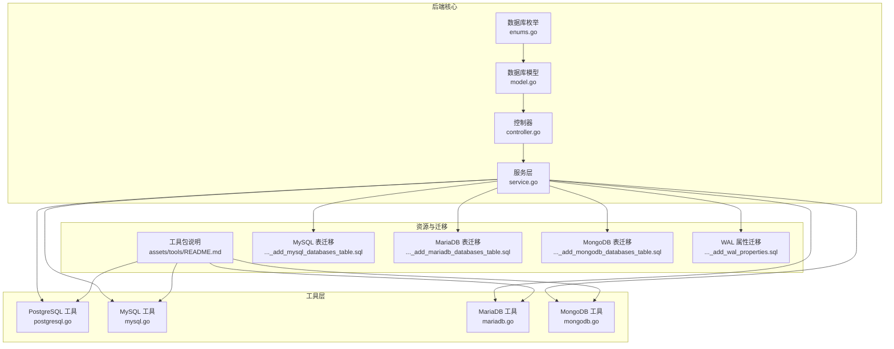
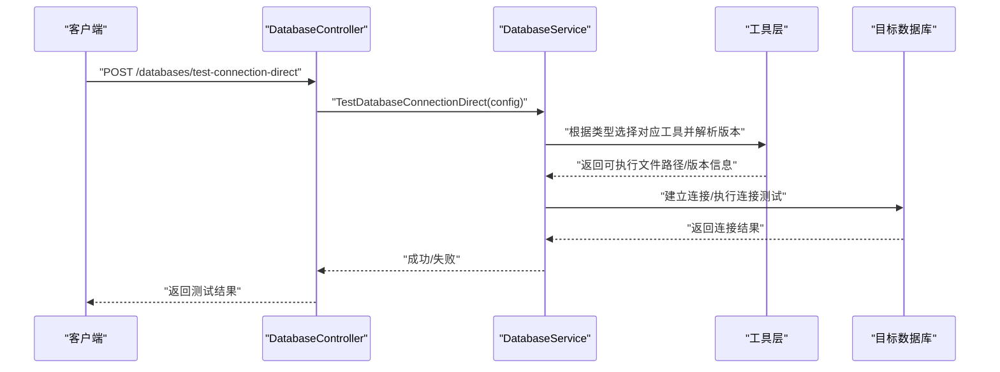
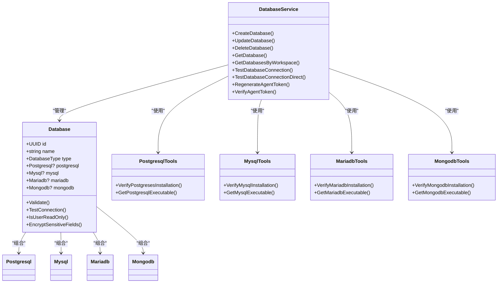

# 多数据库支持

<cite>
**本文引用的文件**
- [backend/internal/features/databases/enums.go](file://backend/internal/features/databases/enums.go)
- [backend/internal/features/databases/model.go](file://backend/internal/features/databases/model.go)
- [backend/internal/features/databases/controller.go](file://backend/internal/features/databases/controller.go)
- [backend/internal/features/databases/service.go](file://backend/internal/features/databases/service.go)
- [backend/internal/util/tools/postgresql.go](file://backend/internal/util/tools/postgresql.go)
- [backend/internal/util/tools/mysql.go](file://backend/internal/util/tools/mysql.go)
- [backend/internal/util/tools/mariadb.go](file://backend/internal/util/tools/mariadb.go)
- [backend/internal/util/tools/mongodb.go](file://backend/internal/util/tools/mongodb.go)
- [assets/tools/README.md](file://assets/tools/README.md)
- [backend/migrations/20251220104453_add_mysql_databases_table.sql](file://backend/migrations/20251220104453_add_mysql_databases_table.sql)
- [backend/migrations/20251221100000_add_mariadb_databases_table.sql](file://backend/migrations/20251221100000_add_mariadb_databases_table.sql)
- [backend/migrations/20251221195603_add_mongodb_databases_table.sql](file://backend/migrations/20251221195603_add_mongodb_databases_table.sql)
- [backend/migrations/20260306045548_add_wal_properties.sql](file://backend/migrations/20260306045548_add_wal_properties.sql)
</cite>

## 目录
1. [简介](#简介)
2. [项目结构](#项目结构)
3. [核心组件](#核心组件)
4. [架构总览](#架构总览)
5. [详细组件分析](#详细组件分析)
6. [依赖关系分析](#依赖关系分析)
7. [性能考虑](#性能考虑)
8. [故障排除指南](#故障排除指南)
9. [结论](#结论)
10. [附录](#附录)

## 简介
本文件系统性阐述 Databasus 的多数据库支持能力，覆盖 PostgreSQL（12-18）、MySQL（5.7-9）、MariaDB（10-12）、MongoDB（4-8）四大数据库类型的技术实现与使用方式。内容包括：
- 连接配置方法与版本兼容性
- 特定功能支持（PostgreSQL WAL 归档、MySQL binlog、MongoDB 副本集）
- 连接字符串示例与配置参数说明
- 数据库代理模式与远程连接模式的区别与适用场景
- 性能优化建议、故障排除与常见问题解决方案

## 项目结构
Databasus 在后端通过统一的数据库模型聚合多种数据库类型，并在工具层提供各数据库客户端工具的安装验证与路径解析，以确保备份与连接流程的稳定性。

**图表来源**
- [backend/internal/features/databases/enums.go:1-17](file://backend/internal/features/databases/enums.go#L1-L17)
- [backend/internal/features/databases/model.go:1-206](file://backend/internal/features/databases/model.go#L1-L206)
- [backend/internal/features/databases/controller.go:1-505](file://backend/internal/features/databases/controller.go#L1-L505)
- [backend/internal/features/databases/service.go:1-883](file://backend/internal/features/databases/service.go#L1-L883)
- [backend/internal/util/tools/postgresql.go:1-208](file://backend/internal/util/tools/postgresql.go#L1-L208)
- [backend/internal/util/tools/mysql.go:1-231](file://backend/internal/util/tools/mysql.go#L1-L231)
- [backend/internal/util/tools/mariadb.go:1-251](file://backend/internal/util/tools/mariadb.go#L1-L251)
- [backend/internal/util/tools/mongodb.go:1-179](file://backend/internal/util/tools/mongodb.go#L1-L179)
- [assets/tools/README.md](file://assets/tools/README.md)

**章节来源**
- [backend/internal/features/databases/enums.go:1-17](file://backend/internal/features/databases/enums.go#L1-L17)
- [backend/internal/features/databases/model.go:1-206](file://backend/internal/features/databases/model.go#L1-L206)
- [backend/internal/features/databases/controller.go:1-505](file://backend/internal/features/databases/controller.go#L1-L505)
- [backend/internal/features/databases/service.go:1-883](file://backend/internal/features/databases/service.go#L1-L883)
- [backend/internal/util/tools/postgresql.go:1-208](file://backend/internal/util/tools/postgresql.go#L1-L208)
- [backend/internal/util/tools/mysql.go:1-231](file://backend/internal/util/tools/mysql.go#L1-L231)
- [backend/internal/util/tools/mariadb.go:1-251](file://backend/internal/util/tools/mariadb.go#L1-L251)
- [backend/internal/util/tools/mongodb.go:1-179](file://backend/internal/util/tools/mongodb.go#L1-L179)
- [assets/tools/README.md](file://assets/tools/README.md)

## 核心组件
- 数据库类型枚举：定义 POSTGRES、MYSQL、MARIADB、MONGODB 四种类型，用于统一识别与路由。
- 数据库模型：聚合各数据库子模型（Postgresql/Mysql/Mariadb/Mongodb），并提供校验、连接测试、只读检测、敏感字段加密等通用行为。
- 控制器与服务：提供数据库的增删改查、连接测试、只读用户创建、代理令牌管理等接口与业务逻辑。
- 工具层：封装各数据库客户端工具的安装验证、可执行文件路径解析、版本映射与兼容处理。

**章节来源**
- [backend/internal/features/databases/enums.go:3-10](file://backend/internal/features/databases/enums.go#L3-L10)
- [backend/internal/features/databases/model.go:19-44](file://backend/internal/features/databases/model.go#L19-L44)
- [backend/internal/features/databases/controller.go:14-38](file://backend/internal/features/databases/controller.go#L14-L38)
- [backend/internal/features/databases/service.go:26-38](file://backend/internal/features/databases/service.go#L26-L38)

## 架构总览
Databasus 将不同数据库的配置抽象到统一的 Database 模型中，通过服务层根据类型分发到具体数据库实现；工具层负责在运行时定位对应版本的客户端工具，确保备份与连接操作的正确性。

**图表来源**
- [backend/internal/features/databases/controller.go:245-274](file://backend/internal/features/databases/controller.go#L245-L274)
- [backend/internal/features/databases/service.go:351-379](file://backend/internal/features/databases/service.go#L351-L379)
- [backend/internal/util/tools/postgresql.go:34-166](file://backend/internal/util/tools/postgresql.go#L34-L166)
- [backend/internal/util/tools/mysql.go:49-176](file://backend/internal/util/tools/mysql.go#L49-L176)
- [backend/internal/util/tools/mariadb.go:82-179](file://backend/internal/util/tools/mariadb.go#L82-L179)
- [backend/internal/util/tools/mongodb.go:49-126](file://backend/internal/util/tools/mongodb.go#L49-L126)

## 详细组件分析

### PostgreSQL 支持（12-18）
- 版本兼容性与工具验证
  - 工具层验证 PostgreSQL 12-18 各版本客户端工具（pg_dump、psql）是否可用，并在开发环境与生产环境采用不同的安装路径策略。
  - 在 Windows 开发环境下对 12、13 版本进行兼容性处理，避免管道恢复问题。
- 连接配置要点
  - 支持主机、端口、用户名、密码、数据库名、是否 HTTPS、包含模式列表、CPU 并行度等配置。
  - 支持 WAL 归档相关属性（见 WAL 属性迁移）。
- 特定功能
  - WAL 归档：通过 WAL 流式传输与归档机制实现增量备份与恢复。
  - 只读用户：可创建仅具备 SELECT 权限的只读用户，用于备份任务。
- 连接字符串示例（格式参考）
  - postgresql://用户名:密码@主机:端口/数据库?sslmode=disable
  - postgresql://用户名:密码@主机:端口/数据库?sslmode=require
- 配置参数说明
  - 主机/端口：数据库监听地址与端口
  - 用户名/密码：认证凭据（建议使用只读用户进行备份）
  - 数据库：默认连接数据库
  - SSL：是否启用 TLS（建议生产环境开启）
  - 包含模式：指定备份时包含的模式集合
  - CPU 并行度：控制备份并发度
- 性能优化建议
  - 提高 CPU 并行度以加速备份/恢复
  - 使用专用只读用户，避免影响主业务连接
  - 合理设置 WAL 归档与保留策略，平衡存储与恢复时间
- 故障排除
  - 若 pg_dump/psql 找不到，检查工具安装目录与版本映射
  - Windows 下优先使用 14+ 版本以规避管道问题
  - 确认 SSL 模式与证书配置

**章节来源**
- [backend/internal/util/tools/postgresql.go:34-166](file://backend/internal/util/tools/postgresql.go#L34-L166)
- [backend/migrations/20260306045548_add_wal_properties.sql](file://backend/migrations/20260306045548_add_wal_properties.sql)
- [backend/internal/features/databases/model.go:28-31](file://backend/internal/features/databases/model.go#L28-L31)

### MySQL 支持（5.7-9）
- 版本兼容性与工具验证
  - 工具层验证 MySQL 5.7、8.0、8.4、9 的客户端工具（mysqldump、mysql）可用性。
  - 不同版本的客户端工具路径不同，开发与生产环境分别处理。
- 连接配置要点
  - 支持主机、端口、用户名、密码、数据库名、是否 HTTPS 等配置。
- 特定功能
  - binlog：结合备份策略实现基于二进制日志的增量备份与点-in-time 恢复。
  - 只读用户：可创建具备最小权限的只读用户用于备份。
- 连接字符串示例（格式参考）
  - mysql://用户名:密码@tcp(主机:端口)/数据库
  - mysql://用户名:密码@tcp(主机:端口)/数据库?tls=skip-verify
- 配置参数说明
  - 主机/端口：数据库监听地址与端口
  - 用户名/密码：认证凭据
  - 数据库：默认连接数据库
  - TLS：跳过证书校验或启用严格校验（按需）
- 性能优化建议
  - 使用专用只读用户，避免阻塞主业务
  - 合理设置 binlog 保留周期与压缩策略
  - 选择合适版本的客户端工具以匹配服务器版本
- 故障排除
  - 若 mysqldump/mysql 找不到，检查对应版本安装路径
  - 备份版本高于恢复版本时需注意兼容性（工具层提供比较函数）

**章节来源**
- [backend/internal/util/tools/mysql.go:49-176](file://backend/internal/util/tools/mysql.go#L49-L176)
- [backend/internal/util/tools/mysql.go:178-190](file://backend/internal/util/tools/mysql.go#L178-L190)
- [backend/migrations/20251220104453_add_mysql_databases_table.sql](file://backend/migrations/20251220104453_add_mysql_databases_table.sql)

### MariaDB 支持（10-12）
- 版本兼容性与工具验证
  - 工具层区分“旧版”（10.6 客户端）与“新版”（12.1 客户端），针对 5.5、10.1 与 10.2+ 服务器分别选择兼容的客户端工具。
  - 验证 mariadb-dump、mariadb 可执行文件是否存在。
- 连接配置要点
  - 支持主机、端口、用户名、密码、数据库名、是否 HTTPS 等配置。
- 特定功能
  - 自动选择客户端版本：旧版服务器使用 10.6 客户端，新版本使用 12.1 客户端。
  - 只读用户：可创建具备最小权限的只读用户用于备份。
- 连接字符串示例（格式参考）
  - mysql://用户名:密码@tcp(主机:端口)/数据库
  - mysql://用户名:密码@tcp(主机:端口)/数据库?tls=skip-verify
- 配置参数说明
  - 主机/端口：数据库监听地址与端口
  - 用户名/密码：认证凭据
  - 数据库：默认连接数据库
  - TLS：跳过证书校验或启用严格校验
- 性能优化建议
  - 优先使用较新的 12.1 客户端以获得更好的查询与兼容性
  - 使用专用只读用户，减少对主业务的影响
- 故障排除
  - 若找不到 mariadb/mariadb-dump，检查对应客户端版本安装路径
  - 备份版本高于恢复版本时需注意兼容性（工具层提供比较函数）

**章节来源**
- [backend/internal/util/tools/mariadb.go:48-179](file://backend/internal/util/tools/mariadb.go#L48-L179)
- [backend/internal/util/tools/mariadb.go:181-200](file://backend/internal/util/tools/mariadb.go#L181-L200)
- [backend/migrations/20251221100000_add_mariadb_databases_table.sql](file://backend/migrations/20251221100000_add_mariadb_databases_table.sql)

### MongoDB 支持（4-8）
- 版本兼容性与工具验证
  - 工具层验证 MongoDB Database Tools（mongodump、mongorestore）可用性，单版本向后兼容所有服务器版本（4-8）。
- 连接配置要点
  - 支持主机、端口、用户名、密码、数据库名、认证数据库、是否 HTTPS、CPU 并行度等配置。
  - 支持 SRV 记录与直接连接模式（迁移中新增字段）。
- 特定功能
  - 副本集：可连接副本集节点，实现高可用备份与恢复。
  - 增量/全量备份：结合集合/数据库粒度进行备份。
- 连接字符串示例（格式参考）
  - mongodb://用户名:密码@主机:端口/数据库
  - mongodb://用户名:密码@主机:端口/数据库?replicaSet=rs0
  - mongodb://用户名:密码@主机:端口/数据库?directConnection=true
- 配置参数说明
  - 主机/端口：数据库监听地址与端口
  - 用户名/密码：认证凭据
  - 数据库：默认连接数据库
  - 认证数据库：用于认证的数据库（如 admin）
  - 副本集：连接副本集名称
  - 直连：是否直连单一节点
  - 并行度：控制备份并发度
- 性能优化建议
  - 使用副本集只读副本进行备份，避免影响主写入
  - 调整并行度与批大小以平衡吞吐与资源占用
- 故障排除
  - 若 mongodump/mongorestore 找不到，检查工具安装路径
  - 副本集连接失败时确认副本集名称与网络可达性

**章节来源**
- [backend/internal/util/tools/mongodb.go:49-126](file://backend/internal/util/tools/mongodb.go#L49-L126)
- [backend/migrations/20251221195603_add_mongodb_databases_table.sql](file://backend/migrations/20251221195603_add_mongodb_databases_table.sql)
- [backend/migrations/20260209125258_add_mongodb_srv_support.sql](file://backend/migrations/20260209125258_add_mongodb_srv_support.sql)
- [backend/migrations/20260221111333_add_mongodb_direct_connection.sql](file://backend/migrations/20260221111333_add_mongodb_direct_connection.sql)

### 数据库代理模式与远程连接模式
- 数据库代理模式
  - 由 Databasus Agent 在目标数据库所在主机上运行，直接调用对应数据库客户端工具（pg_dump、mysqldump、mariadb-dump、mongodump）执行备份与恢复。
  - 优势：无需在 Databasus 后端直接暴露数据库端口，安全性更高；可利用本地工具链与系统资源。
  - 适用场景：数据库位于受控内网、需要高安全性的环境。
- 远程连接模式
  - Databasus 后端直接通过网络连接数据库并调用客户端工具（或通过已安装的本地工具）执行备份与恢复。
  - 优势：部署灵活，适合跨网络的数据库管理。
  - 适用场景：数据库位于云上或跨地域，且网络与安全策略允许直接访问。
- 令牌验证
  - 服务层提供代理令牌生成与验证接口，确保 Agent 与后端通信的安全性。

**章节来源**
- [backend/internal/features/databases/controller.go:448-479](file://backend/internal/features/databases/controller.go#L448-L479)
- [backend/internal/features/databases/service.go:614-666](file://backend/internal/features/databases/service.go#L614-L666)

## 依赖关系分析
Databasus 的数据库模块采用“统一模型 + 类型分发”的设计，服务层根据数据库类型将请求分派至对应的子实现，并通过工具层完成客户端工具的路径解析与版本验证。

**图表来源**
- [backend/internal/features/databases/model.go:19-44](file://backend/internal/features/databases/model.go#L19-L44)
- [backend/internal/features/databases/service.go:69-116](file://backend/internal/features/databases/service.go#L69-L116)
- [backend/internal/util/tools/postgresql.go:34-166](file://backend/internal/util/tools/postgresql.go#L34-L166)
- [backend/internal/util/tools/mysql.go:49-176](file://backend/internal/util/tools/mysql.go#L49-L176)
- [backend/internal/util/tools/mariadb.go:82-179](file://backend/internal/util/tools/mariadb.go#L82-L179)
- [backend/internal/util/tools/mongodb.go:49-126](file://backend/internal/util/tools/mongodb.go#L49-L126)

**章节来源**
- [backend/internal/features/databases/model.go:19-44](file://backend/internal/features/databases/model.go#L19-L44)
- [backend/internal/features/databases/service.go:69-116](file://backend/internal/features/databases/service.go#L69-L116)
- [backend/internal/util/tools/postgresql.go:34-166](file://backend/internal/util/tools/postgresql.go#L34-L166)
- [backend/internal/util/tools/mysql.go:49-176](file://backend/internal/util/tools/mysql.go#L49-L176)
- [backend/internal/util/tools/mariadb.go:82-179](file://backend/internal/util/tools/mariadb.go#L82-L179)
- [backend/internal/util/tools/mongodb.go:49-126](file://backend/internal/util/tools/mongodb.go#L49-L126)

## 性能考虑
- 并行度与资源占用
  - PostgreSQL/MongoDB 支持 CPU 并行度配置，合理提升备份/恢复吞吐。
- 只读用户与锁竞争
  - 使用只读用户执行备份，降低对主业务的锁竞争与影响。
- 客户端工具版本选择
  - 选择与服务器兼容的最佳客户端版本，避免因版本差异导致的性能退化或失败。
- 网络与存储
  - 代理模式下优先在本地执行备份，减少网络带宽占用；远程模式下确保网络稳定与带宽充足。

[本节为通用指导，不直接分析具体文件]

## 故障排除指南
- 客户端工具缺失
  - 症状：pg_dump、mysqldump、mariadb-dump、mongodump 找不到
  - 处理：检查工具安装目录与版本映射；开发环境参考 assets/tools/README.md；生产环境确认系统路径
- 版本不兼容
  - 症状：备份版本高于恢复版本导致失败
  - 处理：使用工具层提供的版本比较函数判断并调整目标版本
- Windows 兼容性
  - 症状：Windows 下管道恢复异常
  - 处理：优先使用 PostgreSQL 14+ 或其他推荐版本
- 代理令牌无效
  - 症状：Agent 无法通过后端验证
  - 处理：重新生成代理令牌并确保传输过程中的安全性

**章节来源**
- [backend/internal/util/tools/postgresql.go:34-166](file://backend/internal/util/tools/postgresql.go#L34-L166)
- [backend/internal/util/tools/mysql.go:178-190](file://backend/internal/util/tools/mysql.go#L178-L190)
- [backend/internal/util/tools/mariadb.go:181-200](file://backend/internal/util/tools/mariadb.go#L181-L200)
- [backend/internal/util/tools/mongodb.go:128-141](file://backend/internal/util/tools/mongodb.go#L128-L141)
- [backend/internal/features/databases/service.go:614-666](file://backend/internal/features/databases/service.go#L614-L666)

## 结论
Databasus 通过统一的数据库模型与类型分发机制，结合工具层对各数据库客户端工具的版本验证与路径解析，实现了对 PostgreSQL（12-18）、MySQL（5.7-9）、MariaDB（10-12）、MongoDB（4-8）的全面支持。配合代理模式与远程连接模式，既能满足高安全性的内部部署需求，也能灵活适配跨网络的数据库管理场景。通过合理的配置与性能优化，可显著提升备份与恢复效率与稳定性。

[本节为总结性内容，不直接分析具体文件]

## 附录
- 连接字符串格式参考
  - PostgreSQL：postgresql://用户名:密码@主机:端口/数据库?sslmode=disable|require
  - MySQL：mysql://用户名:密码@tcp(主机:端口)/数据库?tls=skip-verify
  - MariaDB：mysql://用户名:密码@tcp(主机:端口)/数据库
  - MongoDB：mongodb://用户名:密码@主机:端口/数据库?replicaSet=rs0&directConnection=true
- 关键迁移文件
  - MySQL 表迁移：添加 MySQL 数据库表结构
  - MariaDB 表迁移：添加 MariaDB 数据库表结构
  - MongoDB 表迁移：添加 MongoDB 数据库表结构
  - WAL 属性迁移：新增 WAL 相关属性支持

**章节来源**
- [backend/migrations/20251220104453_add_mysql_databases_table.sql](file://backend/migrations/20251220104453_add_mysql_databases_table.sql)
- [backend/migrations/20251221100000_add_mariadb_databases_table.sql](file://backend/migrations/20251221100000_add_mariadb_databases_table.sql)
- [backend/migrations/20251221195603_add_mongodb_databases_table.sql](file://backend/migrations/20251221195603_add_mongodb_databases_table.sql)
- [backend/migrations/20260306045548_add_wal_properties.sql](file://backend/migrations/20260306045548_add_wal_properties.sql)