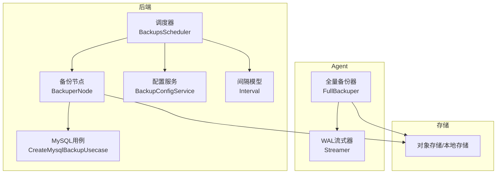
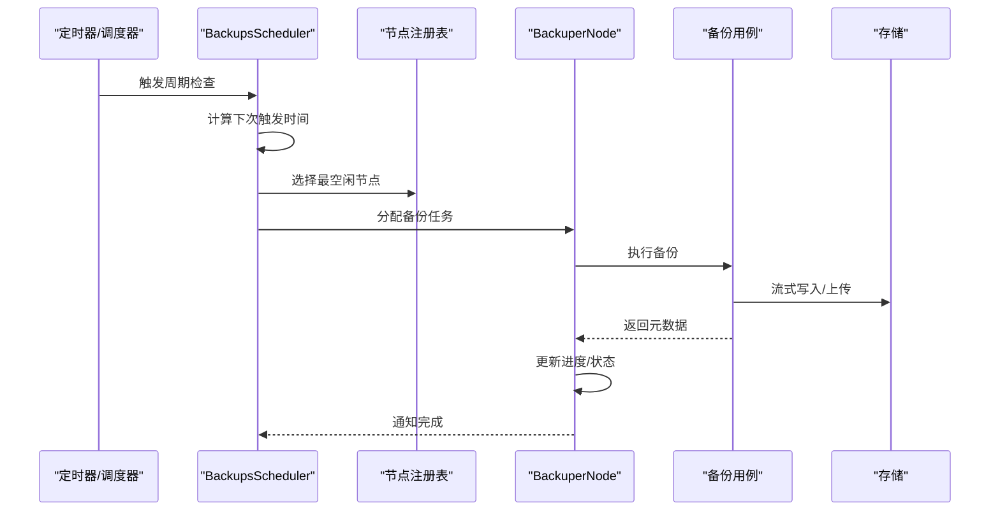
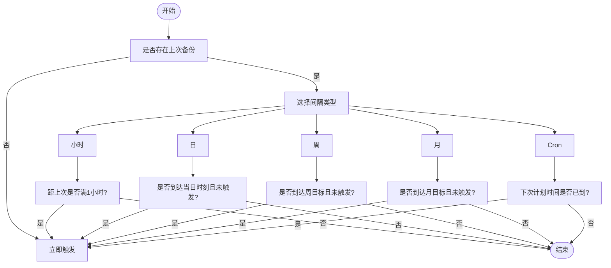
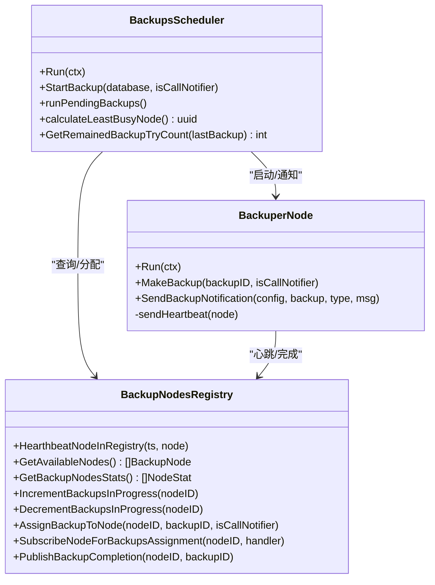
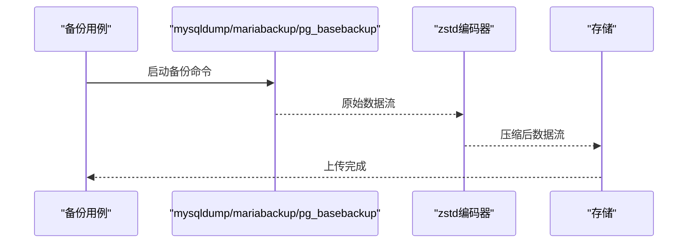
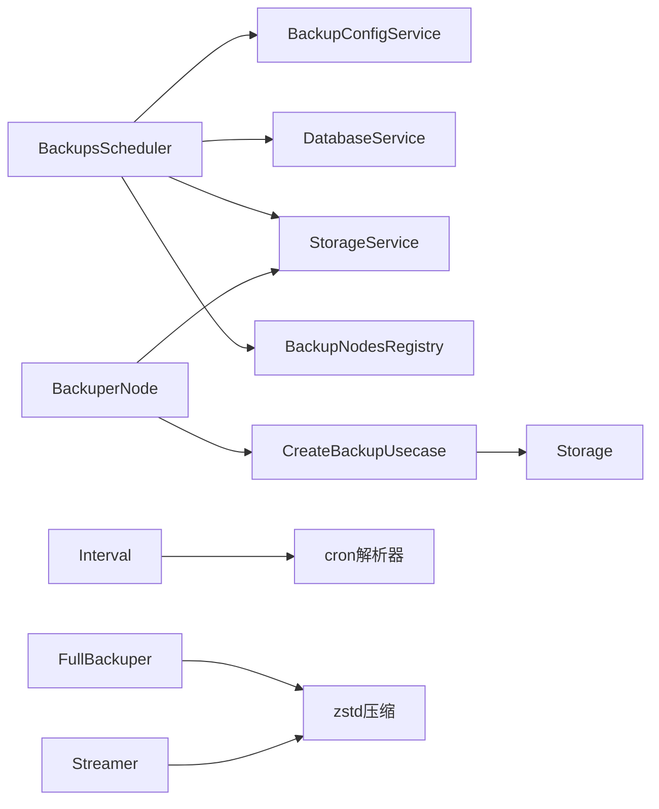

# 智能调度备份

<cite>
**本文档引用的文件**
- [scheduler.go](file://backend/internal/features/backups/backups/backuping/scheduler.go)
- [backuper.go](file://backend/internal/features/backups/backups/backuping/backuper.go)
- [model.go](file://backend/internal/features/intervals/model.go)
- [enums.go](file://backend/internal/features/intervals/enums.go)
- [service.go](file://backend/internal/features/backups/config/service.go)
- [model.go](file://backend/internal/features/backups/config/model.go)
- [backuper.go](file://agent/internal/features/full_backup/backuper.go)
- [streamer.go](file://agent/internal/features/wal/streamer.go)
- [create_backup_uc.go](file://backend/internal/features/backups/backups/usecases/mysql/create_backup_uc.go)
- [di.go](file://backend/internal/features/backups/backups/backuping/di.go)
- [scheduler_test.go](file://backend/internal/features/backups/backups/backuping/scheduler_test.go)
- [testing.go](file://backend/internal/features/backups/backups/backuping/testing.go)
- [20260311094356_add_is_zstd_supported_to_mysql.sql](file://backend/migrations/20260311094356_add_is_zstd_supported_to_mysql.sql)
</cite>

## 目录
1. [简介](#简介)
2. [项目结构](#项目结构)
3. [核心组件](#核心组件)
4. [架构总览](#架构总览)
5. [详细组件分析](#详细组件分析)
6. [依赖分析](#依赖分析)
7. [性能考虑](#性能考虑)
8. [故障排查指南](#故障排查指南)
9. [结论](#结论)
10. [附录](#附录)

## 简介
本文件面向Databasus的智能调度备份功能，系统性阐述备份调度与执行引擎的设计与实现，覆盖小时、日、周、月及cron表达式等多维度调度策略；详述备份执行引擎的任务队列管理、并发控制与资源分配；解析智能压缩算法（zstd）在不同数据库类型中的应用与性能影响；提供可操作的调度配置示例与最佳实践；并给出备份执行监控、进度跟踪与失败重试机制的技术细节。

## 项目结构
Databasus采用前后端分离与多节点协作的架构：
- 后端负责调度、配置、通知、存储元数据管理与任务编排；
- 前端提供可视化配置界面；
- Agent负责数据库侧的全量备份与WAL流式传输，支持zstd压缩；
- 数据库侧通过usecase层调用mysqldump/mariabackup/pg_basebackup等工具进行实际备份。

图表来源
- [scheduler.go:42-94](file://backend/internal/features/backups/backups/backuping/scheduler.go#L42-L94)
- [backuper.go:51-116](file://backend/internal/features/backups/backups/backuping/backuper.go#L51-L116)
- [service.go:17-25](file://backend/internal/features/backups/config/service.go#L17-L25)
- [model.go:12-23](file://backend/internal/features/intervals/model.go#L12-L23)
- [backuper.go:46-52](file://agent/internal/features/full_backup/backuper.go#L46-L52)
- [streamer.go:175-204](file://agent/internal/features/wal/streamer.go#L175-L204)

章节来源
- [scheduler.go:1-94](file://backend/internal/features/backups/backups/backuping/scheduler.go#L1-L94)
- [backuper.go:1-116](file://backend/internal/features/backups/backups/backuping/backuper.go#L1-L116)
- [service.go:1-32](file://backend/internal/features/backups/config/service.go#L1-L32)
- [model.go:1-376](file://backend/internal/features/intervals/model.go#L1-L376)
- [backuper.go:1-83](file://agent/internal/features/full_backup/backuper.go#L1-L83)
- [streamer.go:173-204](file://agent/internal/features/wal/streamer.go#L173-L204)

## 核心组件
- 调度器（BackupsScheduler）
  - 定时扫描启用的备份配置，基于间隔模型判断是否触发备份；
  - 选择最空闲节点执行备份，维护节点活跃任务计数；
  - 处理节点健康检查、死节点回退与失败重试逻辑。
- 备份节点（BackuperNode）
  - 接收调度器分配的备份任务，执行具体备份流程；
  - 进度上报与状态持久化，失败/取消处理与清理；
  - 发送通知（成功/失败）。
- 间隔模型（Interval）
  - 支持小时、日、周、月、cron五种调度类型；
  - 提供触发判断与下一次触发时间计算。
- 配置服务（BackupConfigService）
  - 统一保存/查询备份配置，权限校验与默认配置初始化；
  - 存储变更监听与工作区迁移支持。
- Agent全量备份器（FullBackuper）
  - 周期检查WAL链有效性与计划时间，触发pg_basebackup；
  - 流式zstd压缩上传，错误重试与超时控制。
- WAL流式器（Streamer）
  - 对单个WAL文件进行zstd压缩并流式上传。

章节来源
- [scheduler.go:25-40](file://backend/internal/features/backups/backups/backuping/scheduler.go#L25-L40)
- [backuper.go:32-49](file://backend/internal/features/backups/backups/backuping/backuper.go#L32-L49)
- [model.go:12-23](file://backend/internal/features/intervals/model.go#L12-L23)
- [service.go:17-25](file://backend/internal/features/backups/config/service.go#L17-L25)
- [backuper.go:46-52](file://agent/internal/features/full_backup/backuper.go#L46-L52)
- [streamer.go:175-204](file://agent/internal/features/wal/streamer.go#L175-L204)

## 架构总览
调度与执行分层清晰：后端调度器负责“何时”与“分派”，备份节点负责“如何”执行，Agent负责“数据库侧”的全量与增量备份，存储负责“落盘”。

图表来源
- [scheduler.go:320-397](file://backend/internal/features/backups/backups/backuping/scheduler.go#L320-L397)
- [backuper.go:122-179](file://backend/internal/features/backups/backups/backuping/backuper.go#L122-L179)

## 详细组件分析

### 调度系统（小时/日/周/月/cron）
- 间隔模型定义了五类调度类型，分别对应不同的参数约束与触发逻辑：
  - 小时：固定每小时触发；
  - 日：指定每日时刻，若错过则补；
  - 周：指定星期几与时刻；
  - 月：指定每月几号与时刻；
  - Cron：使用标准cron表达式解析器，按上次备份之后的下一个时间点判断。
- 触发条件：
  - 若从未备份过，立即触发；
  - 否则根据间隔类型与上次备份时间比较决定是否触发；
  - cron模式通过解析器计算“上次备份之后的下一个时间点”并与当前时间比较。

图表来源
- [model.go:59-112](file://backend/internal/features/intervals/model.go#L59-L112)
- [model.go:126-273](file://backend/internal/features/intervals/model.go#L126-L273)

章节来源
- [model.go:12-57](file://backend/internal/features/intervals/model.go#L12-L57)
- [model.go:59-112](file://backend/internal/features/intervals/model.go#L59-L112)
- [model.go:126-273](file://backend/internal/features/intervals/model.go#L126-L273)
- [enums.go:3-11](file://backend/internal/features/intervals/enums.go#L3-L11)

### 备份执行引擎（任务队列、并发控制、资源分配）
- 任务队列与并发控制
  - 调度器维护每个节点的“进行中备份计数”，选择“活跃任务/吞吐量”得分最低的节点；
  - 节点注册表记录心跳、活跃任务数与吞吐量，用于动态负载均衡。
- 资源分配
  - 节点通过订阅机制接收备份任务，执行期间定期发送心跳；
  - 调度器在节点异常或重启时，回退其未完成任务并标记失败。
- 失败重试
  - 调度器根据配置决定失败重试次数与剩余尝试次数；
  - 支持订阅状态限制云环境下的备份额度。

图表来源
- [scheduler.go:25-40](file://backend/internal/features/backups/backups/backuping/scheduler.go#L25-L40)
- [backuper.go:32-49](file://backend/internal/features/backups/backups/backuping/backuper.go#L32-L49)
- [di.go:39-96](file://backend/internal/features/backups/backups/backuping/di.go#L39-L96)

章节来源
- [scheduler.go:42-94](file://backend/internal/features/backups/backups/backuping/scheduler.go#L42-L94)
- [scheduler.go:111-269](file://backend/internal/features/backups/backups/backuping/scheduler.go#L111-L269)
- [scheduler.go:320-397](file://backend/internal/features/backups/backups/backuping/scheduler.go#L320-L397)
- [scheduler.go:442-488](file://backend/internal/features/backups/backups/backuping/scheduler.go#L442-L488)
- [backuper.go:51-116](file://backend/internal/features/backups/backups/backuping/backuper.go#L51-L116)
- [backuper.go:122-179](file://backend/internal/features/backups/backups/backuping/backuper.go#L122-L179)
- [backuper.go:218-281](file://backend/internal/features/backups/backups/backuping/backuper.go#L218-L281)
- [di.go:39-96](file://backend/internal/features/backups/backups/backuping/di.go#L39-L96)

### 智能压缩算法（zstd）
- MySQL压缩策略
  - 当数据库版本支持zstd时，优先使用zstd压缩并设置压缩等级；
  - 否则回退到传统压缩选项。
- PostgreSQL Agent压缩策略
  - 全量备份与WAL流式均采用zstd压缩，编码器参数包含压缩等级与CRC校验；
  - 通过管道直接从备份命令输出流式压缩并上传，降低中间文件开销。
- 性能与存储影响
  - zstd在CPU与压缩比之间提供良好平衡，适合高吞吐场景；
  - 通过编码器参数可微调压缩速度与质量，满足不同SLA需求。

图表来源
- [create_backup_uc.go:148-161](file://backend/internal/features/backups/backups/usecases/mysql/create_backup_uc.go#L148-L161)
- [backuper.go:247-269](file://agent/internal/features/full_backup/backuper.go#L247-L269)
- [streamer.go:175-204](file://agent/internal/features/wal/streamer.go#L175-L204)

章节来源
- [create_backup_uc.go:148-161](file://backend/internal/features/backups/backups/usecases/mysql/create_backup_uc.go#L148-L161)
- [backuper.go:247-269](file://agent/internal/features/full_backup/backuper.go#L247-L269)
- [streamer.go:175-204](file://agent/internal/features/wal/streamer.go#L175-L204)
- [20260311094356_add_is_zstd_supported_to_mysql.sql:1-11](file://backend/migrations/20260311094356_add_is_zstd_supported_to_mysql.sql#L1-L11)

### 备份配置与调度示例
- 默认配置
  - 新建数据库默认启用备份，每日04:00执行，保留策略为3个月，失败自动重试最多3次。
- 复杂cron表达式
  - 示例：每周一凌晨3点、每月1号与15号上午4:30、每6小时执行一次等；
  - 表达式需符合分钟/小时/日/月/周格式，解析器会验证合法性。
- 时间窗口选择策略
  - 避开业务高峰期；
  - 考虑网络带宽与存储IO峰值；
  - 对于大库建议分时段错峰或使用zstd提升压缩效率。

章节来源
- [service.go:299-323](file://backend/internal/features/backups/config/service.go#L299-L323)
- [model.go:46-54](file://backend/internal/features/intervals/model.go#L46-L54)
- [model.go:368-375](file://backend/internal/features/intervals/model.go#L368-L375)
- [model_test.go:460-596](file://backend/internal/features/intervals/model_test.go#L460-L596)

### 备份执行监控、进度跟踪与失败重试
- 进度跟踪
  - 节点在执行过程中回调进度监听器，实时更新备份大小与耗时；
  - 后端持久化进度，前端可轮询展示。
- 失败重试
  - 调度器统计最近N次失败次数，若允许重试且仍有剩余次数则再次触发；
  - 云环境订阅状态不满足时直接标记失败并跳过。
- 取消与清理
  - 用户/系统取消时，标记为取消并清理部分上传文件；
  - 正常完成后更新数据库最后备份时间并发送通知。

章节来源
- [backuper.go:160-169](file://backend/internal/features/backups/backups/backuping/backuper.go#L160-L169)
- [backuper.go:218-281](file://backend/internal/features/backups/backups/backuping/backuper.go#L218-L281)
- [scheduler.go:275-318](file://backend/internal/features/backups/backups/backuping/scheduler.go#L275-L318)
- [scheduler_test.go:1020-1063](file://backend/internal/features/backups/backups/backuping/scheduler_test.go#L1020-L1063)
- [testing.go:286-307](file://backend/internal/features/backups/backups/backuping/testing.go#L286-L307)

## 依赖分析
- 组件耦合
  - 调度器依赖配置服务、数据库服务、存储服务与节点注册表；
  - 备份节点依赖用例层与存储服务，向上通过注册表发布完成事件；
  - 间隔模型独立于具体数据库类型，便于扩展。
- 外部依赖
  - cron解析器用于cron表达式；
  - zstd压缩库用于高效压缩；
  - 存储服务抽象支持多种后端。

图表来源
- [scheduler.go:25-40](file://backend/internal/features/backups/backups/backuping/scheduler.go#L25-L40)
- [backuper.go:32-49](file://backend/internal/features/backups/backups/backuping/backuper.go#L32-L49)
- [model.go:262-266](file://backend/internal/features/intervals/model.go#L262-L266)
- [backuper.go:15-19](file://agent/internal/features/full_backup/backuper.go#L15-L19)
- [streamer.go](file://agent/internal/features/wal/streamer.go#L15)

## 性能考虑
- 并发与负载均衡
  - 基于“活跃任务/吞吐量”评分选择节点，避免热点节点过载；
  - 心跳与健康检查确保快速发现死节点并回退任务。
- 压缩与网络
  - zstd在CPU与压缩比间折中，适合高带宽网络；
  - 流式压缩减少内存占用与中间文件。
- 存储与保留策略
  - 支持按时间、数量与GFS策略保留，结合压缩可显著节省空间。

## 故障排查指南
- 调度器无备份触发
  - 检查备份配置是否启用、间隔参数是否合法；
  - 查看“下次触发时间”计算结果与当前时间对比。
- 节点无响应
  - 检查心跳是否持续更新；
  - 确认节点订阅是否正常，注册表中是否存在该节点。
- 备份失败
  - 查看失败消息与错误码，区分用户取消与系统错误；
  - 检查存储可用性与网络超时设置。
- 重试无效
  - 确认剩余重试次数与配置最大重试数；
  - 云环境检查订阅状态。

章节来源
- [scheduler.go:551-633](file://backend/internal/features/backups/backups/backuping/scheduler.go#L551-L633)
- [backuper.go:218-281](file://backend/internal/features/backups/backups/backuping/backuper.go#L218-L281)
- [scheduler_test.go:1129-1171](file://backend/internal/features/backups/backups/backuping/scheduler_test.go#L1129-L1171)

## 结论
Databasus的智能调度备份以“间隔模型+节点注册表+流式压缩”为核心，实现了灵活、可扩展、可观测的备份体系。通过合理的调度策略、并发控制与压缩优化，可在保证可靠性的同时最大化资源利用率与存储效率。建议在生产环境中结合业务高峰与网络状况制定时间窗口，并充分利用重试与通知机制提升运维效率。

## 附录
- 关键路径参考
  - 调度主循环与触发逻辑：[scheduler.go:42-94](file://backend/internal/features/backups/backups/backuping/scheduler.go#L42-L94)，[scheduler.go:320-397](file://backend/internal/features/backups/backups/backuping/scheduler.go#L320-L397)
  - 节点执行与通知：[backuper.go:122-179](file://backend/internal/features/backups/backups/backuping/backuper.go#L122-L179)，[backuper.go:362-434](file://backend/internal/features/backups/backups/backuping/backuper.go#L362-L434)
  - 间隔模型与cron解析：[model.go:59-112](file://backend/internal/features/intervals/model.go#L59-L112)，[model.go:256-273](file://backend/internal/features/intervals/model.go#L256-L273)
  - MySQL压缩策略：[create_backup_uc.go:148-161](file://backend/internal/features/backups/backups/usecases/mysql/create_backup_uc.go#L148-L161)
  - Agent压缩与上传：[backuper.go:247-269](file://agent/internal/features/full_backup/backuper.go#L247-L269)，[streamer.go:175-204](file://agent/internal/features/wal/streamer.go#L175-L204)