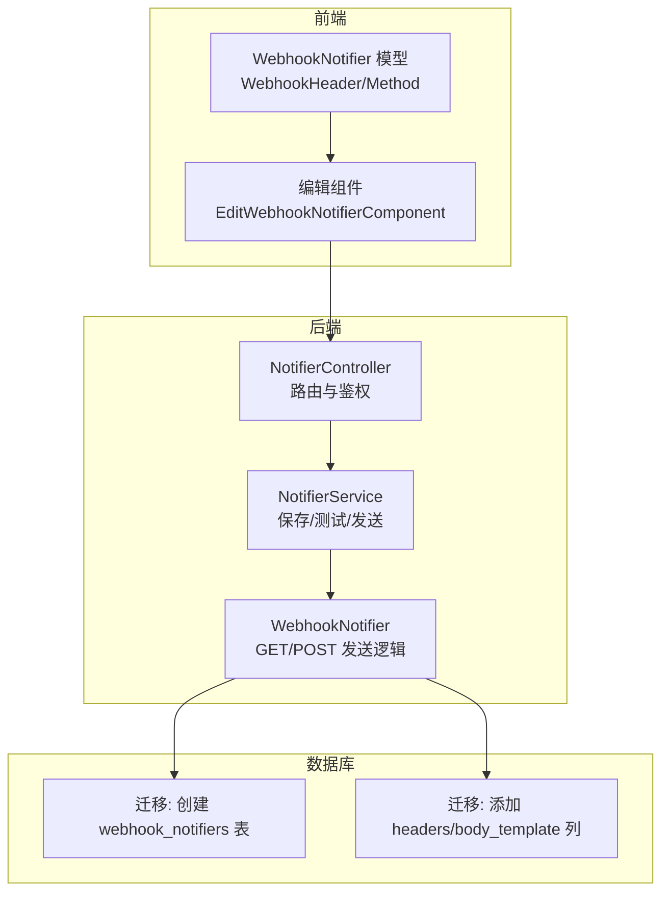
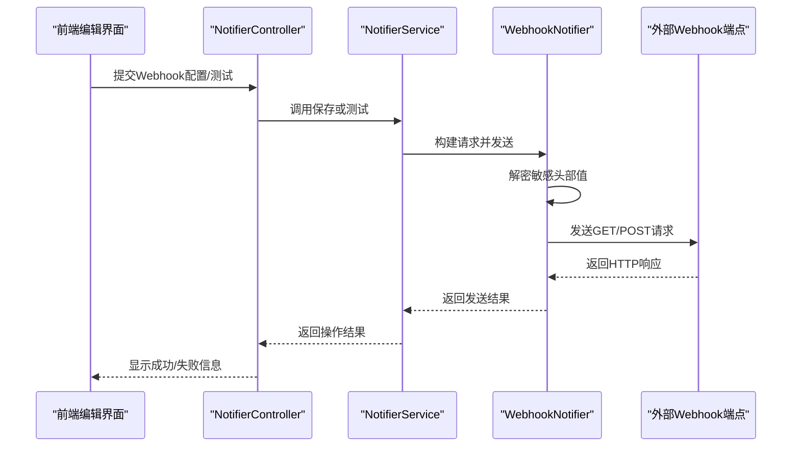
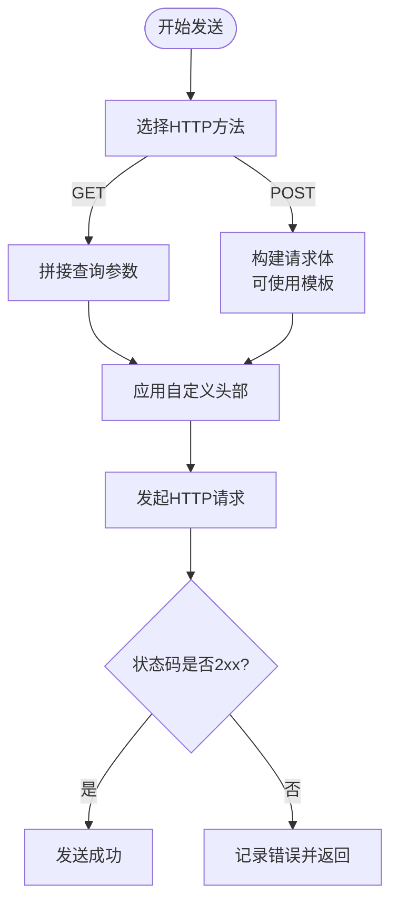
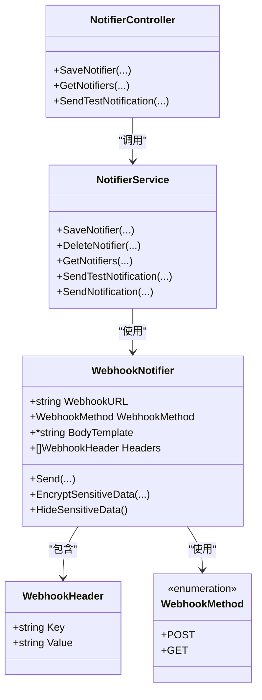

# Webhook通知

<cite>
**本文引用的文件**
- [model.go](file://backend/internal/features/notifiers/models/webhook/model.go)
- [enums.go](file://backend/internal/features/notifiers/models/webhook/enums.go)
- [controller.go](file://backend/internal/features/notifiers/controller.go)
- [service.go](file://backend/internal/features/notifiers/service.go)
- [20250618203654_create_webhook_notifiers.sql](file://backend/migrations/20250618203654_create_webhook_notifiers.sql)
- [20251128120000_add_webhook_headers_and_body_template.sql](file://backend/migrations/20251128120000_add_webhook_headers_and_body_template.sql)
- [WebhookNotifier.ts](file://frontend/src/entity/notifiers/models/webhook/WebhookNotifier.ts)
- [WebhookHeader.ts](file://frontend/src/entity/notifiers/models/webhook/WebhookHeader.ts)
- [WebhookMethod.ts](file://frontend/src/entity/notifiers/models/webhook/WebhookMethod.ts)
- [EditWebhookNotifierComponent.tsx](file://frontend/src/features/notifiers/ui/edit/notifiers/EditWebhookNotifierComponent.tsx)
</cite>

## 目录
1. [简介](#简介)
2. [项目结构](#项目结构)
3. [核心组件](#核心组件)
4. [架构总览](#架构总览)
5. [详细组件分析](#详细组件分析)
6. [依赖关系分析](#依赖关系分析)
7. [性能考虑](#性能考虑)
8. [故障排除指南](#故障排除指南)
9. [结论](#结论)
10. [附录](#附录)

## 简介
本文件面向Databasus的Webhook通知功能，提供从配置到执行、从安全到排错的完整说明。内容涵盖：
- HTTP请求配置：URL设置、请求方法（GET/POST）、请求头自定义
- 认证机制：Bearer Token、Basic Auth、自定义Headers
- 请求体模板系统：支持JSON占位符与默认结构
- 重试机制、超时配置、最大重试次数：当前实现未内置重试与超时控制
- 安全最佳实践：Webhook签名验证、HTTPS配置、证书管理
- 请求日志记录、错误处理与调试工具使用

## 项目结构
Webhook通知功能由后端模型与服务层、前端模型与UI组件以及数据库迁移共同组成。关键位置如下：
- 后端模型与逻辑：backend/internal/features/notifiers/models/webhook
- 后端控制器与服务：backend/internal/features/notifiers
- 前端模型与编辑界面：frontend/src/entity/notifiers/models/webhook 与 EditWebhookNotifierComponent.tsx
- 数据库迁移：backend/migrations 下的 webhook_notifiers 表结构变更

图表来源
- [controller.go:19-27](file://backend/internal/features/notifiers/controller.go#L19-L27)
- [service.go:15-22](file://backend/internal/features/notifiers/service.go#L15-L22)
- [model.go:30-42](file://backend/internal/features/notifiers/models/webhook/model.go#L30-L42)
- [20250618203654_create_webhook_notifiers.sql:4-15](file://backend/migrations/20250618203654_create_webhook_notifiers.sql#L4-L15)
- [20251128120000_add_webhook_headers_and_body_template.sql:4-6](file://backend/migrations/20251128120000_add_webhook_headers_and_body_template.sql#L4-L6)

章节来源
- [controller.go:1-335](file://backend/internal/features/notifiers/controller.go#L1-L335)
- [service.go:1-396](file://backend/internal/features/notifiers/service.go#L1-L396)
- [model.go:1-278](file://backend/internal/features/notifiers/models/webhook/model.go#L1-L278)
- [20250618203654_create_webhook_notifiers.sql:1-25](file://backend/migrations/20250618203654_create_webhook_notifiers.sql#L1-L25)
- [20251128120000_add_webhook_headers_and_body_template.sql:1-19](file://backend/migrations/20251128120000_add_webhook_headers_and_body_template.sql#L1-L19)

## 核心组件
- WebhookNotifier模型：负责构建HTTP请求、应用自定义头部、发送GET/POST请求、处理响应状态码、加密/解密敏感头部值。
- WebhookMethod枚举：限定可用的HTTP方法（GET/POST）。
- NotifierController：提供Webhook通知器的CRUD与测试接口，包含JWT鉴权与工作区权限校验。
- NotifierService：封装保存、删除、查询、测试与实际发送通知的业务流程，包含审计日志与错误持久化。
- 前端模型：WebhookNotifier、WebhookHeader、WebhookMethod；编辑组件提供URL、方法、自定义头部与请求体模板的输入界面。

章节来源
- [model.go:21-42](file://backend/internal/features/notifiers/models/webhook/model.go#L21-L42)
- [enums.go:3-8](file://backend/internal/features/notifiers/models/webhook/enums.go#L3-L8)
- [controller.go:19-27](file://backend/internal/features/notifiers/controller.go#L19-L27)
- [service.go:15-22](file://backend/internal/features/notifiers/service.go#L15-L22)
- [WebhookNotifier.ts:4-9](file://frontend/src/entity/notifiers/models/webhook/WebhookNotifier.ts#L4-L9)
- [WebhookHeader.ts:1-5](file://frontend/src/entity/notifiers/models/webhook/WebhookHeader.ts#L1-L5)
- [WebhookMethod.ts:1-5](file://frontend/src/entity/notifiers/models/webhook/WebhookMethod.ts#L1-L5)

## 架构总览
Webhook通知的调用链路如下：

图表来源
- [controller.go:42-70](file://backend/internal/features/notifiers/controller.go#L42-L70)
- [service.go:209-237](file://backend/internal/features/notifiers/service.go#L209-L237)
- [model.go:95-113](file://backend/internal/features/notifiers/models/webhook/model.go#L95-L113)

## 详细组件分析

### WebhookNotifier模型与发送逻辑
- 支持的HTTP方法：GET/POST（通过WebhookMethod枚举限定）
- GET请求：将heading/message作为查询参数附加到URL
- POST请求：构建请求体，若未显式设置Content-Type则默认application/json
- 自定义头部：通过Headers字段传入，发送前会解密敏感值
- 错误处理：对非2xx状态码返回错误，包含响应体便于调试
- 请求体模板：支持自定义body_template，内部以{{heading}}与{{message}}占位符替换

图表来源
- [model.go:105-113](file://backend/internal/features/notifiers/models/webhook/model.go#L105-L113)
- [model.go:143-179](file://backend/internal/features/notifiers/models/webhook/model.go#L143-L179)
- [model.go:181-226](file://backend/internal/features/notifiers/models/webhook/model.go#L181-L226)
- [model.go:228-243](file://backend/internal/features/notifiers/models/webhook/model.go#L228-L243)

章节来源
- [model.go:95-278](file://backend/internal/features/notifiers/models/webhook/model.go#L95-L278)
- [enums.go:3-8](file://backend/internal/features/notifiers/models/webhook/enums.go#L3-L8)

### NotifierController与权限控制
- 提供保存、查询、删除、测试、转移等接口
- 使用JWT鉴权与工作区访问权限校验
- 测试接口支持直接传入Notifier对象进行快速验证

章节来源
- [controller.go:19-335](file://backend/internal/features/notifiers/controller.go#L19-L335)

### NotifierService业务流程
- 保存/更新：加密敏感头部值、校验配置、写入审计日志
- 删除：检查是否被数据库绑定，避免误删
- 测试：调用WebhookNotifier.Send发送测试消息
- 实际发送：截断过长消息，捕获错误并持久化LastSendError

章节来源
- [service.go:30-113](file://backend/internal/features/notifiers/service.go#L30-L113)
- [service.go:115-154](file://backend/internal/features/notifiers/service.go#L115-L154)
- [service.go:209-237](file://backend/internal/features/notifiers/service.go#L209-L237)
- [service.go:276-308](file://backend/internal/features/notifiers/service.go#L276-L308)

### 前端模型与编辑界面
- WebhookNotifier：包含webhookUrl、webhookMethod、bodyTemplate、headers
- WebhookHeader：key/value键值对
- WebhookMethod：POST/GET枚举
- 编辑组件：提供URL输入、方法选择、自定义头部与模板输入

章节来源
- [WebhookNotifier.ts:4-9](file://frontend/src/entity/notifiers/models/webhook/WebhookNotifier.ts#L4-L9)
- [WebhookHeader.ts:1-5](file://frontend/src/entity/notifiers/models/webhook/WebhookHeader.ts#L1-L5)
- [WebhookMethod.ts:1-5](file://frontend/src/entity/notifiers/models/webhook/WebhookMethod.ts#L1-L5)
- [EditWebhookNotifierComponent.tsx:76-109](file://frontend/src/features/notifiers/ui/edit/notifiers/EditWebhookNotifierComponent.tsx#L76-L109)

### 数据库模式与迁移
- 初始表：webhook_notifiers（notifier_id主键、webhook_url、webhook_method）
- 迁移增强：添加headers（默认空数组）与body_template列，支持自定义头部与请求体模板

章节来源
- [20250618203654_create_webhook_notifiers.sql:4-15](file://backend/migrations/20250618203654_create_webhook_notifiers.sql#L4-L15)
- [20251128120000_add_webhook_headers_and_body_template.sql:4-6](file://backend/migrations/20251128120000_add_webhook_headers_and_body_template.sql#L4-L6)

## 依赖关系分析
- WebhookNotifier依赖加密模块进行敏感头部值的加密/解密
- NotifierService依赖工作区服务、审计日志服务与字段加密器
- 前端编辑组件依赖Webhook模型与方法枚举

图表来源
- [model.go:21-42](file://backend/internal/features/notifiers/models/webhook/model.go#L21-L42)
- [service.go:15-22](file://backend/internal/features/notifiers/service.go#L15-L22)
- [controller.go:14-17](file://backend/internal/features/notifiers/controller.go#L14-L17)
- [enums.go:3-8](file://backend/internal/features/notifiers/models/webhook/enums.go#L3-L8)

章节来源
- [model.go:1-278](file://backend/internal/features/notifiers/models/webhook/model.go#L1-L278)
- [service.go:1-396](file://backend/internal/features/notifiers/service.go#L1-L396)
- [controller.go:1-335](file://backend/internal/features/notifiers/controller.go#L1-L335)
- [enums.go:1-9](file://backend/internal/features/notifiers/models/webhook/enums.go#L1-L9)

## 性能考虑
- 当前实现未内置重试与超时配置，建议在部署环境通过反向代理或网关层增加：
  - 连接超时与读取超时
  - 指数退避重试策略
  - 最大重试次数限制
- 对于高并发场景，建议：
  - 将Webhook发送异步化（队列/后台任务）
  - 控制每秒请求数，避免触发目标端限流
  - 对长消息进行分片或压缩（如适用）

## 故障排除指南
- 常见问题与定位步骤
  - 无法连接外部Webhook端点：检查URL、网络连通性、防火墙与代理
  - 4xx/5xx响应：查看后端返回的响应体，确认目标端点期望的头部与请求体格式
  - 头部值为空：确认敏感头部值是否正确加密/解密
  - 测试失败：使用“直接测试”接口快速验证配置
- 日志与审计
  - 后端使用slog记录响应体关闭错误等细节
  - 发送失败会持久化LastSendError，可在查询通知器时查看
- 调试建议
  - 使用本地Mock服务器验证请求格式与头部
  - 在开发环境开启详细日志级别
  - 对比不同方法（GET/POST）与不同头部组合的行为差异

章节来源
- [model.go:163-178](file://backend/internal/features/notifiers/models/webhook/model.go#L163-L178)
- [model.go:210-225](file://backend/internal/features/notifiers/models/webhook/model.go#L210-L225)
- [service.go:292-301](file://backend/internal/features/notifiers/service.go#L292-L301)

## 结论
Databasus的Webhook通知功能提供了简洁而实用的HTTP集成能力：支持GET/POST、自定义头部与请求体模板、敏感数据加密存储与传输。当前版本未内置重试与超时控制，建议通过基础设施层补齐这些能力。配合完善的日志与审计，可满足大多数Webhook集成场景的安全与可靠性要求。

## 附录

### HTTP请求配置清单
- URL设置：在前端编辑界面填写完整URL（推荐HTTPS）
- 请求方法：选择GET或POST
- 请求头自定义：通过headers数组添加键值对，敏感值将被加密存储并在发送前解密
- 请求体模板：使用{{heading}}与{{message}}占位符，未设置时采用默认JSON结构

章节来源
- [EditWebhookNotifierComponent.tsx:76-109](file://frontend/src/features/notifiers/ui/edit/notifiers/EditWebhookNotifierComponent.tsx#L76-L109)
- [WebhookNotifier.ts:4-9](file://frontend/src/entity/notifiers/models/webhook/WebhookNotifier.ts#L4-L9)
- [model.go:228-243](file://backend/internal/features/notifiers/models/webhook/model.go#L228-L243)

### 认证机制说明
- Bearer Token：通过Headers添加Authorization: Bearer <token>
- Basic Auth：通过Headers添加Authorization: Basic <base64(user:pass)>
- 自定义Headers：任意键值对，如X-API-Key等
- 注意：敏感头部值会被加密存储，发送前自动解密

章节来源
- [model.go:267-277](file://backend/internal/features/notifiers/models/webhook/model.go#L267-L277)
- [model.go:245-250](file://backend/internal/features/notifiers/models/webhook/model.go#L245-L250)

### 请求体模板系统
- 默认结构：包含heading与message两个字段
- 模板语法：{{heading}}与{{message}}占位符
- JSON转义：对占位符内容进行JSON安全转义

章节来源
- [model.go:228-265](file://backend/internal/features/notifiers/models/webhook/model.go#L228-L265)

### 重试机制、超时配置与最大重试次数
- 当前实现：未内置重试与超时控制
- 建议方案：在反向代理或API网关层配置连接/读取超时与指数退避重试

章节来源
- [model.go:204-205](file://backend/internal/features/notifiers/models/webhook/model.go#L204-L205)

### 安全最佳实践
- Webhook签名验证：在目标端点实现签名校验，确保请求来源可信
- HTTPS配置：优先使用HTTPS，避免明文传输
- 证书管理：定期轮换证书，启用TLS 1.2+，禁用不安全套件
- 最小权限原则：仅授予必要权限的API密钥或令牌
- 审计与监控：记录所有Webhook发送事件与错误，建立告警机制

### 请求日志记录、错误处理与调试工具
- 后端日志：记录响应体关闭错误等细节
- 错误处理：非2xx状态码返回错误信息与响应体
- 调试工具：使用Mock服务器模拟外部端点，验证请求格式与头部

章节来源
- [model.go:210-225](file://backend/internal/features/notifiers/models/webhook/model.go#L210-L225)
- [model.go:163-178](file://backend/internal/features/notifiers/models/webhook/model.go#L163-L178)