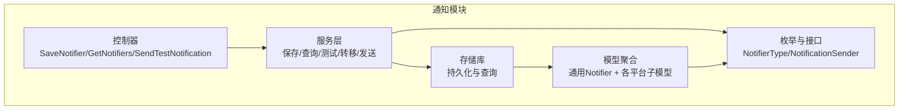
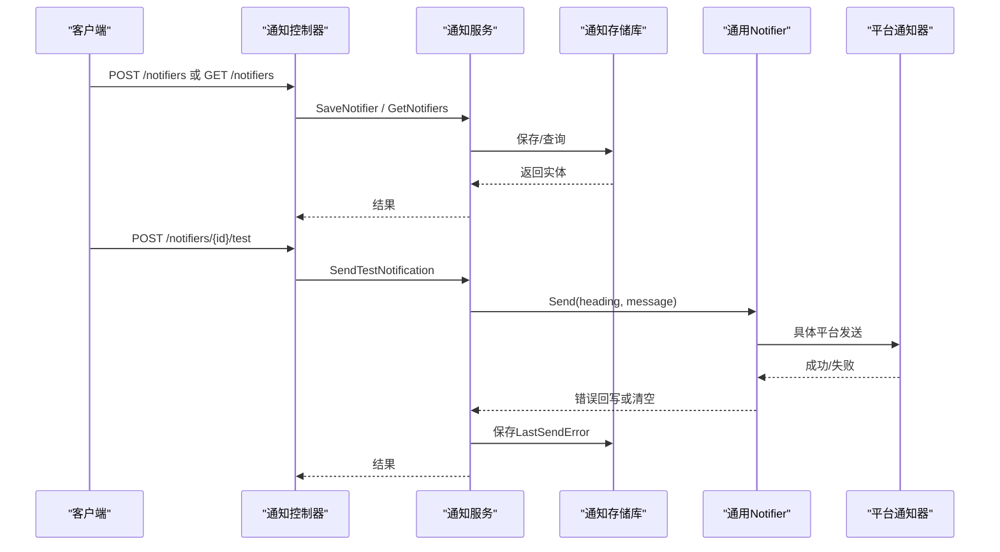
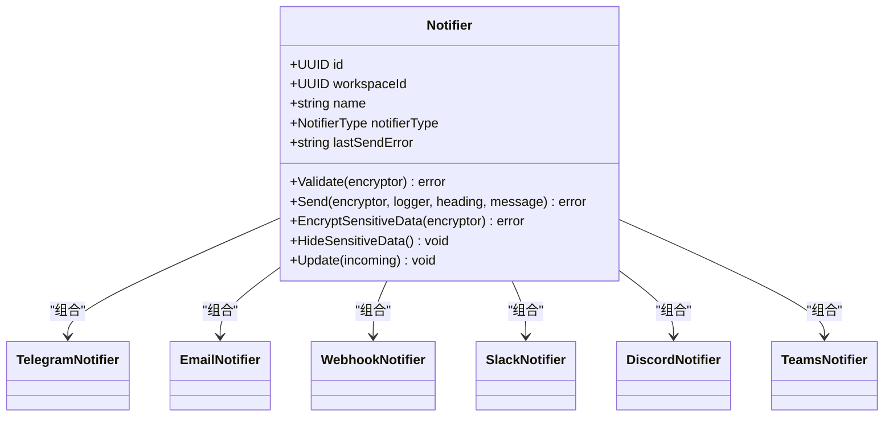
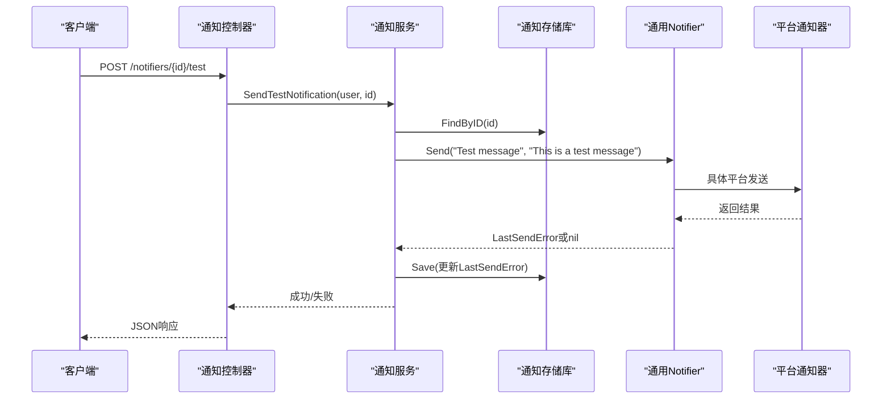
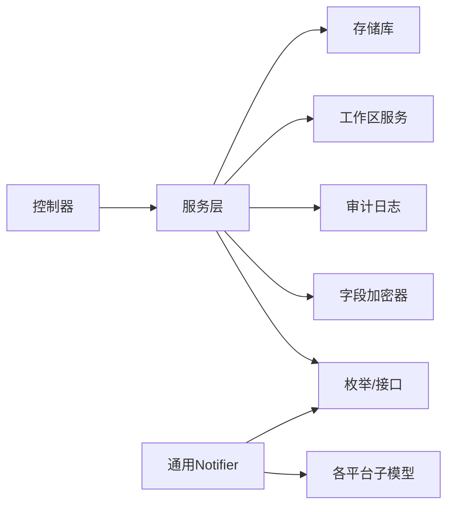

# 即时通讯通知

<cite>
**本文引用的文件**
- [controller.go](file://backend/internal/features/notifiers/controller.go)
- [service.go](file://backend/internal/features/notifiers/service.go)
- [model.go](file://backend/internal/features/notifiers/model.go)
- [dto.go](file://backend/internal/features/notifiers/dto.go)
- [enums.go](file://backend/internal/features/notifiers/enums.go)
- [repository.go](file://backend/internal/features/notifiers/repository.go)
- [interfaces.go](file://backend/internal/features/notifiers/interfaces.go)
- [errors.go](file://backend/internal/features/notifiers/errors.go)
- [20250618203654_create_webhook_notifiers.sql](file://backend/migrations/20250618203654_create_webhook_notifiers.sql)
- [20250624065518_add_slack_notifier.sql](file://backend/migrations/20250624065518_add_slack_notifier.sql)
- [20250629143714_add_google_drive_storage.sql](file://backend/migrations/20250629143714_add_google_drive_storage.sql)
- [20250716072247_add_discord_notifier.sql](file://backend/migrations/20250716072247_add_discord_notifier.sql)
- [20250906152330_add_ms_teams_notifier.sql](file://backend/migrations/20250906152330_add_ms_teams_notifier.sql)
- [20250912092352_add_monitoring_metrics.sql](file://backend/migrations/20250912092352_add_monitoring_metrics.sql)
- [20251031143019_add_many_users_and_settings.sql](file://backend/migrations/20251031143019_add_many_users_and_settings.sql)
- [20251031145001_add_system_audit_logs.sql](file://backend/migrations/20251031145001_add_system_audit_logs.sql)
- [20251031155004_add_workspaces.sql](file://backend/migrations/20251031155004_add_workspaces.sql)
- [20251104000000_workspace_scope_storages_notifiers.sql](file://backend/migrations/20251104000000_workspace_scope_storages_notifiers.sql)
- [20251211142507_add_include_schemas_to_postgresql_databases.sql](file://backend/migrations/20251211142507_add_include_schemas_to_postgresql_databases.sql)
- [20251211164424_add_skip_tls_verify_to_s3.sql](file://backend/migrations/20251211164424_add_skip_tls_verify_to_s3.sql)
- [20251213180403_add_ftp_storages.sql](file://backend/migrations/20251213180403_add_ftp_storages.sql)
- [20251213204730_remove_ftp_passive_mode.sql](file://backend/migrations/20251213204730_remove_ftp_passive_mode.sql)
- [20251218123447_add_rclone_storages.sql](file://backend/migrations/20251218123447_add_rclone_storages.sql)
- [20251219220027_add_sftp_storages.sql](file://backend/migrations/20251219220027_add_sftp_storages.sql)
- [20251219230000_add_cron_expression.sql](file://backend/migrations/20251219230000_add_cron_expression.sql)
- [20251220104453_add_mysql_databases_table.sql](file://backend/migrations/20251220104453_add_mysql_databases_table.sql)
- [20251221100000_add_mariadb_databases_table.sql](file://backend/migrations/20251221100000_add_mariadb_databases_table.sql)
- [20251221195603_add_mongodb_databases_table.sql](file://backend/migrations/20251221195603_add_mongodb_databases_table.sql)
- [20251227165710_move_cpu_count_to_databases.sql](file://backend/migrations/20251227165710_move_cpu_count_to_databases.sql)
- [20260101200438_add_backup_format.sql](file://backend/migrations/20260101200438_add_backup_format.sql)
- [20260102110334_remove_backup_type_field.sql](file://backend/migrations/20260102110334_remove_backup_type_field.sql)
- [20260104190532_add_is_exclude_events_to_mariadb.sql](file://backend/migrations/20260104190532_add_is_exclude_events_to_mariadb.sql)
- [20260105165527_add_privileges_to_mysql_mariadb.sql](file://backend/migrations/20260105165527_add_privileges_to_mysql_mariadb.sql)
- [20260105170956_add_cascade_delete_to_workspace_fks.sql](file://backend/migrations/20260105170956_add_cascade_delete_to_workspace_fks.sql)
- [20260108111730_add_download_tokens_table.sql](file://backend/migrations/20260108111730_add_download_tokens_table.sql)
- [20260119124334_add_backup_size_limits.sql](file://backend/migrations/20260119124334_add_backup_size_limits.sql)
- [20260122134856_add_database_plans_table.sql](file://backend/migrations/20260122134856_add_database_plans_table.sql)
- [20260122173935_add_is_system_to_storages.sql](file://backend/migrations/20260122173935_add_is_system_to_storages.sql)
- [20260127132617_add_cascade_delete_for_backups_and_databases.sql](file://backend/migrations/20260127132617_add_cascade_delete_for_backups_and_databases.sql)
- [20260127140305_add_cascade_delete_for_backup_configs.sql](file://backend/migrations/20260127140305_add_cascade_delete_for_backup_configs.sql)
- [20260128115419_add_password_reset_codes.sql](file://backend/migrations/20260128115419_add_password_reset_codes.sql)
- [20260209125258_add_mongodb_srv_support.sql](file://backend/migrations/20260209125258_add_mongodb_srv_support.sql)
- [20260213131117_add_mariadb_event_exclusion.sql](file://backend/migrations/20260213131117_add_mariadb_event_exclusion.sql)
- [20260217000000_add_file_name_to_backups.sql](file://backend/migrations/20260217000000_add_file_name_to_backups.sql)
- [20260220000000_add_retention_policy.sql](file://backend/migrations/20260220000000_add_retention_policy.sql)
- [20260221111333_add_mongodb_direct_connection.sql](file://backend/migrations/20260221111333_add_mongodb_direct_connection.sql)
- [20260306045548_add_wal_properties.sql](file://backend/migrations/20260306045548_add_wal_properties.sql)
- [20260308120000_add_insecure_skip_verify_to_email_notifiers.sql](file://backend/migrations/20260308120000_add_insecure_skip_verify_to_email_notifiers.sql)
- [20260311094356_add_is_zstd_supported_to_mysql.sql](file://backend/migrations/20260311094356_add_is_zstd_supported_to_mysql.sql)
- [20260316151706_add_upload_completed_at.sql](file://backend/migrations/20260316151706_add_upload_completed_at.sql)
- [20260326130504_add_billing.sql](file://backend/migrations/20260326130504_add_billing.sql)
- [20260326164625_remove_db_plan_and_backups_limits.sql](file://backend/migrations/20260326164625_remove_db_plan_and_backups_limits.sql)
- [20260327090334_add_is_skipped_to_webhook_records.sql](file://backend/migrations/20260327090334_add_is_skipped_to_webhook_records.sql)
- [20260402055223_add_storage_class_to_s3.sql](file://backend/migrations/20260402055223_add_storage_class_to_s3.sql)
</cite>

## 目录
1. [简介](#简介)
2. [项目结构](#项目结构)
3. [核心组件](#核心组件)
4. [架构总览](#架构总览)
5. [详细组件分析](#详细组件分析)
6. [依赖关系分析](#依赖关系分析)
7. [性能考虑](#性能考虑)
8. [故障排除指南](#故障排除指南)
9. [结论](#结论)
10. [附录](#附录)

## 简介
本文件面向Databasus即时通讯通知功能，系统性梳理后端通知控制器与服务层的通用能力，并结合数据库迁移脚本对各平台通知器（Discord、Slack、Teams、Telegram、Webhook）的建模与字段演进进行说明。文档重点覆盖以下方面：
- 平台通知配置入口与工作区作用域
- 通知发送流程与测试机制
- 消息长度限制与错误回写
- 各平台通知器的数据库模型演进
- 常见问题排查与调试建议

## 项目结构
通知功能位于后端模块中，采用“控制器-服务-存储库-模型”的分层设计，配合枚举类型与迁移脚本完成多平台通知器的数据结构定义与演进。

图表来源
- [controller.go:19-27](file://backend/internal/features/notifiers/controller.go#L19-L27)
- [service.go:15-22](file://backend/internal/features/notifiers/service.go#L15-L22)
- [model.go:18-32](file://backend/internal/features/notifiers/model.go#L18-L32)
- [enums.go](file://backend/internal/features/notifiers/enums.go)
- [interfaces.go](file://backend/internal/features/notifiers/interfaces.go)

章节来源
- [controller.go:19-27](file://backend/internal/features/notifiers/controller.go#L19-L27)
- [service.go:15-22](file://backend/internal/features/notifiers/service.go#L15-L22)
- [model.go:18-32](file://backend/internal/features/notifiers/model.go#L18-L32)

## 核心组件
- 控制器：提供通知器的创建、查询、删除、测试与工作区转移接口，统一鉴权与参数校验。
- 服务层：封装业务规则（权限、审计日志、附件数据库检查、消息截断、错误回写），协调存储库与具体通知器实现。
- 模型聚合：通用Notifier作为门面，内部组合各平台通知器子模型，通过类型分发调用具体发送逻辑。
- 枚举与接口：定义通知器类型与发送接口契约，确保多态扩展。

章节来源
- [controller.go:42-70](file://backend/internal/features/notifiers/controller.go#L42-L70)
- [service.go:30-113](file://backend/internal/features/notifiers/service.go#L30-L113)
- [model.go:18-122](file://backend/internal/features/notifiers/model.go#L18-L122)
- [enums.go](file://backend/internal/features/notifiers/enums.go)
- [interfaces.go](file://backend/internal/features/notifiers/interfaces.go)

## 架构总览
下图展示从HTTP请求到具体平台发送的整体流程，以及测试与直接发送两种路径。

图表来源
- [controller.go:191-226](file://backend/internal/features/notifiers/controller.go#L191-L226)
- [service.go:209-237](file://backend/internal/features/notifiers/service.go#L209-L237)
- [model.go:46-62](file://backend/internal/features/notifiers/model.go#L46-L62)

## 详细组件分析

### 通用通知器模型与多态分发
通用Notifier聚合了各平台通知器子模型，并通过类型分发调用具体发送逻辑。更新时根据类型分别更新对应子模型，加密与隐藏敏感信息同样按类型委托给子模型。

图表来源
- [model.go:18-32](file://backend/internal/features/notifiers/model.go#L18-L32)
- [model.go:104-121](file://backend/internal/features/notifiers/model.go#L104-L121)

章节来源
- [model.go:18-122](file://backend/internal/features/notifiers/model.go#L18-L122)

### 控制器路由与权限校验
- 路由注册：创建、查询、删除、测试、工作区转移、直接测试。
- 权限校验：均需通过用户上下文与工作区访问/管理权限校验，避免越权操作。
- 参数绑定：统一使用Gin的ShouldBindJSON进行请求体绑定与错误处理。

章节来源
- [controller.go:19-27](file://backend/internal/features/notifiers/controller.go#L19-L27)
- [controller.go:42-70](file://backend/internal/features/notifiers/controller.go#L42-L70)
- [controller.go:122-152](file://backend/internal/features/notifiers/controller.go#L122-L152)
- [controller.go:166-189](file://backend/internal/features/notifiers/controller.go#L166-L189)
- [controller.go:203-226](file://backend/internal/features/notifiers/controller.go#L203-L226)
- [controller.go:242-282](file://backend/internal/features/notifiers/controller.go#L242-L282)
- [controller.go:297-334](file://backend/internal/features/notifiers/controller.go#L297-L334)

### 服务层业务规则与错误处理
- 权限与审计：保存/删除/查询/测试均进行工作区权限校验，并在变更时写入审计日志。
- 附件数据库检查：删除前检查是否被数据库配置关联，防止误删。
- 消息截断：发送前将消息截断至2000字符，避免平台限制导致失败。
- 错误回写：发送失败时记录LastSendError，成功则清空该字段并持久化。

章节来源
- [service.go:30-113](file://backend/internal/features/notifiers/service.go#L30-L113)
- [service.go:115-154](file://backend/internal/features/notifiers/service.go#L115-L154)
- [service.go:185-207](file://backend/internal/features/notifiers/service.go#L185-L207)
- [service.go:209-237](file://backend/internal/features/notifiers/service.go#L209-L237)
- [service.go:276-308](file://backend/internal/features/notifiers/service.go#L276-L308)

### 数据模型与平台演进（基于迁移）
- Webhook通知器：首次引入notifiers表及webhook相关字段。
- Slack通知器：新增slackNotifier字段与相关配置。
- Discord通知器：新增discordNotifier字段与相关配置。
- Microsoft Teams通知器：新增teamsNotifier字段与相关配置。
- 工作区作用域：后续迁移将通知器纳入工作区范围，确保资源隔离。

章节来源
- [20250618203654_create_webhook_notifiers.sql](file://backend/migrations/20250618203654_create_webhook_notifiers.sql)
- [20250624065518_add_slack_notifier.sql](file://backend/migrations/20250624065518_add_slack_notifier.sql)
- [20250716072247_add_discord_notifier.sql](file://backend/migrations/20250716072247_add_discord_notifier.sql)
- [20250906152330_add_ms_teams_notifier.sql](file://backend/migrations/20250906152330_add_ms_teams_notifier.sql)
- [20251104000000_workspace_scope_storages_notifiers.sql](file://backend/migrations/20251104000000_workspace_scope_storages_notifiers.sql)

### 发送流程与测试序列

图表来源
- [controller.go:203-226](file://backend/internal/features/notifiers/controller.go#L203-L226)
- [service.go:209-237](file://backend/internal/features/notifiers/service.go#L209-L237)
- [model.go:46-62](file://backend/internal/features/notifiers/model.go#L46-L62)

## 依赖关系分析
- 控制器依赖服务层；服务层依赖存储库、工作区服务、审计日志与字段加密器。
- 通用Notifier通过组合各平台通知器子模型实现多态分发。
- 枚举与接口定义了类型安全与扩展点。

图表来源
- [service.go:15-22](file://backend/internal/features/notifiers/service.go#L15-L22)
- [model.go:18-32](file://backend/internal/features/notifiers/model.go#L18-L32)
- [enums.go](file://backend/internal/features/notifiers/enums.go)
- [interfaces.go](file://backend/internal/features/notifiers/interfaces.go)

章节来源
- [service.go:15-22](file://backend/internal/features/notifiers/service.go#L15-L22)
- [model.go:18-32](file://backend/internal/features/notifiers/model.go#L18-L32)

## 性能考虑
- 消息截断：服务层在发送前将消息截断至2000字符，降低超长消息带来的网络与平台限制风险。
- 异步发送：当前实现为同步调用，若平台发送存在延迟，可考虑引入队列或后台任务以提升吞吐。
- 错误回写：失败时仅回写LastSendError并持久化，避免重复重试造成雪崩。

章节来源
- [service.go:281-285](file://backend/internal/features/notifiers/service.go#L281-L285)
- [service.go:294-301](file://backend/internal/features/notifiers/service.go#L294-L301)

## 故障排除指南
- 权限不足
  - 现象：返回403 Forbidden。
  - 排查：确认当前用户对目标工作区具备管理/查看权限；测试接口需要查看权限。
- 无效ID或缺失参数
  - 现象：返回400 Bad Request。
  - 排查：核对通知器ID与工作区ID格式；测试接口需提供有效ID。
- 删除失败（仍有关联数据库）
  - 现象：返回提示通知器仍被数据库配置关联。
  - 排查：先解除数据库配置中的通知器绑定再删除。
- 发送失败
  - 现象：LastSendError字段非空。
  - 排查：查看LastSendError内容；检查平台凭据、URL、通道/频道配置是否正确；确认消息长度未超过限制。
- 测试发送
  - 使用“直接测试”接口可不保存临时配置即发送测试消息，便于快速验证。

章节来源
- [controller.go:50-58](file://backend/internal/features/notifiers/controller.go#L50-L58)
- [controller.go:91-95](file://backend/internal/features/notifiers/controller.go#L91-L95)
- [controller.go:135-139](file://backend/internal/features/notifiers/controller.go#L135-L139)
- [controller.go:173-177](file://backend/internal/features/notifiers/controller.go#L173-L177)
- [service.go:138-140](file://backend/internal/features/notifiers/service.go#L138-L140)
- [service.go:294-301](file://backend/internal/features/notifiers/service.go#L294-L301)
- [controller.go:297-334](file://backend/internal/features/notifiers/controller.go#L297-L334)

## 结论
Databasus的通知功能通过统一的控制器与服务层抽象，实现了对多种即时通讯平台的通知器扩展。其关键特性包括：
- 工作区作用域隔离与严格的权限控制
- 统一的测试与错误回写机制
- 可扩展的多平台通知器模型
- 对消息长度的主动限制以规避平台限制

对于各平台的具体配置（如Discord Webhook、Slack频道、Teams通道、Telegram Chat ID与Bot令牌、Webhook URL与模板），请结合各平台官方文档与数据库迁移脚本中对应的字段定义进行配置与验证。

## 附录

### 平台通知器字段演进概览
- Webhook通知器：首次引入notifiers表及webhook相关字段。
- Slack通知器：新增slackNotifier字段与相关配置。
- Discord通知器：新增discordNotifier字段与相关配置。
- Microsoft Teams通知器：新增teamsNotifier字段与相关配置。
- 工作区作用域：后续迁移将通知器纳入工作区范围，确保资源隔离。

章节来源
- [20250618203654_create_webhook_notifiers.sql](file://backend/migrations/20250618203654_create_webhook_notifiers.sql)
- [20250624065518_add_slack_notifier.sql](file://backend/migrations/20250624065518_add_slack_notifier.sql)
- [20250716072247_add_discord_notifier.sql](file://backend/migrations/20250716072247_add_discord_notifier.sql)
- [20250906152330_add_ms_teams_notifier.sql](file://backend/migrations/20250906152330_add_ms_teams_notifier.sql)
- [20251104000000_workspace_scope_storages_notifiers.sql](file://backend/migrations/20251104000000_workspace_scope_storages_notifiers.sql)