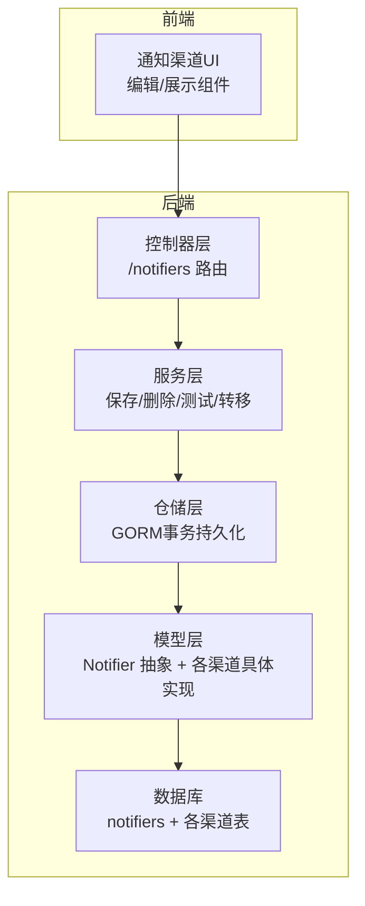
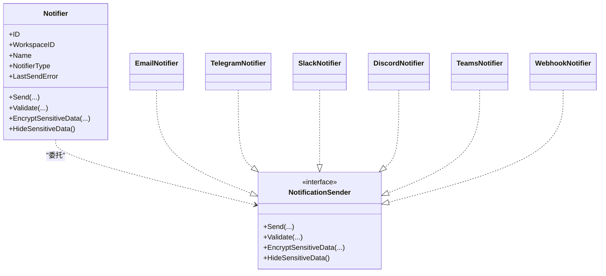
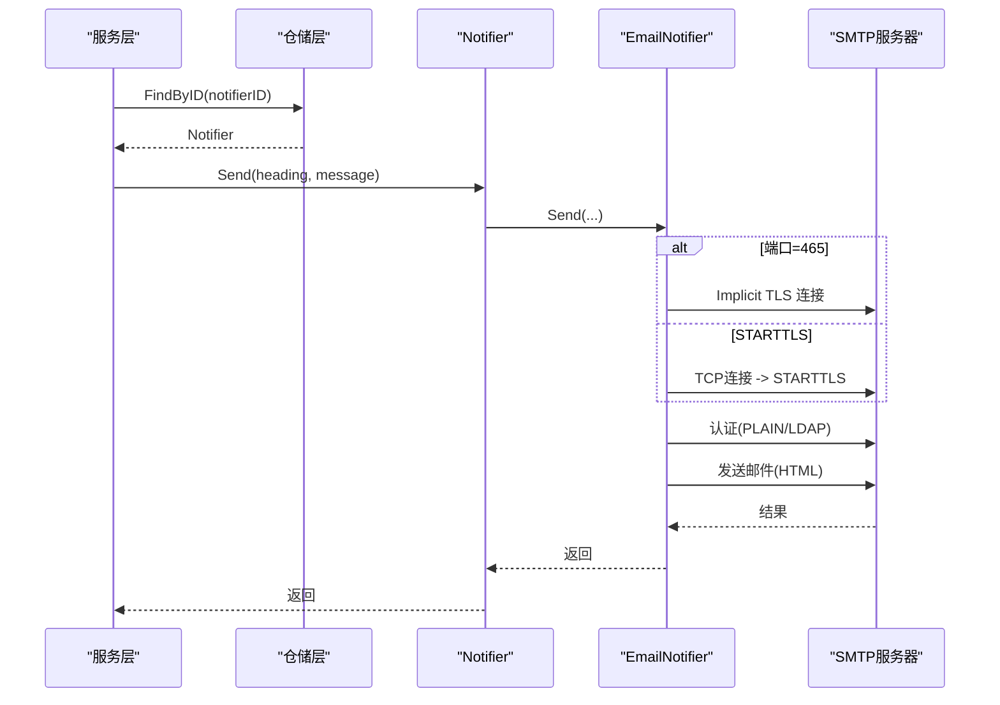
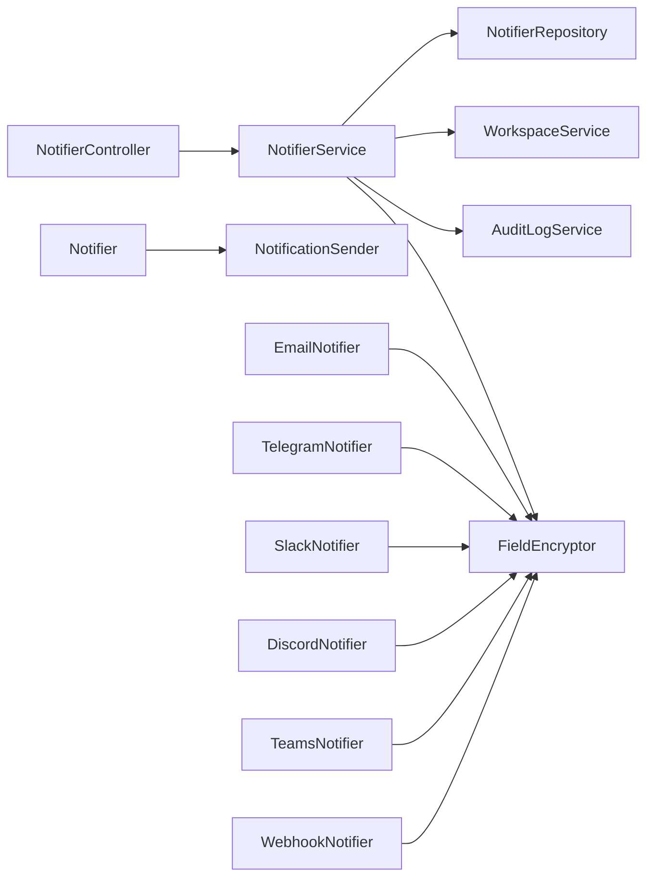

# 智能通知系统

<cite>
**本文档引用的文件**
- [backend/internal/features/notifiers/enums.go](file://backend/internal/features/notifiers/enums.go)
- [backend/internal/features/notifiers/model.go](file://backend/internal/features/notifiers/model.go)
- [backend/internal/features/notifiers/interfaces.go](file://backend/internal/features/notifiers/interfaces.go)
- [backend/internal/features/notifiers/controller.go](file://backend/internal/features/notifiers/controller.go)
- [backend/internal/features/notifiers/service.go](file://backend/internal/features/notifiers/service.go)
- [backend/internal/features/notifiers/repository.go](file://backend/internal/features/notifiers/repository.go)
- [backend/internal/features/notifiers/models/email_notifier/model.go](file://backend/internal/features/notifiers/models/email_notifier/model.go)
- [backend/internal/features/notifiers/models/webhook/model.go](file://backend/internal/features/notifiers/models/webhook/model.go)
- [backend/internal/features/notifiers/models/discord/model.go](file://backend/internal/features/notifiers/models/discord/model.go)
- [backend/internal/features/notifiers/models/telegram/model.go](file://backend/internal/features/notifiers/models/telegram/model.go)
- [backend/internal/features/notifiers/models/slack/model.go](file://backend/internal/features/notifiers/models/slack/model.go)
- [backend/internal/features/notifiers/models/teams/model.go](file://backend/internal/features/notifiers/models/teams/model.go)
- [backend/migrations/20250715102801_allow_unauthorized_smtp.sql](file://backend/migrations/20250715102801_allow_unauthorized_smtp.sql)
- [backend/migrations/20251108173913_add_from_to_email_notifier.sql](file://backend/migrations/20251108173913_add_from_to_email_notifier.sql)
- [backend/migrations/20260308120000_add_insecure_skip_verify_to_email_notifiers.sql](file://backend/migrations/20260308120000_add_insecure_skip_verify_to_email_notifiers.sql)
- [backend/migrations/20260327090334_add_is_skipped_to_webhook_records.sql](file://backend/migrations/20260327090334_add_is_skipped_to_webhook_records.sql)
- [frontend/src/entity/notifiers/models/NotifierType.ts](file://frontend/src/entity/notifiers/models/NotifierType.ts)
- [frontend/src/entity/notifiers/models/getNotifierNameFromType.ts](file://frontend/src/entity/notifiers/models/getNotifierNameFromType.ts)
- [frontend/src/entity/notifiers/models/getNotifierLogoFromType.ts](file://frontend/src/entity/notifiers/models/getNotifierLogoFromType.ts)
- [frontend/src/features/notifiers/ui/edit/EditEmailNotifierComponent.tsx](file://frontend/src/features/notifiers/ui/edit/EditEmailNotifierComponent.tsx)
- [frontend/src/features/notifiers/ui/show/ShowEmailNotifierComponent.tsx](file://frontend/src/features/notifiers/ui/show/ShowEmailNotifierComponent.tsx)
</cite>

## 目录
1. [简介](#简介)
2. [项目结构](#项目结构)
3. [核心组件](#核心组件)
4. [架构总览](#架构总览)
5. [详细组件分析](#详细组件分析)
6. [依赖关系分析](#依赖关系分析)
7. [性能考量](#性能考量)
8. [故障排查指南](#故障排查指南)
9. [结论](#结论)
10. [附录](#附录)

## 简介
本文件面向Databasus的智能通知系统，系统支持多种通知渠道：邮件通知（SMTP配置、TLS加密、可选认证）、即时通讯（Telegram、Slack、Discord、Microsoft Teams）、Webhook（HTTP请求、认证头、重试机制）。通知模板系统采用简单变量替换（如标题、消息），并支持在Webhook场景下通过模板引擎进行更复杂的结构化消息构建。系统提供测试发送、权限控制、敏感信息加密存储、审计日志等能力，并在Slack等渠道实现了指数退避重试策略以应对速率限制。

## 项目结构
通知系统主要由后端Go服务与前端React界面组成，后端通过统一的Notifier抽象聚合不同渠道的具体实现，使用GORM进行数据库持久化，配合工作区权限控制与审计日志。

**图表来源**
- [backend/internal/features/notifiers/controller.go:19-27](file://backend/internal/features/notifiers/controller.go#L19-L27)
- [backend/internal/features/notifiers/service.go:15-22](file://backend/internal/features/notifiers/service.go#L15-L22)
- [backend/internal/features/notifiers/repository.go:10-123](file://backend/internal/features/notifiers/repository.go#L10-L123)
- [backend/internal/features/notifiers/model.go:18-36](file://backend/internal/features/notifiers/model.go#L18-L36)

**章节来源**
- [backend/internal/features/notifiers/controller.go:19-27](file://backend/internal/features/notifiers/controller.go#L19-L27)
- [backend/internal/features/notifiers/service.go:15-22](file://backend/internal/features/notifiers/service.go#L15-L22)
- [backend/internal/features/notifiers/repository.go:125-172](file://backend/internal/features/notifiers/repository.go#L125-L172)
- [backend/internal/features/notifiers/model.go:18-36](file://backend/internal/features/notifiers/model.go#L18-L36)

## 核心组件
- 统一通知抽象：Notifier作为聚合根，根据类型委托给具体渠道实现，负责校验、发送、隐藏敏感数据、加密敏感数据。
- 渠道实现：Email、Telegram、Slack、Discord、Teams、Webhook各自实现NotificationSender接口。
- 控制器与服务：提供REST接口、权限校验、测试发送、工作区转移、审计日志。
- 仓储层：基于GORM的事务性保存与查询，支持预加载各渠道子实体。
- 前端：枚举与UI组件，展示与编辑通知渠道配置。

**章节来源**
- [backend/internal/features/notifiers/model.go:18-122](file://backend/internal/features/notifiers/model.go#L18-L122)
- [backend/internal/features/notifiers/interfaces.go:11-28](file://backend/internal/features/notifiers/interfaces.go#L11-L28)
- [backend/internal/features/notifiers/controller.go:42-108](file://backend/internal/features/notifiers/controller.go#L42-L108)
- [backend/internal/features/notifiers/service.go:30-113](file://backend/internal/features/notifiers/service.go#L30-L113)
- [backend/internal/features/notifiers/repository.go:125-172](file://backend/internal/features/notifiers/repository.go#L125-L172)
- [frontend/src/entity/notifiers/models/NotifierType.ts:1-8](file://frontend/src/entity/notifiers/models/NotifierType.ts#L1-L8)

## 架构总览
通知系统采用分层架构：前端负责用户交互；后端控制器接收请求并调用服务层；服务层协调仓储与审计日志；仓储层通过GORM完成跨表事务；模型层通过接口多态实现不同通知渠道。

**图表来源**
- [backend/internal/features/notifiers/model.go:18-122](file://backend/internal/features/notifiers/model.go#L18-L122)
- [backend/internal/features/notifiers/interfaces.go:11-28](file://backend/internal/features/notifiers/interfaces.go#L11-L28)
- [backend/internal/features/notifiers/models/email_notifier/model.go:27-36](file://backend/internal/features/notifiers/models/email_notifier/model.go#L27-L36)
- [backend/internal/features/notifiers/models/telegram/model.go:19-24](file://backend/internal/features/notifiers/models/telegram/model.go#L19-L24)
- [backend/internal/features/notifiers/models/slack/model.go:21-25](file://backend/internal/features/notifiers/models/slack/model.go#L21-L25)
- [backend/internal/features/notifiers/models/discord/model.go:18-21](file://backend/internal/features/notifiers/models/discord/model.go#L18-L21)
- [backend/internal/features/notifiers/models/teams/model.go:18-21](file://backend/internal/features/notifiers/models/teams/model.go#L18-L21)
- [backend/internal/features/notifiers/models/webhook/model.go:30-38](file://backend/internal/features/notifiers/models/webhook/model.go#L30-L38)

## 详细组件分析

### 邮件通知（SMTP）
- 支持隐式TLS（端口465）与STARTTLS两种模式，自动选择。
- 可选认证：支持PLAIN与LOGIN两种认证方式，失败时自动重连并尝试另一种。
- TLS配置：支持跳过证书验证（用于自签证书场景），但会提示安全风险。
- 发件人：支持自定义From地址，未设置时回退到SMTPUser或生成默认地址。
- 内容：HTML内容，兼容非ASCII字符编码。
- 数据库字段：目标邮箱、SMTP主机、端口、用户名、密码、发件人、是否跳过TLS验证；迁移允许SMTP凭据为空以支持匿名SMTP。

**图表来源**
- [backend/internal/features/notifiers/service.go:276-308](file://backend/internal/features/notifiers/service.go#L276-L308)
- [backend/internal/features/notifiers/repository.go:125-142](file://backend/internal/features/notifiers/repository.go#L125-L142)
- [backend/internal/features/notifiers/model.go:46-62](file://backend/internal/features/notifiers/model.go#L46-L62)
- [backend/internal/features/notifiers/models/email_notifier/model.go:63-93](file://backend/internal/features/notifiers/models/email_notifier/model.go#L63-L93)

**章节来源**
- [backend/internal/features/notifiers/models/email_notifier/model.go:27-36](file://backend/internal/features/notifiers/models/email_notifier/model.go#L27-L36)
- [backend/internal/features/notifiers/models/email_notifier/model.go:165-201](file://backend/internal/features/notifiers/models/email_notifier/model.go#L165-L201)
- [backend/internal/features/notifiers/models/email_notifier/model.go:260-295](file://backend/internal/features/notifiers/models/email_notifier/model.go#L260-L295)
- [backend/migrations/20250715102801_allow_unauthorized_smtp.sql:1-17](file://backend/migrations/20250715102801_allow_unauthorized_smtp.sql#L1-L17)
- [backend/migrations/20251108173913_add_from_to_email_notifier.sql:1-11](file://backend/migrations/20251108173913_add_from_to_email_notifier.sql#L1-L11)
- [backend/migrations/20260308120000_add_insecure_skip_verify_to_email_notifiers.sql:1-11](file://backend/migrations/20260308120000_add_insecure_skip_verify_to_email_notifiers.sql#L1-L11)
- [frontend/src/features/notifiers/ui/edit/EditEmailNotifierComponent.tsx:188-219](file://frontend/src/features/notifiers/ui/edit/EditEmailNotifierComponent.tsx#L188-L219)
- [frontend/src/features/notifiers/ui/show/ShowEmailNotifierComponent.tsx:1-48](file://frontend/src/features/notifiers/ui/show/ShowEmailNotifierComponent.tsx#L1-L48)

### 即时通讯（Telegram）
- 使用官方Bot API发送消息，支持可选线程ID（群组话题）。
- 敏感数据（Bot Token）加密存储，发送前解密。
- 请求为表单提交，内容类型为application/x-www-form-urlencoded。

**章节来源**
- [backend/internal/features/notifiers/models/telegram/model.go:19-24](file://backend/internal/features/notifiers/models/telegram/model.go#L19-L24)
- [backend/internal/features/notifiers/models/telegram/model.go:42-95](file://backend/internal/features/notifiers/models/telegram/model.go#L42-L95)

### 即时通讯（Slack）
- 使用官方chat.postMessage API，支持频道ID、群组ID、私聊ID等多种目标格式校验。
- 实现指数退避重试：当收到429时读取Retry-After头，否则按固定倍数增长，最多重试若干次。
- 逻辑错误不会返回非2xx状态码，需解析响应体中的ok字段判断。

**章节来源**
- [backend/internal/features/notifiers/models/slack/model.go:21-47](file://backend/internal/features/notifiers/models/slack/model.go#L21-L47)
- [backend/internal/features/notifiers/models/slack/model.go:49-152](file://backend/internal/features/notifiers/models/slack/model.go#L49-L152)

### 即时通讯（Discord）
- 使用频道Webhook URL发送消息，支持自定义内容。
- 敏感数据加密存储，发送前解密。

**章节来源**
- [backend/internal/features/notifiers/models/discord/model.go:18-21](file://backend/internal/features/notifiers/models/discord/model.go#L18-L21)
- [backend/internal/features/notifiers/models/discord/model.go:35-86](file://backend/internal/features/notifiers/models/discord/model.go#L35-L86)

### 即时通讯（Microsoft Teams）
- 使用Power Automate Webhook，发送自适应卡片（Adaptive Card）。
- 对URL进行有效性校验，确保协议为http或https。

**章节来源**
- [backend/internal/features/notifiers/models/teams/model.go:18-21](file://backend/internal/features/notifiers/models/teams/model.go#L18-L21)
- [backend/internal/features/notifiers/models/teams/model.go:27-42](file://backend/internal/features/notifiers/models/teams/model.go#L27-L42)
- [backend/internal/features/notifiers/models/teams/model.go:55-114](file://backend/internal/features/notifiers/models/teams/model.go#L55-L114)

### Webhook
- 支持GET与POST方法，GET通过查询参数传递标题与消息，POST默认JSON负载。
- 支持自定义请求头，敏感值加密存储，发送前解密。
- 支持自定义Body模板，模板中可用变量替换（如标题、消息），并对字符串进行JSON转义。
- 数据库记录支持标记“跳过”字段，便于批量跳过某些记录。

**章节来源**
- [backend/internal/features/notifiers/models/webhook/model.go:30-38](file://backend/internal/features/notifiers/models/webhook/model.go#L30-L38)
- [backend/internal/features/notifiers/models/webhook/model.go:83-113](file://backend/internal/features/notifiers/models/webhook/model.go#L83-L113)
- [backend/internal/features/notifiers/models/webhook/model.go:143-226](file://backend/internal/features/notifiers/models/webhook/model.go#L143-L226)
- [backend/internal/features/notifiers/models/webhook/model.go:228-243](file://backend/internal/features/notifiers/models/webhook/model.go#L228-L243)
- [backend/internal/features/notifiers/models/webhook/model.go:267-277](file://backend/internal/features/notifiers/models/webhook/model.go#L267-L277)
- [backend/migrations/20260327090334_add_is_skipped_to_webhook_records.sql:1-11](file://backend/migrations/20260327090334_add_is_skipped_to_webhook_records.sql#L1-L11)

### 通知模板系统设计
- 变量替换：Webhook支持在自定义Body模板中使用占位符进行变量替换，发送前进行JSON安全转义。
- 条件判断：当前实现未提供模板条件语法，复杂逻辑建议在上游业务侧处理或通过自定义模板实现。
- 多语言支持：未发现内置多语言模板机制，可通过外部业务流程在发送前进行本地化处理。

**章节来源**
- [backend/internal/features/notifiers/models/webhook/model.go:228-243](file://backend/internal/features/notifiers/models/webhook/model.go#L228-L243)
- [backend/internal/features/notifiers/models/webhook/model.go:253-265](file://backend/internal/features/notifiers/models/webhook/model.go#L253-L265)

### 实时通知与状态同步
- 当前代码库未发现WebSocket或长连接的实时通知实现。通知发送为一次性HTTP请求或SMTP会话，不维持持久连接。
- 状态同步：服务层在发送后更新最近一次发送错误状态并持久化，前端可通过查询接口获取最新状态。

**章节来源**
- [backend/internal/features/notifiers/service.go:276-308](file://backend/internal/features/notifiers/service.go#L276-L308)
- [backend/internal/features/notifiers/model.go:23-23](file://backend/internal/features/notifiers/model.go#L23-L23)

## 依赖关系分析
- 控制器依赖服务层，服务层依赖仓储层与工作区服务、审计日志服务。
- Notifier通过NotificationSender接口多态地委托给具体渠道实现。
- 各渠道实现依赖加密工具对敏感数据进行加解密。

**图表来源**
- [backend/internal/features/notifiers/controller.go:14-17](file://backend/internal/features/notifiers/controller.go#L14-L17)
- [backend/internal/features/notifiers/service.go:15-22](file://backend/internal/features/notifiers/service.go#L15-L22)
- [backend/internal/features/notifiers/model.go:104-121](file://backend/internal/features/notifiers/model.go#L104-L121)
- [backend/internal/features/notifiers/models/email_notifier/model.go:63-93](file://backend/internal/features/notifiers/models/email_notifier/model.go#L63-L93)

**章节来源**
- [backend/internal/features/notifiers/controller.go:14-17](file://backend/internal/features/notifiers/controller.go#L14-L17)
- [backend/internal/features/notifiers/service.go:15-22](file://backend/internal/features/notifiers/service.go#L15-L22)
- [backend/internal/features/notifiers/model.go:104-121](file://backend/internal/features/notifiers/model.go#L104-L121)

## 性能考量
- 邮件发送：默认超时较短，隐式TLS与STARTTLS路径均支持认证重试，避免单点失败。
- Webhook：GET与POST路径分别处理，POST默认JSON，减少不必要的头部解析开销。
- Slack：实现指数退避重试，降低API限流带来的失败率，提升整体成功率。
- 数据库：仓储层使用事务保证主从表一致性，避免部分写入导致的数据不一致。

[本节为通用指导，无需特定文件来源]

## 故障排查指南
- 权限不足：控制器与服务层对工作区访问与管理权限进行严格校验，若返回403或401，请检查用户角色与工作区绑定。
- 测试发送：通过“直接测试”接口可快速验证配置正确性，若失败请查看服务端日志与最近一次发送错误字段。
- Slack限流：出现429时系统会自动重试，若超过最大尝试次数仍失败，请检查目标频道ID与令牌权限。
- 邮件TLS：若遇到证书问题，可在前端启用“跳过TLS验证”，但会降低安全性，仅用于自签证书环境。
- Webhook跳过：数据库记录支持“跳过”标记，可用于批量跳过异常记录以便后续修复。

**章节来源**
- [backend/internal/features/notifiers/controller.go:42-70](file://backend/internal/features/notifiers/controller.go#L42-L70)
- [backend/internal/features/notifiers/service.go:209-237](file://backend/internal/features/notifiers/service.go#L209-L237)
- [backend/internal/features/notifiers/models/slack/model.go:114-131](file://backend/internal/features/notifiers/models/slack/model.go#L114-L131)
- [frontend/src/features/notifiers/ui/edit/EditEmailNotifierComponent.tsx:188-219](file://frontend/src/features/notifiers/ui/edit/EditEmailNotifierComponent.tsx#L188-L219)
- [backend/migrations/20260327090334_add_is_skipped_to_webhook_records.sql:1-11](file://backend/migrations/20260327090334_add_is_skipped_to_webhook_records.sql#L1-L11)

## 结论
Databasus智能通知系统提供了统一抽象与多渠道实现，具备完善的权限控制、审计日志与敏感数据加密能力。邮件与Webhook支持灵活配置，Slack实现指数退避重试以应对限流。当前未发现WebSocket实时通知实现，通知发送为一次性请求。建议在生产环境中谨慎使用“跳过TLS验证”选项，并结合限流与重试策略优化通知可靠性。

[本节为总结，无需特定文件来源]

## 附录

### 通知渠道配置示例与最佳实践
- 邮件（SMTP）
  - 主机与端口：优先使用465隐式TLS；若不可用则使用STARTTLS。
  - 凭据：建议同时提供用户名与密码；若匿名SMTP可留空，但需确保服务器允许。
  - 发件人：建议明确设置From地址，避免被识别为垃圾邮件。
  - 安全：仅在自签证书环境下启用“跳过TLS验证”。

- 即时通讯（Telegram）
  - Bot Token与目标Chat ID必须正确配置；群组内可选设置Thread ID。
  - 发送内容支持HTML解析，注意特殊字符转义。

- 即时通讯（Slack）
  - 目标ID支持C/G/D/U前缀；令牌需具备chat:write权限。
  - 遇到429时系统自动重试，建议合理规划发送频率。

- 即时通讯（Discord）
  - 使用频道Webhook URL；内容为纯文本或富文本取决于平台支持。

- 即时通讯（Teams）
  - 使用Power Automate Webhook；URL需为http或https。

- Webhook
  - GET：通过查询参数传递标题与消息；POST：默认JSON负载。
  - 自定义Header与Body模板：敏感值加密存储，发送前解密；模板中使用变量替换并进行JSON转义。

**章节来源**
- [backend/internal/features/notifiers/models/email_notifier/model.go:27-36](file://backend/internal/features/notifiers/models/email_notifier/model.go#L27-L36)
- [backend/internal/features/notifiers/models/telegram/model.go:19-24](file://backend/internal/features/notifiers/models/telegram/model.go#L19-L24)
- [backend/internal/features/notifiers/models/slack/model.go:29-47](file://backend/internal/features/notifiers/models/slack/model.go#L29-L47)
- [backend/internal/features/notifiers/models/discord/model.go:18-21](file://backend/internal/features/notifiers/models/discord/model.go#L18-L21)
- [backend/internal/features/notifiers/models/teams/model.go:18-21](file://backend/internal/features/notifiers/models/teams/model.go#L18-L21)
- [backend/internal/features/notifiers/models/webhook/model.go:30-38](file://backend/internal/features/notifiers/models/webhook/model.go#L30-L38)

### 安全与隐私
- 敏感数据加密：所有渠道的令牌、密码、URL等敏感信息均通过字段级加密存储，发送前解密。
- 权限控制：所有操作均需通过工作区权限校验，防止越权访问与修改。
- 审计日志：创建、更新、删除与转移通知渠道均记录审计日志，便于追踪。
- TLS与证书：默认严格校验证书；仅在必要时启用“跳过TLS验证”，并提示安全风险。

**章节来源**
- [backend/internal/features/notifiers/service.go:73-88](file://backend/internal/features/notifiers/service.go#L73-L88)
- [backend/internal/features/notifiers/service.go:147-151](file://backend/internal/features/notifiers/service.go#L147-L151)
- [backend/internal/features/notifiers/models/email_notifier/model.go:112-121](file://backend/internal/features/notifiers/models/email_notifier/model.go#L112-L121)
- [backend/internal/features/notifiers/models/telegram/model.go:110-119](file://backend/internal/features/notifiers/models/telegram/model.go#L110-L119)
- [backend/internal/features/notifiers/models/slack/model.go:166-175](file://backend/internal/features/notifiers/models/slack/model.go#L166-L175)
- [backend/internal/features/notifiers/models/discord/model.go:98-107](file://backend/internal/features/notifiers/models/discord/model.go#L98-L107)
- [backend/internal/features/notifiers/models/teams/model.go:126-135](file://backend/internal/features/notifiers/models/teams/model.go#L126-L135)
- [backend/internal/features/notifiers/models/webhook/model.go:128-141](file://backend/internal/features/notifiers/models/webhook/model.go#L128-L141)
- [frontend/src/features/notifiers/ui/edit/EditEmailNotifierComponent.tsx:208-214](file://frontend/src/features/notifiers/ui/edit/EditEmailNotifierComponent.tsx#L208-L214)