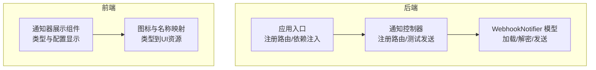
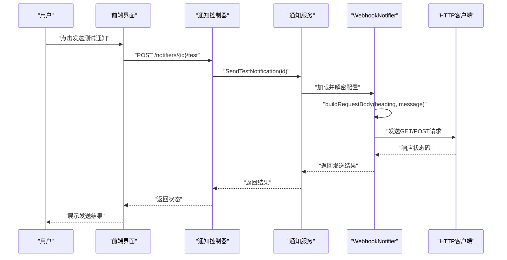
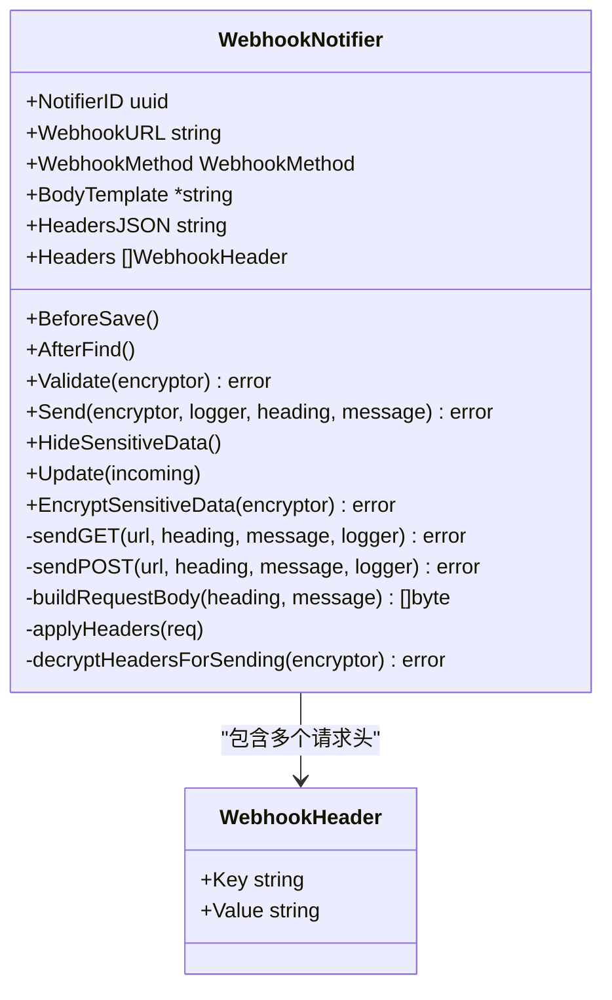
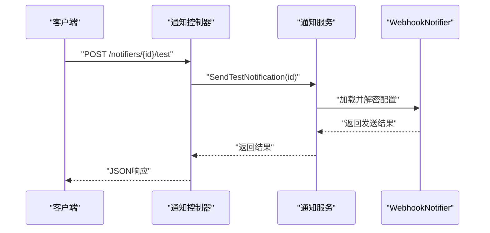
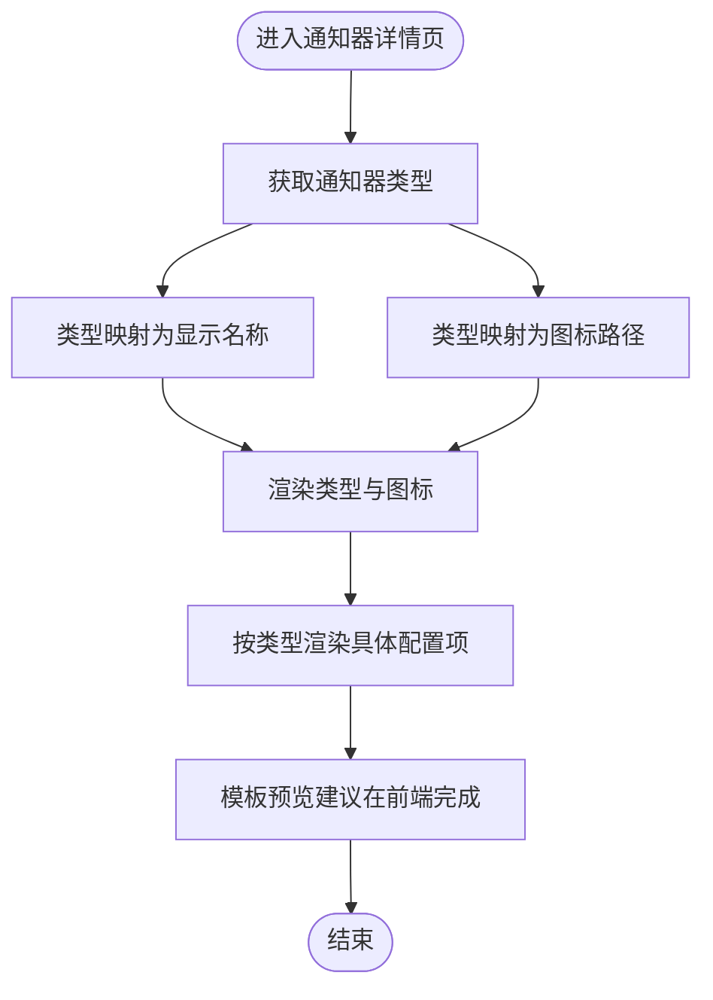
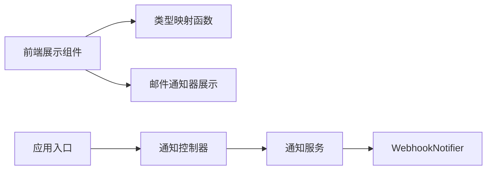

# 通知模板系统

<cite>
**本文引用的文件**
- [model.go](file://backend/internal/features/notifiers/models/webhook/model.go)
- [controller.go](file://backend/internal/features/notifiers/controller.go)
- [main.go](file://backend/cmd/main.go)
- [20251128120000_add_webhook_headers_and_body_template.sql](file://backend/migrations/20251128120000_add_webhook_headers_and_body_template.sql)
- [ShowNotifierComponent.tsx](file://frontend/src/features/notifiers/ui/show/ShowNotifierComponent.tsx)
- [ShowEmailNotifierComponent.tsx](file://frontend/src/features/notifiers/ui/show/notifier/ShowEmailNotifierComponent.tsx)
- [getNotifierNameFromType.ts](file://frontend/src/entity/notifiers/models/getNotifierNameFromType.ts)
- [getNotifierLogoFromType.ts](file://frontend/src/entity/notifiers/models/getNotifierLogoFromType.ts)
</cite>

## 目录
1. [简介](#简介)
2. [项目结构](#项目结构)
3. [核心组件](#核心组件)
4. [架构总览](#架构总览)
5. [详细组件分析](#详细组件分析)
6. [依赖分析](#依赖分析)
7. [性能考虑](#性能考虑)
8. [故障排查指南](#故障排查指南)
9. [结论](#结论)
10. [附录](#附录)

## 简介
本文件面向Databasus通知模板系统，聚焦Webhook通知中的模板语法与变量替换机制，覆盖以下主题：
- 模板语法与变量替换：{{heading}}、{{message}}等占位符的使用与转义规则
- 条件判断与循环结构：在模板中如何表达分支与迭代（当前实现以JSON对象为主）
- 字符串处理函数：JSON转义、URL编码等内置处理逻辑
- 多语言模板支持：本地化变量、日期/数字格式化的建议方案
- 模板预览与语法验证：前后端协同的校验与渲染流程
- 测试用例编写指南：针对模板替换与发送流程的测试要点
- 性能优化与缓存策略：模板解析缓存、敏感数据加密存储与传输
- 版本管理最佳实践：迁移脚本与字段演进

## 项目结构
通知模板系统主要由后端Webhook模型与前端展示组件构成，核心交互路径如下：
- 后端通过WebhookNotifier模型加载并解密敏感配置，构建请求体或查询参数
- 前端负责展示通知器类型与配置，并在需要时进行模板预览与校验

**图表来源**
- [model.go:1-278](file://backend/internal/features/notifiers/models/webhook/model.go#L1-L278)
- [controller.go:191-216](file://backend/internal/features/notifiers/controller.go#L191-L216)
- [main.go:36-264](file://backend/cmd/main.go#L36-L264)
- [ShowNotifierComponent.tsx:1-52](file://frontend/src/features/notifiers/ui/show/ShowNotifierComponent.tsx#L1-L52)
- [getNotifierNameFromType.ts:1-20](file://frontend/src/entity/notifiers/models/getNotifierNameFromType.ts#L1-L20)
- [getNotifierLogoFromType.ts:1-20](file://frontend/src/entity/notifiers/models/getNotifierLogoFromType.ts#L1-L20)

**章节来源**
- [model.go:1-278](file://backend/internal/features/notifiers/models/webhook/model.go#L1-L278)
- [controller.go:191-216](file://backend/internal/features/notifiers/controller.go#L191-L216)
- [main.go:36-264](file://backend/cmd/main.go#L36-L264)
- [ShowNotifierComponent.tsx:1-52](file://frontend/src/features/notifiers/ui/show/ShowNotifierComponent.tsx#L1-L52)
- [getNotifierNameFromType.ts:1-20](file://frontend/src/entity/notifiers/models/getNotifierNameFromType.ts#L1-L20)
- [getNotifierLogoFromType.ts:1-20](file://frontend/src/entity/notifiers/models/getNotifierLogoFromType.ts#L1-L20)

## 核心组件
- WebhookNotifier模型：负责Webhook URL、方法、请求头、请求体模板的持久化与运行时处理；支持敏感字段加密存储与发送前解密
- 通知控制器：提供通知器的增删改查与“发送测试通知”接口
- 应用入口：注册通知器路由与依赖注入
- 前端展示组件：根据通知器类型渲染对应配置项，辅助模板预览与校验

关键职责与边界：
- 模板语法与变量替换：在构建请求体时对模板中的占位符进行替换
- 敏感数据保护：仅在内存中临时解密用于发送，其余时间保持加密
- 请求发送：支持GET/POST两种方法，自动设置Content-Type（如未显式提供）

**章节来源**
- [model.go:30-141](file://backend/internal/features/notifiers/models/webhook/model.go#L30-L141)
- [controller.go:191-216](file://backend/internal/features/notifiers/controller.go#L191-L216)
- [main.go:244-264](file://backend/cmd/main.go#L244-L264)

## 架构总览
下图展示了从用户触发测试通知到后端执行模板替换与发送的整体流程。

**图表来源**
- [controller.go:191-216](file://backend/internal/features/notifiers/controller.go#L191-L216)
- [model.go:95-243](file://backend/internal/features/notifiers/models/webhook/model.go#L95-L243)

## 详细组件分析

### WebhookNotifier 模型与模板替换
该模型承担模板语法解析、变量替换、敏感数据处理与网络发送的职责。其核心流程如下：

- 数据加载与解密
  - 在AfterFind阶段，对Webhook URL与BodyTemplate进行解密，确保仅在运行时可见
  - 对请求头值进行解密以便发送时使用
- 模板替换
  - 当存在BodyTemplate时，将{{heading}}与{{message}}替换为转义后的JSON字符串
  - 若不存在模板，则默认构造包含heading与message的JSON对象
- 发送流程
  - GET：将heading与message作为查询参数附加到URL
  - POST：构建请求体并发送；若未设置Content-Type则默认为application/json
- 敏感数据保护
  - EncryptSensitiveData：对请求头值进行加密存储
  - HideSensitiveData：在对外展示时隐藏敏感值
  - decryptHeadersForSending：发送前临时解密

**图表来源**
- [model.go:21-141](file://backend/internal/features/notifiers/models/webhook/model.go#L21-L141)

**章节来源**
- [model.go:30-141](file://backend/internal/features/notifiers/models/webhook/model.go#L30-L141)
- [model.go:143-243](file://backend/internal/features/notifiers/models/webhook/model.go#L143-L243)
- [model.go:267-277](file://backend/internal/features/notifiers/models/webhook/model.go#L267-L277)

### 通知控制器与测试发送
- 路由注册：在应用入口中注册通知器相关路由
- 测试发送：提供SendTestNotification接口，接收通知器ID并触发一次测试消息发送

**图表来源**
- [controller.go:191-216](file://backend/internal/features/notifiers/controller.go#L191-L216)
- [main.go:244-264](file://backend/cmd/main.go#L244-L264)

**章节来源**
- [controller.go:191-216](file://backend/internal/features/notifiers/controller.go#L191-L216)
- [main.go:244-264](file://backend/cmd/main.go#L244-L264)

### 前端展示与模板预览
- 类型与图标映射：根据通知器类型返回人类可读名称与图标路径
- 针对不同通知器类型的展示组件：例如邮件通知器展示SMTP配置与发件人信息
- 模板预览：前端可基于当前输入进行占位符替换的预览（建议在表单提交前进行）

**图表来源**
- [ShowNotifierComponent.tsx:15-51](file://frontend/src/features/notifiers/ui/show/ShowNotifierComponent.tsx#L15-L51)
- [getNotifierNameFromType.ts:3-19](file://frontend/src/entity/notifiers/models/getNotifierNameFromType.ts#L3-L19)
- [getNotifierLogoFromType.ts:3-19](file://frontend/src/entity/notifiers/models/getNotifierLogoFromType.ts#L3-L19)
- [ShowEmailNotifierComponent.tsx:7-47](file://frontend/src/features/notifiers/ui/show/notifier/ShowEmailNotifierComponent.tsx#L7-L47)

**章节来源**
- [ShowNotifierComponent.tsx:1-52](file://frontend/src/features/notifiers/ui/show/ShowNotifierComponent.tsx#L1-L52)
- [getNotifierNameFromType.ts:1-20](file://frontend/src/entity/notifiers/models/getNotifierNameFromType.ts#L1-L20)
- [getNotifierLogoFromType.ts:1-20](file://frontend/src/entity/notifiers/models/getNotifierLogoFromType.ts#L1-L20)
- [ShowEmailNotifierComponent.tsx:1-48](file://frontend/src/features/notifiers/ui/show/notifier/ShowEmailNotifierComponent.tsx#L1-L48)

## 依赖分析
- 后端依赖
  - WebhookNotifier依赖加密工具进行敏感字段的加解密
  - 通知控制器依赖通知服务执行业务逻辑
  - 应用入口负责注册路由与依赖注入
- 前端依赖
  - 展示组件依赖类型映射函数与通知器配置模型
  - 通知器详情页根据类型动态渲染对应组件

**图表来源**
- [ShowNotifierComponent.tsx:1-52](file://frontend/src/features/notifiers/ui/show/ShowNotifierComponent.tsx#L1-L52)
- [getNotifierNameFromType.ts:1-20](file://frontend/src/entity/notifiers/models/getNotifierNameFromType.ts#L1-L20)
- [getNotifierLogoFromType.ts:1-20](file://frontend/src/entity/notifiers/models/getNotifierLogoFromType.ts#L1-L20)
- [controller.go:191-216](file://backend/internal/features/notifiers/controller.go#L191-L216)
- [main.go:244-264](file://backend/cmd/main.go#L244-L264)

**章节来源**
- [controller.go:191-216](file://backend/internal/features/notifiers/controller.go#L191-L216)
- [main.go:244-264](file://backend/cmd/main.go#L244-L264)

## 性能考虑
- 模板解析缓存
  - 对于重复使用的BodyTemplate，可在内存中缓存解析后的模板键，避免每次发送都进行字符串替换
- 敏感数据处理
  - 解密仅在发送前进行，其他时间保持加密，减少明文暴露窗口
- 网络请求优化
  - 复用HTTP客户端连接，设置合理的超时与重试策略
- 前端预览
  - 在表单提交前进行模板预览与基本语法校验，降低后端压力

[本节为通用指导，无需特定文件引用]

## 故障排查指南
- 常见问题
  - Webhook URL为空或不合法：Validate会返回错误
  - 不支持的HTTP方法：Send会返回错误
  - 请求头值为空：EncryptSensitiveData会跳过加密
  - GET/POST响应非2xx：记录状态码与响应体
- 排查步骤
  - 检查通知器配置是否完整
  - 查看日志输出，定位发送失败的具体环节
  - 使用“发送测试通知”接口快速验证

**章节来源**
- [model.go:83-93](file://backend/internal/features/notifiers/models/webhook/model.go#L83-L93)
- [model.go:105-112](file://backend/internal/features/notifiers/models/webhook/model.go#L105-L112)
- [model.go:169-176](file://backend/internal/features/notifiers/models/webhook/model.go#L169-L176)
- [model.go:216-223](file://backend/internal/features/notifiers/models/webhook/model.go#L216-L223)

## 结论
Databasus通知模板系统围绕WebhookNotifier模型实现了简洁而实用的模板语法与变量替换机制。通过敏感数据加密存储与发送前解密、GET/POST双模式发送以及完善的错误处理，系统在保证安全性的同时提供了良好的扩展性。建议在后续版本中引入更丰富的模板语法（如条件判断与循环）、多语言本地化支持与模板缓存策略，以进一步提升用户体验与性能表现。

[本节为总结性内容，无需特定文件引用]

## 附录

### 模板语法与变量替换说明
- 支持的占位符
  - {{heading}}：标题文本
  - {{message}}：正文文本
- 替换规则
  - 当存在BodyTemplate时，上述占位符会被替换为转义后的JSON字符串
  - 若不存在BodyTemplate，则默认构造包含heading与message的JSON对象
- 字符串处理
  - escapeJSONString：对特殊字符进行JSON安全转义
  - URL编码：GET方法将heading与message作为查询参数传递

**章节来源**
- [model.go:228-243](file://backend/internal/features/notifiers/models/webhook/model.go#L228-L243)
- [model.go:253-265](file://backend/internal/features/notifiers/models/webhook/model.go#L253-L265)
- [model.go:143-148](file://backend/internal/features/notifiers/models/webhook/model.go#L143-L148)

### 多语言模板支持与本地化建议
- 本地化变量
  - 可在模板中预留语言相关占位符，如{{locale}}，并在构建请求体前替换为目标语言标识
- 日期与数字格式化
  - 建议在调用方（前端或服务层）完成日期/数字格式化后再传入模板
- 实施建议
  - 将语言环境与格式化规则作为上下文参数传入模板替换流程

[本节为概念性建议，无需特定文件引用]

### 模板预览与语法验证
- 前端预览
  - 在表单中提供“预览”按钮，将输入的heading与message代入模板进行渲染
- 语法验证
  - 基础验证：检查占位符是否成对出现
  - JSON验证：当模板为JSON时，验证其合法性
- 错误提示
  - 对缺失必填字段、非法占位符、JSON语法错误等情况给出明确提示

[本节为通用指导，无需特定文件引用]

### 测试用例编写指南
- 单元测试
  - 验证模板替换：输入不同的heading/message，断言输出符合预期
  - 验证敏感数据处理：确认加密存储与发送前解密流程正确
  - 验证错误场景：空URL、不支持的方法、非2xx响应
- 集成测试
  - 调用“发送测试通知”接口，验证端到端流程
- 前端测试
  - 验证不同类型通知器的展示组件渲染正确
  - 验证模板预览功能

**章节来源**
- [controller.go:191-216](file://backend/internal/features/notifiers/controller.go#L191-L216)
- [ShowNotifierComponent.tsx:1-52](file://frontend/src/features/notifiers/ui/show/ShowNotifierComponent.tsx#L1-L52)

### 版本管理与迁移
- 迁移脚本
  - 20251128120000_add_webhook_headers_and_body_template.sql：新增headers与body_template字段，支持模板与请求头配置
- 版本演进
  - 通过迁移脚本平滑添加新字段，保持向后兼容
  - 在模型层保留解密逻辑以兼容旧数据

**章节来源**
- [20251128120000_add_webhook_headers_and_body_template.sql:1-200](file://backend/migrations/20251128120000_add_webhook_headers_and_body_template.sql#L1-L200)
- [model.go:26-29](file://backend/internal/features/notifiers/models/webhook/model.go#L26-L29)