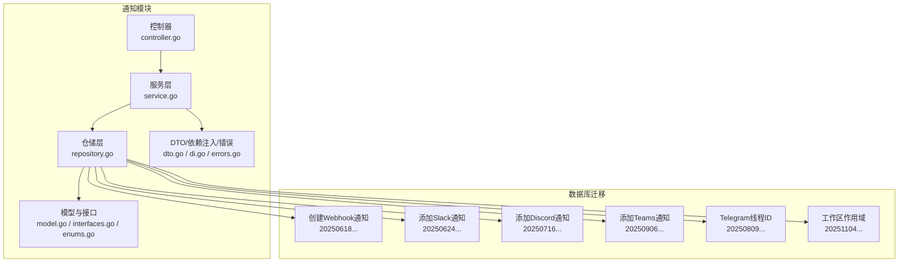
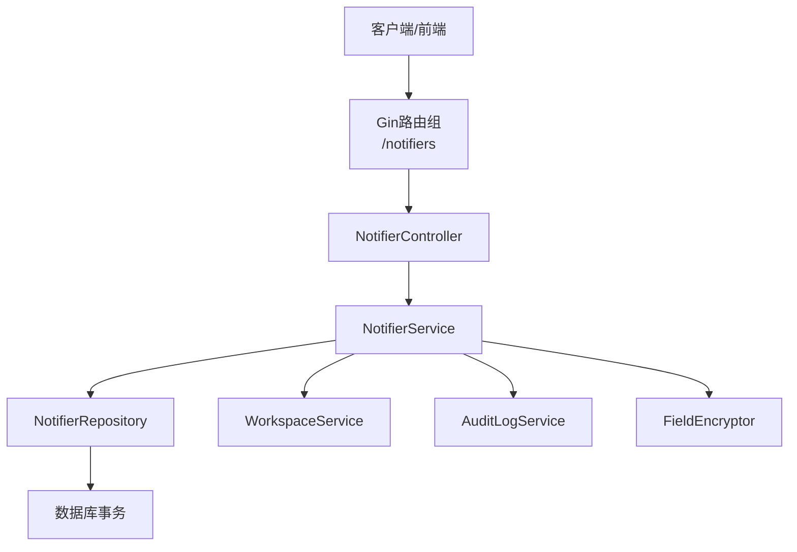
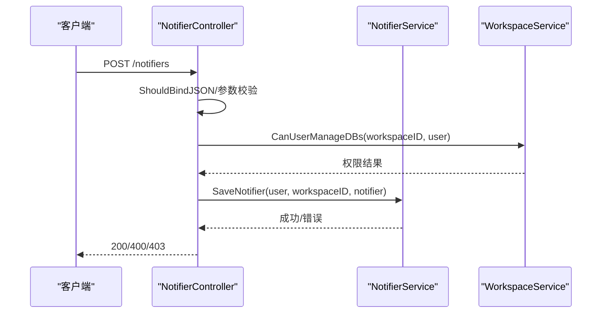
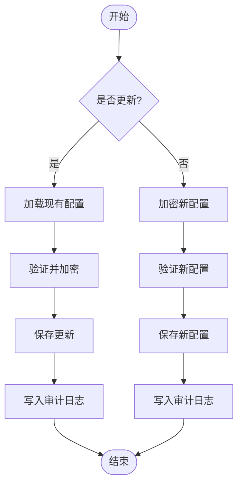
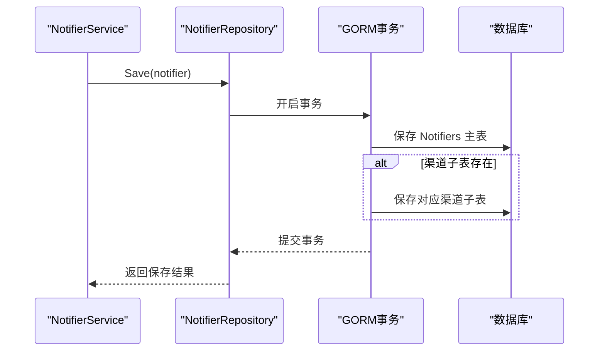
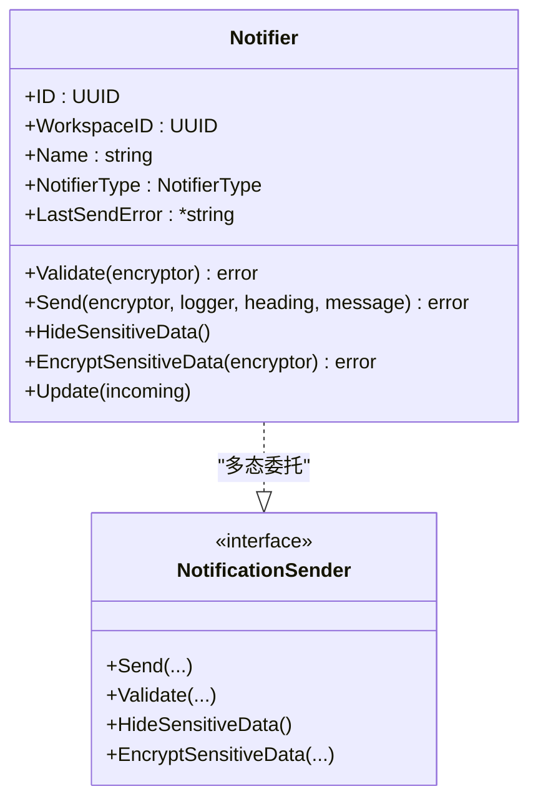
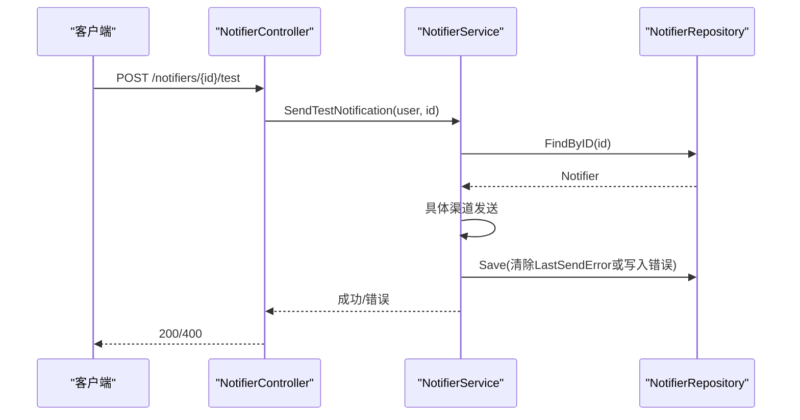
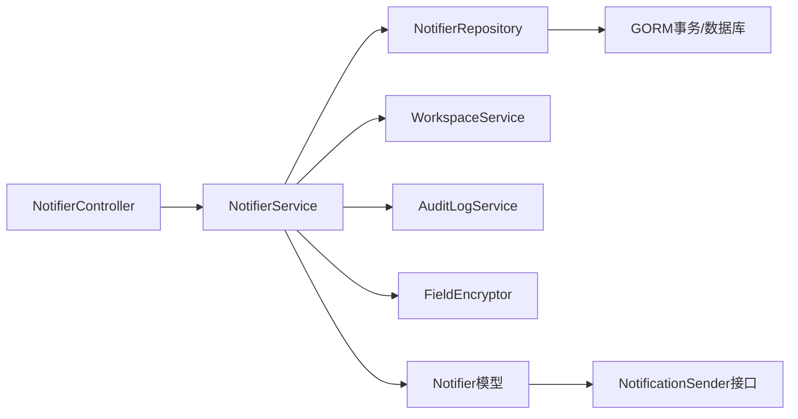

# 通知管理与监控

<cite>
**本文档引用的文件**
- [controller.go](file://backend/internal/features/notifiers/controller.go)
- [service.go](file://backend/internal/features/notifiers/service.go)
- [repository.go](file://backend/internal/features/notifiers/repository.go)
- [model.go](file://backend/internal/features/notifiers/model.go)
- [enums.go](file://backend/internal/features/notifiers/enums.go)
- [interfaces.go](file://backend/internal/features/notifiers/interfaces.go)
- [dto.go](file://backend/internal/features/notifiers/dto.go)
- [di.go](file://backend/internal/features/notifiers/di.go)
- [errors.go](file://backend/internal/features/notifiers/errors.go)
- [testing.go](file://backend/internal/features/notifiers/testing.go)
- [20250618203654_create_webhook_notifiers.sql](file://backend/migrations/20250618203654_create_webhook_notifiers.sql)
- [20250624065518_add_slack_notifier.sql](file://backend/migrations/20250624065518_add_slack_notifier.sql)
- [20250716072247_add_discord_notifier.sql](file://backend/migrations/20250716072247_add_discord_notifier.sql)
- [20250906152330_add_ms_teams_notifier.sql](file://backend/migrations/20250906152330_add_ms_teams_notifier.sql)
- [20250809062256_add_telegram_thread_id.sql](file://backend/migrations/20250809062256_add_telegram_thread_id.sql)
- [20251104000000_workspace_scope_storages_notifiers.sql](file://backend/migrations/20251104000000_workspace_scope_storages_notifiers.sql)
- [20251116075135_add_virtual_host_and_prefix_to_s3.sql](file://backend/migrations/20251116075135_add_virtual_host_and_prefix_to_s3.sql)
- [20251213180403_add_ftp_storages.sql](file://backend/migrations/20251213180403_add_ftp_storages.sql)
- [20251219220027_add_sftp_storages.sql](file://backend/migrations/20251219220027_add_sftp_storages.sql)
- [20251219230000_add_cron_expression.sql](file://backend/migrations/20251219230000_add_cron_expression.sql)
- [20260308120000_add_insecure_skip_verify_to_email_notifiers.sql](file://backend/migrations/20260308120000_add_insecure_skip_verify_to_email_notifiers.sql)
- [20260316151706_add_upload_completed_at.sql](file://backend/migrations/20260316151706_add_upload_completed_at.sql)
- [20260327090334_add_is_skipped_to_webhook_records.sql](file://backend/migrations/20260327090334_add_is_skipped_to_webhook_records.sql)
- [20260402055223_add_storage_class_to_s3.sql](file://backend/migrations/20260402055223_add_storage_class_to_s3.sql)
</cite>

## 目录
1. [简介](#简介)
2. [项目结构](#项目结构)
3. [核心组件](#核心组件)
4. [架构总览](#架构总览)
5. [详细组件分析](#详细组件分析)
6. [依赖关系分析](#依赖关系分析)
7. [性能考虑](#性能考虑)
8. [故障排除指南](#故障排除指南)
9. [结论](#结论)
10. [附录](#附录)

## 简介
本文件面向Databasus通知管理与监控功能，系统性阐述通知配置的增删改查、权限校验、测试发送、工作区迁移等能力；解释通知发送历史记录、状态跟踪与失败重试机制；文档化通知统计分析（成功率、延迟、错误分类）与导入导出、批量操作、模板共享机制；并提供性能监控、容量规划与成本控制的管理指南。本文所有技术细节均基于后端代码与数据库迁移脚本进行归纳总结。

## 项目结构
通知相关代码主要位于后端模块的notifiers包中，采用分层设计：控制器负责HTTP路由与鉴权校验，服务层封装业务逻辑与权限控制，仓储层处理数据持久化与关联表事务，模型层定义通知实体与多态发送接口。同时，数据库迁移脚本支持多种通知渠道（邮件、Telegram、Webhook、Slack、Discord、Teams）及扩展字段。



**图表来源**
- [controller.go:19-27](file://backend/internal/features/notifiers/controller.go#L19-L27)
- [service.go:15-22](file://backend/internal/features/notifiers/service.go#L15-L22)
- [repository.go:10](file://backend/internal/features/notifiers/repository.go#L10)
- [model.go:18-36](file://backend/internal/features/notifiers/model.go#L18-L36)
- [enums.go:3-12](file://backend/internal/features/notifiers/enums.go#L3-L12)
- [20250618203654_create_webhook_notifiers.sql](file://backend/migrations/20250618203654_create_webhook_notifiers.sql)
- [20250624065518_add_slack_notifier.sql](file://backend/migrations/20250624065518_add_slack_notifier.sql)
- [20250716072247_add_discord_notifier.sql](file://backend/migrations/20250716072247_add_discord_notifier.sql)
- [20250906152330_add_ms_teams_notifier.sql](file://backend/migrations/20250906152330_add_ms_teams_notifier.sql)
- [20250809062256_add_telegram_thread_id.sql](file://backend/migrations/20250809062256_add_telegram_thread_id.sql)
- [20251104000000_workspace_scope_storages_notifiers.sql](file://backend/migrations/20251104000000_workspace_scope_storages_notifiers.sql)

**章节来源**
- [controller.go:19-27](file://backend/internal/features/notifiers/controller.go#L19-L27)
- [service.go:15-22](file://backend/internal/features/notifiers/service.go#L15-L22)
- [repository.go:10](file://backend/internal/features/notifiers/repository.go#L10)
- [model.go:18-36](file://backend/internal/features/notifiers/model.go#L18-L36)
- [enums.go:3-12](file://backend/internal/features/notifiers/enums.go#L3-L12)

## 核心组件
- 控制器层：提供REST API路由，统一鉴权与参数校验，调用服务层执行业务。
- 服务层：封装权限检查、配置保存/删除/查询、测试发送、工作区迁移、审计日志写入。
- 仓储层：基于GORM事务处理通知主表与各渠道子表的联合持久化与删除。
- 模型层：定义通知实体、多态发送接口、敏感信息隐藏与加密、更新合并策略。
- 枚举与接口：统一通知类型枚举与发送接口契约。
- 数据库迁移：支持多渠道通知表结构与字段演进。

**章节来源**
- [controller.go:42-70](file://backend/internal/features/notifiers/controller.go#L42-L70)
- [service.go:30-113](file://backend/internal/features/notifiers/service.go#L30-L113)
- [repository.go:12-123](file://backend/internal/features/notifiers/repository.go#L12-L123)
- [model.go:38-70](file://backend/internal/features/notifiers/model.go#L38-L70)
- [enums.go:3-12](file://backend/internal/features/notifiers/enums.go#L3-L12)
- [interfaces.go:11-28](file://backend/internal/features/notifiers/interfaces.go#L11-L28)

## 架构总览
通知模块遵循清晰的分层架构，控制器仅负责输入校验与鉴权，服务层承担业务规则与跨组件协调，仓储层专注数据一致性与事务边界，模型层抽象多态发送行为。



**图表来源**
- [controller.go:19-27](file://backend/internal/features/notifiers/controller.go#L19-L27)
- [service.go:15-22](file://backend/internal/features/notifiers/service.go#L15-L22)
- [repository.go:12-123](file://backend/internal/features/notifiers/repository.go#L12-L123)

## 详细组件分析

### 控制器：REST API与权限校验
- 路由注册：POST/GET/DELETE/POST 测试/转移等完整CRUD与运维操作。
- 鉴权与参数校验：从上下文提取用户信息，校验UUID参数与必填字段，返回标准化错误码。
- 权限控制：针对不同操作分别校验“可管理”“可查看”“可测试”等权限，拒绝时返回403。



**图表来源**
- [controller.go:42-70](file://backend/internal/features/notifiers/controller.go#L42-L70)
- [service.go:30-41](file://backend/internal/features/notifiers/service.go#L30-L41)

**章节来源**
- [controller.go:19-27](file://backend/internal/features/notifiers/controller.go#L19-L27)
- [controller.go:42-70](file://backend/internal/features/notifiers/controller.go#L42-L70)
- [controller.go:84-108](file://backend/internal/features/notifiers/controller.go#L84-L108)
- [controller.go:122-152](file://backend/internal/features/notifiers/controller.go#L122-L152)
- [controller.go:166-189](file://backend/internal/features/notifiers/controller.go#L166-L189)
- [controller.go:203-226](file://backend/internal/features/notifiers/controller.go#L203-L226)
- [controller.go:242-282](file://backend/internal/features/notifiers/controller.go#L242-L282)
- [controller.go:297-334](file://backend/internal/features/notifiers/controller.go#L297-L334)

### 服务层：业务逻辑与状态管理
- 保存配置：区分新增与更新，执行敏感字段加密、配置验证、审计日志记录。
- 删除配置：校验用户权限与是否被数据库使用，若仍有关联则阻止删除。
- 查询配置：按工作区查询并隐藏敏感信息；单个查询需具备查看权限。
- 测试发送：根据权限决定从数据库加载或直接使用传入配置进行测试。
- 发送通知：截断超长消息，调用具体渠道发送，记录最后错误状态并持久化。
- 工作区迁移：校验源/目标工作区权限，确保无其他数据库关联方可迁移，并记录审计日志。



**图表来源**
- [service.go:30-113](file://backend/internal/features/notifiers/service.go#L30-L113)

**章节来源**
- [service.go:30-113](file://backend/internal/features/notifiers/service.go#L30-L113)
- [service.go:115-154](file://backend/internal/features/notifiers/service.go#L115-L154)
- [service.go:156-207](file://backend/internal/features/notifiers/service.go#L156-L207)
- [service.go:209-237](file://backend/internal/features/notifiers/service.go#L209-L237)
- [service.go:239-274](file://backend/internal/features/notifiers/service.go#L239-L274)
- [service.go:276-308](file://backend/internal/features/notifiers/service.go#L276-L308)
- [service.go:310-380](file://backend/internal/features/notifiers/service.go#L310-L380)

### 仓储层：事务与多表持久化
- 保存：根据通知类型设置外键，先保存主表，再保存对应渠道子表；支持新增与更新。
- 查询：按ID/工作区查询并预加载各渠道子表；支持全量查询。
- 删除：先删除对应渠道子表，再删除主表，保证外键约束一致。



**图表来源**
- [repository.go:12-123](file://backend/internal/features/notifiers/repository.go#L12-L123)

**章节来源**
- [repository.go:12-123](file://backend/internal/features/notifiers/repository.go#L12-L123)
- [repository.go:125-172](file://backend/internal/features/notifiers/repository.go#L125-L172)
- [repository.go:174-217](file://backend/internal/features/notifiers/repository.go#L174-L217)

### 模型与接口：多态发送与安全
- 多态发送：通过NotifierType选择具体渠道发送器，统一Validate/HideSensitiveData/EncryptSensitiveData/Update等操作。
- 敏感信息处理：在保存前加密、在返回前隐藏，避免泄露。
- 错误状态：发送失败时记录LastSendError，成功则清空该字段。



**图表来源**
- [model.go:18-122](file://backend/internal/features/notifiers/model.go#L18-L122)
- [interfaces.go:11-24](file://backend/internal/features/notifiers/interfaces.go#L11-L24)
- [enums.go:3-12](file://backend/internal/features/notifiers/enums.go#L3-L12)

**章节来源**
- [model.go:38-70](file://backend/internal/features/notifiers/model.go#L38-L70)
- [model.go:104-121](file://backend/internal/features/notifiers/model.go#L104-L121)
- [interfaces.go:11-24](file://backend/internal/features/notifiers/interfaces.go#L11-L24)

### 通知渠道与数据库结构
- 支持渠道：EMAIL、TELEGRAM、WEBHOOK、SLACK、DISCORD、TEAMS。
- 关系模型：Notifiers为主表，各渠道以一对一子表形式存在，通过外键关联。
- 迁移演进：持续增加渠道与字段（如Telegram线程ID、Teams、邮件跳过TLS校验等）。

```mermaid
erDiagram
NOTIFIERS {
uuid id PK
uuid workspace_id FK
varchar name
varchar notifier_type
text last_send_error
}
TELEGRAM_NOTIFIERS {
uuid id PK
uuid notifiers_id FK
-- 渠道特定字段 --
}
EMAIL_NOTIFIERS {
uuid id PK
uuid notifiers_id FK
-- 渠道特定字段 --
}
WEBHOOK_NOTIFIERS {
uuid id PK
uuid notifiers_id FK
-- 渠道特定字段 --
}
SLACK_NOTIFIERS {
uuid id PK
uuid notifiers_id FK
-- 渠道特定字段 --
}
DISCORD_NOTIFIERS {
uuid id PK
uuid notifiers_id FK
-- 渠道特定字段 --
}
TEAMS_NOTIFIERS {
uuid id PK
uuid notifiers_id FK
-- 渠道特定字段 --
}
NOTIFIERS ||--|| TELEGRAM_NOTIFIERS : "一对一"
NOTIFIERS ||--|| EMAIL_NOTIFIERS : "一对一"
NOTIFIERS ||--|| WEBHOOK_NOTIFIERS : "一对一"
NOTIFIERS ||--|| SLACK_NOTIFIERS : "一对一"
NOTIFIERS ||--|| DISCORD_NOTIFIERS : "一对一"
NOTIFIERS ||--|| TEAMS_NOTIFIERS : "一对一"
```

**图表来源**
- [20250618203654_create_webhook_notifiers.sql](file://backend/migrations/20250618203654_create_webhook_notifiers.sql)
- [20250624065518_add_slack_notifier.sql](file://backend/migrations/20250624065518_add_slack_notifier.sql)
- [20250716072247_add_discord_notifier.sql](file://backend/migrations/20250716072247_add_discord_notifier.sql)
- [20250906152330_add_ms_teams_notifier.sql](file://backend/migrations/20250906152330_add_ms_teams_notifier.sql)
- [20250809062256_add_telegram_thread_id.sql](file://backend/migrations/20250809062256_add_telegram_thread_id.sql)
- [20251104000000_workspace_scope_storages_notifiers.sql](file://backend/migrations/20251104000000_workspace_scope_storages_notifiers.sql)

**章节来源**
- [enums.go:5-12](file://backend/internal/features/notifiers/enums.go#L5-L12)
- [20250618203654_create_webhook_notifiers.sql](file://backend/migrations/20250618203654_create_webhook_notifiers.sql)
- [20250624065518_add_slack_notifier.sql](file://backend/migrations/20250624065518_add_slack_notifier.sql)
- [20250716072247_add_discord_notifier.sql](file://backend/migrations/20250716072247_add_discord_notifier.sql)
- [20250906152330_add_ms_teams_notifier.sql](file://backend/migrations/20250906152330_add_ms_teams_notifier.sql)
- [20250809062256_add_telegram_thread_id.sql](file://backend/migrations/20250809062256_add_telegram_thread_id.sql)
- [20251104000000_workspace_scope_storages_notifiers.sql](file://backend/migrations/20251104000000_workspace_scope_storages_notifiers.sql)

### 测试发送与失败重试机制
- 测试发送：支持两种路径——从数据库加载指定ID配置进行测试，或直接使用请求体中的临时配置进行测试。
- 失败重试：当前实现未见显式自动重试逻辑；发送失败会记录LastSendError，建议结合外部调度器或后台任务实现重试队列。



**图表来源**
- [controller.go:203-226](file://backend/internal/features/notifiers/controller.go#L203-L226)
- [service.go:209-237](file://backend/internal/features/notifiers/service.go#L209-L237)
- [service.go:276-308](file://backend/internal/features/notifiers/service.go#L276-L308)

**章节来源**
- [controller.go:203-226](file://backend/internal/features/notifiers/controller.go#L203-L226)
- [service.go:209-237](file://backend/internal/features/notifiers/service.go#L209-L237)
- [service.go:276-308](file://backend/internal/features/notifiers/service.go#L276-L308)

### 统计分析与监控指标
- 发送历史与状态：LastSendError用于记录最近一次发送错误；建议在UI层展示发送时间、标题、消息摘要与状态。
- 成功率：可通过统计成功/失败次数计算；建议在后台服务中定期汇总并存储到监控表。
- 延迟统计：可在发送入口埋点记录发送耗时，聚合后生成P95/P99延迟。
- 错误分类：根据错误类型（网络、认证、配额、渠道限制）进行分类统计，便于定位问题渠道。

[本节为概念性说明，不直接分析具体文件]

### 导入导出、批量操作与模板共享
- 导入导出：建议通过工作区维度导出通知配置（含敏感字段加密存储），导入时进行配置验证与权限校验。
- 批量操作：支持批量删除、批量迁移至其他工作区（需满足无关联数据库的条件）。
- 模板共享：通过工作区范围内的通知配置共享机制，实现跨数据库复用同一通知模板。

[本节为概念性说明，不直接分析具体文件]

## 依赖关系分析
- 控制器依赖服务层与工作区服务进行权限校验。
- 服务层依赖仓储层、工作区服务、审计日志服务与字段加密器。
- 仓储层依赖数据库连接与GORM事务，处理主表与子表的联合操作。
- 模型层依赖各渠道子模型，实现多态发送与安全处理。



**图表来源**
- [controller.go:14-17](file://backend/internal/features/notifiers/controller.go#L14-L17)
- [service.go:15-22](file://backend/internal/features/notifiers/service.go#L15-L22)
- [repository.go:12-123](file://backend/internal/features/notifiers/repository.go#L12-L123)
- [model.go:104-121](file://backend/internal/features/notifiers/model.go#L104-L121)

**章节来源**
- [controller.go:14-17](file://backend/internal/features/notifiers/controller.go#L14-L17)
- [service.go:15-22](file://backend/internal/features/notifiers/service.go#L15-L22)
- [repository.go:12-123](file://backend/internal/features/notifiers/repository.go#L12-L123)
- [model.go:104-121](file://backend/internal/features/notifiers/model.go#L104-L121)

## 性能考虑
- 发送吞吐：对超长消息进行截断，避免单次发送过大导致资源占用。
- 数据库事务：保存与删除均在事务内完成，确保一致性但可能影响并发写入性能，建议合理拆分写入与读取。
- 审计日志：每次变更均写入审计日志，建议异步化或批量写入以降低写放大。
- 加密开销：敏感字段加密在保存前后执行，建议评估CPU开销并缓存必要密钥材料。

**章节来源**
- [service.go:281-285](file://backend/internal/features/notifiers/service.go#L281-L285)
- [service.go:57-59](file://backend/internal/features/notifiers/service.go#L57-L59)
- [model.go:68-70](file://backend/internal/features/notifiers/model.go#L68-L70)

## 故障排除指南
- 权限不足：当返回403时，检查当前用户在目标工作区的权限与操作类型。
- 参数错误：当返回400时，检查请求体格式、UUID合法性与必填字段。
- 渠道配置错误：查看LastSendError字段获取具体错误信息，逐项核对渠道配置。
- 删除失败：若提示仍有关联数据库，请先解除关联后再删除。

**章节来源**
- [controller.go:60-67](file://backend/internal/features/notifiers/controller.go#L60-L67)
- [controller.go:98-105](file://backend/internal/features/notifiers/controller.go#L98-L105)
- [controller.go:142-149](file://backend/internal/features/notifiers/controller.go#L142-L149)
- [controller.go:179-186](file://backend/internal/features/notifiers/controller.go#L179-L186)
- [service.go:138-140](file://backend/internal/features/notifiers/service.go#L138-L140)

## 结论
Databasus通知模块提供了完善的通知配置管理、权限控制与测试发送能力，并通过审计日志与敏感信息保护保障安全性。当前实现未内置自动重试机制，建议结合外部调度实现失败重试与统计分析。通过工作区作用域与迁移能力，可实现通知配置的灵活共享与治理。后续可在监控与统计方面进一步增强，以支撑更精细化的运营与成本控制。

## 附录
- 数据库迁移要点：关注渠道表结构变化与字段演进，确保生产环境迁移顺序与兼容性。
- 安全建议：定期轮换密钥、最小权限原则、审计日志保留策略。

**章节来源**
- [20250618203654_create_webhook_notifiers.sql](file://backend/migrations/20250618203654_create_webhook_notifiers.sql)
- [20250624065518_add_slack_notifier.sql](file://backend/migrations/20250624065518_add_slack_notifier.sql)
- [20250716072247_add_discord_notifier.sql](file://backend/migrations/20250716072247_add_discord_notifier.sql)
- [20250906152330_add_ms_teams_notifier.sql](file://backend/migrations/20250906152330_add_ms_teams_notifier.sql)
- [20250809062256_add_telegram_thread_id.sql](file://backend/migrations/20250809062256_add_telegram_thread_id.sql)
- [20251104000000_workspace_scope_storages_notifiers.sql](file://backend/migrations/20251104000000_workspace_scope_storages_notifiers.sql)