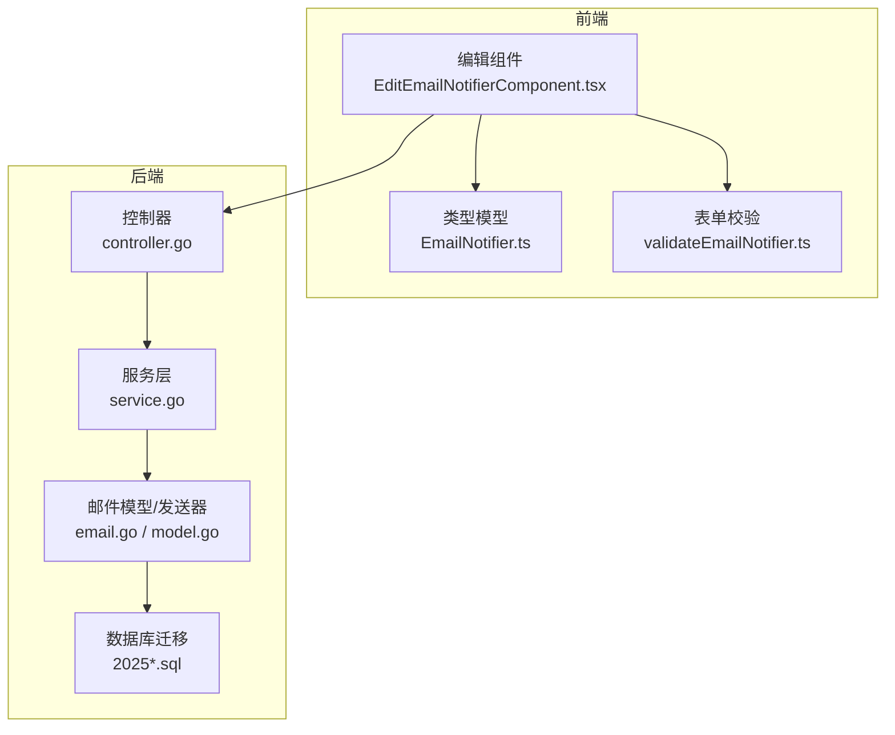
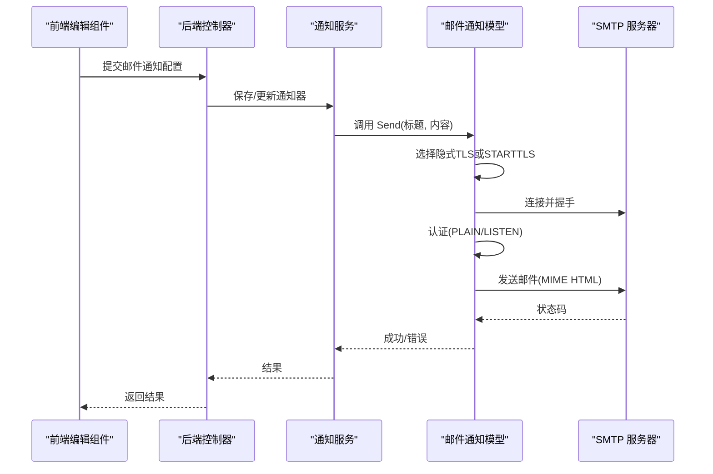
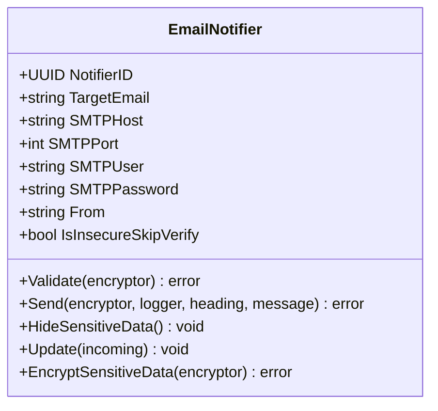
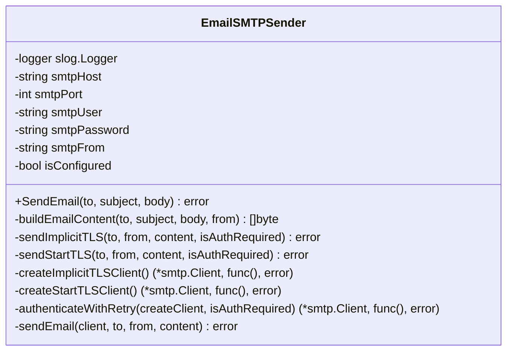
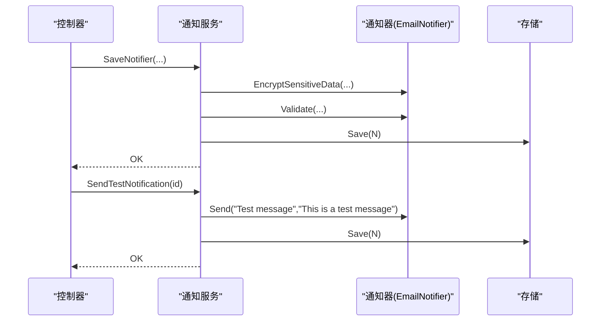
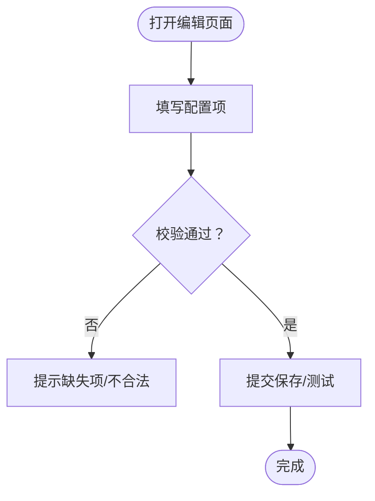
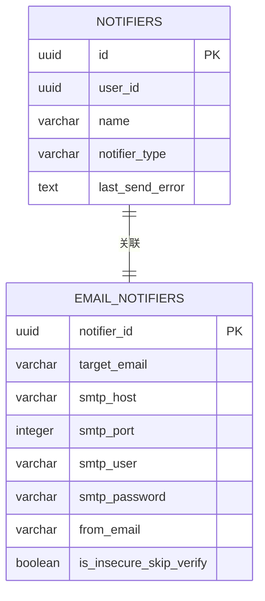
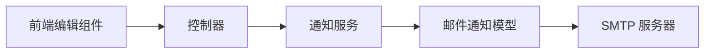
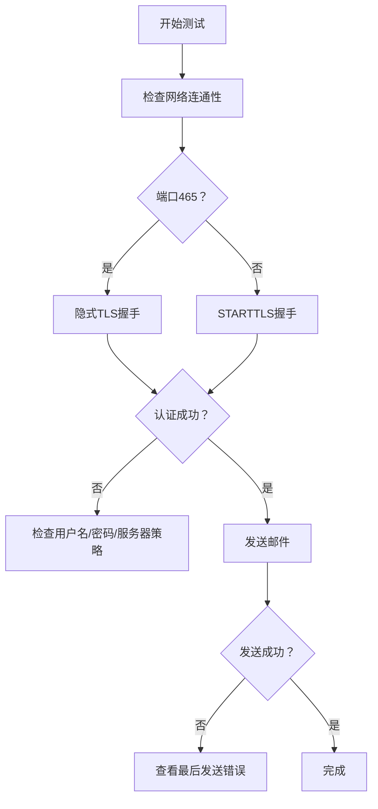

# 邮件通知

<cite>
**本文引用的文件**
- [model.go](file://backend/internal/features/notifiers/models/email_notifier/model.go)
- [email.go](file://backend/internal/features/email/email.go)
- [service.go](file://backend/internal/features/notifiers/service.go)
- [controller.go](file://backend/internal/features/notifiers/controller.go)
- [20250605090323_init.sql](file://backend/migrations/20250605090323_init.sql)
- [20250715102801_allow_unauthorized_smtp.sql](file://backend/migrations/20250715102801_allow_unauthorized_smtp.sql)
- [20251108173913_add_from_to_email_notifier.sql](file://backend/migrations/20251108173913_add_from_to_email_notifier.sql)
- [20260308120000_add_insecure_skip_verify_to_email_notifiers.sql](file://backend/migrations/20260308120000_add_insecure_skip_verify_to_email_notifiers.sql)
- [EditEmailNotifierComponent.tsx](file://frontend/src/features/notifiers/ui/edit/notifiers/EditEmailNotifierComponent.tsx)
- [validateEmailNotifier.ts](file://frontend/src/entity/notifiers/models/email/validateEmailNotifier.ts)
- [EmailNotifier.ts](file://frontend/src/entity/notifiers/models/email/EmailNotifier.ts)
- [mocks.go](file://backend/internal/features/workspaces/testing/mocks.go)
</cite>

## 目录
1. [简介](#简介)
2. [项目结构](#项目结构)
3. [核心组件](#核心组件)
4. [架构总览](#架构总览)
5. [详细组件分析](#详细组件分析)
6. [依赖分析](#依赖分析)
7. [性能考虑](#性能考虑)
8. [故障排除指南](#故障排除指南)
9. [结论](#结论)
10. [附录](#附录)

## 简介
本文件面向 Databasus 的邮件通知功能，提供从配置到发送、从模板到测试的完整说明。重点覆盖：
- SMTP 服务器配置：主机、端口、认证方式（用户名/密码、可选认证）
- 加密与安全：隐式 TLS（端口 465）、STARTTLS、证书校验跳过选项
- 邮件内容：HTML 格式、主题与发件人编码、头部兼容性
- 测试流程：后端控制器与服务层测试接口
- 常见问题与排错：连接失败、认证失败、证书问题
- 扩展能力：批量发送建议、附件处理注意事项

## 项目结构
邮件通知功能由后端 Notifiers 模块与前端编辑界面协同实现，并通过数据库迁移定义存储结构。

图表来源
- [controller.go:19-27](file://backend/internal/features/notifiers/controller.go#L19-L27)
- [service.go:15-22](file://backend/internal/features/notifiers/service.go#L15-L22)
- [email.go:22-30](file://backend/internal/features/email/email.go#L22-L30)
- [model.go:27-36](file://backend/internal/features/notifiers/models/email_notifier/model.go#L27-L36)
- [20250605090323_init.sql:47-61](file://backend/migrations/20250605090323_init.sql#L47-L61)

章节来源
- [controller.go:19-27](file://backend/internal/features/notifiers/controller.go#L19-L27)
- [service.go:15-22](file://backend/internal/features/notifiers/service.go#L15-L22)
- [email.go:22-30](file://backend/internal/features/email/email.go#L22-L30)
- [model.go:27-36](file://backend/internal/features/notifiers/models/email_notifier/model.go#L27-L36)
- [20250605090323_init.sql:47-61](file://backend/migrations/20250605090323_init.sql#L47-L61)

## 核心组件
- 邮件通知模型（后端）：负责构建邮件内容、选择加密模式、执行认证与发送。
- 邮件发送器（后端）：独立的 SMTP 发送器，支持隐式 TLS 与 STARTTLS。
- 通知服务（后端）：封装保存、测试、发送通知的业务逻辑。
- 控制器（后端）：暴露 REST 接口，供前端调用。
- 前端编辑组件：提供 SMTP 配置输入、高级选项（如跳过 TLS 校验）。
- 数据库迁移：定义 email_notifiers 表及字段演进。

章节来源
- [model.go:27-36](file://backend/internal/features/notifiers/models/email_notifier/model.go#L27-L36)
- [email.go:22-30](file://backend/internal/features/email/email.go#L22-L30)
- [service.go:15-22](file://backend/internal/features/notifiers/service.go#L15-L22)
- [controller.go:19-27](file://backend/internal/features/notifiers/controller.go#L19-L27)
- [EditEmailNotifierComponent.tsx:114-219](file://frontend/src/features/notifiers/ui/edit/notifiers/EditEmailNotifierComponent.tsx#L114-L219)
- [20250605090323_init.sql:47-61](file://backend/migrations/20250605090323_init.sql#L47-L61)

## 架构总览
下图展示从前端配置到后端发送的整体流程。

图表来源
- [controller.go:42-70](file://backend/internal/features/notifiers/controller.go#L42-L70)
- [service.go:30-113](file://backend/internal/features/notifiers/service.go#L30-L113)
- [model.go:63-93](file://backend/internal/features/notifiers/models/email_notifier/model.go#L63-L93)
- [email.go:32-54](file://backend/internal/features/email/email.go#L32-L54)

## 详细组件分析

### 后端邮件通知模型（EmailNotifier）
- 字段与约束
  - 必填项：目标邮箱、SMTP 主机、SMTP 端口
  - 可选认证：当提供用户名时，密码也必须提供；两者皆空则无需认证
  - 新增字段：发件人地址、TLS 校验证书跳过开关
- 发送流程
  - 自动选择加密模式：端口为 465 使用隐式 TLS；否则使用 STARTTLS
  - 支持两种认证：PLAIN 优先，失败后尝试 LOGIN
  - 构建 MIME HTML 邮件，自动编码主题与发件人显示名
- 安全与兼容
  - RFC 2047 编码用于非 ASCII 头部，避免 SMTPUTF8 要求
  - TLS 配置支持跳过证书校验（仅在自签名证书场景）

图表来源
- [model.go:27-121](file://backend/internal/features/notifiers/models/email_notifier/model.go#L27-L121)

章节来源
- [model.go:42-61](file://backend/internal/features/notifiers/models/email_notifier/model.go#L42-L61)
- [model.go:63-93](file://backend/internal/features/notifiers/models/email_notifier/model.go#L63-L93)
- [model.go:134-163](file://backend/internal/features/notifiers/models/email_notifier/model.go#L134-L163)
- [model.go:165-295](file://backend/internal/features/notifiers/models/email_notifier/model.go#L165-L295)

### 独立 SMTP 发送器（EmailSMTPSender）
- 用途：作为通用 SMTP 发送器，支持隐式 TLS 与 STARTTLS
- 特性：与通知模型类似，具备认证重试、MIME HTML 构建、RFC 2047 编码

图表来源
- [email.go:22-251](file://backend/internal/features/email/email.go#L22-L251)

章节来源
- [email.go:32-54](file://backend/internal/features/email/email.go#L32-L54)
- [email.go:77-162](file://backend/internal/features/email/email.go#L77-L162)
- [email.go:164-198](file://backend/internal/features/email/email.go#L164-L198)
- [email.go:200-223](file://backend/internal/features/email/email.go#L200-L223)

### 通知服务与控制器
- 服务层
  - 保存/更新通知器：加密敏感数据、校验、持久化
  - 发送测试消息：对指定通知器或临时通知器进行测试
  - 发送通知：截断长消息、记录最后发送错误
- 控制器层
  - 提供保存、查询、删除、测试、转移通知器等接口

图表来源
- [service.go:30-113](file://backend/internal/features/notifiers/service.go#L30-L113)
- [service.go:209-237](file://backend/internal/features/notifiers/service.go#L209-L237)
- [controller.go:42-70](file://backend/internal/features/notifiers/controller.go#L42-L70)
- [controller.go:203-226](file://backend/internal/features/notifiers/controller.go#L203-L226)

章节来源
- [service.go:30-113](file://backend/internal/features/notifiers/service.go#L30-L113)
- [service.go:209-237](file://backend/internal/features/notifiers/service.go#L209-L237)
- [controller.go:42-70](file://backend/internal/features/notifiers/controller.go#L42-L70)
- [controller.go:203-226](file://backend/internal/features/notifiers/controller.go#L203-L226)

### 前端配置与校验
- 编辑组件
  - 输入项：目标邮箱、SMTP 主机、端口、用户名、密码、发件人、跳过 TLS 校验
  - 高级设置：TLS 校验证书跳过（仅在自签证书时启用）
- 校验规则
  - 目标邮箱、SMTP 主机、SMTP 端口必填
  - 用户名/密码需成对出现

图表来源
- [EditEmailNotifierComponent.tsx:114-219](file://frontend/src/features/notifiers/ui/edit/notifiers/EditEmailNotifierComponent.tsx#L114-L219)
- [validateEmailNotifier.ts:3-17](file://frontend/src/entity/notifiers/models/email/validateEmailNotifier.ts#L3-L17)
- [EmailNotifier.ts:1-10](file://frontend/src/entity/notifiers/models/email/EmailNotifier.ts#L1-L10)

章节来源
- [EditEmailNotifierComponent.tsx:114-219](file://frontend/src/features/notifiers/ui/edit/notifiers/EditEmailNotifierComponent.tsx#L114-L219)
- [validateEmailNotifier.ts:3-17](file://frontend/src/entity/notifiers/models/email/validateEmailNotifier.ts#L3-L17)
- [EmailNotifier.ts:1-10](file://frontend/src/entity/notifiers/models/email/EmailNotifier.ts#L1-L10)

### 数据库结构与演进
- 初始表结构包含 notifiers 与 email_notifiers
- 字段演进
  - 允许匿名 SMTP（用户名/密码可为空）
  - 新增发件人字段
  - 新增 TLS 校验证书跳过字段

图表来源
- [20250605090323_init.sql:24-61](file://backend/migrations/20250605090323_init.sql#L24-L61)
- [20250715102801_allow_unauthorized_smtp.sql:4-6](file://backend/migrations/20250715102801_allow_unauthorized_smtp.sql#L4-L6)
- [20251108173913_add_from_to_email_notifier.sql:3-4](file://backend/migrations/20251108173913_add_from_to_email_notifier.sql#L3-L4)
- [20260308120000_add_insecure_skip_verify_to_email_notifiers.sql:3-4](file://backend/migrations/20260308120000_add_insecure_skip_verify_to_email_notifiers.sql#L3-L4)

章节来源
- [20250605090323_init.sql:24-61](file://backend/migrations/20250605090323_init.sql#L24-L61)
- [20250715102801_allow_unauthorized_smtp.sql:4-6](file://backend/migrations/20250715102801_allow_unauthorized_smtp.sql#L4-L6)
- [20251108173913_add_from_to_email_notifier.sql:3-4](file://backend/migrations/20251108173913_add_from_to_email_notifier.sql#L3-L4)
- [20260308120000_add_insecure_skip_verify_to_email_notifiers.sql:3-4](file://backend/migrations/20260308120000_add_insecure_skip_verify_to_email_notifiers.sql#L3-L4)

## 依赖分析
- 组件耦合
  - 控制器依赖服务层；服务层依赖通知器模型与存储；通知器模型依赖加密工具与 SMTP 库
- 外部依赖
  - net/smtp、crypto/tls、mime、uuid 等标准库
- 数据流
  - 前端配置 → 控制器 → 服务层 → 通知器模型 → SMTP 服务器

图表来源
- [controller.go:19-27](file://backend/internal/features/notifiers/controller.go#L19-L27)
- [service.go:15-22](file://backend/internal/features/notifiers/service.go#L15-L22)
- [model.go:27-36](file://backend/internal/features/notifiers/models/email_notifier/model.go#L27-L36)

章节来源
- [controller.go:19-27](file://backend/internal/features/notifiers/controller.go#L19-L27)
- [service.go:15-22](file://backend/internal/features/notifiers/service.go#L15-L22)
- [model.go:27-36](file://backend/internal/features/notifiers/models/email_notifier/model.go#L27-L36)

## 性能考虑
- 连接超时：默认 5 秒，适用于大多数内网/公网环境
- 认证重试：先尝试 PLAIN，失败后重建连接再尝试 LOGIN，减少不可用会话影响
- 消息长度：服务层对消息进行截断，避免超长文本导致传输异常
- 并发发送：当前实现逐条发送，未见批量并发优化；如需高吞吐，建议引入队列与并发池

章节来源
- [model.go:20-25](file://backend/internal/features/notifiers/models/email_notifier/model.go#L20-L25)
- [model.go:260-295](file://backend/internal/features/notifiers/models/email_notifier/model.go#L260-L295)
- [service.go:281-285](file://backend/internal/features/notifiers/service.go#L281-L285)

## 故障排除指南
- 连接失败
  - 检查主机与端口是否正确；端口 465 使用隐式 TLS，其他端口使用 STARTTLS
  - 若为自签证书，可在前端勾选“跳过 TLS 校验”（谨慎使用）
- 认证失败
  - 确认用户名/密码成对提供且正确
  - 若 PLAIN 失败，系统会自动尝试 LOGIN；若仍失败，请检查服务器策略
- 发送失败
  - 查看通知器的“最后发送错误”字段，定位具体阶段（设置发件人、设置收件人、写入内容等）
- 测试发送
  - 使用“发送测试通知”接口快速验证配置是否有效

图表来源
- [service.go:209-237](file://backend/internal/features/notifiers/service.go#L209-L237)
- [model.go:165-201](file://backend/internal/features/notifiers/models/email_notifier/model.go#L165-L201)
- [EditEmailNotifierComponent.tsx:188-216](file://frontend/src/features/notifiers/ui/edit/notifiers/EditEmailNotifierComponent.tsx#L188-L216)

章节来源
- [service.go:209-237](file://backend/internal/features/notifiers/service.go#L209-L237)
- [model.go:165-201](file://backend/internal/features/notifiers/models/email_notifier/model.go#L165-L201)
- [EditEmailNotifierComponent.tsx:188-216](file://frontend/src/features/notifiers/ui/edit/notifiers/EditEmailNotifierComponent.tsx#L188-L216)

## 结论
Databasus 的邮件通知功能以简洁可靠的 SMTP 发送链路为核心，支持隐式 TLS 与 STARTTLS、多种认证方式与头部兼容编码。通过前后端协作与数据库迁移演进，实现了灵活的配置与安全可控的测试机制。对于生产环境，建议优先使用受信证书与必要认证，谨慎启用“跳过 TLS 校验”。

## 附录

### SMTP 服务器配置清单
- 主机与端口
  - 隐式 TLS：端口 465
  - STARTTLS：常用端口 587/25（视服务商而定）
- 认证方式
  - 用户名/密码：两者同时提供
  - 可选认证：两者均为空时无需认证
- 发件人
  - 可选字段；为空时回退至 SMTP 用户或自动生成
- TLS 校验证书跳过
  - 仅在自签证书场景启用，存在安全风险

章节来源
- [model.go:42-61](file://backend/internal/features/notifiers/models/email_notifier/model.go#L42-L61)
- [model.go:78-84](file://backend/internal/features/notifiers/models/email_notifier/model.go#L78-L84)
- [20250715102801_allow_unauthorized_smtp.sql:4-6](file://backend/migrations/20250715102801_allow_unauthorized_smtp.sql#L4-L6)
- [20251108173913_add_from_to_email_notifier.sql:3-4](file://backend/migrations/20251108173913_add_from_to_email_notifier.sql#L3-L4)
- [EditEmailNotifierComponent.tsx:188-216](file://frontend/src/features/notifiers/ui/edit/notifiers/EditEmailNotifierComponent.tsx#L188-L216)

### 邮件模板与内容格式
- 内容类型：MIME HTML
- 字符集：UTF-8
- 主题与发件人：采用 RFC 2047 编码，确保非 ASCII 字符兼容
- 时间戳与消息 ID：自动添加，便于追踪

章节来源
- [model.go:142-163](file://backend/internal/features/notifiers/models/email_notifier/model.go#L142-L163)
- [email.go:56-75](file://backend/internal/features/email/email.go#L56-L75)

### 邮件发送测试方法
- 在前端编辑页面点击“发送测试通知”
- 或通过后端接口直接测试（控制器提供直连测试入口）

章节来源
- [controller.go:203-226](file://backend/internal/features/notifiers/controller.go#L203-L226)
- [controller.go:297-334](file://backend/internal/features/notifiers/controller.go#L297-L334)

### 常见配置问题与修复
- 无法连接
  - 检查防火墙与网络策略
  - 确认端口与加密模式匹配
- 认证失败
  - 核对用户名/密码
  - 尝试切换认证方式（PLAIN/LISTEN）
- 自签证书
  - 前端勾选“跳过 TLS 校验”，但不推荐长期使用

章节来源
- [model.go:165-201](file://backend/internal/features/notifiers/models/email_notifier/model.go#L165-L201)
- [EditEmailNotifierComponent.tsx:188-216](file://frontend/src/features/notifiers/ui/edit/notifiers/EditEmailNotifierComponent.tsx#L188-L216)

### 高级功能说明
- 附件处理
  - 当前实现为纯文本 HTML 邮件；如需附件，建议扩展 MIME 多部分结构
- 批量发送优化
  - 当前逐条发送；建议引入异步队列与并发控制以提升吞吐

章节来源
- [service.go:276-308](file://backend/internal/features/notifiers/service.go#L276-L308)

### 单元测试与模拟
- 提供模拟邮件发送器，便于单元测试与集成测试
- 可注入失败场景以验证错误处理

章节来源
- [mocks.go:5-33](file://backend/internal/features/workspaces/testing/mocks.go#L5-L33)