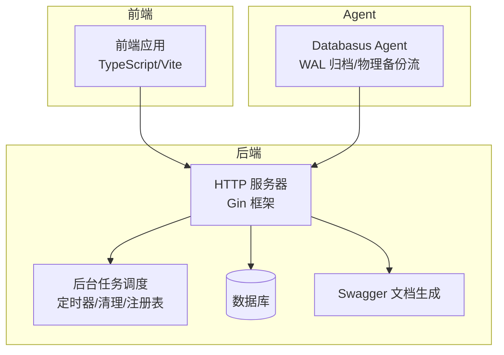
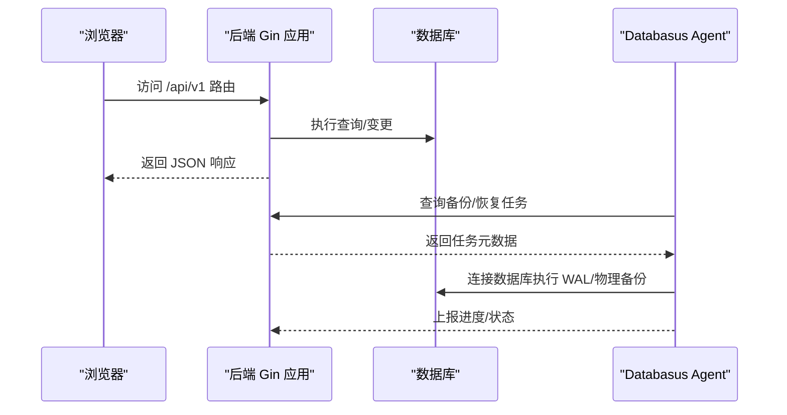
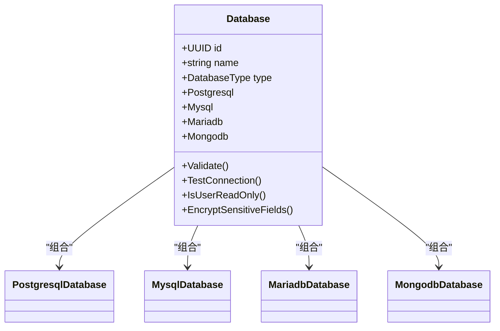
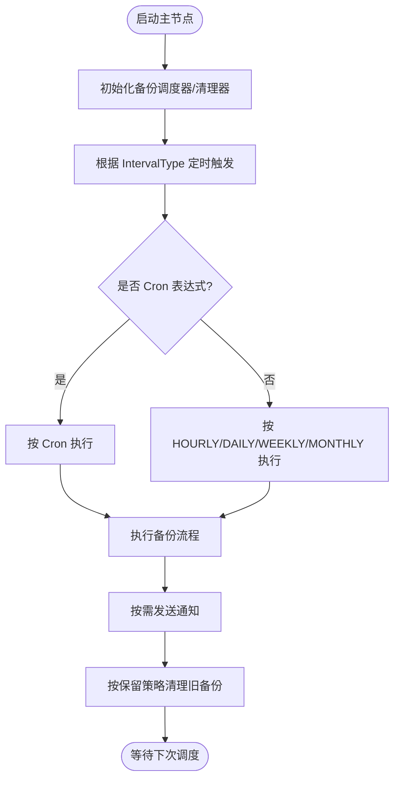
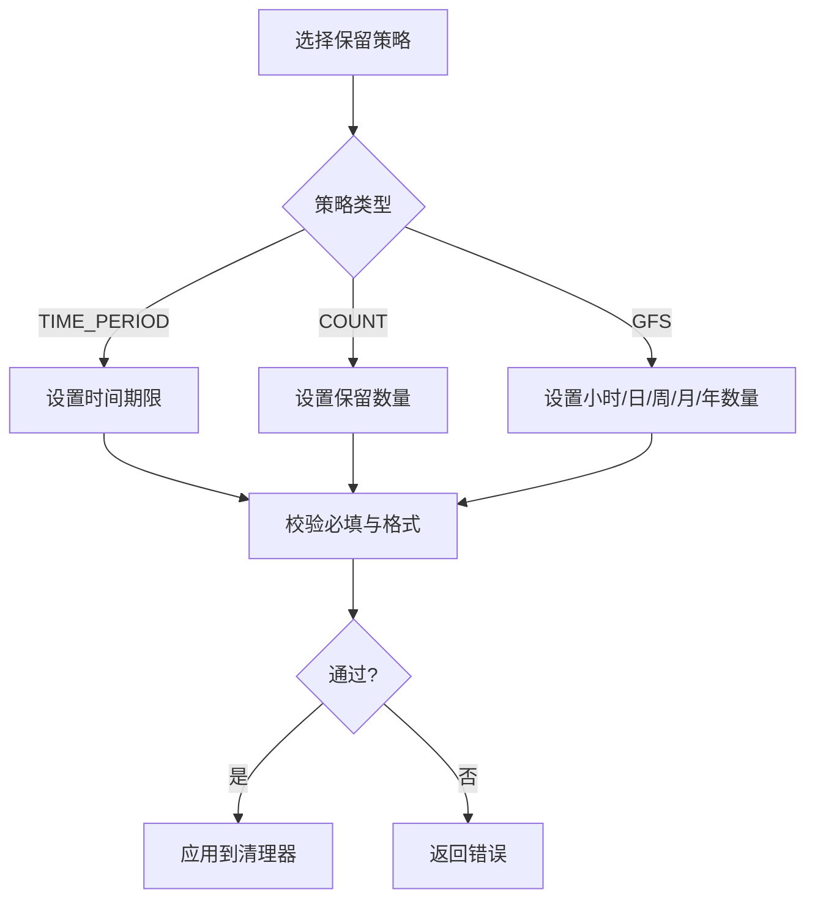
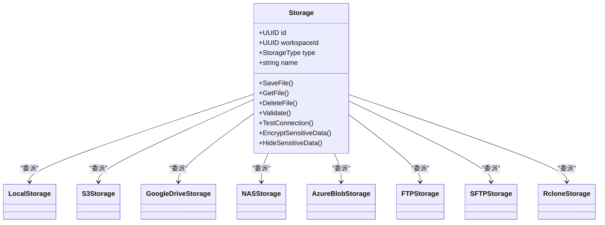
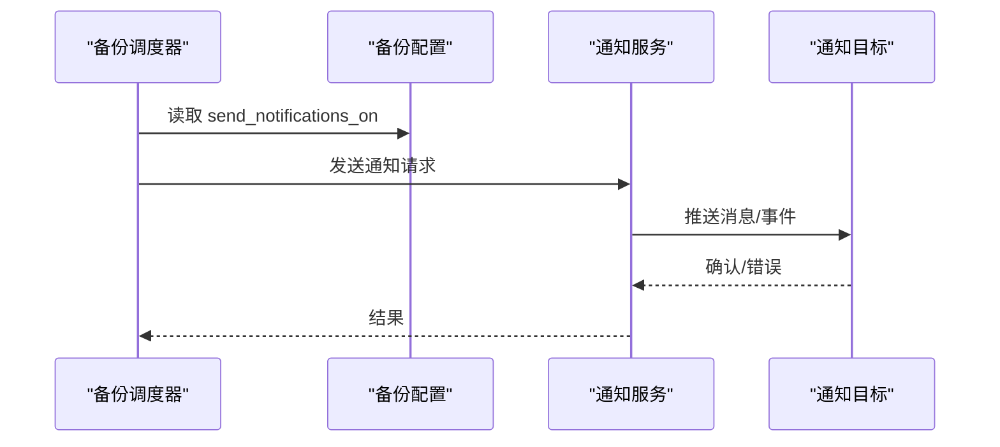
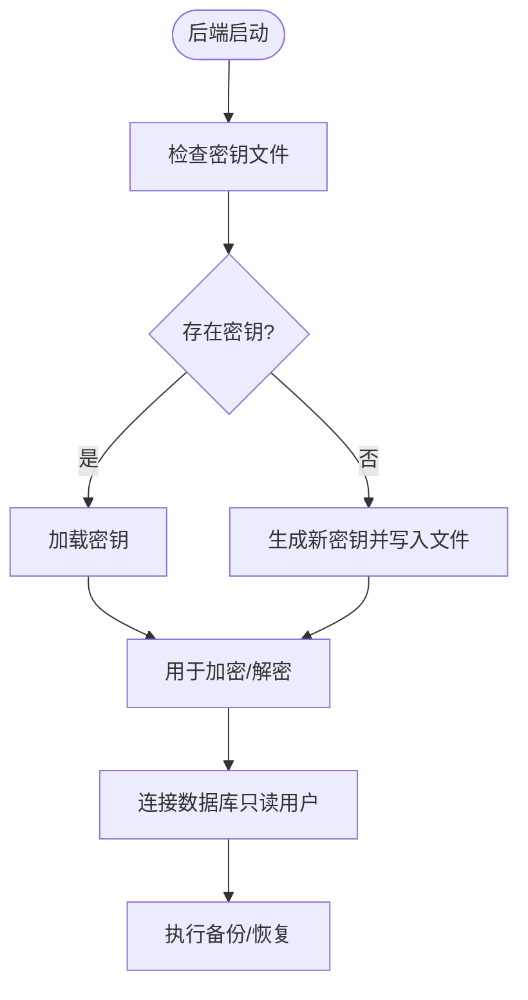
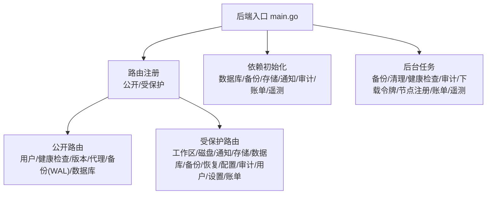

# 核心特性

<cite>
**本文引用的文件**
- [README.md](file://README.md)
- [backend/cmd/main.go](file://backend/cmd/main.go)
- [agent/cmd/main.go](file://agent/cmd/main.go)
- [backend/internal/features/databases/enums.go](file://backend/internal/features/databases/enums.go)
- [backend/internal/features/databases/model.go](file://backend/internal/features/databases/model.go)
- [backend/internal/features/intervals/enums.go](file://backend/internal/features/intervals/enums.go)
- [backend/internal/features/backups/config/enums.go](file://backend/internal/features/backups/config/enums.go)
- [backend/internal/features/backups/config/model.go](file://backend/internal/features/backups/config/model.go)
- [backend/internal/features/storages/enums.go](file://backend/internal/features/storages/enums.go)
- [backend/internal/features/storages/model.go](file://backend/internal/features/storages/model.go)
- [backend/internal/features/notifiers/enums.go](file://backend/internal/features/notifiers/enums.go)
- [backend/internal/features/encryption/secrets/service.go](file://backend/internal/features/encryption/secrets/service.go)
- [backend/README.md](file://backend/README.md)
- [frontend/README.md](file://frontend/README.md)
</cite>

## 目录
1. [简介](#简介)
2. [项目结构](#项目结构)
3. [核心组件](#核心组件)
4. [架构总览](#架构总览)
5. [详细组件分析](#详细组件分析)
6. [依赖关系分析](#依赖关系分析)
7. [性能考量](#性能考量)
8. [故障排查指南](#故障排查指南)
9. [结论](#结论)
10. [附录](#附录)

## 简介
本章节概述 Databasus 的核心能力与定位：面向 PostgreSQL、MySQL、MariaDB、MongoDB 的自托管备份工具，提供多数据库支持、智能调度、灵活保留策略、多存储目的地、通知系统、企业级安全、团队协作与友好界面。本文将从系统架构、数据流、处理逻辑、集成点、错误处理与性能特征等方面进行深入解析，并给出配置与使用建议。

## 项目结构
Databasus 采用前后端分离与多模块后端架构：
- 后端（Go）：提供 API、业务服务、后台任务、数据库迁移与前端静态资源挂载
- 前端（TypeScript/Vite）：单页应用，提供数据库、备份、存储、通知、工作区等管理界面
- Agent（Go）：轻量代理，负责 WAL 归档与物理备份流式传输，支持主机安装与容器环境
- 资源与工具：包含多版本数据库可执行工具与资产文件

图表来源
- [backend/cmd/main.go:213-276](file://backend/cmd/main.go#L213-L276)
- [backend/cmd/main.go:293-374](file://backend/cmd/main.go#L293-L374)
- [agent/cmd/main.go:24-48](file://agent/cmd/main.go#L24-L48)

章节来源
- [backend/cmd/main.go:112-137](file://backend/cmd/main.go#L112-L137)
- [backend/cmd/main.go:213-276](file://backend/cmd/main.go#L213-L276)
- [agent/cmd/main.go:24-48](file://agent/cmd/main.go#L24-L48)

## 核心组件
- 多数据库支持：PostgreSQL 12-18、MySQL 5.7-9、MariaDB 10-12、MongoDB 4-8
- 智能调度备份：小时、天、周、月、cron
- 灵活保留策略：时间期限、数量限制、GFS 分层
- 多存储目的地：本地、S3、Google Drive、FTP、SFTP、NAS、Rclone、Azure Blob
- 智能通知：邮件、Telegram、Slack、Discord、Teams、Webhook
- 企业级安全：AES-256-GCM 加密、零信任存储、只读用户
- 团队协作：工作空间、访问管理、审计日志
- 用户界面：现代化 UI、深浅主题、移动端适配

章节来源
- [README.md:38-110](file://README.md#L38-L110)
- [backend/internal/features/databases/enums.go:3-10](file://backend/internal/features/databases/enums.go#L3-L10)
- [backend/internal/features/intervals/enums.go:3-11](file://backend/internal/features/intervals/enums.go#L3-L11)
- [backend/internal/features/backups/config/enums.go:17-23](file://backend/internal/features/backups/config/enums.go#L17-L23)
- [backend/internal/features/storages/enums.go:3-14](file://backend/internal/features/storages/enums.go#L3-L14)
- [backend/internal/features/notifiers/enums.go:3-12](file://backend/internal/features/notifiers/enums.go#L3-L12)

## 架构总览
Databasus 的运行时由“后端 API + 后台任务 + 前端静态资源 + 可选 Agent”构成。后端启动时执行迁移、初始化管理员、生成 Swagger 文档、挂载前端静态页面，并按节点角色启动主节点与处理节点的后台任务。Agent 通过 REST 客户端与后端交互，完成 WAL 归档与恢复流程。

图表来源
- [backend/cmd/main.go:213-276](file://backend/cmd/main.go#L213-L276)
- [backend/cmd/main.go:293-374](file://backend/cmd/main.go#L293-L374)
- [agent/cmd/main.go:117-160](file://agent/cmd/main.go#L117-L160)

## 详细组件分析

### 多数据库支持
- 支持类型：PostgreSQL、MySQL、MariaDB、MongoDB
- 数据库连接与只读检测：统一通过 Database 抽象对象调用具体数据库实现
- 版本范围：PostgreSQL 12-18、MySQL 5.7/8/9、MariaDB 10/11/12、MongoDB 4-8

图表来源
- [backend/internal/features/databases/model.go:19-44](file://backend/internal/features/databases/model.go#L19-L44)
- [backend/internal/features/databases/enums.go:3-10](file://backend/internal/features/databases/enums.go#L3-L10)

章节来源
- [backend/internal/features/databases/enums.go:3-10](file://backend/internal/features/databases/enums.go#L3-L10)
- [backend/internal/features/databases/model.go:46-94](file://backend/internal/features/databases/model.go#L46-L94)
- [README.md:40-45](file://README.md#L40-L45)

### 智能调度备份（小时/天/周/月/cron）
- 调度类型：小时、日、周、月、Cron
- 配置模型：备份配置包含间隔、保留策略、通知开关、重试策略、加密选项
- 后台任务：主节点启动备份调度器与清理器；处理节点运行备份/恢复节点

图表来源
- [backend/internal/features/intervals/enums.go:3-11](file://backend/internal/features/intervals/enums.go#L3-L11)
- [backend/internal/features/backups/config/model.go:16-44](file://backend/internal/features/backups/config/model.go#L16-L44)
- [backend/cmd/main.go:316-322](file://backend/cmd/main.go#L316-L322)

章节来源
- [backend/internal/features/intervals/enums.go:3-11](file://backend/internal/features/intervals/enums.go#L3-L11)
- [backend/internal/features/backups/config/enums.go:17-23](file://backend/internal/features/backups/config/enums.go#L17-L23)
- [backend/internal/features/backups/config/model.go:83-108](file://backend/internal/features/backups/config/model.go#L83-L108)
- [backend/cmd/main.go:316-322](file://backend/cmd/main.go#L316-L322)

### 灵活保留策略（时间期限/数量/GFS）
- 类型：时间期限、数量、GFS（小时/日/周/月/年）
- 校验规则：不同策略下字段必填与正数校验
- GFS 层级：独立控制各层级保留数量

图表来源
- [backend/internal/features/backups/config/enums.go:17-23](file://backend/internal/features/backups/config/enums.go#L17-L23)
- [backend/internal/features/backups/config/model.go:132-155](file://backend/internal/features/backups/config/model.go#L132-L155)

章节来源
- [backend/internal/features/backups/config/model.go:132-155](file://backend/internal/features/backups/config/model.go#L132-L155)

### 多存储目的地集成（本地/S3/Google Drive/FTP 等）
- 存储类型枚举：本地、S3、Google Drive、NAS、Azure Blob、FTP、SFTP、Rclone
- 统一抽象：Storage 对象根据类型委派到具体存储实现
- 敏感信息：统一加密与隐藏敏感字段

图表来源
- [backend/internal/features/storages/model.go:22-39](file://backend/internal/features/storages/model.go#L22-L39)
- [backend/internal/features/storages/enums.go:3-14](file://backend/internal/features/storages/enums.go#L3-L14)

章节来源
- [backend/internal/features/storages/enums.go:3-14](file://backend/internal/features/storages/enums.go#L3-L14)
- [backend/internal/features/storages/model.go:71-104](file://backend/internal/features/storages/model.go#L71-L104)

### 智能通知系统（邮件/Telegram/Slack/Discord/Webhook）
- 通知类型：邮件、Telegram、Slack、Discord、Teams、Webhook
- 触发条件：备份成功/失败
- 配置：备份配置中以字符串数组形式保存通知类型

图表来源
- [backend/internal/features/notifiers/enums.go:3-12](file://backend/internal/features/notifiers/enums.go#L3-L12)
- [backend/internal/features/backups/config/model.go:37-81](file://backend/internal/features/backups/config/model.go#L37-L81)

章节来源
- [backend/internal/features/notifiers/enums.go:3-12](file://backend/internal/features/notifiers/enums.go#L3-L12)
- [backend/internal/features/backups/config/model.go:37-81](file://backend/internal/features/backups/config/model.go#L37-L81)

### 企业级安全（AES-256-GCM 加密/零信任存储/只读用户）
- 秘钥管理：后端启动时从文件加载或生成新密钥，支持从数据库迁移
- 加密策略：备份配置可启用加密；云环境强制加密
- 零信任：备份文件在存储侧加密，即使暴露存储也无法解密
- 只读用户：默认使用只读用户连接数据库，避免写操作

图表来源
- [backend/internal/features/encryption/secrets/service.go:20-69](file://backend/internal/features/encryption/secrets/service.go#L20-L69)
- [backend/internal/features/backups/config/model.go:96-105](file://backend/internal/features/backups/config/model.go#L96-L105)
- [backend/internal/features/databases/model.go:103-120](file://backend/internal/features/databases/model.go#L103-L120)

章节来源
- [backend/internal/features/encryption/secrets/service.go:20-69](file://backend/internal/features/encryption/secrets/service.go#L20-L69)
- [backend/internal/features/backups/config/model.go:96-105](file://backend/internal/features/backups/config/model.go#L96-L105)
- [backend/internal/features/databases/model.go:103-120](file://backend/internal/features/databases/model.go#L103-L120)

### 团队协作（工作空间/访问管理/审计日志）
- 工作空间：数据库、存储、通知等资源归属工作空间
- 访问管理：基于角色的权限控制
- 审计日志：记录系统活动与变更
- 前后端均提供相应控制器与服务

章节来源
- [backend/cmd/main.go:242-256](file://backend/cmd/main.go#L242-L256)
- [backend/cmd/main.go:264-266](file://backend/cmd/main.go#L264-L266)

### 用户界面设计
- 前端开发与构建：支持开发服务器、生产构建、代码质量检查
- UI 主题：深浅主题切换
- 移动端适配：响应式布局

章节来源
- [frontend/README.md:1-40](file://frontend/README.md#L1-L40)
- [README.md:88-93](file://README.md#L88-L93)

## 依赖关系分析
后端启动时按节点角色加载依赖与后台任务，路由按公开与受保护划分，认证中间件确保受保护接口的安全访问。

图表来源
- [backend/cmd/main.go:213-276](file://backend/cmd/main.go#L213-L276)
- [backend/cmd/main.go:293-374](file://backend/cmd/main.go#L293-L374)

章节来源
- [backend/cmd/main.go:213-276](file://backend/cmd/main.go#L213-L276)
- [backend/cmd/main.go:293-374](file://backend/cmd/main.go#L293-L374)

## 性能考量
- 压缩与传输：支持压缩以节省空间，流式传输减少中间文件
- 并发与节点：主节点负责调度与清理，处理节点负责备份/恢复执行，降低单点压力
- 缓存与日志：缓存连接测试、GZIP 压缩、结构化日志与优雅关闭
- 前端静态资源：直接挂载前端构建产物，减少后端负担

章节来源
- [README.md:51-52](file://README.md#L51-L52)
- [backend/cmd/main.go:117-124](file://backend/cmd/main.go#L117-L124)
- [backend/cmd/main.go:478-490](file://backend/cmd/main.go#L478-L490)

## 故障排查指南
- 密码重置：通过命令行参数重置管理员密码
- 日志与崩溃：全局恢复中间件记录堆栈信息
- CORS 与开发模式：开发模式开启宽松 CORS
- 健康检查与告警：健康检查尝试与后台清理任务
- 审计日志：定期清理审计日志，避免无限增长

章节来源
- [backend/cmd/main.go:139-173](file://backend/cmd/main.go#L139-L173)
- [backend/cmd/main.go:459-476](file://backend/cmd/main.go#L459-L476)
- [backend/cmd/main.go:328-334](file://backend/cmd/main.go#L328-L334)

## 结论
Databasus 提供了覆盖备份生命周期的完整能力：多数据库、智能调度、灵活保留、多存储与通知、企业级安全与团队协作，并以现代化 UI 与良好的工程实践保障可用性与可维护性。通过合理的配置与最佳实践，可在自托管环境中实现高可靠、易运维的数据库备份体系。

## 附录
- 安装方式：自动化脚本、Docker 单容器、Docker Compose、Kubernetes Helm
- 使用步骤：添加数据库 → 配置调度 → 设置连接 → 选择存储 → 配置保留策略 → 可选通知 → 保存并启动
- 开发与构建：后端提供迁移、Swagger 生成、开发与测试命令；前端提供开发服务器与构建脚本

章节来源
- [README.md:124-222](file://README.md#L124-L222)
- [backend/README.md:10-48](file://backend/README.md#L10-L48)
- [frontend/README.md:5-37](file://frontend/README.md#L5-L37)