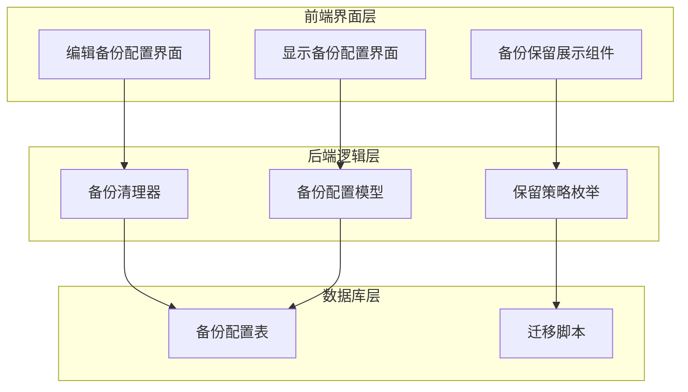
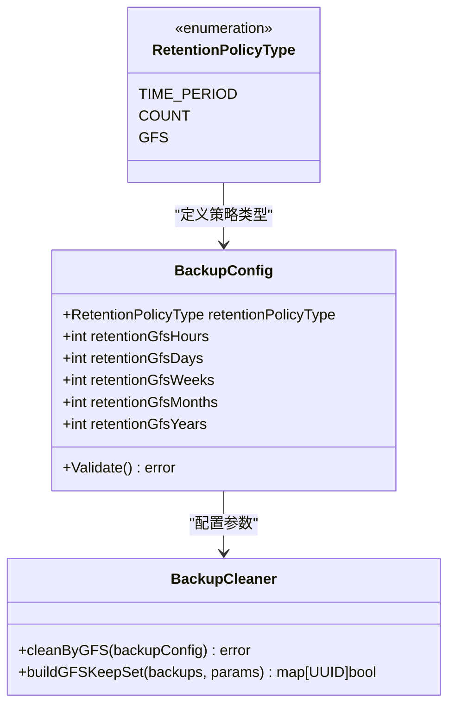
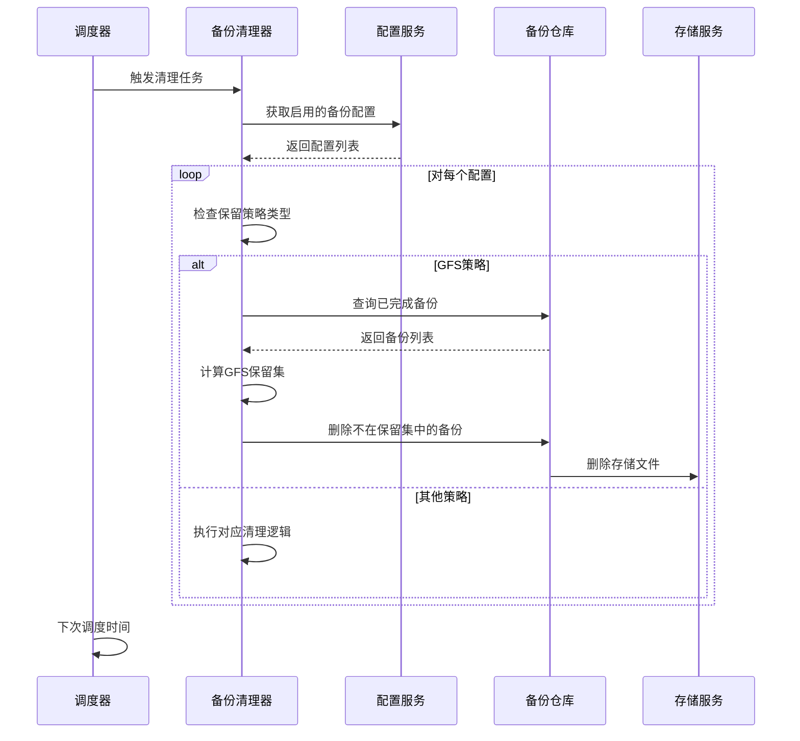
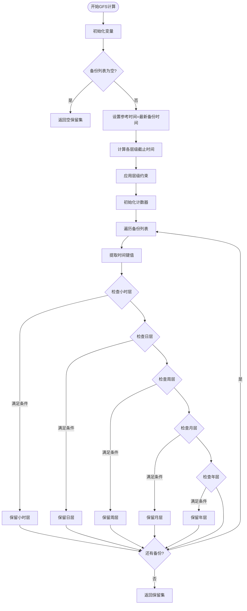
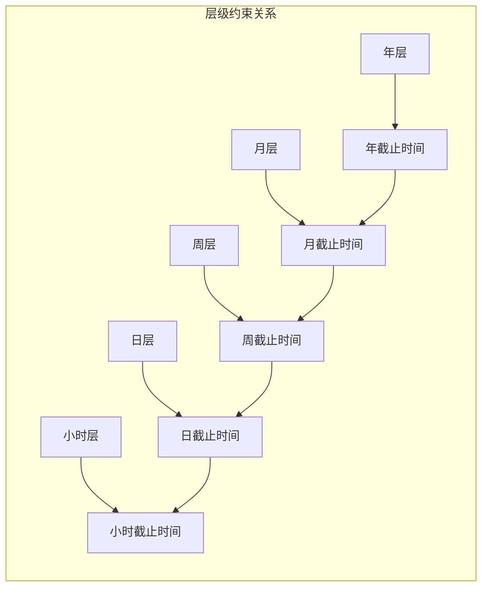
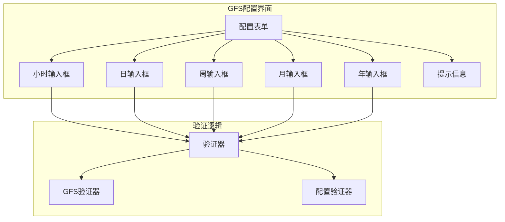
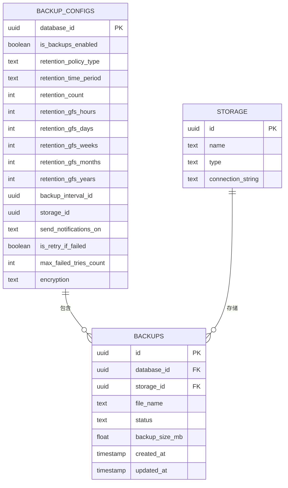
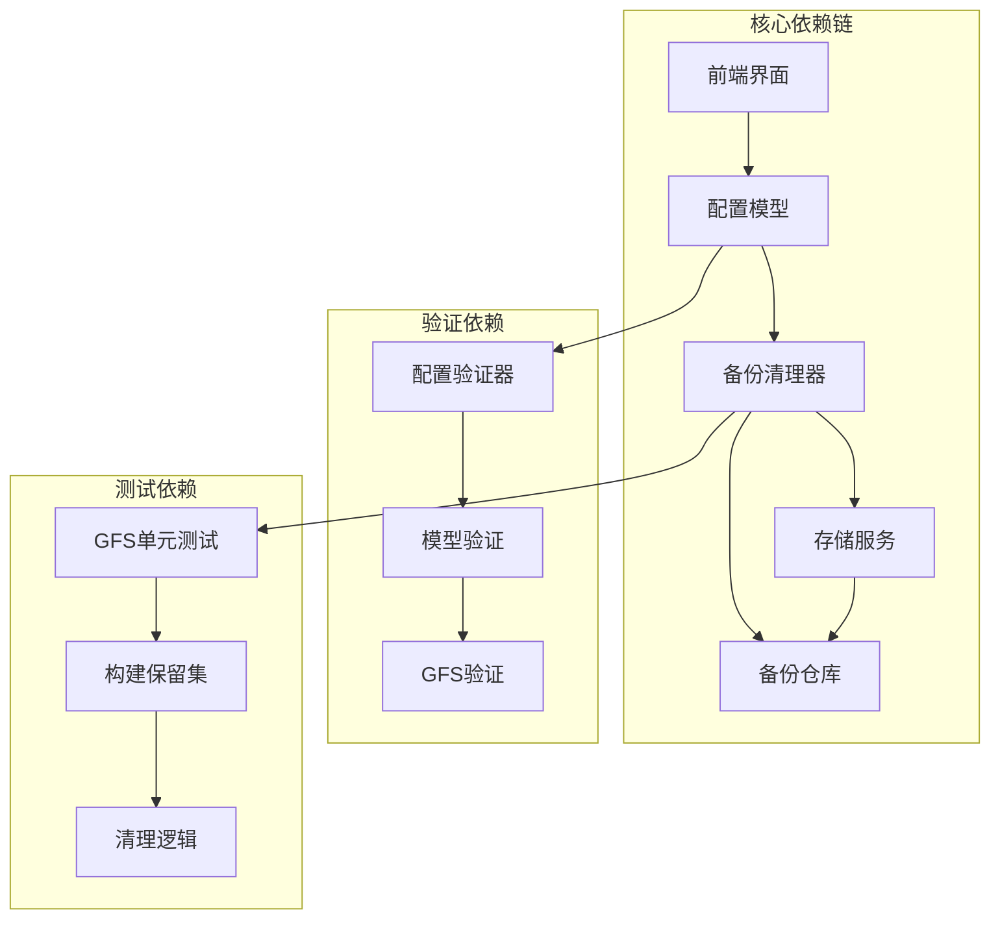

# GFS分层策略

<cite>
**本文档引用的文件**
- [cleaner.go](file://backend/internal/features/backups/backups/backuping/cleaner.go)
- [model.go](file://backend/internal/features/backups/config/model.go)
- [enums.go](file://backend/internal/features/backups/config/enums.go)
- [20260220000000_add_retention_policy.sql](file://backend/migrations/20260220000000_add_retention_policy.sql)
- [EditBackupConfigComponent.tsx](file://frontend/src/features/backups/ui/EditBackupConfigComponent.tsx)
- [ShowBackupConfigComponent.tsx](file://frontend/src/features/backups/ui/ShowBackupConfigComponent.tsx)
- [BackupRetentionSection.tsx](file://frontend/src/features/billing/ui/BackupRetentionSection.tsx)
- [cleaner_gfs_test.go](file://backend/internal/features/backups/backups/backuping/cleaner_gfs_test.go)
- [model_test.go](file://backend/internal/features/backups/config/model_test.go)
</cite>

## 目录
1. [简介](#简介)
2. [项目结构](#项目结构)
3. [核心组件](#核心组件)
4. [架构概览](#架构概览)
5. [详细组件分析](#详细组件分析)
6. [依赖关系分析](#依赖关系分析)
7. [性能考虑](#性能考虑)
8. [故障排除指南](#故障排除指南)
9. [结论](#结论)
10. [附录](#附录)

## 简介

Databasus的GFS（祖父-父亲-儿子）分层策略是一种智能的备份保留模型，通过三层架构实现成本控制与恢复效率的最佳平衡。该策略借鉴了传统的GFS备份管理理念，将备份分为三个层次：

- **祖父层（长期保留）**：月度备份，用于长期归档和法规合规
- **父亲层（中期保留）**：周备份，平衡存储成本和恢复灵活性  
- **儿子层（短期保留）**：日备份，确保最近数据的快速恢复

GFS策略的核心优势在于其"按时间稀疏化"的保留机制：新近备份被频繁保留，而历史备份则逐渐减少，从而在保证恢复能力的同时最大化存储空间利用率。

## 项目结构

Databasus的GFS实现采用分层架构设计，主要分布在以下模块中：

**图表来源**
- [cleaner.go:1-71](file://backend/internal/features/backups/backups/backuping/cleaner.go#L1-L71)
- [model.go:16-44](file://backend/internal/features/backups/config/model.go#L16-L44)
- [enums.go:17-23](file://backend/internal/features/backups/config/enums.go#L17-L23)

**章节来源**
- [cleaner.go:1-71](file://backend/internal/features/backups/backups/backuping/cleaner.go#L1-L71)
- [model.go:1-156](file://backend/internal/features/backups/config/model.go#L1-L156)
- [enums.go:1-24](file://backend/internal/features/backups/config/enums.go#L1-L24)

## 核心组件

### GFS保留策略类型

系统支持三种保留策略，其中GFS策略专门用于分层保留：

**图表来源**
- [enums.go:17-23](file://backend/internal/features/backups/config/enums.go#L17-L23)
- [model.go:16-44](file://backend/internal/features/backups/config/model.go#L16-L44)
- [cleaner.go:297-343](file://backend/internal/features/backups/backups/backuping/cleaner.go#L297-L343)

### GFS层级结构

GFS策略包含五个保留层级，每个层级都有特定的时间范围和保留数量：

| 层级 | 时间范围 | 保留数量 | 用途 |
|------|----------|----------|------|
| 小时层 | 最近N小时 | N个 | 精确到小时的恢复点 |
| 日层 | 最近N天 | N个 | 日常数据恢复 |
| 周层 | 最近N周 | N个 | 周度数据对比 |
| 月层 | 最近N月 | N个 | 月度数据归档 |
| 年层 | 最近N年 | N个 | 长期合规保存 |

**章节来源**
- [cleaner.go:400-511](file://backend/internal/features/backups/backups/backuping/cleaner.go#L400-L511)
- [model.go:25-29](file://backend/internal/features/backups/config/model.go#L25-L29)

## 架构概览

GFS策略的执行流程采用定时任务驱动的方式，确保备份清理的自动化和一致性：

**图表来源**
- [cleaner.go:37-71](file://backend/internal/features/backups/backups/backuping/cleaner.go#L37-L71)
- [cleaner.go:157-183](file://backend/internal/features/backups/backups/backuping/cleaner.go#L157-L183)
- [cleaner.go:297-343](file://backend/internal/features/backups/backups/backuping/cleaner.go#L297-L343)

## 详细组件分析

### GFS保留算法实现

GFS策略的核心是`buildGFSKeepSet`函数，它实现了复杂的层级保留逻辑：

**图表来源**
- [cleaner.go:400-511](file://backend/internal/features/backups/backups/backuping/cleaner.go#L400-L511)

#### 层级约束机制

GFS策略实现了严格的层级约束，防止高级别保留吸收低级别备份：

**图表来源**
- [cleaner.go:421-467](file://backend/internal/features/backups/backups/backuping/cleaner.go#L421-L467)

### 前端配置界面

Databasus提供了直观的GFS配置界面，支持用户自定义各层级的保留数量：

**图表来源**
- [EditBackupConfigComponent.tsx:592-679](file://frontend/src/features/backups/ui/EditBackupConfigComponent.tsx#L592-L679)
- [ShowBackupConfigComponent.tsx:225-232](file://frontend/src/features/backups/ui/ShowBackupConfigComponent.tsx#L225-L232)

**章节来源**
- [EditBackupConfigComponent.tsx:590-789](file://frontend/src/features/backups/ui/EditBackupConfigComponent.tsx#L590-L789)
- [ShowBackupConfigComponent.tsx:210-239](file://frontend/src/features/backups/ui/ShowBackupConfigComponent.tsx#L210-L239)

### 数据库模型设计

GFS策略的数据库模型支持灵活的配置存储和查询：

**图表来源**
- [model.go:16-44](file://backend/internal/features/backups/config/model.go#L16-L44)
- [20260220000000_add_retention_policy.sql:3-11](file://backend/migrations/20260220000000_add_retention_policy.sql#L3-L11)

**章节来源**
- [model.go:1-156](file://backend/internal/features/backups/config/model.go#L1-L156)
- [20260220000000_add_retention_policy.sql:1-39](file://backend/migrations/20260220000000_add_retention_policy.sql#L1-L39)

## 依赖关系分析

### 组件间依赖关系

**图表来源**
- [cleaner.go:25-35](file://backend/internal/features/backups/backups/backuping/cleaner.go#L25-L35)
- [model.go:83-155](file://backend/internal/features/backups/config/model.go#L83-L155)
- [cleaner_gfs_test.go:21-78](file://backend/internal/features/backups/backups/backuping/cleaner_gfs_test.go#L21-L78)

### 数据流分析

GFS策略的数据流遵循严格的处理顺序：

1. **配置加载**：从数据库加载备份配置
2. **备份收集**：查询所有已完成的备份
3. **GFS计算**：计算保留集
4. **删除执行**：删除不在保留集中的备份
5. **存储清理**：清理对应的存储文件

**章节来源**
- [cleaner.go:157-343](file://backend/internal/features/backups/backups/backuping/cleaner.go#L157-L343)

## 性能考虑

### 内存优化策略

GFS算法采用了多项内存优化技术：

- **延迟计算**：仅在需要时计算保留集
- **增量更新**：避免全量扫描整个备份历史
- **内存池**：复用临时数据结构
- **分页查询**：对大量备份进行分页处理

### 时间复杂度分析

GFS算法的时间复杂度为O(n)，其中n是备份数量：

- **构建保留集**：O(n) - 单次遍历
- **删除操作**：O(n) - 遍历备份列表
- **存储清理**：O(m) - m为需要删除的备份数量

### 存储成本控制

GFS策略通过以下方式控制存储成本：

- **指数衰减**：历史备份占用空间递增
- **去重机制**：同一时间粒度内只保留最新备份
- **层级约束**：防止高级别保留吸收低级别备份

## 故障排除指南

### 常见问题诊断

#### GFS配置验证失败

当GFS配置验证失败时，通常由以下原因导致：

1. **缺少保留参数**：至少需要一个GFS字段大于0
2. **无效策略类型**：保留策略类型必须是GFS
3. **配置冲突**：与其他保留策略配置冲突

**章节来源**
- [model_test.go:66-107](file://backend/internal/features/backups/config/model_test.go#L66-L107)

#### 清理逻辑异常

如果GFS清理逻辑出现异常，检查以下方面：

1. **备份状态**：确保备份状态为Completed
2. **时间排序**：备份必须按时间降序排列
3. **存储连接**：确认存储服务连接正常
4. **权限问题**：检查存储权限配置

**章节来源**
- [cleaner_gfs_test.go:371-444](file://backend/internal/features/backups/backups/backuping/cleaner_gfs_test.go#L371-L444)

### 性能监控指标

建议监控以下关键指标来评估GFS策略的性能：

- **清理任务执行时间**
- **保留集计算耗时**
- **存储清理成功率**
- **备份删除数量**
- **存储空间节省率**

## 结论

Databasus的GFS分层策略通过智能的三层保留机制，在成本控制和恢复效率之间实现了最佳平衡。该策略的核心优势包括：

1. **成本效益**：通过时间稀疏化显著降低存储成本
2. **恢复灵活性**：提供多层级的恢复点选择
3. **自动化程度高**：无需人工干预即可自动执行
4. **可配置性强**：支持灵活的参数调整
5. **可靠性保障**：完善的错误处理和监控机制

GFS策略特别适用于需要长期数据保留但又希望控制存储成本的场景，如金融、医疗等对合规性要求较高的行业。

## 附录

### 配置示例

#### 企业级配置示例

对于企业级应用，推荐以下配置：

- **小时层**：24个备份（最近24小时）
- **日层**：14个备份（最近2周）
- **周层**：8个备份（最近8周）
- **月层**：12个备份（最近12个月）
- **年层**：5个备份（最近5年）

#### 开发环境配置示例

开发环境可以采用更保守的配置：

- **小时层**：12个备份
- **日层**：7个备份
- **周层**：4个备份
- **月层**：6个备份
- **年层**：3个备份

#### 生产环境配置示例

生产环境建议采用以下配置：

- **小时层**：48个备份
- **日层**：30个备份
- **周层**：12个备份
- **月层**：24个备份
- **年层**：10个备份

### 最佳实践

1. **定期评估**：根据业务需求定期评估和调整GFS参数
2. **监控告警**：建立完善的监控和告警机制
3. **测试验证**：定期进行恢复测试验证备份有效性
4. **成本分析**：定期分析存储成本变化趋势
5. **合规检查**：确保满足相关法规的合规要求