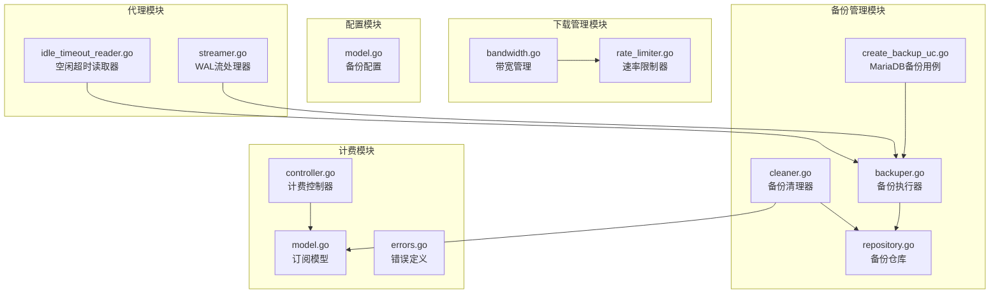
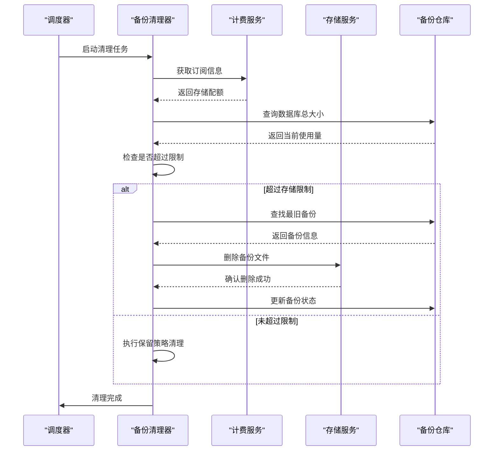
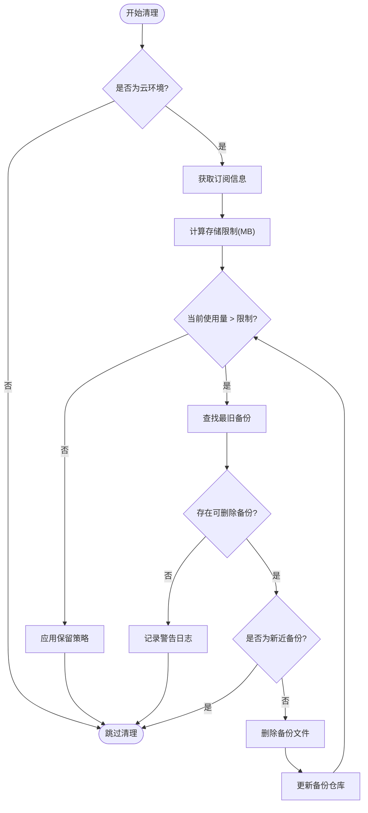
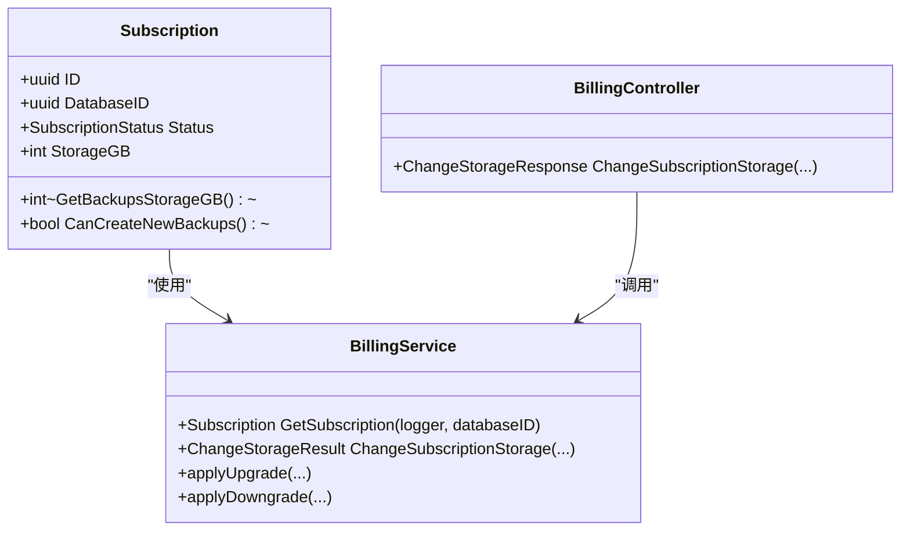
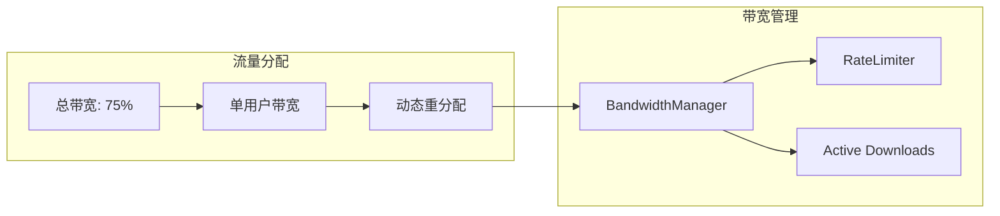
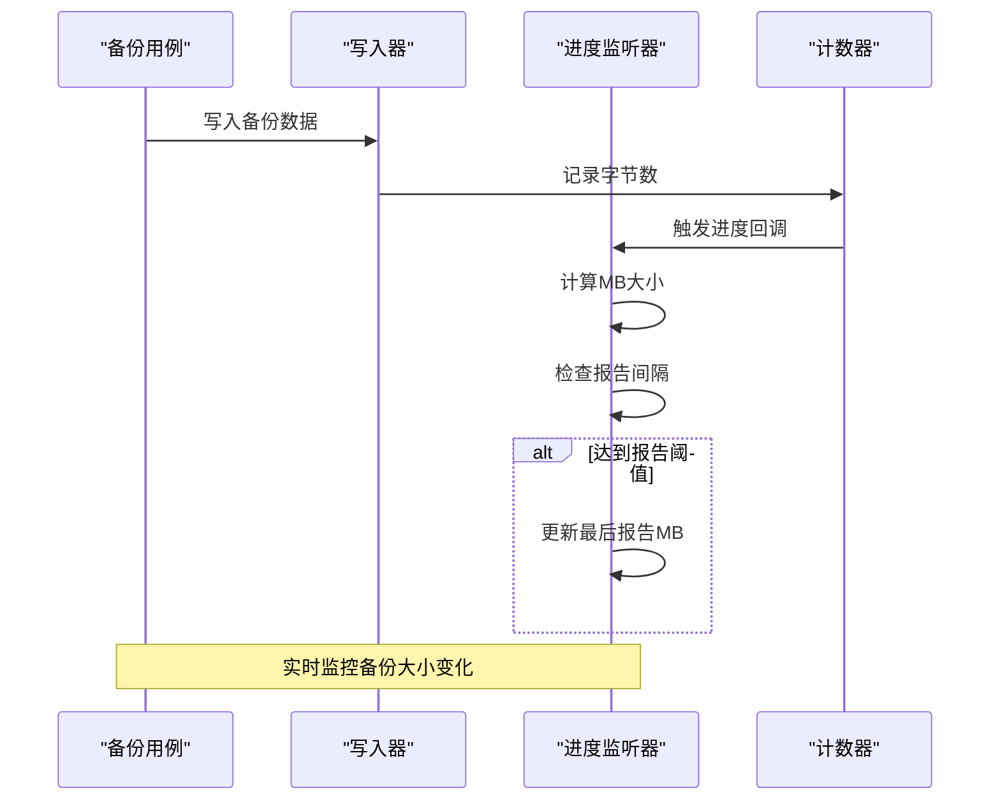
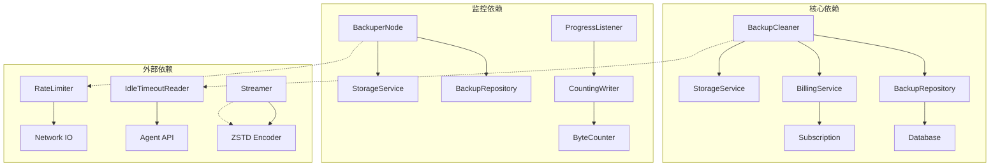

# 大小限制功能

<cite>
**本文档引用的文件**
- [cleaner.go](file://backend/internal/features/backups/backups/backuping/cleaner.go)
- [repository.go](file://backend/internal/features/backups/backups/core/repository.go)
- [model.go](file://backend/internal/features/billing/models/subscription.go)
- [controller.go](file://backend/internal/features/billing/controller.go)
- [errors.go](file://backend/internal/features/billing/errors.go)
- [model.go](file://backend/internal/features/backups/config/model.go)
- [backuper.go](file://backend/internal/features/backups/backups/backuping/backuper.go)
- [scheduler_test.go](file://backend/internal/features/backups/backups/backuping/scheduler_test.go)
- [bandwidth.go](file://backend/internal/features/backups/backups/download/bandwidth.go)
- [rate_limiter.go](file://backend/internal/features/backups/backups/download/rate_limiter.go)
- [interfaces.go](file://backend/internal/features/backups/backups/common/interfaces.go)
- [create_backup_uc.go](file://backend/internal/features/backups/backups/usecases/mariadb/create_backup_uc.go)
- [idle_timeout_reader.go](file://agent/internal/features/api/idle_timeout_reader.go)
- [streamer.go](file://agent/internal/features/wal/streamer.go)
- [diskApi.ts](file://frontend/src/entity/disk/api/diskApi.ts)
- [purchaseUtils.ts](file://frontend/src/features/billing/models/purchaseUtils.ts)
</cite>

## 目录
1. [简介](#简介)
2. [项目结构](#项目结构)
3. [核心组件](#核心组件)
4. [架构概览](#架构概览)
5. [详细组件分析](#详细组件分析)
6. [依赖关系分析](#依赖关系分析)
7. [性能考虑](#性能考虑)
8. [故障排除指南](#故障排除指南)
9. [结论](#结论)
10. [附录](#附录)

## 简介

Databasus的大小限制功能是一个综合性的存储管理机制，旨在防止备份系统占用过多存储空间并确保系统的稳定运行。该功能通过双重限制机制来实现：单个数据库的备份大小限制和总存储空间限制。

该功能的核心目标是：
- 防止单个数据库或工作空间过度使用存储资源
- 确保系统在高负载情况下仍能正常运行
- 提供灵活的存储配额管理和自动清理机制
- 支持多种存储类型（本地存储、云存储等）
- 实现与保留策略的协同工作机制

## 项目结构

大小限制功能主要分布在以下模块中：



**图表来源**
- [cleaner.go:1-71](file://backend/internal/features/backups/backups/backuping/cleaner.go#L1-L71)
- [repository.go:235-248](file://backend/internal/features/backups/backups/core/repository.go#L235-L248)
- [model.go:11-31](file://backend/internal/features/billing/models/subscription.go#L11-L31)

## 核心组件

### 备份清理器（BackupCleaner）

备份清理器是大小限制功能的核心组件，负责监控和管理备份存储使用情况。它实现了定时清理机制，确保存储使用量不超过设定的限制。

关键特性：
- **定时执行**：每分钟检查一次存储使用情况
- **多策略清理**：支持基于保留策略和存储限制的双重清理
- **智能删除**：优先删除最旧的备份，避免影响最近的备份
- **保护机制**：对新近创建的备份进行保护，防止误删

### 订阅管理系统

订阅管理系统负责存储配额的管理和控制，通过订阅状态和存储配额来限制备份大小。

核心功能：
- **配额计算**：将GB转换为MB进行精确计算
- **状态验证**：根据订阅状态确定可用存储空间
- **动态调整**：支持存储空间的升级和降级

### 带宽管理器

带宽管理器用于控制下载流量，防止大量并发下载导致系统过载。

主要机制：
- **总带宽限制**：限制所有下载的总带宽使用
- **动态分配**：根据活跃下载数量动态分配带宽
- **速率限制**：为每个下载会话设置独立的速率限制

**章节来源**
- [cleaner.go:25-71](file://backend/internal/features/backups/backups/backuping/cleaner.go#L25-L71)
- [model.go:57-72](file://backend/internal/features/billing/models/subscription.go#L57-L72)
- [bandwidth.go:10-31](file://backend/internal/features/backups/backups/download/bandwidth.go#L10-L31)

## 架构概览

大小限制功能的整体架构采用分层设计，确保各组件之间的职责清晰分离：



**图表来源**
- [cleaner.go:37-71](file://backend/internal/features/backups/backups/backuping/cleaner.go#L37-L71)
- [repository.go:235-248](file://backend/internal/features/backups/backups/core/repository.go#L235-L248)

## 详细组件分析

### 备份清理算法

备份清理器实现了智能的清理算法，确保在满足存储限制的同时最大化备份的可用性：



**图表来源**
- [cleaner.go:185-213](file://backend/internal/features/backups/backups/backuping/cleaner.go#L185-L213)
- [cleaner.go:345-394](file://backend/internal/features/backups/backups/backuping/cleaner.go#L345-L394)

#### 存储限制计算机制

存储限制的计算采用以下公式：
```
存储限制(MB) = 订阅存储配额(GB) × 1024
```

这个计算确保了从GB到MB的精确转换，避免了精度损失。

#### 最近备份保护机制

为了防止误删新近创建的备份，系统实现了60分钟的保护期：
- 新建的备份如果在60分钟内，不会被自动清理
- 这确保了用户可以访问最近的备份进行恢复操作
- 保护机制适用于所有清理场景

**章节来源**
- [cleaner.go:20-23](file://backend/internal/features/backups/backups/backuping/cleaner.go#L20-L23)
- [cleaner.go:396-398](file://backend/internal/features/backups/backups/backuping/cleaner.go#L396-L398)

### 订阅配额管理

订阅配额管理系统提供了灵活的存储空间管理机制：



**图表来源**
- [model.go:11-31](file://backend/internal/features/billing/models/subscription.go#L11-L31)
- [model.go:57-72](file://backend/internal/features/billing/models/subscription.go#L57-L72)

#### 配额状态管理

不同订阅状态下存储配额的处理方式：

| 订阅状态 | 存储配额可用性 | 备注 |
|---------|---------------|------|
| Active | 完全可用 | 正常使用所有配额 |
| PastDue | 部分受限 | 可能限制新备份创建 |
| Trial | 有限制 | 试用期内存储配额可能到期 |
| Canceled | 部分可用 | 取消后可能仍有配额 |
| Expired | 不可用 | 完全停止使用 |

**章节来源**
- [model.go:57-72](file://backend/internal/features/billing/models/subscription.go#L57-L72)
- [controller.go:89-120](file://backend/internal/features/billing/controller.go#L89-L120)

### 下载带宽控制

下载带宽控制系统确保大量并发下载不会影响系统性能：



**图表来源**
- [bandwidth.go:22-31](file://backend/internal/features/backups/backups/download/bandwidth.go#L22-L31)
- [rate_limiter.go:17-28](file://backend/internal/features/backups/backups/download/rate_limiter.go#L17-L28)

#### 动态带宽分配算法

带宽分配采用以下策略：
- **总带宽限制**：使用总带宽的75%用于下载
- **动态分配**：根据活跃下载数量动态分配带宽
- **公平共享**：所有下载会话平均分享可用带宽
- **实时调整**：支持运行时调整带宽参数

**章节来源**
- [bandwidth.go:22-31](file://backend/internal/features/backups/backups/download/bandwidth.go#L22-L31)
- [rate_limiter.go:30-44](file://backend/internal/features/backups/backups/download/rate_limiter.go#L30-L44)

### 备份进度监控

备份进度监控系统提供了实时的备份大小跟踪能力：



**图表来源**
- [create_backup_uc.go:377-383](file://backend/internal/features/backups/backups/usecases/mariadb/create_backup_uc.go#L377-L383)
- [interfaces.go:5-22](file://backend/internal/features/backups/backups/common/interfaces.go#L5-L22)

#### 进度报告机制

进度报告采用增量式更新机制：
- **实时计数**：使用`CountingWriter`实时统计字节数
- **MB换算**：将字节转换为MB进行显示
- **间隔报告**：避免过于频繁的进度更新
- **精度控制**：默认每增加指定MB才报告一次

**章节来源**
- [interfaces.go:5-22](file://backend/internal/features/backups/backups/common/interfaces.go#L5-L22)
- [create_backup_uc.go:377-383](file://backend/internal/features/backups/backups/usecases/mariadb/create_backup_uc.go#L377-L383)

## 依赖关系分析

大小限制功能涉及多个模块之间的复杂依赖关系：



**图表来源**
- [cleaner.go:25-35](file://backend/internal/features/backups/backups/backuping/cleaner.go#L25-L35)
- [backuper.go:171-178](file://backend/internal/features/backups/backups/backuping/backuper.go#L171-L178)

### 关键依赖链

1. **清理器依赖链**：BackupCleaner → BillingService → Subscription
2. **备份依赖链**：BackuperNode → BackupRepository → StorageService
3. **监控依赖链**：ProgressListener → CountingWriter → ByteCounter

这些依赖关系确保了大小限制功能的完整性和可靠性。

**章节来源**
- [cleaner.go:185-213](file://backend/internal/features/backups/backups/backuping/cleaner.go#L185-L213)
- [backuper.go:171-178](file://backend/internal/features/backups/backups/backuping/backuper.go#L171-L178)

## 性能考虑

### 并发处理优化

大小限制功能在高负载情况下采用了多项性能优化措施：

1. **异步清理**：清理操作在独立的goroutine中执行
2. **批量查询**：使用数据库批量查询减少网络往返
3. **缓存机制**：合理使用缓存减少重复计算
4. **连接池管理**：优化数据库连接使用

### 内存使用优化

- **流式处理**：备份和下载采用流式处理，避免大对象内存占用
- **分页查询**：大数据集查询使用分页机制
- **及时释放**：及时释放不再使用的资源和连接

### 网络性能优化

- **带宽控制**：防止网络拥塞影响系统性能
- **超时机制**：设置合理的超时时间避免长时间阻塞
- **重试策略**：智能的重试机制提高成功率

## 故障排除指南

### 常见问题及解决方案

#### 存储限制不生效

**症状**：备份继续增长超过限制

**排查步骤**：
1. 检查订阅状态是否为Active
2. 验证存储配额是否正确设置
3. 确认清理器是否正常运行
4. 检查是否有新的备份正在创建

**解决方案**：
- 升级订阅计划以增加存储配额
- 检查并修复清理器异常
- 调整备份配置减少存储使用

#### 清理器异常

**症状**：清理器无法删除备份文件

**排查步骤**：
1. 检查存储连接状态
2. 验证备份文件权限
3. 查看清理器日志
4. 确认备份状态一致性

**解决方案**：
- 重新建立存储连接
- 修复文件权限问题
- 重启清理器服务

#### 带宽限制问题

**症状**：下载速度异常缓慢

**排查步骤**：
1. 检查带宽管理器配置
2. 验证活跃下载数量
3. 分析网络连接质量
4. 检查客户端连接状态

**解决方案**：
- 调整带宽参数设置
- 减少同时进行的下载任务
- 优化网络连接配置

**章节来源**
- [errors.go:5-15](file://backend/internal/features/billing/errors.go#L5-L15)
- [cleaner.go:85-96](file://backend/internal/features/backups/backups/backuping/cleaner.go#L85-L96)

## 结论

Databasus的大小限制功能通过多层次的设计实现了高效的存储管理：

1. **双重保障机制**：结合存储限制和保留策略，确保存储使用的合理性
2. **智能清理算法**：优先保护新近备份，智能删除历史备份
3. **灵活的配额管理**：支持动态调整存储配额适应业务需求
4. **全面的监控体系**：实时跟踪备份大小和系统状态
5. **高性能设计**：优化的并发处理和资源管理

该功能为用户提供了可靠的存储管理解决方案，既保证了系统的稳定性，又满足了不同规模业务的需求。

## 附录

### 配置示例

#### 本地存储配置
```yaml
# 本地存储配置示例
storage:
  type: local
  path: /var/lib/databasus/backups
  max_size_gb: 100
  cleanup_threshold: 90
```

#### 云存储配置
```yaml
# AWS S3配置示例
storage:
  type: s3
  bucket: databasus-backups
  region: us-west-2
  max_size_gb: 1000
  cleanup_threshold: 95
```

### 监控指标

| 指标名称 | 描述 | 计算方式 |
|---------|------|----------|
| 存储使用率 | 当前存储使用量占配额的比例 | (当前使用量/配额) × 100% |
| 备份数量 | 数据库中备份文件总数 | COUNT(备份) |
| 平均备份大小 | 所有备份的平均大小 | SUM(备份大小)/备份数量 |
| 清理频率 | 每小时清理的备份数量 | 清理次数/小时 |

### 最佳实践

1. **定期监控**：建立定期的存储使用监控机制
2. **合理配置**：根据业务需求合理设置存储配额
3. **备份策略**：制定合适的备份保留策略
4. **性能优化**：定期优化备份和清理流程
5. **容量规划**：提前规划存储容量满足业务增长需求