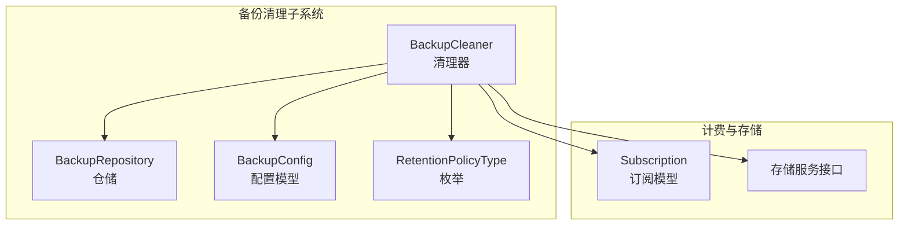
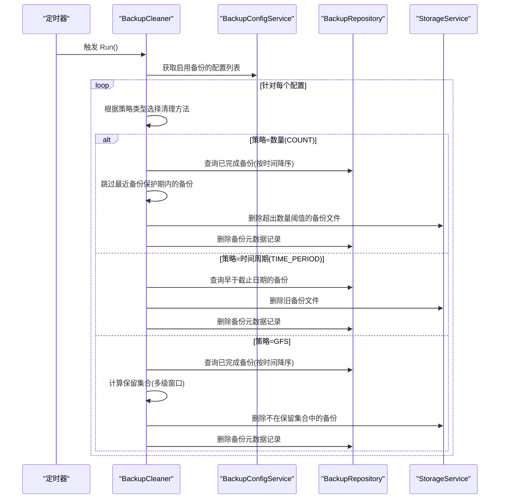
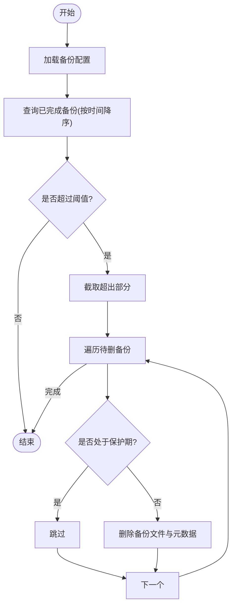
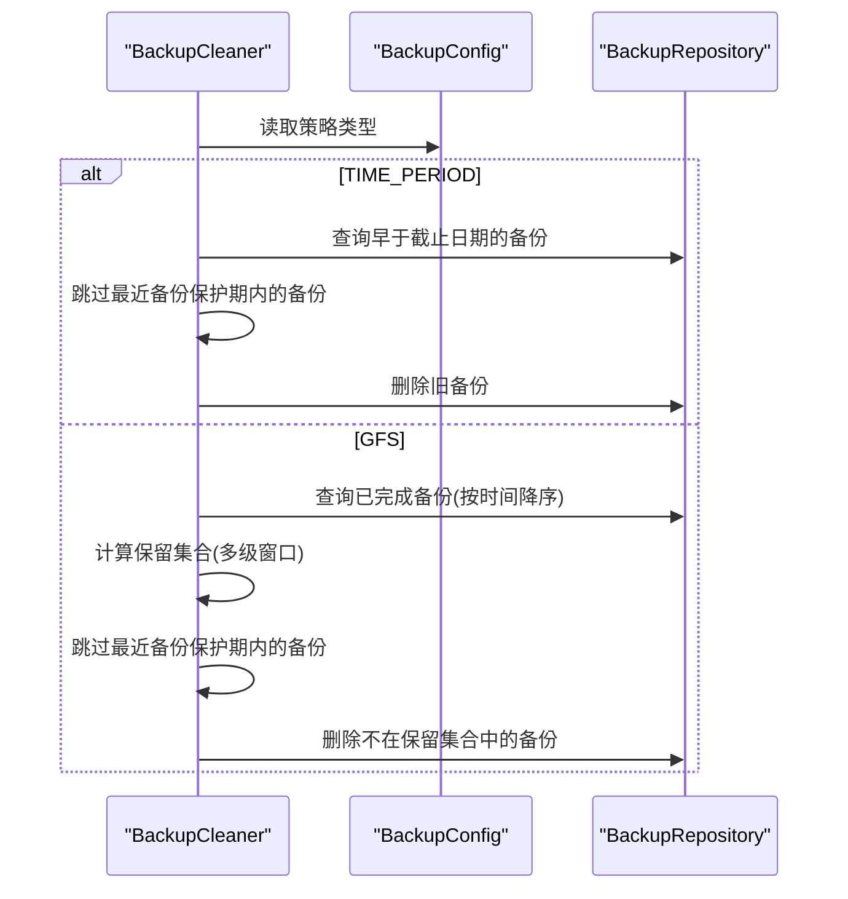
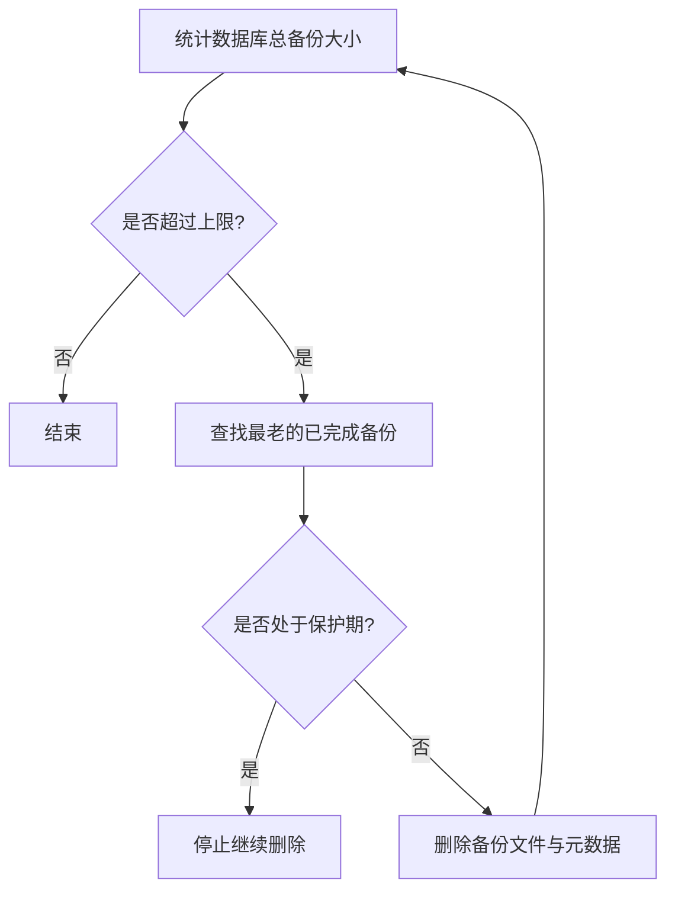
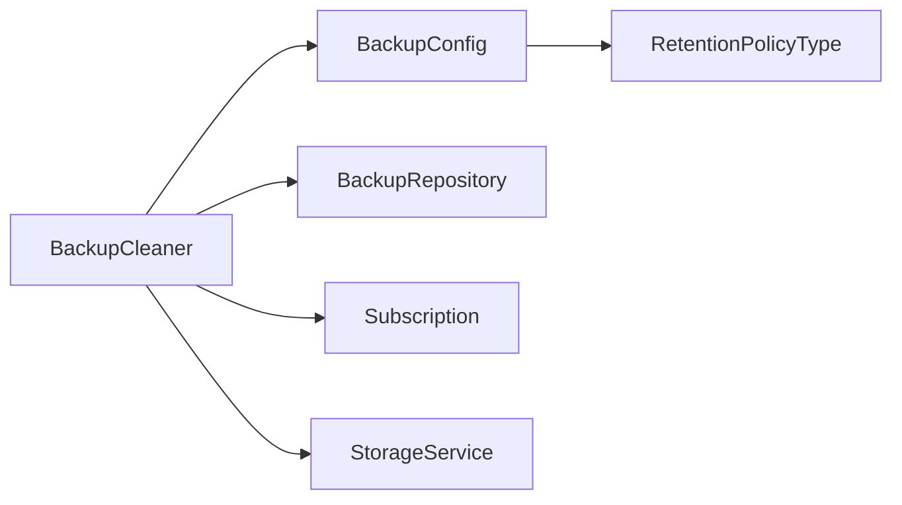

# 数量限制策略

<cite>
**本文引用的文件**
- [cleaner.go](file://backend/internal/features/backups/backups/backuping/cleaner.go)
- [model.go](file://backend/internal/features/backups/config/model.go)
- [enums.go](file://backend/internal/features/backups/config/enums.go)
- [repository.go](file://backend/internal/features/backups/backups/core/repository.go)
- [subscription.go](file://backend/internal/features/billing/models/subscription.go)
- [20260119124334_add_backup_size_limits.sql](file://backend/migrations/20260119124334_add_backup_size_limits.sql)
- [cleaner_test.go](file://backend/internal/feature/backups/backups/backuping/cleaner_test.go)
- [cleaner_gfs_test.go](file://backend/internal/feature/backups/backups/backuping/cleaner_gfs_test.go)
</cite>

## 目录
1. [简介](#简介)
2. [项目结构](#项目结构)
3. [核心组件](#核心组件)
4. [架构总览](#架构总览)
5. [详细组件分析](#详细组件分析)
6. [依赖分析](#依赖分析)
7. [性能考虑](#性能考虑)
8. [故障排查指南](#故障排查指南)
9. [结论](#结论)
10. [附录](#附录)

## 简介
本文件系统性阐述 Databasus 的“数量限制策略”，即基于“备份数量”的滚动删除机制。内容涵盖：
- 最大备份数配置项与校验
- 按时间排序的删除规则与保留最新备份策略
- 数量阈值对存储空间与恢复窗口的影响
- 不同业务场景下的推荐配置（如保留最近 10 个、50 个备份）
- 配置示例、删除顺序算法说明，以及与时间策略结合的最佳实践

## 项目结构
围绕数量限制策略的关键代码分布在以下模块：
- 备份清理器：负责周期性执行清理任务，按策略删除过量备份
- 备份配置模型：定义保留策略类型与数量阈值等字段
- 备份仓储层：提供按数据库查询、排序与统计的能力
- 订阅模型：在云模式下用于计算存储上限
- 迁移脚本：新增备份大小限制相关字段

**图表来源**
- [cleaner.go:157-183](file://backend/internal/features/backups/backups/backuping/cleaner.go#L157-L183)
- [model.go:16-44](file://backend/internal/features/backups/config/model.go#L16-L44)
- [enums.go:17-23](file://backend/internal/features/backups/config/enums.go#L17-L23)
- [repository.go:164-179](file://backend/internal/features/backups/backups/core/repository.go#L164-L179)
- [subscription.go:57-72](file://backend/internal/features/billing/models/subscription.go#L57-L72)

**章节来源**
- [cleaner.go:1-71](file://backend/internal/features/backups/backups/backuping/cleaner.go#L1-L71)
- [model.go:1-48](file://backend/internal/features/backups/config/model.go#L1-L48)
- [enums.go:1-24](file://backend/internal/features/backups/config/enums.go#L1-L24)
- [repository.go:1-50](file://backend/internal/features/backups/backups/core/repository.go#L1-L50)
- [subscription.go:26-72](file://backend/internal/features/billing/models/subscription.go#L26-L72)

## 核心组件
- 清理器（BackupCleaner）
  - 周期性运行，按策略类型调用清理方法
  - 支持三种策略：数量（COUNT）、时间周期（TIME_PERIOD）、GFS
  - 对“最近备份”有保护期，避免误删刚完成的备份
- 配置模型（BackupConfig）
  - 字段：保留策略类型、数量阈值、GFS 各级保留数、时间周期等
  - 校验：确保策略类型与对应阈值有效
- 仓储层（BackupRepository）
  - 提供按数据库与状态查询、按时间排序、统计总量等能力
- 订阅模型（Subscription）
  - 在云模式下提供每个数据库的备份存储上限（GB）

**章节来源**
- [cleaner.go:25-35](file://backend/internal/features/backups/backups/backuping/cleaner.go#L25-L35)
- [model.go:16-44](file://backend/internal/features/backups/config/model.go#L16-L44)
- [enums.go:17-23](file://backend/internal/features/backups/config/enums.go#L17-L23)
- [repository.go:164-179](file://backend/internal/features/backups/backups/core/repository.go#L164-L179)
- [subscription.go:57-72](file://backend/internal/features/billing/models/subscription.go#L57-L72)

## 架构总览
数量限制策略的执行流程如下：

**图表来源**
- [cleaner.go:37-71](file://backend/internal/features/backups/backups/backuping/cleaner.go#L37-L71)
- [cleaner.go:157-183](file://backend/internal/features/backups/backups/backuping/cleaner.go#L157-L183)
- [cleaner.go:255-295](file://backend/internal/features/backups/backups/backuping/cleaner.go#L255-L295)
- [cleaner.go:215-253](file://backend/internal/features/backups/backups/backuping/cleaner.go#L215-L253)
- [cleaner.go:297-343](file://backend/internal/features/backups/backups/backuping/cleaner.go#L297-L343)

## 详细组件分析

### 数量限制策略（COUNT）实现
- 阈值配置
  - 配置模型中提供数量阈值字段，并在保存时进行有效性校验
- 排序与删除
  - 查询已完成备份并按时间降序排列
  - 仅删除超出阈值的部分；保留阈值以内的最新备份
- 最近备份保护
  - 对处于“最近备份保护期”的备份跳过删除，避免刚完成的备份被清理

**图表来源**
- [cleaner.go:255-295](file://backend/internal/features/backups/backups/backuping/cleaner.go#L255-L295)
- [cleaner.go:396-398](file://backend/internal/features/backups/backups/backuping/cleaner.go#L396-L398)

**章节来源**
- [model.go:132-155](file://backend/internal/features/backups/config/model.go#L132-L155)
- [cleaner.go:255-295](file://backend/internal/features/backups/backups/backuping/cleaner.go#L255-L295)
- [cleaner_test.go:546-589](file://backend/internal/features/backups/backups/backuping/cleaner_test.go#L546-L589)

### 与时间策略的协同
- 当策略类型为 TIME_PERIOD 或 GFS 时，清理器会分别按时间边界或多级窗口计算保留集合，再删除未被保留的备份
- 数量策略与时间策略可独立存在，清理器会针对每个配置分别执行相应策略

**图表来源**
- [cleaner.go:215-253](file://backend/internal/features/backups/backups/backuping/cleaner.go#L215-L253)
- [cleaner.go:297-343](file://backend/internal/features/backups/backups/backuping/cleaner.go#L297-L343)

**章节来源**
- [cleaner.go:168-175](file://backend/internal/features/backups/backups/backuping/cleaner.go#L168-L175)
- [cleaner_gfs_test.go:559-595](file://backend/internal/features/backups/backups/backuping/cleaner_gfs_test.go#L559-L595)

### 存储空间与恢复窗口的关系
- 数量阈值直接影响可恢复的备份数量，从而影响“恢复窗口”
- 在云模式下，系统还会根据订阅提供的存储上限进行“超限清理”，优先删除最老且非保护期内的备份
- 迁移脚本新增了单个备份大小与总大小上限字段，便于精细化控制

**图表来源**
- [cleaner.go:345-394](file://backend/internal/features/backups/backups/backuping/cleaner.go#L345-L394)
- [subscription.go:57-72](file://backend/internal/features/billing/models/subscription.go#L57-L72)
- [20260119124334_add_backup_size_limits.sql:4-6](file://backend/migrations/20260119124334_add_backup_size_limits.sql#L4-L6)

**章节来源**
- [cleaner.go:185-213](file://backend/internal/features/backups/backups/backuping/cleaner.go#L185-L213)
- [cleaner.go:345-394](file://backend/internal/features/backups/backups/backuping/cleaner.go#L345-L394)
- [subscription.go:57-72](file://backend/internal/features/billing/models/subscription.go#L57-L72)
- [20260119124334_add_backup_size_limits.sql:1-23](file://backend/migrations/20260119124334_add_backup_size_limits.sql#L1-L23)

## 依赖分析
- 清理器依赖配置服务、仓储层与存储服务
- 配置模型定义策略类型与阈值字段，并进行校验
- 仓储层提供查询与统计能力，支撑清理决策
- 订阅模型在云模式下提供存储上限，驱动“超限清理”

**图表来源**
- [cleaner.go:25-35](file://backend/internal/features/backups/backups/backuping/cleaner.go#L25-L35)
- [model.go:16-44](file://backend/internal/features/backups/config/model.go#L16-L44)
- [enums.go:17-23](file://backend/internal/features/backups/config/enums.go#L17-L23)
- [repository.go:164-179](file://backend/internal/features/backups/backups/core/repository.go#L164-L179)
- [subscription.go:57-72](file://backend/internal/features/billing/models/subscription.go#L57-L72)

**章节来源**
- [cleaner.go:157-183](file://backend/internal/features/backups/backups/backuping/cleaner.go#L157-L183)
- [model.go:132-155](file://backend/internal/features/backups/config/model.go#L132-L155)

## 性能考虑
- 清理器以固定周期运行，避免频繁扫描数据库
- 查询已完成备份时按时间降序，减少不必要的排序成本
- 删除操作逐条进行，遇到错误继续处理其他备份，提升整体鲁棒性
- 云模式下的“超限清理”采用循环删除最老备份的方式，直到满足上限

[本节为通用建议，不直接分析具体文件]

## 故障排查指南
- 数量策略未生效
  - 检查配置模型中的数量阈值是否大于 0
  - 确认清理器已正确加载该数据库的配置
- 刚完成的备份被误删
  - 检查“最近备份保护期”是否过短，必要时调整
- 云模式下仍出现超限
  - 检查订阅提供的存储上限是否正确
  - 确认“超限清理”流程是否正常执行

**章节来源**
- [model.go:132-155](file://backend/internal/features/backups/config/model.go#L132-L155)
- [cleaner.go:396-398](file://backend/internal/features/backups/backups/backuping/cleaner.go#L396-L398)
- [cleaner.go:185-213](file://backend/internal/features/backups/backups/backuping/cleaner.go#L185-L213)
- [subscription.go:57-72](file://backend/internal/features/billing/models/subscription.go#L57-L72)

## 结论
数量限制策略通过“阈值 + 时间排序 + 最近备份保护”的组合，在保证恢复窗口的同时有效控制存储占用。结合时间策略与云模式下的超限清理，可实现灵活而稳健的备份生命周期管理。

[本节为总结性内容，不直接分析具体文件]

## 附录

### 不同业务场景下的推荐配置
- 开发/测试环境
  - 保留最近 5–10 个备份，便于快速回滚与问题定位
- 生产环境（低变更频率）
  - 保留最近 10–20 个备份，兼顾恢复窗口与成本
- 生产环境（高变更频率）
  - 保留最近 50–100 个备份，或同时启用时间策略以进一步压缩长期占用

[本节为通用建议，不直接分析具体文件]

### 配置示例（基于字段说明）
- 策略类型：COUNT
- 数量阈值：根据业务需要设置（例如 10、50）
- 最近备份保护期：默认约 60 分钟，避免刚完成的备份被清理
- 与时间策略结合：可同时设置时间周期或 GFS 策略，形成“数量 + 时间”的双重保障

**章节来源**
- [model.go:16-44](file://backend/internal/features/backups/config/model.go#L16-L44)
- [enums.go:17-23](file://backend/internal/features/backups/config/enums.go#L17-L23)
- [cleaner.go:20-23](file://backend/internal/features/backups/backups/backuping/cleaner.go#L20-L23)
- [cleaner.go:255-295](file://backend/internal/features/backups/backups/backuping/cleaner.go#L255-L295)