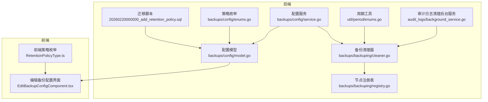
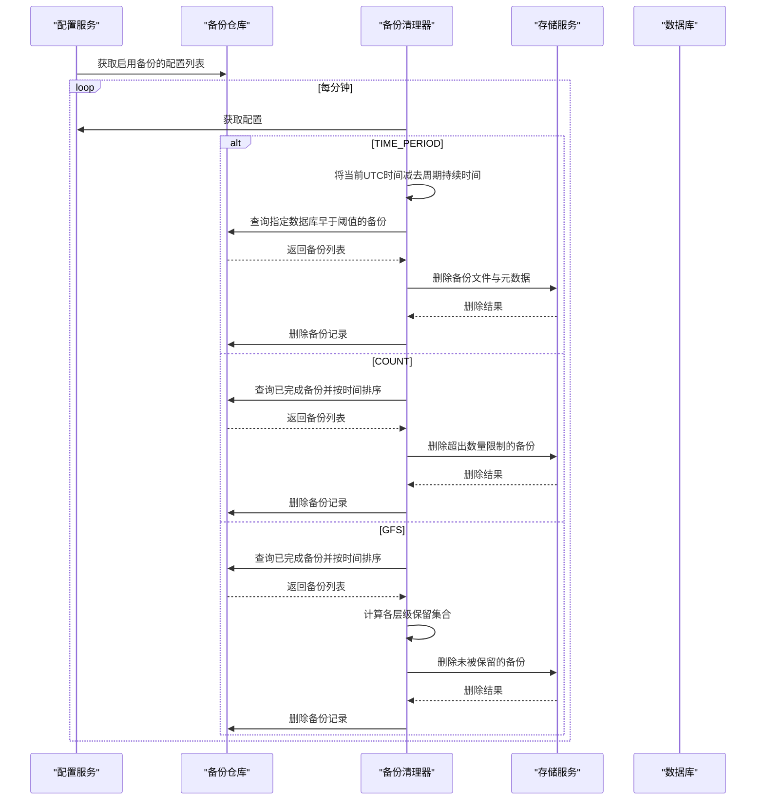
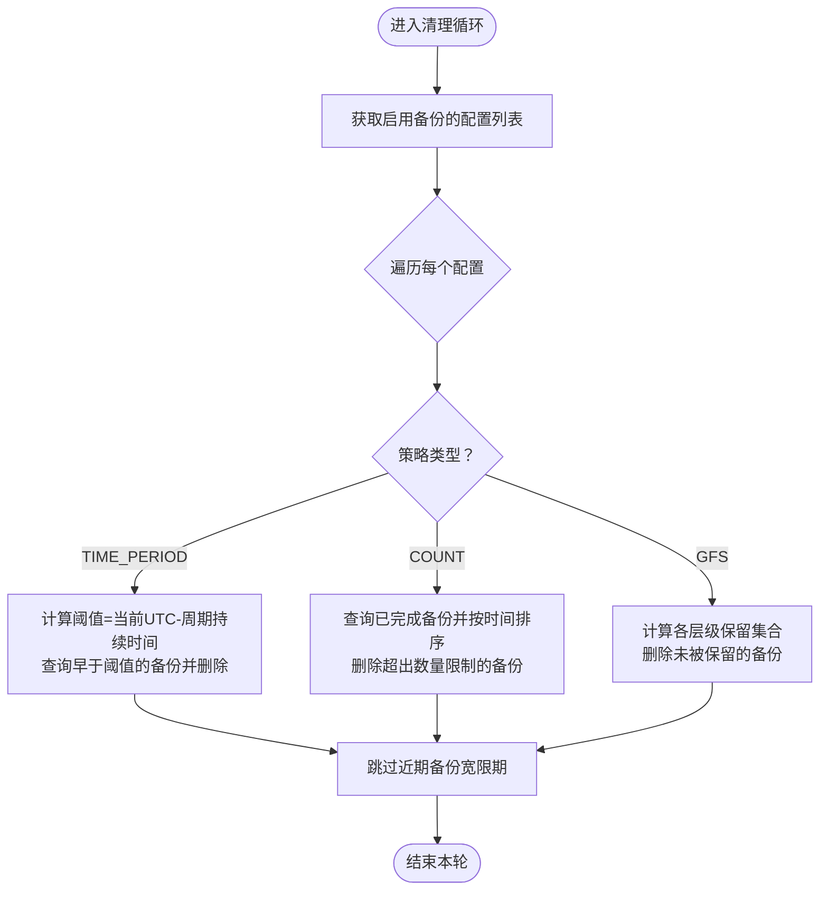
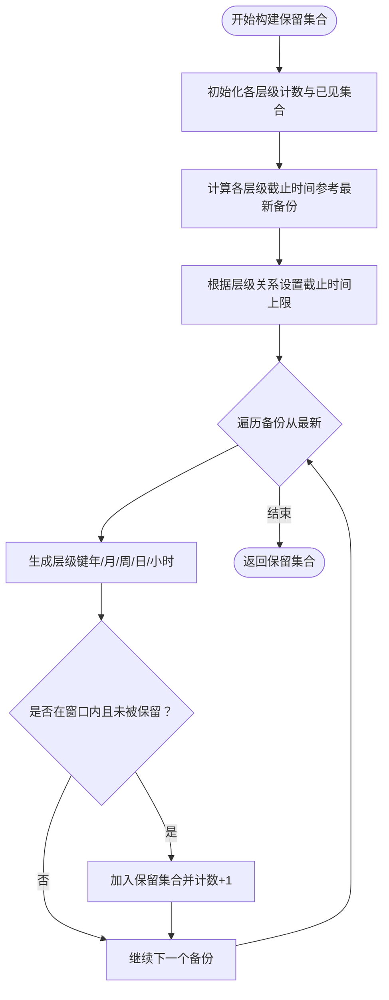
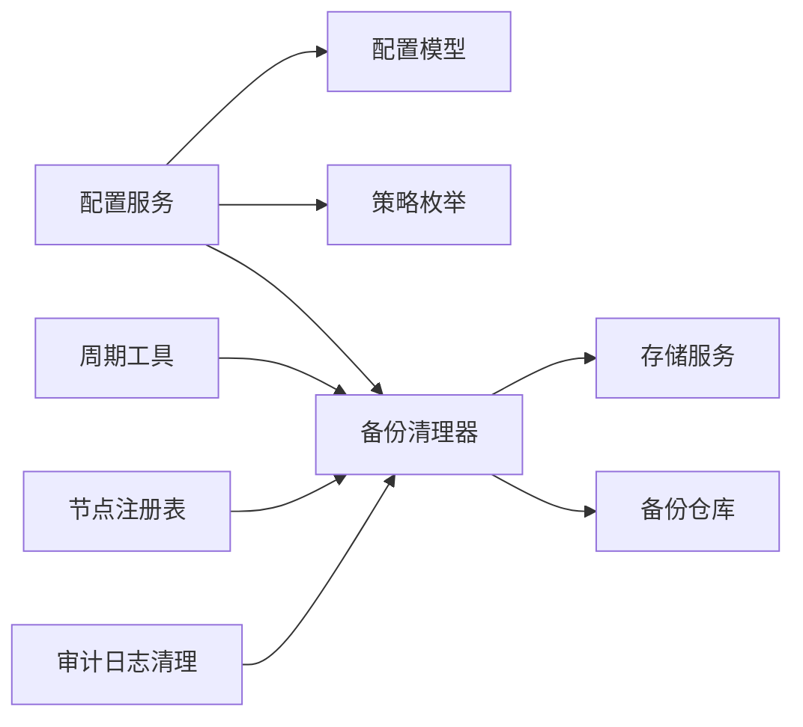

# 时间期限策略

<cite>
**本文引用的文件**
- [backend/migrations/20260220000000_add_retention_policy.sql](file://backend/migrations/20260220000000_add_retention_policy.sql)
- [backend/internal/features/backups/config/model.go](file://backend/internal/features/backups/config/model.go)
- [backend/internal/features/backups/config/enums.go](file://backend/internal/features/backups/config/enums.go)
- [backend/internal/features/backups/config/service.go](file://backend/internal/features/backups/config/service.go)
- [backend/internal/features/backups/backups/backuping/cleaner.go](file://backend/internal/features/backups/backups/backuping/cleaner.go)
- [backend/internal/features/backups/backups/backuping/registry.go](file://backend/internal/features/backups/backups/backuping/registry.go)
- [backend/internal/util/period/enums.go](file://backend/internal/util/period/enums.go)
- [backend/internal/features/audit_logs/background_service.go](file://backend/internal/features/audit_logs/background_service.go)
- [frontend/src/entity/backups/model/RetentionPolicyType.ts](file://frontend/src/entity/backups/model/RetentionPolicyType.ts)
- [frontend/src/features/backups/ui/EditBackupConfigComponent.tsx](file://frontend/src/features/backups/ui/EditBackupConfigComponent.tsx)
</cite>

## 目录
1. [简介](#简介)
2. [项目结构](#项目结构)
3. [核心组件](#核心组件)
4. [架构总览](#架构总览)
5. [详细组件分析](#详细组件分析)
6. [依赖关系分析](#依赖关系分析)
7. [性能考量](#性能考量)
8. [故障排查指南](#故障排查指南)
9. [结论](#结论)
10. [附录](#附录)

## 简介
本文件系统性阐述 Databasus 的“时间期限策略”，即基于时间的自动清理机制。内容涵盖：
- 保留策略类型与配置项：时间周期、数量限制、GFS 策略
- 过期判断逻辑与执行时机
- 时间阈值计算方法、时区处理与闰年考虑
- 不同时间范围对存储成本与恢复灵活性的影响
- 实际配置示例与常见问题解决方案（如时间同步、跨时区备份）

## 项目结构
围绕时间期限策略的关键代码分布在后端迁移脚本、配置模型与服务、清理器、周期工具以及前端配置界面中。

**图表来源**
- [backend/migrations/20260220000000_add_retention_policy.sql:1-39](file://backend/migrations/20260220000000_add_retention_policy.sql#L1-L39)
- [backend/internal/features/backups/config/model.go:16-44](file://backend/internal/features/backups/config/model.go#L16-L44)
- [backend/internal/features/backups/config/enums.go:17-23](file://backend/internal/features/backups/config/enums.go#L17-L23)
- [backend/internal/features/backups/config/service.go:172-174](file://backend/internal/features/backups/config/service.go#L172-L174)
- [backend/internal/features/backups/backups/backuping/cleaner.go:157-183](file://backend/internal/features/backups/backups/backuping/cleaner.go#L157-L183)
- [backend/internal/util/period/enums.go:21-49](file://backend/internal/util/period/enums.go#L21-L49)
- [backend/internal/features/backups/backups/backuping/registry.go:55-77](file://backend/internal/features/backups/backups/backuping/registry.go#L55-L77)
- [backend/internal/features/audit_logs/background_service.go:18-42](file://backend/internal/features/audit_logs/background_service.go#L18-L42)
- [frontend/src/entity/backups/model/RetentionPolicyType.ts:1-6](file://frontend/src/entity/backups/model/RetentionPolicyType.ts#L1-L6)
- [frontend/src/features/backups/ui/EditBackupConfigComponent.tsx:245-254](file://frontend/src/features/backups/ui/EditBackupConfigComponent.tsx#L245-L254)

**章节来源**
- [backend/migrations/20260220000000_add_retention_policy.sql:1-39](file://backend/migrations/20260220000000_add_retention_policy.sql#L1-L39)
- [backend/internal/features/backups/config/model.go:16-44](file://backend/internal/features/backups/config/model.go#L16-L44)
- [backend/internal/features/backups/config/enums.go:17-23](file://backend/internal/features/backups/config/enums.go#L17-L23)
- [backend/internal/features/backups/config/service.go:172-174](file://backend/internal/features/backups/config/service.go#L172-L174)
- [backend/internal/features/backups/backups/backuping/cleaner.go:157-183](file://backend/internal/features/backups/backups/backuping/cleaner.go#L157-L183)
- [backend/internal/util/period/enums.go:21-49](file://backend/internal/util/period/enums.go#L21-L49)
- [backend/internal/features/backups/backups/backuping/registry.go:55-77](file://backend/internal/features/backups/backups/backuping/registry.go#L55-L77)
- [backend/internal/features/audit_logs/background_service.go:18-42](file://backend/internal/features/audit_logs/background_service.go#L18-L42)
- [frontend/src/entity/backups/model/RetentionPolicyType.ts:1-6](file://frontend/src/entity/backups/model/RetentionPolicyType.ts#L1-L6)
- [frontend/src/features/backups/ui/EditBackupConfigComponent.tsx:245-254](file://frontend/src/features/backups/ui/EditBackupConfigComponent.tsx#L245-L254)

## 核心组件
- 数据库迁移：新增备份配置的保留策略字段，并将旧的存储周期字段迁移至新字段。
- 配置模型与服务：定义保留策略类型、默认值与校验规则；提供获取与保存配置的能力。
- 清理器：按策略类型执行清理，支持时间周期、数量限制与 GFS 策略；定时轮询执行。
- 周期工具：将“天/周/月/年”等周期转换为持续时间，用于阈值计算。
- 节点注册表：定期清理不活跃节点，间接影响备份任务调度与资源占用。
- 审计日志清理：独立的后台服务按小时清理过期审计日志，体现统一的“过期清理”模式。

**章节来源**
- [backend/migrations/20260220000000_add_retention_policy.sql:3-17](file://backend/migrations/20260220000000_add_retention_policy.sql#L3-L17)
- [backend/internal/features/backups/config/model.go:16-44](file://backend/internal/features/backups/config/model.go#L16-L44)
- [backend/internal/features/backups/config/service.go:172-174](file://backend/internal/features/backups/config/service.go#L172-L174)
- [backend/internal/features/backups/backups/backuping/cleaner.go:157-183](file://backend/internal/features/backups/backups/backuping/cleaner.go#L157-L183)
- [backend/internal/util/period/enums.go:21-49](file://backend/internal/util/period/enums.go#L21-L49)
- [backend/internal/features/backups/backups/backuping/registry.go:55-77](file://backend/internal/features/backups/backups/backuping/registry.go#L55-L77)
- [backend/internal/features/audit_logs/background_service.go:18-42](file://backend/internal/features/audit_logs/background_service.go#L18-L42)

## 架构总览
下图展示了“时间期限策略”的端到端流程：配置读取、策略选择、阈值计算、备份扫描与删除。

**图表来源**
- [backend/internal/features/backups/config/service.go:172-174](file://backend/internal/features/backups/config/service.go#L172-L174)
- [backend/internal/features/backups/backups/backuping/cleaner.go:157-183](file://backend/internal/features/backups/backups/backuping/cleaner.go#L157-L183)
- [backend/internal/features/backups/backups/backuping/cleaner.go:215-253](file://backend/internal/features/backups/backups/backuping/cleaner.go#L215-L253)
- [backend/internal/features/backups/backups/backuping/cleaner.go:255-295](file://backend/internal/features/backups/backups/backuping/cleaner.go#L255-L295)
- [backend/internal/features/backups/backups/backuping/cleaner.go:297-343](file://backend/internal/features/backups/backups/backuping/cleaner.go#L297-L343)

## 详细组件分析

### 数据库迁移与字段演进
- 新增字段：保留策略类型、时间周期、数量限制、GFS 各层级保留数。
- 字段迁移：将旧的存储周期字段迁移到新的时间周期字段，并在回滚时恢复。
- 默认值：保留策略类型默认为“时间周期”，时间周期默认为空字符串，数量与 GFS 各层级默认为 0。

**章节来源**
- [backend/migrations/20260220000000_add_retention_policy.sql:3-17](file://backend/migrations/20260220000000_add_retention_policy.sql#L3-L17)
- [backend/migrations/20260220000000_add_retention_policy.sql:13-28](file://backend/migrations/20260220000000_add_retention_policy.sql#L13-L28)

### 配置模型与策略类型
- 策略类型：
  - TIME_PERIOD：基于时间周期的保留策略
  - COUNT：基于数量的保留策略
  - GFS：基于分层保留（小时/日/周/月/年）的保留策略
- 关键字段：
  - RetentionTimePeriod：时间周期（如 DAY/WEEK/MONTH/YEAR 等）
  - RetentionCount：保留的备份数量
  - RetentionGfsHours/Days/Weeks/Months/Years：GFS 各层级保留数
- 默认初始化：服务在首次创建配置时设置默认策略类型为 TIME_PERIOD，默认时间周期为 3 个月。

**章节来源**
- [backend/internal/features/backups/config/enums.go:17-23](file://backend/internal/features/backups/config/enums.go#L17-L23)
- [backend/internal/features/backups/config/model.go:16-44](file://backend/internal/features/backups/config/model.go#L16-L44)
- [backend/internal/features/backups/config/service.go:299-323](file://backend/internal/features/backups/config/service.go#L299-L323)

### 周期工具与时间阈值计算
- 周期到持续时间映射：将 DAY/ WEEK/ MONTH/ YEAR 等周期转换为固定时长（以小时为单位），用于计算“阈值时间”。
- 阈值计算：当前 UTC 时间减去周期持续时间，得到“应删除早于此时间”的阈值。
- 特殊处理：
  - FOREVER：返回 0 持续时间，表示永不过期
  - 比较逻辑：FOREVER 视为最长周期

**章节来源**
- [backend/internal/util/period/enums.go:21-49](file://backend/internal/util/period/enums.go#L21-L49)
- [backend/internal/util/period/enums.go:51-82](file://backend/internal/util/period/enums.go#L51-L82)
- [backend/internal/features/backups/backups/backuping/cleaner.go:224-225](file://backend/internal/features/backups/backups/backuping/cleaner.go#L224-L225)

### 清理执行时机与策略分支
- 执行频率：清理器每分钟轮询一次。
- 执行内容：
  - 按保留策略类型分别清理
  - 超出配额的云存储清理（仅云环境）
  - 清理长时间未完成的上传基线备份
- 近期备份保护：对“刚创建的备份”施加宽限期，避免误删。

**图表来源**
- [backend/internal/features/backups/backups/backuping/cleaner.go:37-71](file://backend/internal/features/backups/backups/backuping/cleaner.go#L37-L71)
- [backend/internal/features/backups/backups/backuping/cleaner.go:157-183](file://backend/internal/features/backups/backups/backuping/cleaner.go#L157-L183)
- [backend/internal/features/backups/backups/backuping/cleaner.go:215-253](file://backend/internal/features/backups/backups/backuping/cleaner.go#L215-L253)
- [backend/internal/features/backups/backups/backuping/cleaner.go:255-295](file://backend/internal/features/backups/backups/backuping/cleaner.go#L255-L295)
- [backend/internal/features/backups/backups/backuping/cleaner.go:297-343](file://backend/internal/features/backups/backups/backuping/cleaner.go#L297-L343)

**章节来源**
- [backend/internal/features/backups/backups/backuping/cleaner.go:20-23](file://backend/internal/features/backups/backups/backuping/cleaner.go#L20-L23)
- [backend/internal/features/backups/backups/backuping/cleaner.go:37-71](file://backend/internal/features/backups/backups/backuping/cleaner.go#L37-L71)
- [backend/internal/features/backups/backups/backuping/cleaner.go:157-183](file://backend/internal/features/backups/backups/backuping/cleaner.go#L157-L183)
- [backend/internal/features/backups/backups/backuping/cleaner.go:396-398](file://backend/internal/features/backups/backups/backuping/cleaner.go#L396-L398)

### GFS 策略详解
- 层级保留：同时支持小时、日、周、月、年的多层级保留，且同一备份可同时满足多个层级的保留条件。
- 保留集合构建：从最新备份开始，按层级窗口计算保留集合，确保高层级窗口不向更底层扩展。
- 闰年与月份边界：使用日期运算函数处理月末与闰年，保证跨月/跨年的边界正确性。

**图表来源**
- [backend/internal/features/backups/backups/backuping/cleaner.go:400-511](file://backend/internal/features/backups/backups/backuping/cleaner.go#L400-L511)
- [backend/internal/features/backups/backups/backuping/cleaner.go:425-429](file://backend/internal/features/backups/backups/backuping/cleaner.go#L425-L429)

**章节来源**
- [backend/internal/features/backups/backups/backuping/cleaner.go:297-343](file://backend/internal/features/backups/backups/backuping/cleaner.go#L297-L343)
- [backend/internal/features/backups/backups/backuping/cleaner.go:400-511](file://backend/internal/features/backups/backups/backuping/cleaner.go#L400-L511)

### 时区与时间同步注意事项
- 统一使用 UTC：阈值计算与比较均基于 UTC 时间，避免跨时区差异导致的清理偏差。
- 近期备份宽限期：对“刚创建的备份”施加宽限期，防止新备份被立即清理。
- 前端显示：前端将 UTC 时间转换为本地时间进行展示，不影响后端清理逻辑。

**章节来源**
- [backend/internal/features/backups/backups/backuping/cleaner.go:224-225](file://backend/internal/features/backups/backups/backuping/cleaner.go#L224-L225)
- [backend/internal/features/backups/backups/backuping/cleaner.go:396-398](file://backend/internal/features/backups/backups/backuping/cleaner.go#L396-L398)
- [frontend/src/features/backups/ui/EditBackupConfigComponent.tsx:226-243](file://frontend/src/features/backups/ui/EditBackupConfigComponent.tsx#L226-L243)

### 存储成本与恢复灵活性权衡
- 时间周期策略：通过调整周期（如 DAY/3_MONTH/6_MONTH/YEAR 等）平衡存储成本与恢复灵活性。
- 数量策略：适用于需要严格控制备份数量的场景，适合短期高频恢复需求。
- GFS 策略：提供多层级保留，兼顾长期归档与短期恢复，适合合规与法规要求。

**章节来源**
- [backend/internal/util/period/enums.go:7-18](file://backend/internal/util/period/enums.go#L7-L18)
- [backend/internal/features/backups/config/model.go:21-29](file://backend/internal/features/backups/config/model.go#L21-L29)
- [backend/internal/features/backups/config/service.go:299-323](file://backend/internal/features/backups/config/service.go#L299-L323)

### 配置参数说明与示例
- 保留策略类型
  - TIME_PERIOD：基于时间周期
  - COUNT：基于数量
  - GFS：分层保留
- 典型配置示例
  - 保留 7 天：TIME_PERIOD 设置为 WEEK，或 DAY×7
  - 保留 30 天：TIME_PERIOD 设置为 MONTH 或 DAY×30
  - 保留 90 天：TIME_PERIOD 设置为 3_MONTH
  - 保留 1 年：TIME_PERIOD 设置为 YEAR
  - 仅保留最近 5 个备份：COUNT 设置为 5
  - GFS：按小时/日/周/月/年分别设置保留数，例如 24 小时、7 天、4 周、12 月、5 年

**章节来源**
- [backend/internal/features/backups/config/enums.go:17-23](file://backend/internal/features/backups/config/enums.go#L17-L23)
- [backend/internal/util/period/enums.go:7-18](file://backend/internal/util/period/enums.go#L7-L18)
- [backend/internal/features/backups/config/service.go:299-323](file://backend/internal/features/backups/config/service.go#L299-L323)

## 依赖关系分析
- 配置服务依赖配置模型与周期工具，负责读取与保存配置。
- 清理器依赖配置服务、存储服务与备份仓库，负责执行清理。
- 周期工具为清理器提供时间阈值计算能力。
- 节点注册表定期清理不活跃节点，减少资源占用。
- 审计日志清理服务采用类似的定时清理模式。

**图表来源**
- [backend/internal/features/backups/config/service.go:17-31](file://backend/internal/features/backups/config/service.go#L17-L31)
- [backend/internal/features/backups/backups/backuping/cleaner.go:25-35](file://backend/internal/features/backups/backups/backuping/cleaner.go#L25-L35)
- [backend/internal/util/period/enums.go:21-49](file://backend/internal/util/period/enums.go#L21-L49)
- [backend/internal/features/backups/backups/backuping/registry.go:55-77](file://backend/internal/features/backups/backups/backuping/registry.go#L55-L77)
- [backend/internal/features/audit_logs/background_service.go:18-42](file://backend/internal/features/audit_logs/background_service.go#L18-L42)

**章节来源**
- [backend/internal/features/backups/config/service.go:17-31](file://backend/internal/features/backups/config/service.go#L17-L31)
- [backend/internal/features/backups/backups/backuping/cleaner.go:25-35](file://backend/internal/features/backups/backups/backuping/cleaner.go#L25-L35)
- [backend/internal/util/period/enums.go:21-49](file://backend/internal/util/period/enums.go#L21-L49)
- [backend/internal/features/backups/backups/backuping/registry.go:55-77](file://backend/internal/features/backups/backups/backuping/registry.go#L55-L77)
- [backend/internal/features/audit_logs/background_service.go:18-42](file://backend/internal/features/audit_logs/background_service.go#L18-L42)

## 性能考量
- 清理频率：每分钟一次，开销较小，适合长期运行。
- 查询优化：按数据库维度查询备份，避免全表扫描。
- 存储删除：先删除文件与元数据，再删除记录，失败容忍度高。
- GFS 保留集合：一次性构建，复杂度与备份数量线性相关，建议合理设置层级保留数。

[本节为通用指导，无需列出具体文件来源]

## 故障排查指南
- 清理未生效
  - 检查配置是否启用备份与策略类型是否正确
  - 确认当前时间与周期设置是否导致阈值过近
  - 查看清理器日志中的错误信息
- 近期备份被误删
  - 检查宽限期设置与备份创建时间
  - 确保系统时间准确，避免跨时区差异
- 云存储超限清理
  - 确认订阅状态与存储配额
  - 检查清理器对超限备份的逐条删除日志
- 节点不活跃
  - 检查节点心跳与注册表清理日志
  - 确认节点健康检查与网络连通性

**章节来源**
- [backend/internal/features/backups/backups/backuping/cleaner.go:58-68](file://backend/internal/features/backups/backups/backuping/cleaner.go#L58-L68)
- [backend/internal/features/backups/backups/backuping/cleaner.go:185-213](file://backend/internal/features/backups/backups/backuping/cleaner.go#L185-L213)
- [backend/internal/features/backups/backups/backuping/registry.go:523-626](file://backend/internal/features/backups/backups/backuping/registry.go#L523-L626)
- [backend/internal/features/audit_logs/background_service.go:29-41](file://backend/internal/features/audit_logs/background_service.go#L29-L41)

## 结论
Databasus 的时间期限策略通过“配置驱动 + 定时清理”的方式，实现了灵活可控的备份生命周期管理。其核心优势在于：
- 明确的策略类型与阈值计算，便于理解与维护
- 对近期备份的保护机制，降低误删风险
- 支持多种策略组合，满足不同业务场景
- 统一的后台清理模式，易于扩展与监控

[本节为总结性内容，无需列出具体文件来源]

## 附录

### 常见问题与解答
- 如何处理跨时区备份？
  - 后端统一使用 UTC 计算阈值，前端展示时转换为本地时间，避免跨时区差异。
- 为什么新备份很快被清理？
  - 可能是策略周期过短或宽限期不足，请检查配置与系统时间。
- 如何验证清理是否生效？
  - 查看清理器日志中的“删除旧备份/删除超额备份”记录，确认备份文件与记录均已移除。

**章节来源**
- [backend/internal/features/backups/backups/backuping/cleaner.go:224-225](file://backend/internal/features/backups/backups/backuping/cleaner.go#L224-L225)
- [backend/internal/features/backups/backups/backuping/cleaner.go:396-398](file://backend/internal/features/backups/backups/backuping/cleaner.go#L396-L398)
- [frontend/src/features/backups/ui/EditBackupConfigComponent.tsx:226-243](file://frontend/src/features/backups/ui/EditBackupConfigComponent.tsx#L226-L243)