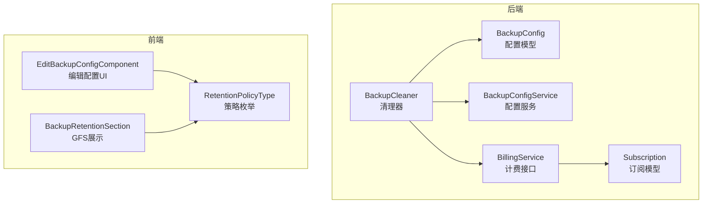
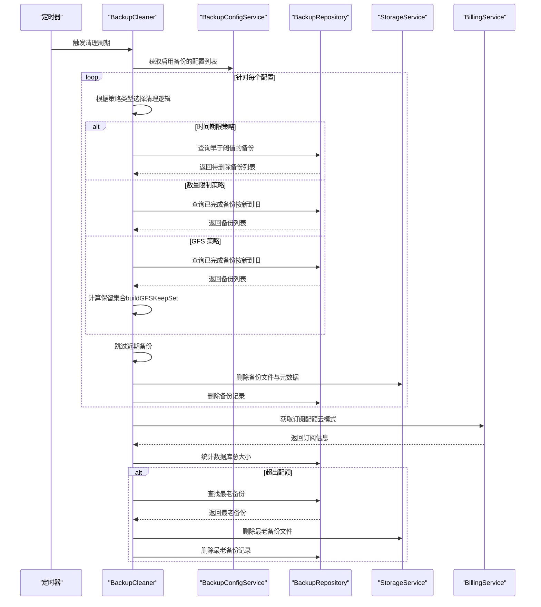
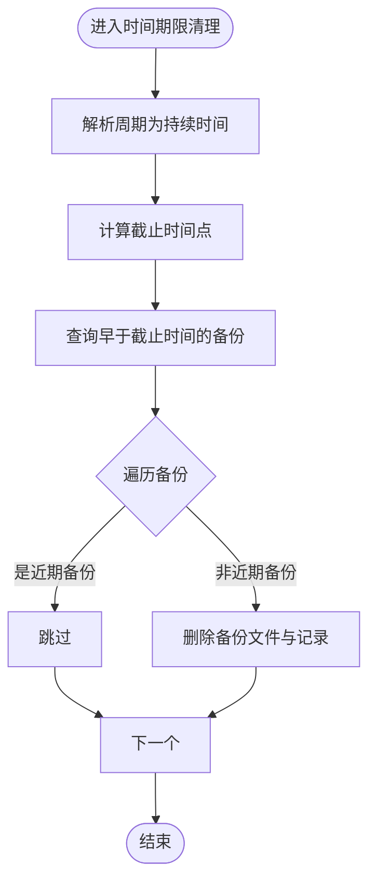
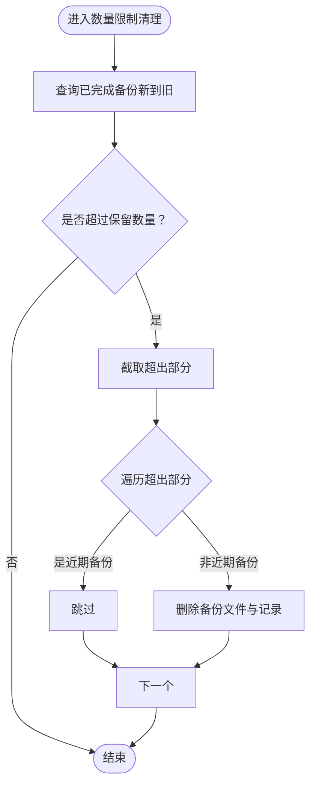
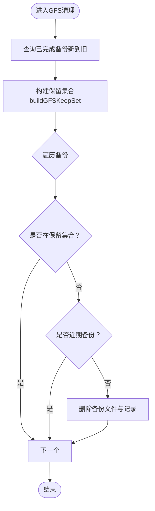
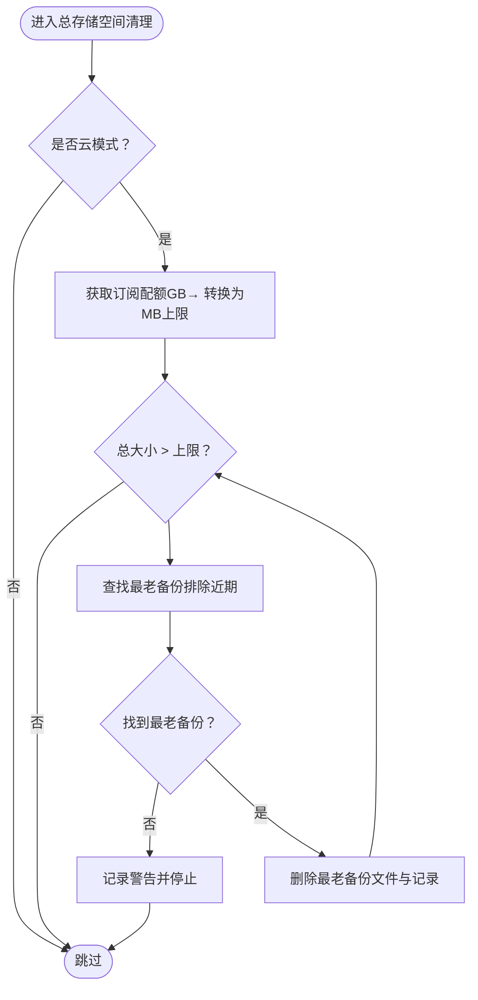
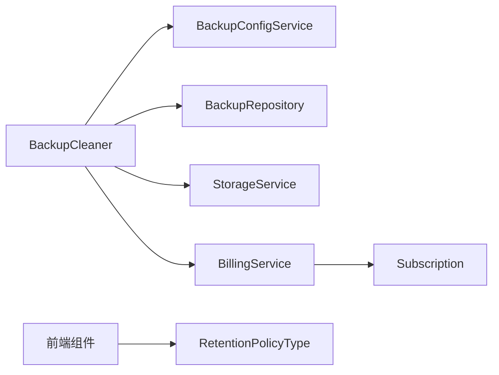

# 灵活保留策略

<cite>
**本文引用的文件**
- [cleaner.go](file://backend/internal/features/backups/backups/backuping/cleaner.go)
- [cleaner_test.go](file://backend/internal/features/backups/backups/backuping/cleaner_test.go)
- [cleaner_gfs_test.go](file://backend/internal/features/backups/backups/backuping/cleaner_gfs_test.go)
- [model.go](file://backend/internal/features/backups/config/model.go)
- [enums.go](file://backend/internal/features/backups/config/enums.go)
- [service.go](file://backend/internal/features/backups/config/service.go)
- [interfaces.go](file://backend/internal/features/backups/backups/backuping/interfaces.go)
- [subscription.go](file://backend/internal/features/billing/models/subscription.go)
- [RetentionPolicyType.ts](file://frontend/src/entity/backups/model/RetentionPolicyType.ts)
- [EditBackupConfigComponent.tsx](file://frontend/src/features/backups/ui/EditBackupConfigComponent.tsx)
- [BackupRetentionSection.tsx](file://frontend/src/features/billing/ui/BackupRetentionSection.tsx)
</cite>

## 目录
1. [简介](#简介)
2. [项目结构](#项目结构)
3. [核心组件](#核心组件)
4. [架构概览](#架构概览)
5. [详细组件分析](#详细组件分析)
6. [依赖分析](#依赖分析)
7. [性能考虑](#性能考虑)
8. [故障排除指南](#故障排除指南)
9. [结论](#结论)
10. [附录](#附录)

## 简介
本文件系统性阐述 Databasus 的灵活保留策略功能，覆盖三种核心策略：时间期限策略（基于时间的自动清理）、数量限制策略（基于备份数量的滚动删除）、GFS（祖父-父亲-儿子）分层策略（多层级长期保留）。同时解释大小限制功能如何控制单个备份和总存储空间的使用，并提供配置方法、计算逻辑、清理时机、最佳实践与性能优化建议。

## 项目结构
保留策略相关代码主要分布在后端备份子系统中，前端提供用户界面以配置策略类型与参数。关键模块包括：
- 后端保留策略执行器：负责按策略扫描并删除过期或超出配额的备份
- 配置模型与服务：定义策略类型、参数校验与默认值
- 前端策略枚举与表单组件：展示策略类型与提示信息
- 计费与订阅模型：在云模式下启用总存储空间限制清理

图表来源
- [cleaner.go:25-35](file://backend/internal/features/backups/backups/backuping/cleaner.go#L25-L35)
- [model.go:16-44](file://backend/internal/features/backups/config/model.go#L16-L44)
- [service.go:17-25](file://backend/internal/features/backups/config/service.go#L17-L25)
- [interfaces.go:11-12](file://backend/internal/features/backups/backups/backuping/interfaces.go#L11-L12)
- [subscription.go:57-72](file://backend/internal/features/billing/models/subscription.go#L57-L72)
- [RetentionPolicyType.ts:1-5](file://frontend/src/entity/backups/model/RetentionPolicyType.ts#L1-L5)
- [EditBackupConfigComponent.tsx:579-611](file://frontend/src/features/backups/ui/EditBackupConfigComponent.tsx#L579-L611)
- [BackupRetentionSection.tsx:1-40](file://frontend/src/features/billing/ui/BackupRetentionSection.tsx#L1-L40)

章节来源
- [cleaner.go:1-71](file://backend/internal/features/backups/backups/backuping/cleaner.go#L1-L71)
- [model.go:1-44](file://backend/internal/features/backups/config/model.go#L1-L44)
- [service.go:1-32](file://backend/internal/features/backups/config/service.go#L1-L32)
- [RetentionPolicyType.ts:1-5](file://frontend/src/entity/backups/model/RetentionPolicyType.ts#L1-L5)
- [EditBackupConfigComponent.tsx:579-611](file://frontend/src/features/backups/ui/EditBackupConfigComponent.tsx#L579-L611)
- [BackupRetentionSection.tsx:1-40](file://frontend/src/features/billing/ui/BackupRetentionSection.tsx#L1-L40)

## 核心组件
- 保留策略类型
  - 时间期限策略：按配置的时间周期删除过期备份
  - 数量限制策略：仅保留最近指定数量的备份
  - GFS 分层策略：按小时/日/周/月/年多个层级分别保留一定数量的代表性备份
- 清理器 BackupCleaner
  - 定时运行，按策略类型调用对应清理函数
  - 在云模式下检查订阅配额并按总存储空间上限清理
  - 跳过“近期备份”（防止刚完成的备份被立即删除）
- 配置模型与服务
  - BackupConfig 定义策略类型与各层级参数
  - BackupConfigService 提供保存、查询与默认初始化逻辑
- 计费与订阅
  - BillingService 接口用于获取订阅信息
  - Subscription 提供存储配额与状态判断

章节来源
- [enums.go:17-23](file://backend/internal/features/backups/config/enums.go#L17-L23)
- [model.go:16-44](file://backend/internal/features/backups/config/model.go#L16-L44)
- [service.go:27-32](file://backend/internal/features/backups/config/service.go#L27-L32)
- [interfaces.go:11-12](file://backend/internal/features/backups/backups/backuping/interfaces.go#L11-L12)
- [subscription.go:57-72](file://backend/internal/features/billing/models/subscription.go#L57-L72)

## 架构概览
保留策略的执行流程由 BackupCleaner 的定时循环驱动，根据数据库的备份配置选择清理策略，并在云模式下结合订阅配额进行总存储空间清理。

图表来源
- [cleaner.go:37-71](file://backend/internal/features/backups/backups/backuping/cleaner.go#L37-L71)
- [cleaner.go:157-183](file://backend/internal/features/backups/backups/backuping/cleaner.go#L157-L183)
- [cleaner.go:185-213](file://backend/internal/features/backups/backups/backuping/cleaner.go#L185-L213)
- [interfaces.go:11-12](file://backend/internal/features/backups/backups/backuping/interfaces.go#L11-L12)

## 详细组件分析

### 时间期限策略（基于时间的自动清理）
- 配置与触发
  - 策略类型：TIME_PERIOD
  - 参数：retention_time_period（支持“永久”等周期）
  - 触发：定时任务按策略类型调用 cleanByTimePeriod
- 计算逻辑
  - 将周期转换为持续时间，计算截止时间点
  - 查询早于截止时间的备份
  - 跳过“近期备份”（避免刚完成的备份被删除）
  - 删除备份文件与记录
- 清理时机
  - 每分钟定时器触发一次清理
  - 对所有启用备份的数据库逐一处理

图表来源
- [cleaner.go:215-253](file://backend/internal/features/backups/backups/backuping/cleaner.go#L215-L253)
- [cleaner.go:396-398](file://backend/internal/features/backups/backups/backuping/cleaner.go#L396-L398)

章节来源
- [enums.go:20-21](file://backend/internal/features/backups/config/enums.go#L20-L21)
- [model.go:21-22](file://backend/internal/features/backups/config/model.go#L21-L22)
- [cleaner.go:215-253](file://backend/internal/features/backups/backups/backuping/cleaner.go#L215-L253)
- [cleaner_test.go:27-104](file://backend/internal/features/backups/backups/backuping/cleaner_test.go#L27-L104)

### 数量限制策略（基于备份数量的滚动删除）
- 配置与触发
  - 策略类型：COUNT
  - 参数：retention_count（必须大于 0）
  - 触发：定时任务按策略类型调用 cleanByCount
- 计算逻辑
  - 查询数据库已完成备份，按“新到旧”排序
  - 保留前 N 个备份，其余删除
  - 跳过“近期备份”
  - 删除备份文件与记录
- 清理时机
  - 每分钟定时器触发一次清理

图表来源
- [cleaner.go:255-294](file://backend/internal/features/backups/backups/backuping/cleaner.go#L255-L294)

章节来源
- [enums.go:21-22](file://backend/internal/features/backups/config/enums.go#L21-L22)
- [model.go](file://backend/internal/features/backups/config/model.go#L24)
- [cleaner.go:255-294](file://backend/internal/features/backups/backups/backuping/cleaner.go#L255-L294)
- [cleaner_test.go:163-290](file://backend/internal/features/backups/backups/backuping/cleaner_test.go#L163-L290)

### GFS（祖父-父亲-儿子）分层策略
- 配置与触发
  - 策略类型：GFS
  - 参数：retention_gfs_hours/days/weeks/months/years（至少一个大于 0）
  - 触发：定时任务按策略类型调用 cleanByGFS
- 计算逻辑
  - 查询已完成备份，按“新到旧”排序
  - 使用 buildGFSKeepSet 计算保留集合：
    - 为每级设置参考时间点与窗口边界
    - 逐级计算每级的截止时间与去重键（按小时/天/周/月/年粒度）
    - 层级间采用“层级吸收”约束，避免低频窗口吸收高频备份
    - 新备份可同时填充多个层级的“代表性槽位”
  - 未在保留集合中的备份将被删除
  - 跳过“近期备份”
- 清理时机
  - 每分钟定时器触发一次清理

图表来源
- [cleaner.go:297-343](file://backend/internal/features/backups/backups/backuping/cleaner.go#L297-L343)
- [cleaner.go:400-511](file://backend/internal/features/backups/backups/backuping/cleaner.go#L400-L511)

章节来源
- [enums.go:22-23](file://backend/internal/features/backups/config/enums.go#L22-L23)
- [model.go:25-29](file://backend/internal/features/backups/config/model.go#L25-L29)
- [cleaner.go:297-343](file://backend/internal/features/backups/backups/backuping/cleaner.go#L297-L343)
- [cleaner.go:400-511](file://backend/internal/features/backups/backups/backuping/cleaner.go#L400-L511)
- [cleaner_gfs_test.go:21-369](file://backend/internal/features/backups/backups/backuping/cleaner_gfs_test.go#L21-L369)

### 大小限制功能（总存储空间与单个备份控制）
- 总存储空间限制（云模式）
  - 仅在云环境启用
  - 通过 BillingService 获取订阅配额，换算为总存储上限（MB）
  - 循环删除最老备份，直到总大小不超过上限
  - 若删除后仍超限，记录警告并停止继续删除
- 单个备份大小控制
  - 清理器在删除备份时会读取备份记录中的大小字段，用于日志输出与统计
  - 实际单个备份大小由上游备份过程决定，清理器不强制限制单个备份大小
- 清理时机
  - 每分钟定时器触发一次总空间清理

图表来源
- [cleaner.go:185-213](file://backend/internal/features/backups/backups/backuping/cleaner.go#L185-L213)
- [cleaner.go:345-394](file://backend/internal/features/backups/backups/backuping/cleaner.go#L345-L394)
- [interfaces.go:11-12](file://backend/internal/features/backups/backups/backuping/interfaces.go#L11-L12)
- [subscription.go:57-72](file://backend/internal/features/billing/models/subscription.go#L57-L72)

章节来源
- [cleaner.go:185-213](file://backend/internal/features/backups/backups/backuping/cleaner.go#L185-L213)
- [cleaner.go:345-394](file://backend/internal/features/backups/backups/backuping/cleaner.go#L345-L394)
- [interfaces.go:11-12](file://backend/internal/features/backups/backups/backuping/interfaces.go#L11-L12)
- [subscription.go:57-72](file://backend/internal/features/billing/models/subscription.go#L57-L72)
- [cleaner_test.go:1050-1091](file://backend/internal/features/backups/backups/backuping/cleaner_test.go#L1050-L1091)

### 前端策略配置与展示
- 策略类型枚举
  - 前端定义与后端一致的策略类型枚举，确保 UI 与后端一致
- 编辑配置组件
  - 提供策略类型选择与参数输入
  - GFS 策略提供“什么是 GFS”的提示说明
- GFS 展示组件
  - 展示在当前策略下能保留的总备份数与各级别保留数量

章节来源
- [RetentionPolicyType.ts:1-5](file://frontend/src/entity/backups/model/RetentionPolicyType.ts#L1-L5)
- [EditBackupConfigComponent.tsx:579-611](file://frontend/src/features/backups/ui/EditBackupConfigComponent.tsx#L579-L611)
- [BackupRetentionSection.tsx:1-40](file://frontend/src/features/billing/ui/BackupRetentionSection.tsx#L1-L40)

## 依赖分析
- 组件耦合
  - BackupCleaner 依赖 BackupConfigService 获取配置、BackupRepository 查询备份、StorageService 删除文件、BillingService 获取订阅
  - 配置模型与服务之间强耦合，验证逻辑集中在模型层
- 外部依赖
  - 订阅模型提供配额与状态判断，影响清理行为
  - 前端通过枚举与组件与后端策略保持一致

图表来源
- [cleaner.go:25-35](file://backend/internal/features/backups/backups/backuping/cleaner.go#L25-L35)
- [service.go:17-25](file://backend/internal/features/backups/config/service.go#L17-L25)
- [interfaces.go:11-12](file://backend/internal/features/backups/backups/backuping/interfaces.go#L11-L12)
- [subscription.go:57-72](file://backend/internal/features/billing/models/subscription.go#L57-L72)
- [RetentionPolicyType.ts:1-5](file://frontend/src/entity/backups/model/RetentionPolicyType.ts#L1-L5)

章节来源
- [service.go:17-25](file://backend/internal/features/backups/config/service.go#L17-L25)
- [interfaces.go:11-12](file://backend/internal/features/backups/backups/backuping/interfaces.go#L11-L12)

## 性能考虑
- 定时器频率
  - 清理器每分钟运行一次，平衡清理及时性与系统开销
- 查询与删除
  - 时间/数量策略仅需少量查询与删除操作，成本较低
  - GFS 策略需要构建保留集合，复杂度与备份数量线性相关
- 云模式总空间清理
  - 采用“最老优先”策略，每次删除一个备份，避免一次性大范围扫描
- 近期备份保护
  - 通过“近期备份宽限期”避免刚完成的备份被删除，减少重复备份风险
- 建议
  - 在高并发备份场景下，适当降低清理频率或分批处理
  - 对 GFS 策略，合理设置各级别保留数量，避免过多层级导致保留集合计算复杂度上升

## 故障排除指南
- 策略未生效
  - 检查数据库是否启用备份以及策略类型是否正确
  - 确认定时器正常运行且未出现错误日志
- GFS 保留异常
  - 检查各级别保留数量是否合理
  - 关注“层级吸收”边界条件，确保高频窗口不会吸收低频备份
- 云模式总空间清理无效
  - 确认当前环境为云模式
  - 检查订阅配额是否正确返回
- 刚完成的备份被删除
  - 检查“近期备份宽限期”是否被误调整
  - 确认清理顺序未在备份上传完成前触发

章节来源
- [cleaner.go:37-71](file://backend/internal/features/backups/backups/backuping/cleaner.go#L37-L71)
- [cleaner.go:396-398](file://backend/internal/features/backups/backups/backuping/cleaner.go#L396-L398)
- [cleaner_test.go:1050-1091](file://backend/internal/features/backups/backups/backuping/cleaner_test.go#L1050-L1091)

## 结论
Databasus 的保留策略通过统一的清理器与清晰的策略模型，实现了时间、数量与 GFS 三类策略的灵活组合。在云模式下，配合订阅配额可有效控制总存储空间占用。通过合理的策略配置与参数设置，可在满足合规与恢复需求的同时，显著降低长期存储成本。

## 附录

### 配置示例与最佳实践
- 时间期限策略
  - 适用场景：法规要求短期保留（如 7 天），长期归档通过其他手段处理
  - 建议：与备份间隔配合，避免频繁清理造成数据碎片化
- 数量限制策略
  - 适用场景：资源紧张或对历史版本数量有限制
  - 建议：保留数量不宜过少，避免影响回滚与恢复
- GFS 策略
  - 适用场景：长期保留与成本平衡，兼顾近期与远期恢复需求
  - 建议：每日/每周/每月/每年的保留数量应与业务恢复目标匹配；避免过度设置导致空间浪费
- 总存储空间限制
  - 适用场景：云模式下的容量预算控制
  - 建议：定期评估备份增长趋势，动态调整订阅配额与策略参数

### 策略选择指南
- 业务场景
  - 开发测试：时间期限策略或数量限制策略
  - 生产环境：GFS 策略作为主策略，辅以时间期限策略兜底
  - 合规审计：GFS 策略保留关键时间点，时间期限策略确保过期数据清理
- 成本控制
  - 优先使用 GFS 策略，减少冗余备份
  - 在云模式下启用总存储空间清理，避免超支