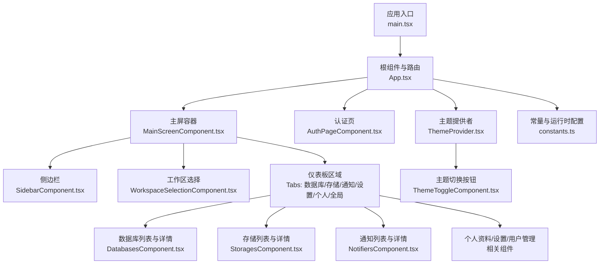
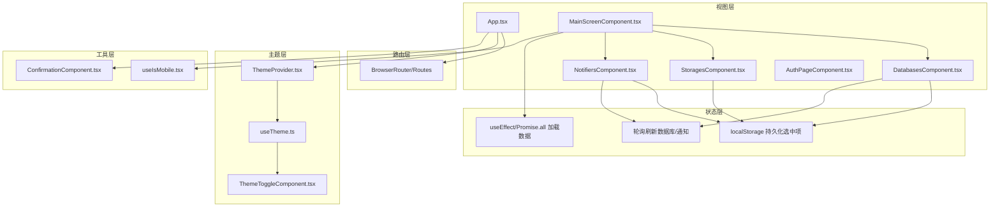
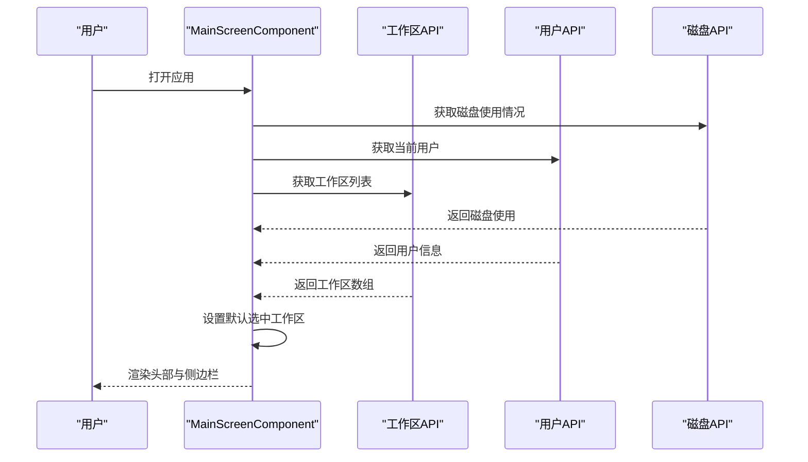
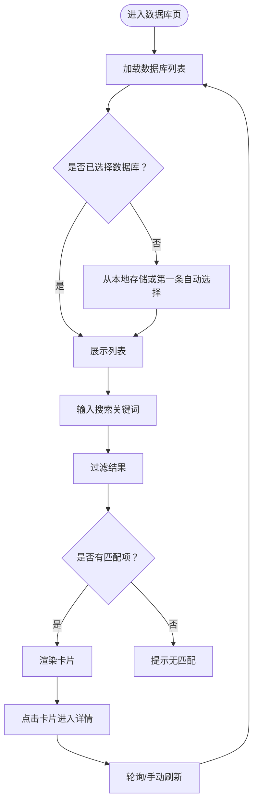
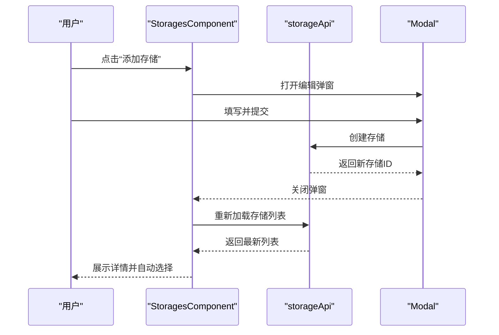
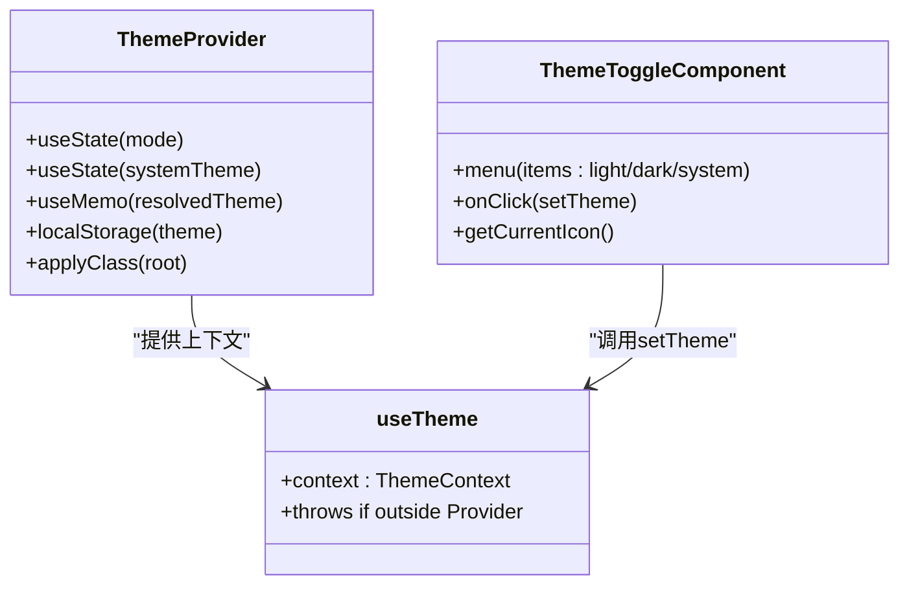
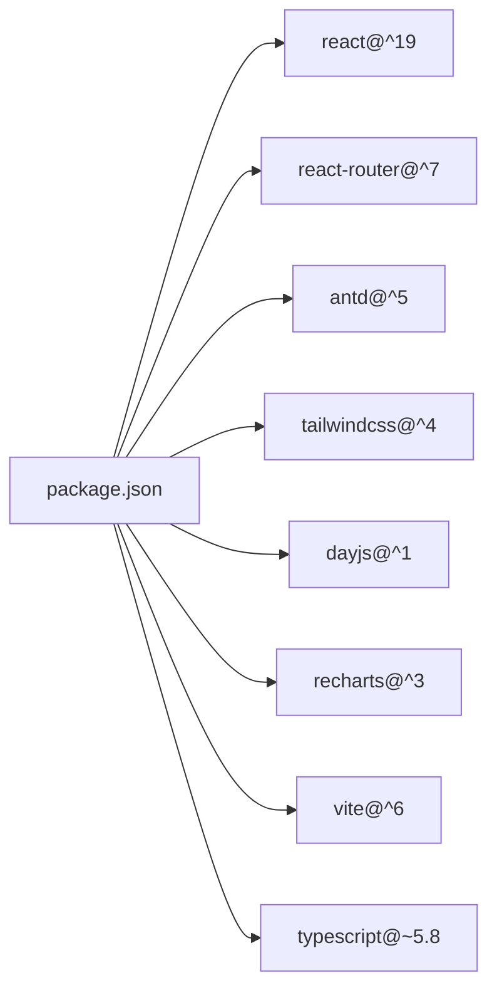

# 用户友好界面

<cite>
**本文引用的文件**
- [frontend/src/main.tsx](file://frontend/src/main.tsx)
- [frontend/src/App.tsx](file://frontend/src/App.tsx)
- [frontend/package.json](file://frontend/package.json)
- [frontend/vite.config.ts](file://frontend/vite.config.ts)
- [frontend/src/constants.ts](file://frontend/src/constants.ts)
- [frontend/src/shared/theme/ThemeProvider.tsx](file://frontend/src/shared/theme/ThemeProvider.tsx)
- [frontend/src/shared/theme/useTheme.ts](file://frontend/src/shared/theme/useTheme.ts)
- [frontend/src/shared/ui/ThemeToggleComponent.tsx](file://frontend/src/shared/ui/ThemeToggleComponent.tsx)
- [frontend/src/widgets/main/MainScreenComponent.tsx](file://frontend/src/widgets/main/MainScreenComponent.tsx)
- [frontend/src/shared/hooks/useIsMobile.tsx](file://frontend/src/shared/hooks/useIsMobile.tsx)
- [frontend/src/pages/AuthPageComponent.tsx](file://frontend/src/pages/AuthPageComponent.tsx)
- [frontend/src/features/databases/ui/DatabasesComponent.tsx](file://frontend/src/features/databases/ui/DatabasesComponent.tsx)
- [frontend/src/features/storages/ui/StoragesComponent.tsx](file://frontend/src/features/storages/ui/StoragesComponent.tsx)
- [frontend/src/features/notifiers/ui/NotifiersComponent.tsx](file://frontend/src/features/notifiers/ui/NotifiersComponent.tsx)
- [frontend/src/shared/ui/ConfirmationComponent.tsx](file://frontend/src/shared/ui/ConfirmationComponent.tsx)
</cite>

## 目录
1. [简介](#简介)
2. [项目结构](#项目结构)
3. [核心组件](#核心组件)
4. [架构总览](#架构总览)
5. [详细组件分析](#详细组件分析)
6. [依赖分析](#依赖分析)
7. [性能考虑](#性能考虑)
8. [故障排查指南](#故障排查指南)
9. [结论](#结论)
10. [附录](#附录)

## 简介
本文件面向Databasus的用户友好界面（UI）功能，围绕基于React 19 + TypeScript的前端架构进行系统化说明。内容涵盖组件化开发、状态管理、路由系统；UI设计原则（响应式布局、暗色/亮色主题切换、移动端适配）；关键用户界面组件（仪表板、数据库管理、存储与通知配置、工作区设置、个人资料等）的功能与交互设计；用户体验优化（加载状态、错误提示、确认对话框、快捷操作）；界面定制化（主题颜色、语言设置、布局调整）；以及无障碍访问与浏览器兼容性建议。

## 项目结构
前端采用Vite + React 19 + TypeScript + Ant Design + TailwindCSS组合，通过模块化目录组织业务特性与共享能力：
- 应用入口与路由：main.tsx、App.tsx、常量与运行时配置
- 主屏与导航：MainScreenComponent及其子组件（侧边栏、工作区选择）
- 页面级组件：认证页、OAuth回调页等
- 特性域组件：数据库、存储、通知、用户、工作区、设置等
- 共享层：主题系统、工具Hook、UI通用组件（确认对话框、主题切换按钮等）

图表来源
- [frontend/src/main.tsx:1-14](file://frontend/src/main.tsx#L1-L14)
- [frontend/src/App.tsx:1-77](file://frontend/src/App.tsx#L1-L77)
- [frontend/src/widgets/main/MainScreenComponent.tsx:1-405](file://frontend/src/widgets/main/MainScreenComponent.tsx#L1-L405)
- [frontend/src/features/databases/ui/DatabasesComponent.tsx:1-204](file://frontend/src/features/databases/ui/DatabasesComponent.tsx#L1-L204)
- [frontend/src/features/storages/ui/StoragesComponent.tsx:1-215](file://frontend/src/features/storages/ui/StoragesComponent.tsx#L1-L215)
- [frontend/src/features/notifiers/ui/NotifiersComponent.tsx:1-209](file://frontend/src/features/notifiers/ui/NotifiersComponent.tsx#L1-L209)
- [frontend/src/pages/AuthPageComponent.tsx:1-115](file://frontend/src/pages/AuthPageComponent.tsx#L1-L115)
- [frontend/src/shared/theme/ThemeProvider.tsx:1-79](file://frontend/src/shared/theme/ThemeProvider.tsx#L1-L79)
- [frontend/src/shared/ui/ThemeToggleComponent.tsx:1-130](file://frontend/src/shared/ui/ThemeToggleComponent.tsx#L1-L130)
- [frontend/src/constants.ts:1-72](file://frontend/src/constants.ts#L1-L72)

章节来源
- [frontend/src/main.tsx:1-14](file://frontend/src/main.tsx#L1-L14)
- [frontend/src/App.tsx:1-77](file://frontend/src/App.tsx#L1-L77)
- [frontend/package.json:1-46](file://frontend/package.json#L1-L46)
- [frontend/vite.config.ts:1-9](file://frontend/vite.config.ts#L1-L9)

## 核心组件
- 应用入口与初始化：在入口中引入样式、Day.js插件，并挂载根组件。
- 根组件与路由：集中配置Ant Design主题算法、路由与鉴权监听，按登录态渲染认证页或主屏。
- 主屏容器：统一头部、工作区选择、侧边栏、内容区与全局加载/错误提示。
- 认证页：根据管理员密码状态动态切换注册/登录/重置流程。
- 特性组件：数据库、存储、通知三大领域采用“列表+详情”的双面板模式，支持搜索、自动选择、轮询刷新。
- 主题系统：提供Provider、Hook与切换控件，支持本地持久化与系统跟随。
- 通用UI：确认对话框、主题切换按钮等。

章节来源
- [frontend/src/main.tsx:1-14](file://frontend/src/main.tsx#L1-L14)
- [frontend/src/App.tsx:16-77](file://frontend/src/App.tsx#L16-L77)
- [frontend/src/widgets/main/MainScreenComponent.tsx:31-405](file://frontend/src/widgets/main/MainScreenComponent.tsx#L31-L405)
- [frontend/src/pages/AuthPageComponent.tsx:17-115](file://frontend/src/pages/AuthPageComponent.tsx#L17-L115)
- [frontend/src/features/databases/ui/DatabasesComponent.tsx:22-204](file://frontend/src/features/databases/ui/DatabasesComponent.tsx#L22-L204)
- [frontend/src/features/storages/ui/StoragesComponent.tsx:24-215](file://frontend/src/features/storages/ui/StoragesComponent.tsx#L24-L215)
- [frontend/src/features/notifiers/ui/NotifiersComponent.tsx:20-209](file://frontend/src/features/notifiers/ui/NotifiersComponent.tsx#L20-L209)
- [frontend/src/shared/theme/ThemeProvider.tsx:32-79](file://frontend/src/shared/theme/ThemeProvider.tsx#L32-L79)
- [frontend/src/shared/ui/ThemeToggleComponent.tsx:64-130](file://frontend/src/shared/ui/ThemeToggleComponent.tsx#L64-L130)
- [frontend/src/shared/ui/ConfirmationComponent.tsx:16-59](file://frontend/src/shared/ui/ConfirmationComponent.tsx#L16-L59)

## 架构总览
前端采用分层架构：
- 视图层：React函数组件与Ant Design UI库
- 路由层：React Router v7
- 状态层：React Hooks + 业务API异步加载 + 本地存储
- 主题层：自定义ThemeProvider + useTheme Hook
- 工具层：通用Hook（移动端检测、屏幕高度）、Toast/Confirmation等

图表来源
- [frontend/src/App.tsx:16-77](file://frontend/src/App.tsx#L16-L77)
- [frontend/src/widgets/main/MainScreenComponent.tsx:31-405](file://frontend/src/widgets/main/MainScreenComponent.tsx#L31-L405)
- [frontend/src/features/databases/ui/DatabasesComponent.tsx:40-75](file://frontend/src/features/databases/ui/DatabasesComponent.tsx#L40-L75)
- [frontend/src/features/notifiers/ui/NotifiersComponent.tsx:38-73](file://frontend/src/features/notifiers/ui/NotifiersComponent.tsx#L38-L73)
- [frontend/src/shared/theme/ThemeProvider.tsx:32-79](file://frontend/src/shared/theme/ThemeProvider.tsx#L32-L79)
- [frontend/src/shared/theme/useTheme.ts:5-12](file://frontend/src/shared/theme/useTheme.ts#L5-L12)
- [frontend/src/shared/ui/ThemeToggleComponent.tsx:64-130](file://frontend/src/shared/ui/ThemeToggleComponent.tsx#L64-L130)
- [frontend/src/shared/hooks/useIsMobile.tsx:9-27](file://frontend/src/shared/hooks/useIsMobile.tsx#L9-L27)
- [frontend/src/shared/ui/ConfirmationComponent.tsx:16-59](file://frontend/src/shared/ui/ConfirmationComponent.tsx#L16-L59)

## 详细组件分析

### 主屏容器与导航
- 统一头部：Logo、工作区选择、文档/社区/云服务入口、磁盘使用提示、主题切换与星标。
- 侧边栏：按角色显示不同菜单项（数据库、存储、通知、设置、个人、全局设置、用户），支持移动端抽屉。
- 内容区：按选中标签渲染对应特性组件；未选择工作区时提供创建入口。
- 加载与错误：统一使用Ant Design消息与加载指示器；磁盘空间超阈值给出视觉与提示。

图表来源
- [frontend/src/widgets/main/MainScreenComponent.tsx:53-96](file://frontend/src/widgets/main/MainScreenComponent.tsx#L53-L96)

章节来源
- [frontend/src/widgets/main/MainScreenComponent.tsx:31-405](file://frontend/src/widgets/main/MainScreenComponent.tsx#L31-L405)

### 数据库管理
- 列表与详情：桌面端双面板，移动端单面板切换；支持搜索过滤。
- 自动选择：首次加载时根据本地存储或第一条记录自动选择。
- 轮询刷新：每5分钟刷新一次数据库列表。
- 新增数据库：弹窗编辑，创建成功后刷新列表并选中新项。

图表来源
- [frontend/src/features/databases/ui/DatabasesComponent.tsx:40-75](file://frontend/src/features/databases/ui/DatabasesComponent.tsx#L40-L75)
- [frontend/src/features/databases/ui/DatabasesComponent.tsx:91-135](file://frontend/src/features/databases/ui/DatabasesComponent.tsx#L91-L135)

章节来源
- [frontend/src/features/databases/ui/DatabasesComponent.tsx:22-204](file://frontend/src/features/databases/ui/DatabasesComponent.tsx#L22-L204)

### 存储管理
- 列表与详情：与数据库类似，支持新增、编辑、删除、转移后的列表刷新与自动选择。
- 自托管提示：非云环境展示重要提示与引导跳转到云存储。

图表来源
- [frontend/src/features/storages/ui/StoragesComponent.tsx:187-211](file://frontend/src/features/storages/ui/StoragesComponent.tsx#L187-L211)

章节来源
- [frontend/src/features/storages/ui/StoragesComponent.tsx:24-215](file://frontend/src/features/storages/ui/StoragesComponent.tsx#L24-L215)

### 通知配置
- 列表与详情：支持新增、编辑、删除、转移后的列表刷新与自动选择。
- 轮询刷新：每5分钟刷新一次通知器列表。

章节来源
- [frontend/src/features/notifiers/ui/NotifiersComponent.tsx:20-209](file://frontend/src/features/notifiers/ui/NotifiersComponent.tsx#L20-L209)

### 认证与会话
- 动态模式：根据管理员密码状态决定显示注册/登录/重置流程或设置初始密码。
- 鉴权监听：监听登录状态变化并更新路由渲染。

章节来源
- [frontend/src/pages/AuthPageComponent.tsx:17-115](file://frontend/src/pages/AuthPageComponent.tsx#L17-L115)
- [frontend/src/App.tsx:34-41](file://frontend/src/App.tsx#L34-L41)

### 主题系统与切换
- Provider：读取系统偏好与本地存储，计算解析主题，应用到documentElement类名。
- Hook：useTheme提供主题模式与切换函数。
- 切换控件：下拉菜单支持Light/Dark/System三种模式，图标随当前模式变化。

图表来源
- [frontend/src/shared/theme/ThemeProvider.tsx:32-79](file://frontend/src/shared/theme/ThemeProvider.tsx#L32-L79)
- [frontend/src/shared/theme/useTheme.ts:5-12](file://frontend/src/shared/theme/useTheme.ts#L5-L12)
- [frontend/src/shared/ui/ThemeToggleComponent.tsx:64-130](file://frontend/src/shared/ui/ThemeToggleComponent.tsx#L64-L130)

章节来源
- [frontend/src/shared/theme/ThemeProvider.tsx:1-79](file://frontend/src/shared/theme/ThemeProvider.tsx#L1-L79)
- [frontend/src/shared/theme/useTheme.ts:1-12](file://frontend/src/shared/theme/useTheme.ts#L1-L12)
- [frontend/src/shared/ui/ThemeToggleComponent.tsx:1-130](file://frontend/src/shared/ui/ThemeToggleComponent.tsx#L1-L130)

### 移动端适配与响应式
- 移动端检测：基于窗口宽度<=768px判断，动态更新。
- 响应式布局：头部右侧元素在移动端折叠为汉堡菜单；内容区在移动端以单列列表/详情切换为主。
- 屏幕高度：根据设备高度动态计算内容区高度，保证滚动体验。

章节来源
- [frontend/src/shared/hooks/useIsMobile.tsx:9-27](file://frontend/src/shared/hooks/useIsMobile.tsx#L9-L27)
- [frontend/src/widgets/main/MainScreenComponent.tsx:33-35](file://frontend/src/widgets/main/MainScreenComponent.tsx#L33-L35)

### 用户体验优化
- 加载状态：统一使用Spin指示器与骨架占位，避免空白屏。
- 错误提示：捕获异常并通过消息提示或alert展示；网络失败时保持可恢复状态。
- 确认对话框：通用组件支持自定义描述、动作按钮颜色与文案，减少误操作风险。
- 快捷操作：自动选择、搜索过滤、返回按钮、一键创建等提升效率。

章节来源
- [frontend/src/widgets/main/MainScreenComponent.tsx:281-285](file://frontend/src/widgets/main/MainScreenComponent.tsx#L281-L285)
- [frontend/src/features/databases/ui/DatabasesComponent.tsx:77-83](file://frontend/src/features/databases/ui/DatabasesComponent.tsx#L77-L83)
- [frontend/src/shared/ui/ConfirmationComponent.tsx:16-59](file://frontend/src/shared/ui/ConfirmationComponent.tsx#L16-L59)

## 依赖分析
- 运行时依赖：React 19、React Router 7、Ant Design 5、TailwindCSS 4、Day.js、Recharts。
- 开发依赖：Vite、TypeScript、ESLint、Prettier、React插件、测试框架等。
- 构建配置：Vite集成React与TailwindCSS插件，自动扫描类名并生成样式。

图表来源
- [frontend/package.json:15-44](file://frontend/package.json#L15-L44)
- [frontend/vite.config.ts:1-9](file://frontend/vite.config.ts#L1-L9)

章节来源
- [frontend/package.json:1-46](file://frontend/package.json#L1-L46)
- [frontend/vite.config.ts:1-9](file://frontend/vite.config.ts#L1-L9)

## 性能考虑
- 并发加载：主屏初始化使用并发请求加载磁盘、用户、工作区与全局设置，缩短首屏时间。
- 本地缓存：列表项选中状态按工作区维度存储于localStorage，减少重复选择成本。
- 轮询策略：数据库与通知列表每5分钟轮询刷新，兼顾实时性与性能。
- 懒加载与条件渲染：仅在需要时渲染对应特性组件，避免不必要的DOM树深度。
- 图标与资源：菜单图标按需加载，避免阻塞主线程。

章节来源
- [frontend/src/widgets/main/MainScreenComponent.tsx:57-62](file://frontend/src/widgets/main/MainScreenComponent.tsx#L57-L62)
- [frontend/src/features/databases/ui/DatabasesComponent.tsx:50-61](file://frontend/src/features/databases/ui/DatabasesComponent.tsx#L50-L61)
- [frontend/src/features/notifiers/ui/NotifiersComponent.tsx:65-73](file://frontend/src/features/notifiers/ui/NotifiersComponent.tsx#L65-L73)

## 故障排查指南
- 登录态异常：检查鉴权监听与路由渲染逻辑，确保登录状态变更后正确切换页面。
- 数据不更新：确认轮询定时器与并发加载逻辑，检查API返回与错误处理分支。
- 主题不生效：确认ThemeProvider已包裹根组件，系统主题监听与localStorage写入正常。
- 移动端布局错乱：检查useIsMobile返回值与媒体查询，确认Tailwind断点与类名使用。
- 确认对话框无法关闭：检查onCancel/onClose回调绑定与Modal属性配置。

章节来源
- [frontend/src/App.tsx:34-41](file://frontend/src/App.tsx#L34-L41)
- [frontend/src/shared/theme/ThemeProvider.tsx:32-79](file://frontend/src/shared/theme/ThemeProvider.tsx#L32-L79)
- [frontend/src/shared/hooks/useIsMobile.tsx:9-27](file://frontend/src/shared/hooks/useIsMobile.tsx#L9-L27)
- [frontend/src/shared/ui/ConfirmationComponent.tsx:26-31](file://frontend/src/shared/ui/ConfirmationComponent.tsx#L26-L31)

## 结论
Databasus的用户友好界面以React 19 + TypeScript为基础，结合Ant Design与TailwindCSS实现高可用、可维护的前端架构。通过主题系统、响应式布局与特性组件的模块化设计，满足多场景使用需求。配合加载/错误处理、确认对话框与快捷操作，显著提升了用户体验。未来可在国际化、无障碍访问与更细粒度的性能指标采集方面持续优化。

## 附录
- 运行时配置：通过全局对象与环境变量注入，支持服务端地址、云服务开关、支付令牌等。
- 浏览器兼容性：基于现代浏览器特性，建议使用Chrome/Firefox/Safari最新版本；移动端优先支持iOS Safari与Android Chrome。
- 无障碍访问：建议补充ARIA标签、键盘导航与屏幕阅读器支持，完善可访问性。

章节来源
- [frontend/src/constants.ts:19-72](file://frontend/src/constants.ts#L19-L72)