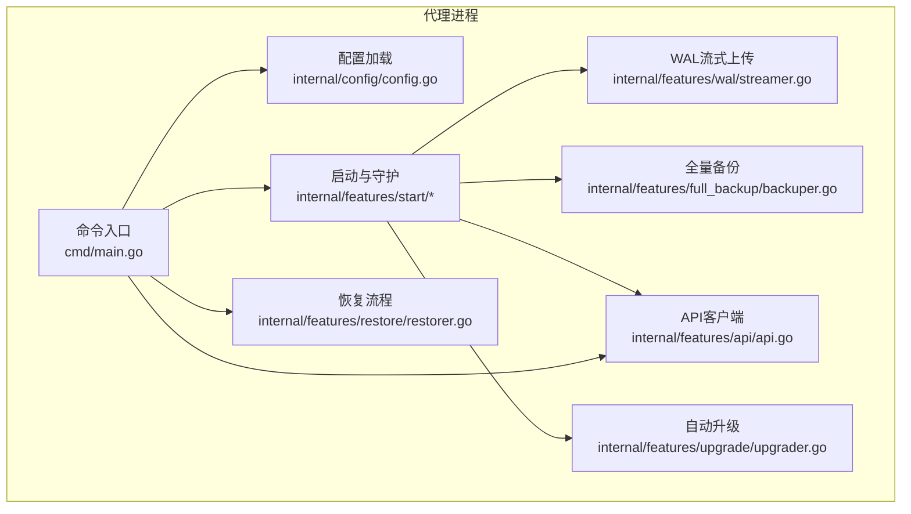
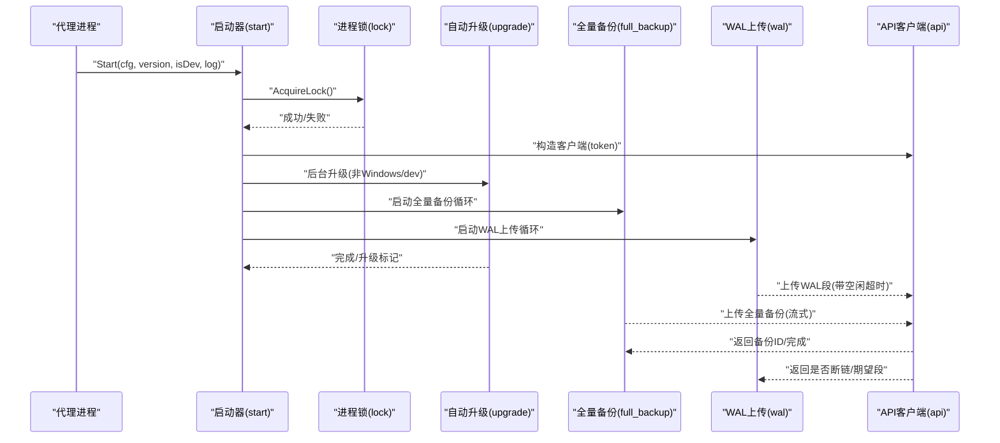
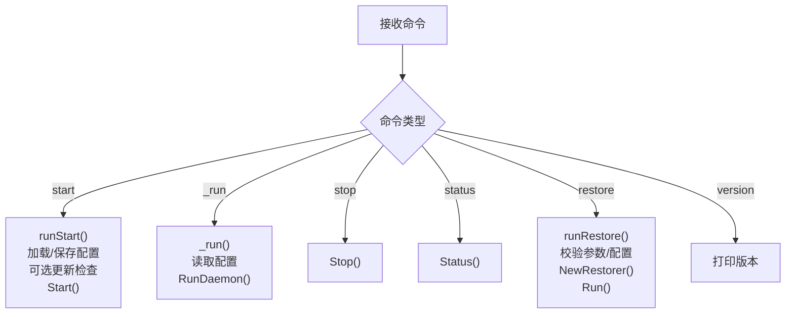
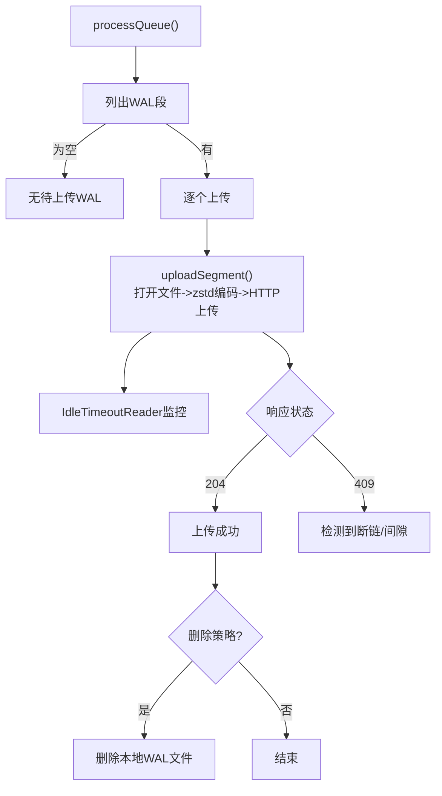
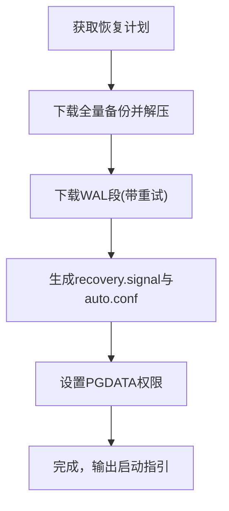
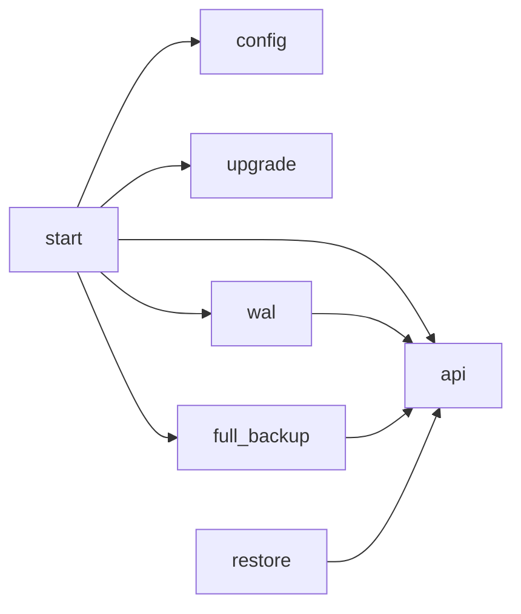

# 代理连接模式

<cite>
**本文引用的文件**
- [agent/cmd/main.go](file://agent/cmd/main.go)
- [agent/internal/config/config.go](file://agent/internal/config/config.go)
- [agent/internal/features/start/start.go](file://agent/internal/features/start/start.go)
- [agent/internal/features/start/daemon.go](file://agent/internal/features/start/daemon.go)
- [agent/internal/features/start/lock.go](file://agent/internal/features/start/lock.go)
- [agent/internal/features/wal/streamer.go](file://agent/internal/features/wal/streamer.go)
- [agent/internal/features/full_backup/backuper.go](file://agent/internal/features/full_backup/backuper.go)
- [agent/internal/features/restore/restorer.go](file://agent/internal/features/restore/restorer.go)
- [agent/internal/features/api/api.go](file://agent/internal/features/api/api.go)
- [agent/internal/features/api/idle_timeout_reader.go](file://agent/internal/features/api/idle_timeout_reader.go)
- [agent/internal/features/upgrade/upgrader.go](file://agent/internal/features/upgrade/upgrader.go)
- [agent/e2e/docker-compose.yml](file://agent/e2e/docker-compose.yml)
- [agent/e2e/Dockerfile.agent-runner](file://agent/e2e/Dockerfile.agent-runner)
- [agent/e2e/scripts/test-pg-host-path.sh](file://agent/e2e/scripts/test-pg-host-path.sh)
- [agent/e2e/scripts/test-pg-docker-exec.sh](file://agent/e2e/scripts/test-pg-docker-exec.sh)
- [agent/go.mod](file://agent/go.mod)
- [AGENTS.md](file://AGENTS.md)
</cite>

## 目录
1. [简介](#简介)
2. [项目结构](#项目结构)
3. [核心组件](#核心组件)
4. [架构总览](#架构总览)
5. [详细组件分析](#详细组件分析)
6. [依赖分析](#依赖分析)
7. [性能考虑](#性能考虑)
8. [故障排查指南](#故障排查指南)
9. [结论](#结论)
10. [附录](#附录)

## 简介
本文件面向Databasus的“代理连接模式”，系统性阐述代理服务的架构设计与实现原理，覆盖以下主题：
- 轻量级代理工作机制与进程管理模式
- 通信协议与安全机制
- 两种安装方式：主机安装（直接在数据库服务器上安装）与Docker容器安装（容器化部署）
- 核心功能：WAL归档、基础备份、恢复操作、健康检查、自动更新
- 部署步骤：系统要求、安装命令、配置文件、启动与停止
- 最佳实践：监控、日志、性能优化、故障排除
- 与后端服务的通信协议与安全机制

## 项目结构
代理模块位于agent目录，采用按功能域分层的组织方式：
- 命令入口：cmd/main.go
- 配置管理：internal/config
- 功能域：
  - 启动与守护：internal/features/start
  - WAL流式上传：internal/features/wal
  - 全量备份：internal/features/full_backup
  - 恢复流程：internal/features/restore
  - API客户端：internal/features/api
  - 自动升级：internal/features/upgrade
- 端到端测试：agent/e2e



图表来源
- [agent/cmd/main.go:1-246](file://agent/cmd/main.go#L1-L246)
- [agent/internal/config/config.go:1-272](file://agent/internal/config/config.go#L1-L272)
- [agent/internal/features/start/start.go:1-326](file://agent/internal/features/start/start.go#L1-L326)
- [agent/internal/features/wal/streamer.go:1-205](file://agent/internal/features/wal/streamer.go#L1-L205)
- [agent/internal/features/full_backup/backuper.go:1-317](file://agent/internal/features/full_backup/backuper.go#L1-L317)
- [agent/internal/features/restore/restorer.go:1-445](file://agent/internal/features/restore/restorer.go#L1-L445)
- [agent/internal/features/api/api.go:1-377](file://agent/internal/features/api/api.go#L1-L377)
- [agent/internal/features/upgrade/upgrader.go:1-90](file://agent/internal/features/upgrade/upgrader.go#L1-L90)

章节来源
- [agent/cmd/main.go:1-246](file://agent/cmd/main.go#L1-L246)
- [agent/internal/config/config.go:1-272](file://agent/internal/config/config.go#L1-L272)
- [agent/internal/features/start/start.go:1-326](file://agent/internal/features/start/start.go#L1-L326)

## 核心组件
- 命令入口与生命周期控制
  - 支持start、stop、status、restore、version等子命令
  - 启动时加载配置、保存配置、执行自动更新检查、进入守护模式或前台运行
- 配置管理
  - 从JSON文件与CLI参数加载配置，支持默认值与来源追踪
  - 关键字段：后端地址、数据库ID、令牌、PostgreSQL主机/端口/用户/密码、类型（host/docker）、二进制路径、容器名、WAL队列目录、上传后删除策略
- 启动与守护
  - Windows平台直接运行；类Unix平台通过守护进程模式运行
  - 进程锁防止重复启动，支持状态查询与优雅停止
- WAL流式上传
  - 定期扫描WAL队列目录，zstd压缩后上传，带空闲超时检测
- 全量备份
  - 周期性检查WAL链有效性与下次全备时间，触发pg_basebackup并流式上传，解析stderr获取起止WAL段，最终完成备份
- 恢复流程
  - 从后端获取恢复计划，下载并解压全量备份，下载所需WAL，生成recovery信号与配置，支持PITR
- API客户端
  - 统一封装REST与流式上传接口，含重试、鉴权头、错误处理
- 自动升级
  - 拉取后端目标版本二进制，校验后替换当前二进制并重新执行

章节来源
- [agent/cmd/main.go:24-193](file://agent/cmd/main.go#L24-L193)
- [agent/internal/config/config.go:16-115](file://agent/internal/config/config.go#L16-L115)
- [agent/internal/features/start/start.go:33-141](file://agent/internal/features/start/start.go#L33-L141)
- [agent/internal/features/wal/streamer.go:44-173](file://agent/internal/features/wal/streamer.go#L44-L173)
- [agent/internal/features/full_backup/backuper.go:66-244](file://agent/internal/features/full_backup/backuper.go#L66-L244)
- [agent/internal/features/restore/restorer.go:58-101](file://agent/internal/features/restore/restorer.go#L58-L101)
- [agent/internal/features/api/api.go:36-70](file://agent/internal/features/api/api.go#L36-L70)
- [agent/internal/features/upgrade/upgrader.go:18-73](file://agent/internal/features/upgrade/upgrader.go#L18-L73)

## 架构总览
代理以“守护进程”形态运行，同时驱动WAL上传与全量备份两大后台任务。两者均通过API客户端与后端交互，遵循统一的鉴权与错误处理策略。



图表来源
- [agent/internal/features/start/start.go:60-101](file://agent/internal/features/start/start.go#L60-L101)
- [agent/internal/features/start/lock.go:18-49](file://agent/internal/features/start/lock.go#L18-L49)
- [agent/internal/features/full_backup/backuper.go:66-83](file://agent/internal/features/full_backup/backuper.go#L66-L83)
- [agent/internal/features/wal/streamer.go:44-61](file://agent/internal/features/wal/streamer.go#L44-L61)
- [agent/internal/features/api/api.go:72-106](file://agent/internal/features/api/api.go#L72-L106)

## 详细组件分析

### 命令入口与生命周期
- 子命令解析与路由
  - start：加载配置、保存配置、可选跳过更新、进入守护模式
  - _run：内部守护运行，读取已保存配置，执行守护逻辑
  - stop/status：基于锁文件与PID进行停止与状态查询
  - restore：校验目标目录、类型、后端令牌，构建恢复器并执行
  - version：打印版本
- 自动更新检查
  - 可通过参数跳过；开发模式下跳过；成功则重新执行自身



图表来源
- [agent/cmd/main.go:24-193](file://agent/cmd/main.go#L24-L193)
- [agent/internal/features/start/daemon.go:23-76](file://agent/internal/features/start/daemon.go#L23-L76)

章节来源
- [agent/cmd/main.go:24-193](file://agent/cmd/main.go#L24-L193)
- [agent/internal/features/start/daemon.go:23-76](file://agent/internal/features/start/daemon.go#L23-L76)

### 配置管理
- 数据结构与默认值
  - 默认端口5432、默认pgType为host、默认删除WAL上传后删除策略为true
- 加载顺序与来源追踪
  - 优先从JSON文件加载，再应用CLI参数覆盖，记录每个字段的来源（JSON或命令行）
- 敏感信息掩码输出，避免泄露

章节来源
- [agent/internal/config/config.go:16-115](file://agent/internal/config/config.go#L16-L115)
- [agent/internal/config/config.go:236-272](file://agent/internal/config/config.go#L236-L272)

### 启动与守护（进程管理）
- 类Unix平台
  - 通过会话分离启动子进程，写入日志文件，使用进程锁确保单实例
  - 停止：向PID发送SIGTERM，轮询等待退出，超时则报错
  - 状态：读取锁文件中的PID，判断进程存活
- Windows平台
  - 直接进入守护模式，不使用会话分离

章节来源
- [agent/internal/features/start/daemon.go:78-122](file://agent/internal/features/start/daemon.go#L78-L122)
- [agent/internal/features/start/lock.go:18-70](file://agent/internal/features/start/lock.go#L18-L70)
- [agent/internal/features/start/start.go:46-58](file://agent/internal/features/start/start.go#L46-L58)

### WAL流式上传
- 扫描WAL队列目录，过滤临时文件与非法命名，按字典序排序
- 使用zstd压缩，通过IdleTimeoutReader检测上传空闲，避免网络或源停滞
- 上传接口返回断链检测结果，若检测到间隙则中止当前段并记录



图表来源
- [agent/internal/features/wal/streamer.go:63-173](file://agent/internal/features/wal/streamer.go#L63-L173)
- [agent/internal/features/api/idle_timeout_reader.go:10-61](file://agent/internal/features/api/idle_timeout_reader.go#L10-L61)

章节来源
- [agent/internal/features/wal/streamer.go:44-173](file://agent/internal/features/wal/streamer.go#L44-L173)
- [agent/internal/features/api/idle_timeout_reader.go:10-61](file://agent/internal/features/api/idle_timeout_reader.go#L10-L61)

### 全量备份
- 触发条件
  - WAL链无效或无全量备份
  - 到达下次全量备份时间
- 执行流程
  - 构建pg_basebackup命令（host或docker），捕获stderr解析起止WAL段
  - 将stdout通过管道zstd压缩后流式上传至后端
  - 上传完成后调用完成接口，传入起止WAL段
- 错误处理
  - 失败时上报错误，按固定延迟重试，直至成功

```mermaid
sequenceDiagram
participant Loop as "全量备份循环"
participant Api as "API客户端"
participant Pg as "PostgreSQL(pg_basebackup)"
participant Up as "上传器"
Loop->>Api : "CheckWalChainValidity()"
Api-->>Loop : "链有效/无效"
Loop->>Api : "GetNextFullBackupTime()"
Api-->>Loop : "下次时间"
alt 需要全量备份
Loop->>Pg : "启动pg_basebackup(stdout)"
Pg-->>Loop : "stderr(含LSN)"
Loop->>Up : "启动zstd压缩->HTTP上传"
Up-->>Api : "返回备份ID"
Loop->>Api : "FinalizeBasebackup(起止WAL)"
else 不需要
Loop->>Loop : "等待下一周期"
end
```

图表来源
- [agent/internal/features/full_backup/backuper.go:85-162](file://agent/internal/features/full_backup/backuper.go#L85-L162)
- [agent/internal/features/full_backup/backuper.go:164-244](file://agent/internal/features/full_backup/backuper.go#L164-L244)
- [agent/internal/features/api/api.go:120-198](file://agent/internal/features/api/api.go#L120-L198)

章节来源
- [agent/internal/features/full_backup/backuper.go:66-244](file://agent/internal/features/full_backup/backuper.go#L66-L244)

### 恢复流程
- 获取恢复计划：可指定全量备份ID，后端返回全量备份与WAL列表
- 下载并解压全量备份，解包tar并进行路径遍历防护
- 下载所需WAL段，按顺序写入目标PGDATA下的专用目录
- 写入recovery.signal与postgresql.auto.conf，配置restore_command、recovery_end_command、recovery_target_time（可选）
- 输出启动PostgreSQL的指引（主机/容器）



图表来源
- [agent/internal/features/restore/restorer.go:130-163](file://agent/internal/features/restore/restorer.go#L130-L163)
- [agent/internal/features/restore/restorer.go:165-243](file://agent/internal/features/restore/restorer.go#L165-L243)
- [agent/internal/features/restore/restorer.go:245-327](file://agent/internal/features/restore/restorer.go#L245-L327)
- [agent/internal/features/restore/restorer.go:329-402](file://agent/internal/features/restore/restorer.go#L329-L402)

章节来源
- [agent/internal/features/restore/restorer.go:58-101](file://agent/internal/features/restore/restorer.go#L58-L101)

### API客户端与通信协议
- 接口定义
  - WAL链有效性检查、下次全备时间、WAL上传、全量备份开始/完成、错误上报、恢复计划、下载备份文件、版本查询、代理二进制下载
- 传输细节
  - JSON请求使用resty客户端，带重试与鉴权头
  - 流式上传/下载使用标准http.Client，避免内存缓冲
  - WAL上传需设置X-Wal-Segment-Name头
- 错误处理
  - 对4xx/5xx状态码统一转换为错误
  - 上传空闲超时由IdleTimeoutReader触发

章节来源
- [agent/internal/features/api/api.go:17-32](file://agent/internal/features/api/api.go#L17-L32)
- [agent/internal/features/api/api.go:44-70](file://agent/internal/features/api/api.go#L44-L70)
- [agent/internal/features/api/api.go:200-242](file://agent/internal/features/api/api.go#L200-L242)
- [agent/internal/features/api/api.go:282-309](file://agent/internal/features/api/api.go#L282-L309)

### 自动更新机制
- 检查版本：向后端查询目标版本，若已是最新则跳过
- 下载二进制：按架构下载，写入临时文件并赋予执行权限
- 校验：执行新二进制version命令，比对版本号
- 替换：原子重命名替换当前二进制
- 重启：返回升级标记，调用方负责重新执行

章节来源
- [agent/internal/features/upgrade/upgrader.go:18-73](file://agent/internal/features/upgrade/upgrader.go#L18-L73)

## 依赖分析
- 外部依赖
  - resty：HTTP JSON请求与重试
  - pgx：PostgreSQL连接与版本查询
  - zstd：压缩/解压
- 内部模块耦合
  - start依赖config、api、upgrade、wal、full_backup
  - wal与full_backup共享api客户端
  - restore独立于start但依赖api



图表来源
- [agent/internal/features/start/start.go:20-25](file://agent/internal/features/start/start.go#L20-L25)
- [agent/internal/features/wal/streamer.go:17-19](file://agent/internal/features/wal/streamer.go#L17-L19)
- [agent/internal/features/full_backup/backuper.go:17-19](file://agent/internal/features/full_backup/backuper.go#L17-L19)
- [agent/internal/features/restore/restorer.go:17](file://agent/internal/features/restore/restorer.go#L17)

章节来源
- [agent/go.mod:5-22](file://agent/go.mod#L5-L22)

## 性能考虑
- 压缩与流式传输
  - WAL与全量备份均采用zstd压缩并通过管道流式上传，降低内存占用
- 上传空闲超时
  - IdleTimeoutReader在长时间无数据时主动取消，避免资源挂起
- 并发与阻塞
  - 全量备份使用原子布尔量保证单实例运行，避免并发冲突
- 轮询间隔
  - WAL上传轮询间隔与上传超时合理设置，兼顾及时性与资源消耗

章节来源
- [agent/internal/features/wal/streamer.go:21-26](file://agent/internal/features/wal/streamer.go#L21-L26)
- [agent/internal/features/full_backup/backuper.go:21-25](file://agent/internal/features/full_backup/backuper.go#L21-L25)
- [agent/internal/features/full_backup/backuper.go:85-83](file://agent/internal/features/full_backup/backuper.go#L85-L83)

## 故障排查指南
- 启停问题
  - 若stop失败提示未运行，检查锁文件是否存在与PID是否存活
  - 若spawn失败，查看日志文件内容
- 配置问题
  - 确认databasusHost/dbId/token/pgHost/pgPort/pgUser/pgType/pgWalDir等配置正确
  - host模式需确保pg_basebackup在PATH或显式指定pgHostBinDir
  - docker模式需确保容器名正确且容器内可用pg_basebackup
- WAL上传问题
  - 检查WAL队列目录权限与磁盘空间
  - 关注断链检测与空闲超时日志
- 全量备份问题
  - 查看stderr解析结果与上传完成接口返回
  - 失败时关注重试延迟与错误上报
- 恢复问题
  - 确保目标PGDATA目录为空且可写
  - 检查恢复计划返回的WAL数量与大小
  - 启动前确认restore_command与recovery_end_command路径正确

章节来源
- [agent/internal/features/start/daemon.go:23-55](file://agent/internal/features/start/daemon.go#L23-L55)
- [agent/internal/features/start/lock.go:72-119](file://agent/internal/features/start/lock.go#L72-L119)
- [agent/internal/features/start/start.go:143-205](file://agent/internal/features/start/start.go#L143-L205)
- [agent/internal/features/wal/streamer.go:123-173](file://agent/internal/features/wal/streamer.go#L123-L173)
- [agent/internal/features/full_backup/backuper.go:164-244](file://agent/internal/features/full_backup/backuper.go#L164-L244)
- [agent/internal/features/restore/restorer.go:104-128](file://agent/internal/features/restore/restorer.go#L104-L128)

## 结论
Databasus代理以轻量、稳健的方式实现了WAL归档与全量备份的自动化，配合恢复流程与自动更新机制，形成完整的数据库保护闭环。通过清晰的进程管理、严格的配置校验、流式压缩与空闲超时检测，代理在复杂生产环境中具备良好的可靠性与可维护性。

## 附录

### 安装与部署步骤（主机安装）
- 系统要求
  - PostgreSQL客户端工具（pg_basebackup）可用
  - 可写入WAL队列目录
- 步骤
  - 准备配置文件（databasus.json），填写后端地址、数据库ID、令牌、PostgreSQL连接信息、WAL队列目录等
  - 启动代理：databasus-agent start
  - 查看状态：databasus-agent status
  - 停止代理：databasus-agent stop
- 验证
  - 通过端到端脚本验证：见e2e脚本与compose

章节来源
- [agent/e2e/scripts/test-pg-host-path.sh:13-46](file://agent/e2e/scripts/test-pg-host-path.sh#L13-L46)
- [agent/e2e/docker-compose.yml:10-35](file://agent/e2e/docker-compose.yml#L10-L35)

### 安装与部署步骤（Docker容器安装）
- 系统要求
  - 可访问Docker守护进程
  - 容器内已安装PostgreSQL客户端工具
- 步骤
  - 在容器中准备配置文件（databasus.json），pgType设为docker，pgDockerContainerName指向目标容器
  - 启动代理：databasus-agent _run
  - 通过端到端脚本验证：见e2e脚本与compose
- 注意
  - WAL队列目录需在容器内可访问
  - 恢复时可映射PGDATA目录并按指引启动容器

章节来源
- [agent/e2e/scripts/test-pg-docker-exec.sh:17-84](file://agent/e2e/scripts/test-pg-docker-exec.sh#L17-L84)
- [agent/e2e/docker-compose.yml:65-81](file://agent/e2e/docker-compose.yml#L65-L81)

### 配置文件字段说明
- databasusHost：后端服务地址
- dbId：数据库标识
- token：代理访问令牌
- pgHost/pgPort/pgUser/pgPassword：PostgreSQL连接信息
- pgType：host或docker
- pgHostBinDir：主机模式下pg_basebackup路径
- pgDockerContainerName：容器模式下容器名
- pgWalDir：WAL队列目录
- deleteWalAfterUpload：上传后是否删除本地WAL

章节来源
- [agent/internal/config/config.go:16-31](file://agent/internal/config/config.go#L16-L31)

### 通信协议与安全机制
- 鉴权
  - 所有HTTP请求携带Authorization头（令牌）
- 协议
  - JSON接口：resty客户端，带重试
  - 流式接口：标准http.Client，避免内存缓冲
- 安全
  - 令牌用于鉴权
  - 恢复流程中对tar路径进行遍历防护
  - 自动升级前进行二进制校验

章节来源
- [agent/internal/features/api/api.go:44-70](file://agent/internal/features/api/api.go#L44-L70)
- [agent/internal/features/restore/restorer.go:196-242](file://agent/internal/features/restore/restorer.go#L196-L242)
- [agent/internal/features/upgrade/upgrader.go:75-89](file://agent/internal/features/upgrade/upgrader.go#L75-L89)

### 最佳实践
- 监控与日志
  - 关注WAL上传断链、全量备份失败、恢复计划错误等关键日志
  - Windows平台建议使用后端日志收集
- 性能优化
  - 合理设置WAL队列目录与磁盘I/O
  - 控制压缩级别与上传超时，平衡速度与稳定性
- 故障排除
  - 使用status与stop辅助定位进程状态
  - 通过e2e脚本快速验证部署与恢复流程

章节来源
- [AGENTS.md:638-701](file://AGENTS.md#L638-L701)
- [agent/internal/features/wal/streamer.go:21-26](file://agent/internal/features/wal/streamer.go#L21-L26)
- [agent/internal/features/full_backup/backuper.go:21-25](file://agent/internal/features/full_backup/backuper.go#L21-L25)