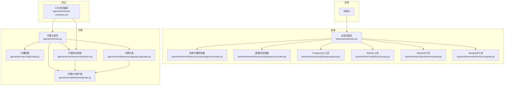
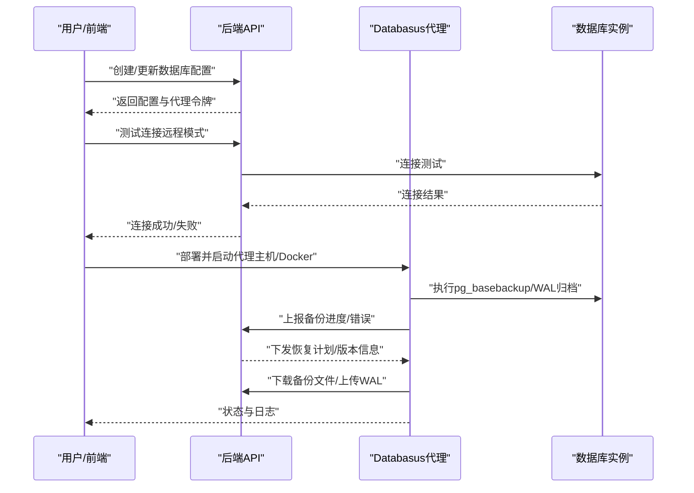
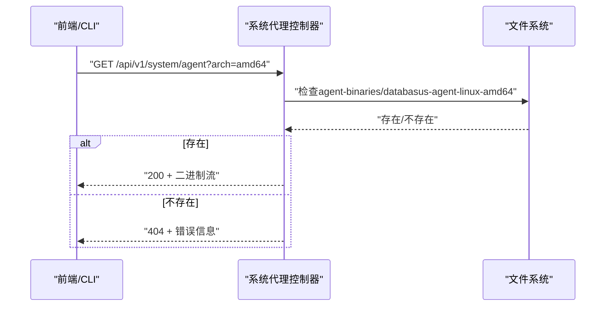
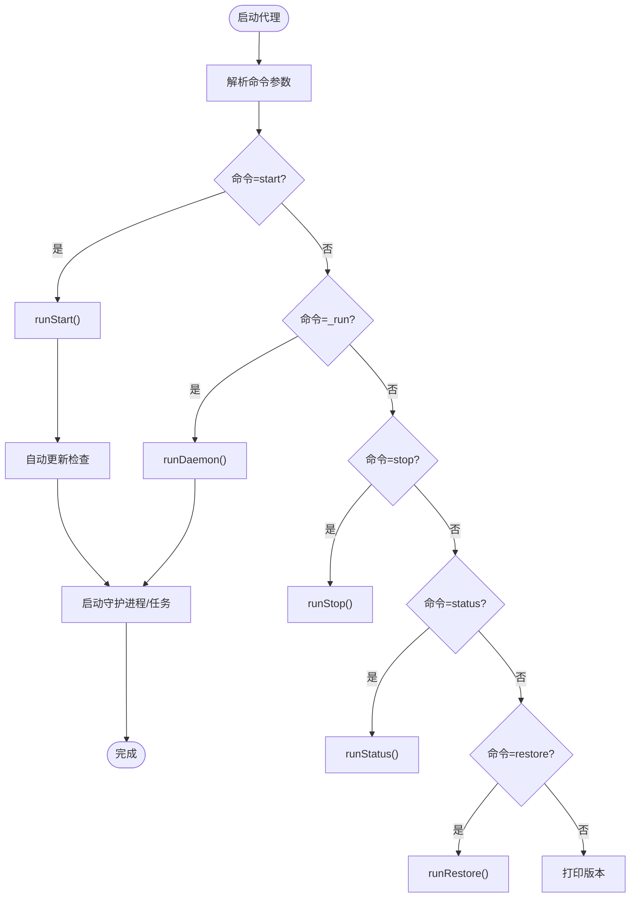
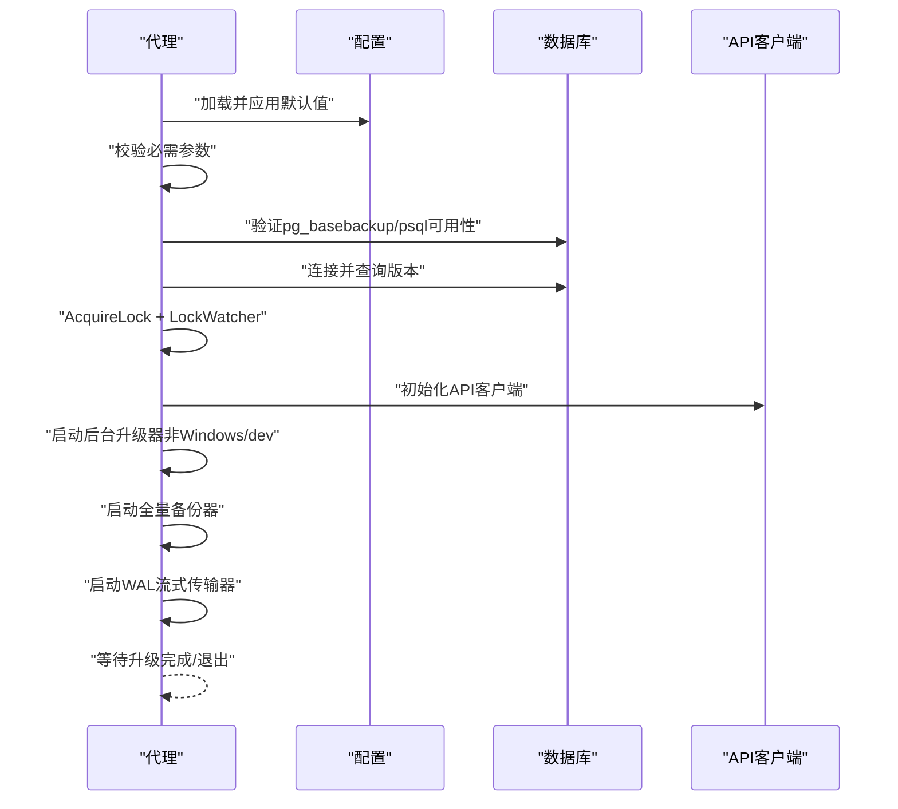
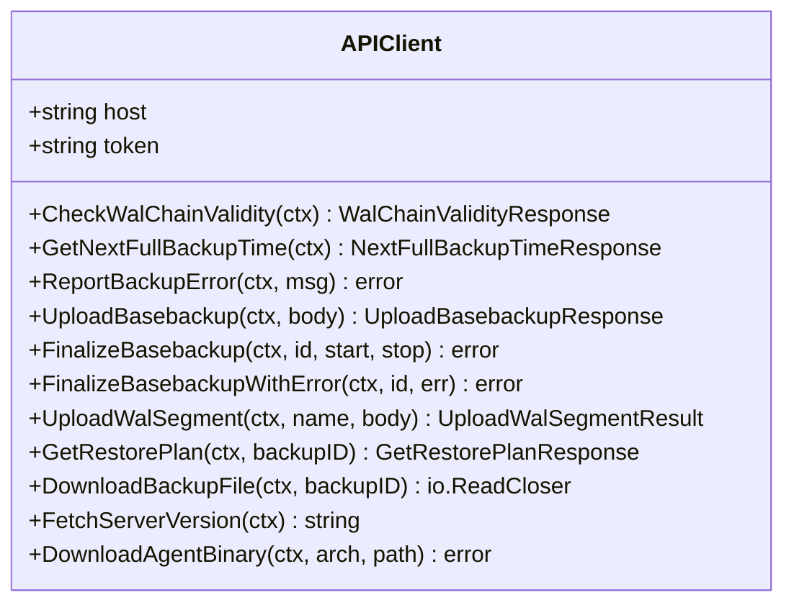
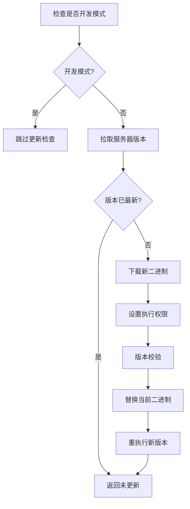
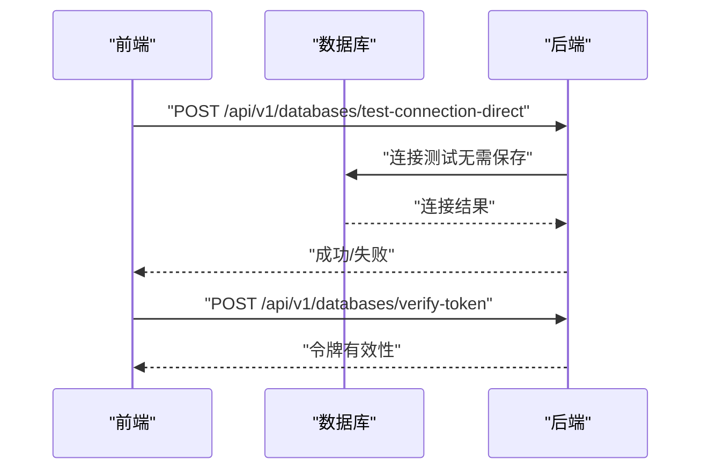
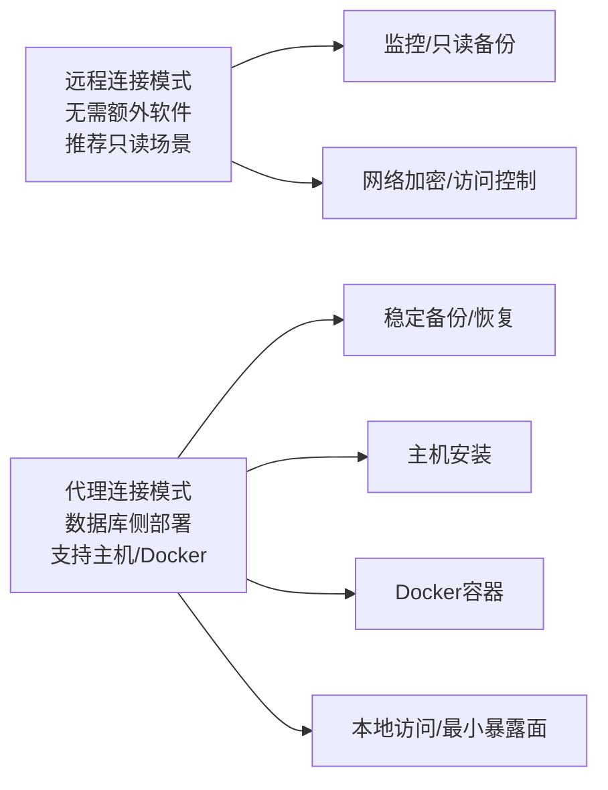
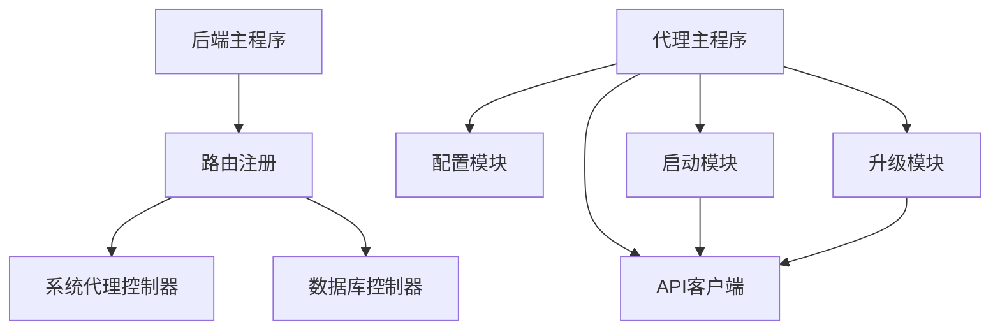

# 连接类型支持

<cite>
**本文引用的文件**
- [后端主程序 main.go](file://backend/cmd/main.go)
- [代理主程序 main.go](file://agent/cmd/main.go)
- [系统代理控制器 controller.go](file://backend/internal/features/system/agent/controller.go)
- [代理配置 config.go](file://agent/internal/config/config.go)
- [代理启动流程 start.go](file://agent/internal/features/start/start.go)
- [代理升级 upgrader.go](file://agent/internal/features/upgrade/upgrader.go)
- [代理API客户端 api.go](file://agent/internal/features/api/api.go)
- [PostgreSQL 工具 postgresql.go](file://backend/internal/util/tools/postgresql.go)
- [MySQL 工具 mysql.go](file://backend/internal/util/tools/mysql.go)
- [MariaDB 工具 mariadb.go](file://backend/internal/util/tools/mariadb.go)
- [MongoDB 工具 mongodb.go](file://backend/internal/util/tools/mongodb.go)
- [数据库控制器 controller.go](file://backend/internal/features/databases/controller.go)
- [代理端集成测试 docker-compose.yml](file://agent/e2e/docker-compose.yml)
</cite>

## 目录
1. [简介](#简介)
2. [项目结构](#项目结构)
3. [核心组件](#核心组件)
4. [架构总览](#架构总览)
5. [详细组件分析](#详细组件分析)
6. [依赖分析](#依赖分析)
7. [性能考量](#性能考量)
8. [故障排除指南](#故障排除指南)
9. [结论](#结论)
10. [附录](#附录)

## 简介
本文件面向Databasus的“连接类型支持”能力，系统性阐述两种数据库连接模式的技术实现与适用场景：
- 远程连接模式：通过网络直接连接数据库，推荐用于只读备份或监控场景，无需额外软件部署。
- 代理连接模式：在数据库服务器侧运行轻量级Databasus代理，支持主机安装与Docker容器两种部署形态，提供更稳定的备份与恢复能力。

同时，本文深入解析代理服务的架构设计（进程管理、通信协议、健康检查、自动更新）、安全考虑（网络加密、访问控制、数据传输保护）、最佳实践（网络拓扑、性能优化、故障排除），并提供代理部署与管理的步骤与注意事项。

## 项目结构
Databasus采用前后端分离与多模块组织方式：
- 后端（Go）：提供REST API、数据库配置与连接测试、系统版本与代理二进制下载等能力。
- 代理（Go）：负责与后端通信、执行WAL归档与全量备份、处理恢复计划与下载、健康检查与自动更新。
- 前端（React）：用户界面，用于配置数据库、查看备份状态与日志等。
- 集成测试（E2E）：使用Docker Compose验证代理在主机与Docker两种模式下的工作流。

图表来源
- [后端主程序 main.go:1-491](file://backend/cmd/main.go#L1-L491)
- [系统代理控制器 controller.go:1-49](file://backend/internal/features/system/agent/controller.go#L1-L49)
- [数据库控制器 controller.go:1-505](file://backend/internal/features/databases/controller.go#L1-L505)
- [PostgreSQL 工具 postgresql.go:1-208](file://backend/internal/util/tools/postgresql.go#L1-L208)
- [MySQL 工具 mysql.go:1-231](file://backend/internal/util/tools/mysql.go#L1-L231)
- [MariaDB 工具 mariadb.go:1-251](file://backend/internal/util/tools/mariadb.go#L1-L251)
- [MongoDB 工具 mongodb.go:1-179](file://backend/internal/util/tools/mongodb.go#L1-L179)
- [代理主程序 main.go:1-246](file://agent/cmd/main.go#L1-L246)
- [代理配置 config.go:1-272](file://agent/internal/config/config.go#L1-L272)
- [代理启动流程 start.go:1-326](file://agent/internal/features/start/start.go#L1-L326)
- [代理API客户端 api.go:1-377](file://agent/internal/features/api/api.go#L1-L377)
- [代理升级 upgrader.go:1-90](file://agent/internal/features/upgrade/upgrader.go#L1-L90)
- [代理端集成测试 docker-compose.yml:1-85](file://agent/e2e/docker-compose.yml#L1-L85)

章节来源
- [后端主程序 main.go:1-491](file://backend/cmd/main.go#L1-L491)
- [代理主程序 main.go:1-246](file://agent/cmd/main.go#L1-L246)

## 核心组件
- 后端系统代理控制器：提供代理二进制下载接口，支持按架构返回对应二进制，供前端或自动化脚本下载。
- 数据库控制器：提供数据库配置、连接测试、只读用户创建、代理令牌校验与重生成等功能，支撑两种连接模式的配置与验证。
- 代理主程序：统一入口，支持start、stop、status、restore、version等命令；内置自动更新检查与重执行逻辑。
- 代理启动流程：负责配置校验、PostgreSQL基础校验（主机/容器）、数据库连通性与版本检查、守护进程化与锁机制、后台升级器与WAL/全量备份任务调度。
- 代理API客户端：封装与后端交互的HTTP客户端，支持JSON请求与流式上传/下载，内置鉴权头设置、超时与重试策略。
- 代理升级模块：从后端拉取最新版本二进制，进行权限设置与版本校验，替换当前二进制并触发重执行。
- 多数据库工具适配：后端提供PostgreSQL、MySQL、MariaDB、MongoDB的可执行工具路径解析与安装校验，确保备份工具可用。

章节来源
- [系统代理控制器 controller.go:1-49](file://backend/internal/features/system/agent/controller.go#L1-L49)
- [数据库控制器 controller.go:1-505](file://backend/internal/features/databases/controller.go#L1-L505)
- [代理主程序 main.go:1-246](file://agent/cmd/main.go#L1-L246)
- [代理启动流程 start.go:1-326](file://agent/internal/features/start/start.go#L1-L326)
- [代理API客户端 api.go:1-377](file://agent/internal/features/api/api.go#L1-L377)
- [代理升级 upgrader.go:1-90](file://agent/internal/features/upgrade/upgrader.go#L1-L90)
- [PostgreSQL 工具 postgresql.go:1-208](file://backend/internal/util/tools/postgresql.go#L1-L208)
- [MySQL 工具 mysql.go:1-231](file://backend/internal/util/tools/mysql.go#L1-L231)
- [MariaDB 工具 mariadb.go:1-251](file://backend/internal/util/tools/mariadb.go#L1-L251)
- [MongoDB 工具 mongodb.go:1-179](file://backend/internal/util/tools/mongodb.go#L1-L179)

## 架构总览
下图展示两种连接模式的端到端交互：远程模式直接调用后端API进行连接测试与令牌校验；代理模式由代理在数据库侧执行备份与恢复，并通过API客户端与后端通信。

图表来源
- [后端主程序 main.go:213-257](file://backend/cmd/main.go#L213-L257)
- [系统代理控制器 controller.go:13-48](file://backend/internal/features/system/agent/controller.go#L13-L48)
- [代理主程序 main.go:24-75](file://agent/cmd/main.go#L24-L75)
- [代理启动流程 start.go:33-101](file://agent/internal/features/start/start.go#L33-L101)
- [代理API客户端 api.go:44-70](file://agent/internal/features/api/api.go#L44-L70)

## 详细组件分析

### 组件A：系统代理控制器（后端）
- 职责：提供代理二进制下载接口，按架构返回对应二进制文件，便于前端或自动化脚本获取。
- 关键点：参数校验（仅允许amd64/arm64）、文件存在性检查、响应头设置与文件流输出。
- 适用场景：首次部署或手动安装代理时使用。

图表来源
- [系统代理控制器 controller.go:13-48](file://backend/internal/features/system/agent/controller.go#L13-L48)

章节来源
- [系统代理控制器 controller.go:1-49](file://backend/internal/features/system/agent/controller.go#L1-L49)

### 组件B：代理主程序与命令体系
- 职责：统一入口，支持start、stop、status、restore、version等命令；内置自动更新检查与重执行逻辑。
- 关键点：命令分发、参数解析、开发/生产环境判断、更新检查与重执行。

图表来源
- [代理主程序 main.go:24-171](file://agent/cmd/main.go#L24-L171)
- [代理主程序 main.go:173-245](file://agent/cmd/main.go#L173-L245)

章节来源
- [代理主程序 main.go:1-246](file://agent/cmd/main.go#L1-L246)

### 组件C：代理启动流程（进程管理与健康检查）
- 职责：配置校验、PostgreSQL基础校验（主机/容器）、数据库连通性与版本检查、守护进程化与锁机制、后台升级器与WAL/全量备份任务调度。
- 关键点：Windows平台直接进入守护模式；非Windows平台创建守护进程并加锁；最小PostgreSQL主版本要求；Docker模式通过容器内命令校验。

图表来源
- [代理启动流程 start.go:33-101](file://agent/internal/features/start/start.go#L33-L101)
- [代理启动流程 start.go:103-141](file://agent/internal/features/start/start.go#L103-L141)
- [代理启动流程 start.go:143-205](file://agent/internal/features/start/start.go#L143-L205)
- [代理启动流程 start.go:207-310](file://agent/internal/features/start/start.go#L207-L310)

章节来源
- [代理启动流程 start.go:1-326](file://agent/internal/features/start/start.go#L1-L326)

### 组件D：代理API客户端（通信协议与错误处理）
- 职责：封装与后端交互的HTTP客户端，支持JSON请求与流式上传/下载，内置鉴权头设置、超时与重试策略。
- 关键点：REST客户端与HTTP客户端分离（流式上传不走REST缓冲）；统一鉴权头；对不同状态码进行差异化处理；支持WAL段上传、全量备份开始/结束、恢复计划与下载、版本查询与代理二进制下载。

图表来源
- [代理API客户端 api.go:36-70](file://agent/internal/features/api/api.go#L36-L70)
- [代理API客户端 api.go:72-358](file://agent/internal/features/api/api.go#L72-L358)

章节来源
- [代理API客户端 api.go:1-377](file://agent/internal/features/api/api.go#L1-L377)

### 组件E：代理升级机制（自动更新）
- 职责：从后端拉取最新版本二进制，进行权限设置与版本校验，替换当前二进制并触发重执行。
- 关键点：开发模式跳过更新；失败时给出明确提示；重执行确保新版本生效。

图表来源
- [代理升级 upgrader.go:18-73](file://agent/internal/features/upgrade/upgrader.go#L18-L73)
- [代理主程序 main.go:232-245](file://agent/cmd/main.go#L232-L245)

章节来源
- [代理升级 upgrader.go:1-90](file://agent/internal/features/upgrade/upgrader.go#L1-L90)
- [代理主程序 main.go:173-193](file://agent/cmd/main.go#L173-L193)

### 组件F：数据库连接与令牌校验（远程模式）
- 职责：提供数据库配置、连接测试（直接与保存后测试）、只读用户创建、代理令牌校验与重生成。
- 关键点：远程模式通过后端直接测试数据库连接；代理模式通过令牌校验保障访问控制。

图表来源
- [数据库控制器 controller.go:245-274](file://backend/internal/features/databases/controller.go#L245-L274)
- [数据库控制器 controller.go:481-504](file://backend/internal/features/databases/controller.go#L481-L504)

章节来源
- [数据库控制器 controller.go:1-505](file://backend/internal/features/databases/controller.go#L1-L505)

### 组件G：多数据库工具适配（备份工具可用性）
- 职责：解析不同数据库版本对应的客户端工具路径，校验工具是否存在，确保备份/恢复流程可用。
- 关键点：PostgreSQL版本特定bin目录；MySQL/MariaDB多版本支持；MongoDB单客户端版本向后兼容。

章节来源
- [PostgreSQL 工具 postgresql.go:1-208](file://backend/internal/util/tools/postgresql.go#L1-L208)
- [MySQL 工具 mysql.go:1-231](file://backend/internal/util/tools/mysql.go#L1-L231)
- [MariaDB 工具 mariadb.go:1-251](file://backend/internal/util/tools/mariadb.go#L1-L251)
- [MongoDB 工具 mongodb.go:1-179](file://backend/internal/util/tools/mongodb.go#L1-L179)

### 概念总览
以下概念图展示两种连接模式的适用场景与技术差异，帮助选择合适的部署方式。

（此图为概念性说明，不直接映射具体源文件）

## 依赖分析
- 后端路由注册：后端主程序集中注册系统代理、数据库、备份、恢复、健康检查等路由，形成统一入口。
- 代理与后端通信：代理通过API客户端与后端交互，使用统一鉴权头与超时重试策略。
- 代理内部模块：配置、启动、API、升级模块相互协作，形成完整的代理生命周期管理。

图表来源
- [后端主程序 main.go:213-257](file://backend/cmd/main.go#L213-L257)
- [代理主程序 main.go:24-75](file://agent/cmd/main.go#L24-L75)

章节来源
- [后端主程序 main.go:1-491](file://backend/cmd/main.go#L1-L491)
- [代理主程序 main.go:1-246](file://agent/cmd/main.go#L1-L246)

## 性能考量
- 远程连接模式
  - 优点：部署简单，无需在数据库侧安装额外组件。
  - 注意：网络抖动与延迟可能影响备份窗口；建议在低负载时段执行备份。
- 代理连接模式
  - 优点：在数据库侧执行备份，减少网络带宽占用；支持WAL流式传输与全量备份并发。
  - 注意：需要合理规划数据库侧资源（CPU、IO、存储）；确保pg_basebackup与WAL队列目录权限正确。
- 通用优化
  - 使用压缩与增量策略（如适用）降低传输体积。
  - 合理设置备份间隔与保留策略，避免重复数据占用空间。
  - 在高可用环境中，优先选择代理模式以减少跨网络依赖。

（本节为通用指导，不直接分析具体文件）

## 故障排除指南
- 代理无法启动
  - 检查必需参数：后端地址、数据库ID、令牌、PostgreSQL主机/端口、用户、类型、WAL目录。
  - 主机模式：确认pg_basebackup在PATH或指定bin目录中可用。
  - Docker模式：确认容器名称正确且容器内已安装pg_basebackup。
  - 版本要求：PostgreSQL主版本需满足最低要求。
- 连接测试失败
  - 远程模式：检查网络连通性、防火墙策略与认证信息。
  - 代理模式：确认令牌有效且未过期，后端可正常访问。
- 自动更新失败
  - 开发模式会跳过更新；生产模式需确保后端可达并具备写权限。
  - 更新后若失败，可使用跳过更新参数临时绕过问题。
- 恢复计划异常
  - 确认备份ID有效，后端返回的恢复计划格式正确。
  - 下载备份文件时注意网络稳定性与后端限速策略。

章节来源
- [代理启动流程 start.go:103-141](file://agent/internal/features/start/start.go#L103-L141)
- [代理启动流程 start.go:143-205](file://agent/internal/features/start/start.go#L143-L205)
- [代理启动流程 start.go:207-310](file://agent/internal/features/start/start.go#L207-L310)
- [代理升级 upgrader.go:18-73](file://agent/internal/features/upgrade/upgrader.go#L18-L73)
- [代理API客户端 api.go:244-309](file://agent/internal/features/api/api.go#L244-L309)
- [数据库控制器 controller.go:481-504](file://backend/internal/features/databases/controller.go#L481-L504)

## 结论
Databasus通过“远程连接模式”与“代理连接模式”的双轨设计，兼顾了部署简便性与运维稳定性。代理模式在数据库侧执行备份与恢复，结合完善的进程管理、通信协议、健康检查与自动更新机制，能够更好地适应复杂生产环境。配合后端提供的连接测试、只读用户创建与令牌校验能力，用户可以灵活选择适合自身网络拓扑与安全策略的连接方案。

（本节为总结性内容，不直接分析具体文件）

## 附录

### 附录A：两种连接模式对比与适用场景
- 远程连接模式
  - 技术要点：后端直接测试数据库连接，无需代理。
  - 适用场景：只读备份、监控、临时迁移验证。
  - 安全建议：启用TLS与强密码，限制访问IP白名单。
- 代理连接模式
  - 技术要点：代理在数据库侧执行备份/恢复，支持主机与Docker两种部署。
  - 适用场景：生产环境稳定备份、PITR恢复、批量恢复演练。
  - 安全建议：最小权限原则、容器内隔离、定期更新代理版本。

（本节为概念性说明，不直接分析具体文件）

### 附录B：代理部署与管理步骤（主机安装）
- 步骤概览
  - 从后端下载对应架构的代理二进制。
  - 准备配置文件（包含后端地址、数据库ID、令牌、PostgreSQL连接信息、WAL目录等）。
  - 执行启动命令，验证守护进程状态。
  - 定期检查日志与健康状态，必要时触发升级。
- 注意事项
  - 确保数据库侧具备pg_basebackup与psql工具。
  - WAL队列目录具备读写权限。
  - 生产环境建议禁用开发模式与跳过更新参数。

章节来源
- [系统代理控制器 controller.go:13-48](file://backend/internal/features/system/agent/controller.go#L13-L48)
- [代理配置 config.go:33-74](file://agent/internal/config/config.go#L33-L74)
- [代理启动流程 start.go:33-58](file://agent/internal/features/start/start.go#L33-L58)

### 附录C：代理部署与管理步骤（Docker容器）
- 步骤概览
  - 使用容器运行代理，挂载Docker套接字以便在容器内执行pg_basebackup。
  - 配置容器内的WAL队列目录与数据库连接信息。
  - 通过命令行参数指定pg-type=docker与容器名称。
- 注意事项
  - 确保容器内已安装PostgreSQL客户端工具。
  - 容器网络与数据库容器网络互通。
  - 升级时注意容器重启策略与数据卷持久化。

章节来源
- [代理启动流程 start.go:183-205](file://agent/internal/features/start/start.go#L183-L205)
- [代理主程序 main.go:117-160](file://agent/cmd/main.go#L117-L160)
- [代理端集成测试 docker-compose.yml:50-81](file://agent/e2e/docker-compose.yml#L50-L81)