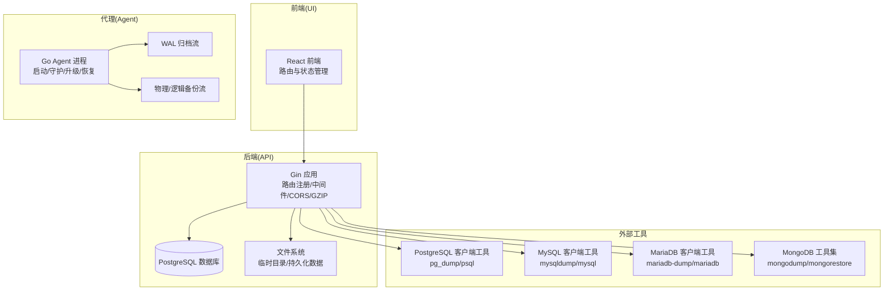
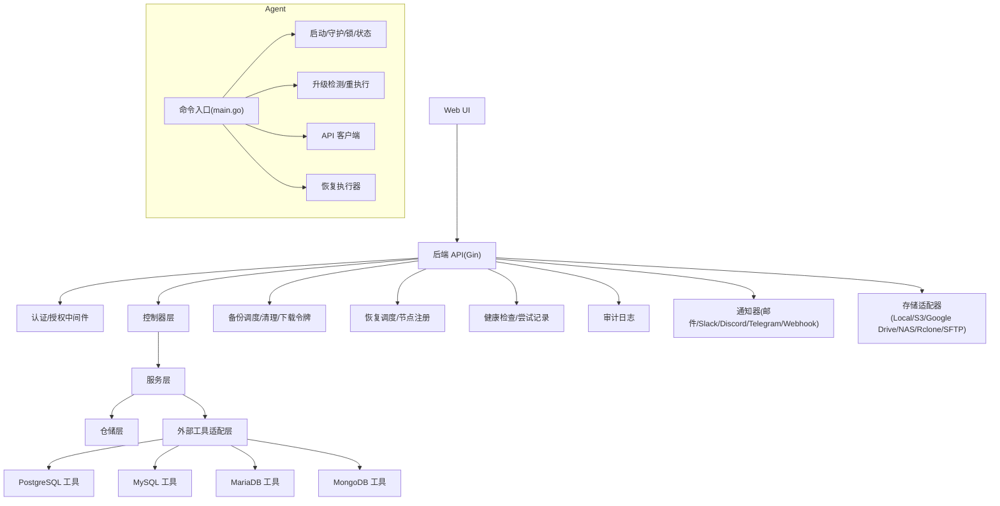
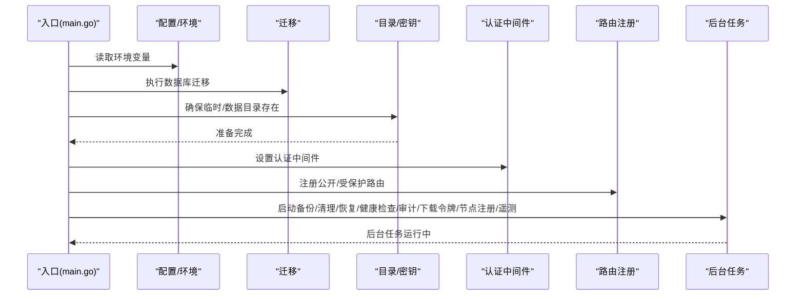
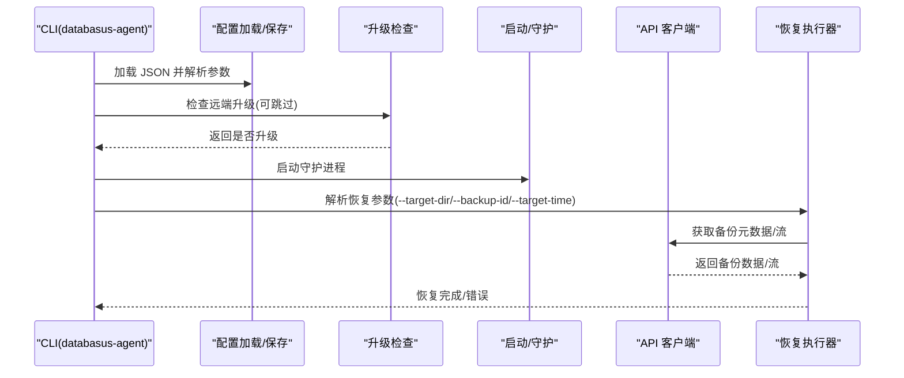
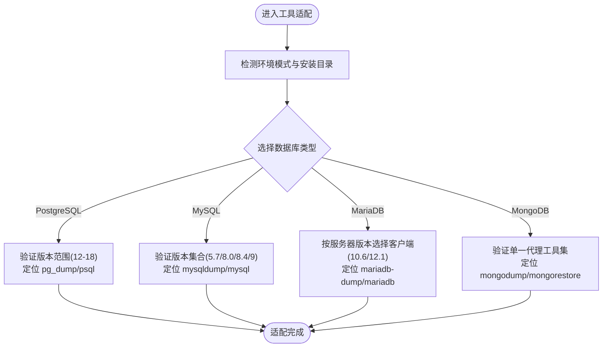
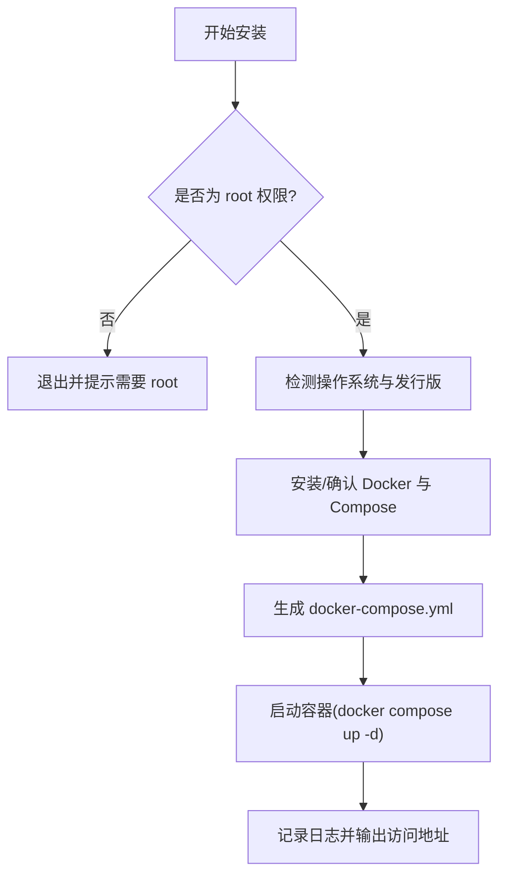
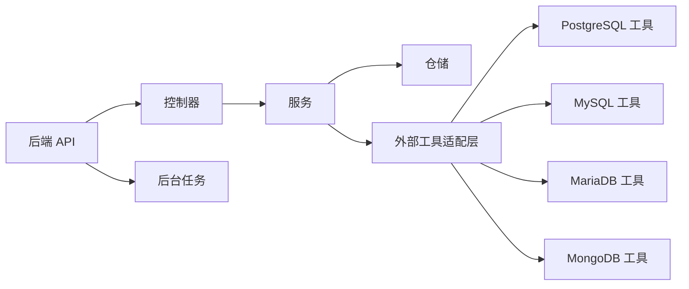

# 项目介绍

<cite>
**本文引用的文件**
- [README.md](file://README.md)
- [backend/README.md](file://backend/README.md)
- [agent/cmd/main.go](file://agent/cmd/main.go)
- [backend/cmd/main.go](file://backend/cmd/main.go)
- [assets/tools/README.md](file://assets/tools/README.md)
- [install-databasus.sh](file://install-databasus.sh)
- [AGENTS.md](file://AGENTS.md)
- [NOTICE.md](file://NOTICE.md)
- [backend/internal/util/tools/postgresql.go](file://backend/internal/util/tools/postgresql.go)
- [backend/internal/util/tools/mysql.go](file://backend/internal/util/tools/mysql.go)
- [backend/internal/util/tools/mariadb.go](file://backend/internal/util/tools/mariadb.go)
- [backend/internal/util/tools/mongodb.go](file://backend/internal/util/tools/mongodb.go)
</cite>

## 目录
1. [引言](#引言)
2. [项目结构](#项目结构)
3. [核心组件](#核心组件)
4. [架构总览](#架构总览)
5. [详细组件分析](#详细组件分析)
6. [依赖关系分析](#依赖关系分析)
7. [性能考量](#性能考量)
8. [故障排查指南](#故障排查指南)
9. [结论](#结论)
10. [附录](#附录)

## 引言
Databasus 是一款免费、开源且可自托管的数据库备份管理平台，核心定位是为 PostgreSQL 提供专业级备份能力，并同时兼容 MySQL、MariaDB 与 MongoDB 的备份与恢复流程。项目以“隐私优先、零信任存储、无供应商锁定”为核心理念，强调企业级安全与合规，同时通过直观的 Web 界面与灵活的调度机制，降低数据库备份的复杂度，帮助 DBA、DevOps 工程师与企业 IT 部门高效管理备份生命周期。

Databasus 的愿景是成为生产环境中的“数据库备份基础设施”，既可自托管运行，也可在云环境中通过 Helm 部署；其开源与可持续发展模式确保功能完整开放，不设功能门槛或使用限制，真正实现“开源即完整”。

## 项目结构
Databasus 采用前后端分离与模块化设计，后端基于 Go 语言与 Gin 框架，前端采用 React/Vite，Agent 使用 Go 实现，支持 WAL 流式归档与物理备份。项目提供多样的安装方式与部署形态，包括一键脚本、Docker 单容器、Docker Compose 与 Kubernetes Helm Chart。

图示来源
- [backend/cmd/main.go:213-257](file://backend/cmd/main.go#L213-L257)
- [agent/cmd/main.go:24-48](file://agent/cmd/main.go#L24-L48)
- [assets/tools/README.md:1-17](file://assets/tools/README.md#L1-L17)

章节来源
- [README.md:124-222](file://README.md#L124-L222)
- [backend/README.md:50-69](file://backend/README.md#L50-L69)

## 核心组件
- 后端服务（Go + Gin）
  - 负责 API 路由、认证授权、业务编排、后台任务调度与清理、审计日志、通知器与存储适配器等。
  - 支持 Swagger 文档生成与 GZIP 压缩，提供健康检查、版本信息与系统代理接口。
- 前端界面（React/Vite）
  - 提供数据库连接配置、备份计划、存储与通知器设置、工作空间与权限管理、审计日志查看等。
- Agent（Go）
  - 在数据库侧运行，负责 WAL 归档流与物理/逻辑备份的采集与传输，支持自动升级与恢复流程。
- 外部工具适配层
  - 通过统一的工具路径解析与版本校验，适配 PostgreSQL、MySQL、MariaDB、MongoDB 的客户端工具，确保跨版本兼容与稳定性。

章节来源
- [backend/cmd/main.go:112-137](file://backend/cmd/main.go#L112-L137)
- [agent/cmd/main.go:50-97](file://agent/cmd/main.go#L50-L97)
- [backend/internal/util/tools/postgresql.go:14-32](file://backend/internal/util/tools/postgresql.go#L14-L32)
- [backend/internal/util/tools/mysql.go:30-47](file://backend/internal/util/tools/mysql.go#L30-L47)
- [backend/internal/util/tools/mariadb.go:61-80](file://backend/internal/util/tools/mariadb.go#L61-L80)
- [backend/internal/util/tools/mongodb.go:31-47](file://backend/internal/util/tools/mongodb.go#L31-L47)

## 架构总览
Databasus 的整体架构围绕“后端 API + 前端 UI + Agent 代理 + 多数据库工具链”的组合展开。后端负责集中编排与治理，Agent 负责靠近数据源的高效采集与传输，外部工具链保证对主流数据库的稳定支持。

图示来源
- [backend/cmd/main.go:213-257](file://backend/cmd/main.go#L213-L257)
- [agent/cmd/main.go:24-48](file://agent/cmd/main.go#L24-L48)

## 详细组件分析

### 后端 API 入口与路由
- 初始化阶段完成缓存测试、迁移、目录准备、密钥迁移、管理员初始化与密码重置处理。
- 注册公开与受保护路由，启用 CORS、GZIP、Swagger 文档。
- 启动后台任务（备份/清理/恢复/健康检查/审计/下载令牌/节点注册/遥测），并挂载前端静态资源。

图示来源
- [backend/cmd/main.go:65-137](file://backend/cmd/main.go#L65-L137)
- [backend/cmd/main.go:213-257](file://backend/cmd/main.go#L213-L257)
- [backend/cmd/main.go:293-374](file://backend/cmd/main.go#L293-L374)

章节来源
- [backend/cmd/main.go:65-137](file://backend/cmd/main.go#L65-L137)
- [backend/cmd/main.go:213-257](file://backend/cmd/main.go#L213-L257)
- [backend/cmd/main.go:293-374](file://backend/cmd/main.go#L293-L374)

### Agent 命令与恢复流程
- 支持 start、stop、status、restore、version 等命令；restore 子命令要求目标目录、备份 ID 或 PITR 时间等参数。
- 启动时进行配置加载、保存、更新检查与守护进程运行；恢复时根据配置调用 API 客户端并执行恢复流程。

图示来源
- [agent/cmd/main.go:50-97](file://agent/cmd/main.go#L50-L97)
- [agent/cmd/main.go:117-160](file://agent/cmd/main.go#L117-L160)

章节来源
- [agent/cmd/main.go:24-48](file://agent/cmd/main.go#L24-L48)
- [agent/cmd/main.go:50-97](file://agent/cmd/main.go#L50-L97)
- [agent/cmd/main.go:117-160](file://agent/cmd/main.go#L117-L160)

### 外部工具适配与版本校验
- PostgreSQL：按版本（12-18）定位工具路径，Windows 自动追加 .exe，支持 .pgpass 字段转义。
- MySQL：支持 5.7、8.0、8.4、9，按版本定位工具路径，Windows 自动追加 .exe，支持 .my.cnf 密码转义。
- MariaDB：根据服务器版本选择 10.6（旧版兼容）或 12.1（现代），按版本定位工具路径。
- MongoDB：使用单一代理工具集，向后兼容所有主版本，按版本定位工具路径。

图示来源
- [backend/internal/util/tools/postgresql.go:34-166](file://backend/internal/util/tools/postgresql.go#L34-L166)
- [backend/internal/util/tools/mysql.go:49-176](file://backend/internal/util/tools/mysql.go#L49-L176)
- [backend/internal/util/tools/mariadb.go:82-179](file://backend/internal/util/tools/mariadb.go#L82-L179)
- [backend/internal/util/tools/mongodb.go:49-126](file://backend/internal/util/tools/mongodb.go#L49-L126)

章节来源
- [assets/tools/README.md:1-17](file://assets/tools/README.md#L1-L17)
- [backend/internal/util/tools/postgresql.go:14-32](file://backend/internal/util/tools/postgresql.go#L14-L32)
- [backend/internal/util/tools/mysql.go:30-47](file://backend/internal/util/tools/mysql.go#L30-L47)
- [backend/internal/util/tools/mariadb.go:61-80](file://backend/internal/util/tools/mariadb.go#L61-L80)
- [backend/internal/util/tools/mongodb.go:31-47](file://backend/internal/util/tools/mongodb.go#L31-L47)

### 安装与部署
- 一键脚本安装：自动检测并安装 Docker 与 Compose，生成 docker-compose.yml 并启动服务。
- Docker 单容器与 Compose：暴露 4005 端口，挂载本地数据目录，支持开机自启。
- Kubernetes：通过 Helm Chart 部署，支持 ClusterIP/LoadBalancer/Ingress 等多种接入方式。

图示来源
- [install-databasus.sh:1-141](file://install-databasus.sh#L1-L141)

章节来源
- [README.md:124-222](file://README.md#L124-L222)
- [install-databasus.sh:1-141](file://install-databasus.sh#L1-L141)

## 依赖关系分析
- 组件内聚与解耦
  - 控制器、服务、仓储分层清晰，依赖注入通过一次性初始化函数保障幂等性。
  - 后台服务 Run 方法防重复启动，避免资源泄漏与状态混乱。
- 外部依赖
  - 数据库：PostgreSQL（迁移与业务数据）。
  - 文件系统：临时目录与持久化数据目录。
  - 外部工具：各数据库客户端工具，版本严格校验。
- 可能的循环依赖
  - 通过明确的依赖注入与一次性初始化模式，避免了循环依赖风险。
- 接口契约
  - 各功能模块通过统一的 SetupDependencies 模式注册，确保路由与后台任务正确装配。

图示来源
- [backend/cmd/main.go:259-276](file://backend/cmd/main.go#L259-L276)
- [AGENTS.md:600-635](file://AGENTS.md#L600-L635)

章节来源
- [backend/cmd/main.go:259-276](file://backend/cmd/main.go#L259-L276)
- [AGENTS.md:600-635](file://AGENTS.md#L600-L635)

## 性能考量
- 压缩与传输
  - 支持智能压缩，兼顾空间节省与开销平衡；备份流直接写入存储，减少中间文件。
- 并发与后台任务
  - 备份/清理/恢复/健康检查/审计/下载令牌/节点注册等后台任务并发运行，上下文取消保证优雅关闭。
- 前端体验
  - GZIP 压缩与静态资源缓存优化页面加载速度。
- 工具链效率
  - 预置多版本客户端工具，CI/CD 中仅保留必要二进制，显著缩短构建时间。

章节来源
- [README.md:47-110](file://README.md#L47-L110)
- [backend/cmd/main.go:117-124](file://backend/cmd/main.go#L117-L124)
- [assets/tools/README.md:1-17](file://assets/tools/README.md#L1-L17)

## 故障排查指南
- 后端启动与迁移
  - 若迁移失败，检查数据库连接字符串与 goose 驱动配置；查看日志输出定位具体错误。
- 密钥与管理员
  - 初始管理员创建失败或密钥迁移异常，检查密钥文件与数据库迁移状态。
- 密码重置
  - 使用内置命令行参数重置指定用户的密码，确保邮箱参数正确。
- 健康检查与告警
  - 后台健康检查尝试与审计日志清理任务按需运行，若异常可通过日志定位。
- Agent 恢复
  - 恢复前确保目标目录、备份 ID 或 PITR 时间参数正确，Agent 会进行必要的更新检查与重执行。

章节来源
- [backend/cmd/main.go:139-173](file://backend/cmd/main.go#L139-L173)
- [backend/cmd/main.go:415-432](file://backend/cmd/main.go#L415-L432)
- [agent/cmd/main.go:117-160](file://agent/cmd/main.go#L117-L160)

## 结论
Databasus 以“开源、自托管、零信任、无供应商锁定”为核心，提供从数据库到存储与通知的全链路备份解决方案。通过模块化架构、严格的版本工具适配与完善的后台任务体系，Databasus 能够满足 DBA、DevOps 工程师与企业 IT 部门在安全性、合规性与易用性方面的多重需求。项目坚持开源与可持续发展，通过云版收入反哺社区，确保功能完整与长期演进。

## 附录
- 许可证与商标
  - 代码采用 Apache 2.0 许可；商标与品牌使用遵循免责声明与有限引用规范。
- 开发与贡献
  - 遵循工程哲学与编码规范，强调可读性、可测试性与可维护性；后台服务禁止重复启动，确保状态安全。

章节来源
- [NOTICE.md:1-22](file://NOTICE.md#L1-L22)
- [AGENTS.md:29-92](file://AGENTS.md#L29-L92)