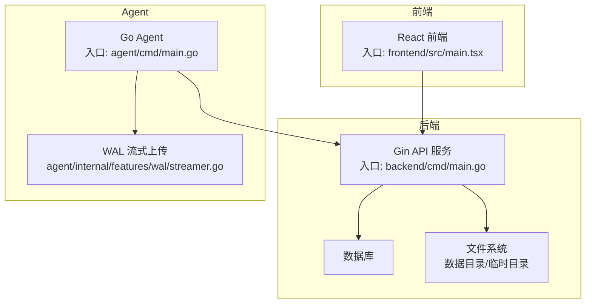
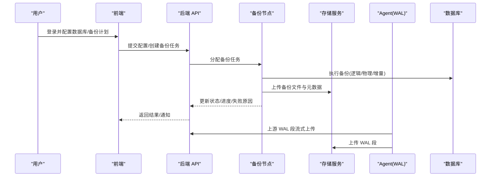
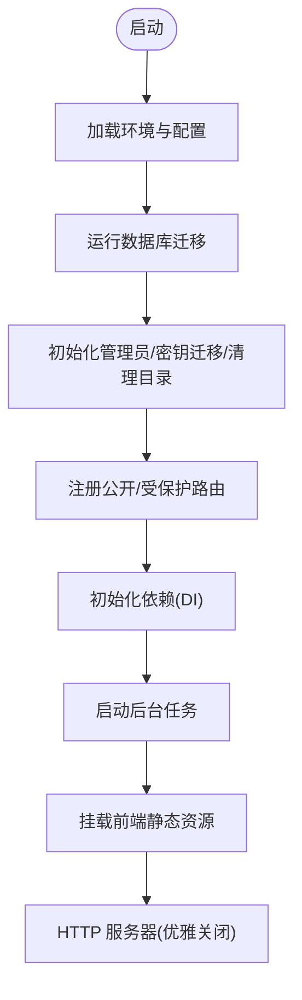
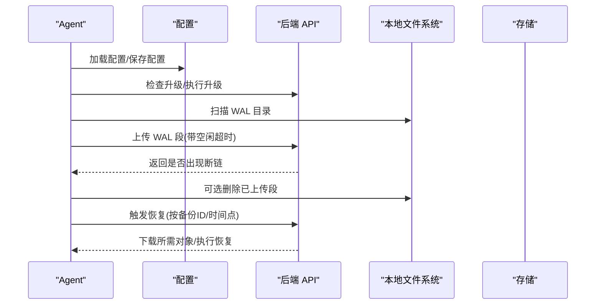
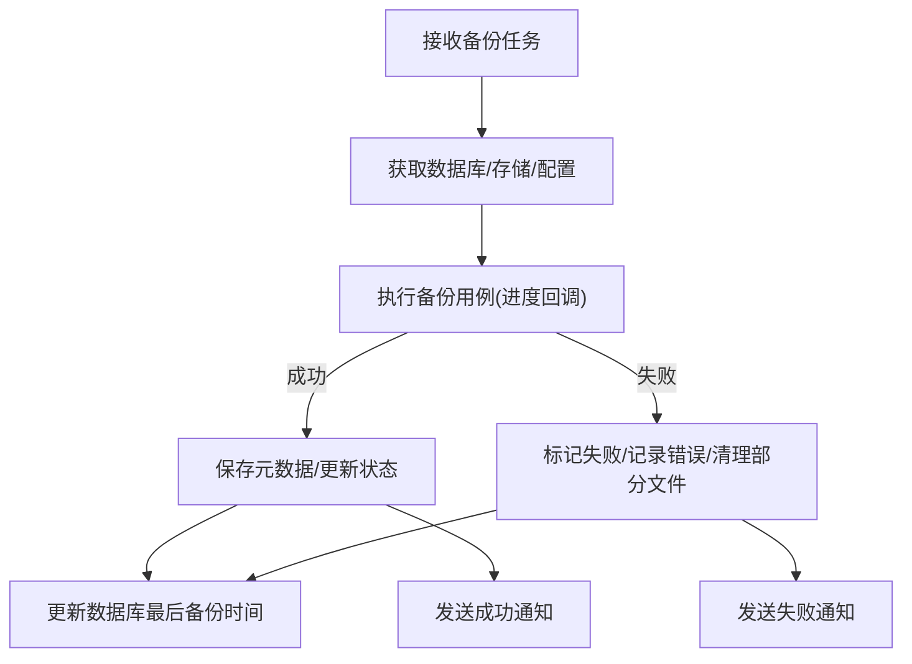
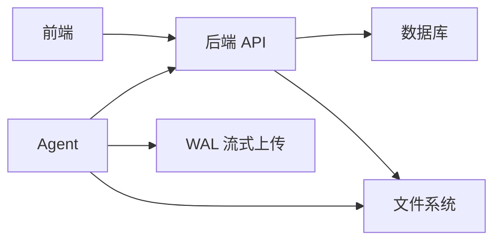

# 项目概述

<cite>
**本文引用的文件**
- [README.md](file://README.md)
- [backend/cmd/main.go](file://backend/cmd/main.go)
- [agent/cmd/main.go](file://agent/cmd/main.go)
- [frontend/src/main.tsx](file://frontend/src/main.tsx)
- [backend/README.md](file://backend/README.md)
- [frontend/README.md](file://frontend/README.md)
- [LICENSE](file://LICENSE)
- [install-databasus.sh](file://install-databasus.sh)
- [backend/internal/features/backups/backups/backuping/backuper.go](file://backend/internal/features/backups/backups/backuping/backuper.go)
- [agent/internal/features/wal/streamer.go](file://agent/internal/features/wal/streamer.go)
</cite>

## 目录
1. [引言](#引言)
2. [项目结构](#项目结构)
3. [核心组件](#核心组件)
4. [架构总览](#架构总览)
5. [详细组件分析](#详细组件分析)
6. [依赖关系分析](#依赖关系分析)
7. [性能考量](#性能考量)
8. [故障排查指南](#故障排查指南)
9. [结论](#结论)
10. [附录](#附录)

## 引言
Databasus 是一款开源、自托管的数据库备份管理平台，核心聚焦于 PostgreSQL，同时兼容 MySQL、MariaDB 与 MongoDB。项目以“隐私优先、零信任存储、企业级安全”为核心价值主张，提供多数据库支持、智能调度备份、灵活的保留策略、多存储目的地集成、企业级安全保护与团队协作能力。Databasus 同时提供远程直连与轻量 Agent 两种连接模式，支持逻辑备份、物理备份与增量（基于 WAL）备份，满足从日常归档到灾难恢复的全场景需求。

- 产品定位：开源、自托管、零锁死的数据库备份平台
- 核心数据库：PostgreSQL（12–18）、MySQL（5.7–9）、MariaDB（10–12）、MongoDB（4–8）
- 安全特性：AES-256-GCM 加密、只读用户、加密存储与传输、零信任
- 部署形态：Docker、Compose、Kubernetes（Helm）、自动化安装脚本
- 开源许可：Apache 2.0

章节来源
- [README.md:1-310](file://README.md#L1-L310)

## 项目结构
Databasus 采用前后端分离与模块化设计：
- 后端（Go/Gin）：提供 REST API、认证授权、备份调度、清理、通知、计费、审计日志、系统健康检查与版本管理等
- 前端（React/Vite）：提供仪表盘、数据库配置、备份与恢复、存储与通知配置、团队与工作区管理
- Agent（Go）：在数据库侧运行，负责 WAL 流式上传、基础备份采集、恢复执行与自动升级
- 资产与工具：内置多版本数据库客户端工具，便于测试与兼容性验证
- 部署：提供 Docker Compose、Helm Chart 与一键安装脚本

图表来源
- [frontend/src/main.tsx:1-14](file://frontend/src/main.tsx#L1-L14)
- [backend/cmd/main.go:1-491](file://backend/cmd/main.go#L1-L491)
- [agent/cmd/main.go:1-246](file://agent/cmd/main.go#L1-L246)
- [agent/internal/features/wal/streamer.go:1-205](file://agent/internal/features/wal/streamer.go#L1-L205)

章节来源
- [backend/README.md:1-69](file://backend/README.md#L1-L69)
- [frontend/README.md:1-40](file://frontend/README.md#L1-L40)

## 核心组件
- 后端 API 服务：路由注册、认证中间件、公开/受保护接口、后台任务（备份/恢复/清理/健康检查/遥测/账单）
- 数据库代理服务（Agent）：启动/停止/状态查询、WAL 流式上传、基础备份采集、恢复执行、自动升级
- 前端用户界面：数据库管理、备份计划、存储与通知配置、工作区与权限、审计日志与系统信息
- 存储与通知：本地、S3/R2、Google Drive、NAS、FTP/SFTP、Rclone 等存储；邮件、Slack、Discord、Telegram、Webhook 等通知
- 安全与合规：AES-256-GCM 加密、只读用户、加密字段、零信任存储、审计日志、密码重置命令行工具
- 团队协作：工作区、角色权限、访问控制、审计日志

章节来源
- [README.md:38-120](file://README.md#L38-L120)
- [backend/cmd/main.go:213-276](file://backend/cmd/main.go#L213-L276)
- [agent/cmd/main.go:30-171](file://agent/cmd/main.go#L30-L171)

## 架构总览
Databasus 的整体交互流程如下：
- 用户通过前端配置数据库、备份计划、存储与通知
- 后端 API 接收请求并持久化配置，触发备份调度器
- 备份节点根据分配执行备份，支持进度上报与取消
- 对于 PostgreSQL，Agent 可流式上传 WAL 段，实现增量备份与 PITR
- 备份完成后写入存储，并可发送通知；同时更新数据库最近备份时间与元数据
- 支持恢复流程，可按备份 ID 或目标时间点进行恢复

图表来源
- [backend/cmd/main.go:213-276](file://backend/cmd/main.go#L213-L276)
- [backend/internal/features/backups/backups/backuping/backuper.go:122-360](file://backend/internal/features/backups/backups/backuping/backuper.go#L122-L360)
- [agent/internal/features/wal/streamer.go:123-173](file://agent/internal/features/wal/streamer.go#L123-L173)

## 详细组件分析

### 后端 API 服务（Gin）
- 路由分组：公开路由（登录、健康检查、Agent 控制）、受保护路由（用户、工作区、数据库、备份、恢复、存储、通知、审计、计费等）
- 中间件：GZIP 压缩、CORS（开发环境）、认证中间件
- 后台任务：备份调度、备份清理、恢复调度、健康检查尝试、审计日志清理、下载令牌清理、节点注册表、遥测、账单（云版）
- 前端静态资源挂载：SPA 回退至 index.html
- Swagger 文档生成（开发环境）

图表来源
- [backend/cmd/main.go:65-137](file://backend/cmd/main.go#L65-L137)
- [backend/cmd/main.go:213-276](file://backend/cmd/main.go#L213-L276)
- [backend/cmd/main.go:293-374](file://backend/cmd/main.go#L293-L374)

章节来源
- [backend/cmd/main.go:112-137](file://backend/cmd/main.go#L112-L137)
- [backend/cmd/main.go:213-276](file://backend/cmd/main.go#L213-L276)
- [backend/cmd/main.go:293-374](file://backend/cmd/main.go#L293-L374)

### 数据库代理服务（Agent）
- 命令集：start、stop、status、restore、version
- 自动升级：检查并替换自身二进制后重新执行
- WAL 流式上传：周期扫描 WAL 目录，zstd 压缩后上传，带空闲超时检测
- 恢复执行：支持按备份 ID 或目标时间点进行恢复，支持主机与容器两种模式

图表来源
- [agent/cmd/main.go:50-171](file://agent/cmd/main.go#L50-L171)
- [agent/internal/features/wal/streamer.go:44-90](file://agent/internal/features/wal/streamer.go#L44-L90)
- [agent/internal/features/wal/streamer.go:123-173](file://agent/internal/features/wal/streamer.go#L123-L173)

章节来源
- [agent/cmd/main.go:30-171](file://agent/cmd/main.go#L30-L171)
- [agent/internal/features/wal/streamer.go:1-205](file://agent/internal/features/wal/streamer.go#L1-L205)

### 备份节点与通知
- 备份节点：接收任务、拉取数据库与存储配置、执行备份用例、进度上报、失败处理、清理部分文件、更新数据库最后备份时间、发送通知
- 通知：支持多种渠道，按配置在成功/失败时发送标题与消息

图表来源
- [backend/internal/features/backups/backups/backuping/backuper.go:122-360](file://backend/internal/features/backups/backups/backuping/backuper.go#L122-L360)

章节来源
- [backend/internal/features/backups/backups/backuping/backuper.go:122-360](file://backend/internal/features/backups/backups/backuping/backuper.go#L122-L360)

### 前端入口与开发
- 入口：React 应用在 main.tsx 初始化并挂载根节点
- 开发：提供 npm 脚本用于开发服务器、构建、Lint 与格式化

章节来源
- [frontend/src/main.tsx:1-14](file://frontend/src/main.tsx#L1-L14)
- [frontend/README.md:1-40](file://frontend/README.md#L1-L40)

## 依赖关系分析
- 后端依赖：Gin、Swagger、CORS、GZIP、数据库迁移工具 goose、缓存、日志与指标输出
- 前端依赖：React、Day.js、Vite、ESLint/Prettier
- Agent 依赖：压缩库、HTTP 客户端、信号与进程管理
- 部署依赖：Docker、Compose、Helm、Shell 脚本

图表来源
- [backend/cmd/main.go:213-276](file://backend/cmd/main.go#L213-L276)
- [agent/internal/features/wal/streamer.go:123-173](file://agent/internal/features/wal/streamer.go#L123-L173)

章节来源
- [backend/cmd/main.go:213-276](file://backend/cmd/main.go#L213-L276)
- [agent/cmd/main.go:30-171](file://agent/cmd/main.go#L30-L171)

## 性能考量
- 压缩与传输：WAL 采用 zstd 压缩，减少网络与存储占用；GZIP 压缩 API 响应
- 进度上报与取消：备份过程中实时更新大小与耗时，支持取消与清理部分文件
- 节点注册与心跳：备份/恢复节点定期心跳，确保任务分配与可观测性
- 存储与清理：后台任务定期清理过期下载令牌与审计日志，避免无界增长

章节来源
- [agent/internal/features/wal/streamer.go:175-204](file://agent/internal/features/wal/streamer.go#L175-L204)
- [backend/cmd/main.go:117-125](file://backend/cmd/main.go#L117-L125)
- [backend/cmd/main.go:293-374](file://backend/cmd/main.go#L293-L374)

## 故障排查指南
- 密码重置：通过命令行参数设置新密码，需提供邮箱
- 日志与错误：HTTP panic 记录堆栈与路径；备份失败记录详细错误与上下文
- 升级与重启：Agent 升级后会重新执行自身；如升级失败或异常，检查日志与网络可达性
- 健康检查：后端提供系统健康检查与数据库健康检查尝试控制器
- 前端静态回退：若路由未命中，回退到 index.html，确认构建产物存在

章节来源
- [backend/cmd/main.go:139-173](file://backend/cmd/main.go#L139-L173)
- [backend/cmd/main.go:459-476](file://backend/cmd/main.go#L459-L476)
- [agent/cmd/main.go:173-193](file://agent/cmd/main.go#L173-L193)

## 结论
Databasus 以清晰的模块化架构、完善的多数据库与多存储支持、企业级安全与团队协作能力，为用户提供从日常备份到灾难恢复的全栈解决方案。后端 API、前端 UI 与 Agent 协同工作，既适合个人自托管，也适用于企业级生产环境。配合 Apache 2.0 开源许可与持续的社区支持，Databasus 成为开源数据库备份领域的重要选择。

## 附录
- 安装方式：自动化脚本、Docker run、Docker Compose、Kubernetes（Helm）
- 使用流程：添加数据库 → 配置计划 → 设置连接与存储 → 设定保留策略 → 可选通知 → 保存并开始
- 许可证：Apache 2.0

章节来源
- [README.md:124-222](file://README.md#L124-L222)
- [README.md:225-248](file://README.md#L225-L248)
- [LICENSE:1-203](file://LICENSE#L1-L203)
- [install-databasus.sh:1-141](file://install-databasus.sh#L1-L141)